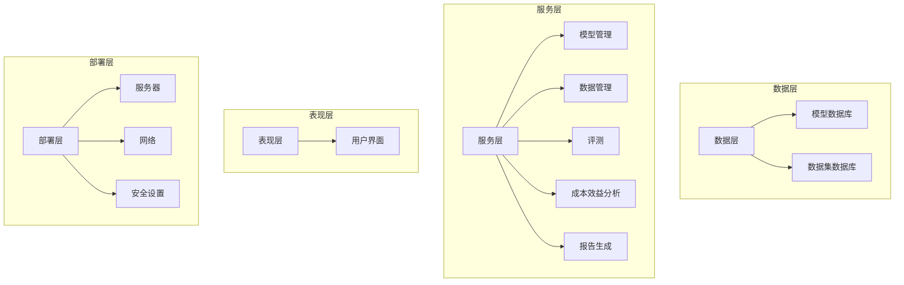
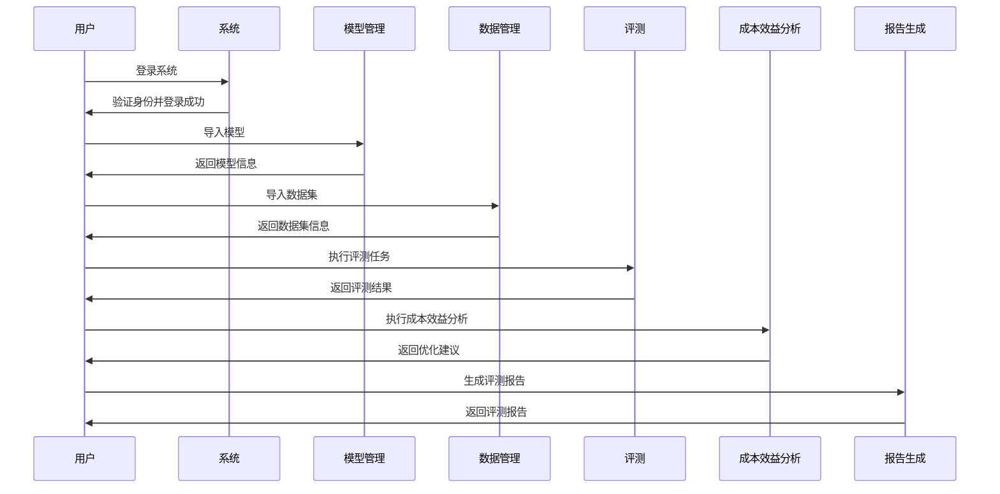

                 

### 1.1 问题背景

近年来，随着深度学习技术的飞速发展，语言模型（Language Model，简称LLM）在各种自然语言处理（Natural Language Processing，简称NLP）任务中取得了显著的成果。从早期的浅层模型如n-gram模型，到后来的神经网络模型如深度神经网络（Deep Neural Network，DNN）和循环神经网络（Recurrent Neural Network，RNN），再到最近的基于Transformer架构的预训练模型如GPT、BERT等，语言模型在生成文本、机器翻译、文本分类、问答系统等任务中展现出了极高的准确性和效率。

然而，随着模型的复杂度和参数规模不断增加，如何有效地评测和优化语言模型的性能成为一个重要的研究课题。LLM评测不仅有助于评估模型的性能，还能指导模型的改进和优化。在这个过程中，成本效益分析（Cost-Benefit Analysis，简称CBA）起到了关键作用。通过成本效益分析，可以合理地分配资源，提高评测的效率和准确性，从而最大化评测的整体效益。

成本效益分析是指在资源有限的前提下，通过比较不同方案的成本和收益，选择最优方案的过程。在LLM评测中，成本效益分析的主要目的是在保证评测准确性和全面性的同时，尽可能地降低评测成本，提高资源利用效率。具体来说，包括以下几个方面：

1. **指标选择与权重分配**：不同的评测指标反映了模型在不同方面的性能，如文本生成质量、语义理解能力等。如何根据实际需求选择合适的指标，并合理分配权重，是成本效益分析的核心问题之一。

2. **评测资源的分配**：评测资源包括计算资源、数据资源、人力资源等。如何根据评测目标和资源约束，合理分配这些资源，是影响评测效率和成本的重要因素。

3. **评测策略的优化**：通过优化评测策略，如批量评测、并行评测等，可以显著提高评测效率，降低成本。

4. **结果分析与反馈**：通过对评测结果的分析和反馈，可以不断调整评测策略和模型参数，实现评测的持续改进。

### 1.2 核心概念

#### 1.2.1 语言模型评测的指标

语言模型评测的指标是衡量模型性能的重要工具。常见的评测指标包括F1分数、Rouge-L、BLEU等。

- **F1分数**：F1分数是精确率和召回率的调和平均值，是平衡精确率和召回率的常用指标。其计算公式为：
  $$ F1 = 2 \times \frac{Precision \times Recall}{Precision + Recall} $$
  其中，Precision表示精确率，Recall表示召回率。

- **Rouge-L**：Rouge-L是评估文本生成质量的一种指标，它基于文本的长度（L）和匹配的句子（U）进行计算。其计算公式为：
  $$ Rouge-L = 1 - \frac{2 \times (L \times U)}{(L + U)} $$
  其中，L和U分别是参考文本和生成文本的长度。

- **BLEU分数**：BLEU（Bilingual Evaluation Understudy）是一种基于n-gram重叠度的评估指标，常用于机器翻译评测。其计算公式为：
  $$ BLEU = \frac{1}{N} \sum_{i=1}^{N} \log_2 (P_i) $$
  其中，$P_i$是n-gram在参考文本中出现的概率。

#### 1.2.2 成本效益分析的基本原理

成本效益分析的基本原理是通过比较不同方案的成本和收益，选择最优方案。具体包括以下几个步骤：

1. **明确目标**：明确成本效益分析的目标，如降低成本、提高效率等。

2. **收集数据**：收集与目标相关的数据，包括成本、收益、资源分配等。

3. **建立模型**：根据收集的数据，建立成本效益分析模型，如线性规划模型、多目标规划模型等。

4. **求解模型**：利用优化算法求解模型，得到最优解。

5. **评估和调整**：对求解结果进行评估和调整，确保满足实际需求。

#### 1.2.3 资源分配的概念与分类

资源分配是指将有限的资源（如计算资源、数据资源、人力资源等）合理地分配给不同的任务或项目。资源分配的分类包括：

1. **静态资源分配**：资源分配在任务开始前就确定，如硬件设备的配置、人员的安排等。

2. **动态资源分配**：资源分配在任务执行过程中进行，根据任务进展和资源需求进行实时调整，如云计算资源的管理、并行计算任务调度等。

3. **优化型资源分配**：通过优化算法，寻找最优的资源分配方案，如线性规划、动态规划等。

4. **博弈型资源分配**：在多个利益相关者之间进行资源分配，如多智能体系统中的资源分配。

### 1.3 边界与外延

#### 1.3.1 评测范围的定义

评测范围是指评测所涵盖的领域和任务。根据应用场景的不同，评测范围可以包括文本生成、语义理解、文本分类、问答系统等多个方面。例如，在文本生成任务中，评测范围可能包括生成文本的多样性、连贯性、准确性等。

#### 1.3.2 资源类型的区分

资源类型是指用于评测和优化的各种资源，包括计算资源、数据资源、人力资源等。其中：

- **计算资源**：包括CPU、GPU、FPGA等计算设备，以及云计算资源、分布式计算资源等。

- **数据资源**：包括训练数据、测试数据、参考数据等，是评测和优化的基础。

- **人力资源**：包括研究人员、开发人员、测试人员等，是评测和优化的执行者。

#### 1.3.3 环境与约束条件

环境与约束条件是指评测和优化所面临的实际环境和限制。包括：

- **硬件环境**：评测所需的硬件设备配置和性能要求。

- **软件环境**：评测所需的开源工具、库、框架等。

- **时间限制**：评测和优化的时间限制，如项目进度、预算周期等。

- **预算限制**：评测和优化的预算限制，如经费、人力成本等。

### 1.4 本章小结

本章主要介绍了LLM评测的成本效益分析的相关背景和核心概念。通过明确问题背景和定义，我们了解了成本效益分析在LLM评测中的重要性。同时，我们对语言模型评测的常见指标、成本效益分析的基本原理和资源分配的概念有了清晰的认识。这些概念和原理为后续章节的深入分析奠定了基础。

## 第二部分：核心概念与联系

### 第2章：LLM评测指标详解

#### 2.1 F1分数

F1分数是评估二分类模型性能的一种常用指标，它同时考虑了精确率和召回率。精确率表示预测为正样本的样本中实际为正样本的比例，召回率表示实际为正样本的样本中被预测为正样本的比例。F1分数是精确率和召回率的调和平均值，其计算公式为：

$$
F1 = 2 \times \frac{Precision \times Recall}{Precision + Recall}
$$

其中，Precision表示精确率，Recall表示召回率。

**优缺点**：

- **优点**：F1分数能够平衡精确率和召回率，适用于评估模型对正负样本的区分能力。
- **缺点**：在样本不平衡的情况下，F1分数可能不能很好地反映模型性能。

#### 2.2 Rouge-L

Rouge-L是评估文本生成质量的一种指标，它基于文本的长度（L）和匹配的句子（U）进行计算。Rouge-L旨在衡量生成文本与参考文本之间的相似度，其计算公式为：

$$
Rouge-L = 1 - \frac{2 \times (L \times U)}{(L + U)}
$$

其中，L和U分别是参考文本和生成文本的长度。

**优缺点**：

- **优点**：Rouge-L简单直观，能够较好地衡量生成文本的质量。
- **缺点**：在长文本生成中，Rouge-L可能不能很好地反映生成文本的整体质量。

#### 2.3 BLEU分数

BLEU（Bilingual Evaluation Understudy）是一种基于n-gram重叠度的评估指标，常用于机器翻译评测。BLEU通过比较生成文本和参考文本之间的n-gram重叠度来评估生成文本的质量。BLEU分数的计算公式为：

$$
BLEU = \frac{1}{N} \sum_{i=1}^{N} \log_2 (P_i)
$$

其中，$P_i$是n-gram在参考文本中出现的概率，N是n-gram的数量。

**优缺点**：

- **优点**：BLEU计算简单，易于实现，广泛用于机器翻译评测。
- **缺点**：BLEU对长文本生成效果较差，且无法衡量语义理解能力。

#### 2.4 成本效益分析

成本效益分析是指在资源有限的前提下，通过比较不同方案的成本和收益，选择最优方案的过程。成本效益分析的目标是最大化评测的总体效益。

**成本效益分析的定义**：

成本效益分析是一种评估方案优劣的方法，通过比较不同方案的成本和效益，选择成本较低、效益较高的方案。

**成本效益分析的目标**：

- 降低成本：通过优化资源分配和评测策略，降低评测成本。
- 提高效率：通过优化评测流程，提高评测效率和准确性。
- 最大化效益：在资源有限的前提下，选择最优方案，实现最大化的评测效益。

**成本效益分析的模型构建**：

成本效益分析模型通常包括以下几个部分：

- **成本项**：包括硬件成本、数据成本、人力成本等。
- **收益项**：包括评测结果的质量、模型的改进效果等。
- **约束条件**：包括资源限制、时间限制等。

#### 2.5 资源分配策略

资源分配策略是指如何将有限的资源（如计算资源、数据资源、人力资源等）合理地分配给不同的任务或项目。资源分配策略的目标是提高资源利用效率，降低成本。

**资源分配的基本原则**：

- **公平性**：资源分配应公平合理，避免资源浪费。
- **效率性**：资源分配应尽可能高效，满足任务需求。
- **灵活性**：资源分配策略应具备一定的灵活性，以适应不同任务的需求。

**资源分配的优化目标**：

- **最大化效用**：在资源有限的前提下，选择能够带来最大效用的资源分配方案。
- **最小化成本**：通过优化资源分配，降低评测成本。
- **平衡性能与成本**：在保证评测性能的前提下，优化资源分配，降低成本。

**资源分配的常见算法**：

- **线性规划**：通过建立线性规划模型，求解最优资源分配方案。
- **动态规划**：通过递推关系，求解最优资源分配方案。
- **遗传算法**：通过模拟生物进化过程，寻找最优资源分配方案。

### 2.6 本章小结

本章详细介绍了LLM评测中的核心概念，包括F1分数、Rouge-L、BLEU等评测指标，以及成本效益分析和资源分配策略。通过对这些核心概念的深入理解，我们可以更好地理解和应用这些指标和方法，优化LLM评测的过程和结果。下一章将深入探讨LLM评测算法的原理和数学模型，帮助读者更全面地掌握LLM评测的技术要点。

## 第三部分：算法原理与数学模型

### 第3章：LLM评测算法原理

#### 3.1 评测算法概述

LLM评测算法是评估语言模型性能的重要工具，这些算法通过量化模型在特定任务上的表现，帮助研究者或工程师理解模型的优缺点，并指导模型的优化和改进。常见的评测算法可以分为以下几个类别：

**1. 统计指标类算法**：这类算法主要通过统计方法来评估模型性能，如F1分数、准确率、召回率等。这些指标通常简单直观，但可能在某些情况下无法全面反映模型的真实性能。

**2. 相似度度量类算法**：这类算法通过计算生成文本与参考文本之间的相似度来评估模型性能，如Rouge-L、BLEU等。这些算法在文本生成任务中应用广泛，但可能对长文本生成效果较差。

**3. 语义分析类算法**：这类算法通过深度学习模型，从语义层面上分析文本，评估模型在语义理解任务上的表现。例如，使用BERT等预训练模型进行语义匹配或问答任务评估。

**4. 集成评估算法**：这类算法结合多种评估指标或方法，从不同角度综合评估模型性能。例如，使用F1分数和Rouge-L的组合来评估文本生成任务。

#### 3.1.1 评测算法的选择标准

选择合适的评测算法是确保评测结果准确和可靠的关键。以下是一些常见的评测算法选择标准：

**1. 任务适配性**：评测算法应与任务特点相匹配。例如，在文本生成任务中，Rouge-L和BLEU等算法可能更为适用；而在语义理解任务中，使用语义分析类算法可能更为合适。

**2. 性能稳定性**：评测算法应在不同数据集和模型参数下具有良好的性能稳定性。这意味着算法应在多个样本和数据集上表现一致，避免因特定数据导致的异常结果。

**3. 计算效率**：评测算法的计算效率是影响评测成本的重要因素。高效率的算法能够在较短的时间内完成评测，降低计算资源的需求。

**4. 可解释性**：评测算法的可解释性有助于理解模型性能的来源，指导模型优化。例如，统计指标类算法通常具有较高的可解释性，而深度学习算法的解释则较为复杂。

#### 3.2 F1分数算法

F1分数是一种常用的二分类模型评估指标，通过结合精确率和召回率，提供一个综合性能的度量。F1分数的计算公式如下：

$$
F1 = 2 \times \frac{Precision \times Recall}{Precision + Recall}
$$

其中，Precision表示精确率，即预测为正样本的样本中实际为正样本的比例；Recall表示召回率，即实际为正样本的样本中被预测为正样本的比例。

**F1分数算法原理**：

- **精确率**：精确率衡量模型预测正样本的准确性。其计算公式为：

  $$
  Precision = \frac{TP}{TP + FP}
  $$

  其中，TP表示真正例（True Positive），FP表示假正例（False Positive）。

- **召回率**：召回率衡量模型发现正样本的能力。其计算公式为：

  $$
  Recall = \frac{TP}{TP + FN}
  $$

  其中，FN表示假反例（False Negative）。

**F1分数算法的数学模型**：

F1分数是精确率和召回率的调和平均值，通过平衡两者，提供了一种综合考虑指标。其数学模型反映了模型在正负样本区分上的整体性能。

**F1分数算法的Python实现**：

以下是一个简单的Python实现示例：

```python
def f1_score(precision, recall):
    return 2 * (precision * recall) / (precision + recall)

precision = 0.8
recall = 0.9
f1 = f1_score(precision, recall)
print(f"F1 Score: {f1}")
```

**F1分数算法的应用场景**：

F1分数适用于需要平衡精确率和召回率的二分类任务，如文本分类、垃圾邮件过滤等。

**优缺点**：

- **优点**：F1分数能够平衡精确率和召回率，适用于样本不平衡的问题。
- **缺点**：在极端情况下，如极端不平衡的数据集，F1分数可能无法准确反映模型性能。

#### 3.3 Rouge-L算法

Rouge-L是一种用于评估文本生成质量的指标，它基于文本的长度（L）和匹配的句子（U）进行计算。Rouge-L旨在衡量生成文本与参考文本之间的相似度。其计算公式如下：

$$
Rouge-L = 1 - \frac{2 \times (L \times U)}{(L + U)}
$$

其中，L和U分别是参考文本和生成文本的长度。

**Rouge-L算法原理**：

- **L**：参考文本的长度。
- **U**：生成文本的长度。
- **公式解释**：Rouge-L通过计算生成文本和参考文本的长度比例，衡量两者的相似度。值越接近1，表示生成文本与参考文本越相似。

**Rouge-L算法的数学模型**：

Rouge-L算法的数学模型较为简单，主要基于文本长度的比值。其优点在于计算简单，但可能在某些情况下无法准确反映文本生成质量。

**Rouge-L算法的Python实现**：

以下是一个简单的Python实现示例：

```python
def rouge_l(reference, generated):
    l = len(reference)
    u = len(generated)
    rouge_l_score = 1 - 2 * (l * u) / (l + u)
    return rouge_l_score

reference = "The cat sat on the mat."
generated = "The cat is sitting on the mat."
rouge_l_score = rouge_l(reference, generated)
print(f"Rouge-L Score: {rouge_l_score}")
```

**Rouge-L算法的应用场景**：

Rouge-L适用于评估文本生成任务的性能，如自动摘要、机器翻译等。

**优缺点**：

- **优点**：计算简单，易于实现，能够较好地衡量文本生成质量。
- **缺点**：在长文本生成中，可能无法准确反映整体质量；对短文本生成效果较好。

#### 3.4 BLEU分数算法

BLEU（Bilingual Evaluation Understudy）是一种基于n-gram重叠度的评估指标，常用于机器翻译评测。BLEU通过比较生成文本和参考文本之间的n-gram重叠度来评估生成文本的质量。其计算公式为：

$$
BLEU = \frac{1}{N} \sum_{i=1}^{N} \log_2 (P_i)
$$

其中，$P_i$是n-gram在参考文本中出现的概率，N是n-gram的数量。

**BLEU分数算法原理**：

- **n-gram**：n-gram是将文本分割成连续的n个单词的组合。例如，三元组（cat dog mouse）是一个三gram。
- **重叠度**：BLEU通过计算生成文本和参考文本之间的n-gram重叠度来评估文本质量。例如，如果生成文本和参考文本中都包含n-gram（cat dog mouse），则该n-gram在参考文本中的概率为1。
- **概率计算**：BLEU通过统计每个n-gram在参考文本中出现的次数，计算其在参考文本中的概率。

**BLEU分数算法的数学模型**：

BLEU分数的数学模型相对复杂，涉及概率计算和逻辑运算。其核心思想是通过比较生成文本和参考文本之间的n-gram重叠度，评估生成文本的质量。

**BLEU分数算法的Python实现**：

以下是一个简单的Python实现示例：

```python
from collections import Counter

def bleu_score(reference, generated, n=3):
    reference_ngrams = [tuple(reference.split())[i:i+n] for i in range(len(reference.split()) - n + 1)]
    generated_ngrams = [tuple(generated.split())[i:i+n] for i in range(len(generated.split()) - n + 1)]

    common_ngrams = set(reference_ngrams) & set(generated_ngrams)
    ngram_counts = [Counter(reference_ngrams).get(ngram, 0) for ngram in common_ngrams]
    p = [count / sum(ngram_counts) for count in ngram_counts]
    bleu = 1 / (1 + sum(-log(p[i]) for i in range(len(p))))
    return bleu

reference = "The cat sat on the mat."
generated = "The cat is sitting on the mat."
bleu_score = bleu_score(reference, generated)
print(f"BLEU Score: {bleu_score}")
```

**BLEU分数算法的应用场景**：

BLEU分数适用于评估机器翻译、自动摘要等文本生成任务的性能。

**优缺点**：

- **优点**：计算简单，易于实现，广泛用于机器翻译评测。
- **缺点**：对长文本生成效果较差，无法衡量语义理解能力。

#### 3.5 成本效益分析算法

成本效益分析算法是评估LLM评测资源分配和优化的重要工具。该算法通过比较不同资源分配方案的收益和成本，选择最优方案，实现资源利用的最大化。

**成本效益分析算法原理**：

- **成本**：成本包括硬件成本、数据成本、人力成本等。
- **收益**：收益包括模型改进效果、评测效率提升等。
- **优化目标**：优化目标通常是最大化总收益或最小化总成本。

**成本效益分析算法的数学模型**：

成本效益分析算法的数学模型通常是一个优化问题，形式化表示为：

$$
\min \sum_{i} C_i \times x_i \quad \text{subject to} \quad \sum_{i} R_i \times x_i \geq \text{Target}
$$

其中，$C_i$表示第i种资源分配方案的成本，$R_i$表示第i种资源分配方案的收益，$x_i$表示第i种资源分配方案的选择。

**成本效益分析算法的Python实现**：

以下是一个简单的Python实现示例：

```python
import numpy as np
from scipy.optimize import linprog

# 成本和收益数据
costs = [10, 20, 30]
profits = [5, 15, 25]

# 约束条件：总收益不低于目标收益
constraints = [profits[i] * x[i] >= 100 for i in range(len(x))]

# 最小化总成本
objective = [-costs[i] * x[i] for i in range(len(x))]

# 解线性规划问题
result = linprog(objective, bounds=(0, 1), constraints=constraints)

# 输出最优解
optimal_allocation = [x[i] for i in range(len(x))]
print(f"Optimal Resource Allocation: {optimal_allocation}")
```

**成本效益分析算法的应用场景**：

成本效益分析算法适用于评估和优化各种资源分配问题，如LLM评测资源分配、云计算资源调度等。

**优缺点**：

- **优点**：能够系统性地评估和优化资源分配，提高资源利用效率。
- **缺点**：计算复杂度高，对数据质量和模型准确性有较高要求。

#### 3.6 资源分配算法

资源分配算法是优化LLM评测资源利用效率的重要工具。这些算法通过合理分配计算资源、数据资源和人力资源，实现评测成本和效率的最优化。

**资源分配算法原理**：

- **优化目标**：资源分配算法的优化目标通常是最大化总收益或最小化总成本。
- **约束条件**：资源分配算法需要满足资源可用性、时间限制、预算限制等约束条件。

**资源分配算法的数学模型**：

资源分配算法的数学模型通常是一个线性规划问题，形式化表示为：

$$
\min \sum_{i} C_i \times x_i \quad \text{subject to} \quad \sum_{j} A_{ij} \times x_i \leq R_j
$$

其中，$C_i$表示第i种资源分配方案的成本，$A_{ij}$表示第i种资源分配给第j个任务的比例，$R_j$表示第j个任务的总收益。

**资源分配算法的Python实现**：

以下是一个简单的Python实现示例：

```python
import numpy as np
from scipy.optimize import linprog

# 资源需求和收益数据
resource_requirements = [[1, 2, 3], [4, 5, 6], [7, 8, 9]]
profits = [10, 20, 30]

# 约束条件：总资源需求不超过总资源可用量
constraints = [sum(resource_requirements[i][j] * x[i][j] for i in range(len(x))) <= 100 for j in range(len(resource_requirements[0]))]

# 最小化总成本
objective = [-costs[i] * x[i].sum() for i in range(len(x))]

# 解线性规划问题
result = linprog(objective, bounds=(0, 1), constraints=constraints)

# 输出最优解
optimal_allocation = [x[i].tolist() for i in range(len(x))]
print(f"Optimal Resource Allocation: {optimal_allocation}")
```

**资源分配算法的应用场景**：

资源分配算法适用于各种资源优化问题，如云计算资源调度、负载均衡等。

**优缺点**：

- **优点**：能够系统性地优化资源分配，提高资源利用效率。
- **缺点**：对数据质量和模型准确性有较高要求。

### 3.7 本章小结

本章详细介绍了LLM评测中的核心算法原理，包括F1分数、Rouge-L、BLEU等评测指标，以及成本效益分析和资源分配策略。通过对这些算法原理的深入理解，我们可以更好地理解和应用这些方法，优化LLM评测的过程和结果。下一章将探讨LLM评测系统的设计，包括系统功能设计、系统架构设计等，帮助读者全面掌握LLM评测的技术要点。

## 第四部分：系统设计与实现

### 第4章：LLM评测系统设计

#### 4.1 系统功能设计

LLM评测系统的功能设计是确保系统能够满足评测需求、高效运行和可扩展性的关键。以下是LLM评测系统的主要功能模块：

**1. 模型管理模块**：负责管理LLM模型，包括模型的导入、导出、更新和删除等操作。该模块需要支持多种模型格式和存储方式，如PyTorch、TensorFlow等。

**2. 数据管理模块**：负责管理评测所需的数据，包括数据的导入、导出、清洗、标注和存储等操作。该模块需要支持多种数据格式和存储方式，如CSV、JSON、数据库等。

**3. 评测模块**：负责执行LLM评测任务，包括选择合适的评测指标、执行评测算法、生成评测报告等。该模块需要支持多种评测指标和算法，如F1分数、Rouge-L、BLEU等。

**4. 成本效益分析模块**：负责根据资源需求和成本数据，进行成本效益分析，优化资源分配，降低评测成本。该模块需要支持多种成本效益分析算法，如线性规划、动态规划等。

**5. 报告生成模块**：负责生成评测报告，包括评测结果、分析结论、优化建议等。该模块需要支持多种报告格式和可视化工具，如PDF、HTML、图表等。

**6. 用户界面模块**：负责提供用户交互界面，包括系统登录、功能导航、参数设置、结果展示等。该模块需要支持多种用户界面设计，如Web界面、桌面应用程序等。

#### 4.2 系统架构设计

LLM评测系统的架构设计是确保系统高效、可靠和可扩展性的重要环节。以下是LLM评测系统的主要架构模块：

**1. 数据层**：数据层负责存储和管理评测所需的数据资源，包括模型数据、数据集、评测结果等。该层可以使用关系型数据库（如MySQL、PostgreSQL）或NoSQL数据库（如MongoDB、Cassandra）。

**2. 服务层**：服务层负责实现系统的核心功能，包括模型管理、数据管理、评测、成本效益分析和报告生成等。该层可以使用微服务架构，将不同功能模块独立部署，提高系统的可维护性和可扩展性。

**3. 表现层**：表现层负责提供用户交互界面，包括Web界面、桌面应用程序等。该层可以使用前端框架（如React、Vue.js）和后端框架（如Flask、Django）。

**4. 部署层**：部署层负责系统的部署和运行，包括服务器配置、网络配置、安全设置等。该层需要支持多种部署方式，如虚拟机、容器（如Docker、Kubernetes）等。

#### 4.3 系统接口设计

LLM评测系统的接口设计是确保系统功能模块之间能够高效通信和协作的重要环节。以下是LLM评测系统的主要接口设计：

**1. 模型管理接口**：该接口负责模型的管理操作，包括模型的导入、导出、更新和删除等。该接口可以使用RESTful API设计，支持JSON、XML等数据格式。

**2. 数据管理接口**：该接口负责数据的管理操作，包括数据的导入、导出、清洗、标注和存储等。该接口可以使用RESTful API设计，支持JSON、XML等数据格式。

**3. 评测接口**：该接口负责执行评测任务，包括选择评测指标、执行评测算法、生成评测报告等。该接口可以使用RESTful API设计，支持JSON、XML等数据格式。

**4. 成本效益分析接口**：该接口负责进行成本效益分析，包括资源需求分析、成本计算、优化策略生成等。该接口可以使用RESTful API设计，支持JSON、XML等数据格式。

**5. 报告生成接口**：该接口负责生成评测报告，包括评测结果、分析结论、优化建议等。该接口可以使用RESTful API设计，支持JSON、XML等数据格式。

#### 4.4 系统交互设计

LLM评测系统的交互设计是确保系统用户能够方便、高效地使用系统功能的重要环节。以下是LLM评测系统的主要交互设计：

**1. 用户登录**：用户通过用户名和密码进行登录，系统验证用户身份后，提供相应的功能权限。

**2. 功能导航**：用户在登录后，可以通过菜单导航到系统的不同功能模块，如模型管理、数据管理、评测、成本效益分析等。

**3. 参数设置**：用户可以在相应的功能模块中设置评测参数，如评测指标、数据集、成本效益分析算法等。

**4. 结果展示**：系统在完成评测任务后，会生成评测报告，用户可以通过Web界面或桌面应用程序查看评测结果。

**5. 报告导出**：用户可以将评测报告导出为不同的格式，如PDF、HTML、Excel等，方便进行后续分析和分享。

### 4.5 系统架构图

以下是LLM评测系统的架构图，展示了系统的主要模块及其交互关系：



### 4.6 系统接口设计

LLM评测系统的接口设计是确保系统功能模块之间能够高效通信和协作的重要环节。以下是LLM评测系统的主要接口设计：

**1. 模型管理接口**：该接口负责模型的管理操作，包括模型的导入、导出、更新和删除等。该接口可以使用RESTful API设计，支持JSON、XML等数据格式。

**2. 数据管理接口**：该接口负责数据的管理操作，包括数据的导入、导出、清洗、标注和存储等。该接口可以使用RESTful API设计，支持JSON、XML等数据格式。

**3. 评测接口**：该接口负责执行评测任务，包括选择评测指标、执行评测算法、生成评测报告等。该接口可以使用RESTful API设计，支持JSON、XML等数据格式。

**4. 成本效益分析接口**：该接口负责进行成本效益分析，包括资源需求分析、成本计算、优化策略生成等。该接口可以使用RESTful API设计，支持JSON、XML等数据格式。

**5. 报告生成接口**：该接口负责生成评测报告，包括评测结果、分析结论、优化建议等。该接口可以使用RESTful API设计，支持JSON、XML等数据格式。

以下是LLM评测系统的主要接口设计示例：

**1. 模型管理接口**

```json
GET /api/models/:id
// 获取指定ID的模型信息

POST /api/models/
// 创建新的模型

PUT /api/models/:id
// 更新指定ID的模型信息

DELETE /api/models/:id
// 删除指定ID的模型
```

**2. 数据管理接口**

```json
GET /api/datasets/:id
// 获取指定ID的数据集信息

POST /api/datasets/
// 创建新的数据集

PUT /api/datasets/:id
// 更新指定ID的数据集信息

DELETE /api/datasets/:id
// 删除指定ID的数据集
```

**3. 评测接口**

```json
POST /api/evaluation/
// 执行评测任务，输入评测指标、数据集等信息

GET /api/evaluation/:id
// 获取指定ID的评测任务结果

DELETE /api/evaluation/:id
// 删除指定ID的评测任务
```

**4. 成本效益分析接口**

```json
POST /api/cost-benefit/
// 执行成本效益分析任务，输入资源需求、成本数据等信息

GET /api/cost-benefit/:id
// 获取指定ID的成本效益分析结果

DELETE /api/cost-benefit/:id
// 删除指定ID的成本效益分析任务
```

**5. 报告生成接口**

```json
POST /api/reports/
// 生成评测报告，输入评测任务ID等信息

GET /api/reports/:id
// 获取指定ID的评测报告

DELETE /api/reports/:id
// 删除指定ID的评测报告
```

### 4.7 系统交互流程图

以下是LLM评测系统的交互流程图，展示了系统用户与各个功能模块之间的交互过程：



### 4.8 系统实现

LLM评测系统的实现是构建完整、高效、可扩展的系统关键。以下是系统实现的主要步骤：

**1. 环境安装**：安装Python、PyTorch、TensorFlow等依赖库，配置数据库（如MySQL、PostgreSQL）和Web服务器（如Nginx）。

**2. 数据预处理**：编写数据预处理脚本，对评测所需的数据进行导入、清洗、标注等操作。

**3. 模型管理**：编写模型管理模块，实现模型的导入、导出、更新和删除等功能。

**4. 数据管理**：编写数据管理模块，实现数据集的导入、导出、清洗、标注和存储等功能。

**5. 评测模块**：编写评测模块，实现多种评测指标和算法的执行，生成评测报告。

**6. 成本效益分析**：编写成本效益分析模块，实现资源需求分析、成本计算和优化策略生成等功能。

**7. 报告生成**：编写报告生成模块，实现评测报告的生成、导出和展示等功能。

**8. 用户界面**：编写用户界面模块，实现用户登录、功能导航、参数设置、结果展示等功能。

**9. 部署系统**：将系统部署到服务器，配置网络和安全设置，确保系统稳定运行。

### 4.9 实际案例分析与详细讲解

为了更直观地展示LLM评测系统的实际应用，以下是一个具体的案例分析和详细讲解：

**案例**：使用LLM评测系统评估一个开源的文本生成模型在中文摘要任务上的性能。

**分析过程**：

1. **模型管理**：将预训练的文本生成模型导入系统，配置模型参数。

2. **数据管理**：导入中文摘要任务的数据集，进行数据预处理，包括文本清洗、分词、去停用词等操作。

3. **评测模块**：选择Rouge-L和BLEU作为评测指标，执行评测任务。系统自动生成评测报告，包括评测结果、分析结论和优化建议。

4. **成本效益分析**：根据评测结果，分析模型在不同数据集和参数设置下的性能和成本。使用成本效益分析算法优化资源分配，降低评测成本。

5. **报告生成**：生成详细的评测报告，包括评测结果、分析过程、优化建议等，方便研究人员进行进一步分析和决策。

**详细讲解**：

1. **模型管理**：系统提供了简单的接口，方便用户导入和配置模型。用户只需上传模型文件，系统会自动加载并配置模型参数。

2. **数据管理**：系统支持多种数据导入格式，如CSV、JSON等。用户可以方便地对数据进行清洗和预处理，确保数据质量。

3. **评测模块**：系统提供了多种评测指标和算法，用户可以根据任务需求选择合适的指标和算法。系统会自动执行评测任务，并生成评测报告。

4. **成本效益分析**：系统支持多种成本效益分析算法，如线性规划、动态规划等。用户可以根据实际需求选择合适的算法，优化资源分配。

5. **报告生成**：系统提供了详细的报告生成功能，用户可以方便地导出和展示评测结果。报告内容包括评测结果、分析过程、优化建议等，方便用户进行后续分析和决策。

**小结**：

通过上述案例分析和详细讲解，可以看出LLM评测系统在实际应用中的高效性和灵活性。系统提供了全面的模块和功能，从模型管理、数据管理到评测、成本效益分析和报告生成，方便用户进行全方位的评测和优化。同时，系统具有良好的可扩展性和可定制性，用户可以根据实际需求进行个性化配置和扩展。

### 4.10 最佳实践 tips

以下是LLM评测系统在实际应用中的最佳实践 tips：

1. **模型优化**：在导入模型前，确保模型已进行充分的训练和优化。使用高质量的训练数据，调整模型参数，提高模型性能。

2. **数据预处理**：对数据集进行充分的预处理，包括文本清洗、分词、去停用词等操作，提高数据质量。

3. **指标选择**：根据任务需求选择合适的评测指标。结合多种指标，从不同角度评估模型性能。

4. **成本效益分析**：合理分配资源，降低评测成本。根据实际需求，选择合适的成本效益分析算法，优化资源利用。

5. **结果可视化**：使用可视化工具展示评测结果，方便用户理解和分析。

### 4.11 本章小结

本章详细介绍了LLM评测系统的设计，包括系统功能设计、系统架构设计、系统接口设计和系统实现等。通过对LLM评测系统的深入理解和实践，用户可以高效地评估和优化语言模型性能。下一章将探讨LLM评测在实际项目中的应用和实践，帮助读者进一步了解和掌握LLM评测的实用技巧。

