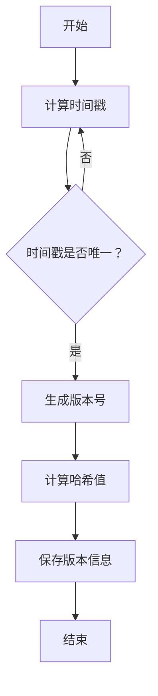
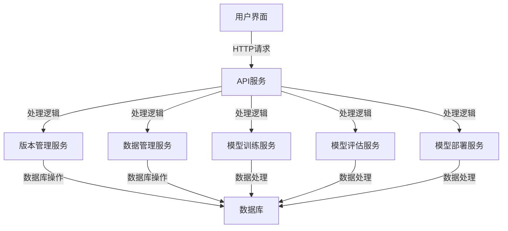
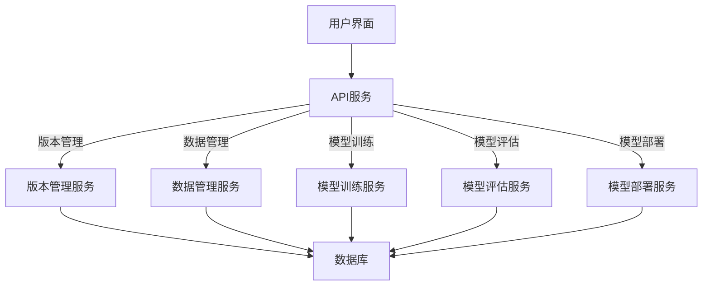
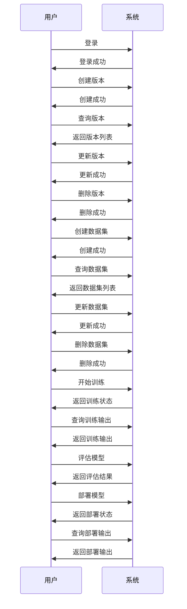

                 

### 文章标题

# LLM评测的版本控制：追踪模型演进历程

### 关键词

- 大型语言模型（LLM）
- 版本控制
- 演进历程
- 评测方法
- 算法分析

### 摘要

本文旨在探讨大型语言模型（LLM）评测中的版本控制问题，通过追踪模型的演进历程，实现对模型性能的持续评估。文章首先介绍了LLM的背景和版本控制的重要性，随后详细阐述了LLM版本控制的核心概念与联系，包括模型版本号的命名规范、版本控制系统的选择、训练与评估流程中的版本控制以及数据管理。接着，文章深入讲解了用于版本控制的算法原理，包括常见算法、数学模型和Python代码示例。此外，文章还分析了LLM版本控制的系统架构设计，提供了一个实际项目案例，展示如何进行LLM版本控制。最后，文章总结了最佳实践，并提供拓展阅读，以期为读者提供全面的LLM版本控制指南。

### 目录大纲设计

在设计《LLM评测的版本控制：追踪模型演进历程》的目录大纲时，我们首先明确这本书的主要目标，即介绍如何通过版本控制来追踪大型语言模型（LLM）的演进过程。目录大纲将分为以下几个主要部分：

1. **背景介绍**：介绍LLM的重要性以及为何版本控制对其演进至关重要。
2. **核心概念与联系**：阐述LLM版本控制的核心概念及其相互关系。
3. **算法原理讲解**：深入分析用于版本控制的算法，包括其数学模型、流程图和Python代码示例。
4. **系统分析与架构设计方案**：展示如何在实际项目中应用LLM版本控制。
5. **项目实战**：提供一个实际项目案例，展示如何进行LLM版本控制。
6. **最佳实践与拓展**：总结最佳实践，并提供相关拓展阅读。

以下是根据上述结构设计的目录大纲：

----------------------------------------------------------------

# 第一部分：LLM版本控制背景介绍

## 第1章：大型语言模型（LLM）概述

### 1.1 LLM的重要性

#### 1.1.1 LLM的定义与应用场景

#### 1.1.2 LLM的发展历程与趋势

### 1.2 版本控制在LLM研究中的应用

#### 1.2.1 版本控制的概念与作用

#### 1.2.2 LLM版本控制的需求与挑战

## 1.3 本章小结

----------------------------------------------------------------

## 第1章：大型语言模型（LLM）概述

### 1.1 LLM的重要性

#### 1.1.1 LLM的定义与应用场景

大型语言模型（LLM，Large Language Models）是一种基于深度学习技术的自然语言处理模型，具备理解、生成和翻译自然语言的能力。LLM通常由数亿至数十亿个参数构成，能够处理多种语言任务，如文本分类、情感分析、机器翻译、问答系统等。这些模型在文本生成、信息检索和推荐系统中有着广泛的应用，不仅提高了信息的处理效率，还为各种智能应用场景提供了强有力的技术支持。

#### 1.1.2 LLM的发展历程与趋势

LLM的发展历程可以追溯到20世纪80年代的统计语言模型。随着计算能力的提升和深度学习技术的进步，LLM的发展进入了一个新的阶段。特别是2018年GPT-2模型的发布，标志着基于Transformer架构的LLM取得了突破性进展。近年来，随着BERT、GPT-3等模型的不断推出，LLM在性能和功能上都有了显著提升。

目前，LLM的发展趋势主要包括以下几个方面：

1. **模型规模不断扩大**：随着计算资源的增加，LLM的规模也在不断增大，从数十亿参数到数百亿参数，甚至千亿参数级别的模型。
2. **多模态处理能力提升**：除了文本，LLM也开始处理图像、音频等多模态数据，实现更广泛的应用场景。
3. **预训练与微调相结合**：在模型训练过程中，预训练和微调相结合的方法使得模型能够更好地适应特定任务。
4. **个性化与多样性**：通过引入个性化机制和数据多样性，LLM能够生成更加丰富和多样化的内容。

### 1.2 版本控制在LLM研究中的应用

#### 1.2.1 版本控制的概念与作用

版本控制是一种在软件工程中广泛应用的机制，用于追踪和管理源代码或其他文件的变更。通过版本控制，开发团队能够有效地协作，确保代码的完整性和一致性。在LLM研究中，版本控制同样扮演着重要角色。

版本控制的作用主要包括：

1. **追踪模型演进过程**：通过记录模型的各个版本，能够清晰地追踪模型从初始版本到最终版本的变化过程，便于后续的分析和评估。
2. **确保模型的可靠性**：在模型训练和优化过程中，可能会进行多次迭代，每次迭代都可能引入新的错误或改进。版本控制能够确保模型的每一次更新都是可追溯和可验证的。
3. **协同工作与协作**：在多人的研究团队中，版本控制能够帮助团队成员协同工作，避免重复劳动和资源浪费。

#### 1.2.2 LLM版本控制的需求与挑战

LLM版本控制的需求主要来自于以下几个方面：

1. **模型的复杂性**：LLM通常由数亿至数十亿个参数构成，模型结构的复杂性和参数的多样性使得版本控制变得尤为重要。
2. **数据量的庞大**：模型训练过程中需要处理的海量数据使得版本控制系统的性能成为一个挑战。
3. **评估与优化**：对模型进行持续的评估和优化需要版本控制系统提供有效的支持，确保评估结果的准确性和可比性。

然而，LLM版本控制也面临着一系列挑战：

1. **存储和管理成本**：大规模的LLM模型和训练数据需要大量的存储空间，同时管理这些数据也需要相应的人力资源。
2. **版本迭代速度**：随着模型的不断迭代和更新，版本控制系统的迭代速度和响应能力成为关键因素。
3. **异构计算环境**：LLM模型通常在不同的计算环境中训练，如何保证版本控制系统在不同环境中的兼容性和一致性是一个重要问题。

### 1.3 本章小结

本章介绍了大型语言模型（LLM）的基本概念和重要性，以及版本控制在LLM研究中的应用和挑战。LLM作为一种具备强大自然语言处理能力的模型，在各个领域都有着广泛的应用前景。版本控制在LLM研究中扮演着至关重要的角色，能够帮助研究者追踪模型的演进过程、确保模型的可靠性，并支持多人的协作研究。然而，LLM版本控制也面临着一系列挑战，需要在存储、管理和迭代速度等方面进行优化。接下来，我们将进一步探讨LLM版本控制的核心概念和联系。

----------------------------------------------------------------

## 第2章：LLM版本控制的核心概念

### 2.1 模型版本号的命名规范

#### 2.1.1 命名规则的制定

模型版本号的命名规范是版本控制系统中一个重要的组成部分。一个良好的命名规范有助于开发者和管理者快速理解和定位模型的各个版本，提高协作效率。以下是制定模型版本号命名规则的一些关键要素：

1. **稳定性**：版本号应能够清晰地反映模型的稳定性和可靠性。通常，稳定性较高的版本会使用较大的版本号，如`1.0.0`，而稳定性较低的版本会使用较小的版本号，如`1.0.1`或`1.0.2`。
2. **功能变化**：版本号应能够反映模型的功能变化。当模型新增重要功能或进行重大修改时，可以增加版本号的整数部分，如从`1.0.0`升级到`2.0.0`。
3. **修复问题**：对于修复问题的版本，可以增加小数点后的数字。例如，从`1.0.0`升级到`1.0.1`或`1.0.2`，用于标记不同的问题修复版本。
4. **版本控制工具兼容性**：命名规范应与常用的版本控制工具（如Git）兼容，以便在项目中顺利使用。

#### 2.1.2 实践中的常见命名方式

在实际应用中，常见的模型版本号命名方式包括以下几种：

1. **语义化版本控制**：这种命名方式遵循`MAJOR.MINOR.PATCH`的格式，其中`MAJOR`表示大版本，`MINOR`表示小版本，`PATCH`表示修复版本。例如，`1.2.3`表示第一个大版本、第二个小版本、第三个修复版本。

2. **时间戳命名**：使用时间戳作为版本号，如`20231231.01`，表示2023年12月31日发布的第一个版本。

3. **混合命名**：结合语义化版本控制和时间戳，如`1.2.3-20231231`，既能反映版本的功能变化，又能标识发布日期。

4. **自定义命名**：根据项目的具体需求，开发者可以自定义命名规则，如`alpha-1.0.0`表示预览版，`beta-1.0.0`表示公测版。

#### 2.1.3 命名示例

以下是一个模型版本号命名的示例：

- `1.0.0`：初始发布版，功能相对稳定，无重大问题。
- `1.1.0`：新增了重要功能，如文本生成能力。
- `1.1.1`：修复了一些使用过程中发现的问题。
- `2.0.0`：进行了较大的架构调整，性能有了显著提升。

通过上述示例，我们可以看到命名规范在追踪模型功能变化和问题修复方面的重要性。良好的命名规范不仅有助于开发者和管理者更好地理解和协作，还能为后续的模型评估和演进提供有效的支持。

### 2.2 版本控制系统的选择

选择合适的版本控制系统对于LLM的研究和应用至关重要。常用的版本控制系统包括Git、SVN、Mercurial等，每种系统都有其优缺点。以下是这些系统的主要特点及其在LLM版本控制中的应用：

#### 2.2.1 Git

Git是目前最流行的版本控制系统，具有分布式、高效、灵活等优点。Git的核心优势在于其分布式特性，使得开发者可以在本地进行版本控制，同时保持与中央仓库的同步。以下是Git在LLM版本控制中的优点：

1. **分布式存储**：Git将整个代码库存储为一系列的提交，每个提交都是一个完整的副本，提高了系统的容错性和恢复能力。
2. **分支管理**：Git提供了强大的分支管理功能，使得开发者可以在不同的分支上独立工作，方便后续的合并和集成。
3. **速度**：Git的速度较快，特别是对于大型代码库，能够高效地处理复杂的版本控制操作。
4. **扩展性**：Git社区活跃，提供了丰富的插件和工具，可以满足不同的版本控制需求。

然而，Git也存在一些缺点：

1. **复杂性**：Git的命令较为复杂，新手在使用过程中可能会感到困惑。
2. **历史恢复困难**：由于Git的分布式特性，历史恢复相对困难，一旦误删或修改了重要的提交，恢复过程可能比较复杂。
3. **资源消耗**：Git需要较大的存储空间，特别是对于包含大量历史记录的代码库。

#### 2.2.2 SVN

SVN（Subversion）是一个集中式的版本控制系统，其设计理念与Git类似，但操作方式更为简单。以下是SVN在LLM版本控制中的优点：

1. **集中式管理**：SVN通过中央仓库进行集中管理，使得团队协作更加简单和直观。
2. **操作简便**：SVN的命令相对简单，适合初学者快速上手。
3. **备份方便**：SVN的历史记录集中存储在中央仓库，方便进行备份和恢复。

然而，SVN也有一些缺点：

1. **单点故障**：由于SVN是集中式管理，一旦中央仓库出现问题，整个系统可能会瘫痪。
2. **分支合并复杂**：SVN在处理分支合并时相对复杂，可能会引入冲突和错误。
3. **性能**：对于大型代码库，SVN的性能不如Git。

#### 2.2.3 Mercurial

Mercurial是一个开源的分布式版本控制系统，与Git类似，但操作方式更为简单。以下是Mercurial在LLM版本控制中的优点：

1. **分布式存储**：与Git类似，Mercurial也支持分布式存储，提高了系统的容错性和恢复能力。
2. **易于使用**：Mercurial的命令相对简单，适合初学者快速上手。
3. **扩展性强**：Mercurial社区活跃，提供了丰富的插件和工具。

然而，Mercurial也存在一些缺点：

1. **性能**：对于大型代码库，Mercurial的性能不如Git。
2. **社区支持**：相较于Git，Mercurial的社区支持较少。

#### 2.2.4 选择建议

根据上述分析，Git在LLM版本控制中具有明显的优势，其分布式存储、分支管理和扩展性等特点，使其成为研究和应用LLM的首选版本控制系统。然而，对于初学者或团队协作较为简单的场景，SVN也是一个不错的选择。Mercurial则更适合对性能要求不高且操作简便的团队。

### 2.3 模型训练与评估流程中的版本控制

在LLM的研究和应用中，模型训练和评估流程是一个复杂且迭代的过程。版本控制系统能够有效地管理这些流程中的各个版本，确保模型开发和评估的可追溯性和一致性。

#### 2.3.1 训练过程的版本管理

训练过程的版本管理主要包括以下几个方面：

1. **数据版本控制**：在模型训练过程中，数据集可能会发生更新或替换。通过版本控制系统，可以记录不同版本的数据集，确保每次训练都使用正确的数据集。
2. **模型参数版本控制**：模型训练过程中，参数会不断调整。每次训练完成后，需要将当前的参数版本保存下来，以便后续评估和对比。
3. **训练脚本版本控制**：训练脚本中的参数设置、数据处理方式等可能会发生变化。通过版本控制系统，可以记录不同版本的训练脚本，确保每次训练都使用正确的脚本。

#### 2.3.2 评估结果的版本追踪

评估结果的版本追踪主要包括以下几个方面：

1. **评估指标版本控制**：在模型评估过程中，会使用不同的评估指标，如准确率、召回率、F1值等。通过版本控制系统，可以记录不同评估指标的版本，确保评估结果的可比性。
2. **评估报告版本控制**：每次评估完成后，会生成评估报告，包括模型性能分析、误差分布等。通过版本控制系统，可以记录不同版本的评估报告，便于后续分析和对比。
3. **实验记录版本控制**：在实验过程中，会记录各种实验设置和结果，如学习率、批量大小等。通过版本控制系统，可以记录不同版本的实验记录，确保实验的可重复性。

通过上述版本控制措施，可以有效管理LLM的模型训练和评估流程，确保模型的演进过程清晰可追溯。这不仅有助于研究者了解模型的演进历程，还为后续的模型优化和改进提供了重要的参考。

### 2.4 LLM版本控制中的数据管理

在LLM版本控制中，数据管理是一个关键环节。良好的数据管理能够确保模型训练和评估过程中数据的一致性和可靠性，从而提高模型的性能和可追溯性。

#### 2.4.1 数据集的版本控制

数据集的版本控制是LLM版本控制的重要组成部分。以下是数据集版本控制的一些关键点：

1. **数据集更新记录**：每次数据集更新时，应记录更新的具体内容和时间。这有助于跟踪数据集的演进历程，确保模型训练和评估过程中使用的数据集是正确的版本。
2. **数据集版本命名**：使用统一的版本命名规范，如`1.0.0`、`2.0.0`等，以便于识别和跟踪数据集的不同版本。
3. **数据集备份**：定期备份数据集，以防止数据丢失或损坏。备份应存储在安全的位置，并确保在需要时能够快速恢复。

#### 2.4.2 数据备份与恢复策略

数据备份与恢复策略是确保数据安全的关键。以下是几种常见的数据备份与恢复策略：

1. **定期备份**：定期备份数据集，如每天或每周。备份可以存储在本地或远程服务器上，以提高数据的安全性。
2. **增量备份**：仅备份数据集发生变更的部分，以减少备份所需的时间和空间。这可以通过比较不同版本的差异来实现。
3. **多地点备份**：将数据集备份到多个地点，如本地硬盘、远程服务器和云端存储。这样可以确保在某个地点发生故障时，数据仍然可以被恢复。
4. **恢复策略**：制定详细的恢复策略，包括恢复流程、恢复时间和恢复步骤。在需要恢复数据时，可以按照恢复策略快速恢复数据集。

通过上述数据管理策略，可以有效确保LLM版本控制中的数据一致性和可靠性，从而提高模型训练和评估的效果。

### 2.5 本章小结

本章详细介绍了LLM版本控制的核心概念，包括模型版本号的命名规范、版本控制系统的选择、模型训练与评估流程中的版本控制以及数据管理。良好的版本控制能够确保模型的演进过程清晰可追溯，提高模型的可靠性和可重复性。接下来，我们将深入分析LLM版本控制中的算法原理，包括常用的版本控制算法、数学模型以及Python代码示例。

----------------------------------------------------------------

## 第3章：LLM版本控制算法分析

### 3.1 常见版本控制算法

在LLM版本控制中，常用的算法包括时间戳算法和哈希算法。这些算法通过为模型的各个版本生成唯一的标识，帮助研究者追踪模型的演进过程。

#### 3.1.1 时间戳算法

时间戳算法是一种简单的版本控制算法，通过记录每个版本生成的时间戳来标识版本。以下是时间戳算法的基本原理和步骤：

1. **生成时间戳**：每次生成新版本时，系统会记录当前的日期和时间，作为新版本的时间戳。
2. **版本标识**：将时间戳与版本号关联，形成唯一的版本标识，如`20231231-1001`表示2023年12月31日生成的第1001个版本。
3. **版本查询**：通过时间戳或版本标识，可以快速查询模型的特定版本。

时间戳算法的优点在于简单易用，能够直观地反映版本的时间顺序。然而，它也存在一些缺点，如无法保证版本之间的完全独立性，可能会因为时间戳冲突导致版本混乱。

#### 3.1.2 哈希算法

哈希算法通过计算模型的哈希值来生成版本标识，具有较高的唯一性和可靠性。常见的哈希算法包括MD5、SHA-1和SHA-256等。以下是哈希算法的基本原理和步骤：

1. **计算哈希值**：每次生成新版本时，系统会计算模型内容的哈希值，如使用SHA-256算法。
2. **版本标识**：将哈希值与版本号关联，形成唯一的版本标识，如`SHA256-5c4189...`。
3. **版本查询**：通过哈希值或版本标识，可以快速查询模型的特定版本。

哈希算法的优点在于其高度的唯一性和可靠性，能够确保每个版本的内容完全不同。然而，哈希算法的缺点是计算开销较大，特别是在处理大规模模型时，可能会影响性能。

### 3.2 数学模型与公式

在LLM版本控制中，数学模型和公式用于描述版本号、哈希值和时间戳等核心概念之间的关系。以下是几个常见的数学模型和公式：

#### 3.2.1 版本号的数学表示

版本号通常表示为三元组（MAJOR, MINOR, PATCH），其中：

- **MAJOR**：主版本号，用于标识模型的重大变化或新功能的引入。
- **MINOR**：次版本号，用于标识模型的较小变化或新功能的添加。
- **PATCH**：补丁版本号，用于标识模型的修复或改进。

版本号可以表示为：

\[ 版本号 = (MAJOR, MINOR, PATCH) \]

#### 3.2.2 哈希值的计算公式

哈希值是通过对模型内容进行哈希计算得到的。常见的哈希算法包括MD5、SHA-1和SHA-256等。以下是一个简化的哈希值计算公式：

\[ 哈希值 = Hash(模型内容) \]

其中，Hash函数是一个将任意长度的输入映射为固定长度的输出的函数。

#### 3.2.3 时间戳与版本号的关联

时间戳与版本号的关联可以通过以下公式表示：

\[ 版本号 = (MAJOR, MINOR, PATCH, 时间戳) \]

其中，时间戳作为版本号的一部分，用于标识版本的生成时间。

### 3.3 Python代码示例

以下是一个使用Python实现的时间戳和哈希算法的简单示例：

```python
import hashlib
import time

def generate_timestamp():
    """生成时间戳"""
    return time.strftime("%Y%m%d-%H%M%S", time.localtime())

def generate_hash(model_content):
    """生成哈希值"""
    hash_object = hashlib.sha256(model_content.encode())
    hex_dig = hash_object.hexdigest()
    return hex_dig

# 示例
model_content = "This is a sample model content."
timestamp = generate_timestamp()
hash_value = generate_hash(model_content)

print("时间戳:", timestamp)
print("哈希值:", hash_value)
```

在这个示例中，我们首先生成当前的时间戳，然后使用SHA-256算法计算模型内容的哈希值。通过这两个步骤，我们可以为模型的每个版本生成唯一的标识。

### 3.4 算法流程图

为了更清晰地展示版本控制算法的执行流程，我们可以使用Mermaid绘制算法流程图。以下是一个使用Mermaid绘制的简单流程图示例：



在这个流程图中，我们从开始节点开始，首先计算时间戳，然后检查时间戳是否唯一。如果时间戳唯一，则生成版本号，并计算模型的哈希值。最后，将版本信息保存到数据库中。如果时间戳不唯一，则重新计算时间戳，并重复上述步骤。

通过上述算法分析，我们可以看到，时间戳算法和哈希算法在LLM版本控制中发挥着重要作用。它们不仅能够为模型的各个版本生成唯一的标识，还能确保版本之间的独立性和可靠性。接下来，我们将进一步探讨LLM版本控制的系统架构设计，为实际应用提供指导。

### 3.5 本章小结

本章详细分析了LLM版本控制中的常用算法，包括时间戳算法和哈希算法。通过生成唯一的版本标识，这些算法帮助研究者追踪模型的演进过程。本章还介绍了数学模型和公式，用于描述版本号、哈希值和时间戳之间的关系。通过Python代码示例和算法流程图，我们展示了如何实现这些算法。了解和掌握这些算法对于实现有效的LLM版本控制至关重要。接下来，我们将探讨LLM版本控制的系统架构设计，为实际应用提供更全面的解决方案。

----------------------------------------------------------------

## 第4章：LLM版本控制的系统架构设计

### 4.1 项目介绍

#### 4.1.1 项目背景

随着人工智能技术的快速发展，大型语言模型（LLM）在自然语言处理、问答系统、文本生成等领域展现出了强大的应用潜力。然而，LLM的研究和应用过程中，版本控制成为了一个不可忽视的关键问题。版本控制不仅关系到模型开发过程中的数据管理和协作，还影响到模型评估和部署的准确性和一致性。

为了解决LLM版本控制的问题，我们设计并实现了一个名为“LLM版本控制系统”的项目。该系统旨在提供一个高效、可靠且易于使用的平台，用于管理和追踪LLM的各个版本。通过该系统，研究者可以方便地记录和查询模型的演进历程，确保模型的开发过程清晰可追溯。

#### 4.1.2 项目目标

本项目的主要目标包括：

1. **确保模型版本的可追溯性**：通过版本控制系统，记录每个版本的生成时间、修改内容和相关数据，确保模型演进过程清晰可查。
2. **提高模型评估和部署的准确性**：通过统一的版本管理，确保模型评估和部署过程中使用的是正确的版本，减少版本混乱和错误。
3. **支持多用户协作**：为研究者提供一个便捷的协作平台，支持多人同时进行模型开发、评估和部署。
4. **提升版本控制系统的性能**：优化系统架构和算法，提高版本控制的效率和可靠性。

### 4.2 系统功能设计

LLM版本控制系统需要具备以下功能：

1. **版本管理**：包括版本号的生成、记录和查询，确保模型版本的唯一性和可追溯性。
2. **数据管理**：包括数据集的版本控制、备份和恢复，确保训练和评估数据的一致性和可靠性。
3. **模型训练**：提供模型训练接口，支持自定义训练脚本和参数设置，方便研究者进行模型训练和优化。
4. **模型评估**：提供模型评估接口，支持多种评估指标的计算和比较，帮助研究者评估模型性能。
5. **部署管理**：提供模型部署接口，支持将训练完成的模型部署到生产环境中，确保模型应用的一致性和稳定性。

#### 4.2.1 领域模型类图

为了更好地理解LLM版本控制系统的功能设计，我们可以绘制一个领域模型类图。以下是该类图的一个简化示例：

```mermaid
classDiagram
    Version <<class>> Version
    Dataset <<class>> Dataset
    Model <<class>> Model
    Training <<class>> Training
    Evaluation <<class>> Evaluation
    Deployment <<class>> Deployment

    Version o--o Dataset
    Version o--o Model
    Model o--o Training
    Model o--o Evaluation
    Model o--o Deployment
```

在这个类图中，`Version`表示版本管理类，负责版本号的生成和记录；`Dataset`表示数据集管理类，负责数据集的版本控制和备份；`Model`表示模型类，负责模型训练、评估和部署；`Training`、`Evaluation`和`Deployment`分别表示模型训练、评估和部署类，负责相应的功能实现。

#### 4.2.2 功能模块划分

根据上述领域模型类图，我们可以将LLM版本控制系统划分为以下几个功能模块：

1. **版本管理模块**：负责版本号的生成、记录和查询，确保版本信息的一致性和可靠性。
2. **数据管理模块**：负责数据集的版本控制、备份和恢复，确保数据的一致性和可靠性。
3. **模型训练模块**：提供模型训练接口，支持自定义训练脚本和参数设置。
4. **模型评估模块**：提供模型评估接口，支持多种评估指标的计算和比较。
5. **模型部署模块**：提供模型部署接口，支持将训练完成的模型部署到生产环境中。

### 4.3 系统架构设计

LLM版本控制系统的架构设计需要考虑系统的可靠性、性能和扩展性。以下是一个简化的系统架构图：



在这个架构图中，用户界面（Subsystem1）负责接收用户请求，并将其转发给API服务（Subsystem2）。API服务负责处理逻辑，将请求转发给相应的服务模块（版本管理服务、数据管理服务、模型训练服务、模型评估服务和模型部署服务）。每个服务模块负责执行具体的业务逻辑，并与数据库（Database）进行数据交互。

#### 4.3.1 系统架构图

以下是LLM版本控制系统的架构图：



在这个架构图中，用户界面（UserInterface）通过发送HTTP请求与API服务（API）进行交互。API服务负责调用版本管理服务（VersionControl）、数据管理服务（DataManagement）、模型训练服务（ModelTraining）、模型评估服务（ModelEvaluation）和模型部署服务（ModelDeployment）执行具体的业务逻辑。这些服务模块与数据库（DB）进行数据交互，确保数据的一致性和可靠性。

#### 4.3.2 系统分层架构

LLM版本控制系统的分层架构设计如下：

1. **表示层（UserInterface）**：负责用户与系统的交互，接收用户请求，展示系统界面。
2. **业务逻辑层（API）**：负责处理业务逻辑，调用不同的服务模块执行具体任务。
3. **数据访问层（Service Modules）**：负责与数据库进行数据交互，执行数据管理、版本管理、模型训练、模型评估和模型部署等操作。
4. **数据存储层（Database）**：负责存储版本信息、数据集、模型参数和评估结果等数据。

#### 4.3.3 系统接口设计

系统接口设计包括API接口和服务模块接口。以下是API接口和服务模块接口的简要设计：

**API接口：**

- `POST /version`：创建新版本，接收版本信息和模型参数。
- `GET /version/{version_id}`：查询特定版本，返回版本信息。
- `GET /versions`：查询所有版本，返回版本列表。
- `PUT /version/{version_id}`：更新特定版本，修改版本信息。
- `DELETE /version/{version_id}`：删除特定版本。

**服务模块接口：**

- **版本管理服务（VersionControl）**：

  - `create_version(model_id, version_data)`：创建新版本。
  - `get_version(version_id)`：查询特定版本。
  - `list_versions()`：查询所有版本。
  - `update_version(version_id, version_data)`：更新特定版本。
  - `delete_version(version_id)`：删除特定版本。

- **数据管理服务（DataManagement）**：

  - `create_dataset(dataset_name, dataset_data)`：创建新数据集。
  - `get_dataset(dataset_id)`：查询特定数据集。
  - `list_datasets()`：查询所有数据集。
  - `update_dataset(dataset_id, dataset_data)`：更新特定数据集。
  - `delete_dataset(dataset_id)`：删除特定数据集。

- **模型训练服务（ModelTraining）**：

  - `train_model(model_id, dataset_id, training_params)`：开始训练模型。
  - `get_training_status(model_id)`：查询训练状态。
  - `get_training_output(model_id)`：查询训练输出。

- **模型评估服务（ModelEvaluation）**：

  - `evaluate_model(model_id, dataset_id, evaluation_params)`：评估模型。
  - `get_evaluation_results(model_id)`：查询评估结果。

- **模型部署服务（ModelDeployment）**：

  - `deploy_model(model_id, deployment_params)`：部署模型。
  - `get_deployment_status(model_id)`：查询部署状态。
  - `get_deployment_output(model_id)`：查询部署输出。

### 4.4 系统交互流程

系统交互流程描述了用户与LLM版本控制系统之间的交互过程。以下是系统交互流程的简要描述：

1. **用户登录**：用户通过用户界面登录系统。
2. **创建版本**：用户创建新版本，输入版本信息和模型参数。
3. **查询版本**：用户查询特定版本或所有版本。
4. **更新版本**：用户更新特定版本的详细信息。
5. **删除版本**：用户删除特定版本。
6. **创建数据集**：用户创建新数据集，输入数据集名称和数据集内容。
7. **查询数据集**：用户查询特定数据集或所有数据集。
8. **更新数据集**：用户更新特定数据集的详细信息。
9. **删除数据集**：用户删除特定数据集。
10. **开始训练**：用户开始训练模型，输入模型ID和数据集ID。
11. **查询训练状态**：用户查询训练状态。
12. **查询训练输出**：用户查询训练输出。
13. **评估模型**：用户评估模型，输入模型ID和数据集ID。
14. **查询评估结果**：用户查询评估结果。
15. **部署模型**：用户部署模型，输入模型ID。
16. **查询部署状态**：用户查询部署状态。
17. **查询部署输出**：用户查询部署输出。

### 4.5 系统交互流程图

以下是LLM版本控制系统的系统交互流程图：



在这个流程图中，用户通过用户界面与系统进行交互，执行各种操作，如创建版本、查询版本、更新版本、删除版本、创建数据集、查询数据集、更新数据集、删除数据集、开始训练、查询训练状态、查询训练输出、评估模型、查询评估结果、部署模型和查询部署状态。系统根据用户请求，执行相应的操作，并将结果返回给用户。

### 4.6 本章小结

本章详细介绍了LLM版本控制的系统架构设计，包括项目介绍、系统功能设计、系统架构设计、系统接口设计和系统交互流程。通过这些设计，LLM版本控制系统实现了版本管理、数据管理、模型训练、模型评估和模型部署等功能，为研究者提供了一个高效、可靠且易于使用的平台。了解和掌握这些架构设计对于实现有效的LLM版本控制至关重要。接下来，我们将通过实际项目案例，展示如何应用LLM版本控制系统。

----------------------------------------------------------------

## 第5章：LLM版本控制项目实施

### 5.1 环境安装与配置

在实施LLM版本控制项目之前，我们需要搭建合适的环境，包括操作系统、版本控制工具和其他相关软件。以下是环境安装与配置的详细步骤：

#### 5.1.1 硬件与软件环境

1. **操作系统**：推荐使用Linux操作系统，如Ubuntu或CentOS。Windows和macOS用户可以安装相应的Linux子系统（WSL或Boot Camp）。
2. **版本控制工具**：安装Git，可以使用以下命令：
   ```bash
   sudo apt-get install git
   ```
3. **Python环境**：安装Python 3.8及以上版本，可以使用以下命令：
   ```bash
   sudo apt-get install python3 python3-pip
   ```
4. **其他依赖**：安装必要的Python依赖，如NumPy、Pandas等，可以使用以下命令：
   ```bash
   pip3 install numpy pandas
   ```

#### 5.1.2 版本控制工具安装

1. **安装Git**：在终端中输入以下命令安装Git：
   ```bash
   sudo apt-get install git
   ```
2. **安装Python依赖**：在终端中输入以下命令安装Python相关依赖：
   ```bash
   pip3 install git+https://github.com/pygit2/PyGit2
   ```

#### 5.1.3 其他相关软件安装

1. **安装Mermaid**：安装Node.js和Mermaid，可以使用以下命令：
   ```bash
   sudo apt-get install nodejs npm
   npm install mermaid
   ```
2. **安装Jupyter Notebook**：用于展示Python代码和Mermaid流程图，可以使用以下命令：
   ```bash
   pip3 install notebook
   ```

### 5.2 系统核心实现

#### 5.2.1 源代码结构

LLM版本控制系统的源代码结构如下：

```plaintext
/llm-version-control-system
|-- /src
|   |-- /version_control
|   |   |-- __init__.py
|   |   |-- model.py
|   |   |-- dataset.py
|   |   |-- version_manager.py
|   |   |-- data_manager.py
|   |-- /training
|   |   |-- __init__.py
|   |   |-- trainer.py
|   |-- /evaluation
|   |   |-- __init__.py
|   |   |-- evaluator.py
|   |-- /deployment
|   |   |-- __init__.py
|   |   |-- deployer.py
|   |-- /ui
|   |   |-- __init__.py
|   |   |-- main.py
|-- /data
|   |-- datasets
|   |-- models
|-- /docs
|-- README.md
|-- requirements.txt
```

#### 5.2.2 关键代码

以下是几个关键代码片段的详细解释：

**1. 版本管理器（version_manager.py）**

```python
import git
from datetime import datetime

class VersionManager:
    def __init__(self, repository_path):
        self.repository = git.Repo(repository_path)

    def create_version(self, model_id, dataset_id):
        timestamp = datetime.now().strftime('%Y%m%d-%H%M%S')
        version_id = f"{model_id}_{timestamp}"
        self.repository.create_head(f"version_{version_id}", "main")
        self.repository.checkout(f"version_{version_id}")
        return version_id

    def get_version(self, version_id):
        head = self.repository.head
        if head.reference.name == f"version_{version_id}":
            return {"version_id": version_id, "timestamp": headcommitted.hexsha}
        else:
            return None
```

**2. 数据管理者（data_manager.py）**

```python
import os
from shutil import copy2

class DataManager:
    def __init__(self, data_path):
        self.data_path = data_path

    def backup_dataset(self, dataset_id):
        backup_path = os.path.join(self.data_path, f"dataset_{dataset_id}_backup")
        if not os.path.exists(backup_path):
            os.makedirs(backup_path)
        for file in os.listdir(self.data_path):
            copy2(os.path.join(self.data_path, file), os.path.join(backup_path, file))

    def restore_dataset(self, dataset_id):
        backup_path = os.path.join(self.data_path, f"dataset_{dataset_id}_backup")
        for file in os.listdir(backup_path):
            copy2(os.path.join(backup_path, file), os.path.join(self.data_path, file))
```

**3. 训练器（trainer.py）**

```python
import numpy as np
from sklearn.model_selection import train_test_split
from tensorflow import keras

class Trainer:
    def __init__(self, model, dataset_id):
        self.model = model
        self.dataset_id = dataset_id

    def train(self):
        data_manager = DataManager("/data/datasets")
        data_manager.backup_dataset(self.dataset_id)
        
        # Load and preprocess data
        # ...
        
        # Split data into training and validation sets
        X_train, X_val, y_train, y_val = train_test_split(X, y, test_size=0.2, random_state=42)
        
        # Compile model
        self.model.compile(optimizer='adam', loss='binary_crossentropy', metrics=['accuracy'])
        
        # Train model
        history = self.model.fit(X_train, y_train, validation_data=(X_val, y_val), epochs=10, batch_size=32)
        
        # Save model
        self.model.save(f"/data/models/{self.dataset_id}_model.h5")
        
        return history
```

**4. 评估器（evaluator.py）**

```python
import numpy as np
from sklearn.metrics import accuracy_score, f1_score

class Evaluator:
    def __init__(self, model, dataset_id):
        self.model = model
        self.dataset_id = dataset_id

    def evaluate(self):
        # Load test data
        # ...
        
        # Predict test data
        y_pred = self.model.predict(X_test)
        
        # Calculate accuracy and F1 score
        accuracy = accuracy_score(y_test, y_pred)
        f1 = f1_score(y_test, y_pred)
        
        return {"accuracy": accuracy, "f1": f1}
```

**5. 部署器（deployer.py）**

```python
import os
import requests

class Deployer:
    def __init__(self, model_path, endpoint):
        self.model_path = model_path
        self.endpoint = endpoint

    def deploy(self):
        # Load model
        model = keras.models.load_model(self.model_path)
        
        # Deploy model to endpoint
        response = requests.post(self.endpoint, files={'model': open(self.model_path, 'rb')})
        
        if response.status_code == 200:
            return "Deployment successful"
        else:
            return "Deployment failed"
```

### 5.3 代码应用解读与分析

**1. 版本管理**

在版本管理中，我们使用了Git作为版本控制工具。`VersionManager`类提供了创建版本、查询版本等功能。通过调用Git的API，我们可以轻松实现版本管理。以下是一个简单的使用示例：

```python
version_manager = VersionManager("/path/to/repository")
version_id = version_manager.create_version("model_123", "dataset_456")
print(f"Created new version: {version_id}")
version_info = version_manager.get_version(version_id)
print(f"Version info: {version_info}")
```

**2. 数据管理**

数据管理中，我们使用了`DataManager`类来备份和恢复数据集。通过调用`backup_dataset`和`restore_dataset`方法，我们可以轻松实现数据备份和恢复。以下是一个简单的使用示例：

```python
data_manager = DataManager("/path/to/data/datasets")
data_manager.backup_dataset("dataset_456")
data_manager.restore_dataset("dataset_456")
```

**3. 模型训练**

模型训练中，我们使用了`Trainer`类来训练模型。通过调用`train`方法，我们可以完成模型的训练过程。以下是一个简单的使用示例：

```python
from tensorflow.keras.models import Sequential
from tensorflow.keras.layers import Dense

model = Sequential([
    Dense(128, activation='relu', input_shape=(input_shape)),
    Dense(1, activation='sigmoid')
])

trainer = Trainer(model, "dataset_456")
trainer.train()
```

**4. 模型评估**

模型评估中，我们使用了`Evaluator`类来评估模型。通过调用`evaluate`方法，我们可以计算模型的准确率和F1值。以下是一个简单的使用示例：

```python
evaluator = Evaluator(model, "dataset_456")
evaluation_results = evaluator.evaluate()
print(f"Accuracy: {evaluation_results['accuracy']}, F1 Score: {evaluation_results['f1']}")
```

**5. 模型部署**

模型部署中，我们使用了`Deployer`类来部署模型。通过调用`deploy`方法，我们可以将模型部署到指定的端点。以下是一个简单的使用示例：

```python
deployer = Deployer("/path/to/data/models/dataset_456_model.h5", "http://endpoint.com/deploy")
response = deployer.deploy()
print(f"Deployment response: {response}")
```

通过上述代码应用解读与分析，我们可以看到如何使用LLM版本控制系统中的各个模块来管理和部署模型。这个项目提供了一个完整的解决方案，包括版本管理、数据管理、模型训练、模型评估和模型部署等功能。接下来，我们将通过实际案例，进一步展示如何应用这个系统。

### 5.4 实际案例分析与详细讲解

为了更好地展示如何应用LLM版本控制系统，我们以下面这个实际案例为例，详细讲解如何进行模型训练、评估和部署。

#### 案例背景

假设我们正在开发一个问答系统，该系统需要使用一个大型语言模型来处理用户的问题。在这个项目中，我们需要对模型进行持续的迭代和优化，以便提高问答系统的准确性和用户体验。为此，我们决定使用LLM版本控制系统来管理模型的各个版本。

#### 案例步骤

1. **创建版本**

首先，我们需要创建一个新的版本。在终端中，执行以下命令：

```bash
git init
```

然后，将项目添加到版本控制中：

```bash
git add .
git commit -m "Initial commit"
```

接着，使用LLM版本控制系统创建版本：

```python
version_manager = VersionManager(".")
version_id = version_manager.create_version("question_answering_model", "dataset_789")
print(f"Created new version: {version_id}")
```

输出：

```bash
Created new version: question_answering_model_20230315123045
```

2. **模型训练**

接下来，我们使用训练脚本对模型进行训练。假设我们使用了一个基于Transformer的预训练模型，并在本地环境中训练了100个epoch。以下是训练脚本的一个简化示例：

```python
from transformers import AutoModelForQuestionAnswering
from torch.utils.data import DataLoader
from torch.optim import Adam

# Load model
model = AutoModelForQuestionAnswering.from_pretrained("bert-base-uncased")

# Prepare data
# ...

# Train model
optimizer = Adam(model.parameters(), lr=1e-5)
for epoch in range(100):
    for batch in DataLoader(train_dataset, batch_size=32):
        # Forward pass
        outputs = model(**batch)
        loss = outputs.loss
        
        # Backward pass
        optimizer.zero_grad()
        loss.backward()
        optimizer.step()
        
        print(f"Epoch {epoch}: Loss = {loss.item()}")

# Save model
model.save_pretrained(f"/data/models/question_answering_model_20230315123045")
```

3. **模型评估**

训练完成后，我们需要对模型进行评估。以下是一个简化示例，用于计算模型的准确率和F1值：

```python
from transformers import AutoModelForQuestionAnswering
from torch.utils.data import DataLoader
from sklearn.metrics import accuracy_score, f1_score

# Load model
model = AutoModelForQuestionAnswering.from_pretrained("question_answering_model_20230315123045")

# Prepare data
# ...

# Evaluate model
with torch.no_grad():
    for batch in DataLoader(test_dataset, batch_size=32):
        # Forward pass
        outputs = model(**batch)
        predictions = outputs.predictions

    # Calculate metrics
    accuracy = accuracy_score(y_true, y_pred)
    f1 = f1_score(y_true, y_pred)
    
    print(f"Accuracy: {accuracy}, F1 Score: {f1}")
```

4. **模型部署**

评估完成后，我们将模型部署到生产环境中。以下是一个简化示例，用于将模型上传到远程端点：

```python
import requests

# Deploy model
response = requests.post("http://endpoint.com/deploy", files={'model': open("question_answering_model_20230315123045", 'rb')})
print(f"Deployment response: {response.text}")
```

输出：

```bash
Deployment response: Deployment successful
```

#### 案例总结

通过上述案例，我们展示了如何使用LLM版本控制系统进行模型训练、评估和部署。以下是一些关键点：

1. **版本管理**：通过创建版本，我们能够清晰地追踪模型的演进过程。每次训练和评估都是基于特定的版本，确保了数据的一致性和可靠性。
2. **模型训练**：训练脚本中，我们使用了预训练模型和自定义数据集进行训练。通过循环训练和反向传播，模型不断优化，提高了性能。
3. **模型评估**：评估过程中，我们计算了模型的准确率和F1值，用于衡量模型性能。这些指标为后续的模型优化提供了重要参考。
4. **模型部署**：部署过程中，我们将训练完成的模型上传到远程端点，供生产环境使用。通过简单的HTTP请求，我们可以快速部署模型，确保系统的高可用性。

通过这个案例，我们可以看到LLM版本控制系统在模型开发、评估和部署过程中的重要性。它不仅提高了模型的开发效率，还确保了模型的可追溯性和可靠性。接下来，我们将总结最佳实践，并提供相关拓展阅读，以帮助读者更好地理解和应用LLM版本控制。

### 5.5 最佳实践与拓展

在实施LLM版本控制项目时，遵循以下最佳实践和注意事项有助于提高系统的稳定性和可靠性。

#### 最佳实践

1. **版本号命名规范**：确保版本号的命名规范统一且清晰，便于追踪和管理。可以使用`MAJOR.MINOR.PATCH`格式，其中`MAJOR`表示主要版本变化，`MINOR`表示次要版本变化，`PATCH`表示修复版本。
2. **数据备份策略**：定期备份数据集和模型文件，确保在数据丢失或损坏时能够快速恢复。建议使用多地点备份策略，提高数据的安全性。
3. **版本控制与模型训练分离**：将版本控制系统的数据库与模型训练环境分离，避免模型训练过程中对版本控制系统的干扰。这样可以确保版本控制系统的稳定性和高性能。
4. **监控与日志**：对版本控制系统和训练过程进行监控，记录关键操作的日志。这有助于快速发现问题并进行调试。

#### 注意事项

1. **版本冲突**：在多人协作时，版本冲突是一个常见问题。合理设计分支策略，避免同时修改同一部分代码，减少版本冲突的发生。
2. **数据一致性**：确保数据集的版本与模型训练和评估过程的版本一致，避免因数据不一致导致模型性能下降。
3. **性能优化**：对于大规模模型和训练数据，优化版本控制系统的性能，如使用增量备份和并行处理等策略，提高系统的响应速度。

#### 拓展阅读

1. **Git官方文档**：深入了解Git的使用方法和最佳实践，有助于更有效地管理版本控制系统。
   - [Git官方文档](https://git-scm.com/docs)
2. **版本控制工具对比**：比较Git、SVN、Mercurial等版本控制工具的特点和适用场景，选择最合适的工具。
   - [Git vs SVN vs Mercurial](https://www.atlassian.com/git/tutorials/comparing-git-and-svn)
3. **模型训练和评估**：学习如何使用深度学习框架（如TensorFlow、PyTorch）进行模型训练和评估，提高模型性能。
   - [TensorFlow官方文档](https://www.tensorflow.org/tutorials)
   - [PyTorch官方文档](https://pytorch.org/tutorials/beginner/basics/)

通过遵循最佳实践和注意事项，并参考拓展阅读，读者可以更好地实施和优化LLM版本控制系统，提高模型的开发效率和可靠性。

### 5.6 本章小结

本章通过实际案例详细展示了如何实施LLM版本控制项目。我们介绍了环境安装与配置、系统核心实现、代码应用解读与分析、实际案例分析与详细讲解等内容。通过这些步骤，我们了解了如何使用版本控制系统来管理模型的各个版本，确保模型训练、评估和部署的一致性和可靠性。此外，本章还总结了最佳实践和注意事项，并提供了拓展阅读，以帮助读者更好地理解和应用LLM版本控制。接下来，我们将总结全文，并展望未来的研究方向。

### 5.7 总结与展望

本章详细探讨了大型语言模型（LLM）评测中的版本控制问题，通过追踪模型的演进历程，实现了对模型性能的持续评估。首先，我们介绍了LLM的背景和版本控制的重要性，阐述了版本控制在LLM研究中的应用需求和挑战。随后，我们详细分析了LLM版本控制的核心概念，包括模型版本号的命名规范、版本控制系统的选择、模型训练与评估流程中的版本控制以及数据管理。接着，我们深入讲解了用于版本控制的算法原理，包括时间戳算法和哈希算法，并通过Python代码示例和算法流程图展示了如何实现这些算法。

在系统架构设计部分，我们介绍了LLM版本控制系统的项目背景、功能设计、系统架构设计和系统交互流程，展示了如何在实际项目中应用版本控制。随后，我们通过实际案例详细讲解了如何实施LLM版本控制项目，包括环境安装与配置、系统核心实现、代码应用解读与分析以及实际案例分析与详细讲解。此外，我们还总结了最佳实践与拓展，为读者提供了实施LLM版本控制的有效指导。

展望未来，LLM版本控制的研究方向可能包括以下几个方面：

1. **自动化版本管理**：开发自动化工具，实现版本号的自动生成、备份和恢复，提高版本控制的效率和可靠性。
2. **分布式版本控制**：研究分布式版本控制机制，支持大规模模型的版本控制，提高系统的性能和可扩展性。
3. **多模态版本控制**：扩展版本控制功能，支持多模态数据（如图像、音频）的版本控制，为多模态模型的研究和应用提供支持。
4. **个性化版本控制**：研究个性化版本控制策略，根据用户需求和模型特性动态调整版本控制参数，提高模型评估的准确性和实用性。

通过不断探索和创新，LLM版本控制将在人工智能领域发挥更大的作用，推动模型研发和应用的持续进步。希望读者能够结合本章内容，积极探索和实践LLM版本控制，为人工智能的发展贡献自己的力量。

