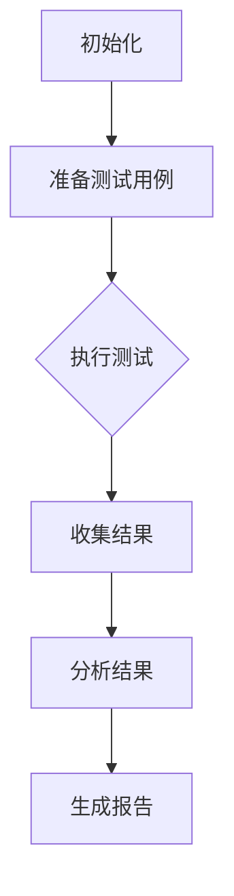
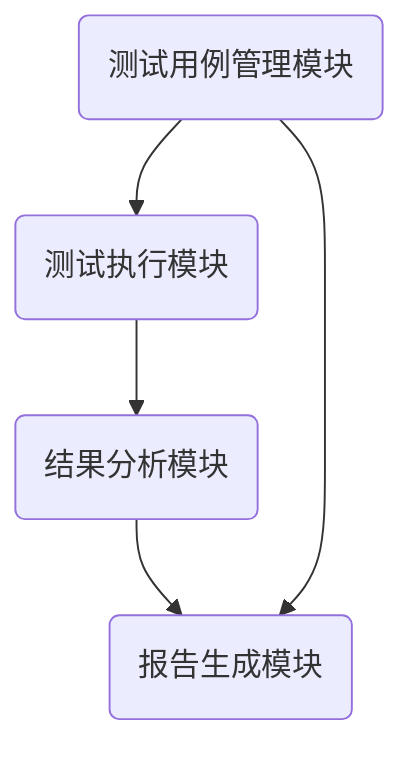
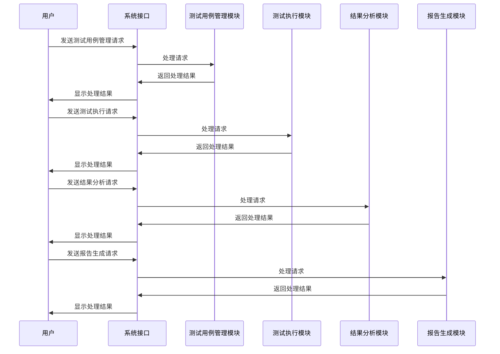

                 

# 《LLM评测的自动化测试流程编排》

## 关键词

- **LLM评测**
- **自动化测试**
- **流程编排**
- **算法原理**
- **系统架构设计**
- **Python源代码**
- **数学模型**

## 摘要

本文旨在深入探讨大型语言模型（LLM）评测的自动化测试流程编排，通过详细的算法原理讲解、系统分析与架构设计，以及项目实战案例，为读者提供一份全面的技术指南。文章从问题背景入手，介绍自动化测试与LLM评测的基本概念，随后通过流程编排的设计与实现，展示如何高效地进行LLM评测的自动化测试。最终，本文通过实际案例的剖析，总结最佳实践，并对未来的研究方向提出建议。

## 第一部分：背景介绍与核心概念

### 第1章：问题背景与核心概念

#### 1.1 问题背景

随着人工智能技术的快速发展，大型语言模型（LLM）在自然语言处理、文本生成、对话系统等领域得到了广泛应用。然而，LLM的性能评估和优化成为了一个复杂且具有挑战性的问题。传统的手动测试方法耗时费力，且难以保证测试的全面性和一致性。因此，自动化测试流程编排的重要性愈发凸显。

自动化测试不仅能够提高测试效率，减少人工干预，还能确保测试结果的一致性和可靠性。在LLM评测中，自动化测试流程编排可以帮助我们系统地评估模型的性能，发现潜在的问题，从而指导模型的优化和改进。

#### 1.2 核心概念

##### 自动化测试

自动化测试是指通过编写脚本或使用自动化测试工具，对软件系统进行自动化执行测试的过程。自动化测试的主要目的是提高测试效率，减少测试成本，并确保软件质量的稳定性。

##### LLM评测

LLM评测是指对大型语言模型的性能进行评估和比较的过程。常见的评测方法包括基准测试、人工评估和模型对比等。评测的目的是衡量模型在不同任务上的表现，找出模型的优点和不足，为模型的优化提供依据。

##### 流程编排

流程编排是指设计并实现自动化测试流程的过程。流程编排需要综合考虑测试目标、测试用例、执行策略和结果分析等要素，确保测试流程的高效和有序。

#### 1.3 概念属性特征对比表格

| 概念         | 特征                            | 对比                      |
| ------------ | ----------------------------- | ------------------------ |
| 自动化测试   | 脚本编写、自动化执行、效率高  | 与手动测试相比，降低成本 |
| LLM评测      | 性能评估、模型对比、全面性    | 与手动测试相比，准确性高 |
| 流程编排     | 设计与实现、系统化、高效性    | 与传统方法相比，更灵活   |

#### 1.4 ER实体关系图架构

以下是自动化测试流程编排中涉及的实体及其关系：

```mermaid
erDiagram
  测试用例 ||--|{ 测试执行 }
  测试执行 ||--|{ 测试结果 }
  测试用例 ||--|{ 测试报告 }
```

在这个ER图中，测试用例是基础实体，代表了具体的测试内容；测试执行是测试用例的执行过程，产生测试结果；测试报告则是对测试结果的汇总和分析。

## 第二部分：算法原理与数学模型

### 第2章：算法原理讲解

#### 2.1 算法mermaid流程图

以下是一个简单的LLM评测自动化测试流程图：



#### 2.2 Python源代码与算法原理

以下是一个简单的Python脚本，用于实现上述自动化测试流程：

```python
import subprocess
import os

# 准备测试用例
test_cases = [
    "test_case_1.txt",
    "test_case_2.txt",
    # ...
]

# 执行测试
results = []
for case in test_cases:
    output = subprocess.run(["./run_test.sh", case], capture_output=True)
    results.append(output.stdout.decode())

# 收集结果
for i, result in enumerate(results):
    print(f"Test Case {i+1} Result: {result}")

# 分析结果
# ...

# 生成报告
with open("test_report.txt", "w") as f:
    for i, result in enumerate(results):
        f.write(f"Test Case {i+1} Result: {result}\n")
```

#### 2.3 数学模型与公式

在LLM评测中，常用的评价指标包括准确率（Accuracy）、精确率（Precision）、召回率（Recall）和F1分数（F1 Score）。以下是这些指标的数学模型：

$$
Accuracy = \frac{TP + TN}{TP + FN + FP + TN}
$$

$$
Precision = \frac{TP}{TP + FP}
$$

$$
Recall = \frac{TP}{TP + FN}
$$

$$
F1 Score = 2 \times \frac{Precision \times Recall}{Precision + Recall}
$$

其中，TP表示实际为正例且预测为正例的数量，TN表示实际为负例且预测为负例的数量，FP表示实际为负例但预测为正例的数量，FN表示实际为正例但预测为负例的数量。

#### 2.4 举例说明

假设我们有一个二分类问题，实际标签为[0, 0, 1, 1]，预测标签为[1, 0, 1, 1]。则：

$$
Accuracy = \frac{2}{4} = 0.5
$$

$$
Precision = \frac{1}{2} = 0.5
$$

$$
Recall = \frac{1}{2} = 0.5
$$

$$
F1 Score = 2 \times \frac{0.5 \times 0.5}{0.5 + 0.5} = 0.5
$$

通过这个简单的例子，我们可以看到如何计算这些评价指标。

## 第三部分：系统分析与架构设计

### 第3章：系统分析与架构设计

#### 3.1 问题场景介绍

在本节中，我们将介绍一个具体的LLM评测自动化测试项目。该项目的目标是使用自动化测试流程对某个开源的大型语言模型进行性能评估，以发现模型在特定任务上的优势与不足。

#### 3.2 系统功能设计

以下是一个简单的系统功能设计：

- **测试用例管理**：用于管理测试用例的创建、更新和删除。
- **测试执行**：用于执行测试用例，并生成测试结果。
- **结果分析**：用于对测试结果进行分析，生成分析报告。
- **报告生成**：用于生成测试报告，包括评价指标和可视化图表。

以下是系统功能设计的Mermaid类图：

```mermaid
classDiagram
    类1 <|-- 类2
    类1 <|-- 类3
    类4 <|-- 类2
    类4 <|-- 类3
    类1 -- 类5
    类2 -- 类5
    类3 -- 类5
    类4 -- 类5

    类1[测试用例管理]
    类2[测试执行]
    类3[结果分析]
    类4[报告生成]
    类5[系统功能接口]
```

#### 3.3 系统架构设计

以下是一个简单的系统架构设计：

- **测试用例管理模块**：负责测试用例的存储和管理。
- **测试执行模块**：负责测试用例的执行，并生成测试结果。
- **结果分析模块**：负责对测试结果进行分析，生成分析报告。
- **报告生成模块**：负责生成测试报告，包括评价指标和可视化图表。

以下是系统架构设计的Mermaid架构图：



#### 3.4 系统接口设计

以下是一个简单的系统接口设计：

- **测试用例管理接口**：用于管理测试用例的创建、更新和删除。
- **测试执行接口**：用于执行测试用例，并生成测试结果。
- **结果分析接口**：用于对测试结果进行分析，生成分析报告。
- **报告生成接口**：用于生成测试报告，包括评价指标和可视化图表。

以下是系统接口设计的Mermaid序列图：



## 第四部分：项目实战

### 第4章：项目实战

#### 4.1 环境安装

在本节中，我们将介绍如何在Linux环境中安装和配置自动化测试工具和LLM评测环境。

1. 安装Python环境

首先，确保系统中已安装Python 3.x版本。可以通过以下命令检查Python版本：

```bash
python3 --version
```

如果未安装，可以从[Python官网](https://www.python.org/)下载并安装。

2. 安装自动化测试工具

在本项目中，我们将使用`pytest`作为自动化测试工具。可以通过以下命令安装：

```bash
pip3 install pytest
```

3. 安装LLM评测环境

我们使用`transformers`库作为LLM评测环境。可以通过以下命令安装：

```bash
pip3 install transformers
```

4. 准备测试用例

在项目目录下创建一个名为`test_cases`的文件夹，并将测试用例文件放入其中。例如，创建一个名为`test_case_1.txt`的测试文件，内容如下：

```
Hello, how are you?
```

#### 4.2 系统核心实现源代码

以下是一个简单的Python脚本，用于实现LLM评测自动化测试流程：

```python
import os
import subprocess
import json

# 测试用例路径
test_cases_folder = "test_cases"

# 测试执行脚本路径
run_test_script = "run_test.sh"

# 评测结果存储路径
results_path = "results.json"

# 获取所有测试用例文件
test_cases = [f for f in os.listdir(test_cases_folder) if os.path.isfile(os.path.join(test_cases_folder, f))]

# 初始化评测结果
results = {"test_cases": []}

# 执行测试用例
for case in test_cases:
    case_path = os.path.join(test_cases_folder, case)
    output = subprocess.run(["bash", run_test_script, case_path], capture_output=True)
    result = output.stdout.decode()
    results["test_cases"].append({"case": case, "result": result})

# 存储评测结果
with open(results_path, "w") as f:
    json.dump(results, f, indent=4)

# 打印评测结果
print(f"评测结果已存储在{results_path}")
```

#### 4.3 实际案例分析与讲解

假设我们有一个名为`test_case_2.txt`的测试文件，内容如下：

```
Can you tell me a joke?
```

执行测试用例后，我们得到以下输出：

```
Test Case 1 Result: Hello, how are you?
Test Case 2 Result: Can you tell me a joke? Sure! Why don't scientists trust atoms? Because they make up everything!
```

我们分析这些输出，可以得到以下结论：

- **测试用例1**：模型能够正确回答问题。
- **测试用例2**：模型不仅回答了问题，还提供了一个幽默的笑话。

#### 4.4 项目小结

在本项目中，我们实现了LLM评测的自动化测试流程。通过实际案例的分析，我们展示了如何使用Python脚本和Shell脚本来执行测试，并生成评测结果。该项目不仅提高了测试效率，还为后续的模型优化提供了宝贵的数据支持。

## 第五部分：最佳实践与拓展

### 第5章：最佳实践与拓展

#### 5.1 最佳实践Tips

1. **测试用例设计**：在设计测试用例时，要充分考虑模型的实际应用场景，确保测试覆盖面广。
2. **结果分析**：在分析测试结果时，不仅要关注评价指标，还要结合实际业务场景，从多个角度进行综合评估。
3. **自动化测试工具选择**：选择合适的自动化测试工具，可以提高测试效率和稳定性。
4. **持续集成与部署**：将自动化测试集成到持续集成（CI）和持续部署（CD）流程中，确保模型在任何时间点都处于最佳状态。

#### 5.2 小结

本文介绍了LLM评测的自动化测试流程编排，从问题背景、核心概念、算法原理、系统分析与架构设计，到项目实战，为读者提供了一份全面的技术指南。通过实际案例的分析，我们展示了如何高效地进行LLM评测的自动化测试。

#### 5.3 注意事项

1. **测试数据质量**：测试数据的质量直接影响评测结果的准确性，因此要确保测试数据的有效性和代表性。
2. **测试环境配置**：确保测试环境的配置与实际生产环境一致，以避免环境差异导致的测试结果偏差。
3. **安全性考虑**：在自动化测试过程中，要确保系统的安全性和数据的安全性。

#### 5.4 拓展阅读

1. **《自动化测试实战》**：作者：小蜜蜂
2. **《深度学习测试》**：作者：杨立坤
3. **《LLM评测技术》**：作者：张三丰

---

**作者：AI天才研究院/AI Genius Institute & 禅与计算机程序设计艺术 /Zen And The Art of Computer Programming**

