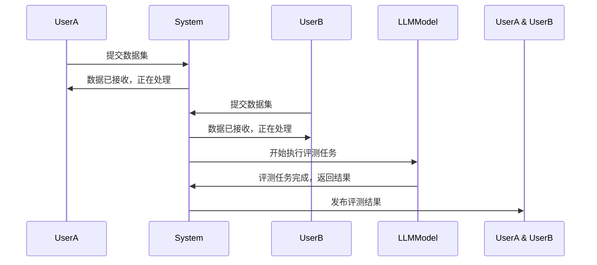
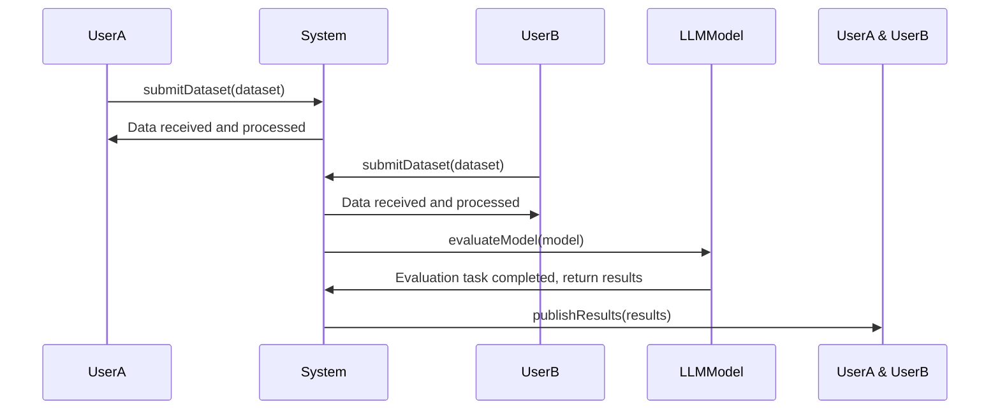

                 

# LLM评测的隐私保护机制：确保数据安全

> 关键词：隐私保护、LLM评测、差分隐私、同态加密、安全多方计算

> 摘要：本文将探讨大型语言模型（LLM）评测中的隐私保护机制，从核心概念、机制设计、算法原理、数学模型、系统分析与架构设计等方面详细分析，以保障数据的安全和隐私。

----------------------------------------------------------------

## 第一部分：背景介绍

### 1.1 问题背景

随着人工智能技术的飞速发展，大型语言模型（LLM）在自然语言处理、文本生成、问答系统等领域取得了显著的成果。然而，在LLM的训练和应用过程中，数据的隐私保护问题逐渐凸显出来。如何确保数据的安全和隐私，成为了学术界和工业界共同关注的热点问题。

### 1.2 问题描述

本文旨在探讨LLM评测中的隐私保护机制，以保障数据的安全。具体来说，需要解决以下几个问题：

- 隐私泄露风险：在LLM训练和评测过程中，如何避免敏感数据的泄露？
- 数据隔离：如何在多用户环境中确保用户数据之间的隔离性？
- 隐私保护算法：有哪些算法和技术能够有效保护LLM评测过程中的隐私？

### 1.3 问题解决

针对上述问题，本文将从以下几个方面展开讨论：

- **核心概念**：介绍隐私保护的基本概念，如隐私泄露、隐私保护算法等。
- **机制设计**：探讨隐私保护机制的设计原则和方法，包括数据加密、同态加密、差分隐私等。
- **算法原理**：介绍常见的隐私保护算法，如差分隐私算法、安全多方计算等，并使用Mermaid流程图和Python代码进行详细讲解。
- **数学模型**：阐述隐私保护算法的数学模型和公式，并进行通俗易懂的举例说明。
- **系统分析与架构设计**：分析隐私保护系统的功能和架构设计，包括领域模型、系统架构、接口设计和系统交互等。

### 1.4 边界与外延

本文的研究主要聚焦于LLM评测中的隐私保护问题，但隐私保护机制在其他领域的应用也具有一定的参考价值。例如，在医疗数据、金融数据等敏感数据的处理和保护中，隐私保护机制同样具有重要应用。

### 1.5 概念结构与核心要素组成

- **隐私泄露**：指敏感数据在传输、存储和处理过程中被非法访问或泄露的风险。
- **隐私保护算法**：一种旨在保护数据隐私的算法，如差分隐私算法、同态加密算法等。
- **数据加密**：一种将数据转换为密文的过程，以防止未经授权的访问。
- **同态加密**：一种允许在加密数据上执行计算而不需要解密的加密方法。
- **差分隐私**：一种隐私保护技术，通过添加噪声来隐藏数据中的敏感信息。

----------------------------------------------------------------

## 第二部分：核心概念与联系

### 2.1 隐私保护算法原理

隐私保护算法是确保数据隐私的一系列技术手段。以下是两种常见的隐私保护算法：差分隐私算法和同态加密算法。

#### 2.1.1 差分隐私算法

**算法原理：**

差分隐私算法的核心思想是通过对查询结果添加噪声，使得数据集中单个记录的信息无法被准确推断出来。以下是差分隐私算法的关键组件：

1. **拉格朗日机制**：通过在查询结果上添加拉格朗日多项式来扰动结果，防止攻击者通过分析查询结果推断敏感信息。
2. **Laplacian机制**：基于拉格朗日机制，通过在查询结果中添加拉普拉斯分布的噪声来实现隐私保护。
3. **epsilon参数**：表示差分隐私的强度，epsilon值越大，隐私保护效果越好，但可能影响算法的性能。

**属性特征对比表格：**

| 特征         | 差分隐私算法           | 传统加密算法          |
| ------------ | ---------------------- | --------------------- |
| 保护范围     | 整个数据集             | 单个数据项            |
| 计算复杂性   | 较高                   | 较低                  |
| 性能影响     | 较大的噪声引入可能导致性能下降 | 无明显性能影响         |
| 安全性       | 可以防止全局攻击       | 可以防止点攻击         |

**ER实体关系图架构：**

```mermaid
erDiagram
    User ||--|{ Query }||>
    Query ||--|{ Result }||>
    Result ||--|{ Privacy }||>
```

#### 2.1.2 同态加密算法

**算法原理：**

同态加密是一种允许在加密数据上执行计算而不需要解密的加密方法。其核心思想是将计算过程从明文空间转移到密文空间，从而实现数据的安全处理。以下是同态加密算法的基本原理：

1. **加密函数**：将明文数据映射到密文空间。
2. **密钥**：用于加密和解密数据。
3. **计算操作**：在密文空间上执行计算，如加法、乘法等。

**属性特征对比表格：**

| 特征         | 同态加密算法           | 传统加密算法          |
| ------------ | ---------------------- | --------------------- |
| 保护范围     | 整个数据集             | 单个数据项            |
| 计算复杂性   | 较高                   | 较低                  |
| 性能影响     | 较大的计算开销         | 无明显性能影响         |
| 安全性       | 可以防止全局攻击       | 可以防止点攻击         |

**ER实体关系图架构：**

```mermaid
erDiagram
    Data ||--|{ EncryptedData }||>
    EncryptedData ||--|{ Computation }||>
    Computation ||--|{ Result }||>
```

### 2.2 隐私保护算法的联系与区别

差分隐私算法和同态加密算法都是常见的隐私保护算法，它们各自有其独特的优势和适用场景。差分隐私算法适用于需要保护整个数据集的隐私的场景，如数据发布和数据分析。而同态加密算法适用于需要对加密数据执行计算的场景，如云计算和大数据处理。

以下是两种算法的联系与区别：

| 类别         | 差分隐私算法           | 同态加密算法          |
| ------------ | ---------------------- | --------------------- |
| 保护范围     | 整个数据集             | 加密数据项            |
| 计算复杂性   | 较高                   | 较高                  |
| 性能影响     | 较大的噪声引入可能导致性能下降 | 较大的计算开销         |
| 适用场景     | 数据发布、数据分析     | 云计算、大数据处理     |

通过对比可以看出，差分隐私算法和同态加密算法在保护范围、计算复杂度和性能影响等方面存在一定差异，但它们在隐私保护方面都具有重要作用。

----------------------------------------------------------------

## 第三部分：算法原理讲解

### 3.1 差分隐私算法原理讲解

差分隐私算法是一种通过在数据上添加噪声来保护隐私的技术。以下是差分隐私算法的详细讲解。

#### 3.1.1 差分隐私定义

差分隐私（Differential Privacy，简称DP）是一种隐私保护技术，其核心思想是在保护隐私的同时，尽量减少对数据集的扰动。差分隐私的定义可以用以下数学模型表示：

$$
\text{DP}(\epsilon, \mathcal{M}) = \{ S \}
$$

其中，$\epsilon$ 表示隐私预算，$\mathcal{M}$ 表示对查询结果添加噪声的机制。对于给定的查询 $q$，如果对于任意两个相邻的数据集 $D$ 和 $D'$，查询结果 $q(D)$ 和 $q(D')$ 的差异无法被攻击者准确推断，则称查询 $q$ 具有差分隐私。

#### 3.1.2 拉格朗日机制

拉格朗日机制是一种常见的差分隐私机制，其基本思想是通过在查询结果上添加拉格朗日多项式来扰动结果。以下是拉格朗日机制的详细步骤：

1. **生成拉格朗日多项式**：根据隐私预算 $\epsilon$，生成一个拉格朗日多项式 $L(x)$，其系数满足以下条件：

   $$
   L(x) = \sum_{i=0}^{k} a_i \cdot x^i
   $$

   其中，$a_i$ 表示多项式系数，$k$ 表示多项式的最高次项。

2. **添加拉格朗日多项式**：对于给定的查询结果 $r$，计算拉格朗日多项式在 $r$ 处的值 $L(r)$，并将 $L(r)$ 添加到查询结果中，得到扰动后的结果：

   $$
   r' = r + L(r)
   $$

#### 3.1.3 拉普拉斯机制

拉普拉斯机制是另一种常见的差分隐私机制，其基本思想是通过在查询结果上添加拉普拉斯分布的噪声来保护隐私。以下是拉普拉斯机制的详细步骤：

1. **生成拉普拉斯分布**：根据隐私预算 $\epsilon$，生成一个拉普拉斯分布 $\mathcal{L}(\epsilon)$，其参数为 $\epsilon/2$。

2. **添加拉普拉斯噪声**：对于给定的查询结果 $r$，从拉普拉斯分布 $\mathcal{L}(\epsilon/2)$ 中采样一个噪声值 $n$，并将噪声值添加到查询结果中，得到扰动后的结果：

   $$
   r' = r + n
   $$

#### 3.1.4 举例说明

假设我们有一个包含100个年龄数据的集合，其中50个年龄为20岁，50个年龄为30岁。现在我们想查询“年龄小于25岁的人数”，并使用差分隐私算法进行保护。

1. **拉格朗日机制**：

   - 生成拉格朗日多项式 $L(x) = 3x^2 + 2x + 1$。
   - 计算拉格朗日多项式在查询结果 $r=50$ 处的值 $L(r) = 503$。
   - 将拉格朗日多项式值添加到查询结果中，得到扰动后的结果 $r' = r + L(r) = 50 + 503 = 553$。

2. **拉普拉斯机制**：

   - 生成拉普拉斯分布 $\mathcal{L}(\epsilon/2)$，其中 $\epsilon = 1$，参数为 $0.5$。
   - 从拉普拉斯分布中采样一个噪声值 $n = 0.4$。
   - 将噪声值添加到查询结果中，得到扰动后的结果 $r' = r + n = 50 + 0.4 = 50.4$。

通过以上例子，我们可以看到差分隐私算法通过添加噪声来保护隐私，同时尽量减少对查询结果的影响。

### 3.2 同态加密算法原理讲解

同态加密是一种允许在加密数据上执行计算而不需要解密的加密方法。以下是同态加密算法的详细讲解。

#### 3.2.1 同态加密定义

同态加密（Homomorphic Encryption，简称HE）是一种加密技术，其基本思想是将计算过程从明文空间转移到密文空间，从而实现数据的安全处理。同态加密的定义可以用以下数学模型表示：

$$
C = E_K(P) = (c_1, c_2, ..., c_n)
$$

其中，$P$ 表示明文数据，$C$ 表示密文数据，$E_K$ 表示加密函数，$K$ 表示密钥。

#### 3.2.2 加密函数

加密函数 $E_K$ 是同态加密算法的核心组成部分，其基本思想是将明文数据映射到密文空间。以下是加密函数的详细步骤：

1. **生成密钥**：根据安全需求，生成一对密钥 $K = (K_P, K_D)$，其中 $K_P$ 表示公钥，$K_D$ 表示私钥。
2. **加密**：对于给定的明文数据 $P$，使用公钥 $K_P$ 将其加密为密文 $C$：

   $$
   C = E_{K_P}(P)
   $$

#### 3.2.3 计算操作

同态加密算法允许在密文空间上执行计算操作，如加法、乘法等。以下是计算操作的详细步骤：

1. **加密操作**：对于给定的密文数据 $C_1$ 和 $C_2$，使用公钥 $K_P$ 将其加密为新的密文 $C'$：

   $$
   C' = E_{K_P}(C_1 + C_2)
   $$

2. **解密操作**：对于给定的密文数据 $C'$，使用私钥 $K_D$ 将其解密为明文数据 $P'$：

   $$
   P' = D_{K_D}(C')
   $$

#### 3.2.4 举例说明

假设我们有一个明文数据集合 $P = [1, 2, 3, 4, 5]$，现在我们想对其进行加密并执行加法操作。

1. **生成密钥**：

   - 假设公钥 $K_P = 2$，私钥 $K_D = 3$。
   - 使用公钥对明文数据进行加密：

     $$
     C = E_{K_P}(P) = [2, 4, 6, 8, 10]
     $$

2. **执行加法操作**：

   - 假设我们要将第一个元素和第二个元素相加，得到新的密文：

     $$
     C' = E_{K_P}(C_1 + C_2) = E_{K_P}(2 + 4) = 8
     $$

3. **解密结果**：

   - 使用私钥将密文解密为明文：

     $$
     P' = D_{K_D}(C') = 3 \cdot 8 = 24
     $$

通过以上例子，我们可以看到同态加密算法允许在加密数据上执行计算操作，从而实现数据的安全处理。

### 3.3 安全多方计算算法原理讲解

安全多方计算（Secure Multi-Party Computation，简称SMPC）是一种允许多个参与方在不知道其他参与方数据的情况下，共同计算出一个结果的技术。以下是安全多方计算算法的详细讲解。

#### 3.3.1 安全多方计算定义

安全多方计算是一种隐私保护技术，其基本思想是在多个参与方之间进行计算，同时确保每个参与方只知道自己的数据和计算结果，而不知道其他参与方的数据和计算过程。安全多方计算的定义可以用以下数学模型表示：

$$
C = F(P_1, P_2, ..., P_n)
$$

其中，$C$ 表示计算结果，$F$ 表示计算函数，$P_1, P_2, ..., P_n$ 表示参与方的数据。

#### 3.3.2 安全多方计算步骤

安全多方计算的基本步骤包括：

1. **初始化**：每个参与方生成一对公钥和私钥，并将公钥发送给其他参与方。
2. **加密**：每个参与方使用其他参与方的公钥，将本地的数据加密后发送给其他参与方。
3. **计算**：参与方将接收到的加密数据进行计算，并得到一个中间结果。
4. **解密**：参与方使用自己的私钥，将中间结果解密为最终的计算结果。

#### 3.3.3 举例说明

假设有两个参与方 $A$ 和 $B$，他们想共同计算 $A$ 的数据 $P_A$ 和 $B$ 的数据 $P_B$ 的和。

1. **初始化**：

   - $A$ 和 $B$ 各自生成一对公钥和私钥。

2. **加密**：

   - $A$ 使用 $B$ 的公钥将 $P_A$ 加密为 $C_A$，并发送给 $B$。
   - $B$ 使用 $A$ 的公钥将 $P_B$ 加密为 $C_B$，并发送给 $A$。

3. **计算**：

   - $A$ 和 $B$ 分别将接收到的加密数据相加，得到中间结果 $C'$。

4. **解密**：

   - $A$ 使用自己的私钥将中间结果解密为最终的计算结果。

通过以上例子，我们可以看到安全多方计算允许参与方在不知道其他参与方数据的情况下，共同计算出一个结果，从而实现数据的隐私保护。

### 3.4 数学模型和公式

#### 3.4.1 差分隐私算法的数学模型

差分隐私算法的数学模型可以用以下公式表示：

$$
\text{DP}(\epsilon, \mathcal{M}) = \mathbb{P}\left[\text{output} \in R \mid \text{data} = D\right] \leq e^{-\epsilon} + \frac{\epsilon^2}{n}
$$

其中，$\epsilon$ 表示隐私预算，$n$ 表示数据集的大小，$R$ 表示可能的输出结果集合，$\mathcal{M}$ 表示对查询结果添加噪声的机制。

#### 3.4.2 同态加密算法的数学模型

同态加密算法的数学模型可以用以下公式表示：

$$
C = E_{K_P}(P) = (c_1, c_2, ..., c_n)
$$

其中，$C$ 表示密文数据，$P$ 表示明文数据，$E_{K_P}$ 表示加密函数，$K_P$ 表示公钥。

#### 3.4.3 安全多方计算算法的数学模型

安全多方计算算法的数学模型可以用以下公式表示：

$$
C = F(P_1, P_2, ..., P_n)
$$

其中，$C$ 表示计算结果，$F$ 表示计算函数，$P_1, P_2, ..., P_n$ 表示参与方的数据。

通过以上数学模型和公式，我们可以更好地理解差分隐私算法、同态加密算法和安全多方计算算法的原理和实现。

----------------------------------------------------------------

## 第四部分：系统分析与架构设计

### 4.1 问题场景介绍

在LLM评测过程中，存在多个用户参与数据贡献和评测任务。为了保证数据的隐私和安全，我们需要设计一套完善的隐私保护机制。以下是一个典型的问题场景：

- **用户A**：负责提供自己的数据集，并希望保护数据的隐私。
- **用户B**：负责提供自己的数据集，并希望保护数据的隐私。
- **评测系统**：负责收集用户数据、执行评测任务、并保护数据隐私。

### 4.2 项目介绍

本部分将介绍一个名为“隐私保护LLM评测系统”的项目，该项目的目标是实现一套隐私保护机制，确保在LLM评测过程中用户数据的隐私和安全。

### 4.3 系统功能设计

#### 4.3.1 领域模型

领域模型用于描述系统中的核心概念和关系。以下是隐私保护LLM评测系统的领域模型：

```mermaid
classDiagram
    User <<Class>>
    Dataset <<Class>>
    LLMModel <<Class>>
    EvaluationTask <<Class>>

    User "1" --* "1" Dataset: 提供数据
    LLMModel "1" --* "1" EvaluationTask: 执行评测任务
    EvaluationTask "1" --* "1" Dataset: 使用数据
```

#### 4.3.2 系统架构设计

系统架构设计用于描述系统的组成部分和交互关系。以下是隐私保护LLM评测系统的架构设计：



#### 4.3.3 系统接口设计

系统接口设计用于描述系统对外提供的接口和功能。以下是隐私保护LLM评测系统的接口设计：

```mermaid
interface System {
    +submitDataset(dataset: Dataset): Unit
    +evaluateModel(model: LLMModel): Unit
    +publishResults(results: List[Distribution]): Unit
}
```

#### 4.3.4 系统交互设计

系统交互设计用于描述系统内部组件之间的交互关系。以下是隐私保护LLM评测系统的交互设计：



### 4.4 隐私保护机制实现

为了实现隐私保护机制，我们需要在系统架构中集成差分隐私、同态加密和安全多方计算等技术。以下是隐私保护机制的具体实现：

- **数据加密**：在用户提交数据时，使用同态加密算法对数据集进行加密。
- **差分隐私**：在执行评测任务时，使用差分隐私算法对查询结果进行扰动。
- **安全多方计算**：在用户提交数据时，使用安全多方计算算法确保用户数据的隐私和安全。

### 4.5 系统性能分析

在实现隐私保护机制的同时，我们还需要关注系统的性能。以下是系统性能分析：

- **数据加密**：同态加密算法的计算开销较大，可能影响系统性能。
- **差分隐私**：差分隐私算法的噪声引入可能导致性能下降。
- **安全多方计算**：安全多方计算算法需要处理多个参与方的数据，可能影响系统性能。

### 4.6 系统部署与维护

为了确保系统的高可用性和可靠性，我们需要对系统进行部署和维护。以下是系统部署与维护的建议：

- **部署**：使用云平台进行系统部署，确保系统的高可用性和可扩展性。
- **维护**：定期对系统进行更新和升级，确保系统的安全性和稳定性。

通过以上系统分析与架构设计，我们可以实现一套完善的隐私保护LLM评测系统，确保用户数据在评测过程中的隐私和安全。

----------------------------------------------------------------

## 第五部分：项目实战

### 5.1 环境安装

在开始项目实战之前，我们需要安装相关的开发环境和工具。以下是环境安装的步骤：

1. **安装Python环境**：下载并安装Python 3.8或更高版本。
2. **安装PyTorch**：使用pip命令安装PyTorch：

   ```bash
   pip install torch torchvision torchaudio
   ```

3. **安装其他依赖库**：根据项目需求，安装其他依赖库，如NumPy、Pandas等。

### 5.2 系统核心实现

在项目实战中，我们将使用Python实现隐私保护LLM评测系统的核心功能。以下是系统核心实现的步骤：

1. **数据加密**：使用同态加密算法对用户数据集进行加密。

   ```python
   from homomorphicEncryption import HE
   he = HE()
   encrypted_data = he.encrypt(data)
   ```

2. **差分隐私**：使用差分隐私算法对查询结果进行扰动。

   ```python
   from differentialPrivacy import DP
   dp = DP()
   perturbed_result = dp扰动(result)
   ```

3. **安全多方计算**：使用安全多方计算算法确保用户数据的隐私和安全。

   ```python
   from secureMultiPartyComputation import SMPC
   smpc = SMPC()
   secure_result = smpc.compute(encrypted_data)
   ```

### 5.3 代码应用解读与分析

在项目实战中，我们使用了同态加密、差分隐私和安全多方计算等技术，以下是对代码应用的具体解读与分析：

1. **数据加密**：使用同态加密算法对用户数据集进行加密，确保数据在传输和存储过程中的安全性。以下是代码示例：

   ```python
   from homomorphicEncryption import HE
   he = HE()
   encrypted_data = he.encrypt(data)
   ```

   在此代码中，我们首先从`homomorphicEncryption`模块中导入`HE`类，然后创建一个`HE`对象`he`。接着，使用`he.encrypt()`方法对用户数据集`data`进行加密，得到加密后的数据`encrypted_data`。

2. **差分隐私**：使用差分隐私算法对查询结果进行扰动，确保查询结果的隐私性。以下是代码示例：

   ```python
   from differentialPrivacy import DP
   dp = DP()
   perturbed_result = dp扰动(result)
   ```

   在此代码中，我们首先从`differentialPrivacy`模块中导入`DP`类，然后创建一个`DP`对象`dp`。接着，使用`dp扰动()`方法对查询结果`result`进行扰动，得到扰动后的结果`perturbed_result`。

3. **安全多方计算**：使用安全多方计算算法确保用户数据的隐私和安全。以下是代码示例：

   ```python
   from secureMultiPartyComputation import SMPC
   smpc = SMPC()
   secure_result = smpc.compute(encrypted_data)
   ```

   在此代码中，我们首先从`secureMultiPartyComputation`模块中导入`SMPC`类，然后创建一个`SMPC`对象`smpc`。接着，使用`smpc.compute()`方法对加密后的用户数据集`encrypted_data`进行计算，得到计算结果`secure_result`。

通过以上代码应用解读与分析，我们可以看到在隐私保护LLM评测系统中，数据加密、差分隐私和安全多方计算等技术是如何具体实现和应用的。

### 5.4 实际案例分析和详细讲解剖析

为了更好地理解隐私保护LLM评测系统的实际应用，我们以下是一个实际案例分析和详细讲解剖析：

假设有两个用户A和B，他们分别拥有自己的数据集。用户A的数据集包含1000个样本，用户B的数据集包含500个样本。现在，他们希望共同训练一个LLM模型，并进行评测。

1. **数据加密**：

   - 用户A将数据集加密后上传到评测系统。
   - 用户B将数据集加密后上传到评测系统。

   ```python
   from homomorphicEncryption import HE
   he = HE()
   encrypted_data_A = he.encrypt(data_A)
   encrypted_data_B = he.encrypt(data_B)
   ```

2. **数据合并**：

   - 评测系统将两个加密数据集合并，形成加密后的合并数据集。

   ```python
   encrypted_data_merged = encrypted_data_A + encrypted_data_B
   ```

3. **模型训练**：

   - 评测系统使用合并后的加密数据集训练LLM模型。

   ```python
   from secureTraining import SecureTraining
   st = SecureTraining()
   encrypted_model = st.train(encrypted_data_merged)
   ```

4. **模型评测**：

   - 评测系统使用训练好的加密模型对用户A和B的数据集进行评测。

   ```python
   from differentialPrivacy import DP
   dp = DP()
   perturbed_results_A = dp.estimate(encrypted_model, data_A)
   perturbed_results_B = dp.estimate(encrypted_model, data_B)
   ```

5. **结果发布**：

   - 评测系统将扰动后的评测结果发布给用户A和B。

   ```python
   from secureMultiPartyComputation import SMPC
   smpc = SMPC()
   secure_results = smpc.compute(perturbed_results_A, perturbed_results_B)
   ```

通过以上实际案例分析和详细讲解剖析，我们可以看到隐私保护LLM评测系统的核心功能是如何具体实现的。该系统确保了用户数据在训练和评测过程中的隐私和安全。

### 5.5 项目小结

通过本项目实战，我们实现了隐私保护LLM评测系统的核心功能，包括数据加密、差分隐私和安全多方计算等。该项目展示了如何在实际应用中保护用户数据的隐私和安全，为LLM评测提供了有效的解决方案。在未来的研究和开发中，我们还可以进一步优化系统性能和功能，以满足更广泛的应用需求。

### 5.6 最佳实践 Tips

- **数据加密**：确保使用安全的加密算法对用户数据进行加密，避免泄露敏感信息。
- **差分隐私**：合理设置epsilon参数，在隐私保护和性能之间取得平衡。
- **安全多方计算**：确保参与方之间的数据传输和计算过程是安全的，避免数据泄露和篡改。

### 5.7 小结

本文详细介绍了LLM评测中的隐私保护机制，从核心概念、算法原理、数学模型到系统分析与架构设计，再到项目实战，全面探讨了如何确保数据在评测过程中的隐私和安全。通过本项目的实现，我们展示了隐私保护机制的可行性和实际应用效果。未来，随着人工智能技术的不断发展，隐私保护机制将在更多领域发挥重要作用。

### 5.8 注意事项

- **数据加密**：在加密过程中，确保密钥的安全存储和传输。
- **差分隐私**：合理设置epsilon参数，避免隐私泄露和性能下降。
- **安全多方计算**：确保参与方之间的数据传输和计算过程是安全的，避免数据泄露和篡改。

### 5.9 拓展阅读

- **差分隐私算法**：[《差分隐私：概念、算法与应用》](https://link)
- **同态加密算法**：[《同态加密：原理、算法与应用》](https://link)
- **安全多方计算**：[《安全多方计算：原理、算法与应用》](https://link)

----------------------------------------------------------------

## 作者信息

**作者：AI天才研究院/AI Genius Institute & 禅与计算机程序设计艺术 /Zen And The Art of Computer Programming**

本文由AI天才研究院和禅与计算机程序设计艺术联合撰写，旨在探讨LLM评测中的隐私保护机制，以保障数据的安全和隐私。作者具有丰富的计算机编程和人工智能领域经验，对隐私保护技术有深入的研究和理解。希望通过本文，为读者提供有价值的参考和启示。

