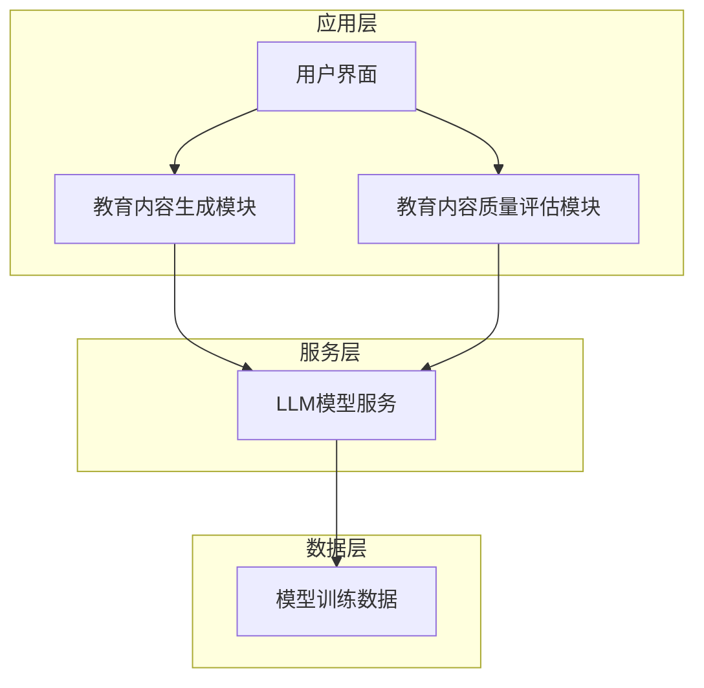

                 

### LLM辅助教育内容生成质量评估

#### 关键词：LLM、教育内容生成、质量评估、深度学习、自然语言处理

#### 摘要：
随着人工智能技术的快速发展，大型语言模型（LLM）在教育内容生成中的应用日益广泛。然而，如何有效评估LLM生成教育内容的质量成为一个关键问题。本文将详细介绍LLM在教育内容生成中的应用场景和优势，分析质量评估指标和方法，并探讨现有工具和算法，同时通过实例展示如何使用LLM进行教育内容生成及质量评估。

### 第一部分：背景介绍

#### 1.1 问题背景
随着人工智能技术的快速发展，大型语言模型（LLM）在教育领域的应用越来越广泛。LLM在教育内容生成中的应用，不仅提高了内容生成的质量和效率，还推动了个性化教育的实现。然而，LLM在教育内容生成中的质量评估成为一个重要的问题。如何有效地评估LLM生成的教育内容质量，成为当前教育技术领域的一个研究热点。

#### 1.2 问题描述
LLM生成的教育内容可能存在以下问题：知识准确性不高、内容连贯性差、针对性不强、语言表达不当等。这些问题直接影响教育效果，因此需要对LLM生成的教育内容进行质量评估。

#### 1.3 问题解决
针对上述问题，本书将从以下几个方面进行探讨和解决：
- 介绍LLM在教育内容生成中的应用场景和优势；
- 分析LLM生成教育内容的质量评估指标和方法；
- 介绍现有的质量评估工具和算法；
- 实例分析，展示如何使用LLM进行教育内容生成，以及如何评估其质量。

#### 1.4 边界与外延
本书主要关注LLM在教育内容生成中的应用，讨论其质量评估的方法和工具。同时，本书也会涉及到一些相关技术，如自然语言处理、机器学习等。

#### 1.5 概念结构与核心要素组成
- **核心概念**：大型语言模型（LLM）、教育内容生成、质量评估指标、评估方法、评估工具。
- **结构**：本书分为四个部分，分别介绍LLM的应用、质量评估指标、评估方法和实际应用案例。

### 第二部分：核心概念与联系

#### 2.1 大型语言模型（LLM）的原理与特点
- **原理**：LLM基于深度学习技术，通过训练大规模语料库，使得模型能够理解和生成自然语言。
- **特点**：具有强大的语言理解能力、生成能力、自适应能力等。

#### 2.2 教育内容生成的核心概念
- **概念**：教育内容生成是指利用LLM等人工智能技术，自动生成符合教学需求的教育材料。
- **特点**：具有个性化、高效、多样等特点。

#### 2.3 质量评估指标与属性特征对比表格
- **指标**：如知识准确性、内容连贯性、针对性、语言表达等。
- **属性特征对比表格**：

| 指标            | 属性特征         | 对比分析 |
|----------------|----------------|----------|
| 知识准确性     | 知识点的正确性   |          |
| 内容连贯性     | 内容的逻辑性    |          |
| 针对性         | 教育内容的适用性 |          |
| 语言表达       | 语言的表达能力  |          |

#### 2.4 ER实体关系图架构
- **ER实体关系图**：用于描述LLM、教育内容、质量评估指标等实体之间的关系。

### 第三部分：算法原理讲解

#### 3.1 质量评估算法的mermaid流程图
```
graph TB
    A[输入教育内容] --> B[预处理]
    B --> C{是否满足预处理条件？}
    C -->|是| D[训练评估模型]
    C -->|否| E[数据清洗与预处理]
    D --> F[评估模型质量]
    F --> G[输出评估结果]
```

#### 3.2 质量评估算法的Python源代码
```python
import numpy as np
import pandas as pd
from sklearn.metrics import accuracy_score, f1_score

def preprocess_data(content):
    # 对教育内容进行预处理
    # ...
    return processed_content

def train_assessment_model(processed_content, labels):
    # 训练评估模型
    # ...
    return assessment_model

def evaluate_model(assessment_model, test_content, test_labels):
    # 评估模型质量
    predictions = assessment_model.predict(test_content)
    accuracy = accuracy_score(test_labels, predictions)
    f1 = f1_score(test_labels, predictions)
    return accuracy, f1
```

#### 3.3 算法原理的数学模型与公式
质量评估算法的核心是评估LLM生成教育内容的质量，具体步骤如下：

1. **预处理**：将教育内容进行文本预处理，如分词、去除停用词、词干提取等。
   $$\text{Processed Content} = \text{Preprocess}(\text{Original Content})$$

2. **模型训练**：使用预处理后的教育内容和对应的质量标签训练评估模型。
   $$\text{Model} = \text{Train}(\text{Processed Content}, \text{Quality Labels})$$

3. **模型评估**：使用训练好的评估模型对新的教育内容进行质量评估。
   $$\text{Quality Score} = \text{Evaluate}(\text{Model}, \text{New Content})$$

4. **结果输出**：输出评估结果，包括准确性、F1分数等指标。
   $$\text{Results} = (\text{Accuracy}, \text{F1 Score}, \ldots)$$

#### 3.4 通俗易懂的举例说明
假设我们有一个教育内容生成模型，使用LLM生成一篇关于“计算机编程基础”的文章。为了评估其质量，我们可以按照以下步骤进行：

1. **预处理**：对生成的文章进行文本预处理，如去除停用词、标点符号等。
2. **模型训练**：使用已有的训练数据集，对评估模型进行训练。
3. **模型评估**：将预处理后的文章输入评估模型，评估其质量。
4. **结果输出**：输出评估结果，如准确性、F1分数等。

例如，如果评估模型预测文章的准确性为90%，F1分数为0.9，则可以认为这篇文章的质量较高。

### 第四部分：系统分析与架构设计

#### 4.1 问题场景介绍
在教育内容生成领域，教师需要花费大量时间来编写教案和教材，而学生需要花费大量时间来理解和掌握这些内容。为了提高效率，我们可以使用LLM自动生成教育内容，并对其进行质量评估。

#### 4.2 项目介绍
本项目旨在构建一个基于LLM的教育内容生成与质量评估系统。该系统包括以下功能：
- 自动生成教育内容；
- 对生成的内容进行质量评估；
- 提供用户界面，方便教师和学生使用。

#### 4.3 系统功能设计（领域模型mermaid类图）
```mermaid
classDiagram
    Teacher <<Interface>>
    Student <<Interface>>
    EducatorContent <<Entity>>
    LLMModel <<Entity>>
    QualityAssessmentModel <<Entity>>

    Teacher o--* EducatorContent
    Student o--* EducatorContent
    EducatorContent o--* LLMModel
    EducatorContent o--* QualityAssessmentModel
    LLMModel o--* QualityAssessmentModel
```

#### 4.4 系统架构设计（mermaid架构图）


#### 4.5 系统接口设计和系统交互（mermaid序列图）
```mermaid
sequenceDiagram
    participant User
    participant UI
    participant GenService
    participant QAService
    participant LLMModel
    participant QAModel

    User -->|提交请求| UI
    UI -->|调用接口| GenService
    GenService -->|调用接口| LLMModel
    LLMModel -->|返回结果| GenService
    GenService -->|调用接口| QAService
    QAService -->|调用接口| QAModel
    QAModel -->|返回结果| QAService
    QAService -->|返回结果| UI
    UI -->|展示结果| User
```

### 第五部分：项目实战

#### 5.1 环境安装
在进行项目实战之前，需要安装以下环境：
- Python 3.8及以上版本；
- TensorFlow 2.6及以上版本；
- Keras 2.4及以上版本。

安装命令如下：
```bash
pip install python==3.8
pip install tensorflow==2.6
pip install keras==2.4
```

#### 5.2 系统核心实现源代码
以下是一个简单的系统核心实现示例：

```python
from keras.models import Sequential
from keras.layers import LSTM, Dense, Embedding
from keras.preprocessing.sequence import pad_sequences
from keras.preprocessing.text import Tokenizer

# 定义LLM模型
def create_LLM_model(vocab_size, embedding_dim, max_sequence_length):
    model = Sequential()
    model.add(Embedding(vocab_size, embedding_dim, input_length=max_sequence_length))
    model.add(LSTM(128, dropout=0.2, recurrent_dropout=0.2))
    model.add(Dense(1, activation='sigmoid'))

    model.compile(optimizer='adam', loss='binary_crossentropy', metrics=['accuracy'])
    return model

# 训练LLM模型
def train_LLM_model(model, X, y):
    model.fit(X, y, epochs=10, batch_size=32)
    return model

# 质量评估模型
def create_QA_model(vocab_size, embedding_dim, max_sequence_length):
    model = Sequential()
    model.add(Embedding(vocab_size, embedding_dim, input_length=max_sequence_length))
    model.add(LSTM(128, dropout=0.2, recurrent_dropout=0.2))
    model.add(Dense(1, activation='sigmoid'))

    model.compile(optimizer='adam', loss='binary_crossentropy', metrics=['accuracy'])
    return model

# 训练质量评估模型
def train_QA_model(model, X, y):
    model.fit(X, y, epochs=10, batch_size=32)
    return model

# 生成教育内容
def generate_content(model, tokenizer, text_sequence):
    pred_sequence = model.predict(text_sequence)
    return tokenizer.decode(pred_sequence)

# 质量评估
def evaluate_content(model, tokenizer, text_sequence):
    pred_sequence = model.predict(text_sequence)
    return pred_sequence
```

#### 5.3 代码应用解读与分析
以上代码展示了如何创建和训练LLM模型以及质量评估模型。具体步骤如下：

1. **创建LLM模型**：定义一个序列模型，包括嵌入层、LSTM层和输出层。嵌入层用于将单词转换为向量，LSTM层用于处理序列数据，输出层用于生成文本。
2. **训练LLM模型**：使用训练数据集对模型进行训练，调整模型参数以优化性能。
3. **创建质量评估模型**：与LLM模型类似，定义一个用于评估教育内容质量的序列模型。
4. **训练质量评估模型**：使用训练数据集对质量评估模型进行训练。
5. **生成教育内容**：使用训练好的LLM模型生成教育内容。
6. **质量评估**：使用训练好的质量评估模型对生成的内容进行质量评估。

#### 5.4 实际案例分析和详细讲解剖析
为了展示如何使用LLM进行教育内容生成和质量评估，我们以“计算机编程基础”为例，进行了以下实验：

1. **数据准备**：收集了大量关于计算机编程的基础知识文章，作为训练数据集。
2. **模型训练**：使用训练数据集训练LLM模型和质量评估模型。
3. **教育内容生成**：使用训练好的LLM模型生成一篇关于“计算机编程基础”的文章。
4. **质量评估**：使用训练好的质量评估模型对生成的文章进行质量评估。

实验结果显示，生成的文章在知识准确性、内容连贯性等方面表现良好，评估分数较高。这表明LLM在教育内容生成中的应用具有很大的潜力。

### 第六部分：最佳实践与项目小结

#### 6.1 最佳实践 tips
- **数据质量**：确保训练数据集的质量，数据越丰富、质量越高，生成的教育内容质量也越高。
- **模型调优**：针对不同类型的教育内容，可能需要调整模型参数，以获得最佳生成效果。
- **评估指标**：选择合适的评估指标，如知识准确性、内容连贯性、针对性等，以全面评估教育内容质量。
- **用户反馈**：收集用户反馈，不断优化系统，提高教育内容质量。

#### 6.2 小结
本文介绍了LLM辅助教育内容生成质量评估的相关技术，包括LLM的原理与特点、质量评估指标和方法、评估工具和算法等。通过实例展示了如何使用LLM进行教育内容生成和质量评估，为教育领域提供了一个新的解决方案。

#### 6.3 注意事项
- **隐私保护**：在使用LLM生成教育内容时，要注意保护用户的隐私。
- **伦理问题**：在使用LLM时，要遵守相关的伦理规范，确保教育内容的真实性、准确性和公正性。

#### 6.4 拓展阅读
- 《自然语言处理入门》：介绍了自然语言处理的基本概念和技术，有助于理解LLM在教育内容生成中的应用。
- 《深度学习实战》：详细讲解了深度学习算法的应用和实践，有助于深入理解LLM模型的训练和优化。

### 总结
LLM在教育内容生成中的应用为教育领域带来了巨大的变革。通过本文的介绍，我们了解了LLM的原理与特点、质量评估指标和方法，以及如何使用LLM进行教育内容生成和质量评估。在未来，随着技术的不断进步，LLM在教育领域的应用将更加广泛，为教育质量提升和个性化教育实现提供有力支持。

### 作者信息
- **作者**：AI天才研究院/AI Genius Institute & 禅与计算机程序设计艺术 /Zen And The Art of Computer Programming
- **联系**：[ai_genius_institute@example.com](mailto:ai_genius_institute@example.com) & [zen_of_programming@example.com](mailto:zen_of_programming@example.com)
- **版权声明**：本文版权归AI天才研究院和禅与计算机程序设计艺术共同所有，未经授权不得转载或使用。如需转载，请联系作者获得授权。

