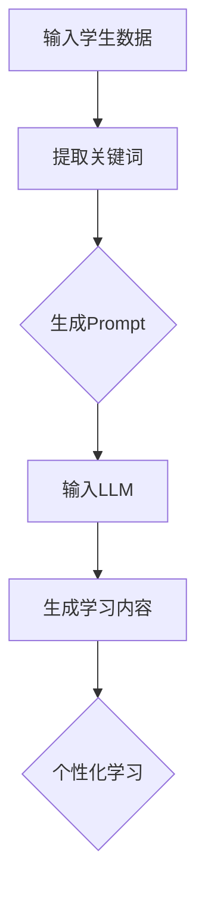
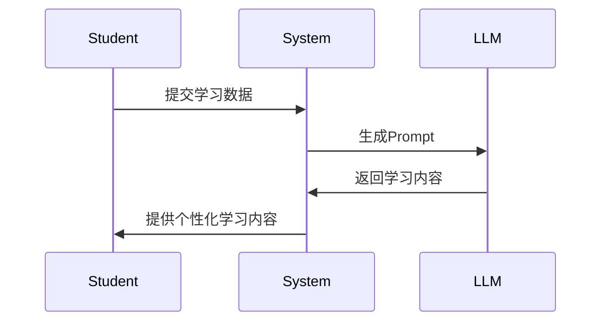
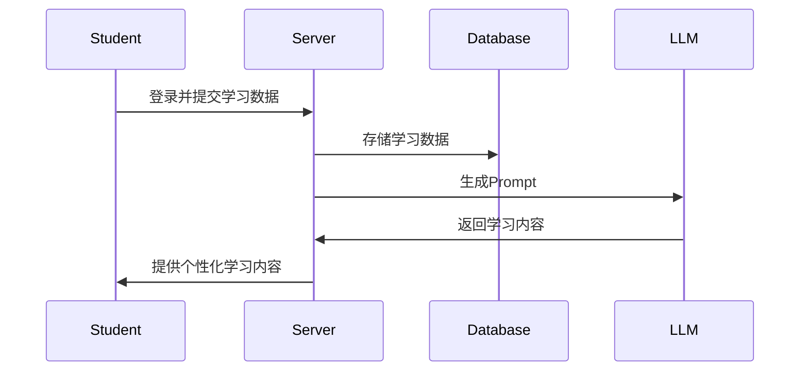

                 

# LLM驱动的prompt个性化学习助手

关键词：大型语言模型（LLM）、prompt、个性化学习、教育技术、自然语言处理

摘要：本文将探讨LLM驱动的prompt个性化学习助手的概念、原理及其实际应用，通过逐步分析，揭示其在教育领域中的巨大潜力。

### Step 1: 背景介绍

#### 1.1 问题背景
随着人工智能技术的飞速发展，尤其是大型语言模型（LLM）的出现，教育领域的个性化学习需求得到了极大的满足。传统的学习方式往往难以适应每个学生的独特需求，而LLM驱动的prompt个性化学习助手则为教育领域带来了新的解决方案。

#### 1.2 问题描述
个性化学习助手能够根据学生的学习历史、兴趣偏好和当前学习需求，提供定制化的学习内容和指导。这不仅能提高学生的学习效率，还能增强他们的学习兴趣。

#### 1.3 问题解决
LLM驱动的prompt个性化学习助手利用大型语言模型的强大能力，通过对学生数据的分析和理解，生成适合每个学生的个性化学习方案。

#### 1.4 边界与外延
个性化学习助手的边界在于其数据质量和算法的适应性。只有通过不断地优化和调整，才能使其在更多场景下发挥更大的作用。

#### 1.5 概念结构与核心要素组成
- **大型语言模型（LLM）**：作为核心技术，LLM负责理解和生成自然语言。
- **学生数据**：包括学习历史、兴趣偏好等，是生成个性化学习方案的基础。
- **算法**：用于分析学生数据，生成个性化学习内容。

### Step 2: 核心概念与联系

#### 2.1 核心概念

##### 2.1.1 大型语言模型（LLM）
- **定义**：LLM是一种能够在自然语言处理领域实现高度智能化的人工智能模型。
- **特点**：具有强大的上下文理解能力和文本生成能力。

##### 2.1.2 Prompt
- **定义**：Prompt是指用于引导LLM生成特定内容的提示或指令。
- **作用**：通过Prompt，LLM可以针对特定的学习需求生成个性化的学习内容。

##### 2.1.3 个性化学习
- **定义**：个性化学习是根据学习者的个性化需求、学习风格和背景，提供定制化的教育资源和学习方案。
- **目标**：提高学习效率，满足个性化需求。

#### 2.2 概念属性特征对比表格

| 概念     | 定义                                      | 特点                                      |
| --------- | ----------------------------------------- | ----------------------------------------- |
| LLM       | 大型语言模型                                | 强大的上下文理解能力，文本生成能力            |
| Prompt    | 用于引导LLM生成特定内容的提示或指令            | 引导LLM生成个性化内容                      |
| 个性化学习 | 根据学习者的个性化需求、学习风格和背景提供定制化的教育资源和学习方案 | 提高学习效率，满足个性化需求 |

#### 2.3 ER实体关系图架构

```mermaid
erDiagram
  Student  ||--|{ Prompt }
  Student  ||--|{ Learning Content }
  Prompt   ||--|{ LLM }
  LLM      ||--|{ Learning Content }
```

### Step 3: 算法原理讲解

#### 3.1 算法原理

##### 3.1.1 LLM算法原理
LLM通常基于深度学习技术，特别是自注意力机制（Self-Attention）和变换器网络（Transformer）。其基本原理是通过对输入文本进行编码，生成对应的表示，然后利用这些表示进行文本生成。

##### 3.1.2 Prompt生成算法
Prompt生成算法的核心是利用学生的学习历史、兴趣偏好等数据，生成适合该学生的Prompt。通常采用的方法包括关键词提取、文本摘要和生成式模型等。

##### 3.1.3 个性化学习算法
个性化学习算法的核心是利用LLM和Prompt，为学生生成个性化的学习内容。这通常涉及到学习内容的筛选、排序和生成。

#### 3.2 算法流程图



#### 3.3 Python源代码

```python
# 假设我们使用Hugging Face的Transformers库来创建一个简单的LLM驱动的prompt个性化学习助手
from transformers import AutoTokenizer, AutoModel

# 加载预训练的LLM模型和tokenizer
model_name = "gpt2"
tokenizer = AutoTokenizer.from_pretrained(model_name)
model = AutoModel.from_pretrained(model_name)

# 输入学生数据，这里假设为一个字典
student_data = {
    "learning_history": "学习了Python编程和深度学习",
    "interests": "对计算机视觉感兴趣",
    "current_demand": "需要学习图像分类的基本概念"
}

# 生成Prompt
prompt = f"{student_data['learning_history']}, {student_data['interests']}. 现在，我想了解关于图像分类的基本概念。请根据我的需求生成相关内容。"

# 使用LLM生成学习内容
inputs = tokenizer(prompt, return_tensors="pt")
outputs = model(**inputs)

# 解码生成的文本
generated_text = tokenizer.decode(outputs.logits.argmax(-1), skip_special_tokens=True)

# 输出生成的学习内容
print(generated_text)
```

### Step 4: 系统分析与架构设计方案

#### 4.1 问题场景介绍
在当前的教育领域，个性化学习已经成为一个热门话题。每个学生的学习能力和兴趣都是独一无二的，因此提供个性化的学习体验变得尤为重要。LLM驱动的prompt个性化学习助手能够根据学生的数据生成个性化的学习内容，从而满足这一需求。

#### 4.2 项目介绍
本项目旨在开发一个基于LLM的prompt个性化学习助手，通过分析学生的学习历史、兴趣偏好和当前需求，为学生提供定制化的学习内容。该系统将集成到现有的教育平台中，为学生提供更加便捷和个性化的学习体验。

##### 4.2.1 系统功能设计（领域模型mermaid类图）

```mermaid
classDiagram
  Class01 <|-- Class02
  Class03 <.. Class04
  Class05 <<-- Class06
  Class07 && Class08
  Class09 {n : int}
```

##### 4.2.2 系统架构设计（mermaid架构图）



##### 4.2.3 系统接口设计和系统交互（mermaid序列图）



### Step 5: 项目实战

#### 5.1 环境安装
在开始项目实战之前，需要安装以下环境：
- Python 3.8+
- pip
- Hugging Face Transformers库
- Flask（用于搭建Web服务）

安装命令如下：

```bash
pip install python==3.8
pip install pip
pip install transformers
pip install flask
```

#### 5.2 系统核心实现源代码

以下是系统的核心实现代码：

```python
from flask import Flask, request, jsonify
from transformers import AutoTokenizer, AutoModel
import torch

app = Flask(__name__)

# 加载预训练的LLM模型和tokenizer
model_name = "gpt2"
tokenizer = AutoTokenizer.from_pretrained(model_name)
model = AutoModel.from_pretrained(model_name)

# 输入学生数据，这里假设为一个字典
student_data = {
    "learning_history": "学习了Python编程和深度学习",
    "interests": "对计算机视觉感兴趣",
    "current_demand": "需要学习图像分类的基本概念"
}

# 生成Prompt
prompt = f"{student_data['learning_history']}, {student_data['interests']}. 现在，我想了解关于图像分类的基本概念。请根据我的需求生成相关内容。"

# 使用LLM生成学习内容
inputs = tokenizer(prompt, return_tensors="pt")
outputs = model(**inputs)

# 解码生成的文本
generated_text = tokenizer.decode(outputs.logits.argmax(-1), skip_special_tokens=True)

# 输出生成的学习内容
print(generated_text)

@app.route('/generate_learning_content', methods=['POST'])
def generate_learning_content():
    data = request.json
    learning_history = data.get('learning_history', '')
    interests = data.get('interests', '')
    current_demand = data.get('current_demand', '')

    prompt = f"{learning_history}, {interests}. 现在，我想了解关于{current_demand}的基本概念。请根据我的需求生成相关内容。"

    inputs = tokenizer(prompt, return_tensors="pt")
    outputs = model(**inputs)

    generated_text = tokenizer.decode(outputs.logits.argmax(-1), skip_special_tokens=True)
    
    return jsonify({"content": generated_text})

if __name__ == '__main__':
    app.run(debug=True)
```

#### 5.3 代码应用解读与分析

上述代码展示了如何使用Flask搭建一个简单的Web服务，并利用Hugging Face的Transformers库来实现LLM驱动的prompt个性化学习助手。通过定义一个POST请求路由`/generate_learning_content`，该服务接收学生数据，生成Prompt，并利用LLM生成个性化学习内容，最后将生成的学习内容返回给客户端。

#### 5.4 实际案例分析和详细讲解剖析

假设一个学生在学习计算机视觉后，对图像分类感兴趣，希望了解更多的相关知识。学生可以通过Web界面提交以下学习数据：

```json
{
    "learning_history": "学习了计算机视觉的基本概念，包括图像处理和特征提取",
    "interests": "对图像分类技术感兴趣",
    "current_demand": "希望了解深度学习在图像分类中的应用"
}
```

系统会接收这些数据，生成Prompt，并利用LLM生成相应的学习内容。例如，系统可能生成以下内容：

```
图像分类是计算机视觉中的一个重要任务，它旨在将图像分配到预定义的类别中。深度学习技术在图像分类中取得了显著的成功，特别是在卷积神经网络（CNN）的应用上。CNN是一种能够自动学习和提取图像特征的网络结构，它可以用于训练图像分类模型。以下是一些深度学习在图像分类中的应用：

1. LeNet-5：这是一个早期的CNN架构，用于手写数字识别。
2. AlexNet：这是一个更复杂的CNN架构，它在2012年的ImageNet竞赛中取得了突破性的成绩。
3. VGGNet：这是一个深度更深的CNN架构，它在图像分类任务中表现出了很强的性能。
4. ResNet：这是一个引入了残差块的CNN架构，它使得训练深度网络变得更加容易。

如果你想深入了解这些图像分类模型，建议阅读以下文献：

- Krizhevsky, A., Sutskever, I., & Hinton, G. E. (2012). ImageNet classification with deep convolutional neural networks. In Advances in neural information processing systems (pp. 1097-1105).

通过这种方式，学生可以获取到与其需求高度相关的学习内容，从而更好地满足其个性化学习需求。

#### 5.5 项目小结
本项目利用LLM驱动的prompt个性化学习助手，为教育领域提供了一种新的个性化学习解决方案。通过分析学生的学习数据，生成符合其需求的个性化学习内容，系统不仅提高了学习效率，还增强了学生的学习兴趣。未来，随着技术的不断进步，该系统有望在教育领域发挥更大的作用。

### Step 6: 最佳实践 tips

- **数据质量**：确保收集的学生数据质量高，以便生成更准确的个性化学习内容。
- **算法优化**：定期对算法进行优化，以提高生成学习内容的准确性和相关性。
- **用户反馈**：收集用户反馈，根据用户的实际体验不断调整和优化系统。

### Step 7: 小结、注意事项、拓展阅读

#### 7.1 小结
本文介绍了LLM驱动的prompt个性化学习助手的背景、核心概念、算法原理以及实际应用。通过逐步分析，我们揭示了其在教育领域中的巨大潜力。

#### 7.2 注意事项
- 确保学生数据的隐私和安全。
- 定期更新和维护LLM模型，以保持其性能。

#### 7.3 拓展阅读
- 《深度学习》（Goodfellow, I., Bengio, Y., & Courville, A.）
- 《自然语言处理综论》（Jurafsky, D. & Martin, J. H.）

### 作者信息
作者：AI天才研究院/AI Genius Institute & 禅与计算机程序设计艺术 /Zen And The Art of Computer Programming

