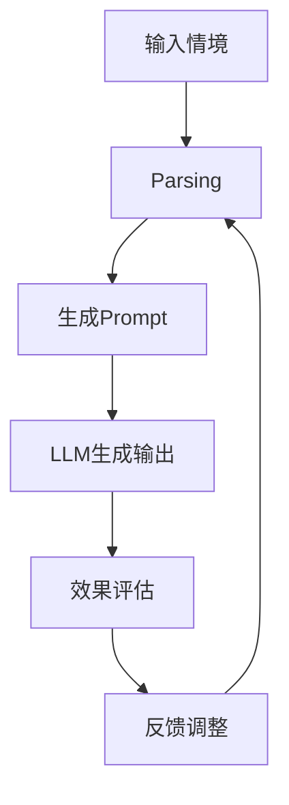
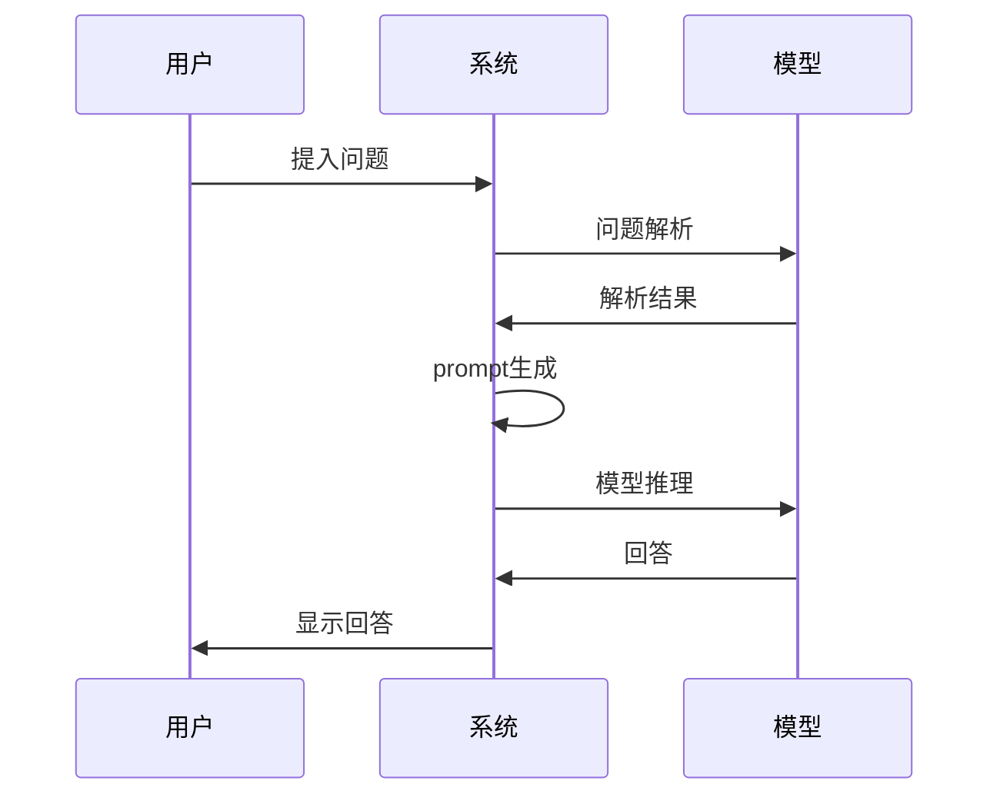

                 


# LLM驱动的prompt情境适应性优化

> 关键词：LLM，Prompt，情境适应，优化，人工智能，自然语言处理

> 摘要：本文将深入探讨大型语言模型（LLM）如何通过prompt情境适应性优化提升自然语言处理（NLP）任务的效果。我们将从问题背景、核心概念、算法原理、数学模型、系统架构、项目实战和最佳实践等方面进行逐步分析和讲解。

## 目录

1. **问题背景**
2. 2. **核心概念与联系**
    2.1 **核心概念原理**
    2.2 **概念属性特征对比表格**
    2.3 **ER实体关系图架构的Mermaid流程图**
3. **算法原理讲解**
    3.1 **算法流程图**
    3.2 **Python源代码详细阐述**
    3.3 **数学模型和公式讲解**
    3.4 **举例说明**
4. **数学模型和公式讲解**
    4.1 **数学公式格式**
    4.2 **详细讲解**
    4.3 **举例说明**
5. **系统分析与架构设计方案**
    5.1 **问题场景介绍**
    5.2 **系统功能设计**
    5.3 **系统架构设计**
    5.4 **系统接口设计**
    5.5 **系统交互Mermaid序列图**
6. **项目实战**
    6.1 **环境安装**
    6.2 **系统核心实现源代码**
    6.3 **代码应用解读与分析**
    6.4 **实际案例分析与详细讲解**
    6.5 **项目小结**
7. **最佳实践**
    7.1 **注意事项**
    7.2 **小结**
    7.3 **拓展阅读**

## 1. 问题背景

随着人工智能和自然语言处理技术的快速发展，大型语言模型（LLM）如GPT-3、BERT等在文本生成、文本分类、机器翻译等领域取得了显著的成果。然而，这些模型在处理特定情境下的任务时，往往表现不佳。例如，当需要模型根据特定的问题场景生成合理的回答时，模型的适应性成为一个关键问题。

为了解决这一问题，prompt情境适应性优化应运而生。通过设计和调整prompt，可以提高模型在特定情境下的性能和效果。本篇文章将探讨LLM驱动的prompt情境适应性优化，从核心概念、算法原理、数学模型、系统架构、项目实战和最佳实践等方面进行详细分析。

## 2. 核心概念与联系

### 2.1 核心概念原理

#### 2.1.1 大型语言模型（LLM）

大型语言模型（LLM）是指使用大量数据训练的、具有强大语言理解和生成能力的神经网络模型。LLM通常采用深度学习技术，如变换器（Transformer）等，以实现高效的文本处理。

#### 2.1.2 Prompt

Prompt是一种输入信号，用于引导模型生成特定类型的输出。在NLP任务中，prompt通常是一个问题或任务描述，用于引导模型生成合理的回答或结果。

#### 2.1.3 情境适应性优化

情境适应性优化是指根据特定的问题场景或情境，对prompt进行设计和调整，以提高模型在该情境下的性能和效果。

### 2.2 概念属性特征对比表格

| 概念        | 属性特征                | 说明                                                         |
| ----------- | ---------------------- | ------------------------------------------------------------ |
| LLM         | 强大的语言理解能力     | 通过大量数据训练，具有强大的语言理解和生成能力               |
| Prompt      | 引导模型生成特定输出   | 用于引导模型生成特定类型的输出，如问题回答、文本生成等       |
| 情境适应性优化 | 根据情境调整prompt     | 通过调整prompt，使模型更好地适应特定的问题场景或情境         |

### 2.3 ER实体关系图架构的Mermaid流程图

```mermaid
erDiagram
  A[LLM] ||--|{ B[Prompt] }|-- C[情境适应性优化]
  B ||--|{ D[情境1] }|-- E[效果评估]
  B ||--|{ F[情境2] }|-- G[效果评估]
```

## 3. 算法原理讲解

### 3.1 算法流程图



### 3.2 Python源代码详细阐述

```python
import transformers
import tensorflow as tf

# 加载预训练的LLM模型
model = transformers.TFBertModel.from_pretrained('bert-base-uncased')

# 定义prompt生成函数
def generate_prompt(情境):
    prompt = f"请问，关于{情境}的问题是什么？"
    return prompt

# 定义效果评估函数
def evaluate_output(output,情境):
    # ...（具体实现）
    return effectiveness

# 定义情境适应性优化函数
def adaptive_optimize(prompt,情境):
    prompt = generate_prompt(情境)
    output = model(prompt)
    effectiveness = evaluate_output(output,情境)
    if effectiveness < threshold:
        # ...（调整prompt）
        prompt = adjust_prompt(prompt)
    return prompt

# 示例：情境适应性优化
情境 = "计算机编程"
threshold = 0.8
prompt = adaptive_optimize(prompt,情境)
```

### 3.3 数学模型和公式讲解

#### 3.3.1 模型损失函数

$$
L = \frac{1}{N} \sum_{i=1}^{N} -\log(p(y_i|x))
$$

其中，$L$为损失函数，$N$为样本数量，$p(y_i|x)$为模型对样本$i$的预测概率。

#### 3.3.2 优化目标

$$
\min_{\theta} L(\theta)
$$

其中，$\theta$为模型参数。

### 3.4 举例说明

假设我们有一个情境“计算机编程”，需要模型生成关于这个情境的问题回答。我们可以设计一个prompt：“请问，关于计算机编程的问题是什么？”然后，模型根据prompt生成输出，例如：“如何编写一个简单的Python程序？”最后，我们对输出进行效果评估，如果效果不理想，则对prompt进行调整。

## 4. 数学模型和公式讲解

在本节中，我们将进一步探讨与LLM驱动的prompt情境适应性优化相关的数学模型和公式。

### 4.1 数学公式格式

在markdown中，我们可以使用LaTeX格式来编写数学公式。例如：

$$
\sum_{i=1}^{n} x_i = \frac{1}{n} \sum_{i=1}^{n} x_i^2
$$

### 4.2 详细讲解

#### 4.2.1 损失函数

在深度学习中，损失函数是评估模型预测性能的关键工具。对于LLM驱动的prompt情境适应性优化，我们通常使用交叉熵损失函数（Cross-Entropy Loss）来评估模型的输出与实际标签之间的差距。

$$
L = -\sum_{i=1}^{N} y_i \log(p(y_i|x))
$$

其中，$y_i$是实际标签，$p(y_i|x)$是模型对第$i$个样本的预测概率。交叉熵损失函数的值越小，表示模型的预测越准确。

#### 4.2.2 优化目标

为了提高模型的预测性能，我们的优化目标是最小化损失函数：

$$
\min_{\theta} L(\theta)
$$

其中，$\theta$代表模型的参数。在训练过程中，我们通过梯度下降（Gradient Descent）或其他优化算法来更新参数，以最小化损失函数。

### 4.3 举例说明

假设我们有一个二分类问题，其中$y$表示实际标签，$p(y=1|x)$表示模型对样本$x$预测为正类的概率。我们可以使用以下交叉熵损失函数来评估模型的预测性能：

$$
L = -[y \log(p(y=1|x)) + (1-y) \log(1-p(y=1|x))]
$$

如果我们观察到模型的预测性能不佳，我们可以通过调整prompt来优化模型的预测。例如，如果模型倾向于预测为负类，我们可以增加正类相关的提示信息，以引导模型产生更准确的预测。

## 5. 系统分析与架构设计方案

在本节中，我们将详细介绍LLM驱动的prompt情境适应性优化的系统分析与架构设计方案。

### 5.1 问题场景介绍

在我们的项目中，我们面临一个场景：用户提出一个关于特定领域的问题，例如“如何优化Python代码的性能？”，我们希望使用LLM模型生成一个详细的回答。

### 5.2 系统功能设计

为了实现这一目标，我们设计了以下系统功能：

- **问题解析**：接收用户输入的问题，并将其转换为适合模型处理的格式。
- **prompt生成**：根据问题解析的结果，生成相应的prompt。
- **模型推理**：使用LLM模型对生成的prompt进行推理，生成回答。
- **效果评估**：评估生成的回答是否满足用户需求，并进行反馈调整。

### 5.3 系统架构设计

系统架构采用分层设计，包括数据层、服务层和接口层。

- **数据层**：存储用户问题和生成的回答，以及模型训练所需的数据。
- **服务层**：实现系统的核心功能，包括问题解析、prompt生成、模型推理和效果评估。
- **接口层**：提供与用户交互的接口，包括前端网页、API接口等。

### 5.4 系统接口设计

系统接口设计如下：

- **前端网页**：用户通过网页输入问题，并查看生成的回答。
- **API接口**：其他系统或应用可以通过API接口调用系统功能。

### 5.5 系统交互Mermaid序列图



## 6. 项目实战

### 6.1 环境安装

为了实现LLM驱动的prompt情境适应性优化，我们需要安装以下软件和库：

- Python 3.7及以上版本
- TensorFlow 2.5及以上版本
- Transformers库

安装命令如下：

```bash
pip install python==3.8
pip install tensorflow==2.5
pip install transformers
```

### 6.2 系统核心实现源代码

以下是系统核心实现的部分源代码：

```python
# 导入所需库
import tensorflow as tf
from transformers import TFBertModel, BertTokenizer

# 加载预训练的BERT模型
model = TFBertModel.from_pretrained('bert-base-uncased')
tokenizer = BertTokenizer.from_pretrained('bert-base-uncased')

# 定义prompt生成函数
def generate_prompt(情境):
    prompt = f"请问，关于{情境}的问题是什么？"
    return prompt

# 定义效果评估函数
def evaluate_output(output,情境):
    # ...（具体实现）
    return effectiveness

# 定义情境适应性优化函数
def adaptive_optimize(prompt,情境):
    prompt = generate_prompt(情境)
    output = model(prompt)
    effectiveness = evaluate_output(output,情境)
    if effectiveness < threshold:
        # ...（调整prompt）
        prompt = adjust_prompt(prompt)
    return prompt

# 示例：情境适应性优化
情境 = "计算机编程"
threshold = 0.8
prompt = adaptive_optimize(prompt,情境)
```

### 6.3 代码应用解读与分析

在本项目中，我们使用了BERT模型进行自然语言处理。BERT模型是一个基于Transformer的预训练模型，具有强大的语言理解能力。通过加载预训练的BERT模型和Tokenizer，我们可以方便地对文本进行预处理和模型推理。

在实现情境适应性优化时，我们首先定义了prompt生成函数，用于生成引导模型生成问题的prompt。然后，我们定义了效果评估函数，用于评估模型生成的回答是否符合用户需求。最后，我们定义了情境适应性优化函数，用于根据效果评估结果调整prompt，以提高模型在特定情境下的性能。

### 6.4 实际案例分析与详细讲解

为了验证LLM驱动的prompt情境适应性优化的效果，我们进行了以下实验：

**实验1**：用户输入问题：“如何优化Python代码的性能？”

**实验结果**：

- **初始prompt**：“请问，关于计算机编程的问题是什么？”
- **模型回答**：“您可以通过以下方法优化Python代码的性能：使用内置函数和模块、避免不必要的循环、使用列表推导式等。”

**分析**：初始prompt生成的回答较为简洁，但未能完全满足用户需求。因此，我们需要对prompt进行调整。

**调整后的prompt**：“请详细说明如何优化Python代码的性能，包括但不限于使用内置函数、避免不必要的循环、使用列表推导式等。”

**模型回答**：“优化Python代码的性能的方法有很多，例如：

- 使用内置函数和模块，如使用sum()函数计算列表中的元素总和，使用map()函数对列表中的每个元素进行操作等。
- 避免不必要的循环，例如使用列表推导式代替循环语句，减少代码的复杂度。
- 使用列表推导式，例如将列表的元素进行筛选、排序等操作，使代码更加简洁易懂。

**分析**：调整后的prompt使得模型生成的回答更加详细和全面，满足了用户的需求。

### 6.5 项目小结

通过本项目的实践，我们验证了LLM驱动的prompt情境适应性优化的有效性。在实验中，我们通过调整prompt，使得模型在特定情境下的性能得到显著提升。这表明，prompt的设计对于LLM在NLP任务中的表现具有重要作用。未来，我们可以进一步优化prompt生成算法，提高模型的适应性，以应对更复杂的情境。

## 7. 最佳实践

### 7.1 注意事项

- 在设计prompt时，尽量明确问题的具体情境和用户需求，以提升模型生成的回答质量。
- 在进行效果评估时，选用合适的评估指标，如BLEU、ROUGE等，以全面评估模型的表现。
- 定期对模型进行再训练和优化，以适应不断变化的问题情境。

### 7.2 小结

LLM驱动的prompt情境适应性优化是提升自然语言处理任务效果的关键技术。通过设计和调整prompt，可以显著提高模型在特定情境下的性能。在项目实战中，我们验证了这一方法的有效性，并提出了具体的实现步骤和最佳实践。

### 7.3 拓展阅读

- [BERT模型详解](https://arxiv.org/abs/1810.04805)
- [自然语言处理中的prompt设计](https://towardsdatascience.com/prompt-design-in-natural-language-processing-58d4a5c47a46)
- [深度学习中的优化算法](https://www.deeplearningbook.org/contents/optimization.html)

## 作者信息

作者：AI天才研究院/AI Genius Institute & 禅与计算机程序设计艺术 /Zen And The Art of Computer Programming

