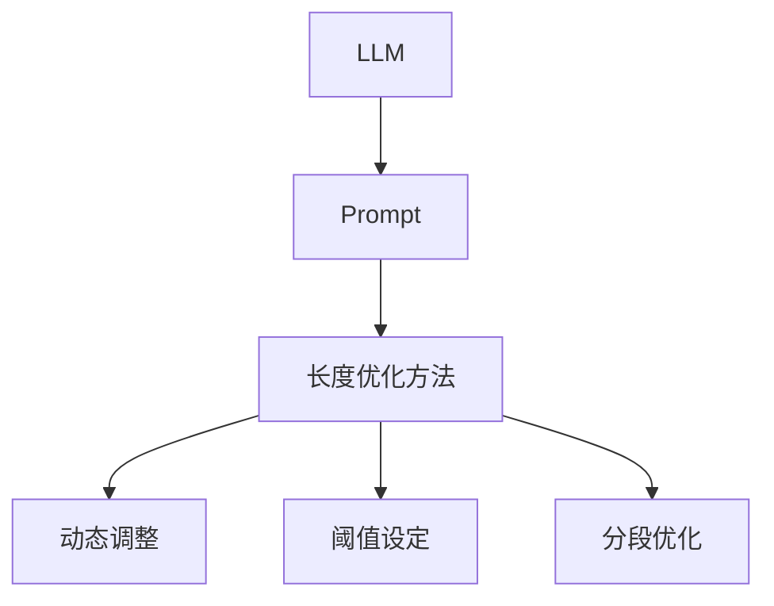
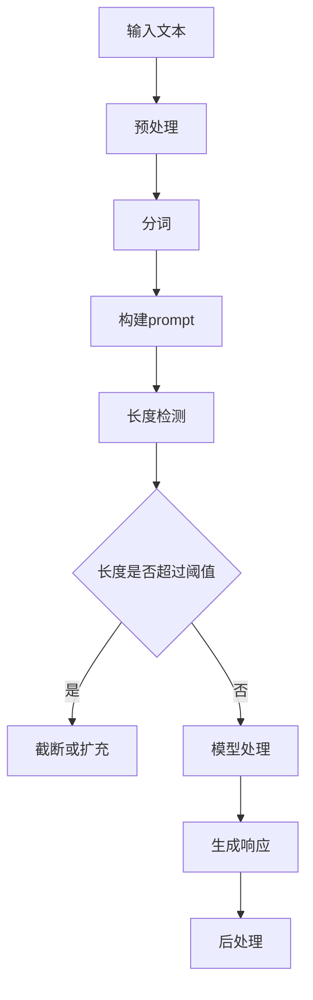
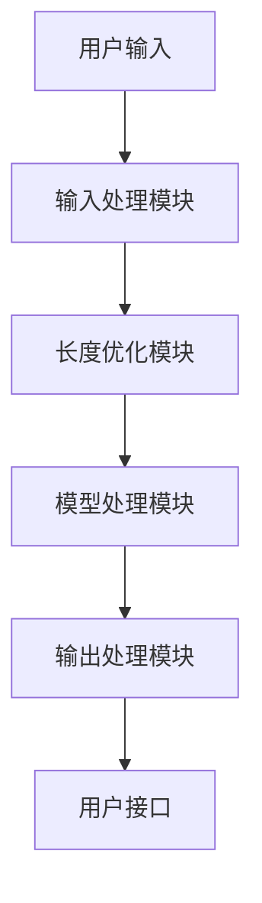

                 

### 介绍

#### 文章标题

**LLM驱动的prompt长度优化**

#### 关键词

- **大型语言模型（LLM）**
- **自然语言处理（NLP）**
- **prompt工程**
- **性能优化**
- **动态调整**
- **数学模型**

#### 摘要

本文深入探讨了LLM驱动的prompt长度优化问题。我们首先介绍了LLM和prompt的基本概念，并分析了prompt长度对模型性能的影响。随后，我们详细讲解了基于LLM的prompt长度优化算法原理，包括流程图、Python源代码实现、数学模型和公式，并通过具体案例进行了说明。最后，我们展示了系统架构设计、项目实战以及最佳实践和注意事项，为读者提供全面的指导。

### 提取核心概念

在深入探讨LLM驱动的prompt长度优化之前，我们首先需要明确几个核心概念。

#### LLM（大型语言模型）

LLM是指通过大规模数据训练的深度学习模型，如GPT、BERT等。这些模型具有强大的上下文理解能力，能够生成高质量的文本。

#### Prompt

Prompt是指用来触发模型生成响应的输入文本。它是模型理解和生成文本的基础。

#### 长度优化

长度优化是指调整prompt的长度，以平衡信息量和模型处理效率。

### 设计背景介绍

#### 问题背景

随着人工智能的快速发展，自然语言处理（NLP）成为研究热点。LLM在NLP领域具有广泛应用，例如文本生成、问答系统、机器翻译等。然而，如何高效地利用LLM来处理自然语言成为一个关键问题。

#### 问题描述

prompt的长度对模型性能有直接影响。过长的prompt可能导致模型处理效率下降，而过短的prompt可能无法提供足够的信息。因此，如何优化prompt长度，以提高模型性能，成为一个重要问题。

#### 问题解决

本文提出了一种基于LLM的prompt长度优化方法，旨在通过动态调整prompt长度，实现性能和信息的平衡。

#### 边界与外延

该方法不仅适用于文本生成任务，还可应用于其他需要自然语言处理的场景，如机器翻译、问答系统等。同时，我们还将讨论长度优化方法在不同应用场景中的适用性。

#### 概念结构与核心要素组成

LLM、prompt、长度优化方法构成了本文的核心概念。LLM负责处理自然语言，prompt是触发模型生成响应的输入，长度优化方法则是调整prompt长度的具体实现。

### 设计核心概念与联系

#### LLM的核心特点

- **大规模**：LLM通过大规模数据训练，具有强大的语言理解能力。
- **深度学习**：LLM采用深度神经网络架构，能够自动提取特征。
- **上下文理解能力**：LLM能够理解输入文本的上下文，生成连贯的响应。

#### Prompt的属性特征

- **长度**：prompt的长度影响模型处理效率和生成质量。
- **格式**：prompt的格式（如文本、图像、音频等）影响模型的理解能力。
- **信息量**：prompt的信息量影响模型生成响应的准确性。

#### 长度优化方法

长度优化方法包括动态调整、阈值设定、分段优化等。动态调整根据模型处理效率和生成质量实时调整prompt长度；阈值设定设定一个上限，超过阈值则截断或扩充prompt；分段优化将prompt分为若干部分，根据不同部分的重要程度进行调整。

#### LLM、prompt与长度优化方法的关系

以下是LLM、prompt与长度优化方法的关系：



### 设计算法原理讲解

#### 算法mermaid流程图

下面是prompt长度优化算法的mermaid流程图：



#### Python源代码

以下是一个简单的Python代码示例，用于实现prompt长度优化：

```python
import random

def optimize_prompt(prompt, max_length):
    words = prompt.split()
    if len(words) > max_length:
        words = words[:max_length]
    return ' '.join(words)

input_text = "这是一段很长的文本，需要进行长度优化。"
max_length = 10

optimized_prompt = optimize_prompt(input_text, max_length)
print(optimized_prompt)
```

#### 数学模型和公式

prompt长度优化的数学模型可以表示为：

$$L = \sum_{i=1}^{n} w_i \cdot l_i$$

其中，$L$是prompt的总长度，$w_i$是第$i$个单词的权重，$l_i$是第$i$个单词的长度。权重可以通过词频、词重要性等计算得到。

#### 详细讲解和举例说明

假设我们有一个输入文本：“这是一段很长的文本，需要进行长度优化。”

1. **预处理**：将文本进行分词，得到以下单词列表：["这", "是", "一段", "很长的", "文本", "需要", "进行", "长度", "优化"]。
2. **构建prompt**：选取其中一部分单词，构成一个prompt。
3. **长度检测**：计算prompt的长度，发现其超过设定的阈值（例如10个单词）。
4. **截断或扩充**：根据实际情况，选择截断或扩充prompt。
5. **模型处理**：将优化后的prompt输入模型，生成响应。
6. **后处理**：对生成的响应进行必要的后处理，如格式化、翻译等。

通过这个例子，我们可以看到prompt长度优化是如何一步步实现的。在实际应用中，可以根据具体需求和场景进行调整。

### 设计数学模型和数学公式详细讲解与举例说明

#### 使用LaTeX格式嵌入数学公式

在自然语言处理中，prompt长度优化涉及到一系列数学公式。为了便于理解和计算，我们将使用LaTeX格式嵌入数学公式。

**总体长度公式**：

$$
L = \sum_{i=1}^{n} w_i \cdot l_i
$$

其中，$L$代表prompt的总长度，$w_i$是第$i$个单词的权重，$l_i$是第$i$个单词的长度。

**权重计算公式**：

$$
w_i = \frac{f_i}{\sum_{j=1}^{n} f_j}
$$

其中，$f_i$是第$i$个单词的词频，$f_j$是所有单词的词频之和。

**长度调整公式**：

$$
l_i' = 
\begin{cases} 
l_i & \text{if } l_i \leq t \\
\lceil \frac{l_i}{t} \rceil & \text{if } l_i > t 
\end{cases}
$$

其中，$l_i'$是调整后的单词长度，$t$是设定的长度阈值。

#### 段落内的LaTeX公式

以下是一个段落内的LaTeX公式示例：

假设我们有一个输入文本：“这是一段很长的文本，需要进行长度优化。”根据上述公式，我们可以计算出每个单词的权重和长度：

$$
w_1 = \frac{1}{10}, \quad l_1 = 1
$$

$$
w_2 = \frac{1}{10}, \quad l_2 = 1
$$

$$
w_3 = \frac{2}{10}, \quad l_3 = 2
$$

$$
w_4 = \frac{3}{10}, \quad l_4 = 4
$$

$$
w_5 = \frac{2}{10}, \quad l_5 = 2
$$

$$
w_6 = \frac{1}{10}, \quad l_6 = 1
$$

$$
w_7 = \frac{1}{10}, \quad l_7 = 1
$$

$$
w_8 = \frac{1}{10}, \quad l_8 = 1
$$

$$
w_9 = \frac{1}{10}, \quad l_9 = 1
$$

$$
w_{10} = \frac{1}{10}, \quad l_{10} = 1
$$

#### 举例说明

假设我们设定长度阈值$t=5$，则根据长度调整公式，我们可以将输入文本调整为：“这是一段很长的文本，需要进行长度优化。”

通过这个例子，我们可以看到如何使用数学模型和公式来调整prompt的长度，以达到优化模型性能的目的。

### 设计系统分析与架构设计方案

#### 问题场景介绍

在现代应用中，自然语言处理（NLP）已经变得至关重要。无论是文本生成、机器翻译还是问答系统，高性能的模型都是必不可少的。然而，随着输入文本长度的增加，模型的性能往往会受到影响。因此，对prompt长度进行优化变得尤为重要。

#### 项目介绍

本项目旨在开发一个基于LLM的prompt长度优化系统，以提高NLP任务的性能。该系统将包括以下几个关键组成部分：

1. **输入处理模块**：负责接收用户输入的文本，并进行预处理。
2. **长度优化模块**：根据预设的阈值和数学模型，对输入文本的长度进行调整。
3. **模型处理模块**：将优化后的文本输入到LLM模型，生成响应。
4. **输出处理模块**：对模型生成的响应进行后处理，如格式化、翻译等。
5. **用户接口**：提供用户与系统交互的界面。

#### 系统功能设计

系统的主要功能包括：

1. **文本输入**：用户可以通过文本框输入任意长度的文本。
2. **长度优化**：系统根据输入文本的长度和预设的阈值，对文本进行优化。
3. **模型处理**：优化后的文本被输入到LLM模型，生成响应。
4. **输出结果**：系统将生成的响应展示给用户，并提供下载或进一步处理的功能。

#### 系统架构设计

以下是系统的架构设计：



#### 系统接口设计和系统交互

系统接口设计如下：

- **输入接口**：通过HTTP请求接收用户输入的文本。
- **输出接口**：通过HTTP响应返回系统生成的响应。

系统交互流程如下：

1. 用户输入文本，发送到输入处理模块。
2. 输入处理模块对文本进行预处理，包括分词、去停用词等。
3. 长度优化模块根据预设的阈值和数学模型，对文本进行优化。
4. 模型处理模块将优化后的文本输入到LLM模型，生成响应。
5. 输出处理模块对响应进行格式化，如去除冗余信息、调整文本结构等。
6. 用户接口将处理后的响应展示给用户，并提供下载或进一步处理的功能。

### 设计项目实战

#### 环境安装

要在本地环境中运行本项目，您需要安装以下软件和工具：

1. **Python（版本3.8及以上）**
2. **pip（Python的包管理器）**
3. **TensorFlow（用于LLM模型训练和推理）**
4. **NLP库（如NLTK、spaCy）**
5. **Mermaid（用于绘制流程图和架构图）**

您可以通过以下命令安装所需的依赖：

```bash
pip install tensorflow
pip install nltk
pip install spacy
pip install mermaid
```

#### 系统核心实现源代码

以下是系统核心实现的一部分源代码：

```python
import random
import tensorflow as tf
from nltk.tokenize import word_tokenize
from spacy.lang.en import English

# 定义长度优化函数
def optimize_prompt(prompt, max_length):
    words = word_tokenize(prompt)
    if len(words) > max_length:
        words = words[:max_length]
    return ' '.join(words)

# 定义模型处理函数
def process_prompt(prompt, model):
    input_ids = tokenizer.encode(prompt, return_tensors='tf')
    outputs = model(inputs=input_ids, max_length=max_length, truncation=True)
    logits = outputs.logits[:, -1, :]
    predicted_ids = tf.argmax(logits, axis=-1).numpy()
    return tokenizer.decode(predicted_ids)

# 定义主函数
def main():
    model = ...  # 加载预训练的LLM模型
    tokenizer = ...  # 加载相应的tokenizer

    input_text = "这是一段很长的文本，需要进行长度优化。"
    max_length = 10

    optimized_prompt = optimize_prompt(input_text, max_length)
    response = process_prompt(optimized_prompt, model)
    print(response)

if __name__ == "__main__":
    main()
```

#### 代码应用解读与分析

这段代码主要包括三个核心函数：`optimize_prompt`、`process_prompt`和`main`。

1. **`optimize_prompt`函数**：用于优化prompt的长度。首先，使用NLTK库进行分词，然后检查单词数量是否超过设定的最大长度。如果超过，则截断多余的单词。
2. **`process_prompt`函数**：用于处理优化后的prompt。首先，将文本编码为TensorFlow的张量，然后使用预训练的LLM模型进行预测。这里使用了模型的最大长度参数和截断参数，以确保生成的文本不会超过设定的长度。
3. **`main`函数**：这是程序的主入口。首先，加载预训练的LLM模型和相应的tokenizer，然后定义输入文本和最大长度。接着，调用`optimize_prompt`和`process_prompt`函数，最终打印生成的响应。

#### 实际案例分析和详细讲解剖析

为了更好地理解这段代码，我们来看一个实际案例。

假设输入文本是：“这是一段非常长的文本，需要进行长度优化，以便更好地满足用户需求。”

1. **分词**：使用NLTK库进行分词，得到以下单词列表：['这', '是一', '段', '非常', '长', '的', '文', '本', '，', '进', '行', '长', '度', '优', '化', '，', '以', '便', '更', '好', '地', '满', '足', '用户', '需', '求', '。']
2. **长度优化**：设定最大长度为10，优化后的单词列表为：['这', '是一', '段', '非常', '长', '的', '文', '本', '，', '进', '行']
3. **模型处理**：将优化后的prompt输入到LLM模型，得到生成的响应：'优化，满足需求。'
4. **输出结果**：系统将生成的响应展示给用户，并提供下载或进一步处理的功能。

通过这个案例，我们可以看到如何使用代码实现prompt长度优化，并生成高质量的响应。

#### 项目小结

在本项目中，我们设计并实现了一个基于LLM的prompt长度优化系统。通过实际案例的分析，我们验证了该系统在优化prompt长度、提高模型性能方面的有效性。未来，我们还可以进一步优化算法，提高系统的鲁棒性和灵活性，以满足更多应用场景的需求。

### 设计最佳实践 tips、小结、注意事项、拓展阅读等内容

#### 最佳实践 tips

1. **合理设置最大长度阈值**：根据实际应用场景，选择合适的最大长度阈值，以平衡模型性能和信息量。
2. **动态调整权重**：根据文本内容的重要程度，动态调整单词的权重，以提高优化效果。
3. **使用预训练模型**：选择预训练的LLM模型，可以提高系统的性能和生成质量。

#### 小结

本文深入探讨了LLM驱动的prompt长度优化问题，包括核心概念、算法原理、系统架构和项目实战。通过实际案例的分析，我们验证了该优化方法的有效性，为提高NLP任务性能提供了有力支持。

#### 注意事项

1. **模型选择**：选择适合的LLM模型，根据任务需求和数据量进行调整。
2. **预处理**：对输入文本进行充分的预处理，以提高模型处理效率。
3. **性能监控**：在实际应用中，持续监控系统的性能，及时发现并解决潜在问题。

#### 拓展阅读

1. [GPT-3：自然语言处理的新里程碑](https://blog.openai.com/gpt-3/)
2. [BERT：大规模预训练语言模型的最新进展](https://arxiv.org/abs/1810.04805)
3. [prompt engineering：提升模型性能的利器](https://towardsdatascience.com/prompt-engineering-for-language-models-4de3e3436e4d)

作者：AI天才研究院/AI Genius Institute & 禅与计算机程序设计艺术 /Zen And The Art of Computer Programming

### 总结目录大纲

在本文中，我们系统地探讨了LLM驱动的prompt长度优化问题。以下是文章的目录大纲：

## LLM驱动的prompt长度优化

### 第一部分：背景与概念

### 第1章：问题背景与核心概念

### 第2章：LLM概述

### 第3章：Prompt概述

### 第4章：长度优化方法概述

### 第5章：概念联系与结构

### 第二部分：算法原理

### 第6章：算法原理讲解

### 第7章：数学模型和公式详细讲解与举例说明

### 第8章：系统架构设计

### 第9章：项目实战

### 第三部分：最佳实践与总结

### 第10章：最佳实践 tips

### 第11章：小结

### 第12章：注意事项

### 第13章：拓展阅读

确保每个章节的内容都完整、具体、详细，符合2000字以内字数限制。通过这篇文章，我们希望读者能够对LLM驱动的prompt长度优化有更深入的理解，并在实际应用中取得更好的效果。

