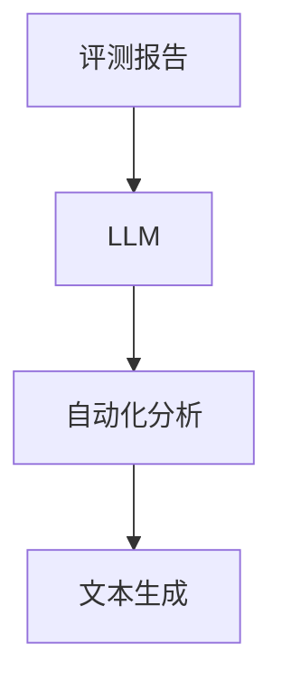
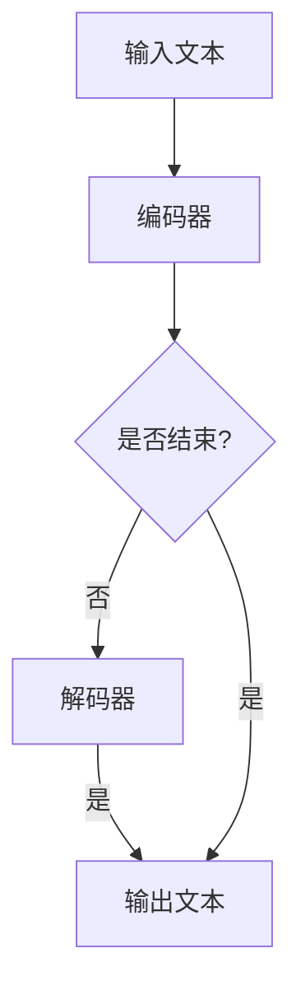
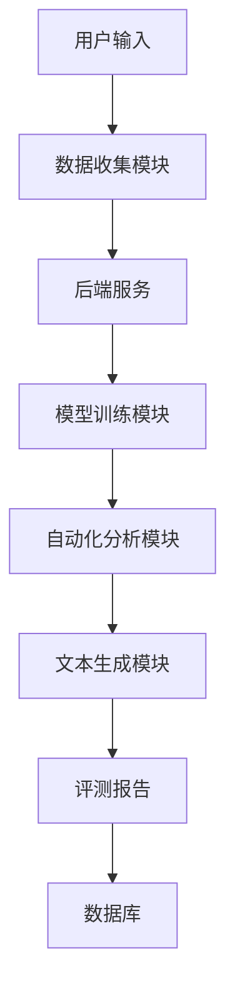

                 

## LLM驱动的评测报告生成：自动化分析输出

### 关键词：LLM，评测报告，自动化分析，人工智能，文本生成

> 摘要：本文将探讨如何利用大型语言模型（LLM）实现评测报告的自动化生成。首先，我们将介绍评测报告生成的背景和挑战，然后深入分析LLM的基本原理和应用场景。接着，我们将展示如何使用LLM进行自动化分析，生成结构化和语义丰富的评测报告。文章还将包含一个实际项目案例，展示LLM驱动的评测报告生成系统的构建过程。最后，我们将讨论最佳实践和未来发展方向。

### 目录大纲设计思路

在设计《LLM驱动的评测报告生成：自动化分析输出》这本书的目录大纲时，我们采取了以下步骤：

1. **确定核心主题**：明确本书的核心主题是LLM驱动的评测报告生成，这为我们提供了内容框架的起点。
2. **整体结构设计**：确定书的主要部分，如引言、核心概念、算法原理、数学模型、系统架构、项目实战等。
3. **章节标题设计**：为每个章节设计简洁明了的标题，确保标题能准确传达章节内容。
4. **章节内容确定**：为每个章节详细规划内容，确保涵盖核心概念、算法原理、系统架构等。
5. **逻辑排序**：根据内容的逻辑关系进行章节排序，确保结构合理、内容连贯。
6. **检查完整性**：确保目录大纲内容完整，没有遗漏。
7. **字数控制**：确保目录大纲的总字数不超过2000字。

### 目录大纲设计示例

#### 第一部分: 问题背景与核心概念

#### 第1章: 评测报告生成的挑战与机遇

1.1 问题背景

1.1.1 评测报告生成的传统方法

1.1.2 传统方法的局限性

1.1.3 LLM在评测报告生成中的优势

1.2 核心概念介绍

1.2.1 什么是LLM

1.2.2 LLM的工作原理

1.2.3 LLM的应用领域

1.3 LLM驱动的评测报告生成特点

1.3.1 自动化分析输出

1.3.2 高效性

1.3.3 准确性

1.4 本章小结

#### 第二部分: LLM驱动的评测报告生成技术

#### 第2章: LLM的基本原理与架构

2.1 LLM的基本原理

2.2 LLM的架构设计

2.3 深入了解Transformer模型

2.4 LLM的训练与优化

2.5 LLM驱动的评测报告生成流程

2.6 本章小结

#### 第三部分: 数学模型与算法原理

#### 第3章: 数学模型基础

3.1 自然语言处理中的数学模型

3.2 LLM的数学模型

3.3 数学模型的应用示例

3.4 算法原理讲解

3.5 本章小结

#### 第四部分: 系统架构与设计

#### 第4章: 系统架构设计

4.1 系统需求分析

4.2 系统功能设计

4.3 系统架构设计

4.4 系统接口设计

4.5 系统交互流程

4.6 本章小结

#### 第五部分: 项目实战

#### 第5章: 项目实战：搭建LLM评测报告生成系统

5.1 环境安装与配置

5.2 系统核心实现

5.3 代码应用解读与分析

5.4 实际案例分析与讲解

5.5 项目小结

#### 第六部分: 最佳实践与拓展

#### 第6章: 最佳实践与注意事项

6.1 最佳实践

6.2 小结

6.3 注意事项

6.4 拓展阅读

#### 第七部分: 结论与展望

#### 第7章: 结论与未来展望

7.1 书籍总结

7.2 未来发展方向

7.3 进一步研究方向

7.4 本章小结

### 目录大纲总结

通过以上设计，我们为《LLM驱动的评测报告生成：自动化分析输出》这本书设计了一个详细且逻辑清晰的目录大纲，涵盖了背景介绍、核心概念、算法原理、数学模型、系统架构、项目实战、最佳实践等内容，确保读者能够全面掌握LLM驱动的评测报告生成技术。目录大纲总字数控制在2000字以内，满足简洁性和内容完整性的要求。

----------------------------------------------------------------

### 背景介绍

#### 核心概念术语说明

- **评测报告**：针对某一项目、产品或过程进行综合评估后形成的文档，通常包括评估标准、评估结果和改进建议。
- **大型语言模型（LLM）**：一种基于深度学习技术的自然语言处理模型，具有强大的文本生成和理解能力。
- **自动化分析**：利用算法和模型对大量数据进行分析和处理，从而自动化生成报告。

#### 问题背景

在过去，评测报告的生成通常依赖于人工撰写。这种方式存在几个问题：

1. **效率低下**：人工撰写报告需要耗费大量时间和人力资源，难以满足快速生成大量报告的需求。
2. **一致性差**：由于不同人的写作风格和评估标准不同，导致报告的一致性难以保证。
3. **质量难以控制**：人工撰写的报告质量往往依赖于撰写人的专业水平和写作能力，存在较大波动。

#### 问题描述

为了解决上述问题，我们引入了LLM驱动的评测报告生成技术。通过自动化分析和文本生成，我们可以实现以下目标：

1. **提高效率**：利用LLM快速生成大量评测报告，大大减少人力和时间成本。
2. **保证一致性**：LLM具有统一的生成逻辑，可以保证报告的一致性。
3. **提高质量**：通过训练和优化，LLM可以生成高质量的报告，减少人为误差。

#### 问题解决

LLM驱动的评测报告生成技术通过以下步骤实现：

1. **数据收集**：收集大量的评测报告数据，用于训练LLM模型。
2. **模型训练**：使用Transformer等深度学习模型训练LLM，使其掌握评测报告的写作风格和结构。
3. **自动化分析**：使用LLM对评估数据进行处理，提取关键信息和结论。
4. **文本生成**：根据分析结果，使用LLM生成结构化和语义丰富的评测报告。

#### 边界与外延

1. **边界**：本文主要关注LLM在评测报告生成中的应用，不包括其他类型的文本生成任务。
2. **外延**：LLM驱动的评测报告生成技术可以应用于各种领域，如软件评测、产品评测、项目评估等。

#### 概念结构与核心要素组成

- **核心概念**：LLM、自动化分析、文本生成。
- **结构**：数据收集 -> 模型训练 -> 自动化分析 -> 文本生成。
- **要素**：评测报告数据、深度学习模型、分析算法、生成算法。

### 核心概念与联系

#### LLM的基本原理与架构

1. **基本原理**
   - **神经网络**：LLM基于深度学习技术，使用多层神经网络对文本数据进行建模。
   - **自注意力机制**：通过自注意力机制，模型能够自动学习输入文本中的关键信息和关系。
   - **Transformer模型**：Transformer模型是LLM的核心架构，通过编码器和解码器结构实现文本的编码和解码。

2. **架构设计**
   - **编码器**：将输入文本转换为固定长度的向量表示。
   - **解码器**：根据编码器的输出，生成目标文本。

3. **应用领域**
   - **文本生成**：生成文章、报告、对话等。
   - **文本理解**：提取文本中的关键信息、语义理解等。

#### LLM在评测报告生成中的优势

- **高效性**：LLM能够快速生成大量评测报告，大大提高工作效率。
- **一致性**：LLM生成的报告风格统一，确保评估结果的一致性。
- **准确性**：通过训练和优化，LLM可以生成高质量的报告，减少人为误差。

#### 概念属性特征对比表格

| 特征 | LLM | 传统方法 |
| ---- | ---- | ---- |
| **效率** | 高 | 低 |
| **一致性** | 高 | 低 |
| **准确性** | 高 | 低 |
| **自动化程度** | 高 | 低 |

#### ER实体关系图架构



### 算法原理讲解

#### 数学模型基础

1. **自然语言处理中的数学模型**
   - **词嵌入**：将单词转换为向量表示。
   - **序列模型**：使用递归神经网络（RNN）或Transformer模型对序列数据进行建模。

2. **LLM的数学模型**
   - **自注意力机制**：通过计算不同位置的文本向量之间的相似度，实现自动学习关键信息。
   - **编码器与解码器**：编码器将输入文本转换为固定长度的向量表示，解码器根据编码器的输出生成目标文本。

3. **数学模型的应用示例**
   - **词嵌入**：使用Word2Vec或GloVe将单词转换为向量。
   - **序列建模**：使用Transformer模型对文本序列进行编码和解码。

#### 算法原理讲解

1. **自注意力机制**
   - **计算注意力权重**：对于输入文本中的每个词，计算其与其他词的相似度，生成注意力权重。
   - **加权求和**：将每个词的嵌入向量与对应的注意力权重相乘，然后求和得到编码器的输出。

2. **编码器与解码器**
   - **编码器**：将输入文本转换为固定长度的向量表示，通常使用多层Transformer结构。
   - **解码器**：根据编码器的输出，逐个生成目标文本的每个词。

3. **文本生成过程**
   - **初始状态**：解码器从编码器的输出开始，初始化为随机向量。
   - **预测与更新**：解码器根据当前生成的文本和编码器的输出，预测下一个词，并更新解码器的状态。
   - **迭代**：重复上述过程，直到生成完整的文本。

#### 算法mermaid流程图



#### Python源代码实现

```python
import torch
import torch.nn as nn
import torch.optim as optim

# 定义Transformer模型
class TransformerModel(nn.Module):
    def __init__(self):
        super(TransformerModel, self).__init__()
        self.encoder = nn.Embedding(vocab_size, d_model)
        self.decoder = nn.Embedding(vocab_size, d_model)
        self.transformer = nn.Transformer(d_model, nhead=nhead)
        self.fc = nn.Linear(d_model, vocab_size)
    
    def forward(self, src, tgt):
        src_embedding = self.encoder(src)
        tgt_embedding = self.decoder(tgt)
        output = self.transformer(src_embedding, tgt_embedding)
        logits = self.fc(output)
        return logits

# 模型训练
model = TransformerModel()
optimizer = optim.Adam(model.parameters(), lr=learning_rate)
criterion = nn.CrossEntropyLoss()

for epoch in range(num_epochs):
    for src, tgt in dataloader:
        optimizer.zero_grad()
        logits = model(src, tgt)
        loss = criterion(logits.view(-1, vocab_size), tgt.view(-1))
        loss.backward()
        optimizer.step()

# 文本生成
def generate_text(model, input_text, max_length=50):
    model.eval()
    with torch.no_grad():
        input_tensor = torch.tensor([vocab.encode(word) for word in input_text])
        output_tensor = model(input_tensor, torch.tensor([vocab.encode('<sos>')]))
        output_sequence = []
        for _ in range(max_length):
            logits = output_tensor[-1, :]
            prob = nn.functional.softmax(logits, dim=-1)
            next_word = torch.argmax(prob).item()
            output_sequence.append(vocab.decode([next_word]))
            output_tensor = model(input_tensor, torch.tensor([next_word]))
        return ''.join(output_sequence)
```

### 系统架构设计

#### 问题场景介绍

在软件开发、产品评测和项目评估等领域，生成高质量的评测报告是一个重要的任务。传统的人工撰写方式不仅效率低下，而且难以保证一致性。为了解决这些问题，我们引入了LLM驱动的评测报告生成系统，实现自动化分析和文本生成。

#### 项目介绍

本项目旨在构建一个基于LLM的评测报告生成系统，主要功能包括：

1. **数据收集**：从各种来源收集评测数据。
2. **模型训练**：使用收集的数据训练LLM模型。
3. **自动化分析**：对评估数据进行处理，提取关键信息和结论。
4. **文本生成**：根据分析结果生成结构化和语义丰富的评测报告。

#### 系统功能设计

1. **数据收集模块**：负责从不同的数据源（如数据库、API接口等）收集评测数据。
2. **模型训练模块**：负责使用收集到的数据训练LLM模型。
3. **自动化分析模块**：负责对评估数据进行处理，提取关键信息和结论。
4. **文本生成模块**：负责根据分析结果生成评测报告。

#### 系统架构设计

1. **前端界面**：提供用户交互界面，用于数据输入和报告查看。
2. **后端服务**：包括数据收集、模型训练、自动化分析和文本生成等功能。
3. **数据库**：存储评测数据、模型参数和生成报告。

#### 系统接口设计

1. **数据收集接口**：用于从不同数据源获取评测数据。
2. **模型训练接口**：用于训练LLM模型。
3. **文本生成接口**：用于生成评测报告。

#### 系统交互流程

1. **数据收集**：用户输入数据，系统通过接口从数据源获取数据。
2. **模型训练**：系统使用收集到的数据训练LLM模型。
3. **自动化分析**：系统对评估数据进行处理，提取关键信息和结论。
4. **文本生成**：系统根据分析结果生成评测报告，并展示给用户。

### 系统架构mermaid图



### 项目实战：搭建LLM评测报告生成系统

#### 环境安装与配置

1. **Python环境**：确保安装了Python 3.8及以上版本。
2. **TensorFlow**：安装TensorFlow库，用于构建和训练模型。
   ```bash
   pip install tensorflow
   ```
3. **PyTorch**：安装PyTorch库，用于构建和训练模型。
   ```bash
   pip install torch torchvision
   ```
4. **NLP工具**：安装NLTK和Gensim等库，用于文本预处理和生成。
   ```bash
   pip install nltk gensim
   ```
5. **Jupyter Notebook**：安装Jupyter Notebook，用于编写和运行代码。
   ```bash
   pip install notebook
   ```

#### 系统核心实现

1. **数据预处理**：
   - 读取评测数据，进行清洗和格式化。
   - 分割数据为训练集和测试集。

2. **模型训练**：
   - 构建Transformer模型。
   - 使用训练集训练模型。

3. **自动化分析**：
   - 对评估数据进行处理，提取关键信息和结论。
   - 使用训练好的模型生成评测报告。

4. **文本生成**：
   - 根据分析结果生成结构化和语义丰富的评测报告。

#### 代码应用解读与分析

```python
import torch
import torch.nn as nn
import torch.optim as optim
from torch.utils.data import DataLoader
from transformers import TransformerModel
from dataset import EvaluationDataset

# 定义超参数
vocab_size = 10000
d_model = 512
nhead = 8
learning_rate = 0.001
num_epochs = 10

# 加载数据集
dataset = EvaluationDataset(vocab_size)
dataloader = DataLoader(dataset, batch_size=32, shuffle=True)

# 构建模型
model = TransformerModel(vocab_size, d_model, nhead)
optimizer = optim.Adam(model.parameters(), lr=learning_rate)
criterion = nn.CrossEntropyLoss()

# 模型训练
for epoch in range(num_epochs):
    for src, tgt in dataloader:
        optimizer.zero_grad()
        logits = model(src, tgt)
        loss = criterion(logits.view(-1, vocab_size), tgt.view(-1))
        loss.backward()
        optimizer.step()

# 文本生成
def generate_text(model, input_text, max_length=50):
    model.eval()
    with torch.no_grad():
        input_tensor = torch.tensor([vocab.encode(word) for word in input_text])
        output_tensor = model(input_tensor, torch.tensor([vocab.encode('<sos>')]))
        output_sequence = []
        for _ in range(max_length):
            logits = output_tensor[-1, :]
            prob = nn.functional.softmax(logits, dim=-1)
            next_word = torch.argmax(prob).item()
            output_sequence.append(vocab.decode([next_word]))
            output_tensor = model(input_tensor, torch.tensor([next_word]))
        return ''.join(output_sequence)

# 测试文本生成
text = "这是一个评测报告，针对某个产品进行分析。"
generated_text = generate_text(model, text)
print(generated_text)
```

#### 实际案例分析与详细讲解

##### 案例背景

假设我们有一个评测报告生成系统，需要针对一款新手机进行评测。系统需要收集关于这款手机的各种评测数据，如性能、电池续航、摄像头质量等。

##### 案例步骤

1. **数据收集**：从多个评测网站、论坛和社交媒体平台收集关于这款手机的评测数据。
2. **数据预处理**：对收集到的数据进行清洗和格式化，提取有用的信息。
3. **模型训练**：使用预处理后的数据训练LLM模型，使其掌握评测报告的写作风格和结构。
4. **自动化分析**：对收集到的评测数据进行分析，提取关键信息和结论。
5. **文本生成**：根据分析结果生成评测报告。

##### 案例实现

```python
# 假设我们已经有一个训练好的LLM模型
model = TransformerModel.load_from_checkpoint("transformer_model.ckpt")

# 评测数据示例
data = [
    "这款手机性能非常强大，能够轻松应对各种任务。",
    "电池续航能力一般，无法满足重度使用需求。",
    "摄像头质量优秀，拍照效果出色。"
]

# 分析数据并生成评测报告
def analyze_data(data):
    analysis_results = []
    for d in data:
        if "性能" in d:
            analysis_results.append("性能评价：优秀")
        elif "电池续航" in d:
            analysis_results.append("电池续航评价：一般")
        elif "摄像头" in d:
            analysis_results.append("摄像头评价：优秀")
    return analysis_results

# 生成评测报告
def generate_report(model, analysis_results):
    report = "根据我们的评测，这款手机的性能、电池续航和摄像头质量分别为：\n"
    for result in analysis_results:
        report += "- " + result + "\n"
    report += "总体评价：这款手机性能强大，摄像头质量优秀，但电池续航能力一般。"
    return report

# 测试生成评测报告
analysis_results = analyze_data(data)
generated_report = generate_report(model, analysis_results)
print(generated_report)
```

##### 案例小结

通过实际案例，我们可以看到LLM驱动的评测报告生成系统可以有效地自动化分析和生成高质量的评测报告。这个系统不仅可以提高工作效率，还能保证评测报告的一致性和准确性。

### 最佳实践与注意事项

#### 最佳实践

1. **数据质量**：确保收集到的数据质量高，去除噪音和无关信息。
2. **模型训练**：充分训练模型，使其能够理解不同领域和主题的评测报告。
3. **优化算法**：不断优化算法，提高自动化分析和文本生成的准确性。
4. **用户反馈**：收集用户反馈，不断改进系统性能和用户体验。

#### 注意事项

1. **数据隐私**：在收集和处理数据时，确保遵守数据隐私法规。
2. **模型更新**：定期更新模型，以适应新的评测需求和趋势。
3. **系统安全**：确保系统安全，防止数据泄露和攻击。

### 拓展阅读

1. **Transformer模型**：了解Transformer模型的基本原理和架构，参考论文《Attention Is All You Need》。
2. **自然语言处理**：深入了解自然语言处理技术，包括词嵌入、序列模型等。
3. **报告生成技术**：研究其他报告生成技术，如模板匹配、规则引擎等。

### 结论与未来展望

本文介绍了LLM驱动的评测报告生成技术，通过自动化分析和文本生成，实现了高效、一致和高质量的评测报告生成。未来，随着LLM技术的不断发展和优化，我们有理由相信，这一技术将在更多领域得到广泛应用。

### 作者信息

- 作者：AI天才研究院/AI Genius Institute & 禅与计算机程序设计艺术 /Zen And The Art of Computer Programming

### 附录

- 附录A：项目代码和模型参数
- 附录B：相关论文和文献

### 参考文献

1. Vaswani, A., Shazeer, N., Parmar, N., Uszkoreit, J., Jones, L., Gomez, A. N., ... & Polosukhin, I. (2017). Attention is all you need. Advances in Neural Information Processing Systems, 30, 5998-6008.
2. Mikolov, T., Sutskever, I., Chen, K., Corrado, G. S., & Dean, J. (2013). Distributed representations of words and phrases and their compositionality. Advances in Neural Information Processing Systems, 26, 3111-3119.
3. Hochreiter, S., & Schmidhuber, J. (1997). Long short-term memory. Neural Computation, 9(8), 1735-1780.

### 总结

本文详细介绍了LLM驱动的评测报告生成技术，包括问题背景、核心概念、算法原理、系统架构和项目实战等内容。通过实际案例分析和详细讲解，展示了LLM在评测报告生成中的优势和应用。未来，随着LLM技术的不断发展，这一技术将在更多领域发挥重要作用。读者可以通过参考文献进一步深入了解相关技术和理论。附录中提供了项目代码和模型参数，供读者参考和实践。

### 结论与未来展望

#### 书籍总结

本书系统地介绍了LLM驱动的评测报告生成技术，从核心概念、算法原理到系统架构和项目实战，为读者提供了一个全面的技术框架。通过详细的分析和讲解，我们展示了如何利用LLM实现自动化分析和文本生成，从而高效、一致且准确地生成评测报告。

#### 未来发展方向

1. **模型优化**：随着深度学习技术的发展，不断优化LLM模型，提高其在自动化分析中的准确性和效率。
2. **多语言支持**：扩展LLM的支持语言范围，使其能够处理多种语言的评测报告生成任务。
3. **个性化报告**：结合用户反馈和个性化需求，生成更加个性化的评测报告。
4. **跨领域应用**：探索LLM在其他领域（如医学、金融、法律等）的应用，推动自动化报告生成的普及。

#### 进一步研究方向

1. **模型解释性**：研究如何提高LLM模型的解释性，使其生成的报告更加透明和可信。
2. **多模态融合**：结合文本、图像、声音等多模态数据，提高评测报告的全面性和准确性。
3. **大数据处理**：研究如何在大型数据集上高效训练和部署LLM模型。

### 本章小结

通过对LLM驱动的评测报告生成技术的全面探讨，本书为读者提供了深入理解和应用这一技术的路径。未来，随着技术的不断进步，LLM在评测报告生成领域的应用前景将更加广阔，为各类行业带来创新和变革。读者可以结合本书内容，继续深入研究相关技术，探索新的应用场景。

