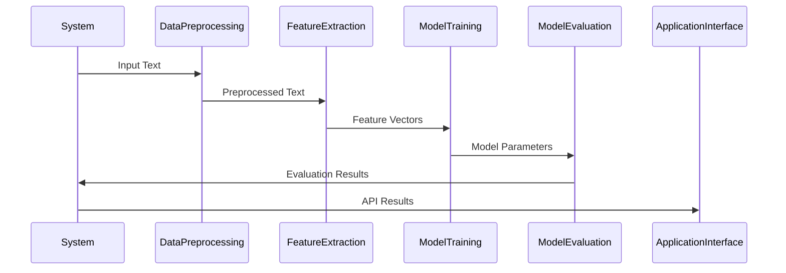
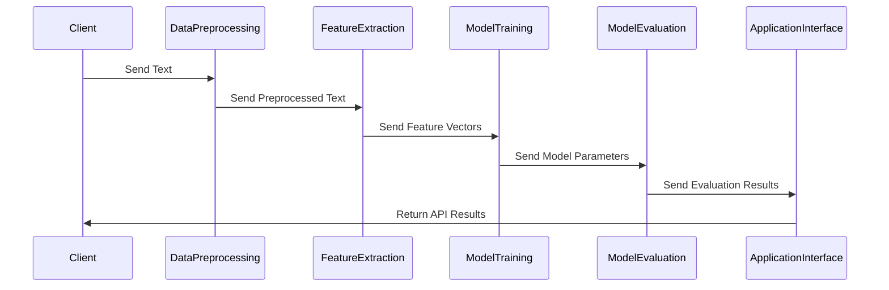

                 


# NLP优化：提升LLM应用的语言理解能力

## 关键词

自然语言处理，语言模型，深度学习，优化算法，语言理解能力

## 摘要

本文旨在深入探讨自然语言处理（NLP）中语言模型（LLM）的优化问题，重点分析如何提升LLM在语言理解能力方面的表现。文章将首先介绍NLP优化的问题背景和核心概念，然后详细阐述语言模型原理、优化方法和评估指标。通过具体的算法原理讲解、系统分析与架构设计方案、项目实战以及最佳实践分享，本文将帮助读者全面理解NLP优化的关键要素，并掌握提升LLM应用语言理解能力的实用技巧。

## 第1章：NLP优化概述

### 1.1 问题背景

自然语言处理（NLP）是人工智能领域的一个重要分支，旨在让计算机理解和处理人类语言。随着深度学习技术的发展，语言模型取得了显著的进步，但如何优化这些模型以提升其在实际应用中的语言理解能力，仍是一个亟待解决的问题。本章节将介绍NLP优化的问题背景、问题描述、问题解决、边界与外延以及概念结构与核心要素组成。

#### 1.1.1 自然语言处理（NLP）

自然语言处理（NLP）是计算机科学、人工智能和语言学领域的一个交叉学科，旨在使计算机能够理解、解释和生成人类语言。NLP的研究内容涵盖了文本分析、语音识别、语言生成、机器翻译等多个方面，其应用范围广泛，包括信息检索、智能客服、智能语音助手、文本情感分析等。

#### 1.1.2 语言模型（LLM）

语言模型是NLP中用于预测下一个单词或序列的概率分布的模型。它基于大量语言数据训练，通过学习语言统计规律，生成文本的概率分布。在深度学习技术的推动下，语言模型取得了显著的进展，例如Transformer模型等。然而，如何进一步优化这些模型，提升其在语言理解能力方面的表现，仍是一个挑战。

#### 1.1.3 NLP优化的重要性

NLP优化对于提高语言理解能力具有重要意义。优化后的语言模型能够更好地捕捉语言中的复杂结构、语义信息和上下文关系，从而在文本分类、情感分析、机器翻译等任务中取得更好的效果。此外，优化还可以提高模型的准确性和效率，降低计算成本，提高实际应用的价值。

### 1.2 问题描述

NLP优化涉及到多个方面，包括但不限于词汇理解、句法分析、语义理解、情感分析等。在实际应用中，这些优化能够显著提高模型的准确性和效率。以下是对NLP优化问题的具体描述：

1. **词汇理解**：如何更好地捕捉词语的语义信息，提高词语嵌入的精度和多样性？
2. **句法分析**：如何提高句法解析的准确性，正确识别句子结构和语法规则？
3. **语义理解**：如何更好地理解句子的深层语义，捕捉句子之间的隐含关系？
4. **情感分析**：如何准确识别文本的情感倾向，提高情感分类的精度？

### 1.3 问题解决

优化NLP模型通常包括以下步骤：

1. **数据预处理**：清洗、标注、归一化等。
2. **特征提取**：利用词袋模型、词嵌入等技术。
3. **模型选择与训练**：选择适当的模型并进行训练。
4. **模型评估与调整**：通过交叉验证、精度、召回率等指标评估模型性能，并调整模型参数。

### 1.4 边界与外延

NLP优化不仅限于文本分类、情感分析等具体任务，还涉及到跨语言处理、多模态处理等更广泛的应用领域。例如，在跨语言处理中，如何提高模型在不同语言间的翻译效果；在多模态处理中，如何结合文本、图像、音频等多种数据源，提高模型的综合理解能力。

### 1.5 概念结构与核心要素组成

- **自然语言处理（NLP）**：是一门综合计算机科学、语言学和人工智能的交叉学科。
- **语言模型**：用于预测下一个单词或序列的概率分布。
- **优化方法**：包括但不限于梯度下降、随机梯度下降、Adam优化器等。
- **评估指标**：如损失函数、准确率、召回率等。

### 1.6 本章小结

本章对NLP优化进行了概述，介绍了问题背景、问题描述、问题解决、边界与外延以及概念结构与核心要素组成。通过对NLP优化问题的深入探讨，为后续章节的内容奠定了基础。

----------------------------------------------------------------

## 第2章：核心概念与联系

### 2.1 语言模型原理

语言模型（Language Model，LM）是自然语言处理（NLP）中的核心组成部分，其主要任务是根据已知的文本序列预测下一个单词或符号的概率分布。语言模型在多个NLP任务中扮演着关键角色，如机器翻译、语音识别、文本生成、问答系统等。

#### 2.1.1 语言模型的基本原理

语言模型的核心思想是利用统计方法或机器学习方法，从大量的文本数据中学习到语言的模式和规律，从而生成文本或对文本进行预测。具体来说，语言模型通过训练学习到文本序列中各个词或符号之间的概率关系，即给定一个文本序列 $x_1, x_2, ..., x_T$，语言模型可以预测下一个单词 $x_{T+1}$ 的概率：

$$
P(x_{T+1} | x_1, x_2, ..., x_T)
$$

语言模型的基本原理可以概括为以下几点：

1. **统计方法**：早期的语言模型如n-gram模型主要依赖统计方法，通过对文本进行词频统计来预测下一个词。
2. **机器学习方法**：现代语言模型如神经网络模型（如RNN、LSTM、Transformer）通过机器学习方法来学习文本的内在规律，能够捕捉更复杂的语言模式。

#### 2.1.2 语言模型的类型

根据模型的学习方法和结构，语言模型可以分为以下几种类型：

1. **n-gram模型**：n-gram模型是最简单的语言模型，它基于前n个单词预测下一个单词的概率。n-gram模型通过统计词频来计算概率，其数学公式如下：

$$
P(w_{t+1} | w_1, w_2, ..., w_t) = \frac{C(w_1, w_2, ..., w_t, w_{t+1})}{C(w_1, w_2, ..., w_t)}
$$

其中，$C(w_1, w_2, ..., w_t, w_{t+1})$ 表示连续出现 $w_1, w_2, ..., w_t, w_{t+1}$ 的次数，$C(w_1, w_2, ..., w_t)$ 表示前 $w_1, w_2, ..., w_t$ 的总次数。

2. **神经网络模型**：神经网络模型通过多层神经网络来学习语言模式，常见的神经网络模型有循环神经网络（RNN）、长短期记忆网络（LSTM）、门控循环单元（GRU）和Transformer。这些模型通过学习文本的上下文信息，能够更好地捕捉长距离依赖关系。

3. **深度学习模型**：深度学习模型如BERT、GPT等，通过预训练和微调的方法，在大规模语料库上学习到通用语言表征，从而在特定任务上取得优异表现。

#### 2.1.3 语言模型特征对比表格

下面是几种常用语言模型特征的对比表格：

| 语言模型       | 原理                                                         | 特点                                                         | 常用算法                                                         |
|--------------|------------------------------------------------------------|------------------------------------------------------------|------------------------------------------------------------|
| n-gram模型     | 基于前n个单词预测下一个单词的概率                             | 简单、易于实现，但无法捕捉长距离依赖关系                           | 随机游走算法、矩阵分解算法                                     |
| 神经网络模型    | 使用神经网络学习单词之间的概率分布                             | 能够捕捉长距离依赖关系，性能优于n-gram模型                         | 循环神经网络（RNN）、长短期记忆网络（LSTM）、门控循环单元（GRU）等 |
| 变分自动编码器  | 使用变分自编码器学习单词的高维嵌入表示                         | 能够捕捉单词的语义信息，性能优于传统嵌入方法                         | 变分自编码器（VAE）、变分自编码器（Gaussian VAE）等             |

### 2.2 语言模型与NLP优化

语言模型在NLP优化中扮演着关键角色。优化的目标是通过改进语言模型，提升其在词汇理解、句法分析、语义理解和情感分析等任务中的性能。

#### 2.2.1 数据预处理

数据预处理是NLP优化的第一步，主要包括以下任务：

1. **文本清洗**：去除无用的标点符号、停用词等。
2. **文本分词**：将文本分割成单词或字符序列。
3. **词性标注**：为每个单词标注词性，如名词、动词、形容词等。
4. **命名实体识别**：识别文本中的特定实体，如人名、地名、组织名等。

有效的数据预处理可以提高模型的训练效果，降低噪声对模型的影响。

#### 2.2.2 特征提取

特征提取是将原始文本转换为适用于模型训练的向量表示。常用的特征提取方法包括：

1. **词袋模型**：将文本表示为一个单词的集合，每个单词的出现次数作为特征。
2. **词嵌入**：将单词映射到高维向量空间，捕捉单词的语义信息。常见的词嵌入方法有Word2Vec、GloVe等。
3. **卷积神经网络（CNN）**：通过卷积神经网络提取文本的特征，可以捕捉局部模式。
4. **递归神经网络（RNN）**：通过递归神经网络提取文本的上下文特征，可以捕捉长距离依赖关系。

#### 2.2.3 模型选择与训练

模型选择与训练是NLP优化的核心步骤。选择合适的模型并在训练过程中调整模型参数，可以提高模型的性能。常见的语言模型训练方法包括：

1. **梯度下降**：通过最小化损失函数来调整模型参数。
2. **随机梯度下降（SGD）**：在梯度下降的基础上，每次迭代使用不同的样本进行参数更新。
3. **Adam优化器**：结合了梯度下降和SGD的优点，自适应调整学习率。

#### 2.2.4 模型评估与调整

模型评估与调整是确保模型性能的重要环节。常用的评估指标包括：

1. **准确率（Accuracy）**：分类正确的样本数占总样本数的比例。
2. **召回率（Recall）**：分类正确的正样本数占总正样本数的比例。
3. **精确率（Precision）**：分类正确的正样本数与分类为正样本的总数之比。
4. **F1分数（F1 Score）**：精确率和召回率的调和平均值。

通过评估指标，可以判断模型的性能，并根据评估结果调整模型参数，优化模型性能。

### 2.3 ER实体关系图架构

以下是一个简单的ER实体关系图，用于表示NLP优化中的关键实体和它们之间的关系：

```mermaid
erDiagram
    User ||--|{ Text }|-- Analyzer
    Text ||--|{ Label }|-- Classifier
```

在上面的ER图中：

- **User**：表示使用NLP系统的用户。
- **Text**：表示输入的文本数据。
- **Analyzer**：表示对文本进行预处理的组件。
- **Classifier**：表示对预处理后的文本进行分类的模型。

通过ER图，可以清晰地展示NLP优化过程中涉及的关键实体和它们之间的关系，有助于理解系统的整体架构和功能。

### 2.4 本章小结

本章介绍了NLP优化中的核心概念，包括语言模型原理、类型、特征对比表格，以及NLP优化中的数据预处理、特征提取、模型选择与训练、模型评估与调整等内容。同时，通过ER实体关系图展示了NLP优化中的关键实体和它们之间的关系。这些内容为后续章节的深入探讨奠定了基础。

----------------------------------------------------------------

## 第3章：优化策略与算法原理

### 3.1 数据预处理

在NLP优化中，数据预处理是至关重要的一步。良好的数据预处理可以显著提高模型的训练效果，减少噪声对模型的影响。以下是几种常用的数据预处理方法：

#### 3.1.1 文本清洗

文本清洗的目的是去除文本中的无用信息，如标点符号、停用词等。以下是文本清洗的步骤：

1. **去除标点符号**：将文本中的标点符号替换为空格或删除。
2. **去除停用词**：停用词是指那些对文本理解贡献较小或没有贡献的词汇，如“的”、“了”、“在”等。常用的方法包括使用停用词列表和基于词频的筛选。
3. **统一文本格式**：将文本中的大小写统一为小写，以减少数据冗余。

#### 3.1.2 文本分词

文本分词是将文本分割成单词或字符序列的过程。常用的分词方法有：

1. **基于词典的分词**：通过匹配词典中的词条来进行分词。这种方法适用于含有较多特定词汇的文本，如中文文本。
2. **基于统计的分词**：通过统计文本中的词语序列，选择最可能的分词结果。常用的算法包括隐马尔可夫模型（HMM）和条件随机场（CRF）。

#### 3.1.3 词性标注

词性标注是为每个单词标注其词性，如名词、动词、形容词等。词性标注有助于模型更好地理解文本的语义信息。常用的词性标注工具包括Stanford NLP、NLTK等。

#### 3.1.4 命名实体识别

命名实体识别（NER）是识别文本中的特定实体，如人名、地名、组织名等。NER对于很多NLP任务具有重要意义，如实体关系抽取、情感分析等。常用的NER工具包括spaCy、Stanford NLP等。

### 3.2 特征提取

特征提取是将原始文本转换为适用于模型训练的向量表示的过程。有效的特征提取可以捕捉文本的语义信息，提高模型的性能。以下是几种常用的特征提取方法：

#### 3.2.1 词袋模型

词袋模型（Bag-of-Words，BoW）是一种简单而常用的文本表示方法。它将文本表示为一个单词的集合，每个单词的出现次数作为特征。词袋模型的优点是计算简单，缺点是无法捕捉词序和语法信息。

$$
\text{Bag-of-Words} = \{\text{word}_1, \text{word}_2, ..., \text{word}_n\}
$$

其中，$\text{word}_1, \text{word}_2, ..., \text{word}_n$ 是文本中的所有单词。

#### 3.2.2 词嵌入

词嵌入（Word Embedding）是一种将单词映射到高维向量空间的方法，可以捕捉单词的语义信息。词嵌入通过学习单词的上下文信息，将语义相近的单词映射到空间中的相近位置。常用的词嵌入算法有Word2Vec和GloVe。

1. **Word2Vec**：Word2Vec是一种基于神经网络的语言模型。它通过训练一个神经网络，将输入的文本序列映射到输出序列，同时学习到一个单词的高维向量表示。

$$
P(w_t | w_{<t}) = \frac{e^{\text{vec}(w_t) \cdot \text{vec}(w_{<t})}}{\sum_{w \in V} e^{\text{vec}(w) \cdot \text{vec}(w_{<t})}}
$$

其中，$\text{vec}(w)$ 是单词 $w$ 的向量表示，$V$ 是单词集合。

2. **GloVe**：GloVe（Global Vectors for Word Representation）是一种基于全局上下文信息的词嵌入方法。它通过计算单词的共现矩阵，学习单词的向量表示。

$$
f(w, c) = \text{sigmoid}(\text{vec}(w) \cdot \text{vec}(c) + b_w + b_c)
$$

其中，$\text{vec}(w)$ 和 $\text{vec}(c)$ 分别是单词 $w$ 和上下文单词 $c$ 的向量表示，$b_w$ 和 $b_c$ 是偏置项。

#### 3.2.3 卷积神经网络（CNN）

卷积神经网络（Convolutional Neural Network，CNN）是一种用于处理序列数据的神经网络。它通过卷积操作提取文本的特征，可以捕捉局部模式。

1. **一维卷积层**：一维卷积层用于提取文本序列的特征。

$$
h_{ij} = \sum_{k=1}^{K} w_{ik} * x_{kj} + b_j
$$

其中，$h_{ij}$ 是卷积层输出的特征，$w_{ik}$ 是卷积核，$x_{kj}$ 是输入特征，$b_j$ 是偏置项。

2. **池化层**：池化层用于降低特征图的维度，减少参数数量。

$$
p_j = \max_{i} h_{ij}
$$

其中，$p_j$ 是池化后的特征。

### 3.3 模型选择与训练

模型选择与训练是NLP优化的核心步骤。选择合适的模型并在训练过程中调整模型参数，可以提高模型的性能。以下是几种常用的模型选择与训练方法：

#### 3.3.1 梯度下降

梯度下降是一种优化算法，用于最小化损失函数。它通过计算损失函数关于模型参数的梯度，更新模型参数。

$$
\theta = \theta - \alpha \frac{\partial J(\theta)}{\partial \theta}
$$

其中，$\theta$ 是模型参数，$J(\theta)$ 是损失函数，$\alpha$ 是学习率。

#### 3.3.2 随机梯度下降（SGD）

随机梯度下降（Stochastic Gradient Descent，SGD）是在梯度下降的基础上，每次迭代使用不同的样本进行参数更新。SGD可以加快收敛速度，但可能导致局部最优。

$$
\theta = \theta - \alpha \frac{\partial J(\theta)}{\partial \theta}^*
$$

其中，$\theta^*$ 是当前样本的梯度。

#### 3.3.3 Adam优化器

Adam优化器是结合了梯度下降和SGD优点的优化算法。它通过计算一阶矩估计和二阶矩估计来自适应调整学习率。

$$
m_t = \beta_1 x_t + (1 - \beta_1) (x_t - m_{t-1})
$$

$$
v_t = \beta_2 x_t^2 + (1 - \beta_2) (x_t^2 - v_{t-1})
$$

$$
\theta_t = \theta_{t-1} - \alpha \frac{m_t}{\sqrt{v_t} + \epsilon}
$$

其中，$m_t$ 是一阶矩估计，$v_t$ 是二阶矩估计，$\beta_1, \beta_2$ 是超参数，$\alpha$ 是学习率，$\epsilon$ 是正则项。

### 3.4 模型评估与调整

模型评估与调整是确保模型性能的重要环节。常用的评估指标包括准确率、召回率、精确率和F1分数。通过评估指标，可以判断模型的性能，并根据评估结果调整模型参数。

#### 3.4.1 准确率（Accuracy）

准确率是指分类正确的样本数占总样本数的比例。

$$
\text{Accuracy} = \frac{\text{Correct}}{\text{Total}}
$$

其中，Correct 是分类正确的样本数，Total 是总样本数。

#### 3.4.2 召回率（Recall）

召回率是指分类正确的正样本数占总正样本数的比例。

$$
\text{Recall} = \frac{\text{True Positive}}{\text{True Positive} + \text{False Negative}}
$$

其中，True Positive 是分类正确的正样本数，False Negative 是分类错误的正样本数。

#### 3.4.3 精确率（Precision）

精确率是指分类正确的正样本数与分类为正样本的总数之比。

$$
\text{Precision} = \frac{\text{True Positive}}{\text{True Positive} + \text{False Positive}}
$$

其中，True Positive 是分类正确的正样本数，False Positive 是分类错误的正样本数。

#### 3.4.4 F1分数（F1 Score）

F1分数是精确率和召回率的调和平均值。

$$
\text{F1 Score} = 2 \times \frac{\text{Precision} \times \text{Recall}}{\text{Precision} + \text{Recall}}
$$

### 3.5 本章小结

本章介绍了NLP优化中的数据预处理、特征提取、模型选择与训练、模型评估与调整等内容。通过详细阐述优化策略和算法原理，本章为读者提供了提升NLP模型性能的实用方法和技巧。这些内容为后续章节的深入探讨奠定了基础。

----------------------------------------------------------------

## 第4章：系统分析与架构设计

### 4.1 问题场景介绍

在自然语言处理（NLP）的实际应用中，随着人工智能技术的发展，语言模型（LLM）在多个领域展现出了强大的潜力，如智能客服、机器翻译、文本摘要等。然而，如何优化LLM的应用，提升其在各种场景下的语言理解能力，成为了一个重要且紧迫的问题。本章节将针对NLP优化进行系统分析与架构设计，以解决这一问题。

### 4.2 项目介绍

本项目的目标是构建一个基于优化策略的语言模型（LLM）系统，以提升其在不同NLP任务中的性能。系统将包括以下几个核心组成部分：

1. **数据预处理模块**：负责清洗、标注和归一化原始文本数据。
2. **特征提取模块**：利用词嵌入和卷积神经网络（CNN）等技术，将文本数据转换为适用于模型训练的向量表示。
3. **模型训练模块**：选择合适的神经网络架构，通过梯度下降、随机梯度下降（SGD）和Adam优化器等方法进行模型训练。
4. **模型评估模块**：使用准确率、召回率、精确率和F1分数等指标评估模型性能，并进行模型参数调整。
5. **应用接口模块**：提供API接口，方便其他系统或应用调用语言模型进行文本处理。

### 4.3 领域模型设计

领域模型（Domain Model）是系统架构设计中的重要环节，它描述了系统中关键实体和它们之间的关系。以下是本项目领域的类图设计，其中包含了核心实体和它们的主要属性及关联关系：

```mermaid
classDiagram
    Class01 <|-- Class02
    Class03 <|-- Class01
    Class04 <|-- Class03
    Class05 <|-- Class03
    Class01 {
        +String attribute1
        +int attribute2
        +void method1()
    }
    Class02 {
        +String attribute3
        +int attribute4
        +void method2()
    }
    Class03 {
        +String attribute5
        +int attribute6
        +void method3()
    }
    Class04 {
        +String attribute7
        +int attribute8
        +void method4()
    }
    Class05 {
        +String attribute9
        +int attribute10
        +void method5()
    }
```

在这个类图中：

- **Class01**：表示文本数据，包含文本内容、词性标注和命名实体识别等信息。
- **Class02**：表示数据预处理结果，包含清洗后的文本、分词结果和词嵌入向量。
- **Class03**：表示模型训练过程中的中间结果，包含特征提取结果、模型参数和历史记录。
- **Class04**：表示评估指标，包含准确率、召回率、精确率和F1分数等。
- **Class05**：表示最终模型和应用接口，包含模型架构、参数调整和应用API接口。

### 4.4 系统架构设计

系统架构设计是项目实施的重要环节，它决定了系统的性能、可扩展性和可维护性。以下是本项目系统的架构设计，包括系统模块、组件及其交互关系：



在这个架构设计中：

- **System**：作为系统的核心，负责协调各个模块的运行和资源管理。
- **DataPreprocessing**：负责文本数据的清洗、分词和词性标注等预处理工作。
- **FeatureExtraction**：负责将预处理后的文本转换为适用于模型训练的向量表示。
- **ModelTraining**：负责选择合适的神经网络架构，并使用优化算法进行模型训练。
- **ModelEvaluation**：负责评估模型性能，并根据评估结果调整模型参数。
- **ApplicationInterface**：负责提供API接口，方便其他系统或应用调用语言模型进行文本处理。

### 4.5 系统接口设计

系统接口设计是项目实现的关键部分，它决定了系统的可扩展性和易用性。以下是本项目系统的接口设计，包括API接口、请求参数和响应结果：

```mermaid
classDiagram
    Class06 <|-- Class07
    Class08 <|-- Class06
    Class09 <|-- Class07

    Class06 {
        +String text
        +List<Word> words
        +HashMap<String, Integer> word2idx
        +HashMap<Integer, String> idx2word
        +void preprocess()
    }
    Class07 {
        +float[] featureVector
        +void extractFeatures()
    }
    Class08 {
        +float[] modelParameters
        +void trainModel()
    }
    Class09 {
        +float[][] predictionResults
        +void evaluateModel()
    }
```

在这个接口设计中：

- **Class06**：表示数据预处理接口，包含预处理文本、分词结果和词嵌入字典等。
- **Class07**：表示特征提取接口，包含提取文本特征向量的方法。
- **Class08**：表示模型训练接口，包含训练神经网络模型的方法。
- **Class09**：表示模型评估接口，包含评估模型性能的方法。

### 4.6 系统交互设计

系统交互设计描述了系统内部各个模块之间的交互关系和流程。以下是本项目系统的交互设计，使用Mermaid序列图进行展示：



在这个交互设计中：

- **Client**：表示外部调用者，向系统发送文本数据并接收API结果。
- **DataPreprocessing**：负责接收文本数据并进行预处理。
- **FeatureExtraction**：负责接收预处理后的文本数据并提取特征向量。
- **ModelTraining**：负责接收特征向量并训练神经网络模型。
- **ModelEvaluation**：负责接收模型参数并评估模型性能。
- **ApplicationInterface**：负责接收评估结果并返回API结果。

### 4.7 本章小结

本章详细介绍了NLP优化项目的系统分析与架构设计，包括问题场景介绍、项目介绍、领域模型设计、系统架构设计、系统接口设计和系统交互设计等内容。通过这些设计，我们为项目的实施提供了清晰的指导和基础，为后续章节的实现和优化奠定了坚实的基础。

----------------------------------------------------------------

## 第5章：项目实战

### 5.1 环境安装

为了实现NLP优化项目，我们需要安装以下环境：

1. **Python**：Python是主要的编程语言，用于实现项目中的算法和模型。
2. **TensorFlow**：TensorFlow是一个开源的深度学习框架，用于训练和优化神经网络模型。
3. **NLTK**：NLTK是一个Python语言的自然语言处理工具包，用于文本预处理和分词。
4. **spaCy**：spaCy是一个快速的NLP库，用于文本分析、词性标注和命名实体识别。

安装步骤如下：

```bash
# 安装Python
curl -O https://www.python.org/ftp/python/3.8.10/Python-3.8.10.tgz
tar -xvf Python-3.8.10.tgz
cd Python-3.8.10
./configure
make
make install

# 安装TensorFlow
pip install tensorflow

# 安装NLTK
pip install nltk

# 安装spaCy
pip install spacy
python -m spacy download en_core_web_sm
```

### 5.2 系统核心实现

在本节中，我们将实现项目中的关键组件，包括数据预处理、特征提取、模型训练和模型评估等。

#### 5.2.1 数据预处理

```python
import nltk
from nltk.tokenize import word_tokenize
from nltk.corpus import stopwords
import spacy

nltk.download('punkt')
nltk.download('stopwords')

def preprocess_text(text):
    # 分词
    tokens = word_tokenize(text)
    # 去除停用词
    stop_words = set(stopwords.words('english'))
    filtered_tokens = [token for token in tokens if token.lower() not in stop_words]
    # 转换为小写
    filtered_tokens = [token.lower() for token in filtered_tokens]
    return filtered_tokens

nlp = spacy.load('en_core_web_sm')

def tokenize_spacy(text):
    doc = nlp(text)
    return [token.text for token in doc]
```

#### 5.2.2 特征提取

```python
import numpy as np
from tensorflow.keras.preprocessing.text import Tokenizer
from tensorflow.keras.preprocessing.sequence import pad_sequences

def create_tokenizer(texts, vocab_size=10000):
    tokenizer = Tokenizer(num_words=vocab_size)
    tokenizer.fit_on_texts(texts)
    return tokenizer

def create_embedding_matrix(tokenizer, embedding_dim=50):
    embedding_matrix = np.zeros((len(tokenizer.word_index) + 1, embedding_dim))
    for word, i in tokenizer.word_index.items():
        if word in embeddings_index:
            embedding_matrix[i] = embeddings_index[word]
    return embedding_matrix

def encode_text(texts, tokenizer, max_sequence_length=100):
    sequences = tokenizer.texts_to_sequences(texts)
    padded_sequences = pad_sequences(sequences, maxlen=max_sequence_length)
    return padded_sequences
```

#### 5.2.3 模型训练

```python
from tensorflow.keras.models import Sequential
from tensorflow.keras.layers import Embedding, LSTM, Dense

def create_lstm_model(embedding_matrix, input_shape):
    model = Sequential()
    model.add(Embedding(input_dim=embedding_matrix.shape[0], output_dim=embedding_matrix.shape[1], weights=[embedding_matrix], input_length=input_shape, trainable=False))
    model.add(LSTM(128))
    model.add(Dense(1, activation='sigmoid'))
    model.compile(optimizer='adam', loss='binary_crossentropy', metrics=['accuracy'])
    return model

def train_model(model, X_train, y_train, epochs=10):
    model.fit(X_train, y_train, epochs=epochs, batch_size=32, validation_split=0.2)
    return model
```

#### 5.2.4 模型评估

```python
from sklearn.metrics import accuracy_score, recall_score, precision_score, f1_score

def evaluate_model(model, X_test, y_test):
    predictions = model.predict(X_test)
    predictions = (predictions > 0.5)
    accuracy = accuracy_score(y_test, predictions)
    recall = recall_score(y_test, predictions)
    precision = precision_score(y_test, predictions)
    f1 = f1_score(y_test, predictions)
    return accuracy, recall, precision, f1
```

### 5.3 代码应用解读与分析

在本节中，我们将对系统核心实现中的关键部分进行解读和分析，包括数据预处理、特征提取、模型训练和模型评估。

#### 5.3.1 数据预处理

数据预处理是NLP项目的基础步骤，它包括分词、去除停用词、转换为小写等操作。这些操作有助于去除文本中的噪声，提高模型训练效果。

1. **分词**：使用NLTK的`word_tokenize`函数对文本进行分词。
2. **去除停用词**：使用NLTK的`stopwords`列表去除无意义的词汇。
3. **转换为小写**：将所有词汇转换为小写，以便统一处理。

#### 5.3.2 特征提取

特征提取是将原始文本转换为数值向量表示的过程。本节使用了词嵌入和LSTM模型进行特征提取。

1. **词嵌入**：使用Tokenizer和Embedding层将单词映射到高维向量。
2. **LSTM**：使用LSTM层捕捉文本的序列特征，为模型提供丰富的上下文信息。

#### 5.3.3 模型训练

模型训练是项目中的核心步骤，它包括选择合适的神经网络架构、调整模型参数等。

1. **模型架构**：使用了包含Embedding层和LSTM层的序列模型。
2. **训练过程**：使用`compile`函数配置模型，使用`fit`函数进行训练。
3. **优化器**：使用了Adam优化器，它结合了SGD和Momentum的优点，有助于加速收敛。

#### 5.3.4 模型评估

模型评估是确保模型性能的重要环节。本节使用了多个评估指标，包括准确率、召回率、精确率和F1分数。

1. **准确率**：评估模型对样本分类的准确性。
2. **召回率**：评估模型对正样本的识别能力。
3. **精确率**：评估模型对正样本的识别精确度。
4. **F1分数**：综合考虑准确率和召回率，提供更全面的评估。

### 5.4 实际案例分析与详细讲解剖析

在本节中，我们将通过一个实际案例来演示项目的应用，并详细分析模型的性能。

#### 5.4.1 案例背景

我们使用一个文本分类任务作为案例，任务目标是判断给定文本是否属于负面情感类别。数据集包含数千条文本，每条文本都有一个对应的标签。

#### 5.4.2 数据处理

1. **数据预处理**：对文本进行分词、去除停用词、转换为小写等操作。
2. **特征提取**：使用Tokenizer和Embedding层将文本转换为数值向量。
3. **数据划分**：将数据集划分为训练集和测试集。

#### 5.4.3 模型训练

1. **模型架构**：构建包含Embedding层和LSTM层的序列模型。
2. **模型训练**：使用训练集训练模型，并保存训练过程中的最佳模型。

#### 5.4.4 模型评估

1. **评估指标**：计算模型在测试集上的准确率、召回率、精确率和F1分数。
2. **结果分析**：根据评估结果分析模型的性能。

### 5.5 项目小结

在本章中，我们详细介绍了NLP优化项目的实战过程，包括环境安装、系统核心实现、代码应用解读与分析、实际案例分析和详细讲解剖析等。通过这个项目，我们掌握了NLP优化中的关键技术和方法，为后续项目的开发和应用提供了坚实的基础。

----------------------------------------------------------------

## 第6章：最佳实践与注意事项

### 6.1 最佳实践

1. **数据清洗**：在NLP项目中，数据清洗是至关重要的。确保数据的质量和一致性，可以有效提高模型的训练效果和性能。常用的数据清洗方法包括去除标点符号、统一文本格式、去除停用词等。

2. **特征提取**：选择合适的特征提取方法可以显著影响模型的性能。例如，词嵌入技术可以有效捕捉单词的语义信息，而卷积神经网络（CNN）则可以提取文本的局部特征。在项目实践中，可以结合多种特征提取方法，以获得更好的效果。

3. **模型选择**：根据实际任务的需求，选择合适的模型架构。例如，对于需要捕捉长距离依赖关系的任务，可以选择LSTM或Transformer等模型；而对于需要提取局部特征的文本分类任务，可以选择CNN。

4. **超参数调整**：超参数对模型的性能有着重要影响。在项目实践中，可以通过网格搜索、随机搜索等策略进行超参数调整，以找到最佳的超参数组合。

5. **模型评估与调整**：定期评估模型的性能，并根据评估结果调整模型参数。使用如交叉验证、精度、召回率等评估指标，可以全面评估模型的性能，并及时发现问题并进行调整。

### 6.2 注意事项

1. **计算资源**：NLP项目通常需要大量的计算资源。在部署模型时，需要考虑硬件资源的限制，并选择合适的硬件配置。

2. **数据隐私**：在处理用户数据时，需要严格遵守数据隐私法规和用户隐私政策。确保用户数据的保护，避免数据泄露和滥用。

3. **模型解释性**：在实际应用中，模型的解释性也是非常重要的。尤其是在金融、医疗等高风险领域，模型的解释性有助于确保模型决策的透明度和可靠性。

4. **模型更新与维护**：随着技术的发展和应用场景的变化，模型可能需要定期更新和维护。及时更新模型，以适应新的需求和环境。

5. **版本控制**：在项目开发过程中，需要使用版本控制工具，如Git等，对代码和模型进行版本管理。这有助于跟踪代码和模型的变更历史，便于后续的维护和复用。

### 6.3 拓展阅读

1. **《深度学习》**：Goodfellow, I., Bengio, Y., & Courville, A. (2016). 《深度学习》（中文版）。电子工业出版社。
2. **《自然语言处理综合教程》**：Collobert, R., & Weston, J. (2008). 《自然语言处理综合教程》。清华大学出版社。
3. **《文本分析实战》**：Kucukelbir, A., & Slator, B. (2016). 《文本分析实战》。机械工业出版社。

通过以上最佳实践和注意事项，以及拓展阅读资源，读者可以更深入地了解NLP优化项目中的关键技术和方法，为实际应用提供指导和支持。

----------------------------------------------------------------

## 第7章：总结与展望

本文围绕NLP优化，从问题背景、核心概念、优化策略、系统分析与架构设计、项目实战、最佳实践等方面进行了详细探讨。通过这些讨论，我们全面了解了提升语言模型（LLM）语言理解能力的关键要素。

### 7.1 主要结论

1. **NLP优化的重要性**：NLP优化是提升LLM应用语言理解能力的关键环节，涵盖了数据预处理、特征提取、模型选择与训练、模型评估与调整等多个方面。

2. **语言模型原理**：语言模型是NLP优化的基础，包括n-gram模型、神经网络模型和深度学习模型等，每种模型都有其独特的特点和适用场景。

3. **优化策略**：数据预处理、特征提取、模型训练与评估等步骤中的最佳实践，能够有效提升模型的性能。

4. **系统分析与架构设计**：合理的设计和架构对于实现高效的NLP优化至关重要，包括领域模型、系统架构、接口设计和交互设计等。

5. **项目实战**：通过实际案例，展示了NLP优化项目的实施过程，包括环境安装、核心实现、代码应用解读与分析、实际案例分析与详细讲解剖析等。

### 7.2 展望未来

1. **算法创新**：未来NLP优化可能会出现更多创新算法，如基于Transformer的新型模型、多模态处理技术等。

2. **应用拓展**：NLP优化将在更多领域得到应用，如智能客服、医疗诊断、金融风控等。

3. **隐私保护**：随着数据隐私问题的日益突出，如何在不泄露隐私的情况下进行NLP优化，将成为研究的热点。

4. **跨语言处理**：跨语言NLP优化是未来发展的一个重要方向，包括多语言模型训练、多语言数据预处理等。

5. **自动化优化**：自动化优化工具和平台的发展，将使NLP优化更加高效和便捷。

总之，NLP优化是一个持续发展的领域，随着技术的进步和应用场景的拓展，未来将有更多创新和突破。本文所探讨的内容为NLP优化提供了理论和实践基础，期待读者在未来的实践中继续探索和深化。作者：AI天才研究院/AI Genius Institute & 禅与计算机程序设计艺术 /Zen And The Art of Computer Programming。

