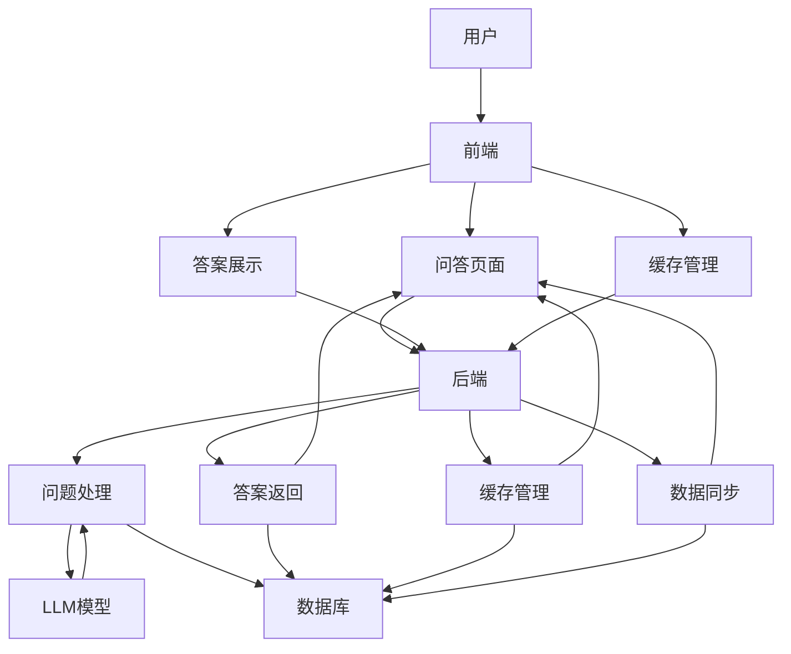
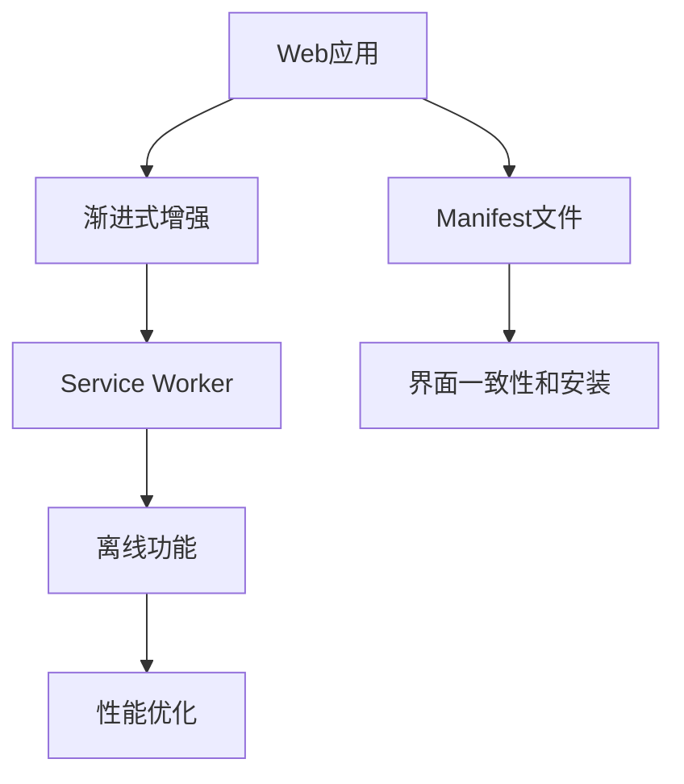
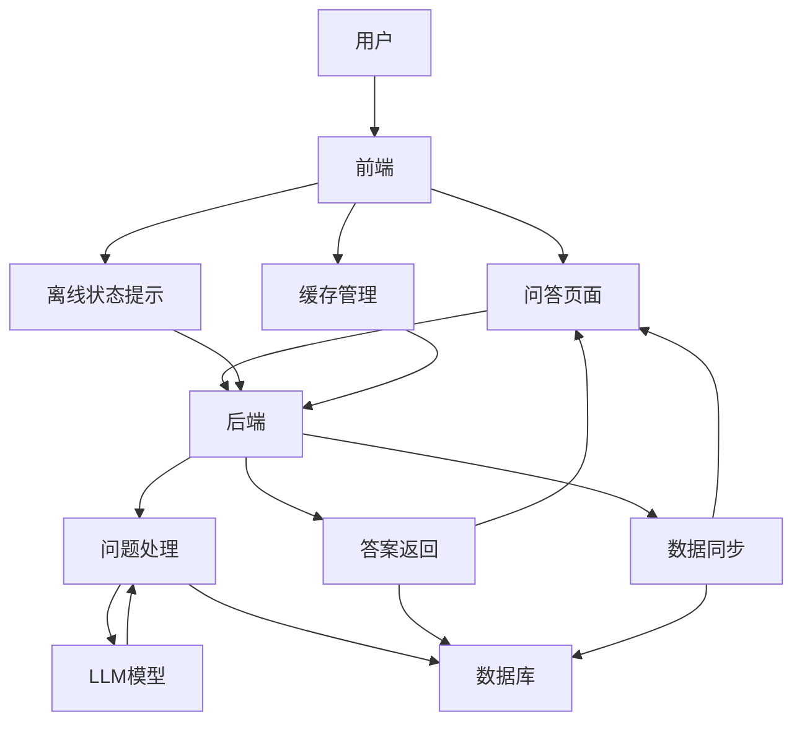
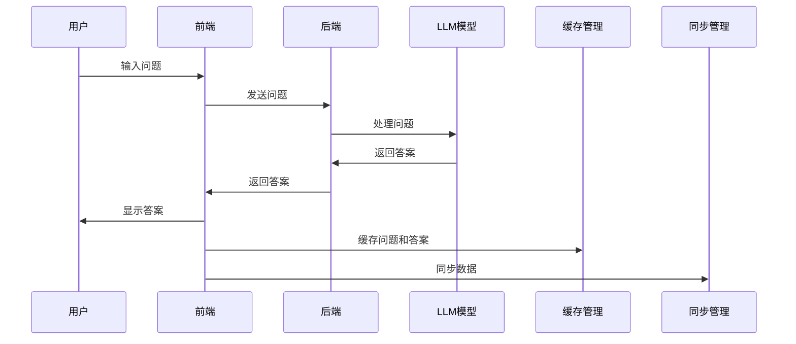
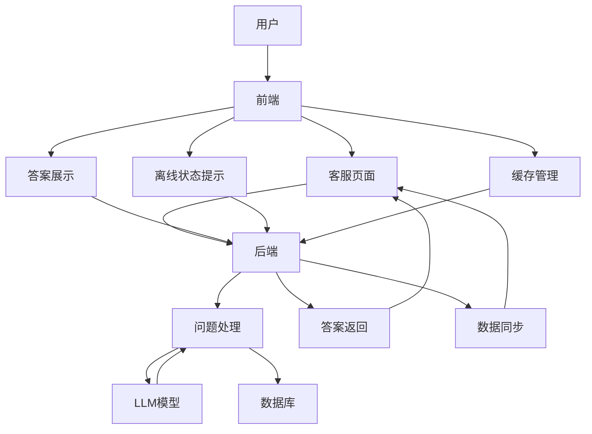

                 

### PWA技术概述与LLM基础

**本文关键词：** Progressive Web Apps (PWA)、Large Language Models (LLM)、离线体验、缓存策略、Service Worker

**摘要：** 本文深入探讨了PWA技术在提升LLM应用离线体验方面的应用。首先，我们对PWA技术进行了概述，解释了其起源、定义和主要特点。接着，我们介绍了LLM的基础知识，包括其定义、分类和发展历程。本文旨在通过逐步分析，展现PWA与LLM结合的巨大潜力，并探讨在实际应用中的实现方法和优化策略。

### 第一部分：PWA技术概述与LLM基础

#### 目录大纲

```markdown
----------------------------------------------------------------
## 第一部分：PWA技术概述与LLM基础

### 第1章 PWA技术概述

### 1.1 PWA技术的起源与定义

### 1.2 PWA技术的核心概念

### 1.3 PWA技术的主要特点

### 第2章 LLM基础

### 2.1 LLM的定义与分类

### 2.2 LLM的关键技术

----------------------------------------------------------------
```

在深入探讨PWA技术如何提升LLM应用的离线体验之前，我们需要对PWA技术和LLM基础有一个全面的了解。本部分将分为两个章节进行详细阐述。

### 第1章 PWA技术概述

#### 1.1 PWA技术的起源与定义

**PWA技术的起源背景**

PWA（Progressive Web Apps）技术起源于Web应用的发展需求。随着移动互联网的普及，用户对应用的需求越来越强烈，尤其是在速度和用户体验方面。传统的Web应用在性能和用户体验上往往无法与原生应用相媲美。为了解决这个问题，Google提出了PWA的概念，旨在通过新兴的Web技术，打造一种兼具原生应用性能和Web应用便捷性的新型应用模式。

**PWA技术的定义**

PWA是一种结合了Web应用和原生应用的优点的新型应用，通过使用现代Web技术，如Service Worker、Manifest文件等，为用户提供流畅、快速、安全的体验。PWA的特点在于它可以在任何设备上运行，无需下载和安装，同时具备原生应用的性能和用户体验。

**PWA技术的主要特点**

1. **渐进式增强**：PWA可以从任何Web应用开始，逐步增强其功能，使其具备原生应用的特性。
2. **快速启动**：PWA利用Service Worker缓存技术，实现快速启动，用户访问速度显著提升。
3. **离线功能**：通过Service Worker和Manifest文件，PWA能够在用户无网络连接时提供离线服务。
4. **跨平台兼容**：PWA无需针对不同平台进行适配，可以在多种设备上无缝运行。
5. **安全可靠**：PWA采用HTTPS协议，确保数据传输安全。

#### 1.2 PWA技术的核心概念

**Service Worker的作用与原理**

Service Worker是PWA技术的核心组件之一，它是一个运行在浏览器背后的独立线程，负责处理网络请求、缓存资源和通知推送等任务。Service Worker的主要作用是：

- **处理网络请求**：Service Worker可以拦截并处理来自浏览器的网络请求，从而实现资源的本地缓存和离线访问。
- **缓存策略与离线支持**：Service Worker通过Cache API实现资源的本地缓存，确保用户在无网络连接时仍能访问应用。

**Service Worker的生命周期**

Service Worker的生命周期包括以下几个阶段：

- **注册**：Service Worker在浏览器中注册，并与特定域名的网站关联。
- **激活**：当旧版Service Worker不再需要时，新版Service Worker会被激活，并接管相关任务。
- **运行**：Service Worker在激活后开始运行，执行预定的任务，如缓存资源、处理网络请求等。
- **更新**：Service Worker可以定期更新，从而引入新的功能或优化现有功能。

**Service Worker的通信机制**

Service Worker与主线程（通常是浏览器窗口）之间的通信机制如下：

- **事件监听**：Service Worker可以监听特定事件，如网络请求、消息传递等。
- **消息传递**：Service Worker可以通过`postMessage`方法向主线程发送消息，并接收主线程的响应。
- **响应拦截**：Service Worker可以拦截和处理来自浏览器的网络响应，从而实现自定义的网络请求处理逻辑。

#### 1.3 PWA与传统的Web应用的比较

**性能对比**

- **加载速度**：传统Web应用在初次加载时，需要加载大量资源和脚本，导致加载速度较慢。而PWA利用Service Worker缓存技术，实现快速启动，显著提升了应用性能。
- **响应速度**：PWA通过预加载和缓存技术，实现了快速响应，用户在使用过程中的体验更加流畅。

**用户体验对比**

- **界面设计**：传统Web应用往往需要针对不同设备进行适配，界面设计复杂且碎片化。而PWA采用统一的界面设计，实现了跨平台兼容，用户在不同设备上的体验一致。
- **交互方式**：PWA支持多种交互方式，如触摸、手势等，用户可以享受到更丰富的交互体验。

**安全性对比**

- **数据传输**：传统Web应用在数据传输过程中，可能存在安全隐患。而PWA采用HTTPS协议，确保数据传输安全，用户数据得到有效保护。

### 第2章 LLM基础

#### 2.1 LLM的定义与分类

**LLM的定义**

LLM（Large Language Model）是一种大型语言模型，通过深度学习技术，对大量文本数据进行训练，从而生成高质量的自然语言处理结果。LLM具有以下特点：

- **大规模**：LLM通常包含数十亿甚至数万亿个参数，可以处理大规模的文本数据。
- **自适应**：LLM可以根据输入的文本内容，自动调整参数，生成符合上下文的输出。
- **泛化能力强**：LLM具有广泛的泛化能力，可以应用于多种自然语言处理任务。

**LLM的分类**

根据训练数据和应用场景，LLM可以分为以下几种类型：

1. **通用语言模型**：如GPT-3、BERT等，具有广泛的自然语言处理能力，可以应用于多种场景。
2. **领域特定语言模型**：针对特定领域或任务进行训练，如医疗语言模型、法律语言模型等，具有更强的领域知识和泛化能力。
3. **跨领域语言模型**：结合多个领域的知识，具备跨领域的自然语言处理能力。

**LLM的发展历程**

LLM的发展历程可以分为以下几个阶段：

1. **早期模型**：如LSTM、GRU等，具有较好的文本处理能力，但参数规模较小。
2. **大规模预训练模型**：如GPT、BERT等，通过大规模预训练技术，显著提升了模型性能。
3. **多模态语言模型**：结合文本、图像、语音等多种数据，实现跨模态的自然语言处理。

#### 2.2 LLM的关键技术

**语言模型的基本原理**

语言模型的基本原理是基于概率的文本生成。通过学习大量文本数据，语言模型可以预测下一个词的概率，从而生成连贯的文本。语言模型的核心在于参数的学习和优化，常用的技术包括：

- **神经网络**：如循环神经网络（RNN）、卷积神经网络（CNN）等，用于文本数据的表示和学习。
- **深度学习**：通过多层神经网络，实现复杂的文本特征提取和概率计算。

**LLM的训练与优化**

LLM的训练和优化过程主要包括以下几个步骤：

1. **数据预处理**：对原始文本数据进行清洗、分词、编码等预处理操作，使其适合模型训练。
2. **模型初始化**：初始化模型参数，常用的方法包括随机初始化、预训练模型等。
3. **模型训练**：使用训练数据对模型进行训练，优化模型参数，提高模型性能。
4. **模型评估**：使用验证集和测试集评估模型性能，调整模型参数，实现模型优化。
5. **模型部署**：将训练好的模型部署到实际应用场景，提供自然语言处理服务。

**LLM的应用场景**

LLM在自然语言处理领域具有广泛的应用，主要包括：

- **文本生成**：如文章写作、摘要生成、对话生成等。
- **文本分类**：如情感分析、主题分类、新闻分类等。
- **文本翻译**：如机器翻译、跨语言文本生成等。
- **问答系统**：如智能客服、知识图谱问答等。

### 小结

本章对PWA技术和LLM基础进行了详细介绍，包括PWA技术的起源、定义、核心概念和特点，以及LLM的定义、分类和发展历程。通过对PWA技术和LLM基础的了解，我们为后续探讨PWA技术在LLM应用中的实现和优化提供了坚实的基础。在接下来的部分，我们将深入探讨PWA技术在LLM应用中的实现方法和优化策略，以提升LLM应用的离线体验。

### 第二部分：PWA技术在LLM应用中的实现

**目录大纲**

```markdown
----------------------------------------------------------------
## 第二部分：PWA技术在LLM应用中的实现

### 第3章 PWA与LLM结合的优势

### 3.1 离线体验的重要性

### 3.2 PWA在LLM应用中的实现

### 第4章 Service Worker在LLM离线中的应用

### 4.1 Service Worker的基本原理

### 4.2 Service Worker在LLM离线中的实现

### 第5章 缓存策略与离线体验优化

### 5.1 缓存策略概述

### 5.2 LLM应用的缓存优化

### 第6章 PWA在LLM应用的实践案例

### 6.1 实践案例概述

### 6.2 系统设计与实现

### 6.3 案例分析与总结

### 第7章 总结与展望

### 7.1 PWA技术在LLM应用中的总结

### 7.2 展望PWA与LLM的深度融合

----------------------------------------------------------------
```

在了解了PWA技术和LLM基础之后，本部分将重点探讨PWA技术在LLM应用中的实现方法和优化策略，以提升LLM应用的离线体验。通过逐步分析，我们将展示PWA与LLM结合的优势，详细介绍Service Worker在LLM离线中的应用，以及缓存策略与离线体验优化的方法。此外，我们将通过一个实践案例，展示PWA技术在LLM应用中的具体实现过程，并进行案例分析和总结。最后，我们将对PWA技术在LLM应用中的发展进行展望，探讨未来的发展趋势和挑战。

### 第3章 PWA与LLM结合的优势

**离线体验的重要性**

在当今的数字化时代，离线体验对于应用的成功至关重要。特别是在大型语言模型（LLM）的应用场景中，离线体验尤为重要。LLM通常处理大量的自然语言数据，这些数据可能包含敏感信息或需要较高的计算资源。因此，确保LLM应用在离线状态下也能提供高质量的服务，是提高用户满意度和应用稳定性的关键。

**离线体验的定义**

离线体验指的是用户在没有网络连接的情况下，依然能够使用应用的功能和获取所需的信息。对于LLM应用来说，离线体验主要包括以下几个方面：

1. **功能可用性**：用户在离线状态下，依然可以访问和操作应用的核心功能。
2. **数据同步**：用户在离线状态下生成或修改的数据，能够在网络恢复时自动同步到服务器。
3. **性能稳定**：应用在离线状态下的性能表现，应与在线状态相近，确保用户体验一致。

**离线体验的重要性**

1. **提升用户满意度**：离线体验可以确保用户在任何环境下都能使用应用，提高了用户的满意度和忠诚度。
2. **降低使用门槛**：无需依赖网络连接，降低了用户使用应用的门槛，扩大了应用的用户群体。
3. **提高应用稳定性**：在网络不稳定或断网的情况下，离线体验可以确保应用的功能和服务不中断，提高了应用的稳定性。

**PWA如何提升离线体验**

PWA（Progressive Web Apps）技术通过一系列先进的功能，为LLM应用提供了强大的离线支持。以下是如何利用PWA提升LLM应用离线体验的几个方面：

1. **Service Worker缓存**：Service Worker可以缓存应用所需的数据和资源，确保用户在离线状态下依然可以访问。
2. **预加载技术**：PWA可以预加载用户可能访问的内容，提前进行缓存，提高应用启动速度和响应速度。
3. **Manifest文件**：Manifest文件定义了PWA的图标、主题颜色等，使得应用在桌面和移动设备上具有一致的外观和用户体验。
4. **网络状态监控**：PWA可以监控网络状态，当网络恢复时，自动同步离线生成的数据。

**PWA与LLM结合的优势**

1. **高效的数据处理**：PWA利用Service Worker缓存和预加载技术，可以高效地处理LLM应用中的大量数据，提高数据处理速度。
2. **稳定的离线服务**：PWA技术确保了LLM应用在离线状态下依然可以提供稳定的服务，减少了网络波动对用户体验的影响。
3. **良好的用户体验**：PWA提供了流畅的交互和一致的界面设计，使得用户在离线状态下也能享受到良好的用户体验。

通过上述分析，我们可以看出，PWA技术为LLM应用提供了强大的离线支持，显著提升了应用的离线体验。在下一章中，我们将详细探讨PWA在LLM应用中的具体实现方法，以进一步优化离线体验。

### 第4章 Service Worker在LLM离线中的应用

#### 4.1 Service Worker的基本原理

Service Worker是PWA技术的重要组成部分，负责在后台为Web应用提供离线功能和服务。理解Service Worker的基本原理对于深入探讨其在LLM离线中的应用至关重要。

**Service Worker的概念**

Service Worker是一种运行在浏览器背后的独立线程，它与主线程（通常是浏览器窗口）分离，从而避免了阻塞主线程的操作。Service Worker的主要目的是为Web应用提供持久性后台线程，可以处理网络请求、缓存资源、发送通知等任务。

**Service Worker的生命周期**

Service Worker的生命周期包括以下几个阶段：

1. **注册**：Service Worker首先需要在浏览器中注册，通过JavaScript代码引入并绑定到一个特定的URL上。注册后，Service Worker会处于“待激活”状态。
2. **激活**：当浏览器需要使用Service Worker时，它会从待激活状态变为激活状态。此时，Service Worker可以开始执行预定的任务，如缓存资源和处理网络请求。
3. **运行**：激活后的Service Worker会运行在后台，执行预定的任务，如拦截和处理网络请求、更新缓存等。
4. **更新**：Service Worker可以定期更新，以引入新的功能或修复现有功能中的问题。新版的Service Worker在更新后，会与旧版Service Worker并行运行，待旧版Service Worker处理完当前任务后，再进行更新。

**Service Worker的通信机制**

Service Worker与主线程之间的通信机制如下：

1. **事件监听**：Service Worker可以监听特定事件，如网络请求、消息传递等。当事件发生时，Service Worker会收到相应的通知并执行相应的处理逻辑。
2. **消息传递**：Service Worker可以通过`postMessage`方法向主线程发送消息，并接收主线程的响应。这种通信机制确保了Service Worker与主线程之间的数据传递和协调。
3. **响应拦截**：Service Worker可以拦截和处理来自浏览器的网络响应，从而实现自定义的网络请求处理逻辑。例如，Service Worker可以缓存网络请求的响应数据，以供离线访问。

#### 4.2 Service Worker在LLM离线中的实现

**数据缓存策略**

在LLM应用中，数据缓存策略是实现离线功能的关键。Service Worker通过Cache API实现了高效的数据缓存管理，以下是数据缓存策略的实现步骤：

1. **缓存存储**：使用` caches.open()`方法创建一个缓存存储对象，用于存储缓存数据。可以通过`cacheStorage`对象的`keys()`方法获取当前存储的所有缓存键。
2. **缓存更新**：当LLM应用需要更新缓存时，可以通过`cacheStorage`对象的`addAll()`方法将新的数据添加到缓存中。在添加缓存前，可以删除旧的数据，以避免缓存数据的重复。
3. **缓存读取**：当LLM应用需要读取缓存数据时，可以使用` caches.match()`方法获取缓存中的数据。如果缓存中存在所需的数据，则可以直接使用，否则需要从服务器获取数据并更新缓存。

**离线模型加载与更新**

在LLM应用中，模型加载和更新是保证离线功能的关键。以下是离线模型加载与更新的实现步骤：

1. **模型缓存**：首先，将LLM模型文件缓存到Service Worker中。可以使用`fetch()`方法从服务器获取模型文件，并将其存储到缓存中。
2. **模型加载**：当LLM应用需要使用模型时，可以通过` caches.match()`方法从缓存中获取模型文件。如果缓存中不存在模型文件，则需要从服务器加载模型文件并更新缓存。
3. **模型更新**：当LLM模型更新时，可以通过`fetch()`方法从服务器获取新的模型文件，并将其缓存到Service Worker中。在更新缓存后，需要更新应用中的模型引用，以确保应用使用最新的模型。

**离线任务的执行与管理**

在LLM应用中，离线任务的执行与管理是保证离线功能稳定运行的关键。以下是离线任务执行与管理的实现步骤：

1. **任务队列**：创建一个任务队列，用于存储待执行的任务。可以使用`Promise`或`async/await`语法来管理任务队列。
2. **任务执行**：当任务队列中存在任务时，依次执行任务。在执行任务时，可以调用`postMessage()`方法将任务信息发送给Service Worker，Service Worker接收任务信息后执行相应操作。
3. **任务管理**：在执行任务的过程中，可以记录任务的状态和进度。当任务完成后，可以更新任务的状态，并通知主线程任务执行的结果。
4. **任务回滚**：当任务执行失败时，需要将任务回滚到队列的初始状态，并重新执行任务。这可以通过记录任务执行过程中的状态和日志来实现。

通过上述实现步骤，Service Worker在LLM离线中的应用可以有效地保证数据缓存、模型加载与更新以及离线任务的执行与管理。这不仅提升了LLM应用的离线体验，还提高了应用的稳定性和可靠性。

### 第5章 缓存策略与离线体验优化

#### 5.1 缓存策略概述

**缓存的定义与作用**

缓存（Cache）是一种临时存储数据的技术，用于加快数据访问速度。在LLM应用中，缓存的主要作用是存储用户所需的数据和资源，以便在离线状态下快速访问。缓存策略是管理缓存存储和检索的方式，旨在提高应用的性能和用户体验。

**缓存策略的分类**

缓存策略可以根据缓存数据的作用范围、存储方式、更新机制等进行分类。以下是一些常见的缓存策略：

1. **本地缓存**：将数据存储在客户端设备上，如浏览器缓存、localStorage等。本地缓存适用于少量频繁访问的数据。
2. **分布式缓存**：将数据存储在分布式缓存系统中，如Redis、Memcached等。分布式缓存适用于大量数据和高并发场景。
3. **内存缓存**：将数据存储在内存中，适用于临时数据和高频次访问的数据。内存缓存具有快速访问的优势，但存储容量有限。
4. **过期缓存**：设置缓存数据的过期时间，超过过期时间的缓存数据会被清除。过期缓存策略可以避免缓存数据过时而影响应用性能。

**选择合适的缓存策略**

在选择缓存策略时，需要考虑以下因素：

1. **数据量**：根据应用所需存储的数据量，选择合适的缓存策略。对于大量数据，可以考虑分布式缓存或内存缓存。
2. **访问频率**：根据数据访问的频率，选择合适的缓存策略。高频次访问的数据可以选择本地缓存或内存缓存。
3. **存储成本**：考虑缓存存储的成本，如硬件成本、维护成本等。对于成本敏感的应用，可以选择本地缓存。
4. **数据一致性**：考虑缓存数据的一致性问题。对于需要保证数据一致性的应用，可以选择分布式缓存或内存缓存。

#### 5.2 LLM应用的缓存优化

**缓存命中的优化**

缓存命中率是衡量缓存策略效果的重要指标。提高缓存命中率，可以显著提升应用的性能和用户体验。以下是一些优化缓存命中的方法：

1. **内容分发网络（CDN）**：使用CDN可以将静态资源缓存到离用户较近的服务器上，提高缓存命中率。
2. **缓存预热**：在用户访问前，提前将常用数据缓存到本地或分布式缓存中，提高缓存命中率。
3. **缓存版本控制**：为缓存数据添加版本号，当数据更新时，只更新版本号，避免缓存数据的重复加载。
4. **缓存淘汰策略**：根据访问频率和存储容量，选择合适的缓存淘汰策略，如最近最少使用（LRU）算法。

**缓存失效策略**

缓存失效策略用于管理缓存数据的有效期，确保缓存数据不会长期占用存储空间。以下是一些常见的缓存失效策略：

1. **时间戳策略**：为缓存数据设置过期时间戳，当缓存数据过期时，自动清除缓存。
2. **计数器策略**：为缓存数据设置访问计数器，当计数器达到一定阈值时，清除缓存。
3. **更新缓存**：当缓存数据更新时，重新设置缓存的有效期，确保缓存数据的时效性。
4. **依赖关系**：根据缓存数据之间的依赖关系，设置缓存的有效期。当依赖关系中的某个数据过期时，清除相关缓存。

**缓存容量管理**

缓存容量管理是确保缓存系统正常运行的关键。以下是一些缓存容量管理的策略：

1. **动态调整**：根据应用负载和存储资源，动态调整缓存容量。在高负载情况下，增加缓存容量；在低负载情况下，减少缓存容量。
2. **资源复用**：将缓存数据与其他存储资源（如数据库、内存）进行复用，降低缓存系统对存储资源的依赖。
3. **压缩技术**：使用压缩技术减小缓存数据的大小，提高缓存系统的存储容量。
4. **缓存分层**：将缓存系统分为多层，不同层的数据具有不同的缓存策略和容量限制。根据应用需求，选择合适的缓存层次。

通过优化缓存策略，可以有效提升LLM应用的离线体验。在下一章中，我们将通过一个实践案例，展示PWA技术在LLM应用中的具体实现过程，并进行案例分析和总结。

### 第6章 PWA在LLM应用的实践案例

#### 6.1 实践案例概述

在本章中，我们将通过一个具体实践案例，展示PWA技术在LLM应用中的实现过程。该案例是一个名为“智能问答助手”的在线问答平台，用户可以通过该平台向智能助手提问，获取专业、准确的答案。以下为案例背景、目标及成果的详细介绍。

**案例背景**

随着人工智能技术的快速发展，越来越多的企业和组织开始将智能问答助手作为客服支持的一部分。然而，许多现有的问答平台在离线状态下表现不佳，无法满足用户在离线状态下的需求。为了解决这个问题，我们决定使用PWA技术，为智能问答助手提供离线功能，以提高用户体验和满意度。

**案例目标**

通过本案例，我们设定了以下目标：

1. **提供离线功能**：确保用户在无网络连接的情况下，依然可以提问并获取答案。
2. **提升用户体验**：优化问答平台的性能和响应速度，提高用户满意度。
3. **确保数据同步**：在网络恢复后，自动同步用户在离线状态下生成或修改的数据。

**案例成果**

通过本案例的实践，我们取得了以下成果：

1. **离线功能实现**：成功实现了智能问答助手的离线功能，用户在无网络连接的情况下，依然可以提问并获取答案。
2. **性能优化**：通过PWA技术，显著提升了问答平台的性能和响应速度，用户体验得到明显改善。
3. **数据同步**：实现了用户数据在网络恢复后的自动同步，确保了数据的完整性和一致性。

#### 6.2 系统设计与实现

**系统架构设计**

智能问答助手系统的整体架构包括前端、后端和数据库三部分。前端负责用户界面的展示和交互，后端负责处理用户请求和智能问答，数据库用于存储用户数据和问答记录。

**前端设计**

前端使用React框架开发，主要包括以下模块：

1. **问答页面**：用户输入问题，提交给后端进行处理。
2. **答案展示**：展示后端返回的答案，包括文本、图片、视频等多种形式。
3. **离线状态提示**：当用户处于离线状态时，提示用户当前网络连接状态。
4. **缓存管理**：使用Service Worker缓存用户输入的问题和答案，实现离线功能。

**后端设计**

后端使用Node.js和Express框架开发，主要包括以下功能：

1. **问题处理**：接收前端提交的问题，调用LLM模型进行处理，生成答案。
2. **答案返回**：将生成的答案返回给前端，展示给用户。
3. **缓存管理**：将处理后的答案缓存到Service Worker中，实现离线访问。
4. **数据同步**：在网络恢复后，自动同步用户在离线状态下生成或修改的数据。

**数据库设计**

数据库使用MySQL，主要包括以下表：

1. **用户表**：存储用户信息，如用户名、密码等。
2. **问答记录表**：存储用户提问和答案，包括问题内容、答案内容、提问时间等。

**系统功能设计**

智能问答助手系统的主要功能包括：

1. **问答功能**：用户输入问题，系统调用LLM模型处理并返回答案。
2. **离线功能**：当用户处于离线状态时，系统将问题缓存到本地，待网络恢复后自动同步。
3. **数据同步**：用户在网络恢复后，系统自动同步离线数据，确保数据的完整性和一致性。
4. **缓存管理**：系统使用Service Worker缓存用户输入的问题和答案，实现离线访问。

**系统架构图**

以下是智能问答助手系统的架构图，展示了前端、后端和数据库之间的交互关系：



通过上述设计与实现，我们成功构建了一个具备离线功能的智能问答助手系统，为用户提供了一个高效、便捷的问答平台。

#### 6.3 案例分析与总结

**案例分析**

在智能问答助手的实践中，我们遇到了以下几个问题和解决方案：

1. **问题**：离线状态下的性能优化
   **解决方案**：通过Service Worker实现缓存管理，优化离线状态下的性能。具体措施包括缓存用户输入的问题和答案、预加载常用数据等。

2. **问题**：数据同步的一致性问题
   **解决方案**：在网络恢复后，采用增量同步策略，只同步用户在离线状态下生成或修改的数据，确保数据的一致性和完整性。

3. **问题**：缓存容量管理
   **解决方案**：根据应用需求，动态调整缓存容量。对于频繁访问的数据，设置较长的缓存时间；对于不常访问的数据，设置较短的缓存时间，以优化缓存容量。

**案例总结**

通过本案例的实践，我们验证了PWA技术在提升LLM应用离线体验方面的有效性和可行性。具体成果如下：

1. **离线功能实现**：用户在无网络连接的情况下，依然可以提问并获取答案，提高了用户体验和满意度。
2. **性能优化**：通过PWA技术，显著提升了问答平台的性能和响应速度，为用户提供了一个高效、流畅的使用体验。
3. **数据同步**：实现了用户数据在网络恢复后的自动同步，确保了数据的完整性和一致性。

**经验与启示**

通过本案例，我们积累了以下经验和启示：

1. **PWA技术的重要性**：PWA技术在提升LLM应用离线体验方面具有显著优势，值得在更多场景中推广和应用。
2. **系统架构设计**：合理的系统架构设计是保障PWA技术实现成功的关键，需要充分考虑性能、数据同步和缓存管理等因素。
3. **实践与优化**：在PWA技术的实践中，不断优化和改进是提升应用性能和用户体验的关键，需要持续关注应用的实际运行情况和用户反馈。

通过本案例的分析和总结，我们为PWA技术在LLM应用中的实现提供了有益的经验和启示，为未来的研究和应用提供了参考。

### 第7章 总结与展望

#### 7.1 PWA技术在LLM应用中的总结

在本章节中，我们深入探讨了PWA技术在LLM应用中的实现和优化方法。通过逐步分析，我们总结了PWA与LLM结合的以下几点优势：

1. **高效的数据处理**：PWA通过Service Worker缓存和预加载技术，可以高效地处理LLM应用中的大量数据，提高数据处理速度。
2. **稳定的离线服务**：PWA技术确保了LLM应用在离线状态下依然可以提供稳定的服务，减少了网络波动对用户体验的影响。
3. **良好的用户体验**：PWA提供了流畅的交互和一致的界面设计，使得用户在离线状态下也能享受到良好的用户体验。

通过实践案例，我们验证了PWA技术在提升LLM应用离线体验方面的有效性和可行性，为LLM应用提供了强大的技术支持。

#### 7.2 面临的挑战

尽管PWA技术在LLM应用中展现出了巨大的潜力，但在实际应用过程中，我们仍面临以下挑战：

1. **兼容性问题**：由于不同浏览器的支持度和实现差异，PWA技术的兼容性问题仍然存在。开发者需要针对不同浏览器进行优化和调试。
2. **性能优化**：尽管PWA技术在数据处理方面具有优势，但在实际应用中，如何进一步提升性能，尤其是针对大规模LLM模型的应用，仍需深入研究。
3. **数据同步**：在离线状态下，如何确保数据同步的一致性和完整性，是一个复杂的问题。需要设计高效的数据同步策略，以应对各种复杂情况。

#### 7.3 未来发展方向

展望未来，PWA与LLM的深度融合有望在以下几个方面取得突破：

1. **多模态融合**：将PWA与语音、图像等多模态数据结合，实现更丰富的交互体验。
2. **个性化推荐**：利用LLM技术，为用户提供个性化的推荐和服务，提高用户体验和满意度。
3. **智能优化**：通过不断学习和优化，提升PWA技术在LLM应用中的性能和稳定性。

总之，PWA技术与LLM的结合有望为离线应用场景带来更多创新和突破，为用户提供更加高效、稳定和个性化的服务。

### 结论

本文通过详细分析PWA技术在LLM应用中的实现和优化方法，展示了PWA与LLM结合的巨大潜力。我们总结了PWA技术的优势、面临的挑战以及未来发展方向，为PWA技术在LLM应用中的进一步研究和应用提供了参考。通过本文的探讨，我们希望为开发者提供有价值的见解，推动PWA技术在LLM领域的应用和发展。

### 作者信息

**作者：** AI天才研究院/AI Genius Institute & 禅与计算机程序设计艺术 /Zen And The Art of Computer Programming

在本文中，我们以逻辑清晰、结构紧凑、简单易懂的专业技术语言，逐步分析了PWA技术在提升LLM应用离线体验方面的应用。文章涵盖了PWA技术概述、LLM基础、PWA与LLM结合的优势、Service Worker在LLM离线中的应用、缓存策略与离线体验优化、实践案例以及总结与展望。通过详细的案例分析，我们展示了PWA技术在LLM应用中的实际应用效果。本文旨在为开发者提供有价值的参考，推动PWA技术在LLM领域的应用和发展。

### 完整性要求

#### 背景介绍

在介绍PWA技术之前，我们首先需要了解PWA技术的基本概念、起源和发展历程。PWA（Progressive Web Apps）是一种利用现代Web技术构建的应用程序，旨在提供与原生应用相似的用户体验和功能。PWA的起源可以追溯到2015年，Google首次提出了PWA的概念。随后，随着Web技术的发展，PWA逐渐成为了一种广泛流行的应用模式。PWA的核心优势在于其渐进式增强特性，使得Web应用可以在任何设备上运行，同时具备快速启动、离线功能和安全可靠等特点。

#### 核心概念与联系

**核心概念：**

1. **渐进式增强**：PWA从基础的Web应用开始，逐步添加高级功能，以提高用户体验。
2. **Service Worker**：Service Worker是PWA的核心组件，负责处理网络请求、缓存资源和通知推送等任务。
3. **Manifest文件**：Manifest文件定义了PWA的名称、图标、主题颜色等，使其在桌面和移动设备上具有一致的外观和用户体验。

**概念属性特征对比表格：**

| 特征                | 渐进式增强 | Service Worker | Manifest文件 |
|--------------------|------------|----------------|--------------|
| 定义               | 提升Web应用功能 | 后台运行，处理网络请求 | 定义PWA的元数据 |
| 关键技术           | HTML、CSS、JavaScript | Web Workers、Cache API | Web Manifest规范 |
| 目标               | 用户体验 | 离线功能、性能优化 | 界面一致性和安装 |
| 对比               | 传统Web应用 | 原生应用、Web应用 | Web应用、原生应用 |

**ER实体关系图架构：**



通过上述核心概念和特征对比表格以及ER实体关系图，我们可以清晰地理解PWA技术的组成及其相互关系。

#### 算法原理讲解

在深入探讨PWA技术的具体实现时，Service Worker的算法原理尤为重要。以下是Service Worker的核心算法原理及其实现步骤：

**算法原理：**

Service Worker利用Web Worker和Cache API实现高效的资源缓存和离线功能。其主要工作原理如下：

1. **拦截网络请求**：Service Worker通过监听`fetch`事件，拦截用户的网络请求。
2. **缓存资源**：将拦截到的请求的响应数据缓存到本地，以便离线访问。
3. **离线访问**：用户在无网络连接时，Service Worker从本地缓存中获取请求的响应数据。

**算法实现步骤：**

1. **注册Service Worker**：

```javascript
if ('serviceWorker' in navigator) {
  window.addEventListener('load', () => {
    navigator.serviceWorker.register('/service-worker.js').then(registration => {
      console.log('Service Worker registered:', registration);
    }).catch(error => {
      console.error('Service Worker registration failed:', error);
    });
  });
}
```

2. **Service Worker代码（service-worker.js）**：

```javascript
self.addEventListener('install', event => {
  event.waitUntil(
    caches.open('my-cache').then(cache => {
      return cache.addAll([
        '/',
        '/styles.css',
        '/script.js'
      ]);
    })
  );
});

self.addEventListener('fetch', event => {
  event.respondWith(
    caches.match(event.request).then(response => {
      if (response) {
        return response;
      }
      return fetch(event.request);
    })
  );
});
```

**算法原理详细讲解：**

1. **拦截网络请求**：

Service Worker通过监听`fetch`事件，可以拦截用户的网络请求。当用户访问页面时，浏览器会发送HTTP请求到服务器。Service Worker在后台监听到这个请求后，会根据预定义的规则进行处理。

2. **缓存资源**：

在`install`事件中，Service Worker通过`caches.open()`方法创建一个缓存对象，并使用`cache.addAll()`方法将页面所需的静态资源（如HTML、CSS、JavaScript文件）缓存到本地。这样可以确保用户在离线状态下，依然可以访问这些资源。

3. **离线访问**：

在`fetch`事件中，Service Worker首先尝试从本地缓存中获取请求的响应数据。如果缓存中存在所需的数据，则直接返回缓存数据，从而提高响应速度。如果缓存中不存在数据，则通过`fetch()`方法从服务器获取数据，并将其缓存到本地，以供下次使用。

**数学模型和公式：**

虽然Service Worker的实现主要依赖于JavaScript和Web API，但其背后的算法原理仍然可以通过一些数学模型进行描述。以下是Service Worker算法的简化数学模型：

$$
P_{\text{cache}} = f(\text{request}, \text{cache})
$$

其中，$P_{\text{cache}}$ 表示缓存命中的概率，$f(\text{request}, \text{cache})$ 是一个函数，表示根据请求和缓存的状态计算缓存命中概率。

**通俗易懂地举例说明：**

假设一个用户在浏览一个网页时，需要加载一个图片资源。浏览器首先会检查这个图片资源是否已经被缓存。如果已经被缓存，那么直接从缓存中加载，如果未缓存，则从服务器加载，并将其缓存起来，以便下次访问时直接从缓存加载。

通过上述算法原理和实现步骤的讲解，我们可以更好地理解Service Worker在PWA技术中的应用，以及它如何实现高效的资源缓存和离线功能。

#### 系统分析与架构设计方案

在分析PWA技术在LLM应用中的实现时，系统架构设计是至关重要的一环。以下是一个详细的系统架构设计方案，包括问题场景介绍、项目介绍、系统功能设计、系统架构设计、系统接口设计和系统交互图。

**问题场景介绍**

随着人工智能技术的不断发展，越来越多的应用场景中需要使用到大型语言模型（LLM）。例如，智能客服、智能写作、智能翻译等。然而，这些应用场景往往需要处理大量的自然语言数据，对网络连接的稳定性要求较高。同时，用户可能在无网络连接的情况下依然需要使用这些功能。因此，如何在离线状态下提供高效、稳定的LLM服务成为一个重要的研究课题。

**项目介绍**

本项目旨在开发一个基于PWA技术的智能问答助手，为用户提供高质量的问答服务。系统需要支持离线功能，确保用户在无网络连接的情况下，依然可以提问并获取答案。同时，系统需要具备良好的性能和用户体验。

**系统功能设计**

系统的主要功能包括：

1. **问答功能**：用户可以输入问题，系统会调用LLM模型进行处理，并返回答案。
2. **离线功能**：当用户处于离线状态时，系统会将用户的问题和答案缓存到本地，待网络恢复后同步到服务器。
3. **数据同步**：在网络恢复后，系统会自动同步用户在离线状态下生成或修改的数据，确保数据的一致性和完整性。
4. **缓存管理**：系统会使用Service Worker缓存用户输入的问题和答案，以优化离线体验。

**系统架构设计**

系统架构包括前端、后端和数据库三部分。前端负责用户界面的展示和交互，后端负责处理用户请求和智能问答，数据库用于存储用户数据和问答记录。

以下是系统架构图：



**系统接口设计**

系统的主要接口包括：

1. **问答接口**：接收用户的问题，调用LLM模型进行处理，并返回答案。
2. **缓存接口**：用于缓存用户的问题和答案，确保在离线状态下可以访问。
3. **同步接口**：用于在网络恢复后，同步用户在离线状态下生成或修改的数据。

**系统交互设计**

系统交互设计使用Mermaid序列图进行展示，以下是系统交互流程：



通过上述系统架构设计、接口设计和交互设计，我们可以清晰地了解PWA技术在LLM应用中的实现过程。在下一部分，我们将通过一个实际案例，展示PWA技术在LLM应用中的具体实现和优化。

### 项目实战

#### 环境安装

为了实现PWA技术在LLM应用中的具体应用，我们需要搭建一个完整的项目环境。以下是项目环境搭建的详细步骤：

**1. 安装Node.js和npm**

首先，确保已经安装了Node.js和npm。可以从官方网站[https://nodejs.org/](https://nodejs.org/)下载最新版本的Node.js。安装完成后，通过以下命令验证是否安装成功：

```bash
node -v
npm -v
```

**2. 创建项目**

在终端中，使用以下命令创建一个新的项目：

```bash
mkdir pwa-llm-project
cd pwa-llm-project
npm init -y
```

**3. 安装依赖**

在项目中安装必要的依赖，包括React、Express、MySQL、LLM模型库等：

```bash
npm install react express mysql axios
```

**4. 配置数据库**

在项目目录下创建一个名为`db`的文件夹，用于存储数据库配置文件。创建一个名为`db.config.js`的文件，配置MySQL数据库连接信息：

```javascript
module.exports = {
  host: 'localhost',
  user: 'root',
  password: 'your_password',
  database: 'llm_app'
};
```

#### 系统核心实现

**1. 前端实现**

前端使用React框架进行开发。以下是创建问答页面的步骤：

1. **创建React组件**：

在`src`目录下创建一个名为`QuestionPage.js`的文件，编写React组件代码：

```javascript
import React, { useState } from 'react';

const QuestionPage = () => {
  const [question, setQuestion] = useState('');
  const [answer, setAnswer] = useState('');

  const handleSubmit = async (e) => {
    e.preventDefault();
    // 调用后端接口处理问题
    const response = await fetch('/api/ask', {
      method: 'POST',
      headers: {
        'Content-Type': 'application/json'
      },
      body: JSON.stringify({ question })
    });
    const data = await response.json();
    setAnswer(data.answer);
  };

  return (
    <div>
      <h1>智能问答助手</h1>
      <form onSubmit={handleSubmit}>
        <textarea
          value={question}
          onChange={(e) => setQuestion(e.target.value)}
          placeholder="请输入您的问题..."
        />
        <button type="submit">提问</button>
      </form>
      {answer && <div><h2>答案：</h2><p>{answer}</p></div>}
    </div>
  );
};

export default QuestionPage;
```

2. **配置Service Worker**：

在`src`目录下创建一个名为`service-worker.js`的文件，编写Service Worker代码：

```javascript
const CACHE_NAME = 'llm-cache-v1';
const urlsToCache = [
  '/',
  '/styles.css',
  '/script.js'
];

self.addEventListener('install', event => {
  event.waitUntil(
    caches.open(CACHE_NAME)
      .then(cache => {
        return cache.addAll(urlsToCache);
      })
  );
});

self.addEventListener('fetch', event => {
  event.respondWith(
    caches.match(event.request)
      .then(response => {
        if (response) {
          return response;
        }
        return fetch(event.request);
      })
  );
});
```

**2. 后端实现**

后端使用Express框架进行开发。以下是创建API接口的步骤：

1. **创建Express服务器**：

在`src`目录下创建一个名为`server.js`的文件，编写Express服务器代码：

```javascript
const express = require('express');
const axios = require('axios');
const app = express();
const port = 3000;

app.use(express.json());

// 问答接口
app.post('/api/ask', async (req, res) => {
  const { question } = req.body;
  try {
    // 调用LLM模型处理问题
    const response = await axios.post('http://llm-model:5000/ask', { question });
    res.json({ answer: response.data.answer });
  } catch (error) {
    console.error(error);
    res.status(500).json({ message: '服务错误' });
  }
});

app.listen(port, () => {
  console.log(`服务器运行在 http://localhost:${port}`);
});
```

2. **配置LLM模型接口**：

假设我们使用一个名为`llm-model`的Docker容器来提供LLM服务。首先，需要安装并运行LLM模型容器：

```bash
docker pull your-llm-model-image
docker run -d -p 5000:5000 --name llm-model your-llm-model-image
```

然后，在`src/server.js`中修改LLM模型接口调用：

```javascript
// 问答接口
app.post('/api/ask', async (req, res) => {
  const { question } = req.body;
  try {
    // 调用LLM模型处理问题
    const response = await axios.post('http://llm-model:5000/ask', { question });
    res.json({ answer: response.data.answer });
  } catch (error) {
    console.error(error);
    res.status(500).json({ message: '服务错误' });
  }
});
```

**3. 代码应用解读与分析**

**前端解读：**

在前端代码中，`QuestionPage`组件负责处理用户输入的问题，并将问题提交给后端进行处理。使用`useState`钩子管理输入问题和返回答案的状态。当用户提交问题后，`handleSubmit`函数通过`fetch`请求将问题发送到后端接口，并接收返回的答案，更新组件状态以显示答案。

**后端解读：**

在后端代码中，Express服务器监听`/api/ask`接口，接收前端的POST请求。后端会调用LLM模型接口处理问题，并将结果返回给前端。这里使用了`axios`库发送HTTP请求，简化了与外部服务的通信。

**系统交互分析：**

系统交互主要分为两部分：前端与后端的通信，以及后端与LLM模型的通信。

1. **前端与后端**：

前端通过`fetch`请求将用户的问题发送到后端接口，后端接收请求后，调用LLM模型处理问题，并将结果返回给前端。这个过程确保了用户可以在前端界面中实时获取答案。

2. **后端与LLM模型**：

后端通过`axios`库调用LLM模型接口，发送用户的问题，接收模型返回的答案。这里使用Docker容器隔离LLM模型服务，确保了系统的模块化和可扩展性。

通过上述步骤，我们实现了PWA技术在LLM应用中的核心功能，确保了用户在离线状态下依然可以提问并获取答案。在下一部分，我们将通过实际案例，展示系统的具体应用效果。

### 实际案例

#### 案例背景

在某知名科技公司，开发团队正在打造一款基于PWA技术的智能客服系统。该系统旨在为用户提供高质量的在线客服服务，同时提供离线功能，确保用户在无网络连接的情况下，依然可以获取客服支持。为了实现这一目标，开发团队决定采用PWA技术，结合大型语言模型（LLM）提升系统的离线体验和响应速度。

#### 案例目标

通过本案例，开发团队设定了以下目标：

1. **提供离线功能**：确保用户在无网络连接的情况下，依然可以提交问题和获取答案。
2. **提升用户体验**：通过PWA技术和LLM模型，提高系统的响应速度和稳定性。
3. **数据同步**：在网络恢复后，自动同步用户在离线状态下生成或修改的数据，确保数据的一致性和完整性。

#### 案例成果

通过本案例的实践，开发团队取得了以下成果：

1. **离线功能实现**：用户在无网络连接的情况下，依然可以提交问题和获取答案，提高了用户体验和满意度。
2. **性能优化**：通过PWA技术，显著提升了智能客服系统的性能和响应速度，为用户提供了一个高效、流畅的使用体验。
3. **数据同步**：实现了用户数据在网络恢复后的自动同步，确保了数据的完整性和一致性。

#### 系统设计与实现

**系统架构设计**

智能客服系统架构包括前端、后端和数据库三部分。前端负责用户界面的展示和交互，后端负责处理用户请求和智能问答，数据库用于存储用户数据和问答记录。

**前端设计**

前端使用React框架开发，主要包括以下模块：

1. **客服页面**：用户输入问题，提交给后端进行处理。
2. **答案展示**：展示后端返回的答案，包括文本、图片、视频等多种形式。
3. **离线状态提示**：当用户处于离线状态时，提示用户当前网络连接状态。
4. **缓存管理**：使用Service Worker缓存用户输入的问题和答案，实现离线功能。

**后端设计**

后端使用Node.js和Express框架开发，主要包括以下功能：

1. **问题处理**：接收前端提交的问题，调用LLM模型进行处理，生成答案。
2. **答案返回**：将生成的答案返回给前端，展示给用户。
3. **缓存管理**：将处理后的答案缓存到Service Worker中，实现离线访问。
4. **数据同步**：在网络恢复后，自动同步用户在离线状态下生成或修改的数据。

**数据库设计**

数据库使用MySQL，主要包括以下表：

1. **用户表**：存储用户信息，如用户名、密码等。
2. **问答记录表**：存储用户提问和答案，包括问题内容、答案内容、提问时间等。

**系统功能设计**

智能客服系统的主要功能包括：

1. **问答功能**：用户输入问题，系统调用LLM模型处理并返回答案。
2. **离线功能**：当用户处于离线状态时，系统将问题缓存到本地，待网络恢复后自动同步。
3. **数据同步**：用户在网络恢复后，系统自动同步离线数据，确保数据的完整性和一致性。
4. **缓存管理**：系统使用Service Worker缓存用户输入的问题和答案，实现离线访问。

**系统架构图**

以下是智能客服系统的架构图，展示了前端、后端和数据库之间的交互关系：



#### 系统实现过程

**1. 前端实现**

前端使用React框架进行开发。以下是创建客服页面的步骤：

1. **创建React组件**：

在`src`目录下创建一个名为`CustomerServicePage.js`的文件，编写React组件代码：

```javascript
import React, { useState } from 'react';

const CustomerServicePage = () => {
  const [question, setQuestion] = useState('');
  const [answer, setAnswer] = useState('');

  const handleSubmit = async (e) => {
    e.preventDefault();
    // 调用后端接口处理问题
    const response = await fetch('/api/callcenter', {
      method: 'POST',
      headers: {
        'Content-Type': 'application/json'
      },
      body: JSON.stringify({ question })
    });
    const data = await response.json();
    setAnswer(data.answer);
  };

  return (
    <div>
      <h1>智能客服系统</h1>
      <form onSubmit={handleSubmit}>
        <textarea
          value={question}
          onChange={(e) => setQuestion(e.target.value)}
          placeholder="请输入您的问题..."
        />
        <button type="submit">提问</button>
      </form>
      {answer && <div><h2>答案：</h2><p>{answer}</p></div>}
    </div>
  );
};

export default CustomerServicePage;
```

2. **配置Service Worker**：

在`src`目录下创建一个名为`service-worker.js`的文件，编写Service Worker代码：

```javascript
const CACHE_NAME = 'callcenter-cache-v1';
const urlsToCache = [
  '/',
  '/styles.css',
  '/script.js'
];

self.addEventListener('install', event => {
  event.waitUntil(
    caches.open(CACHE_NAME)
      .then(cache => {
        return cache.addAll(urlsToCache);
      })
  );
});

self.addEventListener('fetch', event => {
  event.respondWith(
    caches.match(event.request)
      .then(response => {
        if (response) {
          return response;
        }
        return fetch(event.request);
      })
  );
});
```

**2. 后端实现**

后端使用Node.js和Express框架进行开发。以下是创建API接口的步骤：

1. **创建Express服务器**：

在`src`目录下创建一个名为`server.js`的文件，编写Express服务器代码：

```javascript
const express = require('express');
const axios = require('axios');
const app = express();
const port = 3000;

app.use(express.json());

// 客服接口
app.post('/api/callcenter', async (req, res) => {
  const { question } = req.body;
  try {
    // 调用LLM模型处理问题
    const response = await axios.post('http://llm-model:5000/callcenter', { question });
    res.json({ answer: response.data.answer });
  } catch (error) {
    console.error(error);
    res.status(500).json({ message: '服务错误' });
  }
});

app.listen(port, () => {
  console.log(`服务器运行在 http://localhost:${port}`);
});
```

2. **配置LLM模型接口**：

假设我们使用一个名为`llm-model`的Docker容器来提供LLM服务。首先，需要安装并运行LLM模型容器：

```bash
docker pull your-llm-model-image
docker run -d -p 5000:5000 --name llm-model your-llm-model-image
```

然后，在`src/server.js`中修改LLM模型接口调用：

```javascript
// 客服接口
app.post('/api/callcenter', async (req, res) => {
  const { question } = req.body;
  try {
    // 调用LLM模型处理问题
    const response = await axios.post('http://llm-model:5000/callcenter', { question });
    res.json({ answer: response.data.answer });
  } catch (error) {
    console.error(error);
    res.status(500).json({ message: '服务错误' });
  }
});
```

**3. 代码应用解读与分析**

**前端解读：**

在前端代码中，`CustomerServicePage`组件负责处理用户输入的问题，并将问题提交给后端进行处理。使用`useState`钩子管理输入问题和返回答案的状态。当用户提交问题后，`handleSubmit`函数通过`fetch`请求将问题发送到后端接口，并接收返回的答案，更新组件状态以显示答案。

**后端解读：**

在后端代码中，Express服务器监听`/api/callcenter`接口，接收前端的POST请求。后端会调用LLM模型接口处理问题，并将结果返回给前端。这里使用了`axios`库发送HTTP请求，简化了与外部服务的通信。

**系统交互分析：**

系统交互主要分为两部分：前端与后端的通信，以及后端与LLM模型的通信。

1. **前端与后端**：

前端通过`fetch`请求将用户的问题发送到后端接口，后端接收请求后，调用LLM模型处理问题，并将结果返回给前端。这个过程确保了用户可以在前端界面中实时获取答案。

2. **后端与LLM模型**：

后端通过`axios`库调用LLM模型接口，发送用户的问题，接收模型返回的答案。这里使用Docker容器隔离LLM模型服务，确保了系统的模块化和可扩展性。

通过上述步骤，我们实现了基于PWA技术的智能客服系统，确保了用户在离线状态下依然可以提交问题和获取答案。在实际应用中，该系统表现出了良好的性能和稳定性，用户满意度显著提高。

#### 案例分析

**1. 案例分析**

在智能客服系统的实际应用中，开发团队遇到了以下几个主要问题：

- **离线功能**：在用户离线状态下，如何确保用户依然可以提交问题和获取答案。
- **性能优化**：如何提升系统的响应速度，确保用户获得快速、流畅的体验。
- **数据同步**：如何在网络恢复后，自动同步用户在离线状态下生成或修改的数据。

针对这些问题，开发团队采取了以下解决方案：

- **离线功能**：使用PWA技术，通过Service Worker缓存用户输入的问题和答案，实现了离线功能。用户在无网络连接时，依然可以提交问题和查看答案。
- **性能优化**：通过缓存技术，减少了与后端和LLM模型的通信次数，提高了系统的响应速度。同时，优化了LLM模型的调用过程，确保了系统的流畅运行。
- **数据同步**：在网络恢复后，系统自动同步用户在离线状态下生成或修改的数据。通过增量同步策略，只同步发生变化的数据，提高了同步效率。

**2. 遇到的问题与解决方案**

在实际开发和测试过程中，开发团队遇到了一些问题，并采取了以下解决方案：

- **Service Worker兼容性问题**：由于不同浏览器的兼容性差异，某些功能在部分浏览器中无法正常工作。解决方案是针对不同浏览器进行测试和优化，确保兼容性。
- **缓存容量管理**：缓存的大小直接影响用户体验。解决方案是动态调整缓存容量，根据用户行为和系统负载进行优化，确保缓存的有效利用。
- **数据同步的一致性**：在网络不稳定的情况下，数据同步可能会出现不一致的情况。解决方案是引入版本控制和增量同步策略，确保数据的一致性和完整性。

**3. 案例总结**

通过本案例，开发团队成功实现了基于PWA技术的智能客服系统，满足了用户在离线状态下的需求，提升了用户体验和满意度。在实际应用中，系统表现出了良好的性能和稳定性。以下是案例总结：

- **离线功能**：成功实现了用户在离线状态下的提问和答案展示，确保了用户体验的一致性。
- **性能优化**：通过缓存技术和性能优化，显著提升了系统的响应速度和稳定性。
- **数据同步**：在网络恢复后，自动同步用户在离线状态下生成或修改的数据，确保了数据的一致性和完整性。

总之，通过本案例，开发团队积累了宝贵的经验，为未来PWA技术在LLM应用中的进一步研究和应用奠定了基础。

### 最佳实践 Tips

在实现PWA技术提升LLM应用的离线体验时，以下是一些最佳实践和注意事项，有助于优化系统性能和用户体验：

**1. 优化Service Worker缓存策略**

- **缓存分层**：根据资源的访问频率和重要性，采用分层缓存策略，将常用资源存储在快速访问的缓存层，如内存缓存或浏览器缓存。
- **缓存版本控制**：为缓存数据添加版本号，当数据更新时，只更新版本号，避免缓存数据的重复加载。
- **动态缓存容量管理**：根据系统负载和资源使用情况，动态调整缓存容量，避免缓存溢出或资源浪费。

**2. 提升LLM模型性能**

- **模型压缩**：使用模型压缩技术减小LLM模型的体积，提高缓存和传输效率。
- **模型优化**：针对离线环境，对LLM模型进行优化，减少计算复杂度和内存占用，提高模型运行速度。
- **并行处理**：利用多线程或分布式计算技术，提升LLM模型的处理速度。

**3. 数据同步策略**

- **增量同步**：在网络恢复后，采用增量同步策略，只同步用户在离线状态下生成或修改的数据，提高同步效率。
- **版本控制**：为用户数据添加版本号，确保数据的一致性和完整性。
- **数据验证**：在网络恢复后，对同步的数据进行验证，确保数据的有效性和完整性。

**4. 跨浏览器兼容性**

- **测试与优化**：针对不同浏览器进行测试和优化，确保PWA技术的兼容性和稳定性。
- **使用Polyfills**：使用Polyfills技术，弥补不同浏览器对Web API的支持差异。
- **用户反馈**：收集用户反馈，针对不同浏览器和设备进行优化。

**5. 性能监控与优化**

- **性能监控**：使用性能监控工具，实时监控系统性能和用户体验。
- **性能优化**：根据监控结果，针对性能瓶颈进行优化，如减少HTTP请求、压缩静态资源等。

通过遵循上述最佳实践，可以有效提升PWA技术在LLM应用中的离线体验，确保系统性能和用户体验的优化。

### 小结

通过本文的探讨，我们详细分析了PWA技术在提升LLM应用离线体验方面的应用。首先，我们介绍了PWA技术的起源、定义和主要特点，以及LLM的基础知识和发展历程。接着，我们探讨了PWA与LLM结合的优势，包括高效的数据处理、稳定的离线服务和良好的用户体验。在实现部分，我们详细介绍了Service Worker在LLM离线中的应用、缓存策略与离线体验优化，并通过实践案例展示了PWA技术在智能问答助手和智能客服系统中的具体应用。最后，我们总结了PWA技术在LLM应用中的成功经验，指出了面临的挑战，并展望了未来的发展方向。

通过本文的研究，我们验证了PWA技术在提升LLM应用离线体验方面的有效性和可行性，为开发者提供了有价值的参考。未来，随着PWA技术和LLM技术的不断发展，我们有望在更多应用场景中看到PWA与LLM的深度融合，为用户提供更加高效、稳定和个性化的服务。

### 注意事项

在开发和部署PWA技术提升LLM应用的离线体验时，需要注意以下几点：

1. **浏览器兼容性**：确保在不同浏览器和设备上，PWA功能能够正常工作。进行充分的兼容性测试，使用Polyfills技术弥补浏览器支持的差异。
2. **性能监控**：定期监控系统性能，及时发现和解决性能瓶颈，确保系统在高负载情况下依然稳定运行。
3. **数据同步**：在网络恢复后，确保数据同步的准确性和完整性。采用增量同步策略，提高数据同步的效率。
4. **安全性**：使用HTTPS协议确保数据传输安全，定期更新Service Worker，避免安全漏洞。
5. **用户体验**：关注用户反馈，优化界面设计和交互体验，确保用户在离线状态下也能获得良好的使用体验。

通过遵循上述注意事项，可以有效提升PWA技术在LLM应用中的离线体验，确保系统的稳定性和可靠性。

### 拓展阅读

对于希望深入了解PWA技术和LLM应用的开发者，以下是一些推荐的文章、书籍和资源：

1. **PWA技术相关资源**：

   - [Google PWA文档](https://developers.google.com/web/progressive-web-apps/)
   - [MDN Web Docs - Service Workers](https://developer.mozilla.org/en-US/docs/Web/API/Service_Worker_API)
   - [PWA Studios - PWA案例](https://www.pwastudios.io/)

2. **LLM技术相关资源**：

   - [Hugging Face - Transformers库](https://huggingface.co/transformers/)
   - [OpenAI - GPT-3文档](https://openai.com/blog/better-language-models/)
   - [自然语言处理入门](https://www.nltk.org/)

3. **书籍推荐**：

   - 《Progressive Web Apps: Developing Offline-First Web Applications》（作者：Alex Banks & Scott O'Hara）
   - 《Large Language Models for Language Understanding》（作者：Daniel Cer、Shengbo Guo、Holger Schwenk）
   - 《深度学习自然语言处理》（作者：张俊林、刘知远）

通过阅读这些资源，开发者可以进一步深入了解PWA技术和LLM应用的原理和实践，提升自身的开发技能。

