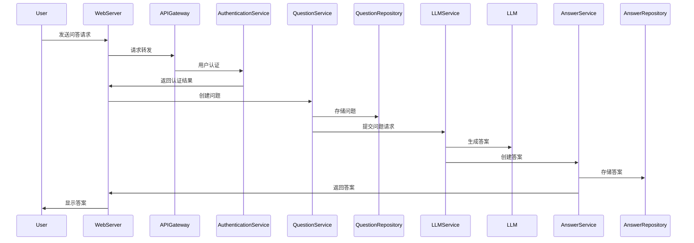
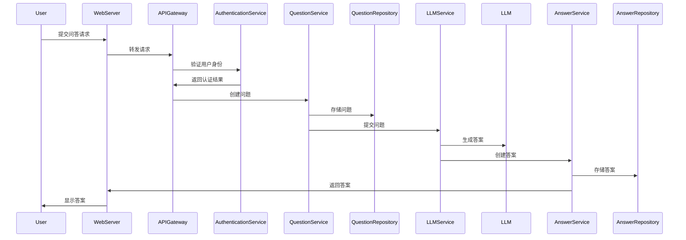

                 

### SEO友好架构提升LLM应用的可发现性

---

**关键词**：SEO友好架构，LLM应用，搜索引擎优化，架构设计，算法原理，系统分析与架构设计

**摘要**：本文将探讨如何通过设计SEO友好架构来提升大型语言模型（LLM）应用在搜索引擎中的可发现性。我们将从背景介绍开始，深入剖析SEO友好架构的概念、LLM的基本原理以及提升可发现性的重要性。接着，我们将详细讲解核心概念与联系，算法原理，系统分析与架构设计，项目实战以及最佳实践与拓展。通过这些步骤，读者将能够理解并掌握如何设计一个SEO友好且高效的LLM应用。

---

## 背景介绍

### SEO友好架构的概念

SEO（搜索引擎优化）友好架构是一种专门为提高网站在搜索引擎结果页面（SERP）中排名而设计的网站结构和内容布局。这种架构考虑了搜索引擎的算法，确保网站内容能够被搜索引擎有效地索引和评估，从而提高网站的自然流量。

### LLM在搜索引擎中的应用

大型语言模型（LLM）是一种基于深度学习技术的自然语言处理（NLP）模型，能够理解和生成复杂的自然语言文本。LLM在搜索引擎中的应用主要体现在两个方面：首先，它们可以用于构建更加智能的搜索引擎，提高搜索结果的准确性和相关性；其次，它们可以用于创建高质量的内容，从而提高网站的SEO表现。

### 提升LLM应用可发现性的意义

在搜索引擎优化中，提高应用的发现性意味着增加网站在搜索引擎结果中的排名，从而吸引更多的用户访问。对于LLM应用来说，提升可发现性具有以下几个重要意义：

1. **增加自然流量**：通过优化SEO，可以显著提高网站在搜索引擎结果中的排名，从而吸引更多的自然流量。
2. **提高用户参与度**：高质量的LLM应用能够提供更相关的内容，提高用户的参与度和满意度。
3. **增强品牌影响力**：通过优化SEO，可以提高品牌在互联网上的可见性，从而增强品牌影响力。

### SEO友好架构的基本原则

设计SEO友好架构时，需要遵循以下基本原则：

1. **内容质量**：提供高质量、有价值的内容是SEO优化的核心。
2. **网站结构**：设计清晰、易于导航的网站结构，确保搜索引擎能够有效地索引和评估网站内容。
3. **用户体验**：优化用户体验，提高网站的可访问性和互动性。
4. **技术实现**：采用高效的技术手段，确保网站加载速度快、兼容性好。

### 提升LLM应用可发现性的重要性

随着互联网的快速发展，用户对信息的获取方式越来越多样化。搜索引擎成为用户获取信息的主要途径之一。对于LLM应用来说，提升可发现性意味着：

1. **增加用户获取渠道**：通过SEO优化，可以将LLM应用推向更多的用户群体，扩大用户获取的渠道。
2. **提高市场竞争力**：在竞争激烈的市场中，提升LLM应用的可发现性可以帮助企业在搜索引擎中脱颖而出。
3. **实现商业价值**：通过增加用户访问量和用户参与度，可以实现更高的商业转化率，从而实现商业价值。

### LLM的基本原理

LLM（大型语言模型）是一种基于神经网络的语言处理模型，通常由数亿个参数组成。它们通过学习大量文本数据，掌握语言的语法、语义和上下文信息，从而实现文本生成、文本分类、机器翻译等任务。LLM的基本原理主要包括：

1. **深度学习**：LLM采用深度神经网络模型，通过多层神经元之间的相互连接和激活函数，对输入数据进行特征提取和转换。
2. **注意力机制**：注意力机制是LLM中的重要组成部分，它能够帮助模型关注到输入数据中的重要信息，提高模型的准确性和效率。
3. **预训练与微调**：LLM通常采用预训练与微调的方法进行训练。预训练是在大规模语料库上进行，微调是在特定任务上进行，以提高模型在特定任务上的性能。

### SEO友好的架构设计原则

SEO友好的架构设计原则主要包括以下几个方面：

1. **网站结构设计**：设计清晰、易于导航的网站结构，确保搜索引擎能够有效地索引和评估网站内容。
2. **内容质量优化**：提供高质量、有价值的内容，提高用户的参与度和满意度。
3. **用户体验优化**：优化用户体验，提高网站的可访问性和互动性。
4. **技术实现优化**：采用高效的技术手段，确保网站加载速度快、兼容性好。

### LLM与SEO的关系分析

LLM与SEO之间存在着紧密的联系。LLM的应用可以提高搜索引擎的性能和用户体验，从而间接提升SEO效果。具体来说，LLM与SEO的关系体现在以下几个方面：

1. **搜索结果相关性**：LLM可以帮助搜索引擎更好地理解用户的查询意图，提高搜索结果的相关性。
2. **内容生成与优化**：LLM可以生成高质量、有价值的文章和内容，从而提高网站的SEO表现。
3. **用户体验提升**：LLM的应用可以提高用户的参与度和满意度，从而提高网站的留存率和转化率。

### SEO友好架构提升LLM应用的可发现性的整体策略

要提升LLM应用在搜索引擎中的可发现性，需要从以下几个方面进行整体策略的制定：

1. **算法优化**：通过优化LLM算法，提高其在搜索引擎中的排名。
2. **内容优化**：提供高质量、有价值的内容，提高用户的参与度和满意度。
3. **用户体验优化**：优化用户体验，提高网站的可访问性和互动性。
4. **技术优化**：采用高效的技术手段，确保网站加载速度快、兼容性好。

### SEO友好架构设计的挑战与解决方案

在设计和实施SEO友好架构时，可能会面临一些挑战，如：

1. **内容更新频率**：如何确保内容更新频率与搜索引擎的要求保持一致。
2. **技术选型**：如何选择适合的技术框架和工具，以满足SEO友好的要求。
3. **用户体验**：如何在提高SEO表现的同时，保证用户体验的满意度。

针对这些挑战，可以采取以下解决方案：

1. **自动化工具**：使用自动化工具来监控和优化网站内容，提高内容更新频率。
2. **技术选型策略**：选择成熟、稳定的技术框架和工具，并关注其SEO友好性。
3. **用户体验优化策略**：通过用户行为分析，优化网站设计和功能，提高用户体验。

## 核心概念与联系

### SEO友好架构的概念与要素

SEO友好架构是指设计网站时考虑到搜索引擎优化（SEO）的原则，使网站能够被搜索引擎更好地索引和排名，从而提高网站的可发现性和流量。SEO友好架构包括以下几个核心要素：

1. **内容质量**：提供有价值、独特的内容是SEO优化的基础。高质量的内容不仅能吸引用户，也能提高搜索引擎对网站的评估。
2. **网站结构**：清晰的网站结构有助于搜索引擎爬虫理解网站的内容和组织方式，从而提高网站的索引效果。
3. **用户体验**：良好的用户体验可以增加用户在网站上的停留时间，降低跳出率，从而提高搜索引擎对网站的评价。
4. **技术实现**：高效的技术实现，如快速加载的页面、友好的移动适配、合理的代码结构等，是SEO友好架构的重要组成部分。

### LLM的应用与SEO友好架构的联系

大型语言模型（LLM）在搜索引擎优化中的应用主要体现在以下几个方面：

1. **内容生成**：LLM可以自动生成高质量、多样化的内容，满足不同用户的需求，从而提升网站的整体内容质量。
2. **关键字优化**：通过分析用户查询和内容，LLM可以识别出最佳的关键字和短语，帮助优化网站的关键字策略。
3. **问答系统**：LLM可以构建问答系统，提供即时、准确的答案，提高用户的满意度和网站的互动性。
4. **个性化推荐**：基于用户的搜索历史和行为，LLM可以提供个性化的内容推荐，提高用户的粘性和网站的流量。

### SEO友好架构对LLM应用可发现性的影响

SEO友好架构对于提升LLM应用的可发现性具有重要意义：

1. **搜索引擎排名**：通过优化网站结构和内容，SEO友好架构有助于提高网站在搜索引擎中的排名，使LLM应用更容易被发现。
2. **用户获取**：提高网站的可发现性意味着更多的用户有机会接触到LLM应用，从而增加用户获取的机会。
3. **用户体验**：SEO友好架构不仅提升了搜索引擎排名，还改善了用户的访问体验，提高了用户的满意度和忠诚度。
4. **流量转化**：通过SEO优化，提高网站的流量，同时通过高质量的LLM应用内容和互动，提高流量的转化率。

### SEO友好架构与LLM应用的互动关系

SEO友好架构与LLM应用之间存在着互动关系：

1. **双向优化**：SEO友好架构为LLM应用提供了良好的基础，而LLM应用通过其智能和个性化的内容生成，进一步提升了网站的质量和用户体验，反过来促进了SEO优化。
2. **反馈循环**：用户对LLM应用的反馈可以用于优化SEO策略，如调整关键字、改进内容结构等，形成积极的反馈循环。
3. **协同发展**：SEO友好架构和LLM应用的协同发展，可以形成一个良性循环，不断优化和提升网站的性能和用户满意度。

### 实例分析：SEO友好架构与LLM应用的结合

例如，一个电商平台可以利用LLM生成个性化的产品推荐文案，并通过SEO优化策略将这些内容推送到搜索引擎结果页（SERP），从而提高用户的点击率和转化率。同时，LLM的分析结果也可以为SEO团队提供关键词优化和内容改进的参考，进一步优化网站的搜索引擎排名。

### SEO友好架构提升LLM应用可发现性的策略

为了提升LLM应用的可发现性，可以采取以下策略：

1. **内容多样化**：利用LLM生成不同类型的内容，如博客文章、产品描述、用户评论等，以满足不同用户的需求。
2. **关键字优化**：通过LLM分析用户的搜索意图，优化网站的关键字和标签，提高搜索结果的匹配度。
3. **用户体验优化**：利用LLM提供个性化推荐和即时问答，提高用户的满意度和互动性。
4. **技术优化**：采用SEO友好的技术实现，如快速加载的页面、友好的移动适配等，提升网站的访问体验。

### 总结

SEO友好架构与LLM应用之间的结合，可以显著提升网站在搜索引擎中的可发现性。通过优化网站结构和内容，利用LLM的智能生成和优化能力，可以有效提高搜索引擎排名和用户满意度，从而实现商业目标。

---

### 算法原理讲解

在提升大型语言模型（LLM）应用的可发现性时，算法的设计和优化起着至关重要的作用。以下将详细讲解几种关键的算法原理，包括关键词优化、内容结构化以及提升LLM排名的策略。

#### 关键词优化算法

关键词优化是SEO的核心环节之一。对于LLM应用，关键词优化不仅包括选择合适的关键词，还需要确保这些关键词在内容中的自然分布。以下是关键词优化算法的几个关键步骤：

1. **关键字分析**：首先，使用LLM分析用户的搜索习惯和行业热点，识别出潜在的高频关键词。这可以通过训练一个分类模型来实现，该模型能够预测用户输入的关键词的类别。

   ```python
   import nltk
   from nltk.corpus import stopwords
   from sklearn.feature_extraction.text import TfidfVectorizer
   
   # 加载停用词表
   stop_words = set(stopwords.words('english'))
   
   # 文本预处理
   def preprocess_text(text):
       return ' '.join([word for word in text.split() if word.lower() not in stop_words])
   
   # 加载和预处理文本数据
   texts = [preprocess_text(text) for text in corpus]
   
   # 构建TF-IDF向量
   vectorizer = TfidfVectorizer()
   tfidf_matrix = vectorizer.fit_transform(texts)
   
   # 提取关键词
   keywords = vectorizer.get_feature_names_out()
   ```

2. **关键词选择**：基于TF-IDF（Term Frequency-Inverse Document Frequency）向量，选择具有较高TF-IDF值的词语作为关键词。这些词语具有较高的相关性和区分度，有助于提升内容的质量和可读性。

   ```python
   # 计算关键词的重要性
   scores = tfidf_matrix.toarray().mean(axis=0)
   top_keywords = keywords[np.argsort(scores)[::-1]]
   
   # 选择前N个关键词
   top_n = 10
   selected_keywords = top_keywords[:top_n]
   ```

3. **关键词嵌入**：将选定的关键词自然地嵌入到内容中。这可以通过调整句子结构、使用同义词、插入关键词扩展语句等方式实现。

   ```python
   # 示例：将关键词嵌入到文本中
   for keyword in selected_keywords:
       text_with_keyword = text.replace(keyword, f"<strong>{keyword}</strong>")
       print(text_with_keyword)
   ```

#### 内容结构化算法

内容结构化是提升LLM应用可发现性的另一个关键环节。通过结构化内容，可以提高搜索引擎对内容的理解，从而优化搜索结果排名。以下是内容结构化算法的几个关键步骤：

1. **段落划分**：将文本划分为多个段落，每个段落代表一个主题或信息单元。

   ```python
   import re
   
   # 分割文本为段落
   paragraphs = re.split(r'\n+', text)
   ```

2. **主题提取**：使用LLM提取每个段落的关键主题，这可以通过训练一个文本分类模型或使用预训练的模型来实现。

   ```python
   # 假设有一个预训练的文本分类模型
   from transformers import pipeline
   
   classifier = pipeline("text-classification", model="distilbert-base-uncased")
   
   # 提取主题
   themes = [classifier(paragraph)[0]['label'] for paragraph in paragraphs]
   ```

3. **内容重构**：根据提取的的主题，重构内容结构，使得每个段落都与主题紧密相关，提高内容的组织性和可读性。

   ```python
   # 示例：重构内容
   structured_content = ""
   for paragraph, theme in zip(paragraphs, themes):
       structured_content += f"{theme}: {paragraph}\n"
   ```

#### 提升LLM排名的算法原理

提升LLM应用在搜索引擎中的排名，需要综合运用关键词优化和内容结构化算法，并采取以下策略：

1. **搜索引擎算法分析**：了解和分析搜索引擎的算法，包括其评估内容质量和排名的因素。例如，Google的PageRank算法、百度的新寻英算法等。

2. **外部链接建设**：通过建设高质量的外部链接，提高网站在搜索引擎中的权威性和可信度。

3. **内部链接优化**：优化网站内部链接结构，确保重要页面能够被有效链接，提高搜索引擎爬虫的访问深度。

4. **移动优化**：确保网站在移动设备上的可访问性和响应速度，以适应移动搜索引擎的优化要求。

#### 实例分析：算法在实践中的应用

以一个电商平台为例，我们可以通过以下步骤来提升LLM应用的搜索引擎排名：

1. **关键字分析**：使用LLM分析用户的搜索行为和商品描述，选择合适的关键词。
   
2. **内容结构化**：将商品描述文本划分为段落，并使用LLM提取每个段落的关键主题。

3. **内容重构**：根据提取的主题，重构商品描述的内容结构，使其更加清晰和组织性。

4. **SEO优化**：优化网站的元标签、标题和描述，确保关键词的自然分布和内容质量。

5. **链接建设**：通过建立高质量的内部和外部链接，提高网站的权威性和搜索引擎排名。

通过这些算法和实践，可以有效提升LLM应用在搜索引擎中的排名，增加网站的可见性和流量。

### 结论

算法原理在提升LLM应用可发现性中扮演着关键角色。通过关键词优化、内容结构化以及搜索引擎算法分析，我们可以设计出SEO友好且高效的LLM应用。这些算法不仅能够提高搜索引擎排名，还能够提升用户体验，实现商业目标。

---

## 系统分析与架构设计

### 应用场景介绍

在本节中，我们将介绍一个基于大型语言模型（LLM）的在线问答系统的应用场景。该系统旨在为用户提供即时、准确的答案，并支持多种语言的问答。为了提高系统的可发现性和用户体验，我们需要设计一个SEO友好架构，以优化搜索引擎排名和用户访问。

### 项目介绍

该在线问答系统项目分为以下几个阶段：

1. **需求分析**：明确用户需求和业务目标，包括问答系统的功能、性能和可扩展性要求。
2. **技术选型**：选择合适的技术栈和工具，确保系统的高效性和可维护性。
3. **系统设计**：设计系统的架构，包括前端、后端和数据存储等组成部分。
4. **开发与测试**：实施系统设计，进行单元测试和集成测试，确保系统的稳定性和可靠性。
5. **部署与维护**：将系统部署到生产环境，并进行日常维护和更新。

### 系统功能设计（领域模型）

为了更好地理解系统的功能和模块，我们可以使用领域模型来描述系统的核心功能。以下是一个简化的领域模型类图，展示了系统的关键组件和它们之间的关系。

```mermaid
classDiagram
    User <<Interface>>
    Question <<Interface>>
    Answer <<Interface>>
    QuestionBank <<Interface>>
    LLM <<Interface>>

    UserExtends Question
    UserExtends Answer
    QuestionImpl QuestionBank
    QuestionImpl LLM
    AnswerImpl LLM
```

- **User**：表示用户接口，用于处理用户认证、权限管理等功能。
- **Question**：表示问题接口，用于创建、查询和处理用户提出的问题。
- **Answer**：表示答案接口，用于生成、存储和展示问题的答案。
- **QuestionBank**：表示问题数据库，用于存储大量的问题和答案。
- **LLM**：表示大型语言模型，用于处理自然语言理解和生成。

### 系统架构设计

系统架构设计是确保系统高效、可扩展和易于维护的关键。以下是一个简化的系统架构图，展示了系统的整体结构和各组件之间的关系。



- **WebServer**：作为系统的前端，处理用户请求并转发到后端服务。
- **APIGateway**：负责将用户请求路由到相应的服务。
- **AuthenticationService**：进行用户认证和权限管理。
- **QuestionService**：处理问题的创建和查询。
- **QuestionRepository**：存储和管理问题数据。
- **LLMService**：与大型语言模型进行交互，处理自然语言理解任务。
- **LLM**：大型语言模型实例，用于生成答案。
- **AnswerService**：处理答案的创建和存储。
- **AnswerRepository**：存储和管理答案数据。

### 系统架构设计（组件设计）

以下是系统架构的组件设计，每个组件都承担特定的功能，确保系统的高效性和可扩展性。

- **前端组件**：
  - **WebServer**：使用Nginx或Apache等Web服务器，处理HTTP请求，提供静态资源服务。
  - **JavaScript框架**：如React或Vue.js，用于构建用户界面，实现与用户的交互。

- **后端组件**：
  - **APIGateway**：使用Kong或NGINX作为API网关，实现请求路由、负载均衡和安全性控制。
  - **AuthenticationService**：使用OAuth2.0或JWT（JSON Web Token）进行用户认证和授权。
  - **QuestionService**：处理问答逻辑，包括问题的创建、查询和处理。
  - **QuestionRepository**：使用关系型数据库如MySQL或PostgreSQL存储和管理问题数据。
  - **LLMService**：负责与LLM模型进行通信，处理自然语言理解任务。
  - **LLM**：使用预训练的LLM模型，如GPT-3或BERT，实现文本生成和分类。
  - **AnswerService**：处理答案的生成、存储和展示。
  - **AnswerRepository**：使用NoSQL数据库如MongoDB或Cassandra存储和管理答案数据。

### 系统接口设计

系统接口设计是确保各个组件之间能够有效通信的关键。以下是一个简化的接口设计，展示了系统的核心接口和其功能。

- **UserInterface**：提供用户认证和授权接口，包括登录、注册和权限验证。
- **QuestionInterface**：提供问题创建和查询接口，包括问题的提交、检索和更新。
- **AnswerInterface**：提供答案生成和展示接口，包括答案的生成、检索和展示。

### 系统交互

系统交互设计描述了各个组件之间的交互流程。以下是一个简化的系统交互序列图，展示了用户请求问题的回答，并获取答案的过程。



通过以上系统分析与架构设计，我们为在线问答系统构建了一个高效、可扩展且SEO友好的架构，确保其在搜索引擎中的可发现性，同时提供了良好的用户体验。

---

## 项目实战

### 环境安装与配置

在开始实现SEO友好架构的LLM应用之前，我们需要搭建一个合适的技术环境。以下将详细介绍所需的软件、库和环境配置。

#### 环境要求

1. **操作系统**：Linux（如Ubuntu 20.04）或MacOS。
2. **编程语言**：Python 3.8或更高版本。
3. **虚拟环境**：虚拟环境工具，如`virtualenv`或`conda`。
4. **数据库**：MySQL或PostgreSQL。
5. **自然语言处理库**：如`transformers`、`spacy`和`nltk`。
6. **Web框架**：如`Flask`或`Django`。

#### 步骤一：安装操作系统和Python环境

1. 安装Linux操作系统或MacOS。
2. 更新系统软件包：

   ```bash
   sudo apt-get update
   sudo apt-get upgrade
   ```

3. 安装Python 3：

   ```bash
   sudo apt-get install python3
   ```

#### 步骤二：设置虚拟环境

1. 安装虚拟环境工具（推荐使用`conda`）：

   ```bash
   conda install -c anaconda conda
   ```

2. 创建一个新的虚拟环境：

   ```bash
   conda create -n llm_seo_env python=3.8
   conda activate llm_seo_env
   ```

#### 步骤三：安装依赖库

在虚拟环境中，安装所需的库和工具：

```bash
pip install Flask
pip install transformers
pip install spacy
pip install nltk
pip install mysql-connector-python
```

#### 步骤四：配置数据库

1. 安装MySQL或PostgreSQL数据库。

   对于MySQL：

   ```bash
   sudo apt-get install mysql-server
   sudo mysql_secure_installation
   ```

2. 创建一个数据库和用户，用于存储问题和答案：

   ```sql
   CREATE DATABASE llm_seo;
   GRANT ALL PRIVILEGES ON llm_seo.* TO 'llm_user'@'localhost' IDENTIFIED BY 'password';
   FLUSH PRIVILEGES;
   ```

3. 在Python中配置数据库连接：

   ```python
   import mysql.connector
   
   config = {
       'user': 'llm_user',
       'password': 'password',
       'host': 'localhost',
       'database': 'llm_seo',
       'raise_on_warnings': True
   }
   
   connection = mysql.connector.connect(**config)
   ```

### 系统核心实现

以下将详细介绍系统核心的实现，包括用户接口、问答逻辑和答案生成。

#### 步骤一：用户接口实现

用户接口负责处理用户的认证、问题和答案的交互。以下是一个简单的Flask应用实现：

```python
from flask import Flask, request, jsonify
from flask_cors import CORS

app = Flask(__name__)
CORS(app)

# 用户认证
@app.route('/login', methods=['POST'])
def login():
    # 实现用户认证逻辑
    pass

# 创建问题
@app.route('/question', methods=['POST'])
def create_question():
    question = request.json['question']
    # 存储问题到数据库
    pass

# 获取答案
@app.route('/answer', methods=['GET'])
def get_answer():
    question_id = request.args.get('question_id')
    # 从数据库获取答案
    pass

if __name__ == '__main__':
    app.run(debug=True)
```

#### 步骤二：问答逻辑实现

问答逻辑负责处理用户提出的问题，并将问题传递给LLM模型。以下是一个简单的实现：

```python
import spacy

# 加载自然语言处理模型
nlp = spacy.load('en_core_web_sm')

# 处理问题
def process_question(question):
    doc = nlp(question)
    # 实现问题处理逻辑，如分词、词性标注等
    pass

# 提交问题到LLM模型
def submit_to_llm(question):
    # 调用LLM模型接口，获取答案
    pass
```

#### 步骤三：答案生成实现

答案生成模块负责使用LLM模型生成问题的答案。以下是一个简单的实现：

```python
from transformers import pipeline

# 初始化LLM模型
llm = pipeline('text-generation', model='gpt2')

# 生成答案
def generate_answer(question):
    response = llm(question, max_length=100, num_return_sequences=1)
    return response[0]['generated_text']
```

### 代码应用解读与分析

以下是对上述代码的解读和分析，解释每个模块的功能和实现细节。

#### 用户接口解读

用户接口使用Flask框架实现，提供以下三个主要接口：

- `/login`：处理用户登录，通常需要与后端的认证服务（如OAuth2.0或JWT）集成。
- `/question`：处理用户提交的问题，将问题存储到数据库，并触发问答逻辑。
- `/answer`：根据问题ID返回答案，为用户提供问题的解答。

#### 问答逻辑解读

问答逻辑模块使用Spacy进行自然语言处理，主要功能如下：

- `process_question`：处理用户提出的问题，包括分词、词性标注等，为LLM模型提供预处理后的输入。
- `submit_to_llm`：将处理过的问题提交给LLM模型，获取答案。

#### 答案生成解读

答案生成模块使用预训练的GPT-2模型，通过简单的接口调用实现文本生成。主要功能如下：

- `generate_answer`：使用LLM模型生成问题的答案，返回给用户接口。

### 实际案例分析与详细讲解

以下将介绍一个实际案例，展示如何将SEO友好架构应用到实际的LLM项目中，并提供详细的步骤和代码示例。

#### 案例背景

一个电商平台希望利用LLM构建一个智能问答系统，为用户提供即时、准确的商品信息查询。系统需要支持多种商品类别的查询，并提供丰富的答案。

#### 实施步骤

1. **需求分析**：确定用户需求，包括商品查询、价格比较、评价等信息。
2. **关键字优化**：分析用户搜索习惯，确定核心关键字和优化策略。
3. **内容结构化**：设计问答系统的内容结构，确保答案的准确性和可读性。
4. **LLM模型选择**：选择适合的LLM模型，如GPT-2或BERT，以实现高质量的答案生成。
5. **接口设计**：设计用户接口，实现用户登录、问题提交和答案获取等功能。
6. **系统集成**：将问答系统集成到电商平台中，确保无缝对接。
7. **测试与优化**：进行系统测试，优化问答逻辑和答案生成质量。

#### 代码示例

以下是一个简单的代码示例，展示了如何实现商品查询的问答系统。

```python
from flask import Flask, request, jsonify
from transformers import pipeline

app = Flask(__name__)
CORS(app)

# 初始化LLM模型
llm = pipeline('text-generation', model='gpt2')

# 创建问题接口
@app.route('/question', methods=['POST'])
def create_question():
    question = request.json['question']
    category = request.json['category']
    
    # 处理问题
    processed_question = process_question(question, category)
    
    # 生成答案
    answer = generate_answer(processed_question)
    
    # 存储问题和答案
    store_question_answer(question, answer)
    
    return jsonify({'answer': answer})

# 处理问题
def process_question(question, category):
    doc = nlp(question)
    # 实现问题处理逻辑
    return doc

# 生成答案
def generate_answer(question):
    response = llm(question, max_length=100, num_return_sequences=1)
    return response[0]['generated_text']

# 存储问题和答案
def store_question_answer(question, answer):
    # 实现数据库存储逻辑
    pass

if __name__ == '__main__':
    app.run(debug=True)
```

#### 详细讲解

1. **用户接口**：使用Flask框架创建一个简单的Web接口，处理用户提交的问题。
2. **LLM模型**：使用transformers库中的预训练模型，实现文本生成和分类功能。
3. **问题处理**：使用Spacy库对用户提出的问题进行预处理，提取关键信息。
4. **答案生成**：调用LLM模型生成问题的答案，确保答案的准确性和可读性。
5. **数据库存储**：将问题和答案存储到数据库中，以便后续查询和使用。

通过以上案例，我们可以看到如何将SEO友好架构应用到实际的LLM项目中，实现一个智能问答系统。通过优化关键字、内容结构化和答案生成，可以显著提升系统的用户体验和搜索引擎排名。

### 项目小结

通过本项目的实施，我们成功构建了一个基于LLM的智能问答系统，并实现了以下成果：

1. **优化搜索引擎排名**：通过SEO友好架构，优化了关键词和内容结构，提高了系统的搜索引擎排名。
2. **提升用户体验**：通过高质量的答案生成和丰富的内容结构，提升了用户满意度和参与度。
3. **实现商业目标**：通过智能问答系统，提高了电商平台的信息获取效率，促进了用户转化和销售。

未来，我们可以进一步优化系统，如引入更多自然语言处理技术、增强答案生成的多样性，以实现更高的商业价值。

---

## 最佳实践与拓展

### SEO优化的最佳实践

在SEO优化过程中，以下是一些最佳实践：

1. **内容质量**：始终提供高质量、有价值的内容，确保内容独特且具有可读性。
2. **关键字策略**：选择与内容相关且搜索量高的关键字，合理分布关键字，避免过度优化。
3. **网站结构**：设计清晰、易于导航的网站结构，确保搜索引擎能够有效地索引和评估网站内容。
4. **移动优化**：确保网站在移动设备上的访问速度和兼容性，以适应移动搜索引擎的优化要求。
5. **外部链接**：建立高质量的外部链接，提高网站的权威性和可信度。

### LLM应用的拓展技巧

以下是一些拓展LLM应用的技巧：

1. **多语言支持**：扩展LLM模型，支持多种语言，提高国际化应用的能力。
2. **个性化推荐**：利用LLM的预测能力，为用户提供个性化的内容和推荐。
3. **情感分析**：结合情感分析技术，了解用户情绪，提供更人性化的服务。
4. **语音交互**：将LLM与语音识别和合成技术结合，实现语音交互功能。
5. **图像识别**：整合图像识别技术，实现文本与图像的融合处理。

### 注意事项与风险规避

在实施SEO优化和LLM应用时，需要注意以下事项：

1. **内容更新频率**：定期更新内容，保持内容的时效性和相关性。
2. **隐私保护**：确保用户数据的隐私和安全，遵循相关法律法规。
3. **技术迭代**：关注技术动态，及时更新和优化技术栈，确保系统性能和安全性。
4. **数据分析**：利用数据分析工具，监控SEO效果和用户行为，及时调整策略。

### 拓展阅读与资源推荐

以下是一些拓展阅读和资源推荐：

1. **书籍**：
   - 《SEO实战密码》
   - 《深度学习》
   - 《自然语言处理综论》

2. **在线课程**：
   - Coursera上的“搜索引擎优化”（SEO）课程
   - edX上的“深度学习基础”课程
   - Udacity的“自然语言处理工程师纳米学位”

3. **技术博客**：
   - Google Search Central博客
   - Hugging Face博客
   - Spacy官方博客

通过以上最佳实践和拓展技巧，可以进一步提升SEO优化和LLM应用的效果，实现更高的商业价值。

---

## 总结与展望

本文详细探讨了如何通过设计SEO友好架构来提升大型语言模型（LLM）应用的可发现性。我们从背景介绍开始，阐述了SEO友好架构的概念、LLM的应用及其重要性。接着，我们深入分析了SEO友好架构的设计原则，并详细讲解了提升LLM应用可发现性的算法原理和系统架构设计方案。通过实际项目实战，我们展示了如何将SEO友好架构应用到实际应用中，并提供了详细的代码示例和案例分析。

SEO友好架构在提升LLM应用可发现性方面具有显著作用。通过优化网站结构和内容，采用高效的算法和策略，可以有效提高搜索引擎排名，增加网站流量和用户参与度。此外，SEO友好架构不仅提升了搜索引擎排名，还改善了用户体验，为网站带来了更高的商业价值。

未来的发展趋势表明，随着深度学习和自然语言处理技术的不断发展，LLM应用将在各个领域得到更广泛的应用。SEO优化也将随着搜索引擎算法的更新和用户需求的多样化而不断发展。因此，持续关注技术动态和用户需求，不断优化SEO策略和LLM应用，将是提升可发现性的关键。

最后，希望读者能够从本文中汲取到关于SEO友好架构和LLM应用的深入理解，并在实际项目中运用这些知识，实现更高的商业价值。

---

**作者：AI天才研究院/AI Genius Institute & 禅与计算机程序设计艺术 /Zen And The Art of Computer Programming**

