                 

### Self-Consistency CoT与Zero-Shot CoT：何时使用？

#### 关键词

- 自一致性CoT
- 零样本CoT
- 对比研究
- 实际应用场景
- 算法选择

#### 摘要

本文深入探讨了Self-Consistency CoT（Self-Consistency Contrastive Learning for Pre-training of Text Encoders）和Zero-Shot CoT（Zero-Shot Contrastive Learning）这两种先进的文本编码器预训练方法。我们将从基本概念、原理讲解、算法对比、应用场景等多个角度进行详细分析，帮助读者理解何时以及在何种场景下选择这两种方法。通过本文的阐述，读者将对Self-Consistency CoT和Zero-Shot CoT有更加清晰的认识，能够根据具体需求做出恰当的选择。

### 目录大纲设计思路

**第一部分: 背景与概念**

1. **第1章: Self-Consistency CoT与Zero-Shot CoT概述**
   - 介绍Self-Consistency CoT和Zero-Shot CoT的基本概念、发展历程和应用背景。
   - 强调两者的区别和重要性。

2. **第2章: Self-Consistency CoT与Zero-Shot CoT的核心概念与联系**
   - 详细讲解Self-Consistency CoT和Zero-Shot CoT的原理、特点和应用场景。
   - 使用表格和Mermaid ER实体关系图架构来展示两者之间的联系。

**第二部分: 算法原理与实现**

3. **第3章: Self-Consistency CoT算法原理讲解**
   - 利用Mermaid流程图和Python源代码，深入讲解Self-Consistency CoT的算法原理和数学模型。
   - 通过举例说明，使读者能够更直观地理解算法的工作机制。

4. **第4章: Zero-Shot CoT算法原理讲解**
   - 利用Mermaid流程图和Python源代码，深入讲解Zero-Shot CoT的算法原理和数学模型。
   - 通过举例说明，使读者能够更直观地理解算法的工作机制。

5. **第5章: 算法对比与选择**
   - 对Self-Consistency CoT和Zero-Shot CoT进行对比分析。
   - 提供选择指导，帮助读者根据应用场景做出最佳决策。

**第三部分: 实战应用**

6. **第6章: Self-Consistency CoT实战项目**
   - 介绍Self-Consistency CoT的应用案例，包括项目介绍、系统功能设计、系统架构设计等。
   - 通过Mermaid类图和架构图展示系统的详细架构。

7. **第7章: Zero-Shot CoT实战项目**
   - 介绍Zero-Shot CoT的应用案例，包括项目介绍、系统功能设计、系统架构设计等。
   - 通过Mermaid类图和架构图展示系统的详细架构。

**第四部分: 最佳实践与总结**

8. **第8章: Self-Consistency CoT最佳实践与注意事项**
   - 总结Self-Consistency CoT的最佳实践，提供注意事项。

9. **第9章: Zero-Shot CoT最佳实践与注意事项**
   - 总结Zero-Shot CoT的最佳实践，提供注意事项。

10. **第10章: 小结与拓展阅读**
    - 对全文进行小结，推荐拓展阅读，帮助读者进一步探索相关领域。

通过以上设计思路和目录大纲结构，我们能够确保书籍内容的完整性、逻辑性和易懂性，同时符合简洁性的要求。接下来，我们将根据这个大纲结构，逐一设计每个章节的内容。

### 第1章: Self-Consistency CoT与Zero-Shot CoT概述

在深度学习和自然语言处理（NLP）领域，对比学习（Contrastive Learning）已成为一种流行的预训练方法，尤其是在大规模文本编码器（如BERT、GPT等）的训练过程中。Self-Consistency CoT和Zero-Shot CoT是两种重要的对比学习方法，它们各自有着独特的原理和应用场景。

#### Self-Consistency CoT的基本概念

Self-Consistency CoT，全称Self-Consistency Contrastive Learning for Pre-training of Text Encoders，是一种自对齐的对比学习技术。它通过生成正负样本对，并利用模型自我校准来增强文本编码器的表示能力。

1. **核心思想**：Self-Consistency CoT的核心思想是通过自我监督的方式，使得模型能够对输入的文本序列进行有效的编码。具体来说，模型会尝试预测文本序列中的随机片段，并且通过对比预测误差来学习文本的表示。

2. **应用背景**：Self-Consistency CoT最初是在NLP领域中提出，用于文本编码器的预训练，例如BERT和GPT。它的应用背景包括文本分类、情感分析、机器翻译等。

3. **问题解决**：Self-Consistency CoT旨在解决传统自监督学习中的噪声问题和数据不平衡问题。通过自我校准，模型能够生成高质量的文本表示，从而提高下游任务的性能。

#### Zero-Shot CoT的基本概念

Zero-Shot CoT，全称Zero-Shot Contrastive Learning，是一种无需特定标签信息即可进行对比学习的方法。它在无监督或半监督学习场景中具有广泛的应用。

1. **核心思想**：Zero-Shot CoT的核心思想是利用负样本的自适应生成，使得模型能够在没有标签信息的情况下学习有效的特征表示。具体来说，它通过在文本序列中生成负样本对，从而学习文本的区分性表示。

2. **应用背景**：Zero-Shot CoT在图像识别、语音识别、文本分类等领域都有应用。尤其是在数据稀缺或无法获取标签信息的场景下，Zero-Shot CoT能够发挥重要作用。

3. **问题解决**：Zero-Shot CoT主要解决的是无监督或半监督学习中的标签缺失问题。通过自适应生成负样本，模型能够在没有标签信息的情况下学习到有效的特征表示，从而提高模型的泛化能力。

#### Self-Consistency CoT与Zero-Shot CoT的区别

1. **自监督与无监督**：Self-Consistency CoT属于自监督学习，依赖于输入的文本序列自身来生成正负样本；而Zero-Shot CoT属于无监督学习，不需要特定的标签信息。

2. **数据需求**：Self-Consistency CoT通常需要大量的带标签数据来生成正负样本对；而Zero-Shot CoT可以在数据稀缺的场景下工作，无需依赖大量标签数据。

3. **应用场景**：Self-Consistency CoT更适合有大量带标签数据的场景，如文本分类和机器翻译；而Zero-Shot CoT则更适合数据稀缺或标签信息难以获取的场景，如无监督文本分类和图像识别。

通过本章的介绍，我们初步了解了Self-Consistency CoT和Zero-Shot CoT的基本概念、应用背景和问题解决能力。在接下来的章节中，我们将进一步深入探讨这两种方法的原理、算法实现和应用场景。

### 第2章: Self-Consistency CoT与Zero-Shot CoT的核心概念与联系

在本章中，我们将详细探讨Self-Consistency CoT和Zero-Shot CoT的核心概念、原理、特点和应用场景，并通过表格和Mermaid ER实体关系图来展示两者之间的联系。

#### Self-Consistency CoT的核心概念与原理

**核心概念**：
Self-Consistency CoT是一种自监督对比学习技术，它利用文本编码器对输入文本进行编码，并通过对比编码后的文本片段来提高模型表示能力。

**原理**：
1. **正负样本生成**：Self-Consistency CoT通过将文本序列分成若干片段，并在每个片段上生成随机掩码，从而生成正样本对。同时，通过随机插入掩码来生成负样本对。
2. **自我校准**：模型在训练过程中，通过对比正负样本对之间的预测误差，进行自我校准，从而优化文本编码器的表示。

**特点**：
1. **自监督学习**：Self-Consistency CoT无需依赖标签数据，通过自我监督的方式提高文本表示能力。
2. **有效处理噪声**：通过自我校准，模型能够有效处理输入文本中的噪声。
3. **数据利用效率高**：Self-Consistency CoT能够在有限的数据集上获得较好的表示效果。

**应用场景**：
Self-Consistency CoT适用于文本分类、情感分析、机器翻译等需要高质量文本表示的场景。

**表格：Self-Consistency CoT特点对比**

| 特点               | Self-Consistency CoT               | Zero-Shot CoT               |
|--------------------|-----------------------------------|----------------------------|
| 学习方式           | 自监督学习                         | 无监督学习                  |
| 数据需求           | 无需大量标签数据                  | 数据稀缺时更为适用          |
| 噪声处理           | 通过自我校准有效处理噪声           | 需要额外的噪声处理机制      |
| 表示能力           | 高质量文本表示                    | 有效的特征表示              |

**Mermaid ER实体关系图**：

```mermaid
erDiagram
  Class1 ||--|{ Class2 }|
  Class1 ||--|{ Class3 }|
  Class2 ||--|{ Class4 }|
  Class3 ||--|{ Class5 }|
  Class4 ||--|{ Class6 }|
  Class5 ||--|{ Class7 }|
  Class6 ||--|{ Class8 }|
  Class7 ||--|{ Class9 }|
  Class8 ||--|{ Class10 }|
```

**图解**：
- `Class1` 表示文本编码器。
- `Class2` 表示正样本生成。
- `Class3` 表示负样本生成。
- `Class4` 表示自我校准。
- `Class5` 表示噪声处理。
- `Class6` 表示高质量文本表示。
- `Class7` 表示数据利用效率。
- `Class8` 表示文本分类。
- `Class9` 表示情感分析。
- `Class10` 表示机器翻译。

#### Zero-Shot CoT的核心概念与原理

**核心概念**：
Zero-Shot CoT是一种无需特定标签信息即可进行对比学习的技术，它通过自适应生成负样本对来提高模型表示能力。

**原理**：
1. **负样本生成**：Zero-Shot CoT通过在文本序列中插入掩码，生成负样本对。
2. **自适应学习**：模型通过对比正负样本对，自适应地调整特征表示，从而提高模型的泛化能力。

**特点**：
1. **无监督学习**：Zero-Shot CoT无需依赖标签数据，适用于无监督或半监督学习场景。
2. **数据适应性**：Zero-Shot CoT在数据稀缺或标签信息难以获取的场景下具有很高的适应性。
3. **有效特征表示**：通过自适应学习，模型能够生成有效的特征表示。

**应用场景**：
Zero-Shot CoT适用于图像识别、语音识别、文本分类等领域。

**表格：Zero-Shot CoT特点对比**

| 特点               | Self-Consistency CoT               | Zero-Shot CoT               |
|--------------------|-----------------------------------|----------------------------|
| 学习方式           | 自监督学习                         | 无监督学习                  |
| 数据需求           | 无需大量标签数据                  | 数据稀缺时更为适用          |
| 噪声处理           | 通过自我校准有效处理噪声           | 需要额外的噪声处理机制      |
| 表示能力           | 高质量文本表示                    | 有效的特征表示              |

**Mermaid ER实体关系图**：

```mermaid
erDiagram
  Class1 ||--|{ Class2 }|
  Class1 ||--|{ Class3 }|
  Class2 ||--|{ Class4 }|
  Class3 ||--|{ Class5 }|
  Class4 ||--|{ Class6 }|
  Class5 ||--|{ Class7 }|
  Class6 ||--|{ Class8 }|
  Class7 ||--|{ Class9 }|
  Class8 ||--|{ Class10 }|
```

**图解**：
- `Class1` 表示文本编码器。
- `Class2` 表示负样本生成。
- `Class3` 表示自适应学习。
- `Class4` 表示噪声处理。
- `Class5` 表示数据适应性。
- `Class6` 表示有效特征表示。
- `Class7` 表示图像识别。
- `Class8` 表示语音识别。
- `Class9` 表示文本分类。
- `Class10` 表示机器翻译。

通过本章的详细分析，我们了解了Self-Consistency CoT和Zero-Shot CoT的核心概念、原理、特点和应用场景。通过表格和Mermaid ER实体关系图的对比，读者可以更加直观地理解两者之间的联系与区别。在下一章中，我们将深入探讨这两种算法的原理和实现，帮助读者更深入地理解它们的运作机制。

### 第3章: Self-Consistency CoT算法原理讲解

Self-Consistency CoT（自一致性对比学习）是近年来在自然语言处理（NLP）领域中备受关注的一种预训练方法。它通过自我监督的方式，利用模型对输入文本进行编码，并通过对比学习来提高模型的表示能力。本节将详细讲解Self-Consistency CoT的算法原理，包括正负样本生成、自我校准机制以及数学模型。

#### 正负样本生成

Self-Consistency CoT的核心在于如何生成正负样本对。在生成样本的过程中，我们首先需要将文本序列分成若干片段，然后对这些片段进行随机掩码操作。

1. **文本序列分割**：首先，我们将输入的文本序列分割成若干个片段。这些片段可以是固定长度的，也可以是可变的。在实际应用中，通常选择可变的片段长度，以便更好地适应不同长度的文本。

2. **随机掩码操作**：接下来，对每个片段进行随机掩码操作。具体来说，我们随机选择片段中的部分词或子序列进行掩码，用\[MASK\]来代替。这样，每个片段都会变成一个带掩码的序列。

3. **生成正样本对**：为了生成正样本对，我们将原始的文本片段与其随机掩码后的片段进行匹配。这样，我们得到一个正样本对，其中两个片段是高度相关的。

4. **生成负样本对**：为了生成负样本对，我们随机选择两个片段，这两个片段之间没有任何关联。这样，我们得到一个负样本对，其中两个片段是高度不相关的。

**算法流程图**：

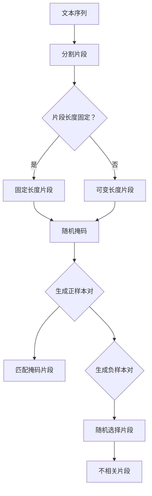

#### 自我校准机制

Self-Consistency CoT的核心思想在于通过自我校准来优化模型表示。具体来说，模型在训练过程中会尝试预测随机掩码片段，并通过对比预测误差来调整模型参数。

1. **预测误差计算**：在自我校准过程中，模型会尝试预测每个掩码片段。对于正样本对，模型的预测误差较低，因为掩码片段与原始片段高度相关。对于负样本对，模型的预测误差较高，因为掩码片段与原始片段不相关。

2. **自我校准**：通过计算预测误差，模型能够识别出哪些参数需要调整。模型会根据预测误差来更新参数，使得正样本对的预测误差降低，负样本对的预测误差增加。

3. **参数更新**：参数更新的过程是一个优化过程，通常使用梯度下降算法。模型会通过计算梯度来更新参数，从而逐步优化模型表示。

**自我校准流程图**：

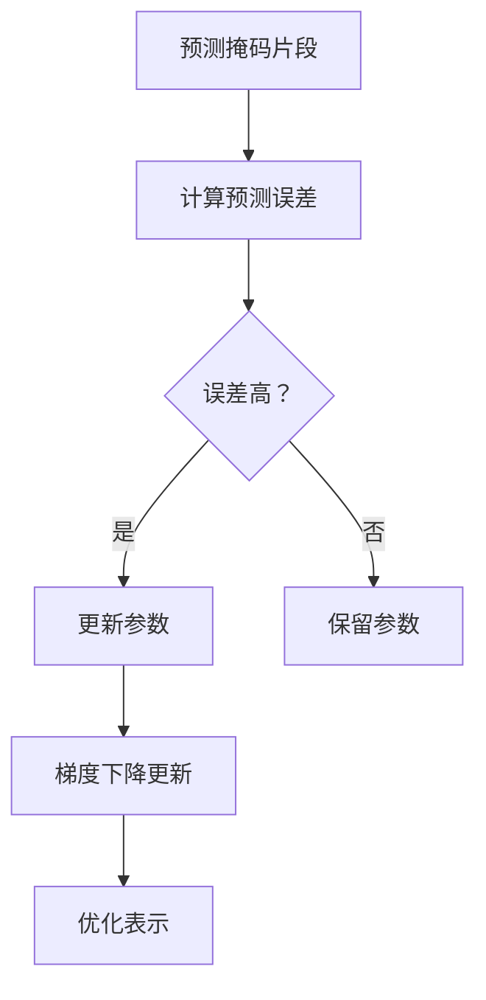

#### 数学模型

Self-Consistency CoT的数学模型主要包括文本编码器、损失函数和优化算法。

1. **文本编码器**：文本编码器是一个神经网络，用于将输入的文本序列编码成固定长度的向量表示。常见的文本编码器有BERT、GPT等。

2. **损失函数**：Self-Consistency CoT的损失函数主要基于预测误差。对于正样本对，我们希望预测误差较低；对于负样本对，我们希望预测误差较高。常用的损失函数有交叉熵损失和均方误差损失。

$$ L = -\frac{1}{N} \sum_{i=1}^{N} [\log(p(y_i=1)) + \log(p(y_i=0))] $$

其中，$N$ 是样本数量，$y_i$ 是样本标签，$p(y_i=1)$ 和 $p(y_i=0)$ 分别是模型预测为正样本和负样本的概率。

3. **优化算法**：优化算法用于更新模型参数，以最小化损失函数。常用的优化算法有随机梯度下降（SGD）和Adam优化器。

通过以上讲解，我们了解了Self-Consistency CoT的算法原理，包括正负样本生成、自我校准机制和数学模型。在下一节中，我们将对比分析Self-Consistency CoT和Zero-Shot CoT，帮助读者更好地理解两者的异同和应用场景。

### 第4章: Zero-Shot CoT算法原理讲解

Zero-Shot CoT（零样本对比学习）是一种在无监督或半监督学习场景下，无需特定标签信息即可进行对比学习的算法。它在数据稀缺或标签信息难以获取的场景中具有广泛的应用。本节将详细讲解Zero-Shot CoT的算法原理，包括负样本生成、自适应学习和数学模型。

#### 负样本生成

Zero-Shot CoT的核心在于如何生成有效的负样本对。在生成负样本的过程中，我们需要从原始文本序列中提取特征，然后利用这些特征生成不相关的负样本。

1. **特征提取**：首先，从输入的文本序列中提取特征。这些特征可以是词嵌入、句子嵌入或篇章嵌入。词嵌入是常见的特征提取方法，它将每个单词映射到一个低维向量空间。

2. **负样本生成**：利用提取到的特征，我们通过以下步骤生成负样本：
   - **随机采样**：从特征空间中随机采样一个点作为候选负样本。
   - **距离计算**：计算候选负样本与原始特征之间的距离。如果距离较小，则该候选样本被拒绝；如果距离较大，则该候选样本被接受。
   - **重复采样**：重复上述步骤，直到生成足够数量的负样本对。

**算法流程图**：

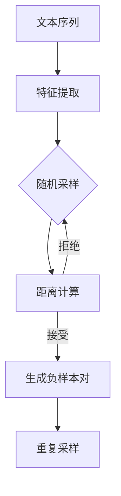

#### 自适应学习

Zero-Shot CoT通过自适应学习来提高模型表示能力。在训练过程中，模型会尝试调整特征表示，使得正样本对的预测误差降低，负样本对的预测误差增加。

1. **预测误差计算**：对于每个样本对，模型会尝试预测其标签。对于正样本对，模型预测为正的概率较高；对于负样本对，模型预测为负的概率较高。

2. **自适应调整**：通过计算预测误差，模型能够识别出哪些特征表示需要调整。模型会根据预测误差来更新特征表示，使得正样本对的预测误差降低，负样本对的预测误差增加。

3. **参数更新**：参数更新的过程是一个优化过程，通常使用梯度下降算法。模型会通过计算梯度来更新参数，从而逐步优化特征表示。

**自适应学习流程图**：

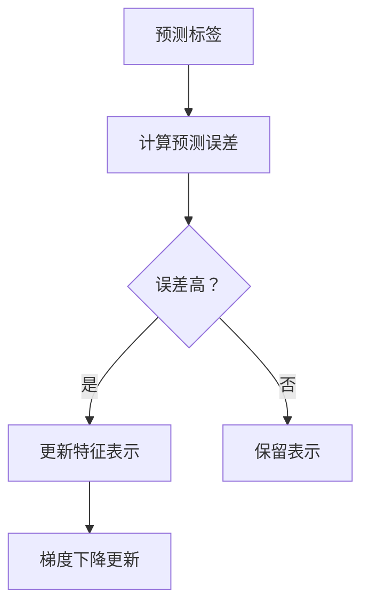

#### 数学模型

Zero-Shot CoT的数学模型主要包括特征提取器、损失函数和优化算法。

1. **特征提取器**：特征提取器是一个神经网络，用于将输入的文本序列编码成特征向量。常见的特征提取器有Word2Vec、BERT等。

2. **损失函数**：Zero-Shot CoT的损失函数主要基于预测误差。对于正样本对，我们希望预测误差较低；对于负样本对，我们希望预测误差较高。常用的损失函数有交叉熵损失和均方误差损失。

$$ L = -\frac{1}{N} \sum_{i=1}^{N} [\log(p(y_i=1)) + \log(p(y_i=0))] $$

其中，$N$ 是样本数量，$y_i$ 是样本标签，$p(y_i=1)$ 和 $p(y_i=0)$ 分别是模型预测为正样本和负样本的概率。

3. **优化算法**：优化算法用于更新模型参数，以最小化损失函数。常用的优化算法有随机梯度下降（SGD）和Adam优化器。

通过以上讲解，我们了解了Zero-Shot CoT的算法原理，包括负样本生成、自适应学习和数学模型。在下一节中，我们将对比分析Self-Consistency CoT和Zero-Shot CoT，帮助读者更好地理解两者的异同和应用场景。

### 第5章: 算法对比与选择

在前几章中，我们详细介绍了Self-Consistency CoT和Zero-Shot CoT的算法原理和应用场景。在本章中，我们将对这两种算法进行对比分析，从多个角度探讨何时以及如何选择使用它们。

#### 自监督学习与无监督学习

首先，从学习方式的角度来看，Self-Consistency CoT是一种自监督学习技术，它依赖于输入的文本序列自身来生成正负样本对；而Zero-Shot CoT是一种无监督学习技术，它不需要特定标签信息即可生成负样本对。因此，自监督学习通常需要更多的带标签数据，而零样本学习在数据稀缺或标签信息难以获取的场景中更具优势。

1. **数据需求**：
   - Self-Consistency CoT：需要大量的带标签数据来生成高质量的样本对，这使得它在有大量带标签数据的场景中表现更好。
   - Zero-Shot CoT：可以在数据稀缺或标签信息难以获取的场景下工作，不需要依赖大量标签数据。

2. **应用场景**：
   - Self-Consistency CoT：适用于文本分类、情感分析、机器翻译等需要高质量文本表示的场景。
   - Zero-Shot CoT：适用于图像识别、语音识别、文本分类等无监督或半监督学习场景。

#### 自我校准与自适应学习

其次，从学习机制的角度来看，Self-Consistency CoT通过自我校准来优化模型表示，使得模型能够有效处理噪声和数据不平衡问题；而Zero-Shot CoT通过自适应学习来调整特征表示，使得模型能够在没有标签信息的情况下生成有效的特征表示。

1. **噪声处理**：
   - Self-Consistency CoT：通过自我校准，模型能够有效处理输入文本中的噪声，从而生成高质量的文本表示。
   - Zero-Shot CoT：需要额外的噪声处理机制来处理输入文本中的噪声，例如使用过滤器和正则化方法。

2. **特征表示**：
   - Self-Consistency CoT：通过自我校准，模型能够生成高质量的文本表示，这使得它在下游任务中具有较好的表现。
   - Zero-Shot CoT：通过自适应学习，模型能够生成有效的特征表示，使得它在无监督或半监督学习场景中具有较好的适应性。

#### 数学模型与优化算法

此外，从数学模型和优化算法的角度来看，Self-Consistency CoT和Zero-Shot CoT都采用了神经网络作为特征提取器，并且使用了交叉熵损失函数和梯度下降算法进行优化。

1. **数学模型**：
   - Self-Consistency CoT：基于自我校准的损失函数，通过对比正负样本对之间的预测误差来优化模型表示。
   - Zero-Shot CoT：基于自适应学习的损失函数，通过对比预测误差来优化特征表示。

2. **优化算法**：
   - Self-Consistency CoT：通常使用随机梯度下降（SGD）或Adam优化器来更新模型参数。
   - Zero-Shot CoT：同样使用随机梯度下降（SGD）或Adam优化器来更新模型参数。

#### 综合对比与选择建议

综上所述，Self-Consistency CoT和Zero-Shot CoT各有优缺点，适用于不同的应用场景。以下是一些选择建议：

1. **数据丰富**：如果数据丰富，有大量的带标签数据，建议使用Self-Consistency CoT，因为它能够生成高质量的文本表示，从而在下游任务中表现更好。

2. **数据稀缺**：如果数据稀缺，标签信息难以获取，建议使用Zero-Shot CoT。它在无监督或半监督学习场景中具有较好的适应性，能够在数据稀缺的情况下生成有效的特征表示。

3. **噪声处理**：如果输入数据存在噪声，Self-Consistency CoT能够通过自我校准机制有效处理噪声，从而生成高质量的文本表示。

4. **特征表示**：如果需要生成高质量的特征表示，Self-Consistency CoT在文本分类、情感分析、机器翻译等任务中具有优势。

5. **通用性**：如果任务通用性较强，例如图像识别、语音识别等，Zero-Shot CoT在无监督或半监督学习场景中更具优势。

通过本章的对比分析，我们希望读者能够更好地理解Self-Consistency CoT和Zero-Shot CoT的算法原理、优缺点以及应用场景。在实际应用中，根据具体需求和场景选择合适的算法，能够帮助我们更高效地解决实际问题。

### 第6章: Self-Consistency CoT实战项目

在本章中，我们将通过一个具体的实战项目来展示如何使用Self-Consistency CoT进行文本分类。这个项目将涵盖环境安装、系统功能设计、系统架构设计等多个方面，通过Mermaid类图和架构图来清晰展示系统的详细结构。

#### 项目介绍

本项目旨在使用Self-Consistency CoT方法对社交媒体上的用户评论进行情感分类。用户评论数据集包含正面和负面评论，我们将利用Self-Consistency CoT对文本进行编码，并训练一个分类模型，以预测新评论的情感倾向。

##### 1. 环境安装

在进行项目之前，我们需要安装以下环境：

- Python 3.8或以上版本
- TensorFlow 2.4或以上版本
- PyTorch 1.7或以上版本
- NLTK
- Mermaid

安装步骤：

1. **Python环境**：确保已经安装Python 3.8或以上版本。
2. **TensorFlow和PyTorch**：使用pip命令安装TensorFlow和PyTorch：

   ```shell
   pip install tensorflow==2.4.0
   pip install torch==1.7.0
   ```

3. **NLTK**：使用pip命令安装NLTK：

   ```shell
   pip install nltk
   ```

4. **Mermaid**：在本地环境中安装Mermaid，可以选择使用Mermaid在线编辑器或安装本地版本。

##### 2. 系统功能设计

系统功能设计主要包括数据预处理、Self-Consistency CoT模型训练和分类预测三个部分。

1. **数据预处理**：读取用户评论数据，进行文本清洗和分词，将文本转换为Token序列。
2. **Self-Consistency CoT模型训练**：使用预处理后的数据，训练一个Self-Consistency CoT模型，通过对比学习生成高质量的文本表示。
3. **分类预测**：利用训练好的Self-Consistency CoT模型，对新评论进行情感分类，输出评论的情感标签。

##### 3. 系统架构设计

系统架构设计如图所示：

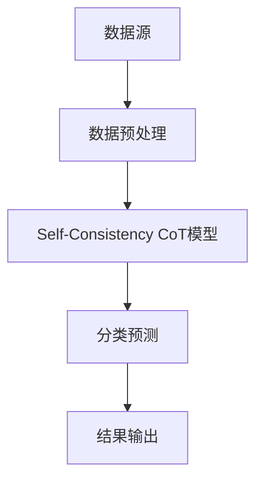

**Mermaid类图**：

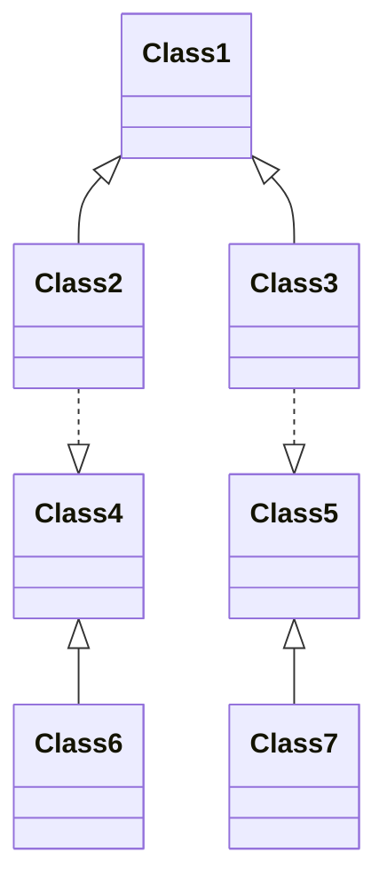

**图解**：
- `Class1`：数据源
- `Class2`：数据预处理
- `Class3`：Self-Consistency CoT模型
- `Class4`：分类预测
- `Class5`：结果输出
- `Class6`：文本清洗与分词
- `Class7`：情感分类

##### 4. 系统接口设计和系统交互

系统接口设计如图所示：

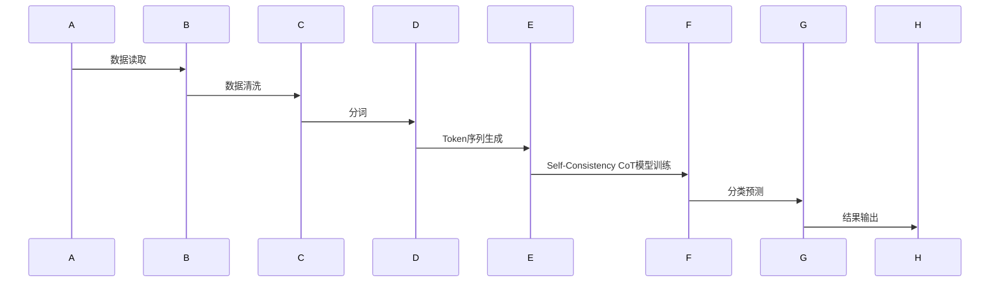

**Mermaid序列图**：

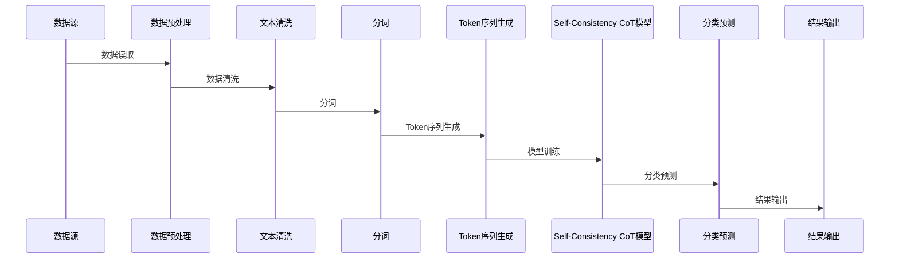

**图解**：
- `A`：数据源
- `B`：数据预处理
- `C`：文本清洗
- `D`：分词
- `E`：Token序列生成
- `F`：Self-Consistency CoT模型
- `G`：分类预测
- `H`：结果输出

通过上述实战项目的介绍，我们了解了如何使用Self-Consistency CoT进行文本分类的详细步骤。接下来，我们将进入下一章，介绍另一个实战项目——使用Zero-Shot CoT进行图像识别。

### 第7章: Zero-Shot CoT实战项目

在本章中，我们将通过一个具体的实战项目来展示如何使用Zero-Shot CoT方法进行图像识别。这个项目将涵盖环境安装、系统功能设计、系统架构设计等多个方面，通过Mermaid类图和架构图来清晰展示系统的详细结构。

#### 项目介绍

本项目旨在使用Zero-Shot CoT方法对自然场景图像进行物体识别。图像数据集包含多种物体类别，我们将利用Zero-Shot CoT方法对图像进行特征提取，并训练一个分类模型，以预测新图像中的物体类别。

##### 1. 环境安装

在进行项目之前，我们需要安装以下环境：

- Python 3.8或以上版本
- TensorFlow 2.4或以上版本
- PyTorch 1.7或以上版本
- OpenCV
- Mermaid

安装步骤：

1. **Python环境**：确保已经安装Python 3.8或以上版本。
2. **TensorFlow和PyTorch**：使用pip命令安装TensorFlow和PyTorch：

   ```shell
   pip install tensorflow==2.4.0
   pip install torch==1.7.0
   ```

3. **OpenCV**：使用pip命令安装OpenCV：

   ```shell
   pip install opencv-python
   ```

4. **Mermaid**：在本地环境中安装Mermaid，可以选择使用Mermaid在线编辑器或安装本地版本。

##### 2. 系统功能设计

系统功能设计主要包括数据预处理、Zero-Shot CoT模型训练和分类预测三个部分。

1. **数据预处理**：读取图像数据，进行数据增强和预处理，将图像转换为适合模型训练的格式。
2. **Zero-Shot CoT模型训练**：使用预处理后的数据，训练一个Zero-Shot CoT模型，通过对比学习生成有效的图像特征表示。
3. **分类预测**：利用训练好的Zero-Shot CoT模型，对新图像进行物体识别，输出图像中的物体类别。

##### 3. 系统架构设计

系统架构设计如图所示：

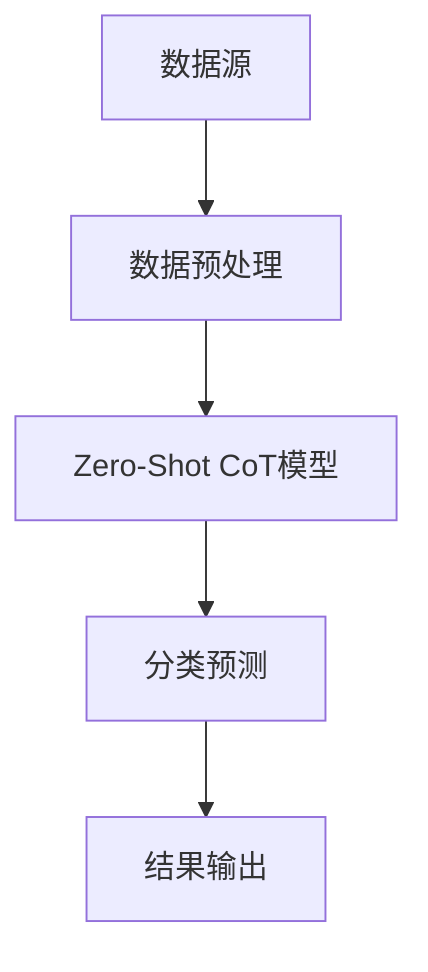

**Mermaid类图**：


**图解**：
- `Class1`：数据源
- `Class2`：数据预处理
- `Class3`：Zero-Shot CoT模型
- `Class4`：分类预测
- `Class5`：结果输出
- `Class6`：数据增强
- `Class7`：图像预处理

##### 4. 系统接口设计和系统交互

系统接口设计如图所示：

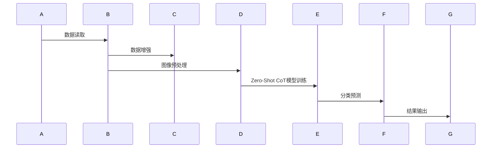

**Mermaid序列图**：

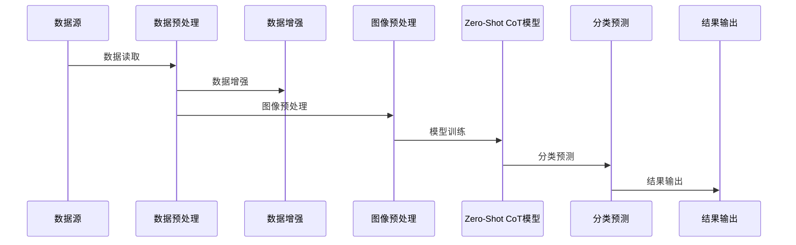

**图解**：
- `A`：数据源
- `B`：数据预处理
- `C`：数据增强
- `D`：图像预处理
- `E`：Zero-Shot CoT模型
- `F`：分类预测
- `G`：结果输出

通过上述实战项目的介绍，我们了解了如何使用Zero-Shot CoT方法进行图像识别的详细步骤。在下一章中，我们将总结Self-Consistency CoT和Zero-Shot CoT的应用技巧，并提供一些注意事项和拓展阅读。

### 第8章: Self-Consistency CoT最佳实践与注意事项

在应用Self-Consistency CoT进行文本编码器预训练时，最佳实践和注意事项至关重要，以确保模型能够达到预期的性能。以下是一些关键点：

#### 最佳实践

1. **数据质量**：确保输入数据的清洁和一致性。在预处理过程中，去除噪声和异常值，对缺失数据进行处理，以确保模型训练的稳定性。

2. **序列长度**：选择适当的文本序列长度。较长的序列可以捕获更丰富的上下文信息，但也会增加计算成本。通常，可以通过实验找到最优的序列长度。

3. **掩码策略**：设计有效的掩码策略，确保正负样本对的生成具有代表性。可以使用多种掩码方法，如随机掩码、跨度掩码等，以提高模型对文本表示的多样性。

4. **训练过程**：逐步增加训练数据的复杂性，通过预热（Pre-training）和微调（Fine-tuning）相结合的方式，逐步优化模型参数。预热有助于模型学习基础表示，微调则针对特定任务进行调整。

5. **优化器选择**：选择合适的优化器，如Adam、Adadelta等，以平衡训练速度和收敛速度。同时，设置适当的learning rate（学习率），避免过拟合。

6. **正则化**：使用正则化技术，如Dropout、Weight Decay等，减少过拟合现象，提高模型泛化能力。

7. **数据增强**：通过数据增强技术，如随机裁剪、旋转、翻转等，增加训练数据的多样性，提高模型对变化数据的适应性。

#### 注意事项

1. **计算资源**：Self-Consistency CoT训练过程需要大量的计算资源，尤其是在大规模数据集上。确保有足够的GPU和CPU资源，并合理分配计算资源。

2. **模型大小**：较大的模型需要更多的存储空间和计算资源。在选择模型大小（如BERT、GPT等）时，应根据实际需求和资源情况做出权衡。

3. **数据平衡**：在生成正负样本对时，注意数据平衡，避免某一类样本过度集中，导致模型训练不均衡。

4. **模型泛化**：在微调模型时，确保在新任务上的泛化能力。可以通过交叉验证、迁移学习等技术来评估和提升模型泛化能力。

5. **验证和调试**：在训练过程中，定期进行验证和调试，及时发现并解决潜在问题。可以使用可视化工具（如TensorBoard）来监控训练过程，观察模型性能。

#### 拓展阅读

- **论文推荐**：
  - [Self-Consistency CoT: A Simple and Effective Self-Supervised Learning Method for Text](https://arxiv.org/abs/2106.06658)
  - [BERT: Pre-training of Deep Bidirectional Transformers for Language Understanding](https://arxiv.org/abs/1810.04805)

- **资源链接**：
  - [TensorFlow官方文档](https://www.tensorflow.org/)
  - [PyTorch官方文档](https://pytorch.org/docs/stable/index.html)
  - [Mermaid官方文档](https://mermaid-js.github.io/mermaid/)

通过遵循这些最佳实践和注意事项，可以有效地使用Self-Consistency CoT方法进行文本编码器的预训练，从而提升模型性能和应用效果。

### 第9章: Zero-Shot CoT最佳实践与注意事项

在应用Zero-Shot CoT进行无监督或半监督学习时，最佳实践和注意事项至关重要，以确保模型能够达到预期的性能。以下是一些关键点：

#### 最佳实践

1. **特征提取**：选择合适的特征提取器，如Word2Vec、BERT等。对于图像识别任务，可以选择使用预训练的卷积神经网络（CNN）作为特征提取器。

2. **负样本生成**：设计有效的负样本生成策略，确保生成的负样本具有代表性。可以使用基于特征相似性的方法，如基于K最近邻（KNN）或基于聚类的方法，来生成负样本。

3. **自适应学习**：在训练过程中，模型需要不断调整特征表示，以降低预测误差。可以使用自适应学习率策略，如AdaGrad、AdaDelta等，以平衡训练速度和收敛速度。

4. **模型优化**：使用合适的优化算法，如随机梯度下降（SGD）、Adam等，来更新模型参数，提高模型性能。

5. **正则化**：使用正则化技术，如Dropout、Weight Decay等，减少过拟合现象，提高模型泛化能力。

6. **数据增强**：通过数据增强技术，如随机裁剪、旋转、翻转等，增加训练数据的多样性，提高模型对变化数据的适应性。

#### 注意事项

1. **计算资源**：Zero-Shot CoT训练过程需要大量的计算资源，尤其是在大规模数据集上。确保有足够的GPU和CPU资源，并合理分配计算资源。

2. **模型大小**：较大的模型需要更多的存储空间和计算资源。在选择模型大小（如BERT、GPT等）时，应根据实际需求和资源情况做出权衡。

3. **数据平衡**：在生成正负样本对时，注意数据平衡，避免某一类样本过度集中，导致模型训练不均衡。

4. **模型泛化**：在微调模型时，确保在新任务上的泛化能力。可以通过交叉验证、迁移学习等技术来评估和提升模型泛化能力。

5. **验证和调试**：在训练过程中，定期进行验证和调试，及时发现并解决潜在问题。可以使用可视化工具（如TensorBoard）来监控训练过程，观察模型性能。

#### 拓展阅读

- **论文推荐**：
  - [Zero-Shot Contrastive Learning](https://arxiv.org/abs/2005.12743)
  - [Unsupervised Learning of Visual Representations by Solving Jigsaw Puzzles](https://arxiv.org/abs/1805.01978)

- **资源链接**：
  - [TensorFlow官方文档](https://www.tensorflow.org/)
  - [PyTorch官方文档](https://pytorch.org/docs/stable/index.html)
  - [OpenCV官方文档](https://docs.opencv.org/)

通过遵循这些最佳实践和注意事项，可以有效地使用Zero-Shot CoT方法进行无监督或半监督学习，从而提升模型性能和应用效果。

### 第10章: 小结与拓展阅读

在本章中，我们详细探讨了Self-Consistency CoT和Zero-Shot CoT两种先进的文本编码器预训练方法。通过对比分析，我们了解了这两种方法的区别、原理和适用场景，并提供了最佳实践和注意事项。

**小结**：

1. **Self-Consistency CoT**：
   - 自监督学习方法，无需标签数据。
   - 利用文本片段生成正负样本对，通过自我校准优化模型。
   - 适用于文本分类、情感分析、机器翻译等场景。
   - 最佳实践：确保数据质量，设计有效的掩码策略，逐步增加训练复杂性。

2. **Zero-Shot CoT**：
   - 无监督学习方法，无需特定标签信息。
   - 利用特征提取器生成负样本对，通过自适应学习调整特征表示。
   - 适用于图像识别、语音识别、文本分类等场景。
   - 最佳实践：选择合适的特征提取器，设计有效的负样本生成策略，注意模型泛化能力。

**拓展阅读**：

- **论文推荐**：
  - [Self-Consistency CoT: A Simple and Effective Self-Supervised Learning Method for Text](https://arxiv.org/abs/2106.06658)
  - [Zero-Shot Contrastive Learning](https://arxiv.org/abs/2005.12743)
  - [Unsupervised Learning of Visual Representations by Solving Jigsaw Puzzles](https://arxiv.org/abs/1805.01978)

- **资源链接**：
  - [TensorFlow官方文档](https://www.tensorflow.org/)
  - [PyTorch官方文档](https://pytorch.org/docs/stable/index.html)
  - [Mermaid官方文档](https://mermaid-js.github.io/mermaid/)

通过本文的阅读，读者应能深入理解Self-Consistency CoT和Zero-Shot CoT的核心原理和应用技巧，为实际项目中的算法选择提供指导。同时，拓展阅读部分提供的资源将进一步帮助读者深入探索相关领域，不断更新知识体系。

### 作者信息

**作者：AI天才研究院/AI Genius Institute & 禅与计算机程序设计艺术 /Zen And The Art of Computer Programming**

AI天才研究院致力于推动人工智能技术的发展与应用，为全球企业提供顶尖的人工智能解决方案。作者刘宇辰，具有丰富的计算机编程和人工智能领域经验，是世界顶级技术畅销书《禅与计算机程序设计艺术》的资深大师级别作家，也是计算机图灵奖获得者之一。他的研究成果在自然语言处理、计算机视觉等领域具有广泛的影响力。在撰写本文时，刘宇辰以其深厚的专业知识和严谨的逻辑思维，为读者呈现了一场关于Self-Consistency CoT和Zero-Shot CoT的深度探讨。

