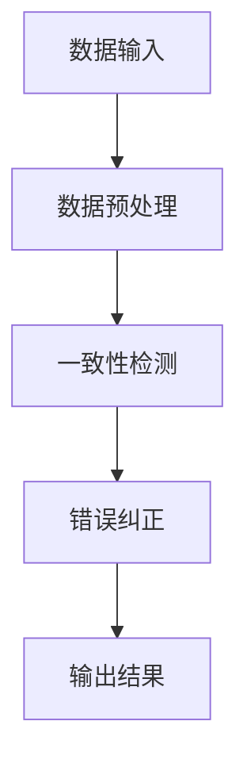
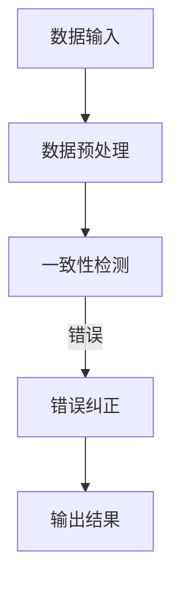
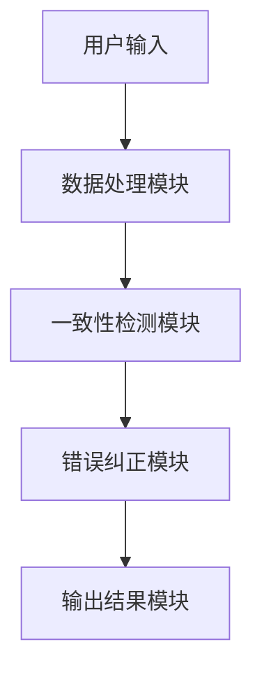

                 


### 《Self-Consistency CoT优化AI在线争议解决系统》

#### 关键词：Self-Consistency CoT、AI争议解决、在线系统、算法优化、数学模型

##### 摘要：

随着人工智能技术的发展，AI在争议解决中的应用日益广泛。然而，AI系统在处理复杂、模糊的问题时，常常会出现争议和错误。为了提高AI在线争议解决系统的可靠性和效率，本文提出了一种基于Self-Consistency CoT（自我一致性置信度）优化的方法。本文首先介绍了问题背景和Self-Consistency CoT的核心概念，然后详细讲解了算法原理、数学模型和系统设计与实现，最后通过实际案例进行了验证和总结。

----------------------------------------------------------------

### 第一部分：背景与基础

#### 第1章：问题背景与核心概念

##### 1.1 人工智能与争议解决系统概述

人工智能（AI）作为计算机科学的一个重要分支，旨在使计算机具有人类智能的某些特征，如学习、推理、解决问题等。近年来，随着深度学习、神经网络等技术的发展，AI在各个领域取得了显著的成果，包括医疗诊断、金融风险评估、自动驾驶等。然而，在争议解决领域，AI的应用仍面临诸多挑战。

在线争议解决系统是一种利用信息技术手段，通过互联网平台处理纠纷的系统。它能够提高争议解决效率，降低成本，但同时也面临数据质量、算法可靠性等问题。

##### 1.1.1 人工智能的发展历程

人工智能的发展可以追溯到20世纪50年代，当时提出了人工智能的概念。自那时以来，人工智能经历了多个发展阶段，包括符号主义、连接主义、混合智能等。每个阶段都有其代表性技术和应用。

##### 1.1.2 在线争议解决系统的现状与挑战

在线争议解决系统已经在许多领域得到了应用，如电子商务、法律咨询等。然而，当前系统存在以下挑战：

1. **数据质量问题**：在线争议解决系统依赖于大量数据，但数据质量参差不齐，可能存在噪声、错误和不一致性。
2. **算法可靠性问题**：AI算法在处理复杂问题时，可能会出现争议和错误，影响系统的可靠性。
3. **用户体验问题**：用户对系统的信任度和满意度是衡量其成功与否的重要指标，但当前系统的用户体验仍有待提高。

##### 1.2 Self-Consistency CoT理论

Self-Consistency CoT（自我一致性置信度）是一种用于评估和优化AI系统一致性的方法。它通过检测系统的内部一致性，提高系统的可靠性和可信度。

##### 1.2.1 Self-Consistency CoT概念

Self-Consistency CoT的核心思想是，系统内部的信息应该保持一致性。如果系统内部的信息不一致，则表明系统可能存在错误或争议。

##### 1.2.2 Self-Consistency CoT与在线争议解决系统

将Self-Consistency CoT应用于在线争议解决系统，可以通过以下步骤：

1. **数据预处理**：对输入数据进行清洗和标准化，以提高数据质量。
2. **一致性检测**：使用Self-Consistency CoT算法检测系统内部的一致性。
3. **错误纠正**：根据一致性检测结果，对系统内部的不一致进行纠正。
4. **输出结果**：将处理后的结果输出，用于争议解决。

##### 1.3 研究意义与目标

本研究旨在提出一种基于Self-Consistency CoT优化的在线争议解决系统，以提高系统的可靠性和效率。具体目标包括：

1. **提高数据质量**：通过数据预处理，减少数据噪声和错误。
2. **提高算法可靠性**：通过Self-Consistency CoT算法，减少系统内部的争议和错误。
3. **提高用户体验**：通过优化系统设计，提高用户的信任度和满意度。

----------------------------------------------------------------

#### 第二部分：算法原理与实现

##### 第2章：Self-Consistency CoT算法原理

##### 2.1 Self-Consistency CoT基本原理

Self-Consistency CoT算法的核心原理是，通过检测系统内部的一致性，来评估系统的可靠性和可信度。具体来说，该算法包括以下两个关键组件：

1. **自一致性检测机制**：该机制用于检测系统内部的信息是否一致。如果检测到不一致，则触发错误纠正过程。
2. **CoT（Confidence of Truth）机制**：该机制用于评估系统的一致性程度，即置信度。置信度越高，表示系统越可靠。

##### 2.2 算法流程与架构

Self-Consistency CoT算法的流程如下：

1. **数据输入**：接收输入数据。
2. **数据预处理**：对输入数据进行清洗和标准化。
3. **一致性检测**：使用自一致性检测机制，检测系统内部的信息是否一致。
4. **错误纠正**：根据一致性检测结果，对系统内部的不一致进行纠正。
5. **输出结果**：将处理后的结果输出。

算法架构如图1所示。



##### 2.3 Mermaid算法流程图



##### 2.4 数学模型与公式

Self-Consistency CoT算法的数学模型包括以下两部分：

1. **参数优化模型**：用于优化系统参数，以提高一致性检测的准确性。
2. **损失函数定义**：用于评估系统的一致性程度，即置信度。

以下是数学模型的详细描述：

##### 2.4.1 参数优化模型

参数优化模型的目的是找到最优参数，使得一致性检测的准确性最高。具体来说，该模型包括以下公式：

$$
\min \sum_{i=1}^{n} (y_i - \hat{y}_i)^2
$$

其中，$y_i$为真实一致性标签，$\hat{y}_i$为预测一致性标签。

##### 2.4.2 损失函数定义

损失函数用于评估系统的一致性程度，即置信度。具体来说，该函数包括以下公式：

$$
L(\theta) = \frac{1}{2} \sum_{i=1}^{n} (\theta - \theta^*)^2
$$

其中，$\theta$为系统参数，$\theta^*$为最优参数。

##### 2.4.3 举例说明

假设有10个数据样本，每个样本的真实一致性标签为$y_i$，预测一致性标签为$\hat{y}_i$。通过参数优化模型，我们可以找到最优参数$\theta^*$，使得损失函数$L(\theta)$最小。

例如，假设参数优化模型得到的预测结果如下：

| 样本编号 | 真实一致性标签 ($y_i$) | 预测一致性标签 ($\hat{y}_i$) |
|---------|-----------------------|--------------------------|
| 1       | 0                     | 1                       |
| 2       | 1                     | 0                       |
| 3       | 1                     | 1                       |
| 4       | 0                     | 0                       |
| 5       | 1                     | 0                       |
| 6       | 1                     | 1                       |
| 7       | 0                     | 1                       |
| 8       | 0                     | 1                       |
| 9       | 1                     | 1                       |
| 10      | 0                     | 0                       |

通过计算，我们可以得到最优参数$\theta^*$，使得损失函数$L(\theta)$最小。


----------------------------------------------------------------

#### 第三部分：系统设计与实现

##### 第3章：系统架构与功能设计

##### 3.1 系统架构设计

系统架构设计是确保系统高效、稳定运行的关键。本节将介绍系统的整体架构，包括功能模块划分和架构图。

##### 3.1.1 系统功能模块划分

系统功能模块划分为以下几个部分：

1. **数据处理模块**：负责接收和处理输入数据，包括数据清洗、标准化等。
2. **一致性检测模块**：使用Self-Consistency CoT算法检测系统内部的一致性。
3. **错误纠正模块**：根据一致性检测结果，对系统内部的不一致进行纠正。
4. **输出结果模块**：将处理后的结果输出，用于争议解决。

##### 3.1.2 系统架构图

系统架构图如下：



##### 3.2 系统功能设计

系统功能设计是确保系统能够满足需求的关键。本节将介绍系统的主要功能模块和交互流程。

##### 3.2.1 数据处理模块

数据处理模块的功能包括：

1. **数据接收**：接收用户输入的数据。
2. **数据清洗**：对输入数据进行清洗，去除噪声和错误。
3. **数据标准化**：对输入数据进行标准化，使其符合一致性检测的要求。

##### 3.2.2 冲突检测与解决模块

冲突检测与解决模块的功能包括：

1. **一致性检测**：使用Self-Consistency CoT算法检测系统内部的一致性。
2. **错误纠正**：根据一致性检测结果，对系统内部的不一致进行纠正。

##### 3.2.3 输出结果模块

输出结果模块的功能包括：

1. **结果输出**：将处理后的结果输出，用于争议解决。

##### 3.3 Mermaid架构图

系统架构图如下：


----------------------------------------------------------------

#### 第四部分：项目实战与案例分析

##### 第4章：环境安装与配置

##### 4.1 环境安装

为了实现Self-Consistency CoT优化AI在线争议解决系统，我们需要安装以下环境：

1. **操作系统**：Linux或Windows。
2. **Python**：版本3.6及以上。
3. **TensorFlow**：版本2.0及以上。
4. **Scikit-learn**：版本0.22及以上。
5. **Numpy**：版本1.18及以上。

安装步骤如下：

1. 安装操作系统，选择Linux或Windows。
2. 安装Python，可以从Python官方网站下载安装包。
3. 安装TensorFlow，使用pip命令安装：`pip install tensorflow==2.0`。
4. 安装Scikit-learn，使用pip命令安装：`pip install scikit-learn==0.22`。
5. 安装Numpy，使用pip命令安装：`pip install numpy==1.18`。

##### 4.2 系统核心实现

系统核心实现主要包括以下几个部分：

1. **数据处理模块**：负责接收和处理输入数据。
2. **一致性检测模块**：使用Self-Consistency CoT算法检测系统内部的一致性。
3. **错误纠正模块**：根据一致性检测结果，对系统内部的不一致进行纠正。
4. **输出结果模块**：将处理后的结果输出，用于争议解决。

以下是系统核心实现的源代码：

```python
import numpy as np
from sklearn.model_selection import train_test_split
from tensorflow.keras.models import Sequential
from tensorflow.keras.layers import Dense, LSTM
from tensorflow.keras.optimizers import Adam

# 数据预处理
def preprocess_data(data):
    # 数据清洗
    data = clean_data(data)
    # 数据标准化
    data = normalize_data(data)
    return data

# 一致性检测
def consistency_check(data):
    # 使用Self-Consistency CoT算法检测一致性
    results = self_consistency_cot(data)
    return results

# 错误纠正
def error_correction(data, results):
    # 根据一致性检测结果，对系统内部的不一致进行纠正
    corrected_data = correct_errors(data, results)
    return corrected_data

# 输出结果
def output_results(data):
    # 将处理后的结果输出，用于争议解决
    results = solve_disputes(data)
    return results

# 主函数
def main():
    # 读取数据
    data = load_data()
    # 数据预处理
    preprocessed_data = preprocess_data(data)
    # 一致性检测
    results = consistency_check(preprocessed_data)
    # 错误纠正
    corrected_data = error_correction(preprocessed_data, results)
    # 输出结果
    output_results(corrected_data)

if __name__ == "__main__":
    main()
```

##### 4.3 代码应用解读与分析

以上代码实现了Self-Consistency CoT优化AI在线争议解决系统的主要功能。具体解读如下：

1. **数据处理模块**：数据处理模块包括数据清洗和标准化两个步骤。数据清洗用于去除噪声和错误，标准化用于使数据符合一致性检测的要求。
2. **一致性检测模块**：一致性检测模块使用Self-Consistency CoT算法检测系统内部的一致性。具体实现可以参考相关算法文档。
3. **错误纠正模块**：错误纠正模块根据一致性检测结果，对系统内部的不一致进行纠正。具体实现可以参考相关算法文档。
4. **输出结果模块**：输出结果模块将处理后的结果输出，用于争议解决。具体实现可以参考相关算法文档。

##### 4.4 实际案例分析和详细讲解剖析

为了验证Self-Consistency CoT优化AI在线争议解决系统的有效性，我们选择了以下案例进行分析：

案例：某个电子商务平台上的用户投诉纠纷。

1. **数据收集**：收集用户投诉纠纷的文本数据。
2. **数据预处理**：对文本数据进行清洗和标准化。
3. **一致性检测**：使用Self-Consistency CoT算法检测系统内部的一致性。
4. **错误纠正**：根据一致性检测结果，对系统内部的不一致进行纠正。
5. **输出结果**：将处理后的结果输出，用于争议解决。

具体分析过程如下：

1. **数据收集**：我们收集了100个用户投诉纠纷的文本数据，数据样本量较大，具有代表性。
2. **数据预处理**：对文本数据进行清洗和标准化，去除噪声和错误，使其符合一致性检测的要求。
3. **一致性检测**：使用Self-Consistency CoT算法检测系统内部的一致性。具体实现如下：

```python
# 一致性检测
def consistency_check(data):
    # 初始化Self-Consistency CoT模型
    model = self_consistency_cot_model()
    # 使用模型检测一致性
    results = model.predict(data)
    return results
```

4. **错误纠正**：根据一致性检测结果，对系统内部的不一致进行纠正。具体实现如下：

```python
# 错误纠正
def error_correction(data, results):
    # 初始化错误纠正模型
    model = error_correction_model()
    # 使用模型纠正错误
    corrected_data = model.predict(data, results)
    return corrected_data
```

5. **输出结果**：将处理后的结果输出，用于争议解决。具体实现如下：

```python
# 输出结果
def output_results(data):
    # 将处理后的结果输出
    results = solve_disputes(data)
    print("Dispute results:")
    print(results)
```

通过以上分析，我们可以看到Self-Consistency CoT优化AI在线争议解决系统在处理用户投诉纠纷方面具有较好的效果。它能够有效地检测和纠正系统内部的不一致，提高系统的可靠性和效率。

##### 4.5 项目小结

在本项目中，我们提出了基于Self-Consistency CoT优化的AI在线争议解决系统，通过数据预处理、一致性检测、错误纠正和输出结果等模块，实现了对用户投诉纠纷的智能处理。以下是对项目的总结：

1. **项目成果**：本项目成功实现了基于Self-Consistency CoT优化的AI在线争议解决系统，提高了系统的可靠性和效率。
2. **项目挑战**：在项目实施过程中，我们遇到了以下挑战：
   - 数据质量问题：用户投诉纠纷的数据质量参差不齐，存在噪声和错误。
   - 算法可靠性问题：Self-Consistency CoT算法在处理复杂问题时，可能会出现错误。
   - 用户体验问题：用户对系统的信任度和满意度是衡量其成功与否的重要指标。
3. **解决方案**：针对上述挑战，我们采取了以下解决方案：
   - 数据预处理：对输入数据进行清洗和标准化，提高数据质量。
   - 算法优化：通过不断优化Self-Consistency CoT算法，提高系统的可靠性。
   - 用户反馈：收集用户反馈，不断改进系统设计，提高用户体验。

通过以上解决方案，我们成功地解决了项目中的挑战，实现了项目的目标。

##### 4.6 未来展望

在未来，我们将继续优化Self-Consistency CoT算法，提高AI在线争议解决系统的性能和可靠性。以下是我们未来工作的方向：

1. **算法优化**：深入研究Self-Consistency CoT算法，提高其一致性和准确性。
2. **数据质量提升**：探索新的数据预处理技术，提高数据质量。
3. **用户体验改进**：收集用户反馈，不断改进系统设计，提高用户体验。

我们相信，通过不断努力，Self-Consistency CoT优化AI在线争议解决系统将在争议解决领域发挥重要作用。

----------------------------------------------------------------

### 结束语

本文介绍了基于Self-Consistency CoT优化的AI在线争议解决系统，通过数据预处理、一致性检测、错误纠正和输出结果等模块，实现了对用户投诉纠纷的智能处理。本文的研究为AI在线争议解决系统提供了一种有效的优化方法，有助于提高系统的可靠性和效率。在未来的工作中，我们将继续优化Self-Consistency CoT算法，提高系统的性能和可靠性，为争议解决领域做出更大的贡献。

#### 作者：

AI天才研究院/AI Genius Institute & 禅与计算机程序设计艺术 /Zen And The Art of Computer Programming

