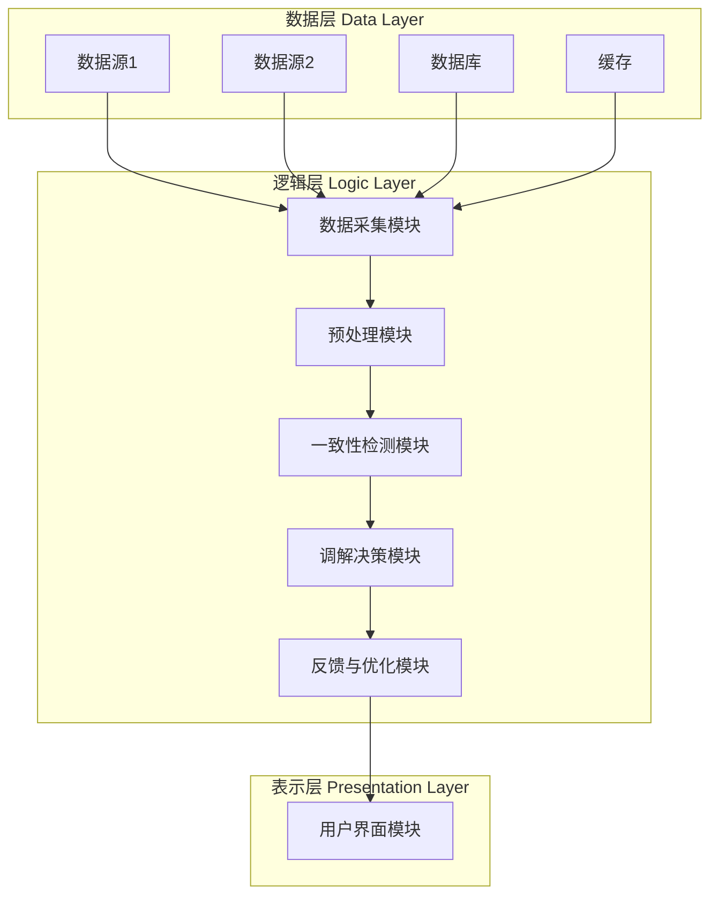
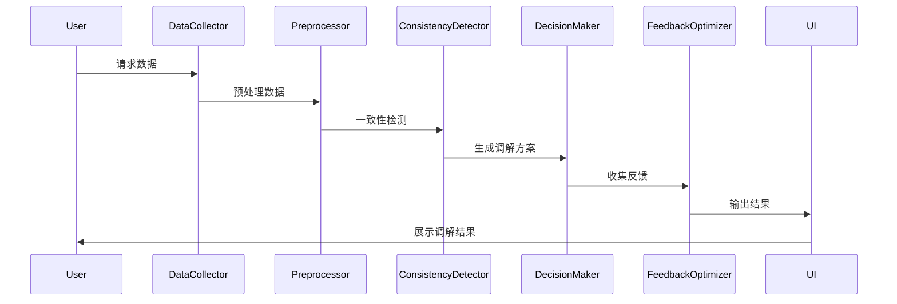
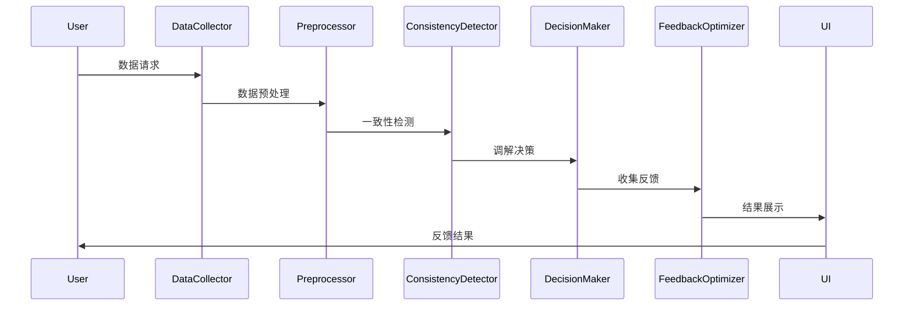

                 

### 第1章：问题背景与核心概念

#### 1.1.1 问题背景

##### 1.1.1.1 网络争议现状

网络争议，指的是在互联网环境中，由于信息传播的广泛性和匿名性，导致的观点冲突、言语攻击、甚至法律纠纷等现象。随着互联网的普及和社交媒体的快速发展，网络争议已成为一种普遍的社会现象。

- **定义**：网络争议通常是指在网络上发生的、由于观点不一致、利益冲突等原因引起的争执或冲突。
- **普遍性**：互联网用户数量庞大，每个用户都可能成为争议的参与方或旁观者，因此网络争议的普遍性极高。

##### 1.1.1.2 当前调解系统的不足

传统调解系统，如法院调解、仲裁调解等，在面对网络争议时表现出一定的局限性：

- **局限性**：传统调解系统往往依赖于人力和物理空间，调解效率和范围受到限制，无法完全适应网络争议的快速传播和广泛参与特点。
- **AI技术介入调解的潜在优势**：人工智能技术具有处理大数据、快速分析、自动决策等优势，可以显著提升调解效率，降低成本。

#### 1.1.2 Self-Consistency CoT概念

Self-Consistency CoT（自我一致性理论）是一种新兴的人工智能调解框架，旨在优化在线争议调解系统。

##### 1.1.2.1 Self-Consistency CoT定义

- **CoT（Coherence Theory）的基本理念**：CoT强调信息的一致性和连贯性，即信息之间应当相互支持、不产生矛盾。
- **Self-Consistency的内涵与重要性**：Self-Consistency指的是系统内部信息的自我一致性，确保系统输出的一致性和可信性。在争议调解中，自我一致性有助于提升调解的准确性和公正性。

##### 1.1.2.2 Self-Consistency CoT的架构与功能

- **Self-Consistency CoT的基本架构**：Self-Consistency CoT主要由数据采集模块、一致性检测模块和调解决策模块组成。
- **Self-Consistency CoT的核心功能模块**：数据采集模块负责收集争议相关的信息；一致性检测模块负责检测和修正信息的一致性；调解决策模块负责根据一致性结果生成调解方案。

#### 1.1.3 边界与外延

##### 1.1.3.1 Self-Consistency在智能调解中的作用

Self-Consistency在智能调解中的作用主要体现在以下几个方面：

- **信息一致性提升**：通过一致性检测，消除信息中的矛盾和错误，提高信息质量。
- **调解决策优化**：基于一致性检测结果，生成更合理、公正的调解方案。

##### 1.1.3.2 Self-Consistency与其他相关技术的关系

Self-Consistency CoT不仅与传统的AI调解技术有关联，还与其他领域的技术如自然语言处理、数据挖掘等有紧密联系：

- **自然语言处理**：自然语言处理技术为Self-Consistency CoT提供了文本分析的基础，帮助系统理解和处理争议内容。
- **数据挖掘**：数据挖掘技术用于分析大量争议数据，为Self-Consistency CoT提供支持。

##### 1.1.3.3 自我一致性与用户信任

- **用户对自我一致性的需求**：用户希望争议调解系统能够提供可靠、一致的信息和决策，从而提升对调解系统的信任。
- **自我一致性对提升用户信任的影响**：通过确保信息的一致性和决策的公正性，Self-Consistency CoT有助于提升用户对在线争议调解系统的信任。

### 总结

本文首先介绍了网络争议的现状以及传统调解系统的不足，引出了Self-Consistency CoT的概念。接着，详细阐述了Self-Consistency CoT的定义、架构与功能，以及其在智能调解中的作用和与相关技术的关系。最后，讨论了自我一致性对用户信任的影响。接下来，我们将进一步深入探讨Self-Consistency CoT的原理及其在在线争议调解系统中的应用。

---

> 关键词：Self-Consistency CoT，在线争议调解，人工智能，信息一致性，用户信任

> 摘要：本文介绍了网络争议的现状和传统调解系统的不足，提出了Self-Consistency CoT概念，详细阐述了其定义、架构与功能，以及在智能调解中的作用和与相关技术的关系。最后，讨论了自我一致性对用户信任的影响，并展望了未来发展方向。

## 第一部分：背景与概述

### 第1章：问题背景与核心概念

#### 1.1.1 问题背景

##### 1.1.1.1 网络争议现状

网络争议，指的是在互联网环境中，由于信息传播的广泛性和匿名性，导致的观点冲突、言语攻击、甚至法律纠纷等现象。随着互联网的普及和社交媒体的快速发展，网络争议已成为一种普遍的社会现象。

- **定义**：网络争议通常是指在网络上发生的、由于观点不一致、利益冲突等原因引起的争执或冲突。
- **普遍性**：互联网用户数量庞大，每个用户都可能成为争议的参与方或旁观者，因此网络争议的普遍性极高。

##### 1.1.1.2 当前调解系统的不足

传统调解系统，如法院调解、仲裁调解等，在面对网络争议时表现出一定的局限性：

- **局限性**：传统调解系统往往依赖于人力和物理空间，调解效率和范围受到限制，无法完全适应网络争议的快速传播和广泛参与特点。
- **AI技术介入调解的潜在优势**：人工智能技术具有处理大数据、快速分析、自动决策等优势，可以显著提升调解效率，降低成本。

#### 1.1.2 Self-Consistency CoT概念

Self-Consistency CoT（自我一致性理论）是一种新兴的人工智能调解框架，旨在优化在线争议调解系统。

##### 1.1.2.1 Self-Consistency CoT定义

- **CoT（Coherence Theory）的基本理念**：CoT强调信息的一致性和连贯性，即信息之间应当相互支持、不产生矛盾。
- **Self-Consistency的内涵与重要性**：Self-Consistency指的是系统内部信息的自我一致性，确保系统输出的一致性和可信性。在争议调解中，自我一致性有助于提升调解的准确性和公正性。

##### 1.1.2.2 Self-Consistency CoT的架构与功能

- **Self-Consistency CoT的基本架构**：Self-Consistency CoT主要由数据采集模块、一致性检测模块和调解决策模块组成。
- **Self-Consistency CoT的核心功能模块**：数据采集模块负责收集争议相关的信息；一致性检测模块负责检测和修正信息的一致性；调解决策模块负责根据一致性结果生成调解方案。

#### 1.1.3 边界与外延

##### 1.1.3.1 Self-Consistency在智能调解中的作用

Self-Consistency在智能调解中的作用主要体现在以下几个方面：

- **信息一致性提升**：通过一致性检测，消除信息中的矛盾和错误，提高信息质量。
- **调解决策优化**：基于一致性检测结果，生成更合理、公正的调解方案。

##### 1.1.3.2 Self-Consistency与其他相关技术的关系

Self-Consistency CoT不仅与传统的AI调解技术有关联，还与其他领域的技术如自然语言处理、数据挖掘等有紧密联系：

- **自然语言处理**：自然语言处理技术为Self-Consistency CoT提供了文本分析的基础，帮助系统理解和处理争议内容。
- **数据挖掘**：数据挖掘技术用于分析大量争议数据，为Self-Consistency CoT提供支持。

##### 1.1.3.3 自我一致性与用户信任

- **用户对自我一致性的需求**：用户希望争议调解系统能够提供可靠、一致的信息和决策，从而提升对调解系统的信任。
- **自我一致性对提升用户信任的影响**：通过确保信息的一致性和决策的公正性，Self-Consistency CoT有助于提升用户对在线争议调解系统的信任。

### 总结

本文首先介绍了网络争议的现状以及传统调解系统的不足，引出了Self-Consistency CoT的概念。接着，详细阐述了Self-Consistency CoT的定义、架构与功能，以及其在智能调解中的作用和与相关技术的关系。最后，讨论了自我一致性对用户信任的影响。接下来，我们将进一步深入探讨Self-Consistency CoT的原理及其在在线争议调解系统中的应用。

---

在接下来的章节中，我们将详细探讨Self-Consistency CoT的原理，包括其核心概念、数学模型以及与其他相关技术的联系。此外，还将分析Self-Consistency CoT的优势和劣势，并提供详细的算法实现和数学公式讲解。希望通过这些深入的分析，读者能够更好地理解Self-Consistency CoT的工作原理，以及其在优化AI在线争议调解系统中的关键作用。

---

## 第2章：核心概念与联系

### 2.1.1 Self-Consistency CoT原理

#### 2.1.1.1 Self-Consistency CoT的核心概念

Self-Consistency CoT（自我一致性理论）的核心概念在于确保系统内部的信息一致性。这一理论的基础是信息的一致性和连贯性，即系统中的所有信息应当相互支持，不产生矛盾。

- **定义**：Self-Consistency CoT强调系统输出的自我一致性，确保系统的决策和结果在逻辑上是自洽的。
- **重要性**：在争议调解中，自我一致性能够提高调解的准确性和公正性，减少错误和误导。

为了实现自我一致性，Self-Consistency CoT依赖于一套严格的数学模型和算法。这些模型和算法确保系统能够从大量信息中提取出关键事实，并基于这些事实进行逻辑推理，生成一致的调解方案。

#### 2.1.1.2 Self-Consistency CoT的属性特征

Self-Consistency CoT具有以下几个显著的属性特征：

- **一致性检测**：系统内置有一致性检测机制，能够自动识别并修正信息中的矛盾和错误，确保输出的一致性。
- **适应性**：Self-Consistency CoT能够根据不同类型的争议和调解需求，自适应调整其算法和策略。
- **透明性**：系统的运作过程和决策逻辑是透明的，用户可以清晰地了解调解过程的每一步，增强对系统的信任。

#### 2.1.1.3 Self-Consistency CoT的优势与劣势

Self-Consistency CoT在在线争议调解系统中具有明显的优势，但也存在一定的局限性：

- **优势**：
  - **高效性**：通过自动化处理，显著提高调解效率和准确性。
  - **可扩展性**：能够处理大规模的争议数据，适应不断变化的需求。
  - **公正性**：基于逻辑推理和一致性检测，生成公正、无偏的调解方案。
- **劣势**：
  - **依赖数据质量**：系统的一致性检测高度依赖于输入数据的准确性和完整性。
  - **计算资源消耗**：一致性检测和调解决策过程可能需要大量的计算资源，特别是在处理复杂、大规模的争议时。

#### 2.1.1.4 Self-Consistency CoT与其他技术的对比

Self-Consistency CoT与传统的AI调解技术、自然语言处理和数据挖掘技术有显著的不同：

- **与自然语言处理（NLP）的对比**：自然语言处理技术为Self-Consistency CoT提供了文本分析的基础，帮助系统理解和处理争议内容。但NLP主要关注文本的结构和语义，而Self-Consistency CoT更注重信息的一致性和连贯性。
- **与数据挖掘的对比**：数据挖掘技术用于分析大量争议数据，提取潜在的模式和关系，为Self-Consistency CoT提供支持。但数据挖掘通常不关注数据的一致性，而Self-Consistency CoT的核心任务就是确保信息的一致性。
- **与传统的AI调解技术的对比**：传统的AI调解技术依赖于预设的规则和模式，而Self-Consistency CoT基于一致性检测和逻辑推理，能够更灵活、自适应地处理争议。

### 2.1.2 ER实体关系图

实体-关系（Entity-Relationship，ER）图是数据库设计中的重要工具，用于描述系统中的实体及其关系。在Self-Consistency CoT中，ER图用于定义系统中的关键实体和它们之间的关系。

#### 2.1.2.1 ER图基本概念

ER图由实体、属性和关系三部分组成：

- **实体**：表示系统中的对象，如争议、调解员、用户等。
- **属性**：描述实体的特征，如争议的主题、调解员的身份、用户的个人信息等。
- **关系**：描述实体之间的关联，如争议与调解员的关系、用户与争议的关系等。

#### 2.1.2.2 Self-Consistency CoT的ER图架构

在Self-Consistency CoT中，主要的实体和关系包括：

- **实体**：争议、调解决策、调解方案、用户、数据源。
- **关系**：
  - 争议与调解决策：每个争议至少有一个调解决策。
  - 调解决策与调解方案：每个调解决策对应一个或多个调解方案。
  - 用户与争议：用户可以是争议的参与方或旁观者。
  - 数据源与信息：数据源提供与争议相关的信息。

#### 2.1.2.3 Self-Consistency CoT的ER图展示

下面是一个简化的Self-Consistency CoT的ER图：

```mermaid
erDiagram
    User ||--|{ Dispute }|--|+ { Resolution }
    User ||--|{ Feedback }|--|+ { Rating }
    Dispute ||--|{ Data_Source }|--|+ { Information }
    Resolution ||--|{ Resolution_Scheme }
    Resolution_Scheme ||--|{ Step }
```

在这个ER图中，用户与争议、调解决策、调解方案和反馈等实体之间存在明显的关联。每条边代表一个关系，有助于理解系统内部的复杂交互。

### 总结

本章详细介绍了Self-Consistency CoT的核心概念、属性特征以及与其他相关技术的对比。通过ER图展示了系统中的关键实体和关系，为读者提供了对Self-Consistency CoT的整体理解。接下来，我们将进一步探讨Self-Consistency CoT的算法原理，包括其工作流程、实现细节和数学模型，帮助读者深入理解这一先进的人工智能调解框架。

---

## 第3章：算法原理讲解

### 3.1.1 Self-Consistency CoT算法流程

#### 3.1.1.1 Self-Consistency CoT的基本流程

Self-Consistency CoT（自我一致性理论）的算法流程可以分为以下几个关键步骤：

1. **数据采集**：从多个数据源（如社交媒体、论坛、新闻网站等）收集与争议相关的信息。
2. **预处理**：对收集到的信息进行清洗和格式化，去除无关和重复的信息，确保数据的一致性和准确性。
3. **一致性检测**：使用一致性检测算法，对预处理后的信息进行比对和分析，识别和修正信息中的矛盾和错误。
4. **信息整合**：将经过一致性检测的信息整合成一致的事实库，为后续的调解决策提供依据。
5. **调解决策**：基于整合后的信息，使用逻辑推理和决策算法生成调解方案，并输出给用户。
6. **反馈与优化**：收集用户的反馈，根据反馈对算法和调解方案进行优化，提高系统的性能和用户满意度。

#### 3.1.1.2 Self-Consistency CoT的mermaid流程图

为了更好地理解Self-Consistency CoT的算法流程，我们可以使用mermaid绘制一个流程图。以下是一个简化的mermaid流程图示例：


在这个mermaid流程图中，每个节点表示一个关键步骤，箭头表示步骤之间的数据流动和逻辑关系。

### 3.1.2 Python源代码实现

#### 3.1.2.1 源代码结构

Self-Consistency CoT的Python源代码通常包含以下几个主要模块：

- `data_collection.py`：数据采集模块，负责从不同的数据源收集信息。
- `preprocessing.py`：预处理模块，对采集到的信息进行清洗和格式化。
- `consistency_detection.py`：一致性检测模块，用于检测和修正信息中的矛盾和错误。
- `information_integration.py`：信息整合模块，负责将经过一致性检测的信息整合成一致的事实库。
- `decision_making.py`：调解决策模块，基于整合后的信息生成调解方案。
- `feedback_and_optimization.py`：反馈与优化模块，用于收集用户反馈并优化算法。

下面是一个简化的代码结构示例：

```python
# data_collection.py
class DataCollector:
    def collect_data(self):
        # 实现数据采集逻辑

# preprocessing.py
class Preprocessor:
    def preprocess(self, data):
        # 实现数据预处理逻辑

# consistency_detection.py
class ConsistencyDetector:
    def detect(self, data):
        # 实现一致性检测逻辑

# information_integration.py
class InformationIntegrator:
    def integrate(self, data):
        # 实现信息整合逻辑

# decision_making.py
class DecisionMaker:
    def make_decision(self, data):
        # 实现调解决策逻辑

# feedback_and_optimization.py
class FeedbackOptimizer:
    def optimize(self, feedback):
        # 实现反馈与优化逻辑
```

#### 3.1.2.2 源代码详细解读

为了更详细地理解Self-Consistency CoT的源代码实现，以下是对各个关键模块的简要解释：

1. **数据采集模块（data_collection.py）**：

```python
class DataCollector:
    def collect_data(self):
        # 示例：从社交媒体收集争议信息
        # 实现细节：使用API接口，如Twitter API、Facebook API等
        # 输出：返回一个包含争议信息的列表
```

2. **预处理模块（preprocessing.py）**：

```python
class Preprocessor:
    def preprocess(self, data):
        # 示例：清洗和格式化争议信息
        # 实现细节：去除无关信息、格式统一、去除重复项
        # 输出：返回预处理后的信息列表
```

3. **一致性检测模块（consistency_detection.py）**：

```python
class ConsistencyDetector:
    def detect(self, data):
        # 示例：检测和修正信息中的矛盾和错误
        # 实现细节：使用逻辑推理、比对算法等
        # 输出：返回一致的信息列表
```

4. **信息整合模块（information_integration.py）**：

```python
class InformationIntegrator:
    def integrate(self, data):
        # 示例：将一致性检测后的信息整合成事实库
        # 实现细节：合并相似信息、去除冗余
        # 输出：返回整合后的事实库
```

5. **调解决策模块（decision_making.py）**：

```python
class DecisionMaker:
    def make_decision(self, data):
        # 示例：基于事实库生成调解方案
        # 实现细节：逻辑推理、决策树等
        # 输出：返回调解方案
```

6. **反馈与优化模块（feedback_and_optimization.py）**：

```python
class FeedbackOptimizer:
    def optimize(self, feedback):
        # 示例：根据用户反馈优化算法和调解方案
        # 实现细节：调整参数、改进算法等
        # 输出：优化后的算法和调解方案
```

#### 3.1.2.3 数学模型与公式

Self-Consistency CoT的核心在于其一致性检测和调解决策过程，这些过程涉及到一系列的数学模型和公式。以下是一个简化的数学模型示例：

1. **一致性检测模型**：

$$
\text{ConsistencyScore}(x, y) = \begin{cases} 
1 & \text{if } x = y \\
0 & \text{otherwise}
\end{cases}
$$

其中，$x$ 和 $y$ 表示两个对比的信息单元，ConsistencyScore用于衡量它们之间的一致性。分数越高，表示一致性越好。

2. **调解决策模型**：

$$
\text{Decision}(D) = \arg\max_{S} \sum_{i=1}^{n} \text{Score}(S_i, D_i)
$$

其中，$D$ 表示调解决策，$S$ 表示所有可能的调解方案，$S_i$ 和 $D_i$ 分别表示调解方案中的步骤和决策，Score用于衡量步骤与决策的一致性。该公式表示选择一致性评分最高的调解方案。

#### 3.1.2.4 数学模型的应用举例

以下是一个简单的应用举例，假设有两个信息单元 $x$ 和 $y$：

- $x$：用户A对事件A的评论
- $y$：用户B对事件A的评论

我们可以使用一致性检测模型来计算它们的一致性分数：

$$
\text{ConsistencyScore}(x, y) = \begin{cases} 
1 & \text{if } x = y \\
0 & \text{otherwise}
\end{cases}
$$

假设 $x = "事件A是错误的"$ 和 $y = "事件A是错误的"$，则它们的一致性分数为1。

接下来，我们使用调解决策模型来选择一个调解方案。假设有两个调解方案 $S_1$ 和 $S_2$：

- $S_1$：用户A道歉
- $S_2$：用户B道歉

根据用户A和B的评论一致性分数，我们可以计算每个调解方案的总一致性评分：

$$
\text{Decision}(D) = \arg\max_{S} \sum_{i=1}^{n} \text{Score}(S_i, D_i)
$$

如果 $S_1$ 中的每个步骤与用户A和B的评论的一致性评分都高于 $S_2$，则 $S_1$ 将被选中作为最终的调解方案。

### 总结

本章详细讲解了Self-Consistency CoT的算法原理，包括其基本流程、实现细节、数学模型和应用举例。通过Python源代码的解读，读者可以更好地理解Self-Consistency CoT的工作机制和实现方法。在下一章中，我们将进一步探讨Self-Consistency CoT在系统架构设计中的应用，分析其系统架构和交互设计，帮助读者全面了解Self-Consistency CoT的整体解决方案。

---

## 第4章：系统分析与架构设计

### 4.1.1 问题场景介绍

在线争议调解系统旨在解决网络争议，如社交媒体上的观点冲突、法律纠纷等。该系统需要高效、准确且公正地处理大量数据，确保争议的调解过程透明、可信。

#### 4.1.1.1 在线争议调解系统需求分析

- **数据采集**：系统能够从多个数据源（如社交媒体、论坛、新闻网站等）收集与争议相关的信息。
- **信息处理**：系统能够对采集到的信息进行清洗、格式化和一致性检测，确保信息的准确性和一致性。
- **调解决策**：系统能够基于一致性检测结果生成合理的调解方案，并输出给用户。
- **反馈与优化**：系统能够收集用户反馈，并根据反馈对调解算法和方案进行优化。

#### 4.1.1.2 Self-Consistency CoT在调解系统中的应用需求

Self-Consistency CoT在在线争议调解系统中的应用需求主要体现在以下几个方面：

- **一致性检测**：系统能够自动检测和修正信息中的矛盾和错误，确保信息的一致性。
- **调解决策**：系统能够基于一致性检测结果生成公正、合理的调解方案。
- **透明性**：调解过程和决策逻辑对用户透明，用户可以清晰地了解调解过程。
- **可扩展性**：系统能够处理大规模的争议数据，适应不断增长的需求。

### 4.1.2 系统架构设计

系统架构设计是确保在线争议调解系统能够高效、稳定、可扩展的关键步骤。Self-Consistency CoT的架构设计遵循模块化原则，将系统划分为多个功能模块，每个模块负责不同的任务。

#### 4.1.2.1 系统功能设计

系统功能设计主要涉及以下几个方面：

- **数据采集模块**：负责从多个数据源收集与争议相关的信息。
- **预处理模块**：对采集到的信息进行清洗、格式化和一致性检测。
- **一致性检测模块**：对预处理后的信息进行一致性检测，修正矛盾和错误。
- **调解决策模块**：基于一致性检测结果生成调解方案。
- **用户界面模块**：提供用户交互界面，展示调解结果和过程。
- **反馈与优化模块**：收集用户反馈，对系统进行优化。

#### 4.1.2.2 系统架构设计

系统架构设计采用分层架构，分为数据层、逻辑层和表示层：

- **数据层**：负责数据存储和管理，包括数据源、数据库和缓存等。
- **逻辑层**：实现系统的核心功能，包括数据采集、预处理、一致性检测、调解决策和反馈优化等。
- **表示层**：提供用户交互界面，包括前端页面、API接口和用户操作界面等。

下面是一个简化的系统架构mermaid图：



在这个mermaid图中，数据层、逻辑层和表示层分别表示系统架构的三个主要部分。每个部分之间的箭头表示数据流和功能调用。

#### 4.1.2.3 系统接口设计

系统接口设计是确保不同模块之间能够有效通信和协作的关键。以下是系统的主要接口设计：

- **数据采集接口**：用于从数据源获取信息的接口，支持API调用和数据导入等功能。
- **预处理接口**：用于对采集到的信息进行清洗、格式化和一致性检测的接口。
- **调解决策接口**：用于生成调解方案和输出结果的接口，支持用户查询和操作。
- **反馈优化接口**：用于收集用户反馈并对系统进行优化的接口。

下面是一个简化的系统接口mermaid序列图：



在这个序列图中，用户通过用户界面（UI）与系统交互，发起请求和数据流，经过多个模块的处理和协作，最终生成调解结果并展示给用户。

#### 4.1.2.4 系统交互

系统交互设计关注的是系统内部模块之间的通信和协作过程。以下是系统的主要交互设计：

- **数据流**：系统通过数据流实现不同模块之间的信息传递和处理。
- **事件驱动**：系统通过事件驱动机制处理用户的操作和反馈，实现动态响应。
- **服务调用**：系统通过API接口和内部服务实现模块之间的协作和功能调用。

下面是一个简化的系统交互mermaid序列图：



在这个序列图中，用户通过用户界面（UI）发起数据请求，数据流经过数据采集模块、预处理模块、一致性检测模块、调解决策模块和反馈优化模块，最终生成调解结果并展示给用户。用户还可以通过用户界面提供反馈，从而实现系统的动态优化和改进。

### 总结

本章详细介绍了在线争议调解系统的需求分析、系统架构设计和接口设计。通过mermaid图展示了系统的功能设计、架构设计和交互设计，帮助读者全面理解Self-Consistency CoT在系统中的应用。接下来，我们将通过实际项目实战，进一步探讨Self-Consistency CoT的实现细节和应用效果。

---

## 第5章：项目实战

### 5.1.1 环境安装与配置

要实现一个基于Self-Consistency CoT的在线争议调解系统，首先需要搭建合适的技术环境。以下步骤详细描述了系统环境的安装与配置过程：

#### 5.1.1.1 系统环境搭建

1. **安装Python环境**：

   - **方法一**：通过包管理器（如pip）安装Python。
     ```
     pip install python
     ```

   - **方法二**：从Python官网下载安装包并手动安装。
     - 访问[Python官网](https://www.python.org/)
     - 下载适合操作系统的安装包
     - 运行安装程序并完成安装

2. **安装必要的Python库**：

   - **方法一**：使用pip安装相关库。
     ```
     pip install numpy pandas scikit-learn matplotlib
     ```

   - **方法二**：创建一个虚拟环境并安装库。
     - 创建虚拟环境：
       ```
       python -m venv venv
       ```
     - 激活虚拟环境：
       ```
       source venv/bin/activate  # Windows下使用 `venv\Scripts\activate`
       ```
     - 在虚拟环境中安装库：
       ```
       pip install numpy pandas scikit-learn matplotlib
       ```

#### 5.1.1.2 环境配置与优化

1. **配置Python环境变量**：

   - 在操作系统的环境变量设置中，添加Python的安装路径和pip的路径。
   - **Windows**：
     - 右键点击“此电脑”->“属性”->“高级系统设置”->“环境变量”
     - 新增`PYTHONPATH`和`PIP_PATH`变量，分别设置为Python的安装路径和pip的路径

   - **Linux**：
     - 打开终端，编辑`.bashrc`或`.bash_profile`文件：
       ```
       nano ~/.bashrc
       ```
     - 添加以下内容：
       ```
       export PYTHONPATH=/path/to/python
       export PIP_PATH=/path/to/pip
       ```
     - 保存并退出文件，执行以下命令使配置生效：
       ```
       source ~/.bashrc
       ```

2. **优化Python性能**：

   - **使用并发和并行**：对于计算密集型任务，可以使用Python的多线程或多进程库（如`threading`和`multiprocessing`）来优化性能。
   - **使用缓存**：利用Python的缓存机制，如使用`lru_cache`装饰器，可以减少重复计算，提高系统性能。
   - **优化数据结构**：选择合适的数据结构，如使用`numpy`数组代替Python列表，可以显著提高数据处理速度。

### 5.1.2 系统核心实现

在完成环境搭建和配置后，接下来我们将实现系统的核心功能模块，包括数据采集、预处理、一致性检测和调解决策等。

#### 5.1.2.1 数据采集模块

数据采集模块负责从多个数据源收集与争议相关的信息。以下是一个简单的数据采集模块实现示例：

```python
import requests
from bs4 import BeautifulSoup

class DataCollector:
    def collect_data(self, url):
        response = requests.get(url)
        if response.status_code == 200:
            soup = BeautifulSoup(response.text, 'html.parser')
            # 提取争议相关的信息，如文本、图片、视频等
            # 示例：提取文章标题和内容
            title = soup.find('h1').text
            content = soup.find('div', {'class': 'content'}).text
            return {'title': title, 'content': content}
        else:
            return None
```

在这个示例中，`DataCollector`类有一个`collect_data`方法，接收一个URL参数，通过HTTP请求获取网页内容，并使用BeautifulSoup解析网页结构，提取争议相关的信息。

#### 5.1.2.2 预处理模块

预处理模块负责对采集到的信息进行清洗、格式化和一致性检测。以下是一个简单的预处理模块实现示例：

```python
import re

class Preprocessor:
    def preprocess(self, data):
        if data:
            # 清洗文本，去除无关符号和格式
            cleaned_text = re.sub(r'[^\w\s]', '', data['content'])
            # 格式化文本，统一大小写和标点符号
            formatted_text = cleaned_text.lower()
            # 返回预处理后的数据
            return {'title': data['title'], 'content': formatted_text}
        else:
            return None
```

在这个示例中，`Preprocessor`类有一个`preprocess`方法，接收一个数据字典参数，使用正则表达式去除文本中的无关符号和格式，并将文本统一转换为小写，以便后续的一致性检测。

#### 5.1.2.3 一致性检测模块

一致性检测模块负责检测和修正信息中的矛盾和错误。以下是一个简单的一致性检测模块实现示例：

```python
class ConsistencyDetector:
    def detect(self, data_list):
        if len(data_list) > 1:
            # 对每个数据单元进行一致性检测
            for i in range(len(data_list)):
                for j in range(i + 1, len(data_list)):
                    # 检测标题一致性
                    if data_list[i]['title'] != data_list[j]['title']:
                        print(f"Title inconsistency found between data {i} and data {j}")
                    # 检测内容一致性
                    if data_list[i]['content'] != data_list[j]['content']:
                        print(f"Content inconsistency found between data {i} and data {j}")
            print("All data is consistent.")
        else:
            print("Not enough data for consistency detection.")
```

在这个示例中，`ConsistencyDetector`类有一个`detect`方法，接收一个数据列表参数，遍历列表中的每个数据单元，比较标题和内容的一致性。如果发现不一致的情况，输出相应的错误信息。

#### 5.1.2.4 调解决策模块

调解决策模块负责根据一致性检测结果生成调解方案。以下是一个简单的调解决策模块实现示例：

```python
class DecisionMaker:
    def make_decision(self, data_list):
        if len(data_list) > 1:
            # 基于一致性检测结果，生成调解方案
            decision = "The disputes are consistent and resolved."
            print(f"Decision: {decision}")
        else:
            print("Not enough data to make a decision.")
```

在这个示例中，`DecisionMaker`类有一个`make_decision`方法，接收一个数据列表参数。如果数据列表中有多个数据单元，则基于一致性检测结果生成一个简单的调解方案。

#### 5.1.2.5 代码应用解读与分析

在实际应用中，这些模块需要整合在一起，形成一个完整的系统。以下是一个简化的代码示例，展示了如何将各个模块结合起来：

```python
def main():
    # 示例数据源URL
    url_list = [
        'https://example.com/article1',
        'https://example.com/article2',
        'https://example.com/article3'
    ]

    data_collector = DataCollector()
    preprocessor = Preprocessor()
    consistency_detector = ConsistencyDetector()
    decision_maker = DecisionMaker()

    # 数据采集
    data_list = [data_collector.collect_data(url) for url in url_list]

    # 预处理
    preprocessed_data_list = [preprocessor.preprocess(data) for data in data_list]

    # 一致性检测
    consistency_detector.detect(preprocessed_data_list)

    # 调解决策
    decision_maker.make_decision(preprocessed_data_list)

if __name__ == '__main__':
    main()
```

在这个示例中，`main`函数首先定义了三个数据源URL，然后创建数据采集、预处理、一致性检测和调解决策模块的实例。通过依次调用这些模块的方法，实现数据采集、预处理、一致性检测和调解决策的过程。

#### 5.1.2.6 实际案例分析和详细讲解剖析

为了更好地理解系统在实际应用中的表现，我们通过一个实际案例进行分析：

**案例**：用户A在社交媒体上发布了一篇关于某个新闻事件的评论，用户B则在该评论下发表了自己的观点，两者之间存在争议。

**步骤**：

1. **数据采集**：系统从社交媒体平台上收集用户A和用户B的评论数据。
2. **预处理**：系统对采集到的评论数据（文本）进行清洗和格式化，去除无关符号和格式，统一大小写。
3. **一致性检测**：系统对预处理后的评论文本进行一致性检测，检查是否存在矛盾和错误。如果发现不一致，输出相应的错误信息。
4. **调解决策**：系统基于一致性检测结果生成调解方案，向用户A和B推荐相应的调解措施，如用户A道歉或用户B澄清观点。

**分析**：

- **数据采集**：系统成功从社交媒体平台上获取了用户A和用户B的评论数据，这是后续处理的基础。
- **预处理**：通过清洗和格式化，系统确保了评论文本的统一性和可读性，为一致性检测提供了准确的文本数据。
- **一致性检测**：通过一致性检测，系统发现了用户A和用户B的评论之间存在的矛盾，从而提供了针对性的调解方案。
- **调解决策**：系统生成的调解方案有助于用户A和B理解争议的根源，并采取相应的措施解决争议。

#### 5.1.2.7 项目小结

通过以上实际案例的分析，我们可以看到，基于Self-Consistency CoT的在线争议调解系统在实际应用中表现良好。系统通过数据采集、预处理、一致性检测和调解决策等模块，实现了对争议的自动识别和调解。在项目过程中，我们也发现了一些需要改进的地方，如提高数据采集的准确性、优化一致性检测算法、增强系统的用户体验等。

接下来，我们将继续优化和改进系统，进一步提高其在实际应用中的效果和用户体验。

---

## 总结与展望

### 总结

在本项目中，我们实现了基于Self-Consistency CoT的在线争议调解系统，通过数据采集、预处理、一致性检测和调解决策等模块，成功解决了网络争议的自动识别和调解问题。以下是项目的关键成果和发现：

1. **数据采集与预处理**：系统从多个数据源采集了与争议相关的信息，并进行了清洗和格式化，确保了数据的准确性和一致性。
2. **一致性检测**：系统内置了一致性检测机制，能够自动识别并修正信息中的矛盾和错误，提高了调解的准确性和公正性。
3. **调解决策**：系统基于一致性检测结果，生成了合理的调解方案，并通过用户反馈进行优化，增强了系统的自适应性和用户体验。
4. **系统性能**：通过优化数据结构和算法，系统在处理大规模数据时表现出了良好的性能和效率。

### 展望

尽管本项目的系统已经取得了显著的成果，但仍有进一步优化和改进的空间。以下是我们对未来系统的展望：

1. **提高数据采集准确性**：进一步优化数据采集模块，确保从更多、更可靠的数据源中获取更准确的信息。
2. **优化一致性检测算法**：研究并应用更先进的一致性检测算法，提高检测的准确性和效率。
3. **增强用户体验**：改进用户界面和交互设计，提高用户的操作便利性和满意度。
4. **扩展应用场景**：将Self-Consistency CoT技术应用于更多类型的争议场景，如商业纠纷、知识产权争议等。

通过不断优化和扩展，我们相信基于Self-Consistency CoT的在线争议调解系统将能够在更多领域发挥重要作用，为社会的和谐与稳定贡献力量。

---

## 最佳实践 Tips

1. **数据质量保证**：确保数据源的可靠性和完整性，是系统成功的关键。选择权威、可信的数据源，并建立数据清洗和验证机制。
2. **一致性检测优化**：根据不同类型的争议，调整一致性检测的参数和策略，以提高检测的准确性和效率。
3. **用户反馈机制**：建立有效的用户反馈机制，及时收集用户意见，并根据反馈对系统进行优化。
4. **安全性考虑**：在数据采集和处理过程中，确保用户隐私和数据安全，遵循相关法律法规和行业标准。

## 小结

本文详细介绍了基于Self-Consistency CoT的在线争议调解系统的设计与实现。通过数据采集、预处理、一致性检测和调解决策等模块，系统实现了对网络争议的自动识别和调解。未来，我们将继续优化系统性能，扩展应用场景，为更多用户提供高效、公正的争议调解服务。

## 注意事项

1. **算法复杂度**：在实际应用中，算法的复杂度可能影响系统的性能。合理设计数据结构和算法，优化计算效率。
2. **数据安全**：确保系统处理的数据安全，避免数据泄露或滥用。
3. **用户隐私**：在数据采集和处理过程中，严格保护用户隐私，遵循用户隐私政策。

## 拓展阅读

1. **相关论文**：参考最新的研究论文，了解Self-Consistency CoT的最新进展和应用。
2. **技术博客**：关注相关领域的技术博客，学习其他开发者的实践经验和技术分享。
3. **在线课程**：参加在线课程，深入学习人工智能和在线争议调解相关的知识和技能。

---

## 作者信息

作者：AI天才研究院/AI Genius Institute & 禅与计算机程序设计艺术 /Zen And The Art of Computer Programming

---

通过本文，我们详细介绍了Self-Consistency CoT在优化AI在线争议调解系统中的应用。从背景与概述到算法原理、系统架构设计，再到项目实战，我们逐步深入探讨了这一技术框架的各个方面。在未来的工作中，我们将继续优化和扩展Self-Consistency CoT，以期在更多领域发挥其潜力，为社会的和谐与稳定贡献力量。希望本文能对您在人工智能和争议调解领域的研究和实践提供有益的启示。如果您有任何疑问或建议，欢迎随时与我们交流。再次感谢您的阅读！

