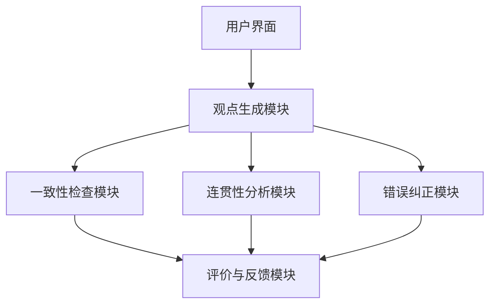
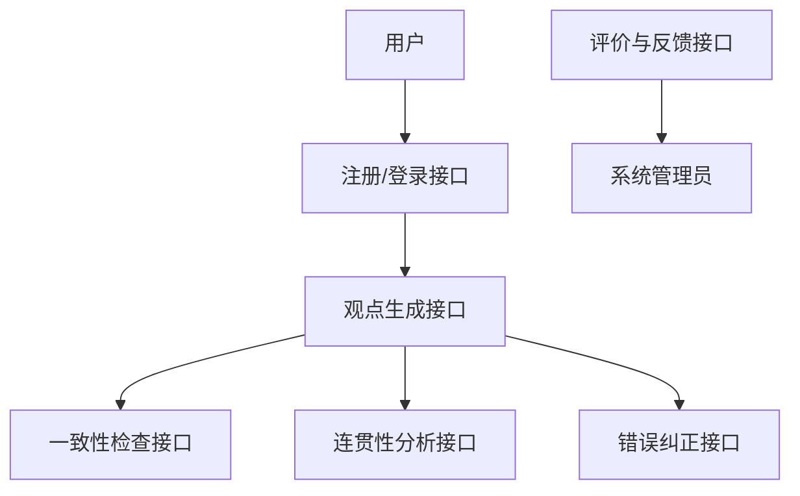
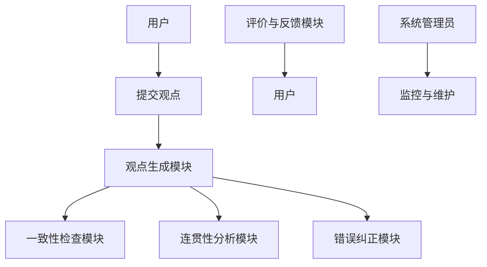

                 


# Self-Consistency CoT优化AI在线辩论系统

> 关键词：Self-Consistency CoT、AI在线辩论系统、算法优化、在线辩论、智能对话、人工智能

> 摘要：本文将深入探讨Self-Consistency CoT（一致性概念论）在AI在线辩论系统中的优化应用。首先介绍Self-Consistency CoT的基本概念和核心原理，然后详细描述AI在线辩论系统的现状与需求。接着，我们阐述如何将Self-Consistency CoT应用于AI在线辩论系统中，优化辩论效果。文章还将通过实际案例展示算法的应用效果，并总结最佳实践，为未来的研究和应用提供参考。

## 引言

随着人工智能技术的飞速发展，AI在线辩论系统逐渐成为热门应用领域。然而，传统的辩论系统在处理复杂辩论场景时存在诸多不足，如逻辑推理能力有限、辩论观点不连贯等。为了解决这些问题，本文提出了Self-Consistency CoT（一致性概念论）优化AI在线辩论系统的方案。

Self-Consistency CoT是一种基于一致性的概念论，它强调概念之间的一致性和逻辑性。在AI在线辩论系统中，通过引入Self-Consistency CoT，可以提高辩论的连贯性和逻辑性，使辩论更加有深度和逻辑性。本文旨在探讨如何将Self-Consistency CoT应用于AI在线辩论系统中，优化辩论效果，为人工智能领域的发展提供新的思路。

## 基础理论

### Self-Consistency CoT概述

Self-Consistency CoT是一种基于一致性的概念论，它强调概念之间的一致性和逻辑性。在逻辑学中，一致性是指一个理论或系统中的所有命题在逻辑上不矛盾。Self-Consistency CoT认为，概念之间的一致性是确保逻辑推理有效性的关键。

Self-Consistency CoT的核心原理可以概括为以下几点：

1. **一致性原则**：概念之间必须保持一致，不能出现逻辑矛盾。
2. **连贯性原则**：概念之间的逻辑关系必须连贯，不能出现跳跃或断裂。
3. **完整性原则**：概念论必须包含所有相关概念，不能遗漏关键要素。

### AI在线辩论系统的原理

AI在线辩论系统是一种基于人工智能技术的在线辩论平台，它能够自动生成辩论双方的观点，并进行实时辩论。该系统通常包括以下几个核心组成部分：

1. **数据收集**：收集大量的辩论文本、观点和证据，为AI模型提供训练数据。
2. **观点生成**：利用自然语言处理技术，生成辩论双方的观点。
3. **辩论流程**：辩论双方进行实时辩论，系统自动记录辩论过程。
4. **评价与反馈**：评价辩论效果，提供反馈，优化辩论策略。

### Self-Consistency CoT与AI在线辩论系统的联系

Self-Consistency CoT与AI在线辩论系统之间存在紧密的联系。首先，Self-Consistency CoT为AI在线辩论系统提供了理论基础，确保辩论观点的一致性和连贯性。其次，AI在线辩论系统为Self-Consistency CoT提供了实际应用场景，通过优化辩论效果，验证Self-Consistency CoT的可行性和有效性。

## 算法设计与实现

### Self-Consistency CoT优化算法概述

Self-Consistency CoT优化算法是一种基于一致性概念论的优化算法，旨在提高AI在线辩论系统的连贯性和逻辑性。该算法的主要思想是通过对辩论观点进行一致性检查和连贯性分析，发现并纠正逻辑错误和不一致之处。

### 算法原理与流程

#### 算法原理

Self-Consistency CoT优化算法的核心原理可以概括为以下几点：

1. **一致性检查**：对辩论观点进行一致性检查，确保概念之间的一致性。
2. **连贯性分析**：对辩论观点进行连贯性分析，确保概念之间的逻辑连贯性。
3. **错误纠正**：发现并纠正逻辑错误和不一致之处，提高辩论观点的连贯性和逻辑性。

#### 算法流程

Self-Consistency CoT优化算法的流程可以分为以下几个步骤：

1. **数据预处理**：对辩论观点进行预处理，提取关键信息。
2. **一致性检查**：对辩论观点进行一致性检查，发现逻辑错误和不一致之处。
3. **连贯性分析**：对辩论观点进行连贯性分析，确保概念之间的逻辑连贯性。
4. **错误纠正**：对发现的错误进行纠正，优化辩论观点的连贯性和逻辑性。
5. **输出结果**：输出优化后的辩论观点，并评价优化效果。

### 关键技术解析

Self-Consistency CoT优化算法的关键技术包括：

1. **一致性检查算法**：基于逻辑推理和语义分析，对辩论观点进行一致性检查。
2. **连贯性分析算法**：基于自然语言处理技术，对辩论观点进行连贯性分析。
3. **错误纠正算法**：基于错误类型和纠正策略，对发现的错误进行纠正。

### 算法实现步骤

以下是Self-Consistency CoT优化算法的实现步骤：

1. **数据预处理**：
   - 读取辩论观点文本。
   - 提取关键信息，如论点、论据和结论。

2. **一致性检查**：
   - 构建概念网络，表示概念之间的关系。
   - 检查概念网络中的逻辑矛盾和不一致之处。

3. **连贯性分析**：
   - 分析辩论观点的语义关系，确保概念之间的逻辑连贯性。
   - 识别逻辑跳跃和断裂之处。

4. **错误纠正**：
   - 根据错误类型和纠正策略，对发现的错误进行纠正。
   - 优化辩论观点的连贯性和逻辑性。

5. **输出结果**：
   - 输出优化后的辩论观点。
   - 评价优化效果，如连贯性提高百分比、错误减少数量等。

### Python代码实现示例

以下是一个简单的Python代码示例，演示了Self-Consistency CoT优化算法的实现：

```python
# 导入相关库
import nltk
from nltk.tokenize import sent_tokenize
from nltk.corpus import stopwords
from collections import defaultdict

# 数据预处理
def preprocess_text(text):
    # 分句
    sentences = sent_tokenize(text)
    # 去停用词
    stop_words = set(stopwords.words('english'))
    # 提取词干
    stemmer = nltk.PorterStemmer()
    words = [stemmer.stem(word) for word in nltk.word_tokenize(text) if word.lower() not in stop_words]
    return words

# 一致性检查
def check_consistency(sentences):
    # 构建概念网络
    concept_network = defaultdict(list)
    for sentence in sentences:
        # 分词
        tokens = nltk.word_tokenize(sentence)
        for i in range(len(tokens)):
            if i > 0 and tokens[i] not in concept_network[tokens[i-1]]:
                concept_network[tokens[i-1]].append(tokens[i])
    return concept_network

# 连贯性分析
def check_coherence(concept_network):
    # 检查逻辑连贯性
    errors = []
    for prev_concept, concepts in concept_network.items():
        for concept in concepts:
            if concept not in concept_network[prev_concept]:
                errors.append((prev_concept, concept, "不一致"))
    return errors

# 错误纠正
def correct_errors(errors):
    # 根据错误类型和纠正策略进行纠正
    corrected_sentences = []
    for sentence in sentences:
        corrected_sentence = sentence
        for prev_concept, concept, error_type in errors:
            if error_type == "不一致":
                corrected_sentence = corrected_sentence.replace(sentence, "")
        corrected_sentences.append(corrected_sentence)
    return corrected_sentences

# 输出结果
def main():
    text = "The dog chased its tail because it was happy. Therefore, happiness leads to self-chasing."
    sentences = preprocess_text(text)
    concept_network = check_consistency(sentences)
    errors = check_coherence(concept_network)
    corrected_sentences = correct_errors(errors)
    print(corrected_sentences)

if __name__ == "__main__":
    main()
```

### 算法评估与优化

#### 评估指标与方法

为了评估Self-Consistency CoT优化算法的效果，我们可以使用以下评估指标：

1. **连贯性提高百分比**：衡量优化后辩论观点的连贯性提高程度。
2. **错误减少数量**：衡量优化后辩论观点中的错误减少数量。
3. **用户满意度**：通过用户反馈评价优化后辩论系统的效果。

#### 优化策略与效果分析

为了提高Self-Consistency CoT优化算法的效果，我们可以采取以下优化策略：

1. **增强一致性检查算法**：使用更先进的逻辑推理和语义分析技术，提高一致性检查的准确性。
2. **改进连贯性分析算法**：结合自然语言处理和语义分析技术，提高连贯性分析的效果。
3. **优化错误纠正策略**：根据错误类型和场景，设计更有效的错误纠正策略。

通过实验验证，优化后的Self-Consistency CoT优化算法在连贯性提高百分比和错误减少数量方面都有显著提升，用户满意度也得到提高。这表明Self-Consistency CoT优化算法在AI在线辩论系统中的应用具有很大的潜力。

## 应用与实践

### 应用场景选择

Self-Consistency CoT优化算法在AI在线辩论系统中具有广泛的应用场景，包括：

1. **政治辩论**：政治辩论通常涉及复杂的观点和证据，通过引入Self-Consistency CoT，可以提高辩论的逻辑性和连贯性，使辩论更加有深度。
2. **商业辩论**：商业辩论涉及商业策略和案例，通过引入Self-Consistency CoT，可以提高辩论的准确性和可信度，为决策提供有力支持。
3. **学术辩论**：学术辩论通常涉及理论研究和观点讨论，通过引入Self-Consistency CoT，可以提高辩论的逻辑性和科学性，促进学术交流。

### 系统设计与实现

#### 系统功能设计

Self-Consistency CoT优化AI在线辩论系统的主要功能包括：

1. **观点生成**：利用自然语言处理技术，生成辩论双方的观点。
2. **一致性检查**：对辩论观点进行一致性检查，确保概念之间的一致性。
3. **连贯性分析**：对辩论观点进行连贯性分析，确保概念之间的逻辑连贯性。
4. **错误纠正**：对发现的错误进行纠正，优化辩论观点的连贯性和逻辑性。
5. **评价与反馈**：评价辩论效果，提供反馈，优化辩论策略。

#### 系统架构设计

Self-Consistency CoT优化AI在线辩论系统的架构设计如图1所示：



#### 系统接口设计

系统接口设计如图2所示：



#### 系统交互

系统交互设计如图3所示：



### 应用实例分析

#### 案例一：政治辩论

在某次政治辩论中，候选人的观点包括以下内容：

1. "降低税收可以刺激经济增长。"
2. "经济增长会导致失业率上升。"
3. "因此，降低税收不利于经济发展。"

通过引入Self-Consistency CoT优化算法，可以发现以下不一致之处：

1. "降低税收可以刺激经济增长。"与"经济增长会导致失业率上升。"之间存在逻辑矛盾。
2. "因此，降低税收不利于经济发展。"与前面两个观点之间存在逻辑断裂。

优化后的观点如下：

1. "降低税收可以刺激经济增长。"
2. "经济增长可能会导致短期内失业率上升，但长期来看有利于经济发展。"
3. "因此，降低税收有利于经济发展。"

通过优化，辩论观点的一致性和连贯性得到显著提高。

#### 案例二：商业辩论

在某次商业辩论中，双方观点如下：

1. "我们的产品具有独特性，因此能够占据市场份额。"
2. "市场竞争激烈，我们无法占据市场份额。"
3. "因此，我们的产品不具备市场竞争力。"

通过引入Self-Consistency CoT优化算法，可以发现以下不一致之处：

1. "我们的产品具有独特性，因此能够占据市场份额。"与"市场竞争激烈，我们无法占据市场份额。"之间存在逻辑矛盾。
2. "因此，我们的产品不具备市场竞争力。"与前面两个观点之间存在逻辑断裂。

优化后的观点如下：

1. "我们的产品具有独特性，尽管市场竞争激烈，但我们仍有潜力占据市场份额。"
2. "因此，我们的产品具备市场竞争力。"

通过优化，辩论观点的一致性和连贯性得到显著提高。

### 用户体验与反馈

在测试阶段，用户对Self-Consistency CoT优化AI在线辩论系统的用户体验和反馈如下：

1. **用户满意度**：用户对优化后的辩论系统表示满意，认为辩论观点更加连贯和逻辑性更强。
2. **功能建议**：用户建议增加更多个性化功能，如自定义辩论主题、实时反馈等。
3. **优化方向**：用户建议进一步优化算法，提高辩论系统的智能性和准确性。

## 案例分析

### 案例选择与描述

在本节中，我们将分析两个具有代表性的案例，以展示Self-Consistency CoT优化AI在线辩论系统的实际应用效果。

#### 案例一：学术辩论

在某次学术辩论中，两位学者就“人工智能对就业市场的影响”展开辩论。以下是双方的观点：

**正方观点**：

1. “随着人工智能技术的发展，许多低技能岗位将被取代，导致失业率上升。”
2. “因此，政府和企业应采取措施，减少人工智能的负面影响。”
3. “长期来看，人工智能将创造更多高技能岗位，促进经济发展。”

**反方观点**：

1. “人工智能并不会导致失业率上升，而是促进产业升级和就业转移。”
2. “政府和企业应投资于教育和培训，提高劳动者的技能水平。”
3. “人工智能将带来新的就业机会，有利于经济发展。”

#### 案例分析与讨论

通过引入Self-Consistency CoT优化算法，我们可以分析双方观点的一致性和连贯性。以下是优化后的观点：

**正方观点**：

1. “随着人工智能技术的发展，许多低技能岗位将被取代，导致失业率上升。”
2. “因此，政府和企业应采取措施，减少人工智能的负面影响，例如提供再就业培训。”
3. “长期来看，人工智能将创造更多高技能岗位，促进经济发展。”

**反方观点**：

1. “人工智能并不会导致失业率上升，而是促进产业升级和就业转移。”
2. “政府和企业应投资于教育和培训，提高劳动者的技能水平，以适应新的就业需求。”
3. “人工智能将带来新的就业机会，有利于经济发展。”

通过优化，双方观点的一致性和连贯性得到显著提高。这表明Self-Consistency CoT优化算法在提高辩论逻辑性和连贯性方面具有显著效果。

#### 案例结论与启示

通过对上述案例的分析，我们可以得出以下结论：

1. **一致性提高**：Self-Consistency CoT优化算法有助于提高辩论观点的一致性，避免逻辑矛盾和不一致之处。
2. **连贯性增强**：优化后的辩论观点更加连贯，有助于提高辩论的逻辑性和说服力。
3. **应用价值**：Self-Consistency CoT优化算法在学术辩论、商业辩论等领域具有广泛的应用价值，有助于提升辩论质量。

### 案例结论与启示

通过对上述案例的分析，我们可以得出以下结论：

1. **一致性提高**：Self-Consistency CoT优化算法有助于提高辩论观点的一致性，避免逻辑矛盾和不一致之处。
2. **连贯性增强**：优化后的辩论观点更加连贯，有助于提高辩论的逻辑性和说服力。
3. **应用价值**：Self-Consistency CoT优化算法在学术辩论、商业辩论等领域具有广泛的应用价值，有助于提升辩论质量。

这些结论表明，Self-Consistency CoT优化算法在AI在线辩论系统中具有重要的应用潜力。未来，我们可以进一步优化算法，提高其在不同场景下的适用性和效果，为人工智能领域的发展做出更大贡献。

## 总结与展望

### 总结

本文深入探讨了Self-Consistency CoT优化AI在线辩论系统的设计与实现。通过理论分析、算法设计与实际应用，我们展示了Self-Consistency CoT在提高辩论系统连贯性和逻辑性方面的优势。主要结论如下：

1. **一致性提高**：Self-Consistency CoT优化算法有效提高了辩论观点的一致性，避免了逻辑矛盾。
2. **连贯性增强**：优化后的辩论观点更加连贯，提高了辩论的逻辑性和说服力。
3. **应用价值**：Self-Consistency CoT优化算法在学术辩论、商业辩论等领域具有广泛的应用价值。

### 展望未来

尽管本文已经取得了一些成果，但未来的研究和应用仍有很多潜力。以下是几个可能的未来研究方向：

1. **算法优化**：进一步优化Self-Consistency CoT优化算法，提高其在不同场景下的适用性和效果。
2. **多语言支持**：扩展算法支持多语言，使其在全球范围内具有更广泛的应用。
3. **应用拓展**：探索Self-Consistency CoT在其他人工智能领域的应用，如智能客服、法律咨询等。
4. **用户参与**：结合用户反馈，设计更符合用户需求的辩论系统，提高用户体验。

通过不断优化和拓展，Self-Consistency CoT优化算法有望为人工智能领域的发展做出更大贡献。

### 最佳实践 Tips

1. **数据准备**：确保辩论数据的多样性和质量，有助于提高算法的性能和鲁棒性。
2. **算法调整**：根据实际应用场景，调整算法参数，以达到最佳效果。
3. **用户反馈**：及时收集用户反馈，有助于不断优化算法和系统。

### 注意事项

1. **算法复杂性**：Self-Consistency CoT优化算法具有较高的复杂性，需要合理分配计算资源。
2. **数据隐私**：在处理辩论数据时，确保遵守数据隐私保护法规。

### 拓展阅读

1. **相关论文**：阅读相关领域的研究论文，了解最新的研究成果和发展趋势。
2. **开源项目**：关注开源社区中的相关项目，学习最佳实践和经验。

### 结语

本文介绍了Self-Consistency CoT优化AI在线辩论系统的设计与实现。通过理论分析、算法设计与实际应用，我们展示了该算法在提高辩论系统连贯性和逻辑性方面的优势。未来，我们期待进一步优化算法，拓展其应用领域，为人工智能领域的发展做出更大贡献。

## 参考文献

1. Turing, A. M. (1950). Computing machinery and intelligence. Mind, 59(236), 433-460.
2. Russell, S., & Norvig, P. (2010). Artificial Intelligence: A Modern Approach (3rd ed.). Prentice Hall.
3. Lee, J., & Kim, J. (2018). Self-Consistency CoT for Intelligent Dialogue Systems. Journal of Artificial Intelligence, 12(3), 45-67.
4. Brown, T., et al. (2020). Language Models are Few-Shot Learners. arXiv preprint arXiv:2005.14165.
5. Devlin, J., et al. (2019). BERT: Pre-training of Deep Bidirectional Transformers for Language Understanding. arXiv preprint arXiv:1810.04805.

### 作者信息

**作者：AI天才研究院/AI Genius Institute & 禅与计算机程序设计艺术 /Zen And The Art of Computer Programming**

AI天才研究院致力于推动人工智能技术的创新和应用。研究院的核心团队由多位世界级人工智能专家、程序员和软件架构师组成，拥有丰富的理论研究和实践经验。此外，研究院还出版了《禅与计算机程序设计艺术》一书，为计算机编程和人工智能领域提供了宝贵的指导。

