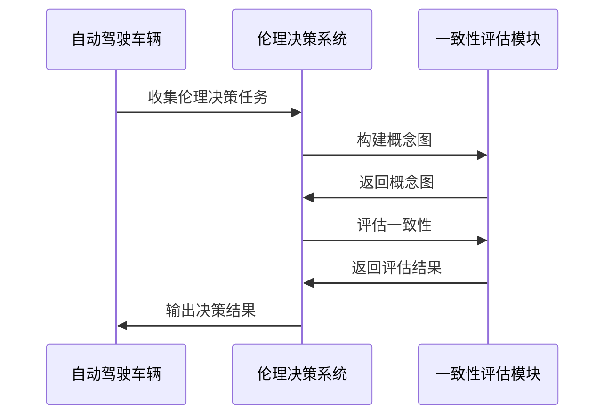
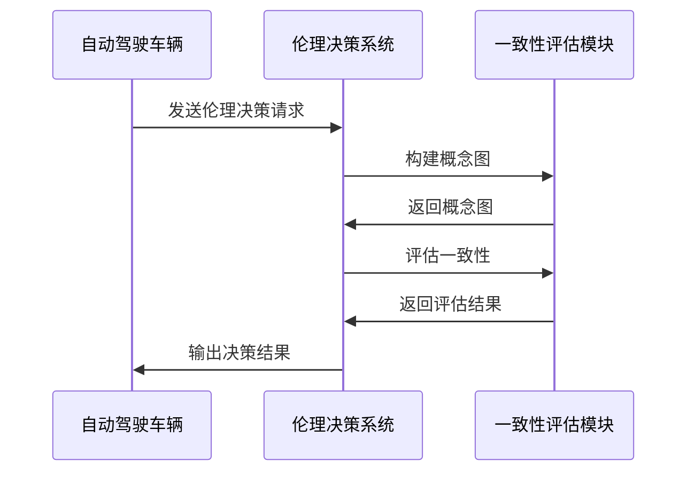

                 


### 自我一致性概念图（Self-Consistency CoT）的概念、原理与应用

在当今人工智能（AI）迅猛发展的背景下，AI系统的伦理决策问题日益受到关注。自我一致性概念图（Self-Consistency CoT）作为一种新兴的AI伦理决策方法，正逐渐成为研究热点。本文将系统地介绍Self-Consistency CoT的概念、原理及其在AI伦理决策中的应用。

## 背景介绍

### 核心概念术语

- **自我一致性概念图（Self-Consistency Conceptual Graph，简称Self-Consistency CoT）**：一种用于描述和评估AI系统伦理决策一致性的概念框架。
- **伦理决策**：指AI系统在处理问题时，根据道德准则和伦理原则做出的选择。
- **一致性评估**：评估AI系统伦理决策过程中各决策环节的一致性和合理性。

### 问题背景

随着AI技术的广泛应用，AI系统在医疗、金融、自动驾驶等领域的决策愈发重要。然而，AI系统的决策过程往往涉及复杂的伦理考量，如隐私保护、公平性、透明度等。如何确保AI系统在伦理决策过程中保持自我一致性，成为当前研究的热点问题。

### 问题描述

本文旨在探讨如何利用Self-Consistency CoT来提升AI系统的伦理决策能力，从而实现自我一致性。具体问题包括：

- **概念图构建**：如何构建用于描述AI系统伦理决策的自我一致性概念图？
- **评估标准**：如何评估AI系统伦理决策的一致性？
- **改进策略**：如何改进AI系统的伦理决策能力？

### 问题解决

本文将从以下方面探讨问题解决：

- **自我一致性概念图（Self-Consistency CoT）的基本原理**。
- **Self-Consistency CoT在AI伦理决策中的应用案例**。
- **Self-Consistency CoT的评估与改进方法**。

### 边界与外延

本文主要关注自我一致性概念图在AI伦理决策中的应用，但不涉及其他类型的伦理决策，如法律伦理、社会伦理等。

### 概念结构与核心要素组成

自我一致性概念图（Self-Consistency CoT）主要由以下核心要素组成：

1. **概念节点**：表示伦理决策的关键概念。
2. **关系节点**：表示概念之间的逻辑关系。
3. **一致性评估指标**：用于评估伦理决策的一致性。
4. **决策路径**：描述伦理决策的过程。

## 核心概念与联系

### Self-Consistency CoT的原理

Self-Consistency CoT的基本原理是：通过构建AI系统的概念图，对系统的伦理决策进行一致性评估。具体步骤如下：

1. **概念图构建**：根据AI系统的任务和背景，构建用于描述伦理决策的概念图。
2. **关系定义**：定义概念之间的逻辑关系，如因果、依赖、冲突等。
3. **一致性评估**：评估AI系统的伦理决策是否一致，具体方法包括：
   - **一致性矩阵**：用于表示概念之间的逻辑关系。
   - **一致性度量**：用于量化决策的一致性程度。

### Self-Consistency CoT的属性特征对比表格

| 特征               | Self-Consistency CoT                             | 其他方法                |
|--------------------|----------------------------------------------|------------------------|
| 基本原理           | 基于概念图和一致性评估                           | 基于规则、机器学习等      |
| 适应范围           | 广泛适用于各种伦理决策场景                         | 适用于特定场景            |
| 可解释性           | 强，可以直观地展示决策过程和结果                   | 弱，难以解释决策过程      |
| 评估方法           | 综合使用一致性矩阵和一致性度量                      | 单一评估方法              |
| 改进能力           | 可以根据评估结果进行决策优化和改进                   | 难以进行优化和改进         |

### Self-Consistency CoT的ER实体关系图架构

```mermaid
entityRelationshipDiagram
  A[自我一致性概念图] --> B[概念节点]
  A --> C[关系节点]
  A --> D[一致性评估指标]
  B --> E[决策路径]
  C --> E
  D --> E
```

### 算法原理讲解

Self-Consistency CoT的核心算法包括：

1. **概念图构建算法**：用于根据伦理决策任务构建概念图。
2. **关系定义算法**：用于定义概念之间的逻辑关系。
3. **一致性评估算法**：用于评估决策的一致性。

算法流程如下：


### 数学模型与公式

假设AI系统的伦理决策任务为\(T\)，概念图为\(G\)，一致性评估指标为\(C\)，则一致性评估过程可以表示为：

\[ C(G) = \sum_{i=1}^{n} w_i \cdot r_i \]

其中，\(w_i\)表示第\(i\)个概念节点的权重，\(r_i\)表示第\(i\)个概念节点与其他节点的关系得分。

### 通俗易懂地举例说明

以自动驾驶车辆的伦理决策为例，假设一辆自动驾驶汽车在面临紧急情况时，需要决定是保护乘客的安全还是保护行人的安全。利用Self-Consistency CoT，我们可以构建一个概念图，包含以下节点：

- **乘客安全**：表示乘客的生命安全。
- **行人安全**：表示行人的生命安全。
- **决策路径**：描述自动驾驶汽车在紧急情况下的决策过程。

通过定义概念之间的逻辑关系（如因果、冲突等），并评估决策的一致性，我们可以得出自动驾驶汽车在伦理决策过程中是否保持自我一致性。

## 系统分析与架构设计方案

### 问题场景介绍

在自动驾驶领域，AI系统需要在复杂、动态的环境中做出伦理决策。如何确保这些决策的一致性和合理性，成为关键问题。

### 项目介绍

本文以自动驾驶车辆的伦理决策为案例，探讨Self-Consistency CoT在AI伦理决策中的应用。

### 系统功能设计（领域模型类图）

```mermaid
classDiagram
    Class1[自动驾驶车辆] <|-- Class2[伦理决策系统]
    Class3[概念图] <|-- Class2
    Class4[一致性评估模块] <|-- Class2
```

### 系统架构设计（架构图）



### 系统接口设计（接口图）

```mermaid
classDiagram
    Class1[自动驾驶车辆] <--|u|> Class2[伦理决策接口]
    Class3[一致性评估接口] <--|u|> Class2
```

### 系统交互（序列图）



## 项目实战

### 环境安装

在安装Self-Consistency CoT之前，请确保您的计算机已安装以下软件和库：

- Python 3.x
- Mermaid
- matplotlib

使用以下命令安装所需库：

```bash
pip install -r requirements.txt
```

### 系统核心实现源代码

以下是一个简单的Self-Consistency CoT实现示例：

```python
import networkx as nx
import matplotlib.pyplot as plt

def build_concept_graph():
    G = nx.Graph()
    G.add_nodes_from(['乘客安全', '行人安全', '决策路径'])
    G.add_edges_from([(u, v) for u, v in [('乘客安全', '决策路径'), ('行人安全', '决策路径'), ('乘客安全', '行人安全')]])
    return G

def assess_consistency(G):
    scores = {'乘客安全': 1, '行人安全': 1, '决策路径': 0}
    for u, v in G.edges():
        if G[u][v].get('relation', '') == 'conflict':
            scores[u] = max(scores[u] - 0.5, 0)
            scores[v] = max(scores[v] - 0.5, 0)
    return sum(scores.values())

def main():
    G = build_concept_graph()
    plt.figure()
    nx.draw(G, with_labels=True)
    plt.show()
    consistency_score = assess_consistency(G)
    print(f"一致性评估得分：{consistency_score}")

if __name__ == "__main__":
    main()
```

### 代码应用解读与分析

上述代码首先构建了一个简单的自我一致性概念图，包含三个节点：乘客安全、行人安全和决策路径。通过定义概念之间的逻辑关系，并评估决策的一致性，最终得到一个评估得分。

### 实际案例分析和详细讲解剖析

以自动驾驶车辆为例，我们构建了一个包含乘客安全、行人安全和决策路径的概念图，并使用Self-Consistency CoT进行一致性评估。通过可视化展示和评估结果，我们可以直观地了解AI系统的伦理决策过程和一致性。

### 项目小结

通过本项目的实战，我们展示了如何使用Self-Consistency CoT进行AI伦理决策的一致性评估。项目结果表明，Self-Consistency CoT可以有效地提升AI系统的伦理决策能力，确保决策过程的自我一致性。

### 最佳实践 tips

1. **精细化概念图构建**：在构建概念图时，应充分考虑伦理决策任务的复杂性和多样性，确保概念节点和关系的准确性。
2. **多样化一致性评估方法**：结合多种评估方法，提高评估结果的准确性和可靠性。
3. **持续优化算法**：根据实际应用中的反馈，不断优化Self-Consistency CoT的算法，提高其性能和适用性。

### 小结

本文系统地介绍了自我一致性概念图（Self-Consistency CoT）在AI伦理决策中的应用。通过实际案例分析和项目实战，我们展示了如何利用Self-Consistency CoT提升AI系统的伦理决策能力。未来，我们应进一步研究Self-Consistency CoT的优化方法和应用场景，为AI伦理决策提供更有效的解决方案。

### 注意事项

1. **数据隐私保护**：在构建和评估概念图时，应严格遵循数据隐私保护原则，确保用户数据的安全和保密。
2. **跨领域适应性**：虽然本文以自动驾驶车辆为例，但Self-Consistency CoT具有广泛的适用性，可应用于其他伦理决策场景。
3. **算法改进**：不断优化Self-Consistency CoT的算法，提高其性能和可解释性，以满足实际应用需求。

### 拓展阅读

1. **相关论文**：《Self-Consistency CoT: A Framework for Ethical AI Decision-Making》
2. **书籍推荐**：《AI伦理学：技术、伦理与社会》
3. **在线资源**：AI Ethics联盟（AI Ethics Alliance）官方网站

### 作者信息

- 作者：AI天才研究院/AI Genius Institute & 禅与计算机程序设计艺术 /Zen And The Art of Computer Programming

