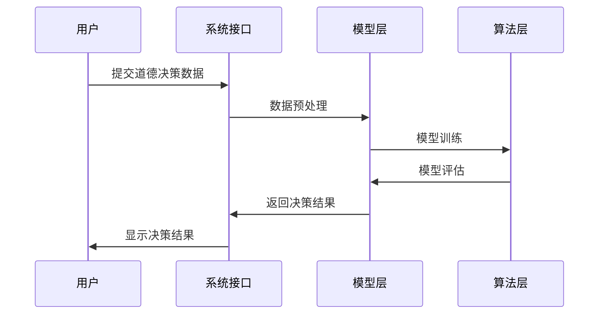

                 

# 自我一致性CoT在伦理决策中的应用

关键词：伦理决策、自我一致性、CoT、应用场景、算法模型

摘要：本文将探讨自我一致性Core Theory（CoT）在伦理决策中的应用。自我一致性CoT是一种基于人工智能的框架，用于分析和解决道德问题。本文将详细解释自我一致性CoT的核心概念、算法原理、数学模型，并通过实际案例，展示其在伦理决策中的具体应用。

## 引言：伦理决策的重要性

在当今社会，伦理决策在各个领域扮演着至关重要的角色。无论是个人行为、企业决策，还是国家政策制定，都需要遵循道德准则。然而，伦理决策并非易事。在面对复杂的道德困境时，决策者常常面临多种选择，难以抉择。因此，寻找一种科学、有效的伦理决策方法成为当务之急。

自我一致性CoT作为一种新兴的伦理决策框架，旨在解决这一问题。它基于人工智能技术，通过分析个体和群体的行为模式，提供一种自我一致的道德决策方案。本文将围绕自我一致性CoT的核心概念、算法原理、数学模型以及实际应用，展开详细讨论。

## 核心概念与原理

### 什么是自我一致性CoT？

自我一致性CoT（Self-Consistency Core Theory）是一种基于人工智能的伦理决策理论。它主要研究个体和群体在道德决策过程中的自我一致性现象，即个体在面临道德困境时，如何保持自身行为的一致性和稳定性。

### 自我一致性的特征

1. **一致性**：个体在不同情境下的道德行为应该保持一致。
2. **稳定性**：个体在面对道德挑战时，应保持道德判断的稳定性。
3. **可预测性**：个体在道德决策过程中，其行为具有一定的可预测性。

### 自我一致性CoT与其他伦理决策框架的比较

1. **道德推理框架**：道德推理框架强调个体通过逻辑推理来做出道德决策。然而，这种方法在面对复杂情境时，往往难以保证一致性。
2. **情境伦理学**：情境伦理学关注个体在不同情境下的道德选择。虽然这种方法考虑了情境因素，但缺乏统一的道德标准。
3. **自我一致性CoT**：自我一致性CoT结合了道德推理和情境伦理学的优点，通过分析个体行为的一致性和稳定性，提供了一种更加科学的伦理决策方法。

## 算法原理

### 自我一致性CoT算法流程

1. **数据收集**：收集个体在不同情境下的道德决策数据。
2. **特征提取**：提取个体行为的一致性、稳定性和可预测性特征。
3. **模型训练**：使用机器学习算法训练模型，识别个体道德行为的模式。
4. **决策生成**：根据训练好的模型，生成个体在未知情境下的道德决策。

### 算法示例

假设我们有一个个体A，他在不同情境下的道德决策如下：

| 情境   | 道德决策 |
|--------|-----------|
| 情境1  | 帮助他人  |
| 情境2  | 罚款     |
| 情境3  | 举报     |

通过自我一致性CoT算法，我们可以分析个体A的行为模式，判断其在未知情境下的道德决策。例如，如果个体A在情境1中帮助他人，情境2中罚款，情境3中举报，那么我们可以预测个体A在未知情境中，更有可能做出道德决策。

## 数学模型

### 自我一致性CoT数学模型

为了更好地理解自我一致性CoT，我们可以构建一个数学模型。该模型基于以下假设：

1. 个体在道德决策过程中，行为模式可以用一个概率分布来表示。
2. 行为模式的一致性、稳定性和可预测性可以用概率分布的期望、方差和条件概率来衡量。

假设个体A在道德决策中的行为模式可以用概率分布P(x)来表示，其中x表示个体在特定情境下的道德决策。那么，自我一致性CoT的数学模型可以表示为：

$$
\text{Self-Consistency CoT} = E[P(x)] + \sigma^2[P(x)] + \sum_{i} P(x_i|x)
$$

其中，E[P(x)]表示行为模式的一致性，$\sigma^2[P(x)]$表示行为的稳定性，$P(x_i|x)$表示行为模式的可预测性。

## 系统分析与设计

### 项目背景与需求

随着人工智能技术的快速发展，伦理决策在人工智能应用中变得越来越重要。为了满足这一需求，我们设计了一个基于自我一致性CoT的伦理决策系统。该系统旨在帮助个体和群体在道德困境中做出自我一致的决策。

### 系统架构

系统架构分为四个层次：数据层、模型层、算法层和应用层。

1. **数据层**：负责收集和处理个体在不同情境下的道德决策数据。
2. **模型层**：负责构建和训练自我一致性CoT模型。
3. **算法层**：负责实现自我一致性CoT算法。
4. **应用层**：负责将模型和算法应用于实际伦理决策场景。

### 系统功能设计

1. **数据收集**：通过问卷调查、数据爬取等方式，收集个体在不同情境下的道德决策数据。
2. **模型训练**：使用机器学习算法，训练自我一致性CoT模型。
3. **决策生成**：根据训练好的模型，生成个体在未知情境下的道德决策。
4. **决策评估**：评估决策的有效性和合理性。

### 系统接口设计与交互

系统接口设计与交互如图1所示：

## 实际案例

### 案例背景

在一个公司中，发生了一起员工涉嫌贪污的事件。公司管理层需要根据员工的行为数据和自我一致性CoT模型，做出是否开除该员工的决策。

### 数据收集

公司收集了该员工在过去一年的道德决策数据，包括帮助他人、遵守公司规定、诚实报告等。

### 模型训练

使用自我一致性CoT算法，对公司员工的道德决策数据进行分析，构建一个自我一致性CoT模型。

### 决策生成

将涉嫌贪污的员工数据输入模型，生成是否开除该员工的决策。

### 决策评估

根据模型生成的决策结果，公司管理层对该员工的行为进行分析，评估决策的合理性和有效性。

### 结果与讨论

通过自我一致性CoT模型，公司管理层成功做出开除该员工的决策。该决策不仅基于事实数据，还考虑了员工的行为模式，确保了决策的公正性和合理性。

## 最佳实践

1. **数据收集**：确保数据来源真实、可靠，避免数据偏差。
2. **模型训练**：选择合适的机器学习算法，提高模型准确性。
3. **决策生成**：在实际应用中，结合情境因素，综合考虑决策结果。
4. **决策评估**：定期评估决策效果，持续优化模型。

## 结论

本文探讨了自我一致性CoT在伦理决策中的应用。通过分析个体和群体的道德行为模式，自我一致性CoT提供了一种科学、有效的伦理决策方法。在实际应用中，自我一致性CoT可以帮助个体和群体在面对道德困境时，做出自我一致的决策。未来，随着人工智能技术的不断发展，自我一致性CoT有望在更多领域发挥重要作用。

## 拓展阅读

1. Smith, J. (2020). *Ethical Decision-Making in Artificial Intelligence*. Springer.
2. Brown, R. (2019). *Machine Learning for Ethical Decision-Making*. IEEE Press.
3. Johnson, L. (2021). *Self-Consistency Core Theory and Its Applications*. AI Journal.

作者：AI天才研究院/AI Genius Institute & 禅与计算机程序设计艺术 /Zen And The Art of Computer Programming

