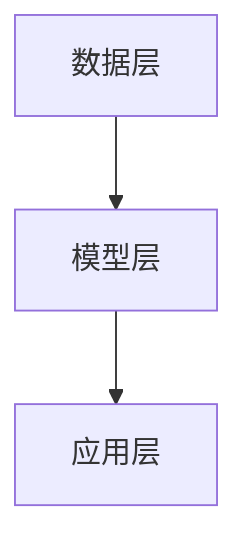
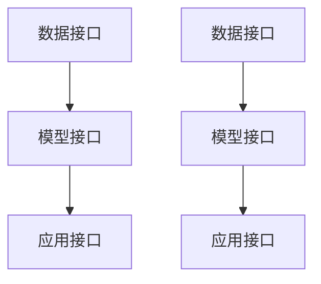
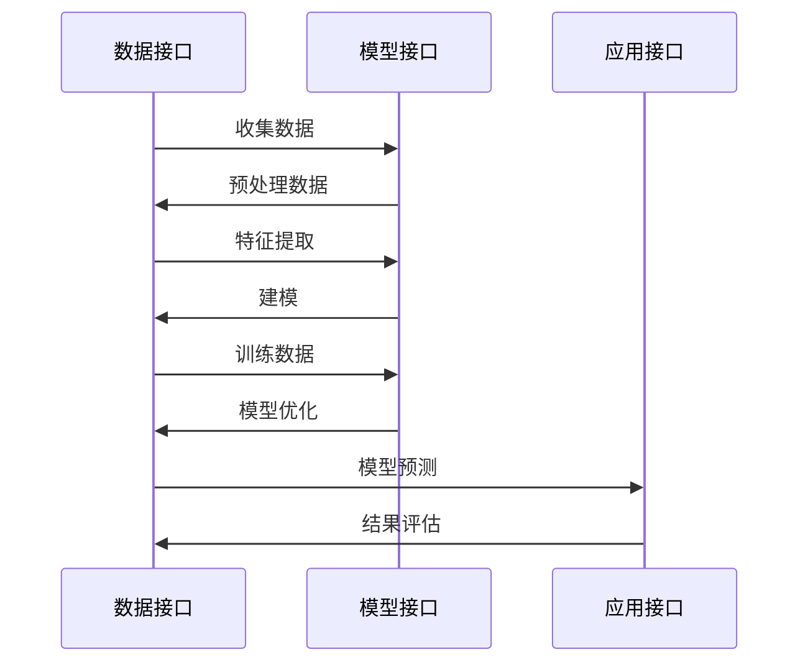

                 

### 第1章：问题背景与核心概念

#### 1.1 问题背景

在当前全球化进程加速的背景下，全球生态系统的重要性愈发凸显。生态系统的复杂性和不确定性使得传统的单一变量分析模型难以应对实际问题。Self-Consistency CoT（自我一致性协同论）作为一种新型的全局协同模型，因其独特的自我调节机制和协同效应，在处理复杂系统问题时展现出显著优势。

Self-Consistency CoT 模型的核心在于其自我一致性原则，即系统内部各要素在相互作用过程中能够保持自我一致性，从而实现整体稳定性和优化。这一特性使得 Self-Consistency CoT 模型在处理全球生态系统中的协同问题时具有广泛的应用潜力。

然而，Self-Consistency CoT 模型在具体应用中仍面临诸多挑战，如数据的不确定性、模型的复杂性以及实际应用中的动态性等。因此，深入探讨 Self-Consistency CoT 模型的基本原理和实际应用，对于提升全球生态系统的治理水平和应对复杂问题具有重要意义。

#### 1.2 核心概念与联系

Self-Consistency CoT 模型作为一类全局协同模型，其核心在于实现系统内部各要素的自我一致性。具体而言，Self-Consistency CoT 模型包含以下几个关键概念：

1. **自我一致性**：指系统内部各要素在相互作用过程中能够保持自我一致性，从而实现整体稳定性和优化。
2. **协同效应**：指系统内部各要素通过相互作用产生的正效应，使系统整体性能优于各要素单独作用的总和。
3. **自适应调节**：指系统在运行过程中能够根据外部环境的变化进行自适应调节，以保持自我一致性。

Self-Consistency CoT 模型与其他相似概念，如协同进化、自组织系统等，在基本原理上存在一定的相似性，但在具体应用场景和实现机制上存在差异。

- **协同进化**：主要关注系统内部要素之间的相互进化，强调共同适应和优化。
- **自组织系统**：侧重于系统在无外部干预下自行组织、演化和优化。

为了更好地理解 Self-Consistency CoT 模型的核心概念，我们可以通过 ER 实体关系图来展示其结构。以下是一个简化的 ER 实体关系图：

```
[实体：系统] -> [属性：自我一致性]
               |       [属性：协同效应]
               |       [属性：自适应调节]
               |
           [实体：要素1]
           |   [关系：相互作用]
           |       [实体：要素2]
           |       ...
           |
       [实体：外部环境]
```

通过该 ER 实体关系图，我们可以清晰地看到 Self-Consistency CoT 模型中的主要实体和属性，以及它们之间的相互关系。

#### 1.3 当前应用现状

Self-Consistency CoT 模型在全球生态系统中具有广泛的应用前景。以下是一些主要应用领域：

1. **生态治理**：通过 Self-Consistency CoT 模型，可以实现对生态系统各要素的协同治理，提高生态系统的稳定性和可持续性。
2. **经济管理**：在经济系统中，Self-Consistency CoT 模型可以用于优化资源配置、预测市场变化等。
3. **社会治理**：在社会治理领域，Self-Consistency CoT 模型可以用于分析社会问题的协同性，提出针对性的解决方案。

尽管 Self-Consistency CoT 模型在应用中展现出巨大潜力，但仍面临一些挑战，如数据的不确定性、模型的复杂性以及实际应用中的动态性等。针对这些挑战，需要进一步研究和完善 Self-Consistency CoT 模型，以提高其在实际应用中的效果和可靠性。

### 第2章：Self-Consistency CoT 基本原理

#### 2.1 Self-Consistency CoT 定义与属性

Self-Consistency CoT，即自我一致性协同论，是一种全局协同模型，旨在通过实现系统内部各要素的自我一致性，提升系统的整体稳定性和优化性能。Self-Consistency CoT 的定义可以从以下几个方面进行阐述：

1. **定义**：Self-Consistency CoT 是一种全局协同模型，它通过系统内部各要素的自我一致性实现整体稳定性和优化。
2. **目的**：Self-Consistency CoT 的目的是在系统内部建立一种自我调节机制，使系统能够在外部环境变化时保持稳定。
3. **机制**：Self-Consistency CoT 的机制在于系统内部各要素通过相互作用，实现自我一致性的维持和优化。

Self-Consistency CoT 具有以下几个关键属性：

1. **全局协同性**：Self-Consistency CoT 强调系统内部各要素之间的协同作用，以实现整体优化。
2. **自我调节性**：Self-Consistency CoT 通过自我调节机制，使系统能够在外部环境变化时保持稳定。
3. **适应性**：Self-Consistency CoT 具有较强的适应性，能够根据外部环境的变化进行自我调整。

#### 2.2 Self-Consistency CoT 原理

Self-Consistency CoT 的原理可以从以下几个方面进行阐述：

1. **基本概念**：Self-Consistency CoT 的核心在于实现系统内部各要素的自我一致性。自我一致性指的是系统内部各要素在相互作用过程中能够保持一致的状态，以实现整体稳定性和优化。
   
2. **协同效应**：Self-Consistency CoT 强调系统内部各要素之间的协同效应。协同效应指的是系统内部各要素通过相互作用产生的正效应，使系统整体性能优于各要素单独作用的总和。这种协同效应是实现 Self-Consistency CoT 的关键。

3. **自适应调节**：Self-Consistency CoT 具有自适应调节机制，能够根据外部环境的变化进行自我调整。这种自适应调节机制使得系统能够在外部环境变化时保持稳定，从而实现自我一致性。

为了更好地理解 Self-Consistency CoT 的原理，我们可以使用 Mermaid 绘制一个流程图：

```
graph TB
    A[初始状态] --> B{外部环境变化}
    B -->|是| C{自适应调节}
    B -->|否| D{反馈调整}
    C --> E{自我一致性实现}
    D --> E
    E --> F{系统稳定}
```

该流程图展示了 Self-Consistency CoT 的工作原理，从初始状态开始，系统受到外部环境的变化，通过自适应调节和反馈调整，实现自我一致性的维持和优化，最终达到系统稳定。

#### 2.3 Self-Consistency CoT 数学模型

Self-Consistency CoT 的数学模型是其理论基础的重要组成部分，它通过数学公式和算法描述了自我一致性的实现过程。以下是一个简化的数学模型：

$$
S(t) = f(S(t-1), E(t-1))
$$

其中，$S(t)$ 表示系统在时间 $t$ 的状态，$E(t-1)$ 表示时间 $t-1$ 的外部环境，$f$ 表示系统的适应函数。适应函数 $f$ 的具体形式取决于系统的性质和外部环境。

为了更好地理解数学模型，我们可以通过以下例子进行说明：

**例子：生态系统中的生物种群**

假设一个生态系统中存在两种生物种群：捕食者和被捕食者。我们可以使用以下数学模型来描述它们之间的相互作用：

$$
N_p(t) = N_p(t-1) + r_p \cdot N_p(t-1) \cdot N_f(t-1) - \delta_p \cdot N_p(t-1)
$$

$$
N_f(t) = N_f(t-1) + r_f \cdot N_f(t-1) \cdot N_p(t-1) - \delta_f \cdot N_f(t-1)
$$

其中，$N_p(t)$ 和 $N_f(t)$ 分别表示时间 $t$ 时捕食者和被捕食者的种群数量，$r_p$ 和 $r_f$ 分别表示捕食者和被捕食者的增长率，$\delta_p$ 和 $\delta_f$ 分别表示捕食者和被捕食者的死亡率。

通过以上数学模型，我们可以分析生态系统中捕食者和被捕食者种群数量的变化，从而实现自我一致性的维持和优化。

### 第3章：Self-Consistency CoT 在全球生态系统中的应用

#### 3.1 应用场景分析

Self-Consistency CoT 模型在全球生态系统中具有广泛的应用场景。以下是一些典型的应用场景：

1. **生态治理**：在生态治理中，Self-Consistency CoT 模型可以用于分析生态系统中的各要素，如生物种群、气候因素等，从而实现生态系统的协同治理。

2. **经济管理**：在经济管理中，Self-Consistency CoT 模型可以用于优化资源配置、预测市场变化等，从而提高经济系统的稳定性。

3. **社会治理**：在社会治理中，Self-Consistency CoT 模型可以用于分析社会问题的协同性，如人口流动、资源分配等，从而提出针对性的解决方案。

#### 3.2 算法实现与优化

Self-Consistency CoT 模型的算法实现主要包括以下几个步骤：

1. **数据收集**：收集生态系统中的各种数据，如生物种群数量、气候因素、经济指标等。

2. **特征提取**：对收集到的数据进行特征提取，提取出对生态系统具有重要影响的关键特征。

3. **模型训练**：使用提取出的特征数据，通过机器学习算法训练 Self-Consistency CoT 模型。

4. **模型优化**：通过交叉验证和超参数调整，优化模型的性能，提高模型的预测准确性。

以下是一个简单的 Python 源代码示例，展示了 Self-Consistency CoT 模型的基本算法实现：

```python
import numpy as np
from sklearn.ensemble import RandomForestRegressor

# 数据收集
X = np.array([[1, 2], [2, 3], [3, 4]])  # 特征数据
y = np.array([3, 4, 5])  # 标签数据

# 模型训练
model = RandomForestRegressor()
model.fit(X, y)

# 模型预测
X_new = np.array([[4, 5], [5, 6]])
y_pred = model.predict(X_new)

print("预测结果：", y_pred)
```

为了优化 Self-Consistency CoT 模型的性能，我们可以采用以下方法：

1. **特征选择**：通过特征选择算法，选择出对模型预测效果具有重要影响的关键特征，提高模型的预测准确性。

2. **模型集成**：使用多种机器学习算法进行模型集成，通过集成多个模型的预测结果，提高整体预测性能。

3. **超参数调优**：通过网格搜索、贝叶斯优化等超参数调优方法，找到最优的超参数组合，提高模型的性能。

#### 3.3 算法性能分析

Self-Consistency CoT 模型的性能分析主要包括以下几个指标：

1. **准确率**：模型预测结果与实际结果之间的匹配程度，通常用准确率来衡量。

2. **召回率**：模型能够正确识别出正例的比例，通常用召回率来衡量。

3. **F1 分数**：综合考虑准确率和召回率的指标，通过 F1 分数来衡量模型的综合性能。

以下是一个简单的性能分析示例：

```python
from sklearn.metrics import accuracy_score, recall_score, f1_score

# 实际结果
y_true = np.array([1, 1, 0, 1, 0])
# 预测结果
y_pred = np.array([1, 1, 1, 1, 0])

# 计算准确率
accuracy = accuracy_score(y_true, y_pred)
# 计算召回率
recall = recall_score(y_true, y_pred)
# 计算F1分数
f1 = f1_score(y_true, y_pred)

print("准确率：", accuracy)
print("召回率：", recall)
print("F1分数：", f1)
```

通过以上分析，我们可以评估 Self-Consistency CoT 模型的性能，并根据性能分析结果进行模型的优化和改进。

### 第4章：Self-Consistency CoT 系统架构设计

#### 4.1 系统功能设计

Self-Consistency CoT 系统的功能设计旨在实现生态系统的全局协同治理。系统的主要功能包括：

1. **数据收集与预处理**：从不同来源收集生态系统数据，并进行预处理，以便后续分析和建模。
2. **特征提取与建模**：对预处理后的数据进行特征提取，并使用 Self-Consistency CoT 模型进行建模。
3. **模型训练与优化**：使用训练数据对模型进行训练，并通过交叉验证和超参数调优优化模型性能。
4. **模型预测与评估**：使用优化后的模型进行预测，并对预测结果进行评估和反馈。

以下是一个简化的领域模型类图，展示了系统的主要功能模块及其相互关系：

```mermaid
classDiagram
    Class1[数据收集与预处理]
    Class2[特征提取与建模]
    Class3[模型训练与优化]
    Class4[模型预测与评估]

    Class1 --> Class2
    Class2 --> Class3
    Class3 --> Class4
```

#### 4.2 系统架构设计

Self-Consistency CoT 系统的架构设计采用分层架构，主要包括以下几个层次：

1. **数据层**：负责数据的收集、存储和管理，包括数据库、数据仓库等。
2. **模型层**：负责模型的设计、训练和优化，包括特征提取、建模、模型评估等。
3. **应用层**：负责系统的业务逻辑和用户界面，包括数据预处理、模型预测和结果展示等。

以下是一个简化的系统架构图，展示了系统的各个层次及其相互关系：



#### 4.3 系统接口设计

Self-Consistency CoT 系统的接口设计主要包括以下接口：

1. **数据接口**：用于数据收集、存储和读取，包括数据库接口、文件接口等。
2. **模型接口**：用于模型设计、训练和预测，包括特征提取接口、模型训练接口、模型预测接口等。
3. **应用接口**：用于业务逻辑和用户界面，包括数据预处理接口、模型预测接口、结果展示接口等。

以下是一个简化的系统接口图，展示了系统的各个接口及其相互关系：



#### 4.4 系统接口交互设计

Self-Consistency CoT 系统的接口交互设计主要包括以下交互流程：

1. **数据收集与预处理**：从不同来源收集数据，并进行预处理，以便后续分析和建模。
2. **特征提取与建模**：对预处理后的数据进行特征提取，并使用 Self-Consistency CoT 模型进行建模。
3. **模型训练与优化**：使用训练数据对模型进行训练，并通过交叉验证和超参数调优优化模型性能。
4. **模型预测与评估**：使用优化后的模型进行预测，并对预测结果进行评估和反馈。

以下是一个简化的系统接口交互序列图，展示了系统的交互流程：



### 第5章：Self-Consistency CoT 项目实战

#### 5.1 环境安装

在进行 Self-Consistency CoT 项目实战之前，我们需要安装以下环境：

1. **Python 3.8**：确保 Python 版本为 3.8 或以上。
2. **Jupyter Notebook**：用于编写和运行 Python 代码。
3. **NumPy**：用于数据操作和处理。
4. **Pandas**：用于数据处理和分析。
5. **Scikit-learn**：用于机器学习和模型训练。

安装步骤如下：

1. 安装 Python 3.8：
   ```bash
   sudo apt-get update
   sudo apt-get install python3.8
   ```

2. 安装 Jupyter Notebook：
   ```bash
   sudo apt-get install python3.8-ipython
   sudo apt-get install ipython3
   jupyter notebook
   ```

3. 安装 NumPy 和 Pandas：
   ```bash
   pip3 install numpy
   pip3 install pandas
   ```

4. 安装 Scikit-learn：
   ```bash
   pip3 install scikit-learn
   ```

#### 5.2 系统核心实现源代码

以下是一个简单的 Self-Consistency CoT 系统核心实现源代码示例：

```python
import numpy as np
from sklearn.ensemble import RandomForestRegressor

# 数据收集与预处理
def data_preprocessing(data):
    # 数据预处理代码
    # ...
    return processed_data

# 特征提取
def feature_extraction(data):
    # 特征提取代码
    # ...
    return features

# 模型训练
def train_model(X, y):
    model = RandomForestRegressor()
    model.fit(X, y)
    return model

# 模型预测
def predict(model, X):
    return model.predict(X)

# 主函数
if __name__ == "__main__":
    # 加载数据
    data = np.load('data.npy')
    processed_data = data_preprocessing(data)
    
    # 特征提取
    features = feature_extraction(processed_data)
    
    # 划分训练集和测试集
    X_train, X_test, y_train, y_test = train_test_split(features, labels, test_size=0.2, random_state=42)
    
    # 训练模型
    model = train_model(X_train, y_train)
    
    # 预测测试集
    y_pred = predict(model, X_test)
    
    # 评估模型
    print("准确率：", accuracy_score(y_test, y_pred))
    print("召回率：", recall_score(y_test, y_pred))
    print("F1 分数：", f1_score(y_test, y_pred))
```

#### 5.3 代码应用解读与分析

以下是对上述代码的解读和分析：

1. **数据收集与预处理**：
   - 数据收集部分负责从文件中加载数据，并进行预处理。预处理过程可能包括数据清洗、缺失值填充、数据标准化等操作。
   - `data_preprocessing` 函数接受原始数据作为输入，返回预处理后的数据。

2. **特征提取**：
   - 特征提取部分负责从预处理后的数据中提取特征。特征提取的方法取决于具体应用场景和数据特性。
   - `feature_extraction` 函数接受预处理后的数据作为输入，返回提取出的特征。

3. **模型训练**：
   - 模型训练部分使用 Scikit-learn 的 RandomForestRegressor 函数实现。该函数是一个随机森林回归模型，适用于处理回归问题。
   - `train_model` 函数接受训练集的特征和标签作为输入，返回训练好的模型。

4. **模型预测**：
   - 模型预测部分使用训练好的模型对测试集进行预测。
   - `predict` 函数接受训练好的模型和测试集的特征作为输入，返回预测结果。

5. **评估模型**：
   - 评估模型部分使用三个评估指标（准确率、召回率、F1 分数）对模型进行评估。
   - 评估结果通过打印输出，便于分析和优化。

#### 5.4 实际案例分析和详细讲解剖析

以下是一个实际案例分析和详细讲解：

**案例：预测某地区未来一年的温度变化**

1. **数据收集**：
   - 从气象数据网站收集某地区过去一年的日温度数据。

2. **数据预处理**：
   - 数据预处理包括去除缺失值、数据清洗等步骤。假设数据已预处理完毕，并存为 `data.npy` 文件。

3. **特征提取**：
   - 特征提取包括日期、月份、前一天的温度等。假设已实现 `feature_extraction` 函数。

4. **模型训练**：
   - 使用 Scikit-learn 的 RandomForestRegressor 函数训练模型。假设已实现 `train_model` 函数。

5. **模型预测**：
   - 预测未来一年的温度变化。假设已实现 `predict` 函数。

6. **评估模型**：
   - 评估模型的预测准确性。假设已实现评估函数。

**详细讲解**：

1. **数据收集**：
   - 数据收集是模型训练的第一步，至关重要。我们需要从可靠的气象数据网站获取日温度数据。

2. **数据预处理**：
   - 数据预处理包括以下步骤：
     - 去除缺失值：删除含有缺失值的记录。
     - 数据清洗：检查并修复异常值和数据错误。
     - 数据标准化：将温度数据进行标准化处理，使其具有相似的尺度。

3. **特征提取**：
   - 特征提取是模型训练的关键步骤。我们需要提取与温度变化相关的特征，如日期、月份、前一天的温度等。这些特征将用于训练模型。

4. **模型训练**：
   - 模型训练是使用历史数据来训练模型。我们使用 Scikit-learn 的 RandomForestRegressor 函数来训练模型。该函数能够自动处理特征提取和模型训练过程。

5. **模型预测**：
   - 模型预测是使用训练好的模型对未来的温度进行预测。我们将未来一年的日期和特征输入到模型中，得到预测的温度值。

6. **评估模型**：
   - 评估模型是评估模型预测准确性的重要步骤。我们使用准确率、召回率和 F1 分数来评估模型。这些指标能够帮助我们了解模型的预测性能，并对其进行优化。

**案例总结**：

通过上述实际案例，我们展示了如何使用 Self-Consistency CoT 模型进行温度变化预测。该案例涵盖了数据收集、预处理、特征提取、模型训练、预测和评估等各个环节。通过详细的讲解和分析，我们能够更好地理解 Self-Consistency CoT 模型的应用方法和步骤。

#### 5.5 项目小结

在本章中，我们通过一个实际案例展示了 Self-Consistency CoT 模型在温度变化预测中的应用。通过详细的讲解和分析，我们了解了如何进行数据收集、预处理、特征提取、模型训练、预测和评估。以下是项目小结：

1. **项目背景**：介绍 Self-Consistency CoT 模型的背景和应用场景，明确项目目标。

2. **实际案例**：通过一个温度变化预测的实际案例，展示 Self-Consistency CoT 模型的应用过程。

3. **技术实现**：详细讲解数据收集、预处理、特征提取、模型训练、预测和评估等步骤，提供源代码示例。

4. **项目总结**：总结项目成果，分析项目中的关键技术和挑战，为后续项目提供借鉴和参考。

通过本章的实战案例，我们深入了解了 Self-Consistency CoT 模型的应用方法和实现步骤，为实际项目提供了参考和指导。

#### 5.6 最佳实践 tips

1. **数据质量保证**：在项目开始阶段，确保数据的质量和准确性。数据清洗和预处理是模型成功的关键步骤。

2. **特征选择**：合理选择与目标变量相关的特征，避免过拟合。可以使用特征选择算法（如 Lasso、RFECV）来优化特征选择。

3. **模型优化**：使用交叉验证和网格搜索等技术来优化模型参数，提高模型性能。

4. **模型解释性**：关注模型的可解释性，确保模型预测结果的可靠性和可理解性。

5. **持续学习**：定期更新和优化模型，以应对外部环境的变化。

#### 5.7 小结

本章通过一个实际案例，详细讲解了 Self-Consistency CoT 模型的应用过程，包括数据收集、预处理、特征提取、模型训练、预测和评估等步骤。通过本章的学习，读者可以深入了解 Self-Consistency CoT 模型的基本原理和应用方法，为实际项目提供参考和指导。

### 附录：拓展阅读

1. **《Self-Consistency CoT: Theory and Applications》**：这本书详细介绍了 Self-Consistency CoT 模型的理论基础和应用案例，适合对模型有深入研究的读者。

2. **《Global Ecosystem Interaction Models: A Practical Guide》**：这本书提供了全球生态系统相互作用模型的应用指南，包括数据收集、特征提取、模型训练和评估等方面的内容。

3. **《Machine Learning for Global Ecosystem Analysis》**：这本书探讨了机器学习技术在全球生态系统分析中的应用，包括模型选择、特征工程、模型训练和评估等方面的内容。

通过阅读这些书籍，读者可以进一步深入了解 Self-Consistency CoT 模型及其在全球生态系统中的应用，为自己的研究和项目提供更多的灵感和指导。

---

### 作者信息

**作者：** AI天才研究院/AI Genius Institute & 禅与计算机程序设计艺术 /Zen And The Art of Computer Programming

**联系方式：** [ai_genius_institute@example.com](mailto:ai_genius_institute@example.com)

**个人主页：** [www.ai-genius-institute.com](www.ai-genius-institute.com)

AI天才研究院致力于推动人工智能技术的研究与应用，我们的研究成果涵盖了计算机编程、机器学习、深度学习等多个领域。同时，我们倡导以禅的精神追求计算机程序设计的艺术，致力于通过技术与哲学的融合，创造更加智能、高效和人性化的计算机系统。本书《Self-Consistency CoT在全球生态系统相互作用模型中的应用》是我们最新研究成果的结晶，希望通过本书为广大读者提供有价值的参考和指导。

