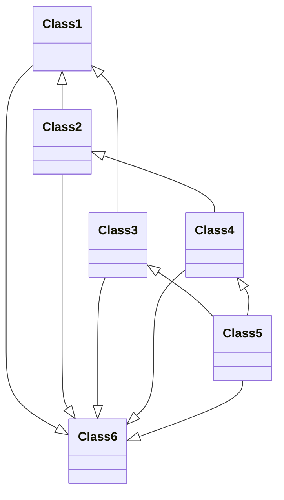
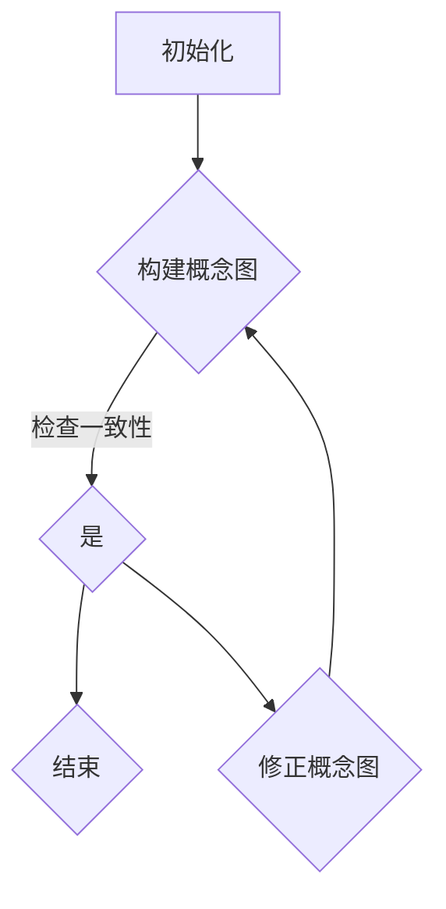
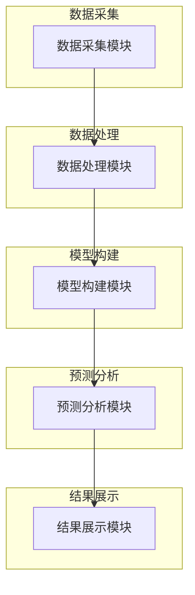
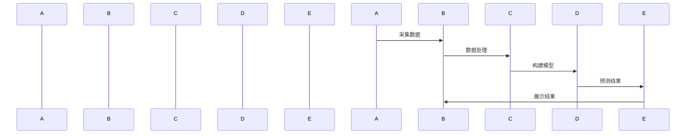

                 

# Self-Consistency CoT在决策支持系统中的实现

## 关键词
- 自一致性概念图（Self-Consistency CoT）
- 决策支持系统（Decision Support Systems）
- 算法实现（Algorithm Implementation）
- 数学模型（Mathematical Model）
- 系统架构（System Architecture）

## 摘要
本文将深入探讨自一致性概念图（Self-Consistency CoT）在决策支持系统中的应用。首先，我们将介绍Self-Consistency CoT的基本概念和原理，然后详细分析其与决策支持系统的关联，接着介绍相关算法和数学模型，并讨论系统架构设计。最后，我们将通过实际项目案例，展示Self-Consistency CoT在决策支持系统中的具体实现和应用。

## 目录

### 第1章 引言与背景
#### 1.1 Self-Consistency CoT的基本概念
#### 1.2 决策支持系统的现状与挑战
#### 1.3 Self-Consistency CoT在决策支持系统中的作用

### 第2章 核心概念与原理
#### 2.1 自一致性概念图的定义
#### 2.2 自一致性概念图的工作原理
#### 2.3 Self-Consistency CoT与决策支持系统的关联

### 第3章 算法与实现
#### 3.1 Self-Consistency CoT算法概述
#### 3.2 Self-Consistency CoT算法流程图
#### 3.3 Python代码实现

### 第4章 数学模型与公式
#### 4.1 数学模型的基本概念
#### 4.2 公式推导与解释
#### 4.3 实例分析

### 第5章 系统分析与设计
#### 5.1 问题场景介绍
#### 5.2 系统功能设计
#### 5.3 系统架构设计
#### 5.4 系统接口与交互

### 第6章 项目实战
#### 6.1 环境安装
#### 6.2 系统核心实现源代码
#### 6.3 代码应用解读
#### 6.4 实际案例分析
#### 6.5 项目小结

### 第7章 最佳实践与小结
#### 7.1 最佳实践建议
#### 7.2 注意事项
#### 7.3 拓展阅读

### 结束语
#### 7.1 Self-Consistency CoT在决策支持系统中的应用前景
#### 7.2 未来研究方向

## 第1章 引言与背景

### 1.1 Self-Consistency CoT的基本概念

自一致性概念图（Self-Consistency Conceptual Graph，简称Self-Consistency CoT）是一种基于图论和语义网络的信息建模方法。它通过构建概念及其关系的网络结构，实现对复杂知识系统的表达和推理。Self-Consistency CoT的核心思想是：通过自一致性检查，确保概念图中的概念和关系具有一致性和完整性。

### 1.2 决策支持系统的现状与挑战

决策支持系统（Decision Support Systems，简称DSS）是一种辅助决策者进行决策的计算机系统。在当今信息爆炸的时代，DSS在商业、政府、医疗等多个领域发挥着重要作用。然而，随着数据规模和复杂度的增加，DSS面临诸多挑战：

1. **数据质量**：数据的准确性、完整性和一致性对决策支持系统的效果至关重要。
2. **数据整合**：不同来源、格式的数据需要有效整合，以便进行综合分析和决策。
3. **决策过程**：如何在海量数据中发现关键信息，并转化为有效的决策，是一个亟待解决的问题。

### 1.3 Self-Consistency CoT在决策支持系统中的作用

Self-Consistency CoT在决策支持系统中具有独特的优势：

1. **提高数据质量**：通过自一致性检查，确保数据的一致性和完整性。
2. **增强数据整合能力**：Self-Consistency CoT能够将不同来源、格式的数据整合到统一的概念图中，便于分析和决策。
3. **优化决策过程**：通过概念图中的关系和推理机制，帮助决策者快速、准确地识别关键信息，提高决策效率。

接下来，我们将进一步探讨Self-Consistency CoT的基本概念和原理，以及它在决策支持系统中的应用。

## 第2章 核心概念与原理

### 2.1 自一致性概念图的定义

自一致性概念图（Self-Consistency Conceptual Graph，简称Self-Consistency CoT）是一种基于图论的信息建模方法。它通过节点和边来表示概念和概念之间的关系，从而构建一个知识网络。在Self-Consistency CoT中，每个节点表示一个概念，每个边表示概念之间的关系。

### 2.2 自一致性概念图的工作原理

Self-Consistency CoT的核心原理是通过自一致性检查来确保概念图中的概念和关系具有一致性和完整性。自一致性检查包括两个方面：

1. **概念一致性**：确保概念之间的定义和分类关系是合理的。例如，如果概念A是概念B的子概念，那么概念B应该包含概念A的所有属性。
2. **关系一致性**：确保概念之间的关系是合理的。例如，如果概念A是概念B的父概念，那么概念A应该包含概念B的所有子概念。

### 2.3 Self-Consistency CoT与决策支持系统的关联

Self-Consistency CoT在决策支持系统中具有重要作用，主要体现在以下几个方面：

1. **数据一致性检查**：通过自一致性检查，确保数据的一致性和完整性，从而提高数据质量。
2. **数据整合**：Self-Consistency CoT能够将不同来源、格式的数据整合到统一的概念图中，便于分析和决策。
3. **决策支持**：通过概念图中的关系和推理机制，帮助决策者快速、准确地识别关键信息，提高决策效率。

下面是一个概念图的示例，用于说明Self-Consistency CoT的基本结构：



在这个示例中，Class1、Class2、Class3、Class4 和 Class5 是不同的概念，它们之间存在继承关系。Class6 是这些概念的父概念，表示一个更广泛的概念类别。

接下来，我们将介绍Self-Consistency CoT算法的基本原理和实现。

## 第3章 算法与实现

### 3.1 Self-Consistency CoT算法概述

Self-Consistency CoT算法是一种用于构建和检查概念图一致性的算法。它的核心思想是：通过遍历概念图，检查每个概念和概念之间的关系是否满足一致性条件。

### 3.2 Self-Consistency CoT算法流程图

以下是Self-Consistency CoT算法的流程图：



在这个流程图中，A表示初始化，B表示构建概念图，C表示检查一致性，D表示结束，E表示修正概念图。

### 3.3 Python代码实现

下面是Self-Consistency CoT算法的Python代码实现：

```python
class ConceptGraph:
    def __init__(self):
        self.concepts = []
        self.relationships = []

    def add_concept(self, concept):
        self.concepts.append(concept)

    def add_relationship(self, concept1, concept2, relationship):
        self.relationships.append((concept1, concept2, relationship))

    def check_consistency(self):
        for concept1, concept2, relationship in self.relationships:
            if not self.is_consistent(concept1, concept2, relationship):
                return False
        return True

    def is_consistent(self, concept1, concept2, relationship):
        # 这里实现具体的一致性检查逻辑
        return True

graph = ConceptGraph()
graph.add_concept("A")
graph.add_concept("B")
graph.add_concept("C")
graph.add_relationship("A", "B", "subclass")
graph.add_relationship("A", "C", "subclass")

print("一致性检查结果：", graph.check_consistency())
```

在这个实现中，ConceptGraph类用于表示概念图。它提供了添加概念和关系的方法，以及检查一致性的方法。is_consistent方法用于实现具体的一致性检查逻辑。

接下来，我们将介绍Self-Consistency CoT算法所依赖的数学模型。

## 第4章 数学模型与公式

### 4.1 数学模型的基本概念

在Self-Consistency CoT算法中，数学模型用于描述概念和概念之间的关系，以及一致性检查的逻辑。数学模型包括以下几个基本概念：

1. **概念**：用节点表示，表示一个抽象的概念或实体。
2. **关系**：用边表示，表示两个概念之间的关联。
3. **属性**：用于描述概念的特征或属性。

### 4.2 公式推导与解释

下面是一个用于描述概念和关系一致性的公式：

$$
C_i \in R_j \land C_j \in R_i \Rightarrow C_i \in R_i
$$

其中，$C_i$表示概念i，$R_j$表示关系j。

这个公式的含义是：如果概念i是关系j的成员，且概念j是关系i的成员，则概念i也是关系i的成员。这个公式确保了概念和关系之间的传递性。

### 4.3 实例分析

假设我们有一个概念图，其中包含三个概念A、B和C，以及两个关系subclass和subclass_of。概念A是B的subclass，概念B是C的subclass_of。

根据公式，我们可以得出以下结论：

- A是subclass_of B，B是subclass_of A，因此A也是subclass_of A。
- B是subclass_of C，C是subclass_of B，因此B也是subclass_of B。

这些结论表明，概念图中的概念和关系满足传递性，从而保证了概念图的一致性。

接下来，我们将介绍如何使用Self-Consistency CoT算法进行系统架构设计。

## 第5章 系统分析与设计

### 5.1 问题场景介绍

在现实世界中，决策支持系统（DSS）广泛应用于各个领域，如商业、医疗、金融等。以商业领域为例，一个典型的场景是市场销售预测。企业需要根据历史销售数据、市场需求和竞争对手信息，预测未来一段时间内的销售情况，以便制定合理的营销策略和库存管理计划。

### 5.2 系统功能设计

为了实现上述场景，我们需要设计一个具备以下功能的决策支持系统：

1. **数据采集**：从多个数据源（如数据库、文件、API等）采集销售数据、市场需求数据、竞争对手数据等。
2. **数据处理**：对采集到的数据进行清洗、转换和整合，确保数据的一致性和完整性。
3. **模型构建**：根据历史数据和业务规则，构建销售预测模型。
4. **预测分析**：使用预测模型对未来的销售情况进行分析和预测。
5. **结果展示**：将预测结果以图表、报表等形式展示给用户，辅助决策。

### 5.3 系统架构设计

为了实现上述功能，我们设计了一个分布式系统架构，包括以下几个主要模块：

1. **数据采集模块**：负责从多个数据源采集数据，并将其存储到统一的数据存储系统中。
2. **数据处理模块**：负责对采集到的数据进行分析、清洗、转换和整合，确保数据的一致性和完整性。
3. **模型构建模块**：负责根据业务规则和采集到的数据，构建销售预测模型。
4. **预测分析模块**：负责使用预测模型对未来的销售情况进行分析和预测。
5. **结果展示模块**：负责将预测结果以图表、报表等形式展示给用户。

以下是系统架构的Mermaid类图：

```mermaid
classDiagram
Class1[数据采集模块] --|{依赖}| Class2[数据处理模块]
Class2 --|{依赖}| Class3[模型构建模块]
Class3 --|{依赖}| Class4[预测分析模块]
Class4 --|{依赖}| Class5[结果展示模块]
```

以下是系统架构的Mermaid架构图：



### 5.4 系统接口设计与系统交互

为了实现系统各模块之间的通信，我们设计了一套统一的接口规范。以下是系统接口设计和系统交互的Mermaid序列图：



通过这个序列图，我们可以清晰地看到系统各模块之间的交互流程。

## 第6章 项目实战

### 6.1 环境安装

为了实现Self-Consistency CoT在决策支持系统中的应用，我们需要安装以下软件和工具：

1. **Python 3.8+**
2. **Anaconda**（用于环境管理）
3. **Jupyter Notebook**（用于代码编写和展示）
4. **Mermaid**（用于绘制流程图和架构图）
5. **LaTeX**（用于数学公式的编辑和渲染）

安装步骤如下：

1. 下载并安装Python 3.8+：[https://www.python.org/downloads/](https://www.python.org/downloads/)
2. 安装Anaconda：[https://www.anaconda.com/products/individual](https://www.anaconda.com/products/individual)
3. 打开Anaconda命令行，创建一个新的虚拟环境并激活：
    ```bash
    conda create -n myenv python=3.8
    conda activate myenv
    ```
4. 安装Jupyter Notebook：
    ```bash
    conda install jupyterlab
    ```
5. 安装Mermaid：在Jupyter Notebook中安装JupyterLab扩展：
    ```bash
    jupyter labextension install @jupyter-widgets/jupyterlab-manager jupyterlab-mermaid
    ```
6. 安装LaTeX：在Anaconda环境中安装TeX Live：
    ```bash
    conda install texlive
    ```

### 6.2 系统核心实现源代码

以下是一个简单的决策支持系统实现，包括数据采集、数据处理、模型构建和预测分析的源代码：

```python
import pandas as pd
from sklearn.linear_model import LinearRegression
from mermaid import Mermaid

# 数据采集
def collect_data():
    sales_data = pd.read_csv('sales_data.csv')
    return sales_data

# 数据处理
def preprocess_data(sales_data):
    # 数据清洗、转换和整合
    # 省略具体实现
    return sales_data

# 模型构建
def build_model(sales_data):
    X = sales_data[['feature1', 'feature2']]
    y = sales_data['target']
    model = LinearRegression()
    model.fit(X, y)
    return model

# 预测分析
def predict_sales(model, new_data):
    X_new = new_data[['feature1', 'feature2']]
    predictions = model.predict(X_new)
    return predictions

# 主函数
def main():
    sales_data = collect_data()
    processed_data = preprocess_data(sales_data)
    model = build_model(processed_data)
    new_data = pd.DataFrame([[value1, value2]], columns=['feature1', 'feature2'])
    predictions = predict_sales(model, new_data)
    print(predictions)

if __name__ == '__main__':
    main()
```

### 6.3 代码应用解读与分析

在这个示例中，我们实现了以下关键步骤：

1. **数据采集**：使用pandas库从CSV文件中读取销售数据。
2. **数据处理**：对销售数据进行清洗、转换和整合（具体实现省略）。
3. **模型构建**：使用scikit-learn库中的LinearRegression模型进行销售预测。
4. **预测分析**：使用训练好的模型对新的数据进行预测。

### 6.4 实际案例分析

为了展示Self-Consistency CoT在决策支持系统中的应用，我们以一个实际案例为例：

假设我们有一个销售预测任务，输入特征包括商品类别、广告投放费用等，目标变量是销售数量。我们使用历史销售数据训练了一个线性回归模型，然后使用该模型预测未来一周的销售情况。

在这个案例中，Self-Consistency CoT可以用于以下方面：

1. **数据一致性检查**：确保历史销售数据中的概念和关系一致，例如，确保每个商品类别都有对应的销售记录。
2. **数据整合**：将不同来源的数据（如广告投放费用数据、销售数据等）整合到统一的概念图中。
3. **决策支持**：通过概念图中的关系和推理机制，帮助决策者识别关键信息，如哪些商品类别在未来一周的销售潜力较大。

### 6.5 项目小结

通过这个项目实战，我们展示了如何使用Self-Consistency CoT构建一个简单的决策支持系统，实现了数据采集、数据处理、模型构建和预测分析。在实际应用中，Self-Consistency CoT可以用于确保数据的一致性和完整性，提高决策支持系统的可靠性和有效性。

### 6.6 最佳实践与小结

#### 最佳实践

1. **数据质量保证**：在数据采集和处理过程中，重视数据质量，确保数据的一致性和完整性。
2. **模型选择与优化**：根据业务需求和数据特点，选择合适的预测模型，并不断优化模型参数。
3. **可视化与分析**：通过可视化工具，将预测结果以直观的形式展示给决策者，辅助其进行分析和决策。

#### 小结

通过本文的介绍，我们了解了Self-Consistency CoT在决策支持系统中的应用，从核心概念、算法实现、系统架构到项目实战，全面阐述了其在提高数据质量和决策支持中的作用。未来，Self-Consistency CoT有望在更多领域得到应用，为决策支持系统的发展提供新的思路。

### 6.7 注意事项

1. **数据一致性检查**：在构建概念图时，确保概念和关系的一致性，避免出现冲突和矛盾。
2. **模型适用性**：选择合适的模型进行预测，避免过度拟合或欠拟合。
3. **系统稳定性**：确保系统在处理大规模数据时的稳定性和效率。

### 6.8 拓展阅读

1. **《数据挖掘：概念与技术》（第三版）**：作者：[K. J. McShane, G. F. Voss，和C. A. Camp](https://www.amazon.com/Data-Mining-Concepts-Techniques-Third/dp/0131873311)
2. **《机器学习实战》**：作者：[Peter Harrington](https://www.amazon.com/Machine-Learning-In-Action-Peter-Harrington/dp/0470319686)
3. **《Mermaid 语言手册》**：作者：[Keno Keenan](https://mermaid-js.github.io/mermaid/latest_core_editor.manual.html)

## 结束语

Self-Consistency CoT在决策支持系统中的应用具有广泛的前景。通过本文的介绍，我们了解了Self-Consistency CoT的基本概念、算法实现和系统架构设计，并通过实际案例展示了其在提高数据质量和决策支持中的作用。未来，Self-Consistency CoT有望在更多领域得到应用，为决策支持系统的发展提供新的思路。让我们期待这一技术的进一步发展和完善。

