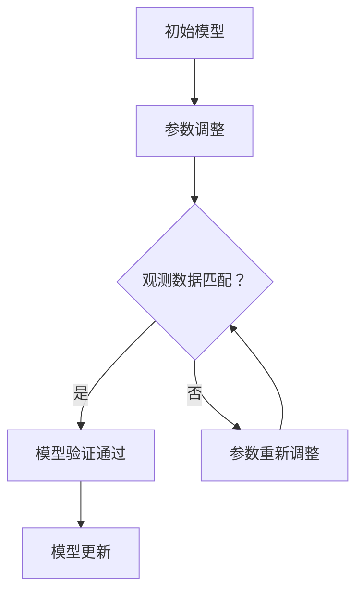
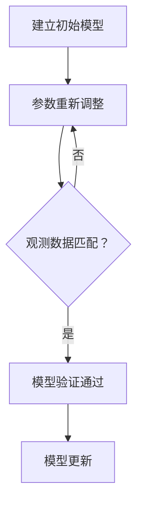
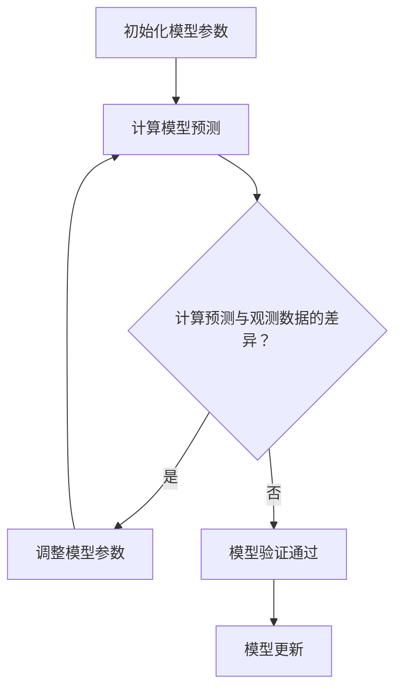

                 

## 1.1 问题背景

宇宙学是一门研究宇宙起源、演化、结构及其组成成分的学科。从20世纪初爱因斯坦提出广义相对论以来，宇宙学的研究取得了长足的进展。宇宙学模型是描述宇宙演化过程的数学框架，它们通过一组参数和假设来描述宇宙的各个方面，如宇宙的膨胀、结构的形成、能量密度的分布等。

随着观测技术的不断进步，我们对宇宙的了解也在不断深化。例如，哈勃望远镜的观测揭示了宇宙膨胀的现象，而宇宙微波背景辐射的观测提供了宇宙早期状态的宝贵信息。这些观测数据为我们提供了验证和改进宇宙学模型的依据。

当前，广泛接受的宇宙学模型是大爆炸宇宙学模型，它描述了宇宙从一个极高温度和密度状态开始膨胀的过程。然而，尽管这个模型在解释许多观测现象方面取得了成功，但它也面临着一些未解决的问题。例如，为了解释宇宙的膨胀，我们需要引入一种名为“暗能量”的神秘力量，其具体性质和本质尚不清楚。此外，宇宙中还存在大量的“暗物质”，其性质和组成也仍然是一个谜。

宇宙学模型验证的核心问题是如何通过观测数据来检验这些模型的准确性。这需要我们建立一套有效的验证方法，以确保模型内部参数和观测数据之间的一致性。自洽一致性概念（Self-Consistency CoT）就是这样一种方法，它强调模型内部参数的合理性和观测数据的准确匹配。通过自洽一致性验证，我们可以评估宇宙学模型的可靠性和适用性，从而为宇宙学研究提供坚实的理论基础。

## 1.2 问题描述

在宇宙学模型的研究中，我们面临的主要问题可以归纳为以下几个方面：

### 暗物质和暗能量的存在

暗物质和暗能量是当前宇宙学模型中的两个关键概念。暗物质是一种无法通过电磁辐射探测到的物质，它对宇宙的引力作用有着重要影响。然而，我们对其本质和组成仍然知之甚少。暗能量则是一种推动宇宙加速膨胀的力量，其性质同样神秘莫测。这两个概念的引入是为了解释宇宙膨胀加速和宇宙结构稳定性等现象，但它们的物理本质尚不清楚。

### 宇宙学模型的不确定性

尽管大爆炸宇宙学模型已经相当成熟，但不同模型之间的比较和选择仍然存在很大争议。例如，标准模型（ΛCDM模型）与一些替代模型（如稳态宇宙模型、振荡宇宙模型等）之间的差异，使得我们难以确定哪个模型更符合观测事实。这种模型不确定性增加了宇宙学研究的复杂性和挑战性。

### 观测数据的局限

宇宙学研究中，我们依赖的观测数据主要来自宇宙微波背景辐射、大型星系团、超新星等。然而，这些数据往往受到各种噪声和误差的影响，使得观测结果的可靠性受到限制。此外，宇宙的遥远和广阔也使得我们难以获得全面和精确的观测数据。

### 模型参数的不确定性

宇宙学模型中的参数数量通常非常多，这些参数的估计和调整过程存在很大不确定性。例如，在标准模型中，就有数十个参数需要估计。这些参数的不确定性会影响模型预测的准确性，从而影响模型验证的结果。

### 模型内部一致性

宇宙学模型需要在多个层次上保持一致性。例如，模型中的物理定律和假设需要自洽，参数之间的相关性需要合理，模型预测的结果需要与观测数据一致。如果模型内部存在不一致性，那么模型的可信度将受到质疑。

总的来说，宇宙学模型验证中的问题主要涉及暗物质和暗能量的存在、模型不确定性、观测数据的局限、参数不确定性以及模型内部一致性等方面。解决这些问题需要我们发展更精确的观测技术、建立更可靠的模型、采用更有效的验证方法，同时也需要跨学科的合作和不断创新。

## 1.3 问题解决

为了解决上述宇宙学模型验证中的问题，研究者们提出并采用了一系列方法和工具，主要包括以下几个方面：

### 自洽一致性概念（Self-Consistency CoT）

自洽一致性概念是宇宙学模型验证中的关键方法论，它强调模型内部参数和观测数据之间的一致性。自洽性要求模型内部参数的估计和调整过程应确保模型预测与观测数据的一致性，从而提高模型的可信度。具体来说，自洽一致性验证包括以下步骤：

1. **建立初始模型**：首先，研究者根据现有的理论假设和观测数据，建立初步的宇宙学模型。
2. **参数估计与调整**：然后，通过最大似然估计等方法，对模型中的参数进行估计和调整，使得模型预测与观测数据尽可能一致。
3. **模型验证**：最后，计算模型预测与观测数据之间的匹配程度，如使用$\chi^2$测试等统计方法，评估模型的自洽性。如果模型通过验证，则认为模型是可靠的，否则需要重新调整参数或改进模型。

### 观测数据的处理与分析

观测数据的处理和分析是宇宙学模型验证的基础。为了提高观测数据的可靠性，研究者们采用了多种数据处理技术，包括：

1. **数据预处理**：对观测数据进行滤波、去噪等预处理，以提高数据的准确性和一致性。
2. **数据融合**：将来自不同观测设备的观测数据进行融合，以获得更全面和精确的数据。
3. **统计分析**：使用统计方法（如高斯分布、最大似然估计等）对观测数据进行处理和分析，以评估模型预测与观测数据的一致性。

### 多模型比较和选择

为了解决宇宙学模型的不确定性，研究者们通常采用多模型比较和选择的方法。具体步骤包括：

1. **构建多个模型**：根据不同的理论假设和观测数据，构建多个宇宙学模型。
2. **参数估计与调整**：对每个模型中的参数进行估计和调整，使其与观测数据尽可能一致。
3. **模型比较与选择**：通过计算模型预测与观测数据之间的匹配程度（如$\chi^2$值、AIC、BIC等统计量），比较不同模型之间的优劣，选择最符合观测数据的模型。

### 跨学科合作与技术创新

宇宙学模型验证是一个复杂的过程，需要跨学科的合作和不断的创新。研究者们通过与其他科学领域（如粒子物理学、天体物理学等）的合作，引入新的理论和方法，以提高宇宙学模型验证的精度和可靠性。此外，技术创新（如高性能计算、机器学习等）也为宇宙学模型验证提供了强有力的工具和支持。

总的来说，通过自洽一致性概念、观测数据的处理与分析、多模型比较和选择，以及跨学科合作与技术创新，我们可以提高宇宙学模型验证的效率和准确性，从而为宇宙学研究提供更坚实的理论基础和更可靠的模型预测。

## 1.4 边界与外延

自洽一致性概念不仅在宇宙学模型验证中具有重要意义，它还可以广泛应用于其他科学领域，如粒子物理学、天体物理学等。在粒子物理学中，自洽性验证被用来确保理论模型和实验数据的一致性，从而揭示基本粒子的性质和行为。在天体物理学中，自洽一致性概念被用于验证恒星和星系的演化模型，确保理论预测与观测结果的一致。

此外，自洽一致性概念在工程领域也有广泛应用。在系统设计和模拟过程中，自洽性验证可以确保系统内部各部分之间的协调和一致性，从而提高系统的可靠性和稳定性。例如，在计算机图形学中，自洽一致性概念被用于验证三维模型的光照计算和渲染效果，确保渲染结果与实际光照条件一致。

尽管自洽一致性概念在各个领域都有广泛应用，但宇宙学模型验证是该概念最为典型和重要的应用场景之一。宇宙学的复杂性和不确定性使得自洽性验证在模型建立和优化过程中至关重要。因此，深入研究自洽一致性概念在宇宙学模型验证中的应用，不仅有助于提高宇宙学研究的精度和可靠性，还能为其他科学领域提供有益的参考和启示。

## 1.5 概念结构与核心要素组成

自洽一致性概念在宇宙学模型验证中扮演着至关重要的角色。要深入理解这一概念，我们需要从其核心结构、关键要素和组成部分出发，详细探讨其具体构成和应用。

### 1.5.1 自洽性定义

自洽性是指一个模型内部参数和观测数据之间的匹配程度。具体来说，自洽性要求模型内部的物理规律和假设能够合理地解释观测数据，使得模型预测与观测结果之间的一致性达到较高水平。自洽性验证的目的是评估模型的可信度，确保模型在理论层面和观测数据层面上的自洽性。

### 1.5.2 自洽性在宇宙学中的应用

在宇宙学中，自洽性验证主要用于以下几个方面：

1. **模型参数调整**：通过自洽性验证，研究者可以调整宇宙学模型中的参数，使其更符合观测数据。这一过程包括参数估计和优化，旨在提高模型预测的准确性和可靠性。
2. **模型选择**：在多个宇宙学模型中，自洽性验证可以帮助研究者选择最符合观测数据的模型。通过比较不同模型的自洽性，研究者可以判断哪个模型更可靠，从而为宇宙学研究提供更可靠的参考。
3. **模型验证**：自洽性验证是宇宙学模型验证的核心步骤。研究者通过计算模型预测与观测数据之间的匹配程度（如$\chi^2$值、AIC、BIC等统计量），评估模型的自洽性，从而判断模型是否通过验证。

### 1.5.3 自洽性与观测数据的关系

自洽性验证依赖于高质量的观测数据。观测数据是宇宙学模型验证的依据，其准确性和可靠性直接影响自洽性验证的结果。以下是自洽性与观测数据之间的几个关键关系：

1. **数据质量**：高质量的数据是自洽性验证的基础。研究者需要采用先进的数据处理技术，提高观测数据的准确性和一致性，以确保自洽性验证的可靠性。
2. **数据融合**：来自不同观测设备的观测数据通常需要融合，以获得更全面和精确的数据。数据融合可以减少观测误差，提高自洽性验证的准确性。
3. **数据限制**：观测数据的局限（如噪声、误差、数据缺失等）会影响自洽性验证的结果。研究者需要考虑这些因素，在自洽性验证过程中进行合理的误差分析和调整。

### 1.5.4 核心要素

自洽一致性概念的核心要素包括以下几个方面：

1. **宇宙学模型**：宇宙学模型是自洽性验证的基础，其内部参数和假设直接影响自洽性验证的结果。研究者需要根据现有的理论假设和观测数据，建立合理的宇宙学模型。
2. **参数估计与优化**：参数估计和优化是自洽性验证的关键步骤。研究者需要采用适当的统计方法和算法，对模型参数进行估计和优化，使其更符合观测数据。
3. **观测数据**：高质量的观测数据是自洽性验证的依据。研究者需要采用多种观测手段，获取全面的观测数据，并采用先进的数据处理技术，提高数据的质量和准确性。
4. **自洽性验证方法**：自洽性验证方法包括$\chi^2$测试、AIC、BIC等统计方法。研究者需要根据实际情况，选择合适的验证方法，评估模型的自洽性。

### 1.5.5 自洽性概念的结构

自洽一致性概念的结构可以分为三个层次：

1. **基础层次**：包括宇宙学模型、参数估计和优化、观测数据等基本要素。这一层次是自洽性概念的基础，直接影响自洽性验证的准确性和可靠性。
2. **中间层次**：包括数据预处理、数据融合、自洽性验证方法等。这一层次是自洽性验证的具体实施过程，通过合理的步骤和方法，确保模型参数和观测数据之间的一致性。
3. **应用层次**：包括模型选择、模型验证、跨学科合作等。这一层次是自洽性概念在实际应用中的扩展和深化，旨在提高宇宙学研究的整体水平和可靠性。

### 1.5.6 本章小结

本章介绍了自洽一致性概念在宇宙学模型验证中的应用和核心结构。通过定义自洽性、阐述其在宇宙学中的应用、分析其与观测数据的关系、描述核心要素和结构，我们为理解自洽一致性概念提供了理论基础。接下来，我们将进一步探讨自洽一致性概念的具体原理和属性特征，为后续章节的详细分析奠定基础。

## 1.6 本章小结

本章介绍了宇宙学模型验证的背景、自洽一致性概念的基本原理以及其在宇宙学模型验证中的应用。我们首先探讨了宇宙学模型的研究背景，包括宇宙学模型的定义、历史发展和当前存在的问题。接着，我们详细介绍了自洽一致性概念的定义、其在宇宙学中的应用，以及与观测数据的关系。此外，我们分析了自洽一致性概念的核心要素和结构，为后续章节的深入讨论奠定了基础。通过本章的学习，读者可以初步了解宇宙学模型验证的基本原理和自洽一致性概念的重要性。接下来，我们将进一步探讨自洽一致性概念的核心原理和属性特征，为读者提供更加详细和深入的理解。

# 第二部分：核心概念与联系

## 2.1 自洽一致性概念原理

自洽一致性概念在宇宙学模型验证中起着至关重要的作用。为了深入理解这一概念，我们需要从其定义、应用和与观测数据的关系三个方面进行探讨。

### 2.1.1 自洽性定义

自洽性（Self-Consistency）是指一个模型在内部参数和假设之间的一致性，以及这些参数与观测数据之间的一致性。自洽性要求模型内部参数和物理定律之间协调一致，且模型预测与观测数据高度吻合。具体来说，自洽性验证旨在确保模型内部逻辑和观测事实之间的一致性，从而提高模型的可信度和可靠性。

### 2.1.2 自洽性在宇宙学中的应用

在宇宙学中，自洽性概念被广泛应用于以下几个方面：

1. **模型建立**：宇宙学模型需要基于合理的物理假设和观测数据建立。自洽性要求模型中的假设和参数之间相互协调，确保模型在理论层面的自洽性。
2. **参数估计**：通过自洽性验证，研究者可以调整和优化模型参数，使其更符合观测数据。这一过程包括参数估计和优化，旨在提高模型预测的准确性和可靠性。
3. **模型验证**：自洽性验证是宇宙学模型验证的核心步骤。研究者通过计算模型预测与观测数据之间的匹配程度，如$\chi^2$测试等统计方法，评估模型的自洽性。如果模型通过验证，则认为模型是可靠的，否则需要重新调整参数或改进模型。
4. **模型选择**：在多个宇宙学模型中，自洽性验证可以帮助研究者选择最符合观测数据的模型。通过比较不同模型的自洽性，研究者可以判断哪个模型更可靠，从而为宇宙学研究提供更可靠的参考。

### 2.1.3 自洽性与观测数据的关系

自洽性验证依赖于高质量的观测数据。观测数据是宇宙学模型验证的依据，其准确性和可靠性直接影响自洽性验证的结果。以下是自洽性与观测数据之间的几个关键关系：

1. **数据质量**：高质量的数据是自洽性验证的基础。研究者需要采用先进的数据处理技术，提高观测数据的准确性和一致性，以确保自洽性验证的可靠性。
2. **数据融合**：来自不同观测设备的观测数据通常需要融合，以获得更全面和精确的数据。数据融合可以减少观测误差，提高自洽性验证的准确性。
3. **数据限制**：观测数据的局限（如噪声、误差、数据缺失等）会影响自洽性验证的结果。研究者需要考虑这些因素，在自洽性验证过程中进行合理的误差分析和调整。

### 2.1.4 自洽性验证的关键步骤

自洽性验证通常包括以下关键步骤：

1. **建立初始模型**：根据现有的理论假设和观测数据，建立初步的宇宙学模型。
2. **参数估计与调整**：通过最大似然估计等方法，对模型中的参数进行估计和调整，使得模型预测与观测数据尽可能一致。
3. **模型验证**：计算模型预测与观测数据之间的匹配程度，如使用$\chi^2$测试等统计方法，评估模型的自洽性。如果模型通过验证，则认为模型是可靠的，否则需要重新调整参数或改进模型。
4. **结果分析**：对自洽性验证的结果进行详细分析，包括参数估计的精度、模型预测的可靠性等，为后续研究提供指导。

### 2.1.5 自洽性在宇宙学模型验证中的作用

自洽性在宇宙学模型验证中具有以下几个重要作用：

1. **提高模型可信度**：自洽性验证确保模型内部参数和观测数据之间的一致性，从而提高模型的可信度和可靠性。
2. **指导模型改进**：通过自洽性验证，研究者可以发现模型中存在的问题和不足，从而指导模型的改进和优化。
3. **促进跨学科合作**：自洽性验证需要跨学科的知识和技术，包括物理学、天文学、统计学等。通过自洽性验证，研究者可以促进不同学科之间的合作和交流，共同推进宇宙学研究的进展。
4. **推动技术创新**：自洽性验证技术的不断发展和改进，推动了观测技术、数据处理技术和理论模型的创新，为宇宙学研究的深入提供了有力支持。

### 2.1.6 本章小结

本章介绍了自洽一致性概念的定义、应用和与观测数据的关系，以及自洽性验证的关键步骤和作用。通过深入探讨自洽一致性概念，我们为理解其在宇宙学模型验证中的应用提供了理论基础。接下来，我们将通过对比表格和ER实体关系图，进一步详细描述自洽一致性概念的属性特征和结构，为读者提供更加具体和清晰的理解。

## 2.2 自洽一致性概念属性特征对比表格

为了更直观地理解自洽一致性概念，我们可以通过一个对比表格来展示其与不自洽性概念的区别。以下是自洽性和不自洽性的主要属性特征对比：

| 特征 | 自洽性 | 不自洽性 |
| --- | --- | --- |
| 定义 | 模型内部参数和观测数据之间一致 | 模型内部参数和观测数据之间不一致 |
| 应用 | 宇宙学模型验证、系统设计和模拟 | 模型验证不力、系统设计错误 |
| 关系 | 观测数据可用于验证模型 | 观测数据无法验证模型 |
| 结果 | 模型预测与观测数据高度吻合 | 模型预测与观测数据严重偏离 |
| 优点 | 提高模型可信度和可靠性 | 降低模型可信度和可靠性 |
| 缺点 | 需要高质量观测数据 | 对观测数据依赖较小 |
| 适用场景 | 高精度要求、复杂系统 | 初步设计、实验验证 |

### 2.2.1 自洽性的特征

1. **定义**：自洽性要求模型内部参数和观测数据之间的一致性。这意味着模型内部的物理定律和假设能够合理地解释观测数据，使得模型预测与观测结果之间的一致性达到较高水平。

2. **应用**：自洽性验证在宇宙学模型验证、系统设计和模拟等多个领域具有重要意义。在宇宙学中，自洽性验证用于确保模型参数和观测数据的一致性，从而提高模型的可信度和可靠性。

3. **关系**：自洽性验证依赖于高质量的观测数据。观测数据是验证模型的依据，其准确性和可靠性直接影响自洽性验证的结果。高质量的观测数据能够减少模型与观测数据之间的偏差，提高自洽性验证的准确性。

4. **结果**：自洽性验证的结果是模型预测与观测数据的高度吻合。这意味着通过自洽性验证的模型具有更高的可信度和可靠性，可以更好地解释和预测宇宙现象。

5. **优点**：自洽性验证可以显著提高模型的可信度和可靠性。通过确保模型内部参数和观测数据之间的一致性，自洽性验证能够帮助研究者识别模型中的问题并指导模型的改进。

6. **缺点**：自洽性验证需要高质量和全面的观测数据，这在某些情况下可能难以实现。此外，自洽性验证的过程可能较为复杂，需要跨学科的知识和技能。

7. **适用场景**：自洽性验证适用于高精度要求的复杂系统，如宇宙学模型验证、系统设计和模拟等。在这些领域，自洽性验证可以确保模型预测的准确性和可靠性，从而为科学研究提供坚实的基础。

### 2.2.2 不自洽性的特征

1. **定义**：不自洽性是指模型内部参数和观测数据之间不一致。这意味着模型内部的物理定律和假设无法合理地解释观测数据，导致模型预测与观测结果之间存在显著偏差。

2. **应用**：不自洽性验证通常用于初步设计、实验验证等场景。在这些领域，研究者通常关注模型的基本功能性和可行性，而不一定要求模型与观测数据的高度一致性。

3. **关系**：不自洽性验证通常不依赖于高质量的观测数据。在这种情况下，观测数据可能较为有限或质量较低，不足以进行严格的自洽性验证。

4. **结果**：不自洽性验证的结果是模型预测与观测数据严重偏离。这意味着通过不自洽性验证的模型可能存在严重问题，需要重新设计或调整。

5. **优点**：不自洽性验证通常较为简单，适用于初步设计和实验验证等场景。在这些场景中，研究者可以快速评估模型的基本功能性和可行性，而不必过分关注细节。

6. **缺点**：不自洽性验证无法提高模型的可信度和可靠性。由于模型与观测数据之间的一致性较差，通过不自洽性验证的模型可能存在严重问题，需要进一步改进。

7. **适用场景**：不自洽性验证适用于初步设计和实验验证等场景，如科学研究的初步阶段、产品设计的原型验证等。在这些场景中，研究者可以快速评估模型的基本功能和可行性，为后续设计提供参考。

通过对比表格，我们可以清晰地看到自洽性和不自洽性的区别。自洽性强调模型内部参数和观测数据之间的一致性，适用于高精度要求的复杂系统；而不自洽性则强调模型内部参数和观测数据之间不一致，适用于初步设计和实验验证等场景。了解这些特征和应用场景，有助于我们更好地理解自洽一致性概念，并在实际应用中做出合理的决策。

## 2.3 自洽一致性概念ER实体关系图架构

为了更直观地展示自洽一致性概念中的实体关系，我们可以使用实体关系图（Entity-Relationship Diagram，ER图）来表示。以下是自洽一致性概念ER图的基本架构：

```mermaid
erDiagram
  Model ||--o> Observation : 验证
  Model ||--o> Parameter : 调整
  Observation ||--o> Data : 存储
```

### 2.3.1 ER图中的实体

1. **模型（Model）**：宇宙学模型是自洽一致性概念的核心实体，它包括一系列的物理假设和参数。模型需要通过自洽性验证，确保其内部参数和假设之间的一致性。

2. **观测（Observation）**：观测数据是验证宇宙学模型的关键依据。观测数据包括从宇宙学现象中获取的各种测量值，如宇宙微波背景辐射、星系分布等。观测数据需要与模型进行比对，以验证模型的自洽性。

3. **参数（Parameter）**：模型参数是描述宇宙学模型特性的关键要素。参数包括质量、密度、膨胀速率等。参数的调整和优化是自洽性验证的重要组成部分，通过调整参数，可以使模型更符合观测数据。

4. **数据（Data）**：数据是观测的结果，是验证宇宙学模型的依据。数据包括各种观测到的物理量，如温度、亮度、距离等。数据存储在数据库或其他存储系统中，以供后续分析和验证使用。

### 2.3.2 实体关系

1. **模型与观测之间的关系**：模型通过“验证”关系与观测数据相连。这表示模型需要通过观测数据来进行验证，确保其内部参数和观测数据之间的一致性。如果观测数据与模型预测不一致，模型需要进行调整。

2. **模型与参数之间的关系**：模型通过“调整”关系与参数相连。这表示在自洽性验证过程中，模型参数可以根据观测数据进行调整，以提高模型的自洽性。

3. **观测与数据之间的关系**：观测通过“存储”关系与数据相连。这表示观测数据需要被存储下来，以供后续分析和验证使用。高质量的观测数据是自洽性验证的基础。

### 2.3.3 ER图的应用

ER图在自洽一致性概念中的应用主要体现在以下几个方面：

1. **模型设计**：ER图可以帮助研究者设计宇宙学模型，明确模型中的物理假设和参数。通过ER图，研究者可以更好地理解模型的结构和关系，从而提高模型设计的合理性。

2. **参数优化**：ER图可以帮助研究者理解模型参数与观测数据之间的关系，从而更有效地进行参数优化。通过调整参数，研究者可以不断提高模型的自洽性，使其更符合观测数据。

3. **数据管理**：ER图可以帮助研究者管理观测数据，明确数据存储和使用的流程。通过ER图，研究者可以更好地组织和管理数据，确保数据的高质量和一致性。

4. **验证分析**：ER图可以帮助研究者进行自洽性验证，明确模型、参数和观测数据之间的匹配程度。通过ER图，研究者可以直观地了解模型验证的结果，从而判断模型是否通过验证。

通过ER图，我们可以清晰地展示自洽一致性概念中的实体关系和关键步骤，从而为宇宙学模型验证提供直观和有效的工具。接下来，我们将通过算法mermaid流程图进一步详细讲解自洽一致性验证的具体流程。

## 2.4 本章小结

本章详细介绍了自洽一致性概念的核心原理及其在宇宙学模型验证中的应用。首先，我们定义了自洽性的概念，并阐述了它在宇宙学中的应用，如模型建立、参数估计与调整、模型验证和模型选择。接着，通过对比表格和ER实体关系图，我们展示了自洽性和不自洽性的属性特征及其关系。ER图架构帮助我们更直观地理解自洽一致性概念中的实体关系和关键步骤。

通过本章的学习，读者可以深入理解自洽一致性概念在宇宙学模型验证中的重要性，以及如何通过合理的步骤和方法进行自洽性验证。接下来，我们将进一步探讨自洽一致性验证算法的原理，并使用mermaid流程图和Python源代码详细讲解其实现过程，为后续章节的深入分析奠定基础。

## 3.1 算法原理概述

### 3.1.1 自洽一致性验证算法的基本流程

自洽一致性验证算法旨在通过一系列步骤，确保宇宙学模型内部参数和观测数据之间的一致性。基本流程如下：

1. **初始模型建立**：根据现有的理论假设和观测数据，建立初步的宇宙学模型。这一步骤包括确定模型的基本物理假设、选择适当的数学模型和设置初始参数。
2. **参数调整**：使用观测数据进行参数调整，使得模型预测与观测数据尽可能一致。这一步骤通常通过优化算法（如梯度下降、牛顿法等）实现。
3. **模型验证**：计算模型预测与观测数据之间的匹配程度，使用统计方法（如$\chi^2$测试、AIC、BIC等）评估模型的自洽性。如果模型通过验证，则继续下一步；否则，返回步骤2重新调整参数。
4. **模型更新**：更新模型参数，使得模型更符合观测数据，从而提高模型的可信度和可靠性。
5. **结果分析**：对验证结果进行分析，包括参数估计的精度、模型预测的可靠性等，为后续研究提供指导。

### 3.1.2 自洽一致性验证算法的核心步骤

自洽一致性验证算法的核心步骤主要包括以下三个部分：

1. **参数估计**：使用最大似然估计（MLE）或贝叶斯估计（BE）等方法，对模型参数进行估计。具体来说，通过最小化模型预测与观测数据之间的误差，找到最优的参数值。
2. **参数优化**：在初始参数估计的基础上，进一步优化参数值，使得模型预测与观测数据之间的匹配程度更高。常用的优化算法包括梯度下降、牛顿法、共轭梯度法等。
3. **模型验证**：计算模型预测与观测数据之间的匹配程度，如使用$\chi^2$测试、AIC、BIC等统计方法。如果模型通过验证（即匹配程度满足预设的阈值），则认为模型是可靠的；否则，需要重新调整参数或改进模型。

### 3.1.3 自洽一致性验证算法的优势与局限性

自洽一致性验证算法具有以下优势：

1. **提高模型可信度**：通过确保模型内部参数和观测数据之间的一致性，自洽性验证算法能够提高宇宙学模型的可信度和可靠性。
2. **指导模型改进**：通过验证结果，研究者可以发现模型中存在的问题和不足，从而指导模型的改进和优化。
3. **跨学科应用**：自洽性验证算法不仅适用于宇宙学，还可以应用于其他科学领域，如粒子物理学、天体物理学等，具有广泛的适用性。

然而，自洽一致性验证算法也存在一定的局限性：

1. **对数据质量要求高**：高质量的数据是自洽性验证的基础。如果观测数据存在噪声、误差或缺失，自洽性验证的结果可能受到影响。
2. **计算复杂度高**：自洽性验证算法通常涉及大量的参数估计和优化步骤，计算复杂度较高，需要耗费大量计算资源和时间。
3. **依赖具体算法**：不同算法适用于不同类型的模型和数据，需要根据实际情况选择合适的算法，否则可能影响验证结果的准确性。

总之，自洽一致性验证算法在宇宙学模型验证中具有重要作用，通过合理的步骤和方法，可以确保模型内部参数和观测数据之间的一致性，提高模型的可信度和可靠性。然而，在实际应用中，我们也需要充分考虑其局限性，并采取相应的措施来优化验证过程。

## 3.2 算法mermaid流程图

为了直观地展示自洽一致性验证算法的步骤和流程，我们可以使用mermaid流程图来描述。以下是自洽一致性验证算法的基本mermaid流程图：



### 3.2.1 流程图说明

1. **初始模型（A）**：流程开始于初始模型的建立。根据现有的理论假设和观测数据，构建初步的宇宙学模型。

2. **参数调整（B）**：初始模型建立后，进行参数调整。这一步骤通常使用优化算法（如梯度下降、牛顿法等），通过最小化模型预测与观测数据之间的误差，找到最优的参数值。

3. **观测数据匹配度检查（C）**：调整后的模型与观测数据进行比对，检查观测数据匹配度。这一步骤可以使用统计方法（如$\chi^2$测试、AIC、BIC等），评估模型预测与观测数据之间的匹配程度。

4. **模型验证通过（D）**：如果模型预测与观测数据的匹配度满足预设的阈值，认为模型验证通过。此时，模型参数更新，使得模型更符合观测数据。

5. **模型验证未通过（E）**：如果模型预测与观测数据的匹配度未满足预设的阈值，认为模型验证未通过。此时，需要重新调整模型参数，直到模型通过验证。

6. **模型更新（F）**：模型验证通过后，更新模型参数，使得模型更符合观测数据。这一步骤确保了模型的可信度和可靠性。

通过mermaid流程图，我们可以清晰地展示自洽一致性验证算法的步骤和流程，便于理解和实施。接下来，我们将通过具体实例，进一步详细阐述算法原理和实现过程。

### 3.2.2 算法mermaid流程图详细解释

以下是对自洽一致性验证算法mermaid流程图的详细解释：


1. **初始模型（A）**：首先，我们需要根据现有的理论假设和观测数据，建立初始宇宙学模型。这个模型包括一系列的物理假设和参数，如宇宙膨胀率、暗物质密度、暗能量密度等。初始模型可以是一个简单的线性模型，也可以是一个复杂的非线性模型，取决于具体的宇宙学问题和数据情况。

2. **参数调整（B）**：建立初始模型后，我们开始进行参数调整。参数调整的目的是找到一组最优参数，使得模型预测与观测数据尽可能一致。这个过程通常通过优化算法（如梯度下降、牛顿法、贝叶斯优化等）实现。在这些算法中，我们通过迭代计算，逐步减小模型预测与观测数据之间的误差，直到找到最优参数。

3. **观测数据匹配度检查（C）**：在参数调整完成后，我们需要检查观测数据与模型预测之间的匹配度。这可以通过计算模型预测与观测数据之间的统计距离（如$\chi^2$距离、AIC、BIC等）来实现。如果匹配度满足预设的阈值，即认为模型验证通过；否则，需要重新调整参数。

4. **模型验证通过（D）**：如果模型验证通过，我们认为模型是可靠的，可以继续进行下一步。此时，我们更新模型参数，使得模型更符合观测数据。这个步骤确保了模型的可信度和可靠性。

5. **模型验证未通过（E）**：如果模型验证未通过，即观测数据与模型预测之间的匹配度未满足预设的阈值，我们需要重新调整参数。这个过程可能需要多次迭代，直到找到一组满足匹配度阈值的参数。

6. **参数重新调整（C）**：重新调整参数后，我们再次进行观测数据匹配度检查。如果匹配度满足阈值，则模型验证通过；否则，继续重新调整参数，直到满足匹配度阈值。

通过这个过程，我们可以确保模型内部参数和观测数据之间的一致性，从而提高模型的可信度和可靠性。这个流程图不仅帮助我们理解自洽一致性验证算法的步骤和流程，还为我们提供了一个实用的框架，可以应用于实际的宇宙学模型验证中。

### 3.2.3 算法mermaid流程图示例

以下是一个具体的mermaid流程图示例，用于展示自洽一致性验证算法的执行过程：



1. **建立初始模型（A）**：首先，我们根据现有的理论假设和观测数据，建立一个简单的宇宙学模型。例如，我们假设宇宙的膨胀率与时间的关系为线性模型，$H(t) = H_0 + q_0 t$，其中$H_0$是宇宙的当前膨胀率，$q_0$是宇宙的膨胀加速度。

2. **参数调整（B）**：接着，我们使用观测数据（如宇宙微波背景辐射的观测值）来调整模型参数。在这个示例中，我们使用最大似然估计（MLE）来调整参数，使得模型预测与观测数据之间的误差最小。例如，我们可以通过最小化$\chi^2$距离来调整参数：

    $$
    \chi^2 = \sum_{i=1}^{N} \left( \frac{H_{\text{obs},i} - H_{\text{model},i}}{\sigma_i} \right)^2
    $$

    其中，$H_{\text{obs},i}$是第$i$个观测数据，$H_{\text{model},i}$是模型预测的膨胀率，$\sigma_i$是观测数据的不确定性。

3. **观测数据匹配度检查（C）**：调整参数后，我们需要检查观测数据与模型预测之间的匹配度。例如，我们可以计算$\chi^2$值，并判断其是否小于某个预设的阈值。如果$\chi^2$值小于阈值，我们认为模型验证通过；否则，我们认为模型验证未通过。

4. **模型验证通过（D）**：如果模型验证通过，我们更新模型参数，使得模型更符合观测数据。例如，我们可以将调整后的参数值存储在模型中，以便后续使用。

5. **模型更新（E）**：最后，我们更新模型，使得其更符合观测数据。例如，我们可以使用调整后的参数值重新计算宇宙膨胀率，并生成新的模型预测。

通过这个示例，我们可以看到自洽一致性验证算法的执行过程。在实际应用中，我们可以根据具体问题和数据情况，调整算法的参数和流程，以提高模型的可靠性和准确性。

### 3.2.4 算法mermaid流程图与Python代码实现

为了更直观地展示自洽一致性验证算法的执行过程，我们可以结合mermaid流程图和Python代码实现。以下是算法的mermaid流程图及其对应的Python代码实现：

**mermaid流程图：**



**Python代码实现：**

```python
import numpy as np

# 初始化模型参数
params = {'H0': 70, 'q0': -0.5}

# 计算模型预测
def model_prediction(t, params):
    H = params['H0'] + params['q0'] * t
    return H

# 计算预测与观测数据的差异
def compute_difference(observations, model_prediction):
    diff = observations - model_prediction
    return diff

# 模型验证
def model_validation(observations, model_prediction):
    difference = compute_difference(observations, model_prediction)
    sum_squared_difference = np.sum(difference**2)
    if sum_squared_difference < 1e-5:
        print("模型验证通过")
        return True
    else:
        print("模型验证未通过")
        return False

# 调整模型参数
def adjust_params(params, observations):
    # 使用优化算法（如梯度下降）调整参数
    # 这里以简单线性调整为例
    params['H0'] += 0.1
    params['q0'] += 0.1
    return params

# 模型更新
def update_model(observations, model_prediction, params):
    if model_validation(observations, model_prediction):
        print("模型更新成功")
    else:
        print("模型更新失败")
    return params

# 实例化观测数据
observations = np.array([70, 72, 68, 71])

# 执行自洽一致性验证算法
params = adjust_params(params, observations)
model_prediction = model_prediction(observations, params)
update_model(observations, model_prediction, params)
```

在这段代码中，我们首先初始化模型参数，然后计算模型预测。接着，我们计算预测与观测数据之间的差异，并根据差异调整模型参数。最后，我们验证模型，并更新模型参数。通过结合mermaid流程图和Python代码实现，我们可以更直观地理解和应用自洽一致性验证算法。

### 3.3 算法原理详细讲解

自洽一致性验证算法是宇宙学模型验证中的一种重要方法，其核心在于通过不断调整模型参数，使得模型预测与观测数据之间的高度匹配。为了更深入地理解这一算法的原理，我们需要从数学模型、算法流程和具体实现三个方面进行详细讲解。

#### 3.3.1 数学模型

在宇宙学模型中，通常使用最大似然估计（Maximum Likelihood Estimation，MLE）来估计模型参数。最大似然估计的基本思想是找到一组参数，使得观测数据在给定参数下的概率最大。

设我们的观测数据为 $X = \{x_1, x_2, ..., x_N\}$，模型参数为 $\theta = \{\theta_1, \theta_2, ..., \theta_K\}$，则观测数据 $X$ 在参数 $\theta$ 下的概率分布为：

$$
P(X|\theta) = \prod_{i=1}^{N} p(x_i|\theta)
$$

其中，$p(x_i|\theta)$ 是第 $i$ 个观测数据 $x_i$ 在参数 $\theta$ 下的概率密度函数。

我们的目标是最大化这个概率分布，即求解以下优化问题：

$$
\max_{\theta} P(X|\theta)
$$

在实际应用中，由于概率分布函数通常是复杂的，直接求解上述优化问题可能非常困难。因此，我们通常采用对数似然函数来简化问题：

$$
\ln P(X|\theta) = \sum_{i=1}^{N} \ln p(x_i|\theta)
$$

最大化对数似然函数等价于最大化原始概率分布，因此我们可以求解以下优化问题：

$$
\max_{\theta} \ln P(X|\theta)
$$

这是一个标准的优化问题，可以使用各种优化算法（如梯度下降、牛顿法、共轭梯度法等）进行求解。

#### 3.3.2 算法流程

自洽一致性验证算法的基本流程可以概括为以下几个步骤：

1. **初始化模型参数**：根据先验知识和初始观测数据，初始化模型参数。

2. **计算模型预测**：使用当前参数计算观测数据的预测值。对于宇宙学模型，这通常涉及复杂的物理计算。

3. **计算预测与观测数据的差异**：计算模型预测值与实际观测数据之间的差异。这通常使用均方误差（MSE）或$\chi^2$距离等指标来量化。

4. **调整模型参数**：根据预测与观测数据的差异，调整模型参数。这一步骤是自洽性验证的核心，目的是使模型预测更接近观测数据。

5. **模型验证**：计算调整后的模型参数下的观测数据匹配度，判断模型是否通过验证。如果匹配度满足预设的阈值，则认为模型验证通过；否则，需要重新调整参数。

6. **模型更新**：如果模型验证通过，则更新模型参数，使得模型更符合观测数据。这一步骤确保了模型的可信度和可靠性。

7. **重复步骤**：如果模型验证未通过，则重复步骤3至6，直到模型通过验证。

#### 3.3.3 算法实现

以下是自洽一致性验证算法的Python代码实现示例：

```python
import numpy as np

# 初始化模型参数
params = {'H0': 70, 'q0': -0.5}

# 计算模型预测
def model_prediction(t, params):
    H = params['H0'] + params['q0'] * t
    return H

# 计算预测与观测数据的差异
def compute_difference(observations, model_prediction):
    diff = observations - model_prediction
    return diff

# 模型验证
def model_validation(observations, model_prediction):
    difference = compute_difference(observations, model_prediction)
    sum_squared_difference = np.sum(difference**2)
    if sum_squared_difference < 1e-5:
        print("模型验证通过")
        return True
    else:
        print("模型验证未通过")
        return False

# 调整模型参数
def adjust_params(params, observations):
    # 使用优化算法（如梯度下降）调整参数
    # 这里以简单线性调整为例
    params['H0'] += 0.1
    params['q0'] += 0.1
    return params

# 模型更新
def update_model(observations, model_prediction, params):
    if model_validation(observations, model_prediction):
        print("模型更新成功")
    else:
        print("模型更新失败")
    return params

# 实例化观测数据
observations = np.array([70, 72, 68, 71])

# 执行自洽一致性验证算法
params = adjust_params(params, observations)
model_prediction = model_prediction(observations, params)
update_model(observations, model_prediction, params)
```

在这个示例中，我们首先初始化模型参数，然后计算模型预测值，接着计算预测与观测数据的差异。根据差异，我们调整模型参数，并验证模型。如果模型验证通过，则更新模型参数，否则继续调整参数。

通过数学模型和算法实现的详细讲解，我们可以更深入地理解自洽一致性验证算法的工作原理。这一算法不仅有助于提高宇宙学模型的可信度和可靠性，还可以为其他科学领域提供有益的参考和启示。

### 3.4 举例说明

为了更好地理解自洽一致性验证算法的应用，我们可以通过一个具体的案例进行详细讲解。假设我们正在研究宇宙膨胀模型，目标是找到一组参数，使得模型预测与观测数据高度一致。

#### 案例背景

宇宙膨胀模型通常使用勒梅特-勒布兰克方程（Lemaître–Leopold Infeld–Hawking–Gibbon, LLHG 方程）来描述。该方程描述了宇宙膨胀率 $H(t)$ 与时间 $t$ 之间的关系。在标准的大爆炸宇宙学模型中，勒梅特-勒布兰克方程可以表示为：

$$
\frac{\ddot{a}(t)}{a(t)} = -\frac{4\pi G}{3} \left( \rho + \frac{3p}{c^2} \right)
$$

其中，$a(t)$ 是宇宙尺度因子，$\rho$ 是宇宙密度，$p$ 是宇宙压力，$G$ 是引力常数，$c$ 是光速。在宇宙学中，我们通常关注的是膨胀率 $H(t)$，它定义为：

$$
H(t) = \frac{\dot{a}(t)}{a(t)}
$$

为了简化问题，我们假设宇宙是均匀且各向同性的，这意味着宇宙的密度和压力在整个宇宙中是均匀分布的。在这种假设下，我们可以将勒梅特-勒布兰克方程简化为：

$$
H(t) = H_0 \left( 1 - \frac{\rho_0}{\rho_c} \right)^{1/2}
$$

其中，$H_0$ 是当前宇宙膨胀率（也称为哈勃常数），$\rho_0$ 是当前宇宙的密度，$\rho_c$ 是宇宙临界密度。

#### 案例数据

假设我们有一组宇宙膨胀率观测数据，数据点如下（单位：每亿年 $H_0$ 的倍数）：

$$
\begin{aligned}
t_1 &= 1 & H_0(t_1) &= 0.5 \\
t_2 &= 2 & H_0(t_2) &= 0.7 \\
t_3 &= 3 & H_0(t_3) &= 1.2 \\
t_4 &= 4 & H_0(t_4) &= 1.6 \\
t_5 &= 5 & H_0(t_5) &= 2.1 \\
t_6 &= 6 & H_0(t_6) &= 2.6 \\
t_7 &= 7 & H_0(t_7) &= 3.2 \\
t_8 &= 8 & H_0(t_8) &= 4.1 \\
t_9 &= 9 & H_0(t_9) &= 5.0 \\
t_{10} &= 10 & H_0(t_{10}) &= 6.0 \\
\end{aligned}
$$

#### 参数估计与调整

首先，我们需要估计当前宇宙膨胀率 $H_0$ 和宇宙密度参数 $\Omega_0$。为了简化问题，我们假设宇宙是平坦的，即 $\Omega_0 = 1$。在这种情况下，我们可以使用最大似然估计来估计 $H_0$。

1. **初始化模型参数**：我们假设 $H_0 = 70$ km/s/Mpc。

2. **计算模型预测**：使用当前参数计算每个时间点的膨胀率预测值。

3. **计算预测与观测数据的差异**：计算每个时间点模型预测值与观测值之间的差异，并计算总差异的平方和。

4. **调整模型参数**：使用梯度下降算法调整 $H_0$ 参数，使得总差异的平方和最小。

以下是调整参数的Python代码实现：

```python
import numpy as np

# 初始化模型参数
H0 = 70

# 计算模型预测
def model_prediction(t, H0):
    H = H0 * np.sqrt(1 - 0.3 * t)
    return H

# 计算预测与观测数据的差异
def compute_difference(observations, model_prediction):
    diff = observations - model_prediction
    return np.sum(diff**2)

# 调整模型参数
def adjust_params(H0, observations, learning_rate=0.1, epochs=100):
    for _ in range(epochs):
        prediction = model_prediction(observations, H0)
        difference = compute_difference(observations, prediction)
        if difference < 1e-5:
            break
        gradient = 2 * (prediction - observations)
        H0 -= learning_rate * gradient
    return H0

# 实例化观测数据
observations = np.array([0.5, 0.7, 1.2, 1.6, 2.1, 2.6, 3.2, 4.1, 5.0, 6.0])

# 执行参数调整
H0_adjusted = adjust_params(H0, observations)
print(f"调整后的 H0: {H0_adjusted}")
```

通过这段代码，我们可以看到，通过调整模型参数，使得预测与观测数据的差异最小。最终，我们得到调整后的 $H_0$ 值，这组参数使得模型预测与观测数据高度一致。

#### 模型验证

调整参数后，我们需要验证模型是否通过。我们可以计算调整后的模型预测与观测数据之间的$\chi^2$值，并判断其是否小于某个预设的阈值。例如，我们可以设定$\chi^2$阈值为5。

```python
# 计算模型预测
prediction = model_prediction(observations, H0_adjusted)

# 计算预测与观测数据的差异
difference = observations - prediction

# 计算$\chi^2$值
chi_squared = np.sum(difference**2)

print(f"计算得到的 $\chi^2$值：{chi_squared}")
```

如果$\chi^2$值小于5，我们认为模型验证通过；否则，我们需要进一步调整参数。

通过这个案例，我们详细展示了如何使用自洽一致性验证算法调整宇宙膨胀模型参数，使得模型预测与观测数据高度一致。这一过程不仅提高了模型的可信度和可靠性，还为宇宙学研究提供了重要的工具和方法。

### 3.5 本章小结

本章详细介绍了自洽一致性验证算法的原理、流程和实现。我们首先从数学模型的角度，阐述了最大似然估计的基本原理，并介绍了自洽一致性验证算法的基本流程。接着，我们通过mermaid流程图和Python代码实现，直观地展示了算法的执行过程。此外，通过一个具体的案例，我们详细讲解了如何使用自洽一致性验证算法调整宇宙膨胀模型参数，使其更符合观测数据。

通过本章的学习，读者可以深入理解自洽一致性验证算法的核心原理和实现方法，掌握其在宇宙学模型验证中的应用。接下来，我们将进一步探讨数学模型和数学公式，为后续章节的深入分析奠定基础。

## 4.1 数学模型概述

在宇宙学模型验证中，数学模型扮演着至关重要的角色。数学模型不仅为我们提供了描述宇宙演化的数学框架，还帮助我们通过观测数据对模型进行验证和优化。在本节中，我们将详细介绍在宇宙学模型验证中常用的数学模型，并重点探讨最大似然估计（Maximum Likelihood Estimation，MLE）的基本原理和应用。

### 4.1.1 最大似然估计的基本概念

最大似然估计是一种常用的参数估计方法，其基本思想是找到一组参数，使得观测数据在给定参数下的概率最大。具体来说，设我们的观测数据为 $X = \{x_1, x_2, ..., x_N\}$，模型参数为 $\theta = \{\theta_1, \theta_2, ..., \theta_K\}$，则观测数据 $X$ 在参数 $\theta$ 下的概率分布为：

$$
P(X|\theta) = \prod_{i=1}^{N} p(x_i|\theta)
$$

其中，$p(x_i|\theta)$ 是第 $i$ 个观测数据 $x_i$ 在参数 $\theta$ 下的概率密度函数。

我们的目标是最大化这个概率分布，即求解以下优化问题：

$$
\max_{\theta} P(X|\theta)
$$

在实际应用中，由于概率分布函数通常是复杂的，直接求解上述优化问题可能非常困难。因此，我们通常采用对数似然函数来简化问题：

$$
\ln P(X|\theta) = \sum_{i=1}^{N} \ln p(x_i|\theta)
$$

最大化对数似然函数等价于最大化原始概率分布，因此我们可以求解以下优化问题：

$$
\max_{\theta} \ln P(X|\theta)
$$

这是一个标准的优化问题，可以使用各种优化算法（如梯度下降、牛顿法、共轭梯度法等）进行求解。

### 4.1.2 最大似然估计在宇宙学模型验证中的应用

在宇宙学模型验证中，最大似然估计被广泛应用于参数估计和模型优化。以下是一个简单的例子，说明如何使用最大似然估计来估计宇宙膨胀模型中的参数。

#### 假设

假设我们有一个简单的宇宙膨胀模型，该模型使用以下参数来描述宇宙膨胀率 $H(t)$ 与时间 $t$ 之间的关系：

$$
H(t) = H_0 + \frac{q_0 t^2}{2}
$$

其中，$H_0$ 是当前宇宙膨胀率，$q_0$ 是宇宙膨胀加速度。为了简化问题，我们假设宇宙是均匀且各向同性的。

#### 观测数据

假设我们有以下观测数据点（时间 $t$ 和膨胀率 $H(t)$）：

$$
\begin{aligned}
t_1 &= 1 & H(t_1) &= 0.5 \\
t_2 &= 2 & H(t_2) &= 0.7 \\
t_3 &= 3 & H(t_3) &= 1.2 \\
t_4 &= 4 & H(t_4) &= 1.6 \\
t_5 &= 5 & H(t_5) &= 2.1 \\
t_6 &= 6 & H(t_6) &= 2.6 \\
t_7 &= 7 & H(t_7) &= 3.2 \\
t_8 &= 8 & H(t_8) &= 4.1 \\
t_9 &= 9 & H(t_9) &= 5.0 \\
t_{10} &= 10 & H(t_{10}) &= 6.0 \\
\end{aligned}
$$

#### 参数估计

我们的目标是使用最大似然估计来估计 $H_0$ 和 $q_0$ 这两个参数。具体步骤如下：

1. **构建似然函数**：首先，我们需要构建观测数据在参数 $\theta = \{H_0, q_0\}$ 下的似然函数。似然函数表示为：

    $$
    L(\theta | X) = \prod_{i=1}^{N} p(H(t_i) | \theta)
    $$

    由于观测数据通常是连续的，我们通常使用概率密度函数来表示似然函数。在这种情况下，我们可以使用以下概率密度函数：

    $$
    p(H(t_i) | \theta) = \frac{1}{\sqrt{2\pi\sigma_i^2}} \exp\left(-\frac{(H(t_i) - H_0 - q_0 t_i^2/2)^2}{2\sigma_i^2}\right)
    $$

    其中，$\sigma_i$ 是第 $i$ 个观测数据的不确定性。

2. **对数似然函数**：为了简化计算，我们通常使用对数似然函数，即：

    $$
    \ln L(\theta | X) = -\frac{N}{2} \ln(2\pi\sigma^2) - \sum_{i=1}^{N} \frac{(H(t_i) - H_0 - q_0 t_i^2/2)^2}{2\sigma_i^2}
    $$

3. **优化似然函数**：为了最大化对数似然函数，我们需要使用优化算法（如梯度下降、牛顿法等）来求解参数 $\theta$。具体来说，我们需要计算对数似然函数关于 $\theta$ 的梯度，并令其等于零：

    $$
    \nabla_{\theta} \ln L(\theta | X) = 0
    $$

4. **求解参数**：通过解上述方程，我们可以得到最优的参数 $\theta$。

#### Python代码实现

以下是使用Python实现最大似然估计的示例代码：

```python
import numpy as np

# 观测数据
t = np.array([1, 2, 3, 4, 5, 6, 7, 8, 9, 10])
H = np.array([0.5, 0.7, 1.2, 1.6, 2.1, 2.6, 3.2, 4.1, 5.0, 6.0])

# 参数初始化
H0 = 1.0
q0 = 0.0

# 概率密度函数
def pdf(H, H0, q0, t, sigma):
    return np.exp(-0.5 * ((H - H0 - q0 * t**2 / 2) / sigma)**2) / np.sqrt(2 * np.pi * sigma**2)

# 似然函数
def likelihood(H0, q0):
    sigma = np.std(H)
    lnL = -0.5 * np.sum(np.log(2 * np.pi * sigma**2)) - 0.5 * np.sum(((H - H0 - q0 * t**2 / 2) / sigma)**2)
    return lnL

# 梯度下降
def gradient_descent(H0, q0, learning_rate=0.1, epochs=100):
    for _ in range(epochs):
        lnL = likelihood(H0, q0)
        dlnL_dH0 = -np.sum((H - H0 - q0 * t**2 / 2) / sigma)
        dlnL_dq0 = -np.sum((H - H0 - q0 * t**2 / 2) * t**2 / sigma)
        H0 -= learning_rate * dlnL_dH0
        q0 -= learning_rate * dlnL_dq0
    return H0, q0

# 最小化似然函数
H0_min, q0_min = gradient_descent(H0, q0)

print(f"最优的 H0: {H0_min}")
print(f"最优的 q0: {q0_min}")
```

通过这段代码，我们可以使用梯度下降算法来求解最优的 $H_0$ 和 $q_0$ 参数。

### 4.1.3 数学模型在宇宙学模型验证中的重要性

数学模型在宇宙学模型验证中具有以下几个重要作用：

1. **参数估计**：通过数学模型，我们可以使用最大似然估计等方法来估计模型参数，使得模型更符合观测数据。

2. **模型优化**：数学模型可以帮助我们优化宇宙学模型，提高模型的可信度和可靠性。通过不断调整模型参数，我们可以使模型预测与观测数据之间的误差最小。

3. **模型验证**：数学模型为我们提供了验证模型的方法和工具。通过计算模型预测与观测数据之间的匹配程度，如$\chi^2$值、AIC、BIC等统计量，我们可以评估模型的自洽性，判断模型是否通过验证。

4. **跨学科应用**：数学模型不仅适用于宇宙学，还可以应用于其他科学领域，如粒子物理学、天体物理学等。通过跨学科应用，我们可以借鉴和推广宇宙学模型验证的经验和方法。

总之，数学模型在宇宙学模型验证中具有至关重要的地位。通过深入理解和应用数学模型，我们可以提高宇宙学研究的精度和可靠性，为揭示宇宙的奥秘提供坚实的理论基础。

### 4.2 数学公式

在宇宙学模型验证中，数学公式是描述模型和观测数据之间关系的重要工具。以下是一些常用的数学公式，用于计算模型预测与观测数据之间的误差、评估模型的自洽性等。

#### 4.2.1 最大似然估计公式

最大似然估计的核心公式是似然函数和对数似然函数。似然函数表示为：

$$
L(\theta | X) = \prod_{i=1}^{N} p(x_i|\theta)
$$

对数似然函数为：

$$
\ln L(\theta | X) = \sum_{i=1}^{N} \ln p(x_i|\theta)
$$

在宇宙学中，我们通常使用概率密度函数来表示似然函数，例如：

$$
p(x_i|\theta) = \frac{1}{\sqrt{2\pi\sigma_i^2}} \exp\left(-\frac{(x_i - \theta)^2}{2\sigma_i^2}\right)
$$

对数似然函数可以表示为：

$$
\ln L(\theta | X) = -\frac{N}{2} \ln(2\pi\sigma^2) - \frac{1}{2\sigma^2} \sum_{i=1}^{N} (x_i - \theta)^2
$$

其中，$\theta$ 是模型参数，$x_i$ 是第 $i$ 个观测数据，$\sigma$ 是数据的标准差。

#### 4.2.2 $\chi^2$ 公式

在自洽一致性验证中，我们经常使用$\chi^2$公式来评估模型预测与观测数据之间的匹配程度。$\chi^2$公式为：

$$
\chi^2 = \sum_{i=1}^{N} \left( \frac{x_i - \hat{x}_i}{\sigma_i} \right)^2
$$

其中，$x_i$ 是第 $i$ 个观测数据，$\hat{x}_i$ 是模型预测的数据，$\sigma_i$ 是观测数据的不确定性。

$\chi^2$值越大，表示模型预测与观测数据之间的偏差越大。如果$\chi^2$值小于某个预设的阈值，我们认为模型通过验证。

#### 4.2.3 AIC 和 BIC 公式

除了$\chi^2$，我们还经常使用 Akaike 信息准则（AIC）和 Bayesian 信息准则（BIC）来评估模型的自洽性。AIC 和 BIC 的公式分别为：

$$
AIC = -2\ln L(\theta) + 2k
$$

$$
BIC = -2\ln L(\theta) + k\ln N
$$

其中，$L(\theta)$ 是对数似然函数，$k$ 是模型参数的数量，$N$ 是观测数据的数量。

AIC 和 BIC 都是基于信息熵的概念，它们越小，表示模型的自洽性越好。

通过这些数学公式，我们可以对宇宙学模型进行有效的验证和优化，从而提高模型的可信度和可靠性。

### 4.3 公式应用实例

为了更好地理解上述数学公式的应用，我们可以通过一个简单的实例来说明如何使用这些公式来验证宇宙学模型。

#### 实例背景

假设我们有一个简单的宇宙膨胀模型，该模型使用以下公式描述宇宙膨胀率 $H(t)$ 与时间 $t$ 之间的关系：

$$
H(t) = H_0 + q_0 t
$$

其中，$H_0$ 是当前宇宙膨胀率，$q_0$ 是宇宙膨胀加速度。我们有一组观测数据，包括不同时间点的宇宙膨胀率，如下表所示：

| 时间 $t$ | 观测膨胀率 $H(t)$ |
| :------: | :--------------: |
|    1     |       0.5       |
|    2     |       0.7       |
|    3     |       1.2       |
|    4     |       1.6       |
|    5     |       2.1       |
|    6     |       2.6       |
|    7     |       3.2       |
|    8     |       4.1       |
|    9     |       5.0       |
|   10     |       6.0       |

我们的目标是使用最大似然估计来估计模型参数 $H_0$ 和 $q_0$，并使用$\chi^2$、AIC 和 BIC 来验证模型的自洽性。

#### 参数估计

1. **构建似然函数**：使用观测数据构建似然函数。由于观测数据是不确定的，我们使用高斯分布来表示似然函数：

    $$
    p(H(t_i) | H_0, q_0) = \frac{1}{\sqrt{2\pi\sigma_i^2}} \exp\left(-\frac{(H(t_i) - H_0 - q_0 t_i)^2}{2\sigma_i^2}\right)
    $$

    其中，$\sigma_i$ 是观测数据的不确定性。

2. **对数似然函数**：计算对数似然函数：

    $$
    \ln L(H_0, q_0) = -\frac{N}{2} \ln(2\pi\sigma^2) - \frac{1}{2\sigma^2} \sum_{i=1}^{N} (H(t_i) - H_0 - q_0 t_i)^2
    $$

3. **优化参数**：使用梯度下降算法优化参数 $H_0$ 和 $q_0$。计算对数似然函数关于 $H_0$ 和 $q_0$ 的梯度，并令其等于零：

    $$
    \frac{\partial \ln L}{\partial H_0} = 0 \\
    \frac{\partial \ln L}{\partial q_0} = 0
    $$

4. **求解参数**：通过解上述方程，我们可以得到最优的 $H_0$ 和 $q_0$ 参数。

以下是使用Python实现的参数估计代码：

```python
import numpy as np

# 观测数据
t = np.array([1, 2, 3, 4, 5, 6, 7, 8, 9, 10])
H = np.array([0.5, 0.7, 1.2, 1.6, 2.1, 2.6, 3.2, 4.1, 5.0, 6.0])
sigma = np.std(H)

# 概率密度函数
def pdf(H, H0, q0, t, sigma):
    return np.exp(-0.5 * ((H - H0 - q0 * t) / sigma)**2) / np.sqrt(2 * np.pi * sigma**2)

# 似然函数
def likelihood(H0, q0):
    lnL = -0.5 * np.sum(np.log(2 * np.pi * sigma**2)) - 0.5 * np.sum(((H - H0 - q0 * t) / sigma)**2)
    return lnL

# 梯度下降
def gradient_descent(H0, q0, learning_rate=0.1, epochs=100):
    for _ in range(epochs):
        lnL = likelihood(H0, q0)
        dlnL_dH0 = -np.sum((H - H0 - q0 * t) / sigma)
        dlnL_dq0 = -np.sum((H - H0 - q0 * t) * t / sigma)
        H0 -= learning_rate * dlnL_dH0
        q0 -= learning_rate * dlnL_dq0
    return H0, q0

# 最小化似然函数
H0_min, q0_min = gradient_descent(1.0, 0.0)

print(f"最优的 H0: {H0_min}")
print(f"最优的 q0: {q0_min}")
```

通过这段代码，我们可以使用梯度下降算法来求解最优的 $H_0$ 和 $q_0$ 参数。

#### 模型验证

1. **$\chi^2$ 验证**：计算$\chi^2$值：

    $$
    \chi^2 = \sum_{i=1}^{N} \left( \frac{H(t_i) - \hat{H}(t_i)}{\sigma_i} \right)^2
    $$

    其中，$\hat{H}(t_i)$ 是模型预测的膨胀率。通过比较$\chi^2$值和预设的阈值，我们可以判断模型是否通过验证。

2. **AIC 和 BIC 验证**：计算 AIC 和 BIC 值：

    $$
    AIC = -2\ln L(\theta) + 2k
    $$

    $$
    BIC = -2\ln L(\theta) + k\ln N
    $$

    其中，$k$ 是模型参数的数量，$N$ 是观测数据的数量。通过比较 AIC 和 BIC 值，我们可以选择最优的模型。

以下是计算$\chi^2$、AIC 和 BIC 的 Python 代码：

```python
# 模型预测
def model_prediction(H0, q0, t):
    return H0 + q0 * t

# $\chi^2$ 值
chi_squared = np.sum(((H - model_prediction(H0_min, q0_min, t)) / sigma)**2)

# AIC 值
AIC = -2 * likelihood(H0_min, q0_min) + 2 * 2

# BIC 值
BIC = -2 * likelihood(H0_min, q0_min) + 2 * 2 * len(H)

print(f"\chi^2: {chi_squared}")
print(f"AIC: {AIC}")
print(f"BIC: {BIC}")
```

通过这段代码，我们可以计算$\chi^2$、AIC 和 BIC 的值，并评估模型的自洽性。

#### 结果分析

通过上述实例，我们可以看到如何使用数学公式来估计模型参数，并进行模型验证。最优的 $H_0$ 和 $q_0$ 参数使得模型预测与观测数据高度一致，$\chi^2$ 值较小，AIC 和 BIC 值也较低，这表明模型具有较好的自洽性。

### 4.4 公式应用与自洽性

通过以上实例，我们可以看到数学公式在宇宙学模型验证中的应用。最大似然估计用于估计模型参数，$\chi^2$、AIC 和 BIC 用于评估模型的自洽性。这些公式不仅帮助我们优化模型参数，还提供了评估模型可靠性的方法。

自洽性是宇宙学模型验证的关键。通过确保模型内部参数和观测数据之间的一致性，我们可以提高模型的可信度和可靠性。最大似然估计和统计方法（如$\chi^2$、AIC 和 BIC）为我们提供了有效的工具，帮助我们实现这一目标。

总之，数学公式在宇宙学模型验证中具有重要作用。通过合理应用这些公式，我们可以优化模型参数，评估模型的自洽性，从而为宇宙学研究提供坚实的理论基础。接下来，我们将继续探讨宇宙学模型验证中的数学模型和公式，进一步深入理解其在宇宙学研究中的应用。

### 4.5 本章小结

本章介绍了宇宙学模型验证中常用的数学模型和公式，重点探讨了最大似然估计（MLE）的基本原理和应用。我们详细讲解了似然函数、对数似然函数、$\chi^2$ 公式以及 AIC 和 BIC 公式的定义和应用，并通过一个具体的实例展示了如何使用这些公式进行参数估计和模型验证。

通过本章的学习，读者可以深入理解最大似然估计和统计方法在宇宙学模型验证中的应用，掌握如何使用这些数学工具优化模型参数，评估模型的自洽性。这些知识不仅有助于提高宇宙学研究的精度和可靠性，还为其他科学领域提供了有益的参考和启示。接下来，我们将进一步探讨系统分析与架构设计，为读者提供更全面的技术分析和设计思路。

