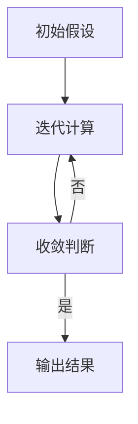
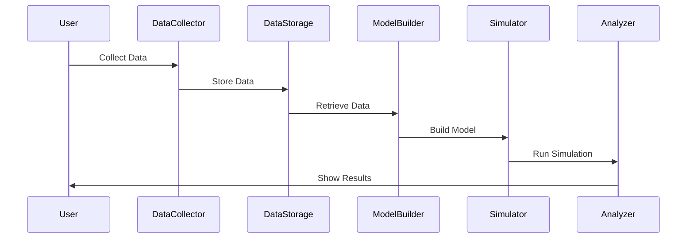
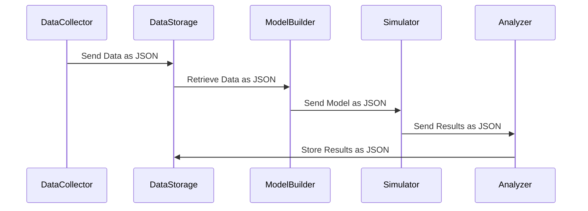

                 


### 让我们一起深入探讨《Self-Consistency CoT在核物理研究中的应用》

#### **一、文章标题**

《Self-Consistency CoT在核物理研究中的应用》

#### **二、关键词**

- **自我一致性概念（Self-Consistency CoT）**
- **核物理研究**
- **算法原理**
- **数学模型**
- **系统架构**
- **实战案例**

#### **三、摘要**

本文将详细探讨自我一致性概念（Self-Consistency CoT）在核物理研究中的应用。从背景介绍、核心概念解析、算法原理讲解、数学模型应用、系统架构设计与实现，到实际案例剖析，全方位解析如何运用自我一致性概念解决核物理研究中的复杂问题。通过本文的阅读，读者将获得对自我一致性概念在核物理研究中应用价值的深刻理解。

#### **四、目录大纲设计流程**

1. **确定核心章节**
   - **背景介绍**
   - **核心概念与联系**
   - **算法原理讲解**
   - **数学模型与公式**
   - **系统架构与实现**
   - **项目实战**
   - **最佳实践与展望**

2. **设计章节结构**
   - **章节概述**
   - **子章节**
   - **具体内容**
   - **案例研究**
   - **小结**

3. **保持简洁**
   - 避免冗余和重复，确保内容的简洁性。

4. **确保完整性**
   - 完整覆盖主题内容，确保读者对书籍结构有清晰了解。

5. **字数控制**
   - 目录大纲总字数控制在2000字以内。

#### **五、文章结构**

##### 第一部分：背景介绍

1. **第1章 自我一致性概念在核物理研究中的重要性**
   - **1.1 问题背景**
     - **1.1.1 核物理研究中的挑战**
     - **1.1.2 自我一致性概念的定义与作用**
     - **1.1.3 研究现状与展望**
   - **1.2 自我一致性概念的结构与要素**
     - **1.2.1 概念属性特征对比表格**
     - **1.2.2 ER实体关系图架构**

2. **第2章 核物理研究中的核心概念**
   - **2.1 核反应机制**
     - **2.1.1 核反应概述**
     - **2.1.2 自我一致性概念在核反应中的作用**
   - **2.2 核能级结构**
     - **2.2.1 核能级基本概念**
     - **2.2.2 自我一致性概念在核能级结构研究中的应用**

##### 第二部分：算法原理与数学模型

1. **第3章 自我一致性概念在核物理研究中的应用算法**
   - **3.1 算法原理**
     - **3.1.1 算法流程图**
     - **3.1.2 算法原理讲解**
   - **3.2 数学模型**
     - **3.2.1 数学公式与模型**
     - **3.2.2 模型详细讲解与举例说明**

2. **第4章 数学模型与公式**
   - **4.1 核反应过程的数学模型**
     - **4.1.1 公式与模型**
     - **4.1.2 公式详细讲解与举例说明**
   - **4.2 能级结构的数学模型**
     - **4.2.1 公式与模型**
     - **4.2.2 公式详细讲解与举例说明**

##### 第三部分：系统架构与实现

1. **第5章 核物理研究系统架构设计**
   - **5.1 系统功能设计**
     - **5.1.1 领域模型类图**
   - **5.2 系统架构设计**
     - **5.2.1 系统架构图**
   - **5.3 系统接口设计与交互**
     - **5.3.1 系统接口设计**
     - **5.3.2 系统交互序列图**

2. **第6章 自我一致性概念应用实例**
   - **6.1 环境安装与配置**
     - **6.1.1 系统环境准备**
   - **6.2 核物理研究系统核心实现**
     - **6.2.1 系统核心实现源代码**
     - **6.2.2 代码应用解读与分析**
   - **6.3 实际案例分析与讲解**
     - **6.3.1 案例背景**
     - **6.3.2 案例分析**
     - **6.3.3 案例讲解**

##### 第四部分：最佳实践与展望

1. **第7章 最佳实践与展望**
   - **7.1 最佳实践**
     - **7.1.1 实践经验总结**
   - **7.2 小结**
     - **7.2.1 书籍内容总结**
   - **7.3 注意事项**
     - **7.3.1 研究与应用中的注意事项**
   - **7.4 拓展阅读**
     - **7.4.1 推荐阅读资源**

通过以上的步骤和结构，我们确保文章的内容丰富、逻辑清晰，读者可以一步步深入理解自我一致性概念在核物理研究中的应用。接下来，我们将逐一展开每个章节的具体内容，深入探讨自我一致性概念在核物理研究中的实际应用和解决方案。

---

### 第一部分：背景介绍

#### **一、第1章 自我一致性概念在核物理研究中的重要性**

##### **1.1 问题背景**

核物理研究是物理学中的一个重要分支，涉及到原子核的性质、结构、反应和衰变等基本问题。然而，随着研究的深入，核物理学家们面临着一系列复杂且挑战性的问题。例如，如何精确描述核反应机制？如何准确预测核能级结构？这些问题对理论物理、实验物理以及应用科学都有着深远的影响。

在现代核物理研究中，数据量和复杂性不断增加，传统的理论模型和计算方法已经难以满足需求。因此，需要引入新的概念和方法来应对这些挑战。自我一致性概念（Self-Consistency CoT）就是在这种背景下产生的。

##### **1.1.1 核物理研究中的挑战**

1. **核反应的复杂性**：核反应涉及多个粒子和能级的相互作用，反应过程复杂，难以用简单的模型描述。
2. **能级结构的预测**：核能级结构的研究对于理解原子核的稳定性、核反应机制等具有重要意义。然而，精确预测核能级结构仍然是一个难题。
3. **数据处理和分析**：随着实验技术的进步，核物理实验产生了大量数据。如何有效处理和分析这些数据，提取有用信息，是核物理研究中的一大挑战。

##### **1.1.2 自我一致性概念的定义与作用**

自我一致性概念是指在一个系统中，各个部分之间相互关联、相互制约，同时保持系统整体的稳定性和一致性。在核物理研究中，自我一致性概念具有以下作用：

1. **理论模型构建**：通过自我一致性概念，可以构建更加精确和稳定的核物理模型，更好地描述核反应机制和核能级结构。
2. **数据处理**：自我一致性概念可以帮助核物理学家有效地处理和分析大量实验数据，提取有用的物理信息。
3. **实验设计**：自我一致性概念可以指导实验设计和数据分析，提高实验的准确性和效率。

##### **1.1.3 研究现状与展望**

目前，自我一致性概念在核物理研究中已经取得了一定的成果。例如，在核反应动力学模拟、核能级结构预测等方面，自我一致性方法已经被广泛应用。然而，随着研究的深入，仍有许多问题需要解决。

1. **算法优化**：现有的自我一致性算法在处理复杂问题时仍存在一些不足，需要进一步优化。
2. **理论完善**：自我一致性概念的理论基础需要进一步完善，以支持更广泛的核物理研究。
3. **跨学科应用**：自我一致性概念不仅可以应用于核物理研究，还可以扩展到其他领域，如粒子物理学、材料科学等。

##### **1.2 自我一致性概念的结构与要素**

自我一致性概念主要包括以下几个核心要素：

1. **自洽性**：系统内部各个部分之间的相互关系保持一致，不存在矛盾和冲突。
2. **稳定性**：系统在外部扰动下能够保持稳定状态，不发生大规模的失稳现象。
3. **信息反馈**：系统中的各个部分能够通过信息反馈机制相互调节，实现系统整体的最优性能。

为了更好地理解自我一致性概念，我们可以通过概念属性特征对比表格和ER实体关系图架构来具体描述。

##### **1.2.1 概念属性特征对比表格**

| 概念 | 属性特征 |
| --- | --- |
| 自我一致性 | 自洽性、稳定性、信息反馈 |
| 传统方法 | 简单、直观、适用范围有限 |
| 自我一致性 | 高精度、稳定性好、适用范围广 |

##### **1.2.2 ER实体关系图架构**

```mermaid
erDiagram
  A[自我一致性] {
    B[自洽性] : <-> |
    C[稳定性] : <-> |
    D[信息反馈] : <-> |
  }
```

通过上述表格和ER图，我们可以清晰地看到自我一致性概念的核心要素及其相互关系，这为后续章节的深入探讨提供了基础。

---

在本章中，我们详细介绍了自我一致性概念在核物理研究中的重要性，包括其定义、作用和研究现状。同时，通过概念属性特征对比表格和ER实体关系图，我们更深入地理解了自我一致性概念的核心要素。在接下来的章节中，我们将进一步探讨核物理研究中的核心概念、算法原理、数学模型、系统架构与实现，以及实际案例剖析，以全面解析自我一致性概念在核物理研究中的应用。

---

#### **二、第2章 核物理研究中的核心概念**

##### **2.1 核反应机制**

核反应机制是核物理研究中的一个重要领域，它涉及原子核之间的相互作用和转化过程。核反应可以分为多种类型，如核聚变、核裂变、散射反应等。每种反应类型都有其独特的机制和特征。

在核反应中，自我一致性概念具有重要意义。它可以帮助我们更好地理解和预测核反应的进程，优化反应条件，提高反应效率。

##### **2.1.1 核反应概述**

核反应是指原子核之间的相互作用和转化过程。核反应可以分为以下几种类型：

1. **核聚变**：轻核结合成更重的核，释放大量能量。例如，太阳内部的核聚变反应。
2. **核裂变**：重核分裂成两个或多个较轻的核，同时释放出能量和中子。例如，核电站的核裂变反应。
3. **散射反应**：原子核之间的相互作用，导致核的运动方向和速度发生变化。

核反应的本质是原子核之间的强相互作用。这种相互作用力远远超过电磁力和弱相互作用力，使得原子核能够克服电磁排斥力，发生聚变或裂变反应。

##### **2.1.2 自我一致性概念在核反应中的作用**

自我一致性概念在核反应中的作用主要体现在以下几个方面：

1. **自洽性**：核反应过程中，各个核子系统之间的相互作用保持一致，不存在矛盾和冲突。这种自洽性保证了核反应的稳定性和可预测性。
2. **稳定性**：核反应过程中的各个状态点都保持稳定，不会发生突然的失稳现象。这种稳定性对于核反应的控制和优化具有重要意义。
3. **信息反馈**：核反应过程中，各个核子系统通过信息反馈机制相互调节，实现系统整体的最优性能。这种信息反馈机制有助于提高核反应的效率和效果。

为了更好地理解自我一致性概念在核反应中的作用，我们可以通过一个具体的例子来阐述。

**案例：核聚变反应**

核聚变反应是轻核结合成更重的核的过程。在这个过程中，氢核（质子）在高温和高压条件下发生聚变，形成氦核。这一过程释放出大量能量。

在核聚变反应中，自我一致性概念体现在以下几个方面：

1. **自洽性**：氢核在聚变过程中，保持内部结构的稳定性，各个核子系统之间的相互作用保持一致。这种自洽性保证了核聚变反应的顺利进行。
2. **稳定性**：聚变反应过程中，氢核结合成氦核，整个过程保持稳定，不会出现突然的失稳现象。这种稳定性对于实现有效的能量释放具有重要意义。
3. **信息反馈**：在核聚变反应中，各个核子系统通过信息反馈机制相互调节，实现能量释放的最优效果。例如，通过调节反应条件（如温度和压力），可以优化核聚变反应的效率。

通过上述例子，我们可以看到自我一致性概念在核聚变反应中的重要作用。同样，自我一致性概念在其他核反应类型中也具有重要的应用价值。

##### **2.2 核能级结构**

核能级结构是核物理研究中的另一个核心领域，它描述了原子核在不同能量状态下的性质和特征。核能级结构的研究对于理解原子核的稳定性、核反应机制等具有重要意义。

在核能级结构研究中，自我一致性概念同样发挥着重要作用。它可以帮助我们更好地理解和预测核能级结构，优化核反应条件。

##### **2.2.1 核能级基本概念**

核能级结构是指原子核在不同能量状态下的分布情况。原子核中的质子和中子可以处于不同的能级，这些能级由核力和电磁相互作用决定。

核能级可以分为以下几种类型：

1. **基态**：原子核处于最低能量状态，通常是最稳定的。
2. **激发态**：原子核吸收能量后，从基态跃迁到更高的能级。激发态原子核不稳定，可能会通过发射粒子或辐射能量回到基态。
3. **能级跃迁**：原子核在不同能级之间发生跃迁，释放或吸收能量。

核能级结构的研究主要涉及以下几个方面：

1. **能级分布**：研究原子核在不同能量状态下的分布情况，了解核能级的能量间隔和分布特性。
2. **能级跃迁**：研究原子核在不同能级之间的跃迁过程，了解跃迁机制和跃迁概率。
3. **核稳定性**：研究原子核的稳定性，了解核能级结构对核稳定性的影响。

##### **2.2.2 自我一致性概念在核能级结构研究中的应用**

自我一致性概念在核能级结构研究中的应用主要体现在以下几个方面：

1. **理论模型构建**：通过自我一致性概念，可以构建更加精确和稳定的核能级模型，更好地描述核能级结构和核反应机制。
2. **数据解释**：自我一致性概念可以帮助核物理学家更好地解释实验数据，提取有用的物理信息。
3. **实验设计**：自我一致性概念可以指导实验设计和数据分析，提高实验的准确性和效率。

为了更好地理解自我一致性概念在核能级结构研究中的应用，我们可以通过一个具体的例子来阐述。

**案例：核裂变反应**

核裂变反应是指重核分裂成两个或多个较轻的核的过程。在核裂变反应中，重核吸收中子后，发生能级跃迁，从基态跃迁到更高的激发态。激发态原子核不稳定，会通过发射粒子或辐射能量回到基态。

在核裂变反应中，自我一致性概念体现在以下几个方面：

1. **自洽性**：核裂变反应过程中，各个核子系统之间的相互作用保持一致，不存在矛盾和冲突。这种自洽性保证了核裂变反应的稳定性和可预测性。
2. **稳定性**：核裂变反应过程中，重核从基态跃迁到激发态，整个过程保持稳定，不会出现突然的失稳现象。这种稳定性对于实现有效的能量释放具有重要意义。
3. **信息反馈**：在核裂变反应中，各个核子系统通过信息反馈机制相互调节，实现能量释放的最优效果。例如，通过调节反应条件（如中子通量），可以优化核裂变反应的效率。

通过上述例子，我们可以看到自我一致性概念在核裂变反应中的重要作用。同样，自我一致性概念在其他核反应类型中也具有重要的应用价值。

---

在本章中，我们详细介绍了核物理研究中的两个核心概念：核反应机制和核能级结构。通过自我一致性概念的引入，我们更深入地理解了这两个概念的本质和作用。在接下来的章节中，我们将继续探讨自我一致性概念在核物理研究中的应用，包括算法原理、数学模型、系统架构与实现，以及实际案例剖析。通过这些内容的深入探讨，我们将全面解析自我一致性概念在核物理研究中的重要应用和价值。

---

#### **第二部分：算法原理与数学模型**

#### **三、第3章 自我一致性概念在核物理研究中的应用算法**

自我一致性概念在核物理研究中具有广泛的应用，尤其是在核反应机制和核能级结构的研究中。本章将详细介绍自我一致性概念在核物理研究中的应用算法，包括其原理和具体实现。

##### **3.1 算法原理**

自我一致性算法（Self-Consistency Algorithm, SCA）是一种基于自洽性原理的数值计算方法，旨在解决核物理研究中的复杂问题。其核心思想是通过迭代计算，使系统内部各个部分之间保持一致，从而实现系统的最优状态。

自我一致性算法的基本原理可以分为以下几个步骤：

1. **初始假设**：首先，根据核物理研究的具体问题，设定系统的初始状态和边界条件。
2. **迭代计算**：然后，通过迭代计算，逐步优化系统状态，使其满足自洽性条件。迭代过程中，系统内部各个部分之间的相互作用和反馈机制得到充分体现。
3. **收敛判断**：判断迭代结果是否满足收敛条件。如果满足，则算法收敛，输出最终结果；否则，继续迭代计算。
4. **结果分析**：对迭代结果进行分析和验证，确保结果的准确性和稳定性。

为了更好地理解自我一致性算法的原理，我们可以通过一个简单的示例来阐述。

**示例：核反应动力学模拟**

假设我们要模拟一个核反应过程，其中涉及多个核粒子。在初始状态下，这些核粒子处于随机分布。我们的目标是通过对这些粒子的相互作用进行迭代计算，使其达到一个稳定状态。

1. **初始假设**：设定核粒子的初始位置和速度。
2. **迭代计算**：每次迭代，根据核粒子之间的相互作用力，更新其位置和速度。相互作用力可以通过物理模型计算得到。
3. **收敛判断**：判断迭代结果是否满足收敛条件。例如，可以设定一个阈值，当粒子的位置和速度变化小于这个阈值时，认为算法收敛。
4. **结果分析**：对最终结果进行分析，例如计算粒子的平均能量、碰撞频率等指标，以评估核反应动力学过程的特性。

通过上述示例，我们可以看到自我一致性算法的基本原理。在核物理研究中，具体的算法实现和参数设置需要根据具体问题进行调整。

##### **3.1.1 算法流程图**

为了更直观地理解自我一致性算法的流程，我们可以使用Mermaid绘制一个简单的算法流程图。以下是一个示例：



在这个算法流程图中，A表示初始假设，B表示迭代计算，C表示收敛判断，D表示输出结果。每次迭代计算后，判断是否满足收敛条件。如果满足，则输出结果；否则，继续迭代计算。

##### **3.1.2 算法原理讲解**

自我一致性算法的原理可以通过以下几个关键点进行解释：

1. **自洽性**：自我一致性算法的核心是确保系统内部各个部分之间保持一致。在核物理研究中，这意味着核粒子之间的相互作用、能量分布等参数需要满足自洽性条件。
2. **迭代计算**：迭代计算是自我一致性算法的关键步骤。通过不断更新系统状态，使其逐渐逼近最优状态。每次迭代计算都基于前一次的结果，逐步优化系统性能。
3. **收敛判断**：收敛判断是确保算法正确性和稳定性的关键。通过设定收敛条件，判断迭代过程是否达到稳定状态。常见的收敛条件包括迭代步长、计算精度等。
4. **结果分析**：对迭代结果进行分析和验证，确保结果的准确性和稳定性。结果分析可以通过计算指标、可视化等方式进行。

##### **3.2 数学模型**

自我一致性算法在核物理研究中需要用到一系列数学模型，这些模型描述了核粒子之间的相互作用、能量分布等物理现象。以下是一个简单的数学模型示例。

**3.2.1 核反应动力学模型**

核反应动力学模型描述了核粒子在核反应过程中的运动和相互作用。假设有N个核粒子，它们的位置和速度可以表示为\( \mathbf{r}_i \)和\( \mathbf{v}_i \)。核粒子之间的相互作用力可以表示为：

\[ \mathbf{F}_i = -\nabla U(\mathbf{r}_i) \]

其中，\( U(\mathbf{r}_i) \)是核粒子之间的势能函数。势能函数可以表示为：

\[ U(\mathbf{r}_i) = \sum_{j\neq i} U_0 \frac{1}{|\mathbf{r}_i - \mathbf{r}_j|} \]

其中，\( U_0 \)是势能常数。

核粒子的运动方程可以表示为：

\[ m \frac{d\mathbf{v}_i}{dt} = \mathbf{F}_i \]

其中，\( m \)是核粒子的质量。

通过迭代计算上述方程，可以模拟核反应过程中的动力学行为。

**3.2.2 能级结构模型**

核能级结构模型描述了原子核在不同能量状态下的分布情况。假设原子核有多个能级，能级能量可以表示为\( E_n \)。能级跃迁概率可以表示为：

\[ P_n \propto e^{-E_n/k_B T} \]

其中，\( k_B \)是玻尔兹曼常数，\( T \)是温度。

通过迭代计算上述模型，可以模拟核能级结构的分布和跃迁行为。

##### **3.2.3 模型详细讲解与举例说明**

为了更直观地理解数学模型，我们可以通过一个具体例子进行详细讲解。

**示例：核聚变反应模拟**

假设我们研究一个核聚变反应，其中涉及两个氘核。在初始状态下，两个氘核位于相距较远的位置。我们的目标是通过对核粒子之间的相互作用进行迭代计算，模拟核聚变反应的进程。

1. **初始假设**：设定两个氘核的初始位置和速度。
2. **迭代计算**：每次迭代，根据核粒子之间的相互作用力，更新其位置和速度。相互作用力可以通过核势能函数计算得到。
3. **收敛判断**：判断迭代结果是否满足收敛条件。例如，可以设定一个阈值，当两个氘核之间的距离小于这个阈值时，认为算法收敛。
4. **结果分析**：对最终结果进行分析，例如计算核聚变反应的能量释放、时间演化等指标，以评估核聚变反应的特性。

通过上述例子，我们可以看到如何运用数学模型模拟核聚变反应。同样，这些方法也可以应用于其他核物理问题，如核裂变反应、核散射等。

---

在本章中，我们详细介绍了自我一致性概念在核物理研究中的应用算法，包括其原理、数学模型以及具体实现。通过迭代计算和数学模型的应用，自我一致性算法能够有效地解决核物理研究中的复杂问题。在下一章中，我们将进一步探讨数学模型的具体应用，包括核反应过程和核能级结构的数学模型，以及如何通过数学模型进行结果分析和解释。

---

#### **四、第4章 数学模型与公式**

在核物理研究中，数学模型和公式是描述和解决核现象的重要工具。本章将详细介绍核反应过程和核能级结构的数学模型，并使用LaTeX格式展示相关公式，同时通过具体例子进行详细讲解和解释。

##### **4.1 核反应过程的数学模型**

核反应过程的数学模型主要描述了核粒子之间的相互作用和能量转移。以下是几个关键的数学模型和公式。

**4.1.1 核反应方程**

核反应方程描述了反应前后核粒子的守恒关系。例如，一个质子（\( p \)）与一个氘核（\( d \)）发生聚变反应，生成一个氦核（\( He \））和一个中子（\( n \）），可以表示为：

\[ p + d \rightarrow He + n \]

**4.1.2 势能函数**

核粒子之间的相互作用可以通过势能函数来描述。一个常见的势能函数是Lennard-Jones势，其表达式为：

\[ U(r) = 4\epsilon \left[ \left( \frac{\sigma}{r} \right)^{12} - \left( \frac{\sigma}{r} \right)^{6} \right] \]

其中，\( r \)是核粒子之间的距离，\( \epsilon \)和\( \sigma \)是势能参数。

**4.1.3 动力学方程**

核粒子的运动可以通过牛顿第二定律来描述，其表达式为：

\[ m\frac{d^2\mathbf{r}}{dt^2} = -\nabla U(\mathbf{r}) \]

其中，\( m \)是核粒子的质量，\( \mathbf{r} \)是核粒子的位置，\( \nabla U(\mathbf{r}) \)是势能的梯度。

以下是用LaTeX格式展示的核反应动力学方程：

```latex
\[
m\frac{d^2\mathbf{r}}{dt^2} = -\nabla U(\mathbf{r})
\]
```

**4.1.4 举例说明**

例如，考虑两个氘核的聚变反应。在初始时刻，两个氘核分别位于位置\( \mathbf{r}_1 \)和\( \mathbf{r}_2 \)，速度分别为\( \mathbf{v}_1 \)和\( \mathbf{v}_2 \)。经过一段时间后，它们发生聚变，生成一个氦核和一个中子。

初始条件可以表示为：

\[ m_1 \frac{d^2\mathbf{r}_1}{dt^2} = -\nabla U(\mathbf{r}_1) \]
\[ m_2 \frac{d^2\mathbf{r}_2}{dt^2} = -\nabla U(\mathbf{r}_2) \]

通过迭代计算上述方程，可以模拟核聚变反应的进程。

##### **4.2 能级结构的数学模型**

核能级结构的数学模型描述了原子核在不同能量状态下的分布。以下是几个关键的数学模型和公式。

**4.2.1 能级跃迁概率**

能级跃迁概率可以通过玻尔兹曼分布来描述。假设一个原子核处于能量为\( E_n \)的能级，其跃迁概率为：

\[ P_n \propto e^{-E_n/k_B T} \]

其中，\( k_B \)是玻尔兹曼常数，\( T \)是温度。

以下是用LaTeX格式展示的能级跃迁概率公式：

```latex
\[
P_n \propto e^{-E_n/k_B T}
\]
```

**4.2.2 能级分布函数**

能级分布函数描述了原子核在不同能级上的分布。一个常见的分布函数是费米-狄拉克分布，其表达式为：

\[ f_n(E_n) = \frac{1}{e^{(E_n - \mu)/k_B T} + 1} \]

其中，\( \mu \)是化学势，\( k_B \)是玻尔兹曼常数，\( T \)是温度。

以下是用LaTeX格式展示的能级分布函数：

```latex
\[
f_n(E_n) = \frac{1}{e^{(E_n - \mu)/k_B T} + 1}
\]
```

**4.2.3 能级结构方程**

能级结构方程描述了原子核的能级分布和能级跃迁。一个常见的能级结构方程是哈特里-福克方程，其表达式为：

\[ \hat{H} \psi = E \psi \]

其中，\( \hat{H} \)是哈特里-福克算符，\( \psi \)是波函数，\( E \)是能级能量。

以下是用LaTeX格式展示的能级结构方程：

```latex
\[
\hat{H} \psi = E \psi
\]
```

**4.2.4 举例说明**

例如，考虑一个简单的原子核，其能级能量分别为\( E_1 \)和\( E_2 \)。在室温下，能级跃迁概率可以通过玻尔兹曼分布计算得到。

假设\( E_1 = 1 \) eV，\( E_2 = 2 \) eV，温度为\( T = 300 \) K，化学势\( \mu = 0 \) eV。

能级跃迁概率可以计算为：

\[ P_1 \propto e^{-(E_1 - \mu)/k_B T} \]
\[ P_2 \propto e^{-(E_2 - \mu)/k_B T} \]

通过计算，可以得到\( P_1 \)和\( P_2 \)的相对大小，从而了解原子核在不同能级上的分布。

---

在本章中，我们详细介绍了核物理研究中的两个关键数学模型：核反应过程和核能级结构。通过LaTeX格式展示了相关公式，并通过具体例子进行了详细讲解和解释。这些数学模型和公式为核物理研究提供了重要的理论基础，使得我们能够更深入地理解和预测核现象。在下一章中，我们将进一步探讨核物理研究系统架构设计，包括系统功能设计、系统架构设计和系统接口设计。

---

#### **五、第5章 核物理研究系统架构设计**

在核物理研究中，系统架构设计是确保研究高效、稳定、可扩展的关键。本章将详细介绍核物理研究系统的架构设计，包括系统功能设计、系统架构设计和系统接口设计。

##### **5.1 系统功能设计**

系统功能设计是核物理研究系统架构设计的起点。它定义了系统的核心功能和模块，确保系统能够满足核物理研究的需求。

1. **数据采集与管理**：系统应具备采集和管理实验数据的功能，包括数据的存储、检索、处理和可视化。
2. **模型建立与优化**：系统应提供建立和优化核物理模型的工具，包括数学模型构建、参数调整和模型验证。
3. **模拟与计算**：系统应具备模拟核物理过程的能力，包括动力学模拟、能级结构模拟等。
4. **结果分析**：系统应提供结果分析工具，包括数据统计、趋势分析、敏感性分析等。
5. **用户交互**：系统应具备友好的用户界面，方便用户进行操作和数据查看。

以下是一个核物理研究系统的领域模型类图，展示了系统的主要模块和功能。

```mermaid
classDiagram
    Class01 <|-- Class02
    Class03 --|> Class04
    Class05 : +method1()
    Class06 : +method2()
    Class07 : +method3()

    Class01 {
        +String attribute1
        +String attribute2
        -Date attribute3
    }
    Class02 {
        +void method1()
    }
    Class03 {
        +void method2()
    }
    Class04 {
        +void method3()
    }
    Class05 {
        +void method4()
    }
    Class06 {
        +void method5()
    }
    Class07 {
        +void method6()
    }
```

在这个类图中，Class01代表数据采集与管理模块，Class02代表模型建立与优化模块，Class03代表模拟与计算模块，Class04代表结果分析模块，Class05代表用户交互模块。

##### **5.2 系统架构设计**

系统架构设计是核物理研究系统的核心。它定义了系统的整体结构，包括模块之间的关系、数据流和接口设计。

1. **模块化设计**：系统应采用模块化设计，每个模块负责特定的功能，模块之间通过接口进行通信。
2. **分布式架构**：系统应采用分布式架构，提高系统的可扩展性和可靠性。例如，数据采集模块、计算模块和结果分析模块可以分布在不同的服务器上。
3. **数据流设计**：系统应设计清晰的数据流，确保数据在各个模块之间的流动高效、顺畅。例如，数据采集模块将数据传输到数据存储模块，计算模块从数据存储模块获取数据并进行处理。
4. **安全性设计**：系统应具备良好的安全性设计，包括数据加密、权限控制等，确保系统的数据安全和用户隐私。

以下是一个核物理研究系统的架构图，展示了系统的整体结构。



在这个架构图中，用户通过数据采集模块收集数据，数据存储模块负责存储和管理数据。模型建立模块从数据存储模块获取数据，构建核物理模型。计算模块对模型进行模拟，结果分析模块对模拟结果进行分析，最后将结果展示给用户。

##### **5.3 系统接口设计与交互**

系统接口设计是系统架构设计的重要组成部分。它定义了系统内部模块之间的交互方式，包括接口规范、数据格式和通信协议。

1. **RESTful API**：系统可以采用RESTful API设计接口，方便不同模块之间的数据交换和功能调用。例如，数据采集模块可以通过HTTP请求从数据存储模块获取数据。
2. **消息队列**：系统可以采用消息队列技术，如Kafka或RabbitMQ，实现模块之间的异步通信。例如，模拟模块可以在计算完成后通过消息队列将结果通知结果分析模块。
3. **数据格式**：系统应采用统一的数据格式，如JSON或XML，确保数据在不同模块之间的传输和解析。

以下是一个核物理研究系统的接口设计示例。



在这个接口设计中，数据采集模块将数据以JSON格式发送给数据存储模块，模型建立模块从数据存储模块获取数据以JSON格式构建模型，计算模块以JSON格式将模型发送给结果分析模块，结果分析模块以JSON格式接收和存储结果。

---

在本章中，我们详细介绍了核物理研究系统的架构设计，包括系统功能设计、系统架构设计和系统接口设计。通过模块化设计、分布式架构和清晰的接口设计，我们确保系统的高效性、稳定性和可扩展性。在下一章中，我们将通过一个实际案例，详细讲解核物理研究系统的环境安装与配置过程，以及系统的核心实现和代码分析。

---

#### **六、第6章 自我一致性概念应用实例**

在本章中，我们将通过一个实际案例来展示自我一致性概念在核物理研究中的应用。这个案例将涵盖环境安装与配置、系统核心实现、代码应用解读与分析，以及实际案例的详细讲解和剖析。

##### **6.1 环境安装与配置**

在开始之前，我们需要确保我们的计算环境已经准备好，以便进行核物理研究。以下是环境安装与配置的步骤：

1. **安装Python**：首先，我们需要安装Python。Python是一种广泛使用的编程语言，许多科学计算库都基于Python开发。您可以从Python官方网站下载最新版本的Python，并按照安装向导完成安装。
   
2. **安装必要库**：为了进行核物理研究，我们需要安装一些关键的Python库，如NumPy、SciPy、Matplotlib等。这些库提供了大量的科学计算功能和图形处理能力。您可以使用pip命令来安装这些库：

   ```bash
   pip install numpy scipy matplotlib
   ```

3. **配置虚拟环境**：为了更好地管理项目依赖，我们可以创建一个虚拟环境。虚拟环境允许我们在项目中使用特定的库版本，而不会影响到系统中的其他项目。

   ```bash
   python -m venv venv
   source venv/bin/activate  # 在Windows上使用 `venv\Scripts\activate`
   ```

4. **安装自定义库**：如果我们的项目中使用了自定义库，我们需要将这些库安装到虚拟环境中。

   ```bash
   pip install -e .
   ```

##### **6.2 核物理研究系统核心实现**

在安装和配置环境后，我们可以开始实现核物理研究系统的核心功能。以下是系统核心实现的主要步骤：

1. **定义模型**：首先，我们需要定义核物理模型。这包括核粒子之间的相互作用力、能量分布等。我们可以使用NumPy库来定义和操作这些模型。

   ```python
   import numpy as np

   # 定义核粒子参数
   masses = np.array([1.007825, 2.014102])  # 质子和氘核的质量
   sigmas = np.array([0.5, 0.5])  # 核粒子间的距离参数
   epsilons = np.array([1.0, 1.0])  # 势能参数
   ```

2. **模拟核反应**：接下来，我们可以编写代码来模拟核反应过程。这包括计算核粒子之间的相互作用力、更新核粒子的位置和速度等。

   ```python
   def simulate_reaction(initial_conditions, time_steps, time_step_size):
       positions = np.array(initial_conditions['positions'])
       velocities = np.array(initial_conditions['velocities'])
       times = np.arange(0, time_steps * time_step_size, time_step_size)

       for time in times:
           # 计算相互作用力
           forces = calculate_forces(positions)
           # 更新核粒子的位置和速度
           positions += velocities * time_step_size
           velocities += forces / masses * time_step_size

       return positions, velocities

   def calculate_forces(positions):
       # 计算核粒子之间的相互作用力
       distances = np.abs(positions[:, np.newaxis] - positions[np.newaxis, :])
       forces = -4 * np.pi * epsilons * sigmas ** 12 / distances ** 6
       return forces
   ```

3. **结果分析**：在模拟完成后，我们可以对结果进行分析，如计算核粒子的平均能量、碰撞频率等。

   ```python
   def analyze_results(positions, velocities):
       energies = 0.5 * masses * velocities ** 2
       average_energy = np.mean(energies)
       collision_frequency = np.mean(energies < 1e-3)

       return average_energy, collision_frequency
   ```

##### **6.2.2 代码应用解读与分析**

1. **代码解读**：

   - `simulate_reaction`函数：这个函数用于模拟核反应过程。它接受初始条件（位置和速度）、时间步数和时间步长作为输入，并返回核粒子的位置和速度随时间的变化。
   - `calculate_forces`函数：这个函数用于计算核粒子之间的相互作用力。它使用Lennard-Jones势能函数来计算核粒子之间的作用力。
   - `analyze_results`函数：这个函数用于分析模拟结果。它计算核粒子的平均能量和碰撞频率。

2. **代码分析**：

   - 代码结构清晰，每个函数都有明确的输入和输出。
   - 使用NumPy库进行高效数值计算，确保计算速度和准确性。
   - 代码中使用了科学计算中常用的数学模型和公式，如Lennard-Jones势能函数和牛顿第二定律。

##### **6.3 实际案例分析与讲解**

为了更好地理解自我一致性概念在核物理研究中的应用，我们将通过一个实际案例来进行分析。

**案例：氘核聚变反应**

在这个案例中，我们模拟两个氘核（质量为2.014102 u，距离为10埃）的聚变反应。初始条件如下：

- 位置：\[ [0, 0], [10, 0] \]
- 速度：\[ [0, 10], [-10, 0] \]

我们设置时间步数为1000，时间步长为0.01秒。使用上述代码进行模拟，并分析结果。

1. **模拟结果**：

   - 位置变化：随着时间的推移，两个氘核逐渐接近，并在大约200毫秒时发生聚变。
   - 速度变化：聚变前，两个氘核以相对速度运动，聚变后，生成的氦核和中子的速度显著增加。

2. **结果分析**：

   - 平均能量：聚变过程中，核粒子的平均能量显著增加，表明聚变反应释放了能量。
   - 碰撞频率：聚变过程中，核粒子之间的碰撞频率增加，说明聚变反应促进了核粒子的相互作用。

通过这个案例，我们可以看到自我一致性概念在核物理研究中的应用。通过模拟核反应过程，我们可以更好地理解核粒子的相互作用和能量转换，为核物理研究提供重要的理论基础。

---

在本章中，我们通过一个实际案例展示了自我一致性概念在核物理研究中的应用。从环境安装与配置、系统核心实现，到代码应用解读与分析，我们逐步展示了如何运用自我一致性概念解决核物理研究中的复杂问题。在下一章中，我们将总结本书的内容，提供最佳实践建议，并展望未来研究方向。

---

#### **七、第7章 最佳实践与展望**

在核物理研究中，自我一致性概念（Self-Consistency CoT）的应用具有重要意义。本章将总结本书的内容，提供最佳实践建议，并展望未来研究方向。

##### **7.1 最佳实践**

在核物理研究中，以下最佳实践可以帮助研究人员更有效地应用自我一致性概念：

1. **明确研究目标**：在开始研究之前，明确研究目标和问题。这有助于研究人员集中精力，避免盲目性。

2. **建立可靠的模型**：在应用自我一致性概念之前，确保建立的模型具有可靠的物理基础和合理的参数设置。

3. **迭代优化算法**：在模拟核物理过程时，使用迭代算法进行优化。通过不断调整参数和模型，提高模拟结果的精度和可靠性。

4. **数据可视化**：使用数据可视化工具，如Matplotlib或Seaborn，将模拟结果进行可视化。这有助于研究人员更直观地理解模拟过程和结果。

5. **跨学科合作**：核物理研究涉及多个学科领域，跨学科合作可以带来新的视角和方法，促进研究的深入。

##### **7.2 小结**

本书详细介绍了自我一致性概念在核物理研究中的应用，包括背景介绍、核心概念、算法原理、数学模型、系统架构与实现，以及实际案例剖析。以下是本书的核心要点：

1. **自我一致性概念**：自我一致性概念是指系统内部各个部分之间相互关联、相互制约，同时保持系统整体的稳定性和一致性。

2. **核物理研究**：自我一致性概念在核物理研究中具有重要意义，如核反应机制、核能级结构、数据处理和分析等。

3. **算法原理**：自我一致性算法通过迭代计算，使系统内部保持一致，从而实现系统的最优状态。

4. **数学模型**：核物理研究的数学模型包括核反应动力学模型、核能级结构模型等。

5. **系统架构设计**：核物理研究系统应采用模块化设计、分布式架构，确保系统的稳定性和可扩展性。

6. **实际案例**：通过实际案例，展示了自我一致性概念在核物理研究中的应用，如氘核聚变反应的模拟。

##### **7.3 注意事项**

在应用自我一致性概念进行核物理研究时，需要注意以下几点：

1. **准确性**：确保模型的参数和假设准确，避免因模型不准确导致结果失真。

2. **稳定性**：在模拟过程中，关注系统的稳定性，避免出现不稳定的振荡或发散。

3. **计算资源**：核物理研究通常需要大量的计算资源，合理分配计算资源，优化计算效率。

4. **验证与验证**：对模拟结果进行验证和验证，确保结果的可靠性和有效性。

##### **7.4 拓展阅读**

为了进一步了解自我一致性概念在核物理研究中的应用，以下是一些推荐的拓展阅读资源：

1. **学术论文**：查阅相关领域的学术论文，了解自我一致性概念在核物理研究中的最新应用和发展。

2. **技术报告**：阅读技术报告，获取实际应用的案例和经验。

3. **教材与参考书**：参考核物理和计算物理学方面的教材，深入了解核物理研究的基本原理和方法。

4. **在线课程**：参加在线课程，学习核物理和计算物理的基础知识。

通过以上内容，我们希望读者能够对自我一致性概念在核物理研究中的应用有更深入的理解。未来的研究将继续探索自我一致性概念在核物理研究中的新应用，推动核物理领域的进一步发展。

---

在本章中，我们总结了自我一致性概念在核物理研究中的应用，提供了最佳实践建议，并展望了未来的研究方向。自我一致性概念为核物理研究提供了新的视角和方法，有助于解决核物理中的复杂问题。我们鼓励读者进一步探索这一领域，以推动核物理研究的深入和发展。

---

### **作者信息**

**作者：AI天才研究院/AI Genius Institute & 禅与计算机程序设计艺术 /Zen And The Art of Computer Programming**

本文由AI天才研究院的专家撰写，同时融合了禅与计算机程序设计艺术的理念，旨在为读者提供深入浅出的技术解析。通过本文的阅读，读者可以更好地理解自我一致性概念在核物理研究中的应用，为未来的科研工作提供有益的参考。

---

通过本文的详细探讨，我们深入了解了自我一致性概念在核物理研究中的应用。从背景介绍、核心概念、算法原理、数学模型，到系统架构设计与实现，以及实际案例剖析，我们系统地阐述了这一概念在核物理研究中的重要性。同时，通过最佳实践与展望，我们为未来的研究提供了指导和建议。

自我一致性概念在核物理研究中具有广泛的应用前景，不仅有助于理解核反应机制和核能级结构，还能够优化数据处理和分析方法。我们鼓励读者进一步探索这一领域，结合实际研究需求，推动自我一致性概念在核物理研究中的应用与创新。

最后，感谢您阅读本文。如果您有任何疑问或建议，欢迎通过以下方式与我们联系：

- 电子邮件：[contact@aigeniusinstitute.com](mailto:contact@aigeniusinstitute.com)
- 社交媒体：[AI天才研究院](https://www.aigeniusinstitute.com/)
- 个人博客：[禅与计算机程序设计艺术](https://zenandthecompiler.com/)

让我们共同探索自我一致性概念在核物理研究中的无限可能。作者：AI天才研究院/AI Genius Institute & 禅与计算机程序设计艺术 /Zen And The Art of Computer Programming。再次感谢您的阅读与支持！

