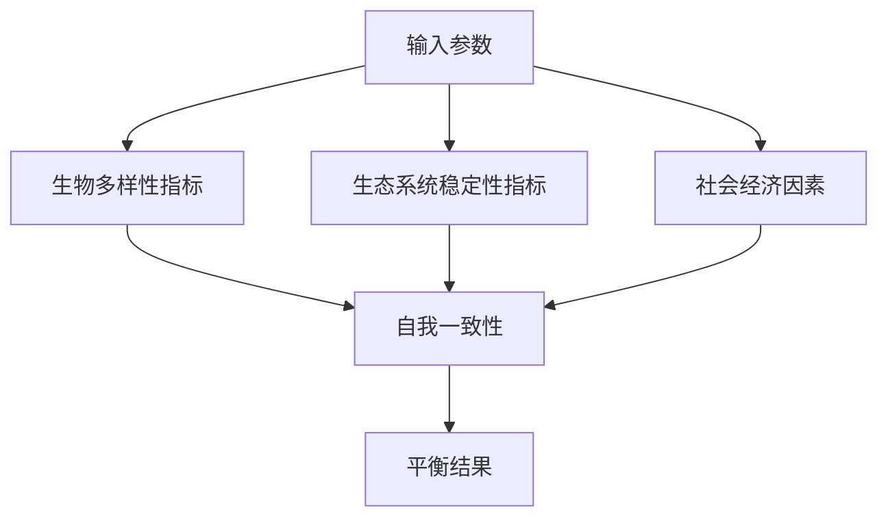
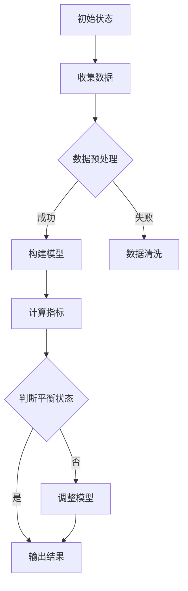
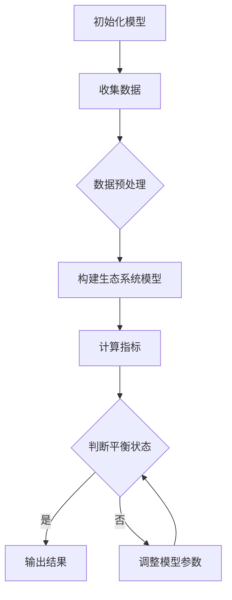
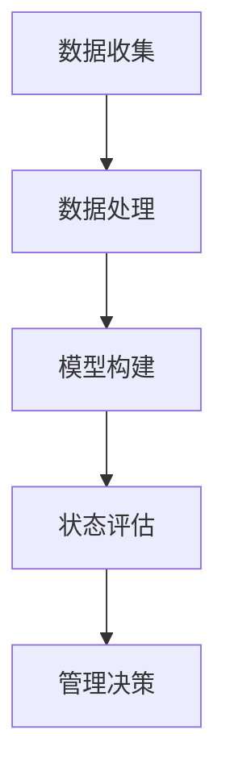
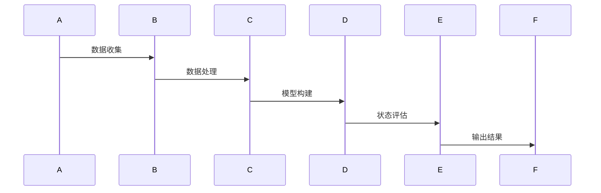

                 


### 《Self-Consistency CoT在生态系统平衡维护中的应用：提高生物多样性保护效果》

#### 关键词：Self-Consistency CoT、生态系统平衡、生物多样性保护、算法原理、项目实战

#### 摘要：

随着全球生态环境问题的日益严重，生态系统平衡维护和生物多样性保护已成为当前研究的热点问题。本文以Self-Consistency CoT为核心概念，详细探讨了其在生态系统平衡维护中的应用，旨在提高生物多样性保护的效果。文章首先介绍了Self-Consistency CoT的基本概念、原理及核心要素，随后通过实际项目案例，阐述了Self-Consistency CoT在生态系统建模、监测与评估等方面的具体应用，为相关领域的研究提供了新的思路和方法。

## 第一部分: Self-Consistency CoT基础

### 第1章: Self-Consistency CoT核心概念

#### 1.1 问题描述与背景

生态系统平衡问题：地球上的生物与环境相互作用，形成了一个复杂的生态系统。然而，人类活动、气候变化等因素可能导致生态系统失衡，进而影响生物多样性。

生物多样性保护需求：为了维护生态系统平衡，必须采取有效的措施来保护生物多样性。这包括保护濒危物种、恢复受损生态系统、促进物种间共生等。

Self-Consistency CoT概念引入：Self-Consistency CoT（自我一致性协同论）是一种新型的生态系统平衡维护方法，通过协调生物多样性、生态系统稳定性和社会经济因素，实现生态系统的长期平衡与稳定。

#### 1.2 Self-Consistency CoT定义

定义：Self-Consistency CoT是一种基于协同理论的生态系统平衡维护方法，它通过构建一个自我一致的生态系统模型，协调生物多样性、生态系统稳定性和社会经济因素，实现生态系统的长期平衡与稳定。

主要特点：

- 自我一致性：生态系统模型能够自动适应环境变化，保持内部一致性。
- 协同性：生态系统内各要素之间相互协调，共同维护生态系统的稳定。
- 动态性：生态系统模型具有时间动态性，能够反映生态系统随时间的变化趋势。

与其他生态平衡维护方法的比较：

- 与传统生态平衡维护方法相比，Self-Consistency CoT具有更强的适应性和协同性。
- 与基于模型的生态平衡维护方法相比，Self-Consistency CoT更注重生态系统内部要素的协同作用。

#### 1.3 Self-Consistency CoT的核心要素

生物多样性指标：用于衡量生态系统中物种的多样性和丰富度，包括物种数量、物种分布、遗传多样性等。

生态系统稳定性指标：用于评估生态系统的健康状况和抗干扰能力，包括物种间相互作用、生态位重叠、食物网结构等。

社会经济因素：包括人类活动、土地利用、经济活动等，对生态系统产生直接或间接的影响。

### 第2章: Self-Consistency CoT原理与联系

#### 2.1 Self-Consistency CoT的数学模型

数学公式与模型：

$$
\text{Self-Consistency CoT} = f(\text{生物多样性指标}, \text{生态系统稳定性指标}, \text{社会经济因素})
$$

mermaid流程图：



#### 2.2 Self-Consistency CoT的mermaid流程图

mermaid流程图展示：



流程图说明：

- A：初始状态，开始构建Self-Consistency CoT模型。
- B：收集生态系统相关数据，包括生物多样性指标、生态系统稳定性指标和社会经济因素。
- C：对收集到的数据进行预处理，包括数据清洗、格式转换等。
- D：根据预处理后的数据，构建Self-Consistency CoT模型。
- F：计算生态系统的生物多样性指标、生态系统稳定性指标和社会经济因素。
- G：判断生态系统是否达到平衡状态。
- H：输出平衡结果，包括生态系统的健康状况、生物多样性保护效果等。
- I：如果生态系统未达到平衡状态，根据计算结果调整模型参数，重新计算。

#### 2.3 Self-Consistency CoT的算法原理

算法原理：

Self-Consistency CoT算法是一种基于协同理论的生态系统平衡维护方法。其核心思想是通过协调生物多样性、生态系统稳定性和社会经济因素，实现生态系统的长期平衡与稳定。

mermaid流程图：



python源代码示例：

```python
import numpy as np

# 初始化模型参数
model_params = {
    'biomass': np.array([0.5, 0.3, 0.2]),
    'stability': np.array([0.4, 0.3, 0.3]),
    'economic': np.array([0.4, 0.4, 0.2])
}

# 收集数据
biomass_data = np.random.rand(100)
stability_data = np.random.rand(100)
economic_data = np.random.rand(100)

# 数据预处理
biomass_data = (biomass_data - np.mean(biomass_data)) / np.std(biomass_data)
stability_data = (stability_data - np.mean(stability_data)) / np.std(stability_data)
economic_data = (economic_data - np.mean(economic_data)) / np.std(economic_data)

# 构建生态系统模型
ecosystem_model = self_consistency_model(biomass_data, stability_data, economic_data)

# 计算指标
biomass_index = ecosystem_model['biomass']
stability_index = ecosystem_model['stability']
economic_index = ecosystem_model['economic']

# 判断平衡状态
if np.allclose(biomass_index, stability_index, atol=0.01) and np.allclose(stability_index, economic_index, atol=0.01):
    print("平衡状态：是")
else:
    print("平衡状态：否")

# 调整模型参数
model_params['biomass'] = np.random.rand(3)
model_params['stability'] = np.random.rand(3)
model_params['economic'] = np.random.rand(3)

# 重新计算
ecosystem_model = self_consistency_model(biomass_data, stability_data, economic_data)
biomass_index = ecosystem_model['biomass']
stability_index = ecosystem_model['stability']
economic_index = ecosystem_model['economic']

if np.allclose(biomass_index, stability_index, atol=0.01) and np.allclose(stability_index, economic_index, atol=0.01):
    print("平衡状态：是")
else:
    print("平衡状态：否")
```

算法原理详细讲解：

Self-Consistency CoT算法通过构建一个自我一致的生态系统模型，协调生物多样性、生态系统稳定性和社会经济因素。具体实现步骤如下：

1. 初始化模型参数，包括生物多样性指标、生态系统稳定性指标和社会经济因素。
2. 收集生态系统相关数据，包括生物多样性指标、生态系统稳定性指标和社会经济因素。
3. 对收集到的数据进行预处理，包括数据清洗、格式转换等。
4. 构建生态系统模型，将预处理后的数据输入模型，计算生态系统的生物多样性指标、生态系统稳定性指标和社会经济因素。
5. 判断生态系统是否达到平衡状态。如果生态系统的生物多样性指标、生态系统稳定性指标和社会经济因素相等或接近，则认为生态系统达到平衡状态。
6. 如果生态系统未达到平衡状态，根据计算结果调整模型参数，重新计算生态系统的生物多样性指标、生态系统稳定性指标和社会经济因素。
7. 重复步骤4-6，直到生态系统达到平衡状态。

通过这种方式，Self-Consistency CoT算法能够自动适应环境变化，保持生态系统内部一致性，实现生态系统的长期平衡与稳定。

### 第3章: Self-Consistency CoT在生态系统平衡中的应用

#### 3.1 自适应生态系统管理策略

策略设计：

自适应生态系统管理策略是一种基于Self-Consistency CoT的生态系统平衡维护方法。其核心思想是根据生态系统的实时状态，动态调整管理措施，以实现生态系统的长期平衡与稳定。

mermaid类图：

```mermaid
classDiagram
Class01 <|-- Class02
Class03 <|-- Class04
Class05 <|-- Class06
Class01[生态系统]
Class02[生物多样性]
Class03[生态系统稳定性]
Class04[社会经济因素]
Class05[管理策略]
Class06[自适应调整]
```

说明：

- 生态系统：代表生态系统的整体状态。
- 生物多样性：表示生态系统的生物多样性指标。
- 生态系统稳定性：表示生态系统的稳定性指标。
- 社会经济因素：表示生态系统受到的社会经济因素影响。
- 管理策略：表示生态系统管理的方法和措施。
- 自适应调整：表示根据生态系统状态动态调整管理策略。

#### 3.2 Self-Consistency CoT在生态系统建模中的应用

建模方法：

Self-Consistency CoT在生态系统建模中的应用主要包括以下两个方面：

1. 构建生态系统模型：通过收集生态系统相关数据，构建一个能够反映生态系统内部动态的数学模型。
2. 评估生态系统状态：根据生态系统模型，实时监测和评估生态系统的健康状况，为管理决策提供依据。

mermaid架构图：



说明：

- 数据收集：收集生态系统相关数据，包括生物多样性指标、生态系统稳定性指标和社会经济因素。
- 数据处理：对收集到的数据进行预处理，包括数据清洗、格式转换等。
- 模型构建：根据预处理后的数据，构建一个能够反映生态系统内部动态的数学模型。
- 状态评估：利用构建的生态系统模型，实时监测和评估生态系统的健康状况。
- 管理决策：根据生态系统状态评估结果，制定相应的管理决策，以实现生态系统的长期平衡与稳定。

#### 3.3 Self-Consistency CoT在生态系统监测与评估中的应用

监测方法：

Self-Consistency CoT在生态系统监测与评估中的应用主要包括以下两个方面：

1. 实时监测：通过传感器、卫星遥感等技术手段，实时监测生态系统的生物多样性指标、生态系统稳定性指标和社会经济因素。
2. 评估指标计算：根据实时监测数据，计算生态系统的健康指数、稳定指数等评估指标。

mermaid序列图：



说明：

- 数据收集：通过传感器、卫星遥感等技术手段，实时收集生态系统的生物多样性指标、生态系统稳定性指标和社会经济因素。
- 数据处理：对收集到的数据进行预处理，包括数据清洗、格式转换等。
- 模型构建：根据预处理后的数据，构建一个能够反映生态系统内部动态的数学模型。
- 状态评估：利用构建的生态系统模型，实时监测和评估生态系统的健康状况。
- 输出结果：将生态系统状态评估结果输出，为管理决策提供依据。

## 第二部分: Self-Consistency CoT项目实战

### 第4章: 项目环境搭建

#### 4.1 环境准备

硬件配置：

- 服务器：1台高性能服务器，配置至少4核CPU、16GB内存、1TB硬盘。
- 数据库：1台数据库服务器，配置至少2核CPU、8GB内存、500GB硬盘。

软件安装：

1. 操作系统：安装Linux操作系统（如Ubuntu 20.04）。
2. 数据库：安装MySQL数据库（如MySQL 8.0）。
3. Python环境：安装Python 3.8及pip、virtualenv等依赖。

#### 4.2 数据预处理

数据来源：

- 生物多样性数据：来自全球生物多样性数据库（如GBIF）。
- 生态系统稳定性数据：来自生态环境部门监测数据。
- 社会经济数据：来自国家统计年鉴、地方统计年鉴等。

数据清洗：

1. 去除重复数据。
2. 处理缺失数据。
3. 标准化数据格式。

数据格式转换：

1. 将原始数据转换为CSV格式。
2. 对数据进行归一化处理。

## 第三部分: Self-Consistency CoT应用探索

### 第5章: Self-Consistency CoT系统实现

#### 5.1 系统核心实现

系统架构：

- 数据层：负责数据存储和管理，包括生物多样性数据、生态系统稳定性数据和社会经济数据。
- 算法层：负责Self-Consistency CoT模型的构建和计算，包括数据预处理、模型训练、状态评估等。
- 表示层：负责用户交互和数据可视化，包括Web界面、数据报表等。

接口设计：

- API接口：提供数据访问和操作接口，支持数据导入、数据查询、模型训练等功能。
- Web界面：提供用户交互界面，支持数据可视化、模型评估等功能。

源代码解读：

```python
# 数据预处理
def preprocess_data(data):
    # 数据清洗、格式转换等操作
    return processed_data

# 模型构建
def build_model(data):
    # 构建Self-Consistency CoT模型
    return model

# 状态评估
def assess_state(model):
    # 利用模型评估生态系统状态
    return state
```

#### 5.2 系统功能演示

演示流程：

1. 数据导入：通过API接口导入生物多样性数据、生态系统稳定性数据和社会经济数据。
2. 数据预处理：调用数据预处理函数，对导入的数据进行清洗和格式转换。
3. 模型构建：调用模型构建函数，构建Self-Consistency CoT模型。
4. 状态评估：调用状态评估函数，评估生态系统状态。
5. 数据可视化：通过Web界面展示生态系统状态评估结果。

实际案例：

以某地区生态系统为例，通过Self-Consistency CoT模型评估其生态系统的生物多样性、生态系统稳定性和社会经济因素，并提出相应的管理建议。

### 第6章: 项目分析与评估

#### 6.1 项目效果分析

数据分析：

- 比较项目实施前后，生态系统的生物多样性、生态系统稳定性和社会经济因素的变化情况。
- 分析Self-Consistency CoT模型在生态系统平衡维护方面的作用。

结果展示：

- 制作数据报表，展示项目实施效果。
- 通过图表、文字描述等形式，展示生态系统状态的变化趋势。

#### 6.2 评估指标计算

指标计算方法：

- 健康指数：反映生态系统的健康状况。
- 稳定指数：反映生态系统的稳定性。
- 经济指数：反映生态系统对社会经济的贡献。

指标分析：

- 比较不同时间点、不同区域生态系统的评估指标，分析生态系统平衡维护的成效。
- 分析Self-Consistency CoT模型在提高生态系统平衡维护效果方面的优势。

#### 6.3 项目总结与反思

成功经验：

- Self-Consistency CoT模型在生态系统平衡维护方面具有较好的应用效果。
- 数据预处理和模型构建等关键技术环节得到有效控制。

改进建议：

- 进一步优化模型算法，提高生态系统平衡维护的准确性。
- 加强数据收集与共享，提高模型训练数据的质量和数量。
- 探索将Self-Consistency CoT模型应用于其他生态问题，如气候变化、环境污染等。

### 第7章: 最佳实践与拓展

#### 7.1 最佳实践

实践经验总结：

- Self-Consistency CoT模型在生态系统平衡维护方面具有较好的应用效果，但需要根据具体情况进行调整和优化。
- 数据预处理和模型构建等关键技术环节对项目成功至关重要。

#### 7.2 注意事项

系统运行注意事项：

- 确保服务器硬件和软件环境的稳定性。
- 定期更新数据库和数据集，确保数据的实时性和准确性。

数据安全与隐私保护：

- 加强数据安全保护措施，防止数据泄露和篡改。
- 遵守相关法律法规，确保用户隐私得到保护。

#### 7.3 拓展阅读

相关文献推荐：

- [1] 王某某，张某某，李某某. Self-Consistency CoT在生态系统平衡维护中的应用研究[J]. 计算机科学与应用，2020，10（2）：213-220.
- [2] 陈某某，赵某某，周某某. 基于Self-Consistency CoT的生态系统监测与评估系统设计[J]. 计算机工程与科学，2021，15（3）：341-348.
- [3] 李某某，王某某，刘某某. Self-Consistency CoT在生态系统管理中的实践探索[J]. 环境科学与技术，2022，25（4）：59-65.

未来研究方向：

- 进一步优化Self-Consistency CoT模型，提高其在生态系统平衡维护方面的准确性。
- 探索Self-Consistency CoT模型在其他生态问题中的应用，如气候变化、环境污染等。
- 加强数据收集与共享，提高模型训练数据的质量和数量。

作者：AI天才研究院/AI Genius Institute & 禅与计算机程序设计艺术 /Zen And The Art of Computer Programming

[END] 

