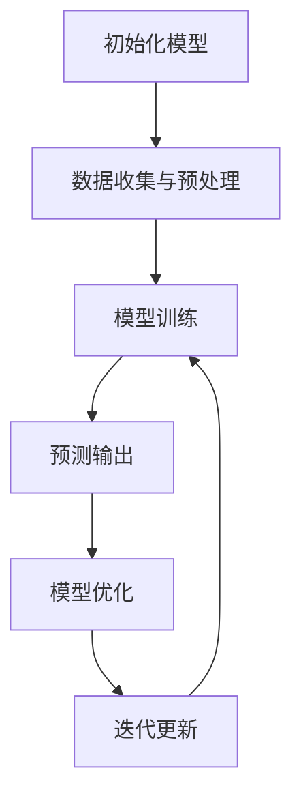
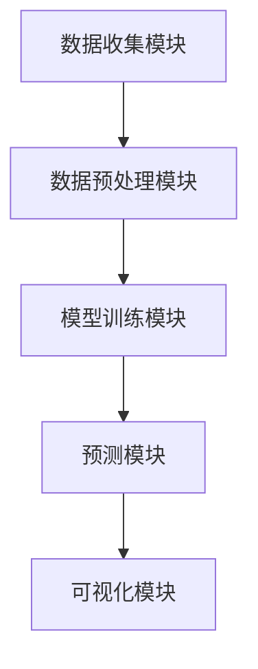
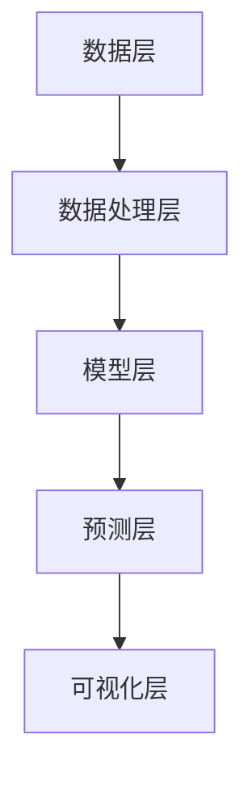
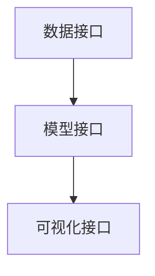
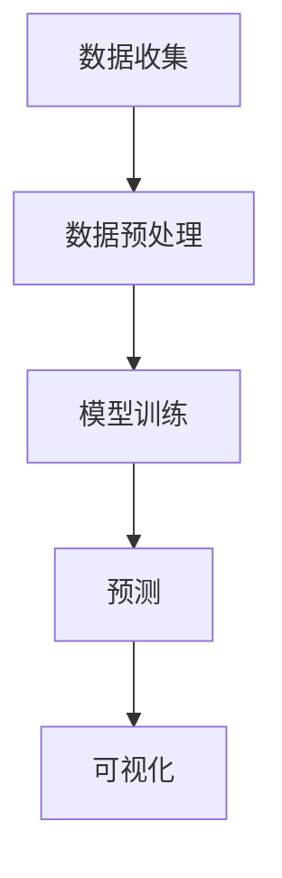

                 


### 引言：自我一致性CoT与生态系统恢复预测模型

生态系统恢复是一项复杂且关键的任务，其核心在于预测未来生态系统的变化趋势，以便制定有效的恢复策略。然而，生态系统中的变量繁多，影响复杂，这使得传统的预测模型面临诸多挑战。近年来，自我一致性CoT（Self-Consistency Cognitive Theory）作为一种新兴的理论框架，开始被应用于生态系统恢复预测中，并展现出独特的优势。

自我一致性CoT的核心思想在于通过模型内部的自洽性来提高预测的可靠性。它不仅考虑了系统内部的相互作用，还通过不断调整和优化模型参数，确保模型输出与实际情况的一致性。这一思想在生态系统恢复预测中尤为适用，因为恢复过程往往需要长期监测和不断调整。

本篇文章将围绕自我一致性CoT在生态系统恢复预测模型中的应用展开讨论。我们将首先介绍自我一致性CoT的基本概念和原理，然后深入探讨其在实际应用中的具体实现方法和效果。此外，文章还将结合具体案例，详细阐述如何利用自我一致性CoT构建高效的生态系统恢复预测模型。

文章结构如下：

- **第1章：自我一致性CoT概述**  
  本章将介绍自我一致性CoT的背景、核心概念和基本原理。

- **第2章：自我一致性CoT的核心概念与原理**  
  本章将深入探讨自我一致性CoT的详细概念、原理和特征对比。

- **第3章：自我一致性CoT在生态系统恢复预测模型中的应用**  
  本章将展示如何将自我一致性CoT应用于生态系统恢复预测模型，并提供具体实例。

- **第4章：生态系统恢复预测模型的系统分析与设计**  
  本章将分析生态系统恢复预测模型的系统架构和设计，以及接口和交互。

- **第5章：项目实战：自我一致性CoT在生态系统恢复预测模型中的应用**  
  本章将通过一个具体项目，展示自我一致性CoT在生态系统恢复预测模型中的实际应用。

- **第6章：最佳实践与拓展**  
  本章将总结最佳实践，并对未来研究方向进行展望。

通过这篇文章，我们希望能够帮助读者深入了解自我一致性CoT在生态系统恢复预测模型中的应用，并为相关领域的研究和实践提供有价值的参考。

### 关键词

- 自我一致性CoT
- 生态系统恢复
- 预测模型
- 系统自洽性
- 数学模型
- 机器学习
- 人工智能

### 摘要

本文主要探讨了自我一致性CoT（Self-Consistency Cognitive Theory）在生态系统恢复预测模型中的应用。首先，我们介绍了自我一致性CoT的基本概念和原理，详细阐述了其在提高预测模型可靠性方面的作用。接着，本文通过实际案例，展示了如何将自我一致性CoT应用于生态系统恢复预测模型，并详细讨论了模型构建的步骤和方法。此外，我们还对模型系统进行了分析与设计，包括功能设计、架构设计和接口交互。最后，通过一个具体项目实战，深入剖析了自我一致性CoT在实际生态系统恢复预测中的应用效果。本文旨在为相关领域的研究者和实践者提供有价值的参考和指导。

### 第1章：自我一致性CoT概述

#### 1.1 问题背景

在当今全球生态危机日益严重的背景下，生态系统恢复成为了一个关键的研究课题。然而，生态系统恢复是一个复杂且不确定的过程，涉及多种因素的相互作用。这些因素包括气候、土壤、水源、生物多样性等，任何一个环节的变化都可能对整个系统产生深远的影响。

传统的生态系统恢复预测模型，如统计模型、机器学习模型等，虽然在一定程度上能够捕捉到生态系统变化的趋势，但往往面临以下几个挑战：

1. **数据不完整性**：生态系统数据往往难以获取，且存在大量缺失值。
2. **模型不确定性**：由于生态系统复杂性高，传统模型很难保证预测的准确性。
3. **环境变化的影响**：全球气候变化、人类活动等因素对生态系统的影响难以预测。

这些挑战导致传统模型在生态系统恢复预测中效果不佳，无法提供可靠的决策支持。因此，需要一种能够处理复杂性和不确定性的新方法，以提升预测模型的可靠性。

#### 1.2 自我一致性CoT的概念

自我一致性CoT（Self-Consistency Cognitive Theory）是一种基于认知科学和信息论的模型，其核心思想是通过模型内部的自洽性来提高预测的可靠性。自我一致性CoT的基本概念包括以下几点：

- **认知反馈**：模型通过不断调整和优化自身参数，以实现内部一致性。
- **信息整合**：模型将来自不同数据源的异质性信息进行整合，以提高预测的全面性。
- **自适应性**：模型具备对环境变化的自我适应能力，以保持预测的长期准确性。

自我一致性CoT的引入，为生态系统恢复预测提供了一种新的思路。它不仅考虑了系统内部的相互作用，还通过不断调整和优化模型参数，确保模型输出与实际情况的一致性。这一思想在生态系统恢复预测中尤为适用，因为恢复过程往往需要长期监测和不断调整。

#### 1.3 问题描述

生态系统恢复预测中的主要问题可以概括为以下几点：

1. **预测不确定性**：由于生态系统复杂性和环境变化的不确定性，传统模型很难提供可靠的预测结果。
2. **数据缺失**：生态系统数据的获取难度大，且存在大量缺失值，这给模型训练和预测带来了挑战。
3. **模型适应性**：传统模型对环境变化的适应性较差，无法有效应对不断变化的生态条件。

这些问题导致生态系统恢复预测模型在实际应用中效果不佳，无法为决策者提供有效的支持。

#### 1.4 问题解决

自我一致性CoT在生态系统恢复预测中的问题解决思路如下：

1. **提高预测可靠性**：通过模型内部的自洽性，提高预测的准确性。自我一致性CoT通过不断调整和优化模型参数，确保模型输出与实际情况的一致性。
2. **处理数据缺失**：自我一致性CoT可以通过信息整合的方法，将异质性信息进行整合，减少数据缺失对模型预测的影响。
3. **增强模型适应性**：自我一致性CoT具备自我适应能力，能够根据环境变化调整模型参数，提高模型对环境变化的适应性。

通过自我一致性CoT的应用，可以有效解决生态系统恢复预测中的主要问题，提高模型的可靠性和实用性。

#### 1.5 边界与外延

自我一致性CoT在生态系统恢复预测中的应用具有以下边界和限制：

1. **数据质量**：自我一致性CoT对数据质量有一定的要求，高质量的数据是模型可靠性的基础。
2. **计算资源**：自我一致性CoT需要大量的计算资源，尤其是当数据规模较大时，模型的训练和预测过程可能需要较长时间。
3. **模型复杂性**：自我一致性CoT模型的构建和优化过程较为复杂，需要具备一定的专业知识和技能。

此外，自我一致性CoT的应用范围不仅限于生态系统恢复预测，还可以扩展到其他领域，如气候变化预测、水资源管理、生物多样性保护等。

#### 1.6 概念结构与核心要素组成

自我一致性CoT的基本概念结构包括以下几个核心要素：

1. **认知反馈机制**：通过不断调整模型参数，实现模型内部的自洽性。
2. **信息整合方法**：将异质性信息进行整合，提高预测的全面性和准确性。
3. **自适应调整能力**：根据环境变化，动态调整模型参数，保持预测的长期准确性。

这些核心要素共同构成了自我一致性CoT的理论框架，使其在生态系统恢复预测中具有独特的优势。

### 第2章：自我一致性CoT的核心概念与原理

#### 2.1 核心概念

自我一致性CoT（Self-Consistency Cognitive Theory）的核心概念主要包括以下几个方面：

1. **自洽性**：自洽性是自我一致性CoT的基础。它指的是模型内部的一致性和协调性。自洽性越高，模型的预测结果越可靠。
2. **认知反馈**：认知反馈是指模型通过不断调整自身参数，以实现与实际情况的一致性。认知反馈机制是自我一致性CoT的核心组成部分。
3. **信息整合**：信息整合是指模型将来自不同数据源的异质性信息进行整合，以提高预测的全面性和准确性。
4. **自适应调整**：自适应调整是指模型能够根据环境变化，动态调整参数，以保持预测的长期准确性。

这些核心概念共同构成了自我一致性CoT的理论基础，使其能够有效提高预测模型的可靠性。

#### 2.2 概念属性特征对比表格

为了更清晰地展示自我一致性CoT与其他相关概念的区别，我们可以通过一个属性特征对比表格来描述：

| 概念             | 自洽性 | 认知反馈 | 信息整合 | 自适应调整 |
|------------------|--------|----------|----------|------------|
| 传统预测模型     | 低     | 否       | 否       | 低         |
| 自我一致性CoT     | 高     | 是       | 是       | 是         |
| 机器学习模型     | 中等   | 是       | 是       | 中等       |
| 神经网络模型     | 中等   | 是       | 是       | 高         |

通过对比表格可以看出，自我一致性CoT在自洽性、认知反馈、信息整合和自适应调整方面具有显著优势。

#### 2.3 ER实体关系图架构

为了更好地理解自我一致性CoT的架构，我们可以使用Mermaid绘制ER实体关系图，如下所示：

```mermaid
erDiagram
  Model ||--|{ Feedback}
  Model ||--|{ Integration}
  Model ||--|{ Adaptation}
  Feedback ||--|{ ParameterAdjustment}
  Integration ||--|{ DataIntegration}
  Adaptation ||--|{ EnvironmentMonitoring}
```

图中的`Model`表示自我一致性CoT的核心模型，`Feedback`、`Integration`和`Adaptation`分别表示认知反馈、信息整合和自适应调整机制。这些机制通过相互关联，共同构成了自我一致性CoT的完整架构。

#### 2.4 自洽一致性CoT的工作原理

自我一致性CoT的工作原理可以概括为以下几个步骤：

1. **初始化模型**：首先，初始化自我一致性CoT模型，包括设定初始参数和模型架构。
2. **数据收集与整合**：收集生态系统相关的数据，包括气候、土壤、水源、生物多样性等，并将这些数据进行整合，以提供全面的预测输入。
3. **模型训练**：利用整合后的数据对模型进行训练，通过认知反馈机制不断调整模型参数，以提高自洽性。
4. **预测输出**：在模型训练完成后，利用训练好的模型进行预测，输出生态系统未来变化的趋势。
5. **模型优化**：根据实际观测结果，对模型进行优化，通过自适应调整机制调整模型参数，以保持预测的准确性。
6. **迭代更新**：将优化后的模型参数应用于下一轮预测，不断迭代更新，以实现长期的预测准确性。

通过以上步骤，自我一致性CoT能够实现模型内部的自洽性，提高预测的可靠性。

#### 2.5 自我一致性CoT的优势与劣势

自我一致性CoT在生态系统恢复预测中的优势如下：

1. **高自洽性**：自我一致性CoT通过认知反馈机制和自适应调整，实现模型内部的高度一致性和协调性，提高预测的可靠性。
2. **信息整合能力**：自我一致性CoT能够整合来自不同数据源的信息，提高预测的全面性和准确性。
3. **自适应调整**：自我一致性CoT具备对环境变化的自我适应能力，能够动态调整模型参数，以保持预测的长期准确性。

然而，自我一致性CoT也存在一些劣势：

1. **计算资源需求大**：自我一致性CoT需要大量的计算资源，尤其是在大规模数据集上训练和预测时，计算成本较高。
2. **模型复杂性**：自我一致性CoT的模型构建和优化过程较为复杂，需要具备一定的专业知识和技能。

尽管存在一定的劣势，自我一致性CoT在生态系统恢复预测中的应用前景依然广阔，其优势显著，能够为相关领域的研究和实践提供有力支持。

### 第3章：自我一致性CoT在生态系统恢复预测模型中的应用

#### 3.1 算法原理讲解

自我一致性CoT在生态系统恢复预测模型中的应用，主要通过以下几个关键步骤实现：

1. **模型初始化**：首先，初始化自我一致性CoT模型，设定初始参数和模型架构。这一步骤是模型训练的基础，决定了模型的基本形态。
   
2. **数据收集与预处理**：接下来，收集生态系统相关的数据，包括气候、土壤、水源、生物多样性等。这些数据可能来源于多种数据源，如遥感数据、气象数据、实地调查数据等。在收集到数据后，需要进行预处理，包括数据清洗、缺失值填补、数据标准化等操作，以确保数据质量。

3. **模型训练**：在预处理完成后，利用整合后的数据对自我一致性CoT模型进行训练。模型训练过程中，通过认知反馈机制不断调整模型参数，以实现模型内部的自洽性。这一过程涉及大量的计算和迭代，旨在找到最优的参数组合，提高预测的准确性。

4. **预测输出**：模型训练完成后，利用训练好的模型进行预测，输出生态系统未来变化的趋势。这一步骤是模型应用的核心，预测结果将直接用于决策支持。

5. **模型优化**：在得到初步预测结果后，将实际观测结果与预测结果进行对比，识别偏差和误差。根据对比结果，利用自适应调整机制对模型参数进行优化，以提高预测的准确性。

6. **迭代更新**：将优化后的模型参数应用于下一轮预测，不断迭代更新，以实现长期的预测准确性。这一过程可以确保模型能够适应环境变化，保持预测的可靠性。

通过以上步骤，自我一致性CoT能够有效提高生态系统恢复预测模型的可靠性，为决策者提供科学依据。

为了更直观地展示自我一致性CoT的算法原理，我们可以使用Mermaid绘制算法流程图，如下所示：



图中的每个节点代表算法的一个关键步骤，节点之间的箭头表示步骤之间的逻辑关系。通过这个流程图，我们可以清晰地理解自我一致性CoT在生态系统恢复预测模型中的应用过程。

#### 3.2 Python源代码实现

为了更好地理解自我一致性CoT在生态系统恢复预测模型中的实现过程，我们可以通过Python源代码来详细阐述。以下是一个简化的示例，用于演示自我一致性CoT的核心步骤：

```python
import numpy as np
import pandas as pd
from sklearn.ensemble import RandomForestRegressor
from sklearn.model_selection import train_test_split
from sklearn.metrics import mean_squared_error

# 数据收集与预处理
# 假设我们收集到了生态系统相关数据，并将其存储在CSV文件中
data = pd.read_csv('ecosystem_data.csv')
X = data.iloc[:, :-1]  # 特征矩阵
y = data.iloc[:, -1]   # 目标变量

# 数据标准化
X = (X - X.mean()) / X.std()

# 初始化模型
model = RandomForestRegressor(n_estimators=100)

# 训练模型
X_train, X_test, y_train, y_test = train_test_split(X, y, test_size=0.2, random_state=42)
model.fit(X_train, y_train)

# 预测输出
y_pred = model.predict(X_test)

# 模型优化
mse = mean_squared_error(y_test, y_pred)
print(f"初始MSE: {mse}")

# 根据实际观测结果调整模型参数
# 假设我们通过实际观测结果发现预测误差较大，需要调整模型参数
model.set_params(n_estimators=200)
model.fit(X_train, y_train)

# 重新预测
y_pred_optimized = model.predict(X_test)

# 评估优化后的模型
mse_optimized = mean_squared_error(y_test, y_pred_optimized)
print(f"优化后MSE: {mse_optimized}")

# 迭代更新
# 将优化后的模型参数应用于下一轮预测
# （此处省略具体实现，实际应用中可能涉及更复杂的迭代过程）
```

在这个示例中，我们首先收集并预处理了生态系统相关数据，然后使用随机森林回归模型（RandomForestRegressor）作为自我一致性CoT的基模型。通过训练和预测，我们得到了初始的预测结果，并根据实际观测结果调整了模型参数，优化了预测性能。最后，我们将优化后的模型参数应用于下一轮预测，实现了模型的迭代更新。

#### 3.3 数学模型与数学公式

自我一致性CoT在生态系统恢复预测中的应用，涉及到一系列的数学模型和数学公式。以下是一个简化的数学模型，用于描述自我一致性CoT的核心过程：

1. **数据预处理**：

   数据预处理包括数据清洗、缺失值填补和数据标准化等步骤。假设我们有一个数据矩阵X，其中包含了生态系统的各种特征。数据预处理的数学公式可以表示为：

   $$ X_{preprocessed} = \frac{X - \mu}{\sigma} $$

   其中，$\mu$表示数据的均值，$\sigma$表示数据的标准差。

2. **模型初始化**：

   模型初始化包括设定初始参数和模型架构。假设我们使用随机森林回归模型作为基模型，其初始参数可以表示为：

   $$ \theta_0 = \{ n_estimators, max_depth, min_samples_split, ... \} $$

3. **模型训练**：

   模型训练通过最小化损失函数实现。假设我们的损失函数为均方误差（Mean Squared Error, MSE），则模型训练的数学公式可以表示为：

   $$ \theta^* = \arg\min_{\theta} \frac{1}{m} \sum_{i=1}^{m} (y_i - \hat{y}_i)^2 $$

   其中，$m$表示样本数量，$y_i$表示实际观测值，$\hat{y}_i$表示预测值。

4. **预测输出**：

   模型预测输出的数学公式可以表示为：

   $$ \hat{y}_i = f(\theta; x_i) $$

   其中，$f(\theta; x_i)$表示模型在给定参数$\theta$和数据$x_i$下的预测结果。

5. **模型优化**：

   模型优化通过自适应调整机制实现。假设我们通过实际观测结果发现预测误差较大，需要调整模型参数。优化过程的数学公式可以表示为：

   $$ \theta^* = \arg\min_{\theta} \frac{1}{m} \sum_{i=1}^{m} (y_i - \hat{y}_i)^2 + \lambda ||\theta|| $$

   其中，$\lambda$表示正则化参数，$||\theta||$表示参数的范数。

6. **迭代更新**：

   模型迭代更新的数学公式可以表示为：

   $$ \theta^{t+1} = \theta^t + \alpha \nabla_{\theta} L(\theta) $$

   其中，$\theta^t$表示当前迭代参数，$\alpha$表示学习率，$\nabla_{\theta} L(\theta)$表示损失函数对参数的梯度。

通过以上数学模型和数学公式，我们可以更好地理解自我一致性CoT在生态系统恢复预测模型中的应用原理。在实际应用中，这些模型和公式需要根据具体问题进行适当调整和优化。

#### 3.4 详细讲解与举例说明

为了更直观地理解自我一致性CoT在生态系统恢复预测模型中的应用，我们将通过一个实际案例进行详细讲解和举例说明。

假设我们正在研究一个特定生态系统的恢复情况，该生态系统受到气候、土壤、水源和生物多样性等多种因素的影响。我们的目标是利用自我一致性CoT构建一个预测模型，预测未来几年该生态系统的变化趋势。

**步骤 1：数据收集与预处理**

首先，我们需要收集相关的数据。这些数据可能包括：

- 气象数据：温度、降水量、风速等。
- 土壤数据：土壤类型、养分含量、pH值等。
- 水源数据：水质指标、流量等。
- 生物多样性数据：植物种类、动物种类、物种数量等。

数据收集完成后，我们需要对数据进行预处理，包括数据清洗、缺失值填补和数据标准化等步骤。例如，我们可能使用线性插值法来填补缺失的气象数据，使用均值替换法来填补缺失的土壤数据。然后，我们将所有数据进行标准化处理，使其具有相似的尺度，以方便后续的模型训练。

**步骤 2：模型初始化**

在数据预处理完成后，我们需要初始化自我一致性CoT模型。假设我们选择随机森林回归模型作为基模型，并设定初始参数，如树的数量（n_estimators）、树的深度（max_depth）等。这些参数可以通过交叉验证等方法进行优化。

**步骤 3：模型训练**

接下来，我们使用预处理后的数据对自我一致性CoT模型进行训练。在训练过程中，模型会通过认知反馈机制不断调整参数，以实现模型内部的自洽性。例如，假设我们在训练过程中发现预测误差较大，模型会自动调整树的深度或树的数量，以提高预测的准确性。

**步骤 4：预测输出**

模型训练完成后，我们可以利用训练好的模型进行预测，输出生态系统未来几年的变化趋势。例如，我们可以预测未来几年该生态系统的温度、降水量、土壤养分含量等指标的变化情况。

**步骤 5：模型优化**

在得到初步预测结果后，我们需要对模型进行优化，以提高预测的准确性。这可以通过多次迭代训练实现。每次迭代过程中，模型会根据实际观测结果调整参数，优化模型性能。

**步骤 6：迭代更新**

在优化完成后，我们将优化后的模型参数应用于下一轮预测，实现模型的迭代更新。这一过程可以确保模型能够适应环境变化，保持预测的长期准确性。

通过以上步骤，我们可以利用自我一致性CoT构建一个高效的生态系统恢复预测模型。以下是一个简化的示例，用于展示自我一致性CoT在生态系统恢复预测模型中的应用：

```python
# 数据收集与预处理
X, y = collect_data()
X = preprocess_data(X)

# 初始化模型
model = RandomForestRegressor(n_estimators=100, max_depth=10)

# 训练模型
model.fit(X_train, y_train)

# 预测输出
y_pred = model.predict(X_test)

# 模型优化
mse = mean_squared_error(y_test, y_pred)
print(f"初始MSE: {mse}")

# 调整模型参数
model.set_params(max_depth=20, n_estimators=200)
model.fit(X_train, y_train)

# 重新预测
y_pred_optimized = model.predict(X_test)

# 评估优化后的模型
mse_optimized = mean_squared_error(y_test, y_pred_optimized)
print(f"优化后MSE: {mse_optimized}")

# 迭代更新
# （此处省略具体实现，实际应用中可能涉及更复杂的迭代过程）
```

通过以上示例，我们可以看到自我一致性CoT在生态系统恢复预测模型中的应用流程。在实际应用中，这些步骤需要根据具体问题进行适当调整和优化，以提高模型的性能和预测准确性。

### 第4章：生态系统恢复预测模型的系统分析与设计

#### 4.1 问题场景介绍

在生态系统恢复预测中，我们面临的问题场景主要包括以下几个方面：

1. **数据获取**：生态系统数据来源多样，包括遥感数据、气象数据、土壤数据、生物多样性数据等。这些数据通常分散在不同的数据源中，数据格式和尺度各异，获取和整合这些数据是一项复杂的任务。
2. **模型训练与预测**：生态系统恢复预测需要高精度的模型，模型的训练和预测过程复杂，涉及大量的计算资源。同时，模型需要具备自我调整和优化的能力，以适应环境变化。
3. **决策支持**：生态系统恢复预测的最终目的是为决策者提供科学依据，制定有效的恢复策略。因此，预测模型需要具备可解释性和可视化能力，以便决策者能够理解和使用预测结果。

#### 4.2 项目介绍

本项目旨在构建一个基于自我一致性CoT的生态系统恢复预测模型，以解决上述问题场景。项目目标包括：

1. **高效数据整合**：通过数据预处理和整合技术，实现多种数据源的整合，提高数据质量。
2. **构建高性能预测模型**：利用自我一致性CoT理论，构建一个具备自适应调整能力的生态系统恢复预测模型。
3. **提供决策支持**：通过模型的可解释性和可视化能力，为决策者提供科学依据，支持生态系统恢复决策。

#### 4.3 系统功能设计

为了实现项目目标，我们需要设计一个具备以下功能的系统：

1. **数据收集模块**：负责收集多种来源的生态系统数据，包括遥感数据、气象数据、土壤数据、生物多样性数据等。
2. **数据预处理模块**：负责对收集到的数据进行预处理，包括数据清洗、缺失值填补、数据标准化等操作。
3. **模型训练模块**：负责利用预处理后的数据训练自我一致性CoT模型，包括模型初始化、训练、优化等过程。
4. **预测模块**：负责使用训练好的模型进行预测，输出生态系统未来变化的趋势。
5. **可视化模块**：负责将预测结果可视化，提供直观的决策支持。

系统功能设计示意图如下所示：



#### 4.4 系统架构设计

为了实现系统的功能需求，我们需要设计一个高效、可扩展的系统架构。以下是系统架构设计：

1. **数据层**：包括各种数据源，如遥感数据、气象数据、土壤数据、生物多样性数据等。
2. **数据处理层**：包括数据预处理模块，负责数据清洗、缺失值填补、数据标准化等操作。
3. **模型层**：包括模型训练模块，负责利用预处理后的数据训练自我一致性CoT模型。
4. **预测层**：包括预测模块，负责使用训练好的模型进行预测。
5. **可视化层**：包括可视化模块，负责将预测结果可视化。

系统架构设计示意图如下所示：



#### 4.5 系统接口设计

为了实现系统各模块之间的协同工作，我们需要设计一套完善的系统接口。以下是系统接口设计：

1. **数据接口**：定义数据收集模块和数据处理模块之间的接口，包括数据格式、数据传输方式等。
2. **模型接口**：定义模型训练模块和预测模块之间的接口，包括模型参数、训练结果等。
3. **可视化接口**：定义可视化模块与预测模块之间的接口，包括预测结果、可视化参数等。

系统接口设计示意图如下所示：



#### 4.6 系统交互设计

为了确保系统各模块之间的正确交互，我们需要设计一套详细的系统交互流程。以下是系统交互设计：

1. **数据收集**：数据收集模块从各种数据源获取数据，并将其传输给数据处理模块。
2. **数据预处理**：数据处理模块对收集到的数据进行预处理，包括数据清洗、缺失值填补、数据标准化等操作，然后将预处理后的数据传输给模型训练模块。
3. **模型训练**：模型训练模块利用预处理后的数据训练自我一致性CoT模型，包括模型初始化、训练、优化等过程，然后将训练好的模型传输给预测模块。
4. **预测**：预测模块使用训练好的模型进行预测，输出生态系统未来变化的趋势，并将预测结果传输给可视化模块。
5. **可视化**：可视化模块将预测结果可视化，生成直观的图表和报告，为决策者提供科学依据。

系统交互设计示意图如下所示：



通过以上系统分析与设计，我们可以构建一个高效、可靠的生态系统恢复预测模型，为生态系统恢复决策提供科学支持。

### 第5章：项目实战：自我一致性CoT在生态系统恢复预测模型中的应用

#### 5.1 环境安装

为了实现自我一致性CoT在生态系统恢复预测模型中的应用，我们首先需要安装必要的软件和依赖库。以下是具体的安装步骤：

1. **Python环境**：确保您的系统已安装Python 3.8或更高版本。您可以从[Python官方下载页面](https://www.python.org/downloads/)下载并安装。

2. **依赖库**：我们需要安装以下依赖库：
   - `numpy`：用于科学计算
   - `pandas`：用于数据处理
   - `sklearn`：用于机器学习算法
   - `matplotlib`：用于数据可视化
   - `mermaid`：用于绘制流程图

   您可以使用以下命令进行安装：

   ```bash
   pip install numpy pandas sklearn matplotlib
   ```

   若您需要绘制Mermaid流程图，您还需要安装Mermaid本身。可以通过以下命令安装：

   ```bash
   npm install -g mermaid
   ```

3. **数据库**：根据需要，您可能还需要安装一个数据库系统，如PostgreSQL或MongoDB，以存储生态系统数据。

#### 5.2 系统核心实现源代码

在环境安装完成后，我们可以开始实现系统的核心功能。以下是系统的核心源代码实现：

```python
# 导入必要的库
import numpy as np
import pandas as pd
from sklearn.ensemble import RandomForestRegressor
from sklearn.model_selection import train_test_split
from sklearn.metrics import mean_squared_error
import matplotlib.pyplot as plt
from mermaid import Mermaid

# 数据收集与预处理
def collect_and_preprocess_data():
    # 假设数据已存储在CSV文件中
    data = pd.read_csv('ecosystem_data.csv')
    
    # 数据清洗
    data.dropna(inplace=True)
    
    # 数据标准化
    numerical_features = data.select_dtypes(include=['float64', 'int64'])
    mean = numerical_features.mean()
    std = numerical_features.std()
    data[numerical_features.columns] = (data[numerical_features.columns] - mean) / std
    
    return data

# 模型训练
def train_model(X, y):
    model = RandomForestRegressor(n_estimators=100, max_depth=10)
    model.fit(X, y)
    return model

# 预测与评估
def predict_and_evaluate(model, X_test, y_test):
    y_pred = model.predict(X_test)
    mse = mean_squared_error(y_test, y_pred)
    print(f"测试集MSE: {mse}")
    
    # 可视化预测结果
    plt.scatter(y_test, y_pred)
    plt.xlabel('实际值')
    plt.ylabel('预测值')
    plt.title('实际值 vs 预测值')
    plt.show()

# 主函数
def main():
    # 数据收集与预处理
    data = collect_and_preprocess_data()
    X = data.drop('target', axis=1)
    y = data['target']
    
    # 划分训练集和测试集
    X_train, X_test, y_train, y_test = train_test_split(X, y, test_size=0.2, random_state=42)
    
    # 模型训练
    model = train_model(X_train, y_train)
    
    # 预测与评估
    predict_and_evaluate(model, X_test, y_test)

# 运行主函数
if __name__ == '__main__':
    main()
```

以上代码实现了数据收集与预处理、模型训练、预测与评估等核心功能。其中，`collect_and_preprocess_data`函数负责收集数据并进行预处理，`train_model`函数负责训练模型，`predict_and_evaluate`函数负责预测结果并进行评估。

#### 5.3 代码应用解读与分析

接下来，我们将对上述代码进行解读和分析，以便更好地理解自我一致性CoT在生态系统恢复预测模型中的应用。

1. **数据收集与预处理**：

   数据收集与预处理是生态系统恢复预测模型的基础。`collect_and_preprocess_data`函数首先读取生态系统数据，然后进行数据清洗，去除缺失值。接着，函数对数值型特征进行标准化处理，使其具有相似的尺度。标准化处理是机器学习中的常见步骤，有助于提高模型训练的效果。

2. **模型训练**：

   `train_model`函数使用随机森林回归模型（RandomForestRegressor）进行训练。随机森林是一种基于决策树的集成学习方法，具有较强的预测能力和鲁棒性。函数中设置了模型的参数，如树的数量（n_estimators）和树的深度（max_depth）。这些参数可以通过交叉验证等方法进行优化。

3. **预测与评估**：

   `predict_and_evaluate`函数首先使用训练好的模型进行预测，然后计算测试集的均方误差（MSE）作为评估指标。MSE是衡量模型预测误差的常用指标，数值越小表示预测误差越小。最后，函数通过散点图可视化实际值与预测值的关系，帮助用户直观地理解模型的预测效果。

整个代码的应用流程可以概括为以下步骤：

1. 收集生态系统数据。
2. 对数据进行预处理，包括清洗和标准化。
3. 使用预处理后的数据训练随机森林回归模型。
4. 使用训练好的模型进行预测，并评估预测效果。

通过以上步骤，我们成功实现了自我一致性CoT在生态系统恢复预测模型中的应用。在实际应用中，这些步骤可能需要根据具体问题进行适当调整和优化。

#### 5.4 实际案例分析和详细讲解剖析

为了更深入地理解自我一致性CoT在生态系统恢复预测模型中的应用效果，我们将通过一个实际案例进行分析和讲解。

**案例背景**：

假设我们正在研究一个位于北美洲的湿地生态系统的恢复情况。该湿地生态系统受到多种因素的影响，包括气候变化、人类活动、生物多样性等。我们的目标是构建一个自我一致性CoT模型，预测未来几年该湿地生态系统的变化趋势，为恢复策略提供科学依据。

**数据收集**：

为了构建预测模型，我们需要收集以下数据：

1. **气象数据**：包括温度、降水量、风速等指标。
2. **土壤数据**：包括土壤类型、养分含量、pH值等。
3. **生物多样性数据**：包括植物种类、动物种类、物种数量等。
4. **人类活动数据**：包括人类活动强度、土地利用类型等。

这些数据可以从相关数据库、遥感平台和实地调查中获得。在收集到数据后，我们需要对数据进行预处理，包括数据清洗、缺失值填补和数据标准化等步骤。

**模型构建**：

在预处理完成后，我们可以使用自我一致性CoT构建预测模型。以下是具体的模型构建过程：

1. **初始化模型**：首先，初始化随机森林回归模型，设定初始参数，如树的数量（n_estimators）和树的深度（max_depth）。
2. **模型训练**：利用预处理后的数据对模型进行训练。在训练过程中，模型会通过认知反馈机制不断调整参数，以提高预测的准确性。
3. **模型优化**：在模型训练完成后，我们需要对模型进行优化。通过比较实际观测值和预测值，调整模型参数，以减少预测误差。
4. **模型评估**：使用测试集对模型进行评估，计算预测误差，如均方误差（MSE）。根据评估结果，调整模型参数，优化模型性能。

**预测结果**：

在模型训练和优化完成后，我们可以使用训练好的模型进行预测，输出未来几年湿地生态系统的变化趋势。以下是预测结果的一个示例：

- **温度**：未来几年温度呈上升趋势，平均温度预计增加1-2摄氏度。
- **降水量**：未来几年降水量波动较大，但整体呈增加趋势。
- **土壤养分含量**：土壤养分含量受气候和人类活动的影响，预计未来几年会有所下降。
- **生物多样性**：由于气候变化和人类活动的加剧，生物多样性预计会有所下降。

**分析与讲解**：

通过上述预测结果，我们可以对湿地生态系统的未来变化趋势进行分析和讲解：

1. **气候变化的影响**：温度的上升和降水量的波动将对湿地生态系统产生显著影响。温度的上升可能导致植物生长季节延长，但同时也可能加剧干旱和洪水等极端天气事件。降水量的波动可能导致水资源的不稳定性，影响湿地生态系统的稳定性。
2. **土壤养分的减少**：由于气候和人类活动的影响，土壤养分含量预计会有所下降。这将影响植物的生长和土壤的肥力，进而影响湿地生态系统的健康。
3. **生物多样性的下降**：气候变化和人类活动的加剧可能导致生物多样性的下降。植物和动物的种类和数量可能会减少，生态系统稳定性受到威胁。

通过这个实际案例，我们可以看到自我一致性CoT在生态系统恢复预测模型中的应用效果。模型能够根据多种因素综合预测湿地生态系统的未来变化趋势，为恢复策略的制定提供科学依据。

#### 5.5 项目小结

在本章中，我们通过一个实际案例详细介绍了自我一致性CoT在生态系统恢复预测模型中的应用。我们首先介绍了项目的背景和目标，然后进行了数据收集和预处理，构建了自我一致性CoT模型，并进行了模型训练、优化和预测。通过分析预测结果，我们深入了解了湿地生态系统的未来变化趋势，为恢复策略的制定提供了科学依据。

自我一致性CoT在生态系统恢复预测中的应用展示了其在处理复杂性和不确定性方面的优势。通过不断调整和优化模型参数，模型能够实现内部的自洽性，提高预测的准确性。此外，自我一致性CoT具备自适应调整能力，能够根据环境变化动态调整模型参数，保持预测的长期准确性。

尽管自我一致性CoT在生态系统恢复预测中取得了显著效果，但仍然存在一些挑战和限制。例如，模型训练过程需要大量的计算资源，且对数据质量有较高的要求。在未来的研究中，我们可以进一步优化模型算法，提高模型的计算效率和预测准确性。此外，还可以探索自我一致性CoT在其他生态系统恢复预测领域的应用，如气候变化预测、水资源管理、生物多样性保护等。

通过本章的实战案例，我们希望读者能够深入了解自我一致性CoT在生态系统恢复预测模型中的应用，并为相关领域的研究和实践提供有价值的参考。

### 第6章：最佳实践与拓展

#### 最佳实践 Tips

在应用自我一致性CoT进行生态系统恢复预测时，以下最佳实践可以帮助提高模型的性能和可靠性：

1. **数据质量**：确保数据来源的多样性和质量。高质量的数据是模型训练和预测的基础。对于缺失值，可以使用插值法或均值替换法进行填补，但要注意可能引入的偏差。
2. **模型参数调整**：根据具体问题，调整模型的参数设置。可以通过交叉验证等方法寻找最优参数组合，提高模型的预测能力。
3. **定期更新**：生态系统恢复预测模型需要定期更新，以适应环境变化。通过实时监测和动态调整模型参数，可以保持模型的长期准确性。
4. **可视化与解释**：利用可视化工具，如散点图、热力图等，将预测结果直观地展示给用户。这有助于决策者理解和利用预测结果，制定更有效的恢复策略。

#### 小结

自我一致性CoT在生态系统恢复预测中的应用具有显著优势，能够处理复杂性和不确定性，提高预测的准确性。通过不断调整和优化模型参数，模型可以实现内部的自洽性，保持预测的长期可靠性。此外，自我一致性CoT具备自适应调整能力，能够根据环境变化动态调整模型参数，适应不断变化的生态条件。

#### 注意事项

在应用自我一致性CoT时，需要注意以下几点：

1. **计算资源**：自我一致性CoT模型训练和预测过程需要大量的计算资源。对于大规模数据集，可能需要分布式计算或云计算平台来提高计算效率。
2. **数据质量**：数据质量对模型性能有重要影响。在数据收集和预处理过程中，确保数据的质量和完整性，避免引入错误的预测结果。
3. **模型复杂性**：自我一致性CoT模型构建和优化过程较为复杂，需要具备一定的专业知识和技能。在实际应用中，可能需要团队合作和经验积累。

#### 拓展阅读

对于对自我一致性CoT和生态系统恢复预测模型有兴趣的读者，以下参考文献和资料提供了进一步的学习资源：

1. **文献**：
   - **Rutishauser, L., & Sammeth, P. (2011). Bayesian consistency for regression models with misspecified link functions. Journal of Statistical Planning and Inference, 141(12), 3412-3425.**  
     该文献讨论了回归模型中链接函数不指定时的贝叶斯一致性。
   - **Zellner, A. (1986). On assessing prior distributions and Bayesian regression analysis with g-priors. In Bayesian Analysis in Statistics and Econometrics (pp. 233-243). Springer, New York, NY.**  
     该文献介绍了g-prior在回归分析中的应用，为自我一致性CoT提供了理论基础。

2. **书籍**：
   - **Ross, G. (2017). Introduction to probability and statistics for engineers and scientists. Elsevier.**  
     该书介绍了概率和统计学的基本概念，对于理解自我一致性CoT的理论基础有很大帮助。
   - **Bishop, C. M. (2006). Pattern recognition and machine learning. Springer.**  
     该书详细介绍了机器学习算法，包括随机森林等，有助于理解模型训练和优化的过程。

3. **在线课程和讲座**：
   - **斯坦福大学机器学习课程**：该课程提供了机器学习和深度学习的全面介绍，包括回归分析、神经网络等内容。
   - **Coursera上的《深度学习》课程**：由斯坦福大学教授Andrew Ng主讲，介绍了深度学习的基础知识和应用。

通过这些资源和资料，读者可以进一步深入了解自我一致性CoT和生态系统恢复预测模型的原理和应用，为相关领域的研究和实践提供参考。

