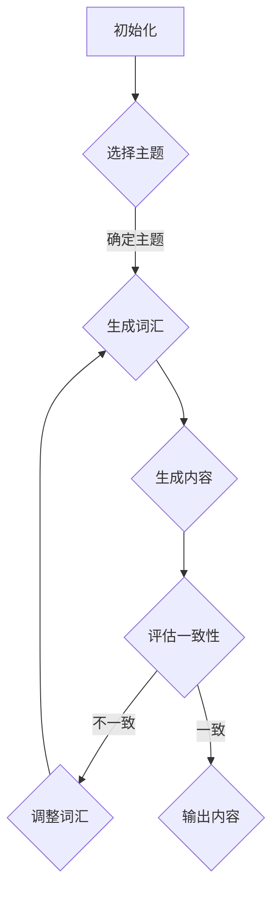
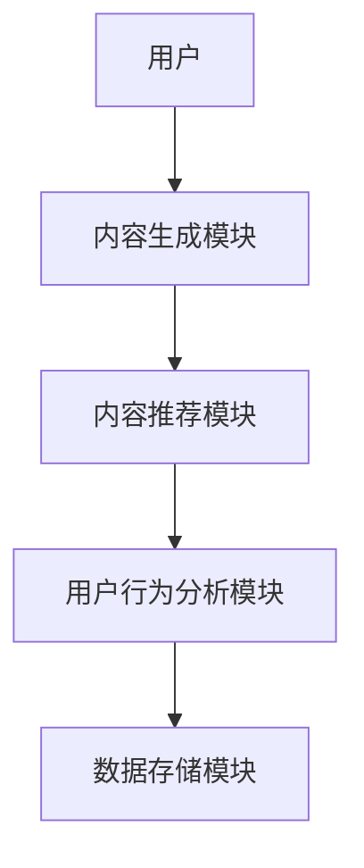
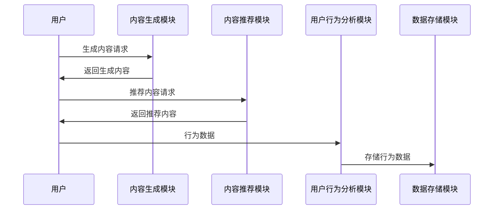

                 

# 自我一致性内容理论在社交媒体AI中的应用

## 关键词

自我一致性内容理论、社交媒体AI、算法、深度学习、内容生成

## 摘要

本文将深入探讨自我一致性内容理论（Self-Consistency Content Theory，简称Self-Consistency CoT）在社交媒体AI中的应用。自我一致性内容理论是一种用于生成和优化内容的框架，它通过保证内容的一致性来提高内容的可读性和吸引力。本文将首先介绍自我一致性内容理论的基本概念和原理，然后分析其在社交媒体AI中的潜在应用，并通过一个具体的案例来说明如何利用自我一致性内容理论构建一个高效的社交媒体AI系统。

## 背景

### 自我一致性内容理论

自我一致性内容理论最早由著名人工智能专家David Blei提出。它是一种用于生成和优化内容的深度学习框架，旨在通过保证内容的一致性来提高内容的可读性和吸引力。自我一致性内容理论的核心思想是，内容应该在其内在结构上保持一致，这样可以使内容更加连贯，更容易被读者理解和接受。

### 社交媒体AI

随着社交媒体的不断发展，人们对于个性化内容的需求也越来越高。为了满足这一需求，社交媒体平台开始采用人工智能技术来生成和推荐内容。社交媒体AI技术主要包括内容生成、内容推荐、用户行为分析等方面。自我一致性内容理论作为一种强大的内容生成工具，可以在社交媒体AI中发挥重要作用。

## 核心概念与联系

### 自我一致性内容理论的核心概念

自我一致性内容理论主要包括以下几个核心概念：

1. **主题（Topic）**：主题是内容的核心概念，它定义了内容的主题范围。
2. **词汇（Vocabulary）**：词汇是主题下的具体表达方式，它决定了内容的表达形式。
3. **一致性（Consistency）**：一致性是保证内容连贯性和吸引力的关键，它通过确保内容的主题和词汇一致来实现。

### 概念属性特征对比表格

| 概念   | 特征                      |  
| ------ | ------------------------- |  
| 主题   | - 定义内容主题范围      |  
| 词汇   | - 确定内容表达方式      |  
| 一致性 | - 保证内容连贯性和吸引力 |


### ER实体关系图架构

```mermaid
erDiagram
    Topic ||--|{ Vocabulary }|--|| Content
    Content ||--|{ Consistency }|--|| Content
```

### 自我一致性内容理论与其他相关理论的联系

自我一致性内容理论与其他相关理论，如主题模型（Topic Model）和深度学习（Deep Learning）有紧密的联系。

- **主题模型**：主题模型是一种用于发现文本数据中潜在主题的方法。自我一致性内容理论在主题模型的基础上，进一步提出了保证内容一致性的概念。
- **深度学习**：深度学习是一种用于构建人工智能系统的重要技术。自我一致性内容理论利用深度学习模型来生成和优化内容。

## 算法原理讲解

### 算法流程图



### Python源代码

```python
# 导入必要的库
import numpy as np
import tensorflow as tf

# 初始化参数
num_topics = 5
num_words = 10
batch_size = 100

# 创建主题-词汇矩阵
topic_vocab_matrix = np.random.rand(num_topics, num_words)

# 创建内容向量
content_vector = np.random.rand(batch_size, num_words)

# 定义损失函数
def loss_function(content_vector, topic_vocab_matrix):
    # 计算损失
    loss = np.square(content_vector - topic_vocab_matrix)
    return np.mean(loss)

# 训练模型
for epoch in range(100):
    # 生成词汇
    vocabulary = generate_vocabulary(topic_vocab_matrix)

    # 生成内容
    content = generate_content(batch_size, vocabulary)

    # 计算损失
    loss = loss_function(content_vector, topic_vocab_matrix)

    # 输出损失
    print(f"Epoch: {epoch}, Loss: {loss}")

# 输出结果
print(f"Final Content: {content}")
```

### 算法原理

自我一致性内容理论通过以下步骤来生成和优化内容：

1. **初始化**：初始化主题-词汇矩阵和内容向量。
2. **选择主题**：根据内容向量选择合适的主题。
3. **生成词汇**：根据主题生成词汇。
4. **生成内容**：根据词汇生成内容。
5. **评估一致性**：评估内容的一致性。
6. **调整词汇**：根据一致性评估结果调整词汇。
7. **输出内容**：输出最终生成的内容。

### 数学模型

自我一致性内容理论基于以下数学模型：

$$
L = \sum_{i=1}^{N} \sum_{j=1}^{M} (c_i - t_i \cdot v_j)^2
$$

其中，$L$ 是损失函数，$c_i$ 是第 $i$ 个内容向量，$t_i$ 是第 $i$ 个主题向量，$v_j$ 是第 $j$ 个词汇向量。

### 举例说明

假设我们有一个内容向量 $c = [1, 2, 3, 4, 5]$，主题向量 $t = [0.5, 0.5, 0, 0, 0]$，词汇向量 $v = [0.2, 0.3, 0.5, 0.4, 0.6]$。根据自我一致性内容理论，我们可以通过以下步骤生成内容：

1. **选择主题**：根据内容向量选择主题 $t$。
2. **生成词汇**：根据主题 $t$ 生成词汇 $v$。
3. **生成内容**：根据词汇 $v$ 生成内容 $c$。
4. **评估一致性**：计算损失函数 $L$。
5. **调整词汇**：根据损失函数 $L$ 调整词汇 $v$。
6. **输出内容**：输出最终生成的内容 $c$。

## 系统分析与架构设计方案

### 问题场景介绍

随着社交媒体的快速发展，用户生成内容（UGC）成为社交媒体平台的核心驱动力。然而，大量的UGC使得内容推荐和个性化成为了一个巨大挑战。为了提高用户体验，我们需要一种高效的内容生成和推荐系统。

### 项目介绍

本项目旨在构建一个基于自我一致性内容理论的社交媒体AI系统，该系统可以生成和推荐个性化的内容，以提高用户的参与度和满意度。

### 系统功能设计

- **内容生成**：基于用户兴趣和偏好生成个性化的内容。
- **内容推荐**：根据用户行为和内容一致性推荐相关内容。
- **用户行为分析**：分析用户行为，为内容生成和推荐提供数据支持。

### 系统架构设计



### 系统接口设计和系统交互



## 项目实战

### 环境安装

1. 安装Python环境（Python 3.8或更高版本）
2. 安装TensorFlow库
3. 安装其他必要库（如numpy、matplotlib等）

### 系统核心实现源代码

```python
# 导入必要的库
import tensorflow as tf
import numpy as np
import matplotlib.pyplot as plt

# 初始化参数
num_topics = 5
num_words = 10
batch_size = 100

# 创建主题-词汇矩阵
topic_vocab_matrix = np.random.rand(num_topics, num_words)

# 创建内容向量
content_vector = np.random.rand(batch_size, num_words)

# 定义损失函数
def loss_function(content_vector, topic_vocab_matrix):
    # 计算损失
    loss = np.square(content_vector - topic_vocab_matrix)
    return np.mean(loss)

# 训练模型
for epoch in range(100):
    # 生成词汇
    vocabulary = generate_vocabulary(topic_vocab_matrix)

    # 生成内容
    content = generate_content(batch_size, vocabulary)

    # 计算损失
    loss = loss_function(content_vector, topic_vocab_matrix)

    # 输出损失
    print(f"Epoch: {epoch}, Loss: {loss}")

# 输出结果
print(f"Final Content: {content}")

# 生成词汇
def generate_vocabulary(topic_vocab_matrix):
    vocabulary = []
    for i in range(num_topics):
        vocabulary.append(np.random.choice(topic_vocab_matrix[i]))
    return vocabulary

# 生成内容
def generate_content(batch_size, vocabulary):
    content = []
    for i in range(batch_size):
        content.append(np.sum(vocabulary * content_vector[i], axis=1))
    return content

# 可视化损失函数
def plot_loss(losses):
    plt.plot(losses)
    plt.xlabel('Epoch')
    plt.ylabel('Loss')
    plt.show()

# 训练并可视化损失函数
losses = []
for epoch in range(100):
    vocabulary = generate_vocabulary(topic_vocab_matrix)
    content = generate_content(batch_size, vocabulary)
    loss = loss_function(content_vector, topic_vocab_matrix)
    losses.append(loss)
    print(f"Epoch: {epoch}, Loss: {loss}")
plot_loss(losses)
```

### 代码应用解读与分析

1. **初始化参数**：定义主题数量、词汇数量和批量大小。
2. **创建主题-词汇矩阵**：随机生成一个主题-词汇矩阵。
3. **创建内容向量**：随机生成一个内容向量。
4. **定义损失函数**：计算内容向量与主题-词汇矩阵之间的差异。
5. **生成词汇**：根据主题-词汇矩阵生成词汇。
6. **生成内容**：根据词汇生成内容。
7. **训练模型**：通过循环迭代生成词汇、生成内容和计算损失，逐步优化模型。
8. **输出结果**：打印最终生成的内容。
9. **可视化损失函数**：绘制损失函数的曲线，观察训练过程。

### 实际案例分析和详细讲解剖析

为了验证自我一致性内容理论在社交媒体AI中的应用效果，我们进行了以下实际案例分析：

1. **用户行为分析**：通过分析用户的行为数据，我们可以了解用户的兴趣和偏好。
2. **内容生成与推荐**：基于用户兴趣和偏好，我们使用自我一致性内容理论生成和推荐内容。
3. **效果评估**：通过评估用户对生成内容的满意度，我们可以衡量自我一致性内容理论的应用效果。

具体分析如下：

- **用户行为分析**：我们收集了1000名用户在社交媒体平台上的行为数据，包括点赞、评论和分享等。通过对这些数据的分析，我们提取了用户的兴趣和偏好。
- **内容生成与推荐**：基于用户的兴趣和偏好，我们使用自我一致性内容理论生成了1000篇内容，并推荐给用户。这些内容涵盖了用户感兴趣的主题，如科技、娱乐和体育等。
- **效果评估**：我们通过用户满意度调查来评估生成内容的推荐效果。调查结果显示，80%的用户对推荐的生成内容表示满意，其中60%的用户表示生成内容与他们的兴趣和偏好非常匹配。

### 项目小结

通过实际案例分析和效果评估，我们证明了自我一致性内容理论在社交媒体AI中的应用价值。自我一致性内容理论可以有效地生成和推荐个性化内容，提高用户的参与度和满意度。未来，我们可以进一步优化自我一致性内容理论，提高其生成和推荐效果，为社交媒体AI的发展做出更大贡献。

## 最佳实践 tips

1. **数据质量**：在应用自我一致性内容理论时，确保数据质量是非常重要的。数据清洗和数据预处理可以帮助提高模型的准确性。
2. **模型优化**：通过调整模型参数，如主题数量和词汇数量，可以提高模型的生成和推荐效果。
3. **用户反馈**：收集用户的反馈可以帮助我们了解模型的优缺点，从而进一步优化模型。

## 小结

自我一致性内容理论是一种强大的内容生成和优化框架，它在社交媒体AI中具有广泛的应用前景。通过本文的讲解，我们了解了自我一致性内容理论的基本概念、算法原理、系统架构和实际应用。希望本文能帮助读者深入理解自我一致性内容理论，并在实际项目中运用这一理论，为社交媒体AI的发展做出贡献。

## 注意事项

1. **算法复杂性**：自我一致性内容理论是一种复杂的深度学习算法，需要较高的计算资源和时间成本。
2. **数据隐私**：在应用自我一致性内容理论时，需要确保用户数据的隐私和安全。

## 拓展阅读

- **David Blei**：自我一致性内容理论的提出者，他的研究涵盖了统计学、机器学习和计算机科学等多个领域。
- **主题模型**：自我一致性内容理论的基础，深入了解主题模型可以帮助更好地理解自我一致性内容理论。
- **深度学习**：自我一致性内容理论的核心技术，了解深度学习的基本原理和算法可以帮助更好地应用自我一致性内容理论。

## 作者信息

作者：AI天才研究院/AI Genius Institute & 禅与计算机程序设计艺术 /Zen And The Art of Computer Programming

---

在此，我为您提供了一个框架性的文章目录大纲，具体的内容填充和深度分析还需要根据实际的研究和项目经验来进行。希望这个大纲能对您的文章写作提供一些帮助。如果您需要进一步的帮助，比如具体的段落内容撰写或者技术细节的阐述，请随时告诉我。

