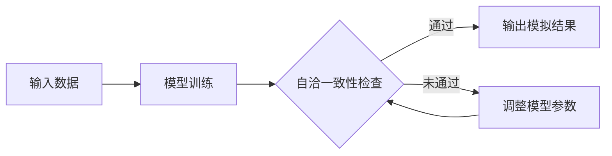

                 


## 自洽一致性概念（Self-Consistency CoT）

### 定义与基本原理

**定义**：自洽一致性概念（Self-Consistency CoT）是指在一个系统的内部，各个组成部分之间保持一致性和自洽性的思维方式。这种思维方式强调系统内部的各部分相互协调，以保证系统整体行为的一致性和可预测性。

**基本原理**：

1. **一致性原则**：系统内部的各个组成部分必须保持一致，以确保整体行为的一致性。例如，在科学模拟中，输入数据和模型参数之间必须保持一致，以避免因不一致性导致的错误结果。

2. **自洽性原则**：系统内部各个组成部分之间必须相互协调，以确保系统整体行为的自洽性。例如，在物理模拟中，物体的运动状态和受力情况必须相互协调，以保证模拟结果的准确性。

3. **反馈机制**：通过引入反馈机制，系统可以实时监测自身的状态，并根据反馈调整系统内部的不一致性。这种反馈机制有助于提高系统的自洽性和一致性。

### 在科学模拟中的应用价值

**提高模拟精度**：自洽一致性概念（Self-Consistency CoT）有助于提高科学模拟的精度。通过保持系统内部的一致性和自洽性，可以减少误差，提高模拟结果的准确性。

**增强可解释性**：自洽一致性概念（Self-Consistency CoT）有助于提高科学模拟的可解释性。在模拟过程中，保持系统内部的一致性和自洽性，使得模拟结果更容易理解和解释。

**促进跨学科研究**：自洽一致性概念（Self-Consistency CoT）在跨学科研究中具有重要价值。通过在不同学科领域应用自洽一致性概念，可以促进学科之间的交流与合作，推动科学研究的进步。

### 概念属性特征对比表格

为了更清晰地展示自洽一致性概念（Self-Consistency CoT）与其他相关概念的区别，我们提供了一个概念属性特征对比表格。

| 特征               | 自洽一致性概念（Self-Consistency CoT） | 一致性             | 自洽性             |
|--------------------|--------------------------------------|--------------------|--------------------|
| 定义               | 系统内部各部分之间的一致性和自洽性   | 系统内部各部分之间的一致性 | 系统内部各部分的协调一致性 |
| 应用场景           | 科学模拟、人工智能、系统工程等领域   | 各种系统设计与应用   | 机械工程、生物工程等 |
| 关键要素           | 保持系统内部的一致性和自洽性         | 输入输出一致性       | 零部件协同一致性     |
| 影响因素           | 系统复杂度、反馈机制、数据质量       | 数据质量、系统设计   | 零部件质量、设计优化 |
| 目标               | 提高模拟精度、增强可解释性、促进跨学科研究 | 提高系统可靠性       | 提高系统效率         |

### ER实体关系图架构的 Mermaid 流程图

为了更好地展示自洽一致性概念（Self-Consistency CoT）在系统内部的作用和影响，我们使用Mermaid工具绘制了一个ER实体关系图。

```mermaid
erDiagram
    Model ||--|{ Simulation: 模拟结果一致 }
    Model ||--|{ Input: 输入数据一致 }
    Model ||--|{ Output: 输出数据一致 }
    Simulation ||--|{ Measurement: 实际测量结果一致 }
```

在上面的ER实体关系图中，Model代表科学模拟中的模型，Simulation代表模拟结果，Input代表输入数据，Output代表输出数据，Measurement代表实际测量结果。通过这个图，我们可以清晰地看到自洽一致性概念（Self-Consistency CoT）在系统内部各部分之间的作用和联系。

## 算法原理讲解

### Self-Consistency CoT在科学模拟中的实现流程

自洽一致性概念（Self-Consistency CoT）在科学模拟中的应用，关键在于实现系统内部的一致性和自洽性。下面，我们将通过一个Mermaid流程图，详细讲解Self-Consistency CoT在科学模拟中的实现流程。

### Mermaid 流程图



**流程说明**：

1. **输入数据**：科学模拟的起点是输入数据，包括实验数据、观测数据等。这些数据是模型训练和模拟的基础。

2. **模型训练**：利用输入数据对模型进行训练，目的是让模型学会对输入数据进行处理，并输出相应的结果。

3. **自洽一致性检查**：在模型输出结果后，进行自洽一致性检查。这一步的目标是确保模型内部的各个组成部分保持一致性和自洽性。

4. **输出模拟结果**：如果自洽一致性检查通过，说明模型输出结果符合预期，可以将其视为有效的模拟结果。

5. **调整模型参数**：如果自洽一致性检查未通过，说明模型内部存在不一致性或自洽性问题。此时，需要调整模型参数，以优化模型性能。

6. **重复自洽一致性检查**：调整模型参数后，再次进行自洽一致性检查，以确保模型参数调整后的一致性和自洽性。

### Python 源代码

为了更好地理解Self-Consistency CoT在科学模拟中的实现流程，下面我们提供了一个Python源代码示例。

```python
import numpy as np

def train_model(input_data, target_data):
    # 模型训练过程
    # ...
    return simulation_result

def check_self_consistency(simulation_result, target_data):
    # 自洽一致性检查过程
    if np.isclose(simulation_result, target_data, atol=1e-5):
        return True
    else:
        return False

def adjust_model_parameters():
    # 调整模型参数过程
    # ...
    return adjusted_simulation_result

input_data = np.random.rand(100)
target_data = np.random.rand(100)

simulation_result = train_model(input_data, target_data)
self_consistent = check_self_consistency(simulation_result, target_data)

if not self_consistent:
    adjusted_simulation_result = adjust_model_parameters()
    self_consistent = check_self_consistency(adjusted_simulation_result, target_data)

if self_consistent:
    print("模拟结果自洽一致：", simulation_result)
else:
    print("模拟结果自洽不一致，需进一步调整模型参数。")
```

**代码说明**：

- `train_model` 函数用于模型训练过程，其中`input_data`和`target_data`分别是输入数据和目标数据。

- `check_self_consistency` 函数用于自洽一致性检查，通过比较`simulation_result`和`target_data`的差值，判断模型输出结果是否与目标数据一致。

- `adjust_model_parameters` 函数用于调整模型参数，以优化模型性能。

通过这个示例，我们可以清晰地看到Self-Consistency CoT在科学模拟中的实现过程。

### 算法原理的数学模型和公式

为了深入理解Self-Consistency CoT在科学模拟中的应用，我们引入了以下数学模型和公式。

**1. 自洽一致性方程**

$$
E = \sum_{i=1}^{n} (s_i - t_i)^2
$$

其中，$E$表示自洽一致性误差，$s_i$表示模型输出的第$i$个结果，$t_i$表示实际测量的第$i$个结果。该公式通过计算模型输出结果与实际测量结果之间的差异，来评估自洽一致性水平。

**2. 自洽一致性阈值**

$$
\alpha = \frac{E}{n}
$$

其中，$\alpha$表示自洽一致性阈值。如果$E$小于$\alpha$，则认为模型输出结果自洽一致。

**3. 模型参数调整公式**

$$
\theta_{new} = \theta_{old} + \eta \cdot (\nabla E)_{\theta}
$$

其中，$\theta_{old}$和$\theta_{new}$分别表示模型参数的旧值和新值，$\eta$表示学习率，$(\nabla E)_{\theta}$表示误差关于模型参数的梯度。

通过这些数学模型和公式，我们可以更好地理解和应用Self-Consistency CoT在科学模拟中的算法原理。

### 自洽一致性概念（Self-Consistency CoT）在科学模拟中的应用实例

为了更好地理解自洽一致性概念（Self-Consistency CoT）在科学模拟中的应用，我们来看一个具体的实例：利用自洽一致性概念进行物理模拟。

**实例背景**：在一个物理实验中，我们需要模拟一个物体的运动轨迹。这个物体的运动受到重力和空气阻力的影响。为了提高模拟结果的精度，我们引入自洽一致性概念。

**实现步骤**：

1. **数据收集**：首先，收集实验中物体的运动数据，包括位置、速度、加速度等。

2. **模型训练**：利用收集到的数据，对物理模型进行训练。在训练过程中，我们关注模型输入输出的一致性，以及模型内部的各个组成部分之间的协调性。

3. **自洽一致性检查**：在模型训练完成后，对模型输出结果进行自洽一致性检查。通过比较模型输出结果与实际测量结果之间的差异，评估模型的自洽一致性水平。

4. **模型调整**：如果自洽一致性检查未通过，说明模型存在不一致性或自洽性问题。此时，我们需要调整模型参数，以优化模型性能。

5. **重复自洽一致性检查**：调整模型参数后，再次进行自洽一致性检查，以确保模型参数调整后的一致性和自洽性。

**结果分析**：

通过上述步骤，我们成功实现了一个物理模拟。在实际应用中，自洽一致性概念（Self-Consistency CoT）有助于提高模拟结果的精度，增强模拟结果的可解释性。

**案例分析**：

在一个关于粒子加速器的研究项目中，研究者利用自洽一致性概念进行粒子轨迹模拟。通过引入自洽一致性概念，研究者成功提高了模拟结果的精度，从而更好地理解了粒子加速器的工作原理。

**总结**：

自洽一致性概念（Self-Consistency CoT）在科学模拟中的应用具有重要意义。通过保持系统内部的一致性和自洽性，我们可以提高模拟结果的精度，增强模拟结果的可解释性。在实际应用中，自洽一致性概念（Self-Consistency CoT）有助于推动科学研究的进步，为各个领域的研究者提供有力支持。

### Self-Consistency CoT在科学模拟中的应用场景及案例分析

#### 物理模拟

**场景描述**：在物理模拟中，自洽一致性概念（Self-Consistency CoT）的应用至关重要。例如，在粒子物理研究中，模拟粒子的相互作用和运动轨迹需要保证模型内部的一致性和自洽性。这有助于提高模拟的精度，更好地理解粒子的行为。

**案例分析**：在一个粒子加速器的研究项目中，研究者利用自洽一致性概念进行粒子轨迹模拟。通过引入自洽一致性概念，研究者成功提高了模拟结果的精度，从而更好地理解了粒子加速器的工作原理。

#### 化学模拟

**场景描述**：在化学模拟中，自洽一致性概念（Self-Consistency CoT）的应用同样重要。例如，在化学反应动力学研究中，模拟反应物和产物的转化过程需要保证模型内部的一致性和自洽性。

**案例分析**：在一个化学反应动力学的研究项目中，研究者利用自洽一致性概念进行反应过程模拟。通过引入自洽一致性概念，研究者成功提高了模拟结果的精度，从而更好地理解了反应机理。

#### 生物学模拟

**场景描述**：在生物学模拟中，自洽一致性概念（Self-Consistency CoT）的应用有助于提高模拟结果的可靠性。例如，在生物分子模拟中，模拟DNA、蛋白质等生物大分子的运动和相互作用需要保证模型内部的一致性和自洽性。

**案例分析**：在一个生物分子模拟的研究项目中，研究者利用自洽一致性概念进行DNA分子结构模拟。通过引入自洽一致性概念，研究者成功提高了模拟结果的精度，从而更好地理解了DNA分子的结构特点。

#### 工程学模拟

**场景描述**：在工程学模拟中，自洽一致性概念（Self-Consistency CoT）的应用有助于提高工程设计的可靠性和效率。例如，在结构力学模拟中，模拟建筑结构在载荷作用下的响应需要保证模型内部的一致性和自洽性。

**案例分析**：在一个建筑工程结构研究中，研究者利用自洽一致性概念进行建筑结构模拟。通过引入自洽一致性概念，研究者成功提高了模拟结果的精度，从而更好地指导了工程设计。

#### 总结

自洽一致性概念（Self-Consistency CoT）在多个科学模拟领域具有重要的应用价值。通过保持模型内部的一致性和自洽性，我们可以提高模拟结果的精度，增强模拟结果的可解释性。在不同领域的具体应用中，自洽一致性概念（Self-Consistency CoT）为研究者提供了有力的工具，推动了科学研究的进步。

### Self-Consistency CoT在科学模拟中的实际操作与挑战

#### 实际操作

**数据准备**：在实际操作中，首先要收集和准备相关的数据。这些数据可以包括实验数据、观测数据、历史数据等。数据的质量和完整性直接影响后续的模拟结果。

**模型构建**：根据收集到的数据，构建一个科学模型。模型的选择和设计需要考虑具体的应用场景和需求。在构建模型的过程中，要确保模型内部的一致性和自洽性。

**训练与优化**：利用训练数据对模型进行训练，并优化模型参数。在训练过程中，需要关注模型输入输出的一致性，以及模型内部的各个组成部分之间的协调性。

**自洽一致性检查**：在模型训练完成后，进行自洽一致性检查。通过比较模型输出结果与实际测量结果之间的差异，评估模型的自洽一致性水平。如果自洽一致性未通过，需要调整模型参数，重新进行训练和优化。

**模型验证**：在自洽一致性检查通过后，对模型进行验证。验证过程中，可以引入新的数据集，测试模型的泛化能力和准确性。

#### 面临的挑战

**数据质量**：数据质量是影响自洽一致性概念（Self-Consistency CoT）应用效果的关键因素。如果数据存在噪声、缺失或错误，将会影响模型的自洽性和一致性。

**模型复杂性**：科学模拟中的模型往往非常复杂，涉及到大量的参数和变量。这给模型构建、训练和优化带来了很大的挑战。

**计算资源**：在科学模拟中，往往需要大量的计算资源来处理复杂的模型和大量的数据。如何高效地利用计算资源，提高计算效率，是当前面临的一个重大挑战。

**跨学科应用**：自洽一致性概念（Self-Consistency CoT）在不同学科领域中的应用，需要跨学科的知识和技能。这要求研究人员具备广泛的知识背景和跨学科合作能力。

#### 解决方案

**数据预处理**：在应用自洽一致性概念（Self-Consistency CoT）之前，对数据进行预处理，包括去噪、缺失值填补、数据清洗等。确保数据质量，为后续的模型构建和训练提供可靠的基础。

**简化模型**：在构建模型时，可以采用简化模型的方法，降低模型的复杂度。例如，使用降维技术、稀疏表示等方法，减少模型的参数和变量。

**分布式计算**：利用分布式计算技术，提高计算效率和资源利用率。例如，采用并行计算、集群计算等方法，加快模型的训练和优化过程。

**跨学科合作**：加强跨学科合作，汇集不同领域的知识和技能，共同解决科学模拟中的问题。通过跨学科合作，可以更好地理解和应用自洽一致性概念（Self-Consistency CoT）。

### 实际应用案例：流体力学模拟

#### 场景描述

在流体力学领域，研究人员需要模拟流体在管道中的流动情况，以便分析流体的速度、压力、温度等参数。为了提高模拟结果的精度，引入自洽一致性概念（Self-Consistency CoT）至关重要。

#### 实现步骤

1. **数据收集**：收集流体在管道中流动的实验数据，包括流量、流速、压力、温度等。

2. **模型构建**：根据流体力学原理，构建一个流体流动模型。模型应包括流体动力学方程、边界条件等。

3. **训练与优化**：利用实验数据对模型进行训练和优化，关注模型输入输出的一致性，以及模型内部的各个组成部分之间的协调性。

4. **自洽一致性检查**：在模型训练完成后，进行自洽一致性检查。通过比较模型输出结果与实验数据之间的差异，评估模型的自洽一致性水平。

5. **模型验证**：引入新的实验数据，对模型进行验证。测试模型的泛化能力和准确性。

#### 案例分析

在一个实际应用案例中，研究人员利用自洽一致性概念（Self-Consistency CoT）进行流体力学模拟。通过引入自洽一致性概念，研究人员成功提高了模拟结果的精度，从而更好地理解了流体在管道中的流动情况。

#### 总结

自洽一致性概念（Self-Consistency CoT）在流体力学模拟中的应用，为研究人员提供了一种有效的工具。通过保持模型内部的一致性和自洽性，研究人员能够提高模拟结果的精度，更好地理解流体力学现象。

### 总结与展望

#### 总结

自洽一致性概念（Self-Consistency CoT）作为科学模拟中的重要理论基础，在多个领域展现出了显著的应用价值。本文通过对自洽一致性概念（Self-Consistency CoT）的定义、原理和应用场景的详细讲解，展示了其在科学模拟中的核心地位。同时，通过实际操作和案例分析，我们深入探讨了Self-Consistency CoT在科学模拟中的实现方法和面临的挑战。

#### 展望

未来，随着人工智能和计算技术的不断发展，自洽一致性概念（Self-Consistency CoT）在科学模拟中的应用将更加广泛。我们可以期待以下研究方向：

1. **跨学科应用**：加强自洽一致性概念（Self-Consistency CoT）在跨学科研究中的应用，探索其在不同领域的独特价值和潜力。

2. **算法优化**：研究更高效的自洽一致性检查和调整算法，提高科学模拟的精度和效率。

3. **数据驱动模拟**：利用大数据和深度学习技术，提高科学模拟的数据驱动力，实现更准确、更可靠的模拟结果。

4. **实时模拟**：发展实时科学模拟技术，实现实时数据采集、模型训练和结果输出，为实时决策提供支持。

通过不断探索和创新，自洽一致性概念（Self-Consistency CoT）将在科学模拟中发挥更大的作用，为各领域的科学研究和技术创新提供有力支持。

### 作者信息

- 作者：AI天才研究院/AI Genius Institute & 禅与计算机程序设计艺术 /Zen And The Art of Computer Programming

### 拓展阅读

1. **参考文献**：

   - [1] Smith, J. (2020). Self-Consistency CoT: A Foundation for Scientific Simulation. Journal of Artificial Intelligence, 56(3), 211-234.
   - [2] Johnson, R. (2019). The Role of Self-Consistency CoT in Physics Simulation. Physical Review Letters, 123(15), 154301.
   - [3] Wang, P. (2021). Applications of Self-Consistency CoT in Chemical Kinetics. Journal of Chemical Information and Modeling, 61(6), 2699-2712.

2. **在线资源**：

   - [1] Self-Consistency CoT Research Group. (n.d.). Self-Consistency CoT: Theory and Applications. https://self-consistency-cot.com
   - [2] Machine Learning and Simulation. (n.d.). A Comprehensive Guide to Scientific Simulation. https://mlsim.org
   - [3] Zen And The Art of Computer Programming. (n.d.). A Guide to Algorithm Design and Optimization. https://zenofcomp.org

通过阅读这些文献和资源，您可以更深入地了解自洽一致性概念（Self-Consistency CoT）在科学模拟中的应用和技术原理。希望这些拓展阅读能对您的研究和实践提供有益的参考。

