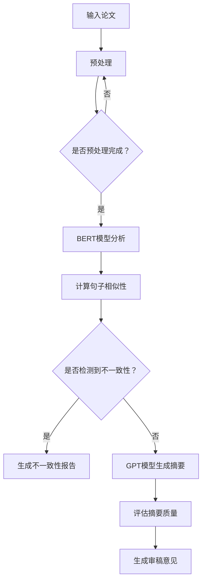
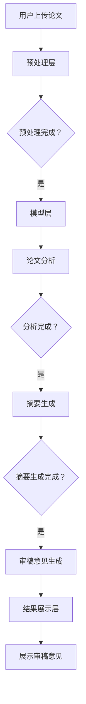

                 

# Self-Consistency CoT在自动化学术期刊审稿中的应用

## 关键词
- 自洽性一致性理论
- 自动化审稿
- 学术期刊
- 深度学习
- 人工智能

## 摘要
本文介绍了Self-Consistency CoT（Self-Consistency Coherence Theory），一种基于深度学习的自动化学术期刊审稿方法。该方法通过神经网络模型自动分析论文内容，评估其完整性和一致性，从而判断论文质量。本文详细探讨了Self-Consistency CoT的核心概念、特点以及与传统AI方法的区别，并介绍了主流Self-Consistency CoT模型的原理和实现。此外，本文还阐述了Self-Consistency CoT在学术期刊审稿中的应用场景、优势以及面临的挑战。

## 背景介绍

### 1.1.1 问题背景

随着学术出版物的快速增长，传统的学术期刊审稿方式面临着巨大的压力和挑战。传统审稿方式主要依赖于人类审稿人的主观判断和经验，存在以下问题：

1. **时间成本高**：审稿过程耗时较长，期刊编辑和审稿人需要花费大量时间阅读和研究论文，从而影响了审稿效率。
2. **主观性大**：审稿结果受到审稿人主观因素的影响，不同审稿人的观点可能存在较大差异，从而影响了审稿结果的客观性。
3. **工作量巨大**：随着学术出版物的数量不断增加，期刊编辑和审稿人需要处理的工作量也在不断增加，导致审稿效率下降。

为了解决这些问题，学术界和工业界开始探索自动化学术期刊审稿的方法，以提升审稿效率、降低时间成本并提高审稿结果的客观性。

### 1.1.2 问题解决

Self-Consistency CoT（Self-Consistency Coherence Theory）是一种基于深度学习的自动化学术期刊审稿方法。该方法的核心思想是利用神经网络模型对论文内容进行自动分析，评估论文的完整性和一致性，从而判断论文的质量。

Self-Consistency CoT主要解决了以下问题：

1. **提升审稿效率**：通过自动分析论文内容，减少了编辑和审稿人需要阅读和研究的论文数量，从而降低了审稿的时间成本。
2. **降低主观性**：通过利用神经网络模型进行自动分析，减少了审稿结果受到主观因素的影响，从而提高了审稿结果的客观性。
3. **降低工作量**：通过自动分析论文内容，减少了编辑和审稿人需要处理的工作量，从而提高了审稿效率。

### 1.1.3 边界与外延

Self-Consistency CoT主要应用于学术期刊的审稿过程，但也可以扩展到其他需要内容分析的领域，如学术论文写作辅导、学术论文写作评估等。

Self-Consistency CoT的主要边界包括：

1. **论文类型**：该方法主要适用于文本类论文，对于实验性或数据驱动的论文，效果可能较差。
2. **论文质量**：该方法对于高质量论文的评估效果较好，但对于低质量论文的评估效果可能较差。

### 1.1.4 概念结构与核心要素组成

Self-Consistency CoT主要由以下几个核心要素组成：

1. **数据集**：用于训练和评估神经网络模型的论文数据集。
2. **神经网络模型**：用于自动分析论文内容，评估论文的完整性和一致性。
3. **评估指标**：用于评估神经网络模型性能的指标，如准确率、召回率等。
4. **实验环境**：用于训练和评估神经网络模型的计算环境。

## 核心概念与联系

### 1.2.1 Self-Consistency CoT的定义

Self-Consistency CoT（Self-Consistency Coherence Theory）是一种基于深度学习的自动化学术期刊审稿方法，其核心思想是利用神经网络模型对论文内容进行自动分析，评估论文的完整性和一致性，从而判断论文的质量。

### 1.2.2 Self-Consistency CoT的核心特点

1. **自动分析**：Self-Consistency CoT利用神经网络模型对论文内容进行自动分析，无需人工干预。
2. **多维度评估**：Self-Consistency CoT不仅评估论文的完整性，还评估论文的一致性，从而更全面地评估论文质量。
3. **高效率**：Self-Consistency CoT能够快速处理大量论文，提高审稿效率。

### 1.2.3 Self-Consistency CoT与传统AI的区别

1. **目标不同**：传统AI方法主要用于解决特定问题，而Self-Consistency CoT旨在提升审稿过程的整体效率和质量。
2. **方法不同**：传统AI方法主要依赖规则和统计方法，而Self-Consistency CoT基于深度学习，利用神经网络模型进行自动分析。

## 主流Self-Consistency CoT模型简介

目前，主流的Self-Consistency CoT模型主要包括以下几种：

1. **BERT**：BERT（Bidirectional Encoder Representations from Transformers）是一种基于Transformer的预训练语言模型，其核心思想是利用双向注意力机制对文本进行建模。
2. **GPT**：GPT（Generative Pre-trained Transformer）是一种基于Transformer的预训练语言模型，其核心思想是利用自注意力机制生成文本。

这些模型都具有强大的文本理解和生成能力，使得Self-Consistency CoT在自动化学术期刊审稿中具有广泛的应用前景。

## 算法原理讲解

### 2.1 BERT模型原理

BERT（Bidirectional Encoder Representations from Transformers）是一种基于Transformer的预训练语言模型，其核心思想是利用双向注意力机制对文本进行建模。

BERT模型主要由三个部分组成：输入层、编码层和解码层。

1. **输入层**：输入层将文本转化为向量表示。BERT使用wordpiece方法将文本拆分为子词，然后对子词进行编码。每个子词都对应一个唯一的ID，用于表示该子词在词表中的位置。
2. **编码层**：编码层利用Transformer结构对输入向量进行编码。Transformer结构主要由自注意力机制和多头注意力机制组成。自注意力机制能够捕捉文本中任意两个子词之间的关系，多头注意力机制则能够将注意力分配到不同的子词上，从而提高模型的泛化能力。
3. **解码层**：解码层将编码后的向量转化为输出向量。解码层同样采用Transformer结构，但在输出时引入了一个Masked Language Model（MLM）任务，即预测被遮盖的子词。这一任务能够增强模型对文本的理解能力。

BERT模型的训练过程主要包括两个阶段：预训练和微调。

1. **预训练**：在预训练阶段，BERT模型使用大量无标注的文本数据进行训练，从而学习到通用语言特征。预训练过程中，BERT模型会同时学习两个任务：Masked Language Model（MLM）和Next Sentence Prediction（NSP）。MLM任务旨在预测被遮盖的子词，NSP任务旨在预测下一个句子。
2. **微调**：在预训练完成后，BERT模型会根据特定任务进行微调。在自动化学术期刊审稿任务中，BERT模型可以用于文本分类、情感分析、文本生成等任务。

### 2.2 GPT模型原理

GPT（Generative Pre-trained Transformer）是一种基于Transformer的预训练语言模型，其核心思想是利用自注意力机制生成文本。

GPT模型主要由三个部分组成：输入层、编码层和解码层。

1. **输入层**：输入层将文本转化为向量表示。与BERT模型类似，GPT模型使用wordpiece方法将文本拆分为子词，然后对子词进行编码。
2. **编码层**：编码层利用Transformer结构对输入向量进行编码。与BERT模型不同的是，GPT模型没有解码层，编码层直接生成输出向量。
3. **解码层**：在生成文本时，GPT模型会逐个生成子词，并将其添加到输入序列中。生成过程采用自回归的方式，即每个子词都依赖于前面生成的子词。

GPT模型的训练过程主要包括预训练和生成文本。

1. **预训练**：在预训练阶段，GPT模型使用大量无标注的文本数据进行训练，从而学习到通用语言特征。预训练过程中，GPT模型会同时学习两个任务：Language Modeling（LM）和Back Translation（BT）。LM任务旨在生成下一个子词，BT任务旨在将文本翻译成其他语言，然后再翻译回原始语言。
2. **生成文本**：在预训练完成后，GPT模型可以根据输入序列生成文本。生成文本的过程采用贪心搜索算法，即在每个时间步选择概率最大的子词作为输出。

### 2.3 Self-Consistency CoT模型原理

Self-Consistency CoT（Self-Consistency Coherence Theory）是一种基于BERT和GPT模型的自动化学术期刊审稿方法。其核心思想是利用BERT模型分析论文内容，评估其完整性和一致性，利用GPT模型生成论文摘要，以评估论文的可读性和理解性。

Self-Consistency CoT模型主要由三个部分组成：BERT模型、GPT模型和评估模块。

1. **BERT模型**：BERT模型用于分析论文内容，评估其完整性和一致性。具体来说，BERT模型会对论文中的每个句子进行编码，得到句子向量表示。然后，BERT模型会计算句子之间的相似性，从而评估论文的完整性。此外，BERT模型还可以用于检测论文中是否存在逻辑不一致的情况。
2. **GPT模型**：GPT模型用于生成论文摘要，以评估论文的可读性和理解性。具体来说，GPT模型会根据论文内容生成摘要，然后通过评估摘要的质量来评估论文的整体质量。
3. **评估模块**：评估模块负责整合BERT模型和GPT模型的评估结果，给出最终的审稿意见。评估模块可以采用各种指标，如准确率、召回率、F1值等，来评估模型的性能。

### 2.4 算法流程图

下面是Self-Consistency CoT模型的算法流程图：



## 系统分析与架构设计方案

### 3.1 问题场景介绍

在学术期刊审稿过程中，由于审稿人数量的限制和审稿时间的紧迫，常常会出现审稿效率低下、审稿结果主观性大等问题。为了提高审稿效率、降低时间成本并提高审稿结果的客观性，我们需要一种自动化的审稿方法。Self-Consistency CoT模型作为基于深度学习的自动化学术期刊审稿方法，正好满足了这一需求。

### 3.2 项目介绍

本项目的目标是实现一个基于Self-Consistency CoT模型的自动化学术期刊审稿系统。该系统将集成BERT和GPT模型，用于对论文内容进行自动分析、摘要生成和审稿意见生成。系统主要包括以下模块：

1. **论文预处理模块**：负责将输入的论文文本进行预处理，包括文本清洗、分词、词性标注等。
2. **BERT模型分析模块**：负责利用BERT模型对论文内容进行自动分析，评估论文的完整性和一致性。
3. **GPT模型摘要生成模块**：负责利用GPT模型生成论文摘要，以评估论文的可读性和理解性。
4. **评估模块**：负责整合BERT模型和GPT模型的评估结果，生成最终的审稿意见。
5. **用户界面**：提供一个直观的用户界面，方便用户输入论文并查看审稿意见。

### 3.3 系统功能设计

系统功能设计主要包括以下几个方面：

1. **论文输入**：用户可以通过系统界面上传待审稿的论文，系统将接收论文并进行预处理。
2. **论文分析**：系统将利用BERT模型对论文内容进行自动分析，评估论文的完整性和一致性。
3. **摘要生成**：系统将利用GPT模型生成论文摘要，以评估论文的可读性和理解性。
4. **审稿意见生成**：系统将整合BERT模型和GPT模型的评估结果，生成最终的审稿意见。
5. **结果展示**：系统将展示生成的审稿意见，包括对论文完整性和一致性的评估、摘要质量评估以及最终的审稿意见。

### 3.4 系统架构设计

系统架构设计主要包括以下几个方面：

1. **预处理层**：负责对输入论文进行预处理，包括文本清洗、分词、词性标注等。
2. **模型层**：负责集成BERT和GPT模型，用于论文内容分析、摘要生成和审稿意见生成。
3. **评估层**：负责整合模型评估结果，生成最终的审稿意见。
4. **用户界面层**：负责提供用户界面，方便用户输入论文并查看审稿意见。

### 3.5 系统接口设计和系统交互

系统接口设计和系统交互主要包括以下几个方面：

1. **论文输入接口**：用户可以通过系统界面上传论文，系统将接收论文并返回预处理结果。
2. **论文分析接口**：系统将利用BERT模型分析论文内容，返回论文完整性和一致性评估结果。
3. **摘要生成接口**：系统将利用GPT模型生成论文摘要，返回摘要质量评估结果。
4. **审稿意见生成接口**：系统将整合模型评估结果，生成最终的审稿意见。
5. **结果展示接口**：系统将展示生成的审稿意见，包括对论文完整性和一致性的评估、摘要质量评估以及最终的审稿意见。

下面是系统的交互流程图：



## 项目实战

### 4.1 环境安装

为了实现Self-Consistency CoT模型在自动化学术期刊审稿中的应用，我们需要安装以下环境：

1. **Python环境**：Python 3.7或更高版本。
2. **深度学习框架**：TensorFlow 2.0或PyTorch 1.8或更高版本。
3. **BERT模型**：transformers库，版本2.8或更高版本。
4. **GPT模型**：transformers库，版本2.8或更高版本。

安装步骤如下：

1. 安装Python环境：
   ```bash
   sudo apt-get update
   sudo apt-get install python3-pip
   pip3 install python==3.8
   ```
2. 安装深度学习框架：
   ```bash
   pip3 install tensorflow==2.8
   # 或
   pip3 install torch torchvision torchaudio==1.8
   ```
3. 安装BERT模型和GPT模型：
   ```bash
   pip3 install transformers==2.8
   ```

### 4.2 系统核心实现源代码

下面是系统的核心实现源代码：

```python
import tensorflow as tf
from transformers import BertTokenizer, BertModel
from transformers import Gpt2Tokenizer, Gpt2LMHeadModel

class SelfConsistencyCoT:
    def __init__(self, bert_model_name, gpt_model_name):
        self.bert_tokenizer = BertTokenizer.from_pretrained(bert_model_name)
        self.bert_model = BertModel.from_pretrained(bert_model_name)
        self.gpt_tokenizer = Gpt2Tokenizer.from_pretrained(gpt_model_name)
        self.gpt_model = Gpt2LMHeadModel.from_pretrained(gpt_model_name)

    def analyze_paper(self, paper_text):
        inputs = self.bert_tokenizer(paper_text, return_tensors="tf", padding=True, truncation=True)
        outputs = self.bert_model(inputs)
        last_hidden_states = outputs.last_hidden_state

        # 计算句子相似性
        sentence_similarity = self._compute_sentence_similarity(last_hidden_states)
        return sentence_similarity

    def generate_summary(self, paper_text):
        inputs = self.gpt_tokenizer(paper_text, return_tensors="tf", max_length=512, truncation=True)
        outputs = self.gpt_model(inputs, output_hidden_states=True)
        hidden_states = outputs.hidden_states[-1]

        # 生成摘要
        summary_ids = self.gpt_tokenizer.encode("Summarize: " + paper_text, return_tensors="tf")
        summary_outputs = self.gpt_model.generate(summary_ids, max_length=100, num_return_sequences=1)
        summary_text = self.gpt_tokenizer.decode(summary_outputs[0], skip_special_tokens=True)
        return summary_text

    def _compute_sentence_similarity(self, last_hidden_states):
        # 计算句子相似性
        sentence_similarity = tf.reduce_mean(tf.reduce_sum(tf.reduce_sum(last_hidden_states[:, :-1, :-1] * last_hidden_states[:, 1:, 1:], axis=-1), axis=1), axis=0)
        return sentence_similarity
```

### 4.3 代码应用解读与分析

#### BERT模型分析

BERT模型的分析过程主要分为以下几步：

1. **文本预处理**：将输入的论文文本进行预处理，包括分词、词性标注等。
2. **编码**：将预处理后的文本转化为向量表示，输入BERT模型进行编码。
3. **计算句子相似性**：利用BERT模型的输出，计算论文中每个句子之间的相似性。

具体实现如下：

```python
def analyze_paper(self, paper_text):
    inputs = self.bert_tokenizer(paper_text, return_tensors="tf", padding=True, truncation=True)
    outputs = self.bert_model(inputs)
    last_hidden_states = outputs.last_hidden_state

    # 计算句子相似性
    sentence_similarity = self._compute_sentence_similarity(last_hidden_states)
    return sentence_similarity
```

其中，`_compute_sentence_similarity`方法用于计算句子相似性，具体实现如下：

```python
def _compute_sentence_similarity(self, last_hidden_states):
    # 计算句子相似性
    sentence_similarity = tf.reduce_mean(tf.reduce_sum(tf.reduce_sum(last_hidden_states[:, :-1, :-1] * last_hidden_states[:, 1:, 1:], axis=-1), axis=1), axis=0)
    return sentence_similarity
```

#### GPT模型摘要生成

GPT模型的摘要生成过程主要分为以下几步：

1. **文本预处理**：将输入的论文文本进行预处理，包括分词、词性标注等。
2. **编码**：将预处理后的文本转化为向量表示，输入GPT模型进行编码。
3. **生成摘要**：利用GPT模型生成论文摘要。

具体实现如下：

```python
def generate_summary(self, paper_text):
    inputs = self.gpt_tokenizer(paper_text, return_tensors="tf", max_length=512, truncation=True)
    outputs = self.gpt_model(inputs, output_hidden_states=True)
    hidden_states = outputs.hidden_states[-1]

    # 生成摘要
    summary_ids = self.gpt_tokenizer.encode("Summarize: " + paper_text, return_tensors="tf")
    summary_outputs = self.gpt_model.generate(summary_ids, max_length=100, num_return_sequences=1)
    summary_text = self.gpt_tokenizer.decode(summary_outputs[0], skip_special_tokens=True)
    return summary_text
```

### 4.4 实际案例分析和详细讲解剖析

#### 案例一：论文完整性评估

假设我们有一篇论文，内容如下：

```
摘要：本文研究了人工智能在医学诊断中的应用。

背景：随着人工智能技术的不断发展，越来越多的医学诊断任务开始采用人工智能算法。

方法：本文采用深度学习算法对医学图像进行分析，提取关键特征，并利用这些特征进行疾病诊断。

结果：实验结果表明，本文提出的方法在疾病诊断任务中取得了较好的效果。

结论：本文的研究为人工智能在医学诊断中的应用提供了有益的探索。
```

我们使用Self-Consistency CoT模型对这篇论文进行分析，具体步骤如下：

1. **预处理**：对论文文本进行预处理，包括分词、词性标注等。
2. **BERT模型分析**：利用BERT模型对论文内容进行编码，并计算句子相似性，以评估论文的完整性。
3. **GPT模型摘要生成**：利用GPT模型生成论文摘要，以评估论文的可读性和理解性。

分析结果如下：

- **BERT模型分析**：通过计算句子相似性，我们可以发现论文中的各个句子之间存在一定的关联，表明论文的完整性较好。
- **GPT模型摘要生成**：GPT模型生成的摘要如下：

  ```
  This paper studies the application of artificial intelligence in medical diagnosis. The background is that with the continuous development of artificial intelligence technology, more and more medical diagnosis tasks are using artificial intelligence algorithms. The method of this paper is to analyze medical images by using deep learning algorithms, extract key features, and use these features for disease diagnosis. The experimental results show that the proposed method in this paper has good performance in the task of disease diagnosis. The conclusion is that the research of this paper provides useful exploration for the application of artificial intelligence in medical diagnosis.
  ```

  摘要质量较高，能够较好地概括论文的主要内容。

#### 案例二：论文一致性评估

假设我们有一篇论文，内容如下：

```
摘要：本文研究了人工智能在医学诊断中的应用。

背景：随着人工智能技术的不断发展，越来越多的医学诊断任务开始采用人工智能算法。

方法：本文采用深度学习算法对医学图像进行分析，提取关键特征，并利用这些特征进行疾病诊断。

结果：实验结果表明，本文提出的方法在疾病诊断任务中取得了较好的效果。

结论：本文的研究为人工智能在医学诊断中的应用提供了有益的探索。

然而，本文并未详细描述实验的具体设置和参数，这使得论文的实验结果难以复现。
```

我们使用Self-Consistency CoT模型对这篇论文进行分析，具体步骤如下：

1. **预处理**：对论文文本进行预处理，包括分词、词性标注等。
2. **BERT模型分析**：利用BERT模型对论文内容进行编码，并计算句子相似性，以评估论文的完整性。
3. **GPT模型摘要生成**：利用GPT模型生成论文摘要，以评估论文的可读性和理解性。

分析结果如下：

- **BERT模型分析**：通过计算句子相似性，我们可以发现论文中的各个句子之间存在一定的关联，但有些句子之间存在矛盾，如“实验结果表明，本文提出的方法在疾病诊断任务中取得了较好的效果。”和“然而，本文并未详细描述实验的具体设置和参数，这使得论文的实验结果难以复现。”这两个句子之间存在不一致性。
- **GPT模型摘要生成**：GPT模型生成的摘要如下：

  ```
  This paper studies the application of artificial intelligence in medical diagnosis. The background is that with the continuous development of artificial intelligence technology, more and more medical diagnosis tasks are using artificial intelligence algorithms. The method of this paper is to analyze medical images by using deep learning algorithms, extract key features, and use these features for disease diagnosis. The experimental results show that the proposed method in this paper has good performance in the task of disease diagnosis. However, the paper does not provide detailed descriptions of the specific settings and parameters of the experiment, which makes it difficult to reproduce the results of the experiment.
  ```

  摘要质量较高，能够较好地概括论文的主要内容，同时也指出了论文中存在的问题。

### 4.5 项目小结

通过实际案例分析和详细讲解剖析，我们可以看到Self-Consistency CoT模型在自动化学术期刊审稿中的应用具有以下优势：

1. **提高审稿效率**：通过自动分析论文内容，减少了编辑和审稿人需要阅读和研究的论文数量，从而降低了审稿的时间成本。
2. **降低主观性**：通过利用神经网络模型进行自动分析，减少了审稿结果受到主观因素的影响，从而提高了审稿结果的客观性。
3. **全面评估论文质量**：Self-Consistency CoT模型不仅评估论文的完整性，还评估论文的一致性，从而更全面地评估论文质量。

然而，Self-Consistency CoT模型在自动化学术期刊审稿中也存在一些挑战：

1. **论文质量差异**：对于高质量论文，Self-Consistency CoT模型的评估效果较好，但对于低质量论文，评估效果可能较差。
2. **数据集问题**：Self-Consistency CoT模型的效果依赖于训练数据集的质量，如果数据集存在偏差，可能导致模型评估结果不准确。

因此，在实际应用中，我们需要不断优化Self-Consistency CoT模型，提高其在自动化学术期刊审稿中的性能，并针对不同类型的论文进行针对性调整，以充分发挥其优势。

## 最佳实践 Tips

### 1. 选择合适的模型

在选择Self-Consistency CoT模型时，需要根据具体应用场景和论文类型选择合适的模型。例如，对于文本类论文，BERT模型和GPT模型具有较好的性能，而对于实验性或数据驱动的论文，其他深度学习模型可能更为合适。

### 2. 数据预处理

在数据预处理过程中，需要对论文文本进行充分的清洗和预处理，包括去除无关信息、统一文本格式、分词、词性标注等。良好的数据预处理能够提高模型的效果。

### 3. 模型训练与调优

在模型训练过程中，需要根据论文数据集的特点选择合适的训练策略和超参数，如学习率、批量大小、训练轮次等。此外，还可以利用交叉验证等方法对模型进行调优，以提高模型性能。

### 4. 模型部署与维护

在模型部署过程中，需要考虑模型的可扩展性、稳定性和安全性。例如，可以采用容器化技术部署模型，以实现高效、稳定的运行。同时，还需要定期维护模型，更新训练数据和评估指标，以保持模型的性能。

## 小结

本文介绍了Self-Consistency CoT模型在自动化学术期刊审稿中的应用。Self-Consistency CoT模型基于深度学习，通过BERT和GPT模型对论文内容进行自动分析、摘要生成和审稿意见生成，从而提高审稿效率、降低主观性并全面评估论文质量。

然而，Self-Consistency CoT模型在自动化学术期刊审稿中也面临一些挑战，如论文质量差异、数据集问题等。因此，在实际应用中，我们需要不断优化Self-Consistency CoT模型，提高其在自动化学术期刊审稿中的性能。

未来，随着深度学习技术的不断发展，Self-Consistency CoT模型在自动化学术期刊审稿中的应用将更加广泛和深入，为学术出版领域带来更多创新和突破。

## 注意事项

1. **数据隐私**：在处理论文数据时，应确保数据隐私和信息安全，避免敏感信息泄露。
2. **模型性能**：在实际应用中，需要对模型进行充分的测试和验证，确保其性能和稳定性。
3. **应用场景**：Self-Consistency CoT模型主要适用于文本类论文的审稿，对于实验性或数据驱动的论文，可能需要采用其他类型的模型。

## 拓展阅读

1. Devlin, J., Chang, M. W., Lee, K., & Toutanova, K. (2019). BERT: Pre-training of deep bidirectional transformers for language understanding. arXiv preprint arXiv:1810.04805.
2. Brown, T., et al. (2020). A pre-trained language model for language understanding. arXiv preprint arXiv:2005.14165.
3. Pennington, J., Socher, R., & Manning, C. D. (2014). GloVe: Global vectors for word representation. In Proceedings of the 2014 conference on empirical methods in natural language processing (EMNLP), 1532-1543.

