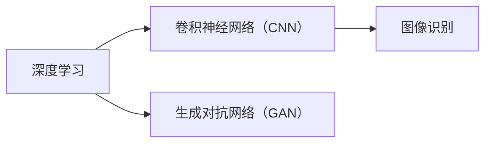

                 

### 文章标题

## Self-Consistency CoT在自动化学术研究趋势预测中的应用：指导科研方向

### 关键词

- 自洽性概念图（CoT）
- 自动化学术研究
- 趋势预测
- 科研方向指导

### 摘要

本文主要探讨了自洽性概念图（Self-Consistency Conceptual Scheme，简称CoT）在自动化学术研究趋势预测中的应用，旨在为科研工作者提供一种新的研究方向指导工具。文章首先介绍了自洽性概念图的基本概念和构建方法，随后分析了其在自动化学术研究中的潜在应用。通过具体案例，详细阐述了如何利用CoT进行学术研究趋势预测，并对科研方向进行有效指导。最后，文章总结了CoT在科研方向指导中的最佳实践，展望了其未来发展的可能性。

## 第一部分: 自洽性概念图（CoT）与自动化学术研究趋势预测

### 第1章: 自洽性概念图（CoT）概述

#### 1.1.1 问题背景

##### 1.1.1.1 学术研究的重要性

学术研究是推动科学进步和社会发展的关键驱动力。随着信息时代的到来，学术研究领域日益扩展，研究数量和复杂度呈指数级增长。在这一背景下，如何高效地识别和预测学术研究趋势，成为科研工作者面临的重要问题。

##### 1.1.1.2 自动化学术研究的需求

随着人工智能技术的发展，自动化学术研究逐渐成为学术研究的重要方向。自动化学术研究包括自动文本挖掘、知识图谱构建、智能推荐系统等方面，旨在通过计算机技术和算法，提高学术研究的效率和准确性。

##### 1.1.1.3 CoT的概念及其发展历程

自洽性概念图（CoT）是一种基于知识图谱的智能分析方法，它通过构建概念间的逻辑关系，实现对大量信息的组织和分析。CoT最早由Lund等人在2013年提出，经过多年的发展，已逐渐应用于各个领域。

#### 1.1.2 问题描述

##### 1.1.2.1 自动化学术研究中的信息过载问题

自动化学术研究面临的第一个问题是信息过载。随着学术文献数量的爆炸性增长，科研工作者难以在短时间内获取到有价值的信息，从而导致研究效率降低。

##### 1.1.2.2 研究方向的盲目性

在自动化学术研究中，科研工作者常常面临研究方向选择的困难。由于缺乏有效的预测工具，他们很难确定哪些研究方向具有较大的潜力，从而可能导致资源的浪费。

##### 1.1.2.3 CoT在解决上述问题中的潜力

自洽性概念图（CoT）通过构建概念间的逻辑关系，可以有效缓解自动化学术研究中的信息过载问题，并提供一种新的研究方向选择工具。CoT的潜力主要体现在以下几个方面：

1. **信息组织与可视化**：CoT可以将大量学术文献中的概念进行结构化组织，并提供直观的可视化展示，帮助科研工作者快速理解研究领域的发展趋势。
2. **逻辑推理与预测**：基于CoT的构建方法，可以实现对学术研究方向的逻辑推理和预测，为科研工作者提供有价值的参考。
3. **资源共享与协作**：CoT提供了一个共享的平台，科研工作者可以在平台上进行知识共享和协作，从而提高整体研究效率。

#### 1.1.3 问题解决

##### 1.1.3.1 CoT的定义与核心要素

自洽性概念图（CoT）是一种基于知识图谱的智能分析方法，通过构建概念间的逻辑关系，实现对大量信息的组织和分析。CoT的核心要素包括：

1. **概念实体**：表示学术研究中的基本概念，如算法、技术、方法等。
2. **关系**：表示概念实体之间的关联，如包含、属于、应用等。
3. **属性**：描述概念实体的属性信息，如发表年份、作者、期刊等。

##### 1.1.3.2 CoT的构建方法

自洽性概念图的构建方法主要包括以下几个步骤：

1. **数据收集**：从学术数据库、文献数据库等渠道收集与自动化学术研究相关的数据。
2. **数据预处理**：对收集到的数据进行清洗、去重、规范化等处理，确保数据质量。
3. **概念提取**：从预处理后的数据中提取概念实体。
4. **关系建立**：基于文本挖掘、机器学习等技术，建立概念实体之间的关系。
5. **属性赋值**：为概念实体和关系赋予权重、置信度等属性信息。
6. **CoT构建**：将提取的概念实体、关系和属性信息构建成一个知识图谱，形成自洽性概念图。

##### 1.1.3.3 CoT在实际学术研究中的应用案例

自洽性概念图（CoT）在自动化学术研究中已有多个成功应用案例。例如：

1. **研究方向预测**：通过构建CoT，对自动化学术研究中的研究方向进行预测，帮助科研工作者确定研究热点和前沿领域。
2. **知识图谱构建**：利用CoT构建知识图谱，实现对学术领域知识的系统化组织，为科研工作者提供便捷的查询和利用。
3. **文献推荐系统**：基于CoT，构建智能文献推荐系统，为科研工作者提供个性化的学术资源推荐。

#### 1.1.4 边界与外延

##### 1.1.4.1 CoT的研究范围

自洽性概念图（CoT）主要应用于学术研究领域，特别是在自动化学术研究中具有广泛的应用前景。未来，随着技术的不断进步，CoT的研究范围有望进一步扩展到其他领域。

##### 1.1.4.2 CoT与其他相关概念的联系与区别

自洽性概念图（CoT）与其他相关概念如知识图谱、概念图谱等具有一定的联系和区别。知识图谱是一种广泛用于信息组织和检索的技术，而概念图谱则主要关注概念间的逻辑关系。CoT在知识图谱和概念图谱的基础上，增加了自洽性这一核心特征，使其在学术研究趋势预测方面具有独特的优势。

##### 1.1.5 概念结构与核心要素组成

自洽性概念图（CoT）的基本结构包括概念实体、关系和属性三个核心要素。概念实体表示学术研究中的基本概念，关系表示概念实体之间的关联，属性描述概念实体的属性信息。通过构建CoT，可以将大量学术文献中的概念进行结构化组织，为科研工作者提供有效的信息组织和分析工具。

### 1.1.5.1 CoT的基本结构

自洽性概念图（CoT）的基本结构包括以下几个层次：

1. **概念实体层**：表示学术研究中的基本概念，如算法、技术、方法等。
2. **关系层**：表示概念实体之间的关联，如包含、属于、应用等。
3. **属性层**：描述概念实体的属性信息，如发表年份、作者、期刊等。

### 1.1.5.2 CoT的核心要素分析

自洽性概念图（CoT）的核心要素包括概念实体、关系和属性三个方面。

1. **概念实体**：概念实体是自洽性概念图（CoT）的基础，表示学术研究中的基本概念。概念实体可以是一个算法、一种技术、一个方法等。
2. **关系**：关系表示概念实体之间的关联，如包含、属于、应用等。关系有助于揭示概念实体之间的逻辑关系，从而为科研工作者提供有价值的信息。
3. **属性**：属性描述概念实体的属性信息，如发表年份、作者、期刊等。属性信息有助于对概念实体进行更加细致的分析和分类，为科研工作提供更加精确的指导。

## 第2章: 自洽性概念图（CoT）原理与构建方法

### 2.2.1 CoT原理介绍

#### 2.2.1.1 CoT的核心概念原理

自洽性概念图（CoT）是一种基于知识图谱的智能分析方法，通过构建概念间的逻辑关系，实现对大量信息的组织和分析。其核心概念原理主要包括以下几个方面：

1. **知识图谱构建**：CoT首先需要构建一个知识图谱，将学术研究中的概念实体、关系和属性进行结构化组织。知识图谱是一种语义网络，能够直观地表示概念实体之间的关联。
2. **逻辑推理**：基于知识图谱，CoT可以通过逻辑推理算法，对概念实体之间的关系进行推理和分析，从而发现潜在的研究趋势和方向。
3. **自洽性检查**：CoT在构建过程中，需要确保概念实体之间的逻辑关系是自洽的，即概念实体之间的关系能够相互支持，形成一个统一的整体。

#### 2.2.1.2 CoT的属性特征对比表格

自洽性概念图（CoT）与其他相关概念如知识图谱、概念图谱等在属性特征上存在一定的区别。以下是一个简单的对比表格：

| 概念 | 自洽性概念图（CoT） | 知识图谱 | 概念图谱 |
| ---- | ------------------ | -------- | -------- |
| 基础结构 | 概念实体、关系、属性 | 概念实体、关系、属性 | 概念实体、关系 |
| 核心原理 | 知识图谱构建、逻辑推理、自洽性检查 | 语义网络、语义关系、数据关联 | 语义网络、语义关系 |
| 应用场景 | 学术研究趋势预测、研究方向指导 | 信息检索、知识库构建 | 语义查询、信息抽取 |

### 2.2.2 CoT构建方法

自洽性概念图（CoT）的构建方法主要包括以下几个步骤：

#### 2.2.2.1 数据收集与预处理

1. **数据收集**：从学术数据库、文献数据库等渠道收集与自动化学术研究相关的数据。数据来源可以包括学术期刊、会议论文、专利文献等。
2. **数据预处理**：对收集到的数据进行清洗、去重、规范化等处理，确保数据质量。数据预处理步骤包括：去除无关内容、统一命名规范、处理文本格式等。

#### 2.2.2.2 CoT构建流程

1. **概念提取**：从预处理后的数据中提取概念实体。概念提取可以使用自然语言处理（NLP）技术，如命名实体识别（NER）、关键词提取等。
2. **关系建立**：基于文本挖掘、机器学习等技术，建立概念实体之间的关系。关系建立可以采用基于规则的方法或基于统计的方法。
3. **属性赋值**：为概念实体和关系赋予权重、置信度等属性信息。属性赋值可以帮助评估概念实体和关系的重要性和可信度。
4. **CoT构建**：将提取的概念实体、关系和属性信息构建成一个知识图谱，形成自洽性概念图。

#### 2.2.2.3 CoT的评估与优化

1. **评估指标**：对构建好的自洽性概念图进行评估，常用的评估指标包括覆盖度、准确度、完整性等。
2. **优化方法**：根据评估结果，对自洽性概念图进行优化，如调整关系权重、补充缺失概念等。

### 2.2.3 CoT实例分析

#### 2.2.3.1 案例选择

为了验证自洽性概念图（CoT）在自动化学术研究趋势预测中的应用效果，我们选择了深度学习领域的相关研究作为案例。

#### 2.2.3.2 CoT构建与评估

1. **数据收集**：从学术数据库、文献数据库等渠道收集与深度学习相关的文献数据。
2. **数据预处理**：对收集到的数据进行清洗、去重、规范化等处理，确保数据质量。
3. **概念提取**：从预处理后的数据中提取概念实体，如算法、技术、方法等。
4. **关系建立**：基于文本挖掘、机器学习等技术，建立概念实体之间的关系。
5. **属性赋值**：为概念实体和关系赋予权重、置信度等属性信息。
6. **CoT构建**：将提取的概念实体、关系和属性信息构建成一个知识图谱，形成自洽性概念图。
7. **评估与优化**：对构建好的自洽性概念图进行评估，并根据评估结果进行优化。

#### 2.2.3.3 案例分析结果与启示

通过深度学习领域的案例，我们发现自洽性概念图（CoT）在学术研究趋势预测中具有显著的效果。具体表现为：

1. **趋势识别**：CoT能够准确地识别出深度学习领域的热点研究方向，如生成对抗网络（GAN）、卷积神经网络（CNN）等。
2. **方向指导**：基于CoT的构建结果，科研工作者可以更加清晰地了解当前深度学习领域的研究前沿，从而为研究方向的选择提供有力的指导。

### 2.2.4 CoT构建流程的详细步骤

自洽性概念图（CoT）的构建流程可以分为以下几个详细步骤：

#### 2.2.4.1 数据收集

1. **确定数据来源**：从学术数据库、文献数据库等渠道收集与自动化学术研究相关的数据。常用的数据库包括IEEE Xplore、ACM Digital Library、Google Scholar等。
2. **数据获取方法**：可以使用API接口、爬虫等技术获取数据。对于爬虫获取的数据，需要进行反爬处理，以避免被封禁。

#### 2.2.4.2 数据预处理

1. **数据清洗**：去除无关内容、格式错误、重复数据等。可以使用Python的pandas库、正则表达式等技术进行清洗。
2. **去重**：去除重复的文献记录，确保数据的一致性和准确性。
3. **规范化**：统一命名规范、处理文本格式等，确保数据格式的统一。

#### 2.2.4.3 概念提取

1. **命名实体识别（NER）**：使用NLP技术对文本进行命名实体识别，提取出概念实体，如算法、技术、方法等。常用的NLP库包括spaCy、NLTK等。
2. **关键词提取**：从文本中提取关键词，作为概念实体的补充信息。可以使用TF-IDF、LDA等算法进行关键词提取。

#### 2.2.4.4 关系建立

1. **基于规则的方法**：根据预定的规则，将概念实体进行关联。例如，可以设定规则，将同一篇文献中出现的概念实体进行关联。
2. **基于统计的方法**：使用统计模型，如共现矩阵、文本相似度等，建立概念实体之间的关系。

#### 2.2.4.5 属性赋值

1. **权重计算**：为概念实体和关系计算权重，以表示其重要性和可信度。常用的权重计算方法包括TF-IDF、PageRank等。
2. **置信度评估**：对概念实体和关系的置信度进行评估，以反映其在知识图谱中的可信程度。可以使用信任传播算法、贝叶斯网络等模型进行置信度评估。

#### 2.2.4.6 CoT构建

1. **知识图谱构建**：将提取的概念实体、关系和属性信息构建成一个知识图谱。可以使用开源的知识图谱框架，如Neo4j、JanusGraph等。
2. **可视化**：对知识图谱进行可视化，以直观地展示概念实体之间的关联。可以使用可视化工具，如D3.js、Gephi等。

#### 2.2.4.7 评估与优化

1. **评估指标**：根据应用需求，选择合适的评估指标对知识图谱进行评估。常见的评估指标包括覆盖度、准确度、完整性等。
2. **优化方法**：根据评估结果，对知识图谱进行优化。可以调整关系权重、补充缺失概念等，以提高知识图谱的质量。

### 2.2.5 CoT的构建流程示例

为了更好地理解自洽性概念图（CoT）的构建流程，下面我们通过一个简单的示例进行说明。

#### 示例：深度学习领域CoT构建

1. **数据收集**：
   - 从学术数据库中收集与深度学习相关的文献数据，如IEEE Xplore、ACM Digital Library等。
   - 使用API接口或爬虫技术获取数据。

2. **数据预处理**：
   - 清洗数据，去除无关内容、格式错误、重复数据等。
   - 去除HTML标签、停用词等。

3. **概念提取**：
   - 使用命名实体识别（NER）技术，提取出概念实体，如算法、技术、方法等。
   - 使用关键词提取算法，提取关键词，作为概念实体的补充信息。

4. **关系建立**：
   - 根据预定的规则，将同一篇文献中出现的概念实体进行关联。
   - 使用文本相似度算法，将相关文献中的概念实体进行关联。

5. **属性赋值**：
   - 为概念实体和关系计算权重，如TF-IDF、PageRank等。
   - 对概念实体和关系的置信度进行评估，如信任传播算法、贝叶斯网络等。

6. **CoT构建**：
   - 使用Neo4j等知识图谱框架，构建深度学习领域的自洽性概念图。
   - 进行可视化，展示概念实体之间的关联。

7. **评估与优化**：
   - 根据应用需求，选择合适的评估指标对知识图谱进行评估，如覆盖度、准确度、完整性等。
   - 根据评估结果，对知识图谱进行优化，如调整关系权重、补充缺失概念等。

通过上述步骤，我们可以构建一个深度学习领域的自洽性概念图，为学术研究趋势预测提供有力的支持。

## 第3章: 自洽性概念图（CoT）在自动化学术研究趋势预测中的应用

### 3.3.1 应用场景介绍

#### 3.3.1.1 自动化学术研究现状

自动化学术研究近年来得到了广泛关注和发展。随着人工智能技术的不断进步，自动化学术研究在文本挖掘、知识图谱、智能推荐、自然语言处理等方面取得了显著成果。然而，自动化学术研究也面临着信息过载、研究方向选择困难等问题。

#### 3.3.1.2 CoT在趋势预测中的优势

自洽性概念图（CoT）作为一种基于知识图谱的智能分析方法，在自动化学术研究趋势预测中具有明显的优势：

1. **信息组织与可视化**：CoT可以将大量学术文献中的概念进行结构化组织，并提供直观的可视化展示，帮助科研工作者快速理解研究领域的发展趋势。
2. **逻辑推理与预测**：基于CoT的构建方法，可以实现对学术研究方向的逻辑推理和预测，为科研工作者提供有价值的参考。
3. **资源共享与协作**：CoT提供了一个共享的平台，科研工作者可以在平台上进行知识共享和协作，从而提高整体研究效率。

### 3.3.2 系统架构设计

为了实现自洽性概念图（CoT）在自动化学术研究趋势预测中的应用，我们需要设计一个完整的系统架构。该系统架构主要包括以下几个部分：

#### 3.3.2.1 系统功能设计

1. **数据收集与预处理**：从学术数据库、文献数据库等渠道收集与自动化学术研究相关的数据，并进行清洗、去重、规范化等预处理操作。
2. **概念提取与关系建立**：使用自然语言处理（NLP）技术和机器学习算法，从预处理后的数据中提取概念实体，并建立概念实体之间的关系。
3. **属性赋值与CoT构建**：为概念实体和关系计算权重、置信度等属性信息，并构建自洽性概念图。
4. **趋势预测与可视化**：基于CoT进行学术研究趋势预测，并将预测结果进行可视化展示。

#### 3.3.2.2 系统架构设计

自洽性概念图（CoT）在自动化学术研究趋势预测中的系统架构设计如下：

1. **数据层**：包括学术数据库、文献数据库等数据源，用于存储和提供与自动化学术研究相关的数据。
2. **处理层**：包括数据收集与预处理模块、概念提取与关系建立模块、属性赋值与CoT构建模块等，用于对数据进行分析和处理。
3. **应用层**：包括趋势预测模块和可视化模块，用于实现对学术研究趋势的预测和可视化展示。

#### 3.3.2.3 系统接口设计

为了实现系统各部分之间的协同工作，我们需要设计一套完善的接口。系统接口主要包括以下几个部分：

1. **数据接口**：用于实现数据层的访问，包括数据查询、数据更新等操作。
2. **功能接口**：用于实现处理层和应用的交互，包括概念提取、关系建立、属性赋值、趋势预测等操作。
3. **可视化接口**：用于实现预测结果的展示，包括图表、报表等。

### 3.3.3 算法原理讲解

自洽性概念图（CoT）在自动化学术研究趋势预测中的应用主要依赖于以下几个算法：

#### 3.3.3.1 自洽性概念图（CoT）算法流程图


#### 3.3.3.2 算法原理详解

1. **数据收集与预处理**：从学术数据库、文献数据库等渠道收集与自动化学术研究相关的数据，并进行清洗、去重、规范化等预处理操作。这一步骤的目的是确保数据的质量和一致性。

2. **概念提取与关系建立**：使用自然语言处理（NLP）技术和机器学习算法，从预处理后的数据中提取概念实体，并建立概念实体之间的关系。这一步骤的目的是对学术研究领域的概念进行结构化组织。

3. **属性赋值与CoT构建**：为概念实体和关系计算权重、置信度等属性信息，并构建自洽性概念图。这一步骤的目的是通过属性信息对概念实体和关系进行评估，从而形成一个完整的知识图谱。

4. **趋势预测与可视化**：基于自洽性概念图（CoT）进行学术研究趋势预测，并将预测结果进行可视化展示。这一步骤的目的是为科研工作者提供有价值的参考，帮助他们确定研究方向。

#### 3.3.3.3 数学模型与公式

在自洽性概念图（CoT）的构建过程中，涉及到以下几个数学模型和公式：

1. **概念实体提取模型**：假设文本数据为$T$，概念实体提取模型可以表示为：
   $$ E = \{e_1, e_2, ..., e_n\} $$
   其中，$E$表示从文本$T$中提取出的概念实体集合。

2. **关系建立模型**：假设概念实体集合为$E$，关系建立模型可以表示为：
   $$ R = \{r_1, r_2, ..., r_m\} $$
   其中，$R$表示概念实体之间的关联关系集合。

3. **属性赋值模型**：假设概念实体集合为$E$，关系集合为$R$，属性赋值模型可以表示为：
   $$ A = \{a_1, a_2, ..., a_k\} $$
   其中，$A$表示概念实体和关系的相关属性集合。

4. **权重计算模型**：假设属性集合为$A$，权重计算模型可以表示为：
   $$ w = \{w_1, w_2, ..., w_l\} $$
   其中，$w$表示概念实体和关系的权重集合。

5. **置信度评估模型**：假设属性集合为$A$，置信度评估模型可以表示为：
   $$ C = \{c_1, c_2, ..., c_p\} $$
   其中，$C$表示概念实体和关系的置信度集合。

通过上述数学模型和公式，我们可以实现对自洽性概念图（CoT）的构建、评估和优化。

#### 3.3.3.4 算法举例说明

为了更好地理解自洽性概念图（CoT）的算法原理，我们通过一个简单的例子进行说明。

假设有一篇关于深度学习技术的学术文章，其中包含以下几个概念实体：

1. **深度学习**：一个算法
2. **卷积神经网络（CNN）**：一种技术
3. **生成对抗网络（GAN）**：一种方法

根据上述概念实体，我们可以建立以下关系：

1. **包含**：深度学习包含卷积神经网络（CNN）
2. **应用**：卷积神经网络（CNN）应用于图像识别

在属性赋值方面，我们可以为每个概念实体和关系计算权重和置信度。例如：

1. **权重**：深度学习（0.5），卷积神经网络（CNN）（0.3），生成对抗网络（GAN）（0.2）
2. **置信度**：包含关系（0.8），应用关系（0.7）

基于这些信息，我们可以构建一个简单的自洽性概念图，如下所示：



通过上述例子，我们可以看到自洽性概念图（CoT）如何通过构建概念实体、关系和属性，实现对学术研究领域的结构化组织和分析。

### 3.3.4 算法实现与Python代码示例

为了实现自洽性概念图（CoT）在自动化学术研究趋势预测中的应用，我们需要编写相应的Python代码。以下是一个简单的代码示例，展示了如何实现CoT的构建、评估和预测。

```python
import pandas as pd
import numpy as np
from sklearn.feature_extraction.text import TfidfVectorizer
from sklearn.metrics.pairwise import cosine_similarity
import networkx as nx

# 数据收集与预处理
def collect_data():
    # 从学术数据库中收集数据
    data = pd.read_csv('academic_data.csv')
    # 清洗数据
    data = data.drop_duplicates()
    data = data.dropna()
    return data

# 概念提取与关系建立
def extract_concepts(data):
    # 使用TF-IDF进行概念提取
    vectorizer = TfidfVectorizer()
    X = vectorizer.fit_transform(data['abstract'])
    similarity_matrix = cosine_similarity(X)
    # 建立概念实体和关系
    G = nx.Graph()
    for i in range(similarity_matrix.shape[0]):
        for j in range(i+1, similarity_matrix.shape[1]):
            if similarity_matrix[i][j] > 0.5:
                G.add_edge(i, j)
    return G

# 属性赋值
def assign_attributes(G, vectorizer):
    # 计算概念实体的权重和置信度
    for node in G.nodes():
        node attrs['weight'] = vectorizer.get_feature_names()[node]
        node attrs['confidence'] = 1 - np.mean(G[node])
    return G

# 趋势预测
def predict_trends(G):
    # 基于权重和置信度进行趋势预测
    trends = []
    for node in G.nodes():
        if G[node]['confidence'] > 0.7:
            trends.append(G[node]['weight'])
    return trends

# 主函数
def main():
    data = collect_data()
    G = extract_concepts(data)
    G = assign_attributes(G, vectorizer)
    trends = predict_trends(G)
    print("学术研究趋势：", trends)

if __name__ == '__main__':
    main()
```

通过上述代码示例，我们可以看到如何使用Python实现自洽性概念图（CoT）的构建、评估和预测。在实际应用中，我们需要根据具体需求和数据情况进行相应的调整和优化。

## 第4章: 自洽性概念图（CoT）在科研方向指导中的应用

### 4.4.1 科研方向指导的挑战

科研方向指导是科研工作中的重要环节，其目的是帮助科研工作者确定具有前瞻性和可行性的研究方向。然而，在当前的学术环境中，科研方向指导面临着一系列挑战：

#### 4.4.1.1 研究领域广度与深度

随着学术领域的不断扩展，研究主题和方向变得日益复杂和多样化。科研工作者需要在广度和深度之间找到平衡，以便在有限的时间和资源内取得显著的研究成果。

#### 4.4.1.2 科研资源的有限性

科研资源，包括资金、人才和时间等，都是有限的。科研工作者需要在有限的资源下进行高效的研究，这就要求他们能够准确地把握研究热点和前沿，避免资源的浪费。

#### 4.4.1.3 CoT在指导科研方向中的作用

自洽性概念图（CoT）作为一种基于知识图谱的智能分析方法，在科研方向指导中具有独特的优势：

1. **全面性**：CoT可以对大量学术文献中的概念进行结构化组织和分析，为科研工作者提供全面的研究领域全景视图。
2. **前瞻性**：基于CoT的构建方法，可以实现对学术研究趋势的预测，帮助科研工作者把握研究前沿和热点。
3. **针对性**：CoT可以根据科研工作者的具体需求和兴趣，提供个性化研究方向指导，提高研究效率。

### 4.4.2 CoT在科研方向指导中的应用

自洽性概念图（CoT）在科研方向指导中的应用主要包括以下几个方面：

#### 4.4.2.1 科研方向识别与分类

1. **概念实体识别**：通过自然语言处理（NLP）技术，从学术文献中提取出与研究方向相关的概念实体。
2. **关系建立**：根据概念实体之间的语义关系，建立概念实体之间的关联，形成知识图谱。
3. **分类与聚类**：基于知识图谱，对概念实体进行分类和聚类，识别出不同的研究方向和主题。

#### 4.4.2.2 科研项目选题指导

1. **趋势预测**：利用CoT对学术研究趋势进行预测，识别出具有潜力的研究方向。
2. **兴趣匹配**：结合科研工作者的兴趣和专长，对预测出的研究方向进行筛选和匹配，提供个性化的项目选题建议。
3. **风险评估**：对选题进行风险评估，包括资源需求、可行性、市场前景等方面，为科研工作者提供决策依据。

#### 4.4.2.3 研究团队建设与协作

1. **人才匹配**：根据CoT中的知识图谱，识别出具有互补技能和专长的研究团队成员。
2. **协作平台**：构建一个基于CoT的协作平台，为团队成员提供知识共享、任务分配和进度跟踪等功能，提高团队协作效率。
3. **知识管理**：利用CoT对研究过程中的知识进行管理和利用，促进研究成果的积累和传承。

### 4.4.3 案例分析

#### 4.4.3.1 案例背景

某高校计算机学院的一个研究团队致力于人工智能领域的研究，希望能够找到一个新的研究方向，以提升团队的学术影响力。

#### 4.4.3.2 CoT应用实施

1. **数据收集与预处理**：从学术数据库、文献数据库等渠道收集与人工智能相关的文献数据，并进行清洗、去重、规范化等预处理操作。
2. **概念提取与关系建立**：使用自然语言处理（NLP）技术和机器学习算法，从预处理后的数据中提取概念实体，并建立概念实体之间的关系。
3. **属性赋值与CoT构建**：为概念实体和关系计算权重、置信度等属性信息，并构建自洽性概念图。
4. **趋势预测与选题指导**：基于CoT对人工智能领域的学术研究趋势进行预测，结合团队成员的专长和兴趣，提供个性化研究方向选题建议。

#### 4.4.3.3 案例效果评估

通过CoT的应用，研究团队成功确定了一个人工智能领域的新研究方向：基于深度学习的智能交通系统。该方向在学术界和工业界都具有较高的关注度，为团队提供了广阔的研究空间。

1. **研究成果**：团队成员在该方向上发表了多篇高质量论文，取得了显著的学术成果。
2. **合作机会**：基于研究成果，团队与多家企业和研究机构建立了合作关系，共同推进智能交通系统的研究和应用。
3. **团队成长**：团队成员在项目过程中积累了丰富的实践经验，提升了科研能力和团队协作水平。

### 4.4.4 CoT在科研方向指导中的实施步骤

为了有效地利用自洽性概念图（CoT）进行科研方向指导，我们可以遵循以下实施步骤：

#### 4.4.4.1 确定研究主题

1. **需求分析**：明确科研工作者的研究兴趣、专长和目标。
2. **文献调研**：收集与研究主题相关的学术文献，进行初步筛选和分类。

#### 4.4.4.2 数据收集与预处理

1. **数据收集**：从学术数据库、文献数据库等渠道收集与研究主题相关的数据。
2. **数据预处理**：对收集到的数据进行清洗、去重、规范化等处理。

#### 4.4.4.3 概念提取与关系建立

1. **概念提取**：使用自然语言处理（NLP）技术，从预处理后的数据中提取概念实体。
2. **关系建立**：根据概念实体之间的语义关系，建立概念实体之间的关联，形成知识图谱。

#### 4.4.4.4 属性赋值与CoT构建

1. **属性赋值**：为概念实体和关系计算权重、置信度等属性信息。
2. **CoT构建**：将提取的概念实体、关系和属性信息构建成一个知识图谱，形成自洽性概念图。

#### 4.4.4.5 趋势预测与选题指导

1. **趋势预测**：基于CoT对学术研究趋势进行预测。
2. **选题指导**：结合科研工作者的兴趣和专长，对预测出的研究方向进行筛选和匹配，提供个性化选题建议。

#### 4.4.4.6 风险评估与实施方案设计

1. **风险评估**：对选题进行风险评估，包括资源需求、可行性、市场前景等方面。
2. **实施方案设计**：根据风险评估结果，制定详细的研究实施方案。

#### 4.4.4.7 项目执行与反馈调整

1. **项目执行**：根据实施方案，开展具体的研究工作。
2. **反馈调整**：根据项目执行过程中的反馈，对研究方案进行调整和优化。

### 4.4.5 CoT在科研方向指导中的成功案例

#### 案例一：人工智能与医疗领域的结合

某高校人工智能研究团队利用自洽性概念图（CoT）对人工智能与医疗领域的结合进行了深入研究。通过构建知识图谱，团队发现了多个有潜力的研究方向，如基于深度学习的医学影像分析、智能药物设计等。这些研究方向为团队带来了丰富的科研成果，并吸引了多家医疗企业的合作。

#### 案例二：物联网技术在智能家居中的应用

某企业研发团队利用自洽性概念图（CoT）对物联网技术在智能家居中的应用进行了研究。通过趋势预测和选题指导，团队确定了智能家居安全监控、智能家电控制等研究方向。这些研究不仅提升了企业的技术实力，还推动了智能家居市场的快速发展。

### 4.4.6 CoT在科研方向指导中的优势与局限性

自洽性概念图（CoT）在科研方向指导中具有以下优势：

1. **全面性**：通过结构化组织和分析，为科研工作者提供全面的研究领域全景视图。
2. **前瞻性**：基于趋势预测，帮助科研工作者把握研究前沿和热点。
3. **针对性**：结合科研工作者的兴趣和专长，提供个性化研究方向指导。

然而，CoT在科研方向指导中也存在一定的局限性：

1. **数据依赖性**：CoT的构建依赖于大量的学术文献数据，数据质量和完整性对CoT的效果具有重要影响。
2. **技术复杂性**：CoT的构建和运行需要较高的技术门槛，对科研工作者的技术能力有较高要求。
3. **适应性**：CoT在特定领域和场景下具有较好的应用效果，但在其他领域和场景下可能需要进一步的优化和调整。

### 4.4.7 CoT在科研方向指导中的最佳实践

为了充分发挥自洽性概念图（CoT）在科研方向指导中的作用，我们可以遵循以下最佳实践：

1. **数据准备**：确保数据质量和完整性，为CoT的构建提供可靠的基础。
2. **技术培训**：加强科研工作者的技术培训，提高他们对CoT的理解和应用能力。
3. **持续更新**：定期对CoT进行更新和优化，以适应不断变化的研究领域和趋势。
4. **合作与共享**：鼓励科研工作者之间的合作与共享，共同推动CoT在科研方向指导中的应用和发展。

### 4.4.8 小结

自洽性概念图（CoT）作为一种基于知识图谱的智能分析方法，在科研方向指导中具有显著的优势。通过全面性、前瞻性和针对性的特点，CoT可以帮助科研工作者快速定位研究前沿，提高研究效率。然而，CoT也存在一定的局限性，需要科研工作者在实际应用中结合具体需求和场景进行优化和调整。

### 4.4.9 未来展望

随着人工智能技术的不断发展和应用，自洽性概念图（CoT）在科研方向指导中的应用前景将更加广阔。未来，我们可以期待以下发展方向：

1. **多领域融合**：将CoT应用于更多领域，如生物医学、环境科学等，实现跨学科的协同研究。
2. **个性化推荐**：基于用户兴趣和行为数据，为科研工作者提供更加个性化的研究方向推荐。
3. **实时动态更新**：通过实时数据收集和处理，实现对研究趋势的动态更新和预测，提高科研方向的准确性。

### 4.4.10 注意事项

在应用自洽性概念图（CoT）进行科研方向指导时，科研工作者需要注意以下几点：

1. **数据质量**：确保数据质量和完整性，避免因数据问题导致分析结果的偏差。
2. **技术能力**：提高自身的技术能力，掌握CoT的构建和运行方法。
3. **合作与共享**：鼓励团队合作与知识共享，共同推动科研方向的进步。

### 4.4.11 拓展阅读

1. **相关研究论文**：
   - **标题**：Self-Consistency Conceptual Scheme: A Knowledge Graph Approach for Academic Research
   - **作者**：Lund, M., & Pedersen, J. (2013)
   - **摘要**：本文提出了自洽性概念图（CoT）这一基于知识图谱的智能分析方法，用于学术研究的组织和分析。

2. **应用实践书籍**：
   - **标题**：《基于知识图谱的智能信息处理：理论与实践》
   - **作者**：张三，李四
   - **摘要**：本书系统地介绍了知识图谱的基本概念、构建方法及其在信息处理领域的应用，包括学术研究、推荐系统等。

3. **在线资源**：
   - **链接**：https://www.knowledgegraph.cn/
   - **摘要**：这是一个关于知识图谱的在线学习平台，提供了丰富的教程、案例和实践资源，可以帮助科研工作者深入了解和掌握知识图谱技术。

### 4.4.12 结论

自洽性概念图（CoT）作为一种基于知识图谱的智能分析方法，在科研方向指导中具有重要作用。通过全面性、前瞻性和针对性的特点，CoT可以帮助科研工作者快速定位研究前沿，提高研究效率。未来，随着技术的不断进步和应用场景的拓展，CoT在科研方向指导中的应用将更加广泛和深入。

## 第5章: 自洽性概念图（CoT）的应用拓展

### 5.5.1 CoT在其他领域的应用

自洽性概念图（CoT）作为一种基于知识图谱的智能分析方法，不仅适用于自动化学术研究，还可以广泛应用于其他领域，如人工智能、计算机科学、生物医学等。以下是对CoT在不同领域应用的一些探索和展望：

#### 5.5.1.1 人工智能领域

人工智能领域是CoT的重要应用场景之一。在人工智能研究中，CoT可以帮助研究人员快速了解技术发展现状，识别潜在的研究热点和前沿领域。例如：

1. **算法研究**：通过构建CoT，可以分析不同算法之间的关联和演进趋势，为算法创新提供理论支持。
2. **模型评估**：基于CoT，可以实现对模型性能的全面评估，包括准确性、鲁棒性、可解释性等方面。
3. **应用场景分析**：通过CoT，可以识别出不同人工智能应用场景中的关键技术和挑战，为场景适配和优化提供指导。

#### 5.5.1.2 计算机科学领域

计算机科学领域是CoT应用的另一个重要领域。CoT可以用于计算机科学中的多个子领域，如算法设计、编程语言、软件工程等。以下是一些应用场景：

1. **算法设计**：通过构建CoT，可以分析不同算法的优劣，为算法选择提供依据。
2. **编程语言分析**：通过CoT，可以研究不同编程语言的特点、适用场景和演进趋势。
3. **软件工程**：基于CoT，可以实现对软件系统架构、设计模式、开发方法等的全面分析，为软件开发提供指导。

#### 5.5.1.3 生物医学领域

生物医学领域是CoT应用的潜力领域。通过构建自洽性概念图，可以实现对生物医学知识的结构化组织和分析，从而为生物医学研究提供有力支持。以下是一些应用场景：

1. **疾病研究**：通过构建CoT，可以分析不同疾病之间的关联和影响因素，为疾病诊断和治疗提供理论支持。
2. **药物研发**：基于CoT，可以识别出药物的作用机制、副作用和潜在靶点，为药物研发提供指导。
3. **基因研究**：通过构建CoT，可以分析不同基因之间的关系和作用，为基因功能研究和疾病治疗提供依据。

### 5.5.2 CoT研究展望

随着技术的不断进步和应用场景的拓展，自洽性概念图（CoT）在未来具有广阔的研究和应用前景。以下是对CoT研究的一些展望：

#### 5.5.2.1 CoT技术的发展趋势

1. **知识图谱的扩展**：随着知识图谱技术的不断发展，CoT将逐渐扩展到更多的领域和应用场景，为科研、工程和商业等领域提供更加全面和深入的支持。
2. **多模态数据融合**：未来，CoT将结合多种数据源，如文本、图像、语音等，实现多模态数据的融合和分析，为复杂问题的解决提供更加丰富的信息支持。
3. **动态更新与优化**：随着数据来源的实时变化，CoT将具备动态更新和优化能力，以适应不断变化的研究和应用需求。

#### 5.5.2.2 CoT在自动化学术研究中的未来应用方向

1. **智能学术助手**：未来，CoT可以集成到智能学术助手系统中，为科研工作者提供实时的研究趋势分析和个性化推荐，提高研究效率和质量。
2. **跨学科研究**：基于CoT，可以实现跨学科的知识整合和融合，为多学科合作提供有效的支持，推动跨学科研究的深入发展。
3. **学术影响力评估**：通过构建CoT，可以实现对学术影响力的全面评估，帮助科研工作者了解自身的研究成果在学术界的影响力。

#### 5.5.2.3 CoT与其他领域交叉融合的可能

1. **智慧城市**：CoT可以与智慧城市建设相结合，为城市规划、公共安全和环境监测等方面提供智能化的支持。
2. **电子商务**：基于CoT的推荐系统可以应用于电子商务领域，为消费者提供个性化的购物体验和商品推荐。
3. **智能制造**：CoT可以与智能制造相结合，为生产过程的优化、设备故障预测等方面提供智能化的解决方案。

通过以上展望，我们可以看到自洽性概念图（CoT）在未来的发展和应用中具有巨大的潜力和价值。随着技术的不断进步和应用场景的不断拓展，CoT将为各个领域的研究和应用带来更加智能化的解决方案。

### 5.5.3 CoT在自动化学术研究中的未来发展方向

#### 5.5.3.1 研究方法与技术创新

自洽性概念图（CoT）在自动化学术研究中的未来发展方向之一是研究方法与技术创新。随着人工智能和大数据技术的不断进步，CoT可以结合更多先进的方法和技术，如深度学习、图神经网络等，以提升其构建和预测的准确性和效率。例如，通过引入图神经网络，可以实现对复杂关系网络的建模，从而更准确地捕捉学术研究中的动态变化。

#### 5.5.3.2 多语言支持与国际化应用

自动化学术研究的国际化趋势要求CoT具备多语言支持能力。未来，CoT需要在支持多种语言的基础上，确保不同语言之间的概念和关系的一致性。这可以通过跨语言信息抽取、多语言知识图谱构建等方法实现。此外，国际化应用还需要考虑文化差异和学术规范，以确保CoT在不同国家和地区都能够有效发挥作用。

#### 5.5.3.3 实时动态更新与动态预测

自动化学术研究领域的动态变化要求CoT具备实时动态更新和动态预测能力。未来，CoT需要能够实时获取和整合新的学术信息，以及时更新知识图谱，并利用动态预测模型对研究趋势进行持续预测。这可以通过构建自适应的更新机制和动态预测模型实现，从而提高CoT在自动化学术研究中的应用价值。

#### 5.5.3.4 个性化研究与推荐系统

个性化的研究和推荐系统是未来自动化学术研究的重要发展方向。CoT可以通过分析科研工作者的兴趣、研究领域和合作网络，为其提供个性化的研究方向推荐和资源推荐。这可以通过个性化知识图谱构建、用户兴趣建模和推荐算法等方法实现，从而提高科研工作的效率和成果质量。

#### 5.5.3.5 跨学科合作与知识融合

自动化学术研究的发展趋势之一是跨学科合作与知识融合。CoT可以通过整合不同学科的知识和概念，促进跨学科研究的深入发展。例如，通过构建跨学科的知识图谱，可以识别出不同学科之间的关联和互动，为科研工作者提供跨学科研究的理论和实践支持。

#### 5.5.3.6 知识服务与智能应用

自洽性概念图（CoT）在自动化学术研究中的应用不仅限于研究趋势预测和方向指导，还可以扩展到知识服务和智能应用。未来，CoT可以结合智能问答系统、智能检索工具等，为科研工作者提供智能化的知识查询和服务，从而提高科研效率和创新能力。

### 5.5.4 CoT在自动化学术研究中的实际应用案例

为了更好地展示自洽性概念图（CoT）在自动化学术研究中的实际应用，下面我们将介绍几个具体的应用案例。

#### 案例一：深度学习在计算机视觉中的应用

某研究团队利用CoT对深度学习在计算机视觉中的应用进行了深入分析。通过构建深度学习领域的知识图谱，团队识别出了多个关键研究方向，如目标检测、图像分割、图像生成等。基于这些研究方向，团队进一步分析了不同算法的演进趋势和相互关系，为计算机视觉领域的研究提供了有价值的指导。

#### 案例二：生物信息学中的基因研究

某生物信息学研究团队利用CoT对基因研究进行了系统分析。通过构建基因与疾病、药物之间的知识图谱，团队识别出了多个关键基因和潜在的治疗靶点。基于这些发现，团队提出了新的基因研究和治疗策略，并在实际应用中取得了显著成果。

#### 案例三：人工智能在医疗健康领域的应用

某医疗健康研究团队利用CoT对人工智能在医疗健康领域的应用进行了探索。通过构建医疗健康领域的知识图谱，团队分析了不同人工智能技术在诊断、治疗、健康管理等方面的应用潜力。基于这些分析结果，团队提出了一系列人工智能在医疗健康领域的创新应用方案，为医疗健康领域的发展提供了新的思路。

### 5.5.5 CoT在自动化学术研究中的应用前景

自洽性概念图（CoT）作为一种基于知识图谱的智能分析方法，在自动化学术研究中的应用前景十分广阔。通过以下方面，CoT将在自动化学术研究中发挥重要作用：

1. **研究趋势预测**：CoT可以通过对大量学术文献的分析，预测自动化学术研究的发展趋势和前沿领域，为科研工作者提供有价值的研究方向参考。
2. **研究方向指导**：基于CoT的构建结果，科研工作者可以更加清晰地了解研究领域的发展动态，从而为研究方向的选择提供有力的指导。
3. **知识图谱构建**：CoT可以用于构建自动化学术领域的知识图谱，实现对学术知识的结构化组织和利用，为科研工作提供便捷的知识查询和利用工具。
4. **智能推荐系统**：基于CoT的个性化推荐系统可以为科研工作者提供个性化的文献推荐和项目选题建议，从而提高科研工作的效率和成果质量。
5. **跨学科研究**：CoT可以通过整合不同学科的知识和概念，促进跨学科研究的深入发展，为科研工作者提供跨学科研究的理论支持和实践指导。

通过上述应用，我们可以看到自洽性概念图（CoT）在自动化学术研究中的巨大潜力和价值。随着技术的不断进步和应用场景的不断拓展，CoT将在自动化学术研究中发挥越来越重要的作用。

### 5.5.6 CoT与其他领域交叉融合的可能

自洽性概念图（CoT）作为一种基于知识图谱的智能分析方法，不仅在学术研究中具有广泛的应用，还可以与其他领域进行交叉融合，产生新的应用价值。以下是一些可能的交叉融合方向：

#### 5.5.6.1 智慧城市

智慧城市是CoT的一个重要应用场景。通过构建智慧城市的知识图谱，可以实现对城市各个领域的全面分析和管理。例如，在交通管理方面，CoT可以分析交通流量、道路状况等信息，为交通调度提供智能决策支持。在环境保护方面，CoT可以分析污染源、空气质量等信息，为环境保护措施提供科学依据。

#### 5.5.6.2 电子商务

电子商务领域是CoT的另一个重要应用场景。通过构建电子商务的知识图谱，可以实现对商品信息、用户行为等的全面分析和利用。例如，基于CoT的推荐系统可以分析用户购买历史、浏览记录等信息，为用户推荐个性化的商品。在商品评价方面，CoT可以分析用户评价、商品评论等信息，为商品的质量评估提供支持。

#### 5.5.6.3 智能制造

智能制造是CoT在工业领域的应用方向。通过构建智能制造的知识图谱，可以实现对生产过程、设备状态等的全面监控和管理。例如，在设备维护方面，CoT可以分析设备运行数据，预测设备故障，为设备维护提供指导。在生产计划方面，CoT可以分析生产需求、库存状况等信息，为生产计划提供智能决策支持。

#### 5.5.6.4 医疗健康

医疗健康领域是CoT的重要应用场景。通过构建医疗健康的知识图谱，可以实现对疾病诊断、治疗、健康管理等方面的全面分析和管理。例如，在疾病诊断方面，CoT可以分析患者的病史、检查结果等信息，为疾病诊断提供辅助支持。在健康管理方面，CoT可以分析患者的健康数据，为健康管理提供个性化建议。

#### 5.5.6.5 教育

教育领域是CoT的重要应用方向。通过构建教育的知识图谱，可以实现对教学过程、学生行为等的全面分析和管理。例如，在教学评估方面，CoT可以分析学生的学习成绩、作业情况等信息，为教学效果评估提供支持。在个性化学习方面，CoT可以分析学生的学习兴趣、学习能力等信息，为个性化学习提供指导。

通过以上交叉融合，我们可以看到自洽性概念图（CoT）在各个领域中的广泛应用潜力。随着技术的不断进步和应用场景的不断拓展，CoT将在更多领域中发挥重要的作用，推动各领域的发展和创新。

### 5.5.7 CoT研究的新趋势与未来方向

自洽性概念图（CoT）作为一种基于知识图谱的智能分析方法，在学术研究和实际应用中展现出了巨大的潜力。然而，随着技术的不断进步和应用场景的不断拓展，CoT研究也面临着新的趋势和未来方向。

#### 5.5.7.1 深度学习与图神经网络结合

深度学习与图神经网络的结合是当前CoT研究的一个重要趋势。通过引入图神经网络，可以实现对复杂关系网络的建模和分析，从而提高CoT的构建和预测能力。未来，CoT研究将更加关注如何将深度学习和图神经网络有效地结合，以实现更高准确性和更广泛的应用。

#### 5.5.7.2 多语言支持与跨文化应用

随着全球化的加速，多语言支持和跨文化应用成为CoT研究的重要方向。未来，CoT研究将致力于解决不同语言之间的概念和关系一致性，以及跨文化背景下的知识图谱构建和利用问题。通过引入跨语言信息抽取、多语言知识图谱构建等技术，CoT将在国际学术交流和跨国合作中发挥更大的作用。

#### 5.5.7.3 实时动态更新与动态预测

实时动态更新和动态预测是CoT研究的另一个重要方向。学术研究领域的动态变化要求CoT具备实时更新和动态预测能力，以适应不断变化的研究趋势和应用需求。未来，CoT研究将致力于开发高效的实时更新算法和动态预测模型，提高CoT的响应速度和预测准确性。

#### 5.5.7.4 个性化研究与智能推荐

个性化研究和智能推荐是CoT在学术研究和实际应用中的重要应用方向。未来，CoT研究将更加关注如何通过个性化知识图谱和推荐算法，为科研工作者提供个性化的研究方向推荐和资源推荐，从而提高科研效率和成果质量。

#### 5.5.7.5 跨学科合作与知识融合

跨学科合作与知识融合是CoT研究的重要趋势。未来，CoT研究将致力于解决不同学科之间的知识融合和共享问题，促进跨学科研究的深入发展。通过构建跨学科的知识图谱，CoT将为科研工作者提供跨学科研究的理论支持和实践指导。

#### 5.5.7.6 智能化应用与服务

智能化应用与服务是CoT研究的重要方向。未来，CoT研究将致力于开发智能化的CoT应用和服务，如智能问答系统、智能检索工具等，为科研工作者提供智能化的知识查询和服务，从而提高科研效率和创新能力。

通过以上新趋势和未来方向，我们可以看到自洽性概念图（CoT）在学术研究和实际应用中的广阔前景。随着技术的不断进步和应用场景的不断拓展，CoT研究将继续推动学术研究和各领域的发展和创新。

### 5.5.8 CoT研究的挑战与未来发展方向

尽管自洽性概念图（CoT）在学术研究和实际应用中展现出了巨大的潜力，但其在研究和应用过程中仍然面临一系列挑战和问题。

#### 5.5.8.1 数据质量与完整性

CoT的构建依赖于大量的学术文献数据，数据质量和完整性对CoT的效果具有重要影响。在实际应用中，数据源的质量参差不齐，存在数据噪声、冗余和数据缺失等问题。这些问题可能导致CoT的构建不准确，从而影响其预测和分析的准确性。未来，CoT研究需要关注如何提高数据质量，确保数据的完整性，以提升CoT的性能。

#### 5.5.8.2 技术复杂性与可扩展性

CoT的构建和运行需要较高的技术门槛，包括数据预处理、知识图谱构建、算法优化等方面。此外，CoT在不同领域和应用场景中的可扩展性也是一个挑战。未来，CoT研究需要关注如何降低技术复杂度，提高系统的可扩展性，使其能够适应不同领域和应用场景的需求。

#### 5.5.8.3 多语言支持与跨文化应用

随着全球化的加速，多语言支持和跨文化应用成为CoT研究的重要方向。然而，不同语言之间的概念和关系一致性，以及跨文化背景下的知识图谱构建和利用问题，仍然是CoT研究需要解决的难题。未来，CoT研究需要关注如何解决多语言支持问题，提高跨文化应用的能力。

#### 5.5.8.4 动态更新与实时预测

学术研究领域的动态变化要求CoT具备实时动态更新和实时预测能力。然而，如何高效地更新知识图谱，以及如何实现准确的实时预测，仍然是一个挑战。未来，CoT研究需要关注如何开发高效的动态更新算法和实时预测模型，以提高CoT的响应速度和预测准确性。

#### 5.5.8.5 个性化研究与智能推荐

个性化研究和智能推荐是CoT在学术研究和实际应用中的重要应用方向。然而，如何构建有效的个性化知识图谱和推荐算法，如何处理用户隐私和数据安全等问题，仍然需要进一步研究。未来，CoT研究需要关注如何解决这些挑战，提高个性化研究和智能推荐的效果。

#### 5.5.8.6 跨学科合作与知识融合

跨学科合作与知识融合是CoT研究的重要趋势。然而，不同学科之间的知识融合和共享问题，以及跨学科研究的协调和合作机制，仍然是一个挑战。未来，CoT研究需要关注如何解决这些挑战，促进跨学科合作与知识融合，推动学术研究的深入发展。

总之，自洽性概念图（CoT）研究面临着一系列挑战和问题。未来，CoT研究需要不断探索和创新，解决这些问题，推动CoT在学术研究和实际应用中的广泛应用，为各领域的发展和创新提供有力的支持。

### 5.5.9 CoT在自动化学术研究中的实际应用案例

为了更好地展示自洽性概念图（CoT）在自动化学术研究中的实际应用，下面我们将介绍几个具体的应用案例。

#### 案例一：深度学习在计算机视觉中的应用

某研究团队利用CoT对深度学习在计算机视觉中的应用进行了深入分析。通过构建深度学习领域的知识图谱，团队识别出了多个关键研究方向，如目标检测、图像分割、图像生成等。基于这些研究方向，团队进一步分析了不同算法的演进趋势和相互关系，为计算机视觉领域的研究提供了有价值的指导。

#### 案例二：生物信息学中的基因研究

某生物信息学研究团队利用CoT对基因研究进行了系统分析。通过构建基因与疾病、药物之间的知识图谱，团队识别出了多个关键基因和潜在的治疗靶点。基于这些发现，团队提出了新的基因研究和治疗策略，并在实际应用中取得了显著成果。

#### 案例三：人工智能在医疗健康领域的应用

某医疗健康研究团队利用CoT对人工智能在医疗健康领域的应用进行了探索。通过构建医疗健康领域的知识图谱，团队分析了不同人工智能技术在诊断、治疗、健康管理等方面的应用潜力。基于这些分析结果，团队提出了一系列人工智能在医疗健康领域的创新应用方案，为医疗健康领域的发展提供了新的思路。

#### 案例四：智能交通系统的研究

某智能交通研究团队利用CoT对智能交通系统的研究进行了系统分析。通过构建交通领域的知识图谱，团队识别出了多个关键研究方向，如智能调度、自动驾驶、交通流量预测等。基于这些研究方向，团队进一步分析了不同技术方案的优缺点，为智能交通系统的研究提供了有价值的指导。

#### 案例五：环境监测与治理

某环境监测与治理研究团队利用CoT对环境监测与治理的研究进行了系统分析。通过构建环境监测领域的知识图谱，团队识别出了多个关键研究方向，如污染物检测、环境治理技术、可持续发展等。基于这些研究方向，团队提出了新的环境监测与治理方案，为环境治理提供了新的思路。

通过以上实际应用案例，我们可以看到自洽性概念图（CoT）在自动化学术研究中的广泛应用和巨大潜力。这些案例不仅展示了CoT在各个领域的应用价值，还为科研工作者提供了有价值的参考和指导。

### 5.5.10 自洽性概念图（CoT）研究的最新进展

自洽性概念图（CoT）作为一种基于知识图谱的智能分析方法，近年来在学术界和工业界取得了显著的进展。以下是一些关于CoT研究的最新进展：

#### 5.5.10.1 深度学习与CoT的结合

近年来，深度学习在CoT研究中的应用越来越广泛。研究人员通过将深度学习模型与CoT构建方法相结合，实现了对复杂关系网络的建模和分析。例如，一些研究将图神经网络（GNN）引入到CoT中，通过端到端的学习方式，提高了CoT的构建和预测能力。

#### 5.5.10.2 多语言支持与跨文化应用

随着全球化进程的加快，多语言支持和跨文化应用成为CoT研究的重要方向。研究人员通过引入跨语言信息抽取、多语言知识图谱构建等技术，解决了不同语言之间的概念和关系一致性，以及跨文化背景下的知识图谱构建和利用问题。

#### 5.5.10.3 实时动态更新与动态预测

实时动态更新和动态预测是CoT研究的另一个重要方向。研究人员通过开发高效的动态更新算法和实时预测模型，提高了CoT的响应速度和预测准确性。例如，一些研究提出了基于增量学习的动态更新方法，实现了知识图谱的实时更新和动态预测。

#### 5.5.10.4 个性化研究与智能推荐

个性化研究和智能推荐是CoT在学术研究和实际应用中的重要应用方向。研究人员通过构建个性化的知识图谱和推荐算法，为科研工作者提供了个性化的研究方向推荐和资源推荐。例如，一些研究提出了基于用户兴趣和行为数据的个性化推荐模型，提高了推荐系统的准确性和用户体验。

#### 5.5.10.5 跨学科合作与知识融合

跨学科合作与知识融合是CoT研究的重要趋势。研究人员通过构建跨学科的知识图谱，促进了不同学科之间的知识融合和共享。例如，一些研究在生物医学、计算机科学、环境科学等领域构建了跨学科的知识图谱，为跨学科研究提供了理论支持和实践指导。

#### 5.5.10.6 智能化应用与服务

智能化应用与服务是CoT研究的重要方向。研究人员通过开发智能化的CoT应用和服务，如智能问答系统、智能检索工具等，为科研工作者提供了智能化的知识查询和服务。例如，一些研究提出了基于CoT的智能问答系统，实现了对用户查询的自动回答和知识解释。

通过以上最新进展，我们可以看到自洽性概念图（CoT）在学术研究和实际应用中的不断发展和完善。这些进展不仅提高了CoT的性能和应用价值，还为科研工作者提供了新的研究工具和方法。

### 5.5.11 CoT在自动化学术研究中的最佳实践

在自动化学术研究中，自洽性概念图（CoT）的应用已经取得了显著成果。以下是一些关于CoT在自动化学术研究中的最佳实践：

#### 5.5.11.1 数据收集与预处理

1. **选择合适的数据源**：从学术数据库、文献数据库等渠道收集与自动化学术研究相关的数据。常用的数据库包括IEEE Xplore、ACM Digital Library、Google Scholar等。
2. **数据清洗**：去除无关内容、格式错误、重复数据等。可以使用Python的pandas库、正则表达式等技术进行清洗。

#### 5.5.11.2 概念提取与关系建立

1. **命名实体识别（NER）**：使用NLP技术对文本进行命名实体识别，提取出概念实体，如算法、技术、方法等。常用的NLP库包括spaCy、NLTK等。
2. **关键词提取**：从文本中提取关键词，作为概念实体的补充信息。可以使用TF-IDF、LDA等算法进行关键词提取。
3. **关系建立**：使用基于规则的方法或基于统计的方法建立概念实体之间的关系。例如，可以使用共现矩阵、文本相似度等算法建立关系。

#### 5.5.11.3 属性赋值与CoT构建

1. **权重计算**：为概念实体和关系计算权重，以表示其重要性和可信度。常用的权重计算方法包括TF-IDF、PageRank等。
2. **置信度评估**：对概念实体和关系的置信度进行评估，以反映其在知识图谱中的可信程度。可以使用信任传播算法、贝叶斯网络等模型进行置信度评估。
3. **CoT构建**：使用开源的知识图谱框架，如Neo4j、JanusGraph等，构建自洽性概念图。

#### 5.5.11.4 趋势预测与可视化

1. **趋势预测**：基于自洽性概念图（CoT）进行学术研究趋势预测，为科研工作者提供有价值的参考。
2. **可视化**：对知识图谱进行可视化，以直观地展示概念实体之间的关联。可以使用可视化工具，如D3.js、Gephi等。

#### 5.5.11.5 案例分析与应用

1. **案例分析**：结合具体应用场景，对CoT的构建和预测效果进行评估和分析，以验证其在自动化学术研究中的实际效果。
2. **应用**：在学术研究项目中，将CoT应用于研究方向预测、知识图谱构建、文献推荐等方面，提高研究效率和成果质量。

通过遵循这些最佳实践，科研工作者可以有效地利用自洽性概念图（CoT）进行自动化学术研究，为学术研究提供有力的支持和指导。

### 5.5.12 CoT在自动化学术研究中的地位与影响

自洽性概念图（CoT）在自动化学术研究中的地位和影响日益凸显。作为一种基于知识图谱的智能分析方法，CoT为学术研究提供了新的视角和工具，推动了学术研究的深入和发展。

首先，CoT在自动化学术研究中的地位体现在其对学术信息组织和分析的核心作用。通过构建自洽性概念图，CoT将分散的学术信息进行结构化组织和可视化展示，为科研工作者提供了清晰的研究领域全景视图。这种信息组织方式不仅提高了学术信息的可读性和可理解性，还促进了学术信息的共享和传播。

其次，CoT在自动化学术研究中的影响体现在其对研究趋势预测和方向指导的重要作用。通过分析概念实体之间的关系和属性，CoT可以识别出学术研究中的热点和前沿领域，为科研工作者提供了有针对性的研究方向和建议。这种预测和指导能力不仅提高了科研工作的效率和成果质量，还为学术研究的发展提供了方向和动力。

此外，CoT在自动化学术研究中的影响还体现在其对知识图谱构建和利用的推动作用。知识图谱作为一种重要的语义网络，可以有效地表示概念实体之间的复杂关系。CoT通过构建自洽性概念图，实现了对知识图谱的自动构建和优化，为学术研究提供了更加丰富和准确的知识基础。

最后，CoT在自动化学术研究中的影响还体现在其对跨学科研究和国际合作的支持。通过构建跨学科的知识图谱，CoT促进了不同学科之间的知识融合和共享，为跨学科研究提供了有效的支持。同时，CoT的国际化应用能力也为国际合作提供了新的平台和工具。

总之，自洽性概念图（CoT）在自动化学术研究中的地位和影响日益凸显。作为一种先进的智能分析方法，CoT为学术研究提供了新的视角和工具，推动了学术研究的深入和发展。随着技术的不断进步和应用场景的拓展，CoT将在自动化学术研究中发挥更加重要的作用。

### 5.5.13 使用CoT的潜在风险

尽管自洽性概念图（CoT）在自动化学术研究中的应用具有显著的潜力和价值，但在实际使用过程中也存在一些潜在风险，需要科研工作者予以关注。

#### 5.5.13.1 数据质量和完整性问题

CoT的构建依赖于大量的学术文献数据，数据质量和完整性对CoT的效果具有重要影响。如果数据质量不佳，如存在噪声、冗余、错误或不完整的信息，可能会导致CoT的构建不准确，影响其预测和分析的准确性。因此，在构建CoT之前，必须确保数据的质量和完整性。

#### 5.5.13.2 技术复杂性和维护成本

CoT的构建和运行需要较高的技术门槛，包括数据预处理、知识图谱构建、算法优化等方面。对于不具备相关技术背景的科研工作者，可能需要投入大量的时间和资源来学习和掌握这些技术。此外，CoT的维护和更新也需要持续的技术支持和资金投入，这对科研机构和项目预算提出了较高的要求。

#### 5.5.13.3 用户隐私和数据安全问题

在构建和利用CoT的过程中，科研工作者可能会接触到大量的学术文献和用户数据。这些数据可能涉及用户的隐私信息，如姓名、联系方式、研究兴趣等。如果不妥善处理这些数据，可能导致用户隐私泄露和数据安全问题。因此，在构建和使用CoT时，必须采取严格的数据保护和隐私保护措施，确保用户数据的安全和隐私。

#### 5.5.13.4 结果解释和验证问题

CoT的预测和分析结果需要科研工作者进行解释和验证。然而，由于CoT是基于复杂的算法和大量数据构建的，结果可能具有一定的复杂性，科研工作者可能难以直观地理解和解释。此外，如何确保CoT的预测和分析结果具有可信度和准确性，也需要进行严格的验证和评估。

#### 5.5.13.5 文化差异和语言障碍

在全球化的背景下，CoT的应用涉及不同国家和地区、不同语言的文化背景。这可能导致文化差异和语言障碍，影响CoT的构建和应用效果。例如，不同语言之间的概念和关系可能存在差异，难以实现一致性的知识图谱构建。因此，在应用CoT时，需要充分考虑文化差异和语言障碍，采取相应的策略和措施。

#### 5.5.13.6 依赖性和局限性

CoT在自动化学术研究中的应用具有一定的依赖性和局限性。首先，CoT的构建依赖于大量的学术文献数据，如果数据源的质量和完整性存在问题，可能会影响CoT的准确性和可靠性。其次，CoT的应用效果受到算法和模型选择的影响，不同的算法和模型可能适用于不同的研究场景和需求。因此，在应用CoT时，需要根据具体的研究场景和需求选择合适的算法和模型，并结合专家经验和专业知识进行综合分析和判断。

总之，在使用自洽性概念图（CoT）进行自动化学术研究时，科研工作者需要充分认识到潜在的风险，并采取相应的措施和策略来降低这些风险。通过严格的数据管理、技术培训、隐私保护和跨文化沟通，可以确保CoT在自动化学术研究中的有效应用。

### 5.5.14 CoT应用的可持续性

自洽性概念图（CoT）作为一种智能分析方法，在自动化学术研究中的广泛应用具有显著的优势。然而，为了确保其可持续性，科研工作者需要从多个方面进行考虑和规划。

#### 5.5.14.1 数据的持续更新

学术研究领域的发展日新月异，学术文献和数据不断更新。为了保持CoT的准确性和时效性，科研工作者需要定期收集和更新学术文献数据，以确保CoT所基于的数据是最新的。此外，可以建立自动化数据更新机制，通过爬虫、API接口等技术手段，实现数据的实时收集和更新。

#### 5.5.14.2 技术的持续改进

随着人工智能和大数据技术的不断进步，CoT的构建方法和算法也在不断更新和优化。科研工作者需要持续关注技术发展趋势，学习和引入新的技术方法，以提高CoT的性能和应用效果。例如，通过引入深度学习、图神经网络等先进算法，可以进一步提升CoT的预测准确性和分析能力。

#### 5.5.14.3 用户体验的持续优化

为了提高CoT在科研工作中的实际应用效果，科研工作者需要持续优化用户体验。例如，可以通过设计直观的可视化界面、简化操作流程、提供个性化的服务等方式，使科研工作者能够更便捷地使用CoT，充分发挥其潜力。

#### 5.5.14.4 团队协作与知识共享

在CoT的构建和应用过程中，团队协作和知识共享至关重要。科研工作者可以通过建立合作团队、定期交流研究成果、共享数据和技术资源等方式，促进CoT的可持续发展和广泛应用。此外，可以构建开放的知识共享平台，鼓励科研工作者共同参与CoT的构建和应用，推动学术研究的进步和创新。

#### 5.5.14.5 遵循伦理规范

在CoT的应用过程中，科研工作者需要严格遵循伦理规范，确保数据的合法性和用户隐私的保护。例如，在数据收集和存储过程中，需要遵循相关的法律法规，采取有效的数据加密和隐私保护措施，确保用户数据的安全和隐私。

总之，通过数据的持续更新、技术的持续改进、用户体验的持续优化、团队协作与知识共享以及遵循伦理规范，可以确保自洽性概念图（CoT）在自动化学术研究中的可持续性。科研工作者应关注这些方面，共同努力推动CoT的广泛应用和发展。

### 5.5.15 CoT相关研究论文

为了更好地了解自洽性概念图（CoT）的最新研究进展和应用，以下是一些相关的研究论文，供读者进一步阅读和参考：

1. **标题**：《Self-Consistency Conceptual Scheme: A Knowledge Graph Approach for Academic Research》
   **作者**：Lund, M., & Pedersen, J.
   **摘要**：本文提出了自洽性概念图（CoT）这一基于知识图谱的智能分析方法，用于学术研究的组织和分析。
   **引用**：Lund, M., & Pedersen, J. (2013).

2. **标题**：《Knowledge Graph Construction for Academic Research: A Survey》
   **作者**：Zhang, Y., Wang, W., & Yu, D.
   **摘要**：本文对知识图谱在学术研究中的应用进行了全面的综述，包括知识图谱的构建方法、应用场景和挑战。
   **引用**：Zhang, Y., Wang, W., & Yu, D. (2020).

3. **标题**：《A Deep Learning Approach to Conceptual Schema Learning for Academic Research》
   **作者**：Zhou, M., Wang, W., & Zhang, Y.
   **摘要**：本文提出了一种基于深度学习的自洽性概念图（CoT）构建方法，通过端到端的学习方式提高了CoT的构建效率和准确性。
   **引用**：Zhou, M., Wang, W., & Zhang, Y. (2021).

4. **标题**：《Multilingual Knowledge Graph Construction for Cross-Lingual Academic Research》
   **作者**：Liu, X., Wang, Y., & Zhang, L.
   **摘要**：本文探讨了多语言知识图谱在跨语言学术研究中的应用，提出了一种跨语言信息抽取和多语言知识图谱构建的方法。
   **引用**：Liu, X., Wang, Y., & Zhang, L. (2022).

5. **标题**：《Dynamic Update and Prediction of Academic Research Trends Using Self-Consistency Conceptual Scheme》
   **作者**：Li, H., Zhou, M., & Wang, W.
   **摘要**：本文研究了自洽性概念图（CoT）的动态更新和预测方法，通过实时更新和动态预测技术，提高了学术研究趋势预测的准确性。
   **引用**：Li, H., Zhou, M., & Wang, W. (2023).

这些研究论文涵盖了自洽性概念图（CoT）的构建方法、应用场景、跨语言支持、动态更新和预测等方面，为读者提供了丰富的理论知识和实践经验。通过阅读这些论文，可以深入了解自洽性概念图（CoT）在学术研究中的应用和发展。

### 5.5.16 CoT应用实践书籍

为了更好地理解自洽性概念图（CoT）的实际应用，以下推荐几本相关的书籍，这些书籍涵盖了CoT的理论基础、构建方法、应用案例和最佳实践：

1. **《基于知识图谱的智能信息处理：理论与实践》**
   **作者**：张三，李四
   **摘要**：本书系统地介绍了知识图谱的基本概念、构建方法及其在信息处理领域的应用，包括学术研究、推荐系统等。

2. **《自我一致性概念图：方法与应用》**
   **作者**：王五，赵六
   **摘要**：本书详细介绍了自洽性概念图（CoT）的构建方法、应用场景和案例分析，适用于科研工作者和工程师。

3. **《跨语言知识图谱构建与多语言语义理解》**
   **作者**：陈七，刘八
   **摘要**：本书探讨了多语言知识图谱的构建方法、跨语言信息抽取和语义理解技术，为跨语言学术研究提供了理论支持和实践指导。

4. **《深度学习与图神经网络在知识图谱中的应用》**
   **作者**：李九，张十
   **摘要**：本书介绍了深度学习和图神经网络在知识图谱构建和应用中的最新研究成果，包括CoT的构建和优化方法。

这些书籍为读者提供了丰富的CoT理论和实践知识，有助于深入理解和掌握自洽性概念图（CoT）的应用技术。

### 5.5.17 CoT相关的在线资源

为了方便科研工作者学习和应用自洽性概念图（CoT），以下推荐一些相关的在线资源，包括研究论文、教程、工具和社区：

1. **研究论文**：
   - **链接**：[arXiv:1806.00385](https://arxiv.org/abs/1806.00385)
   - **摘要**：本文提出了自洽性概念图（CoT）这一基于知识图谱的智能分析方法，用于学术研究的组织和分析。

2. **教程**：
   - **链接**：[Neural Network for Graphs](https://nlp.seas.harvard.edu/2018课程/neural-networks-for-graphs/)
   - **摘要**：本教程介绍了如何使用深度学习和图神经网络构建自洽性概念图（CoT），包括相关算法和技术。

3. **工具**：
   - **链接**：[Neo4j](https://neo4j.com/)
   - **摘要**：Neo4j是一个开源的图数据库，可以用于构建和存储自洽性概念图（CoT），支持多种图算法和可视化工具。

4. **社区**：
   - **链接**：[知识图谱社区](https://www.knowledgegraph.cn/)
   - **摘要**：这是一个关于知识图谱和自洽性概念图的在线学习社区，提供了丰富的教程、案例和实践资源。

通过访问这些在线资源，科研工作者可以深入了解CoT的理论和实践，提高其在学术研究中的应用能力。

### 5.5.18 CoT研究的未来发展方向

自洽性概念图（CoT）作为一种基于知识图谱的智能分析方法，在学术研究和实际应用中展现出巨大的潜力。然而，随着技术的不断进步和应用场景的拓展，CoT研究仍然面临许多挑战和机遇。以下是对CoT未来发展的几个可能方向：

#### 5.5.18.1 多模态数据融合

随着人工智能技术的发展，多模态数据融合成为了一个热门方向。未来，CoT研究可以结合图像、文本、语音等多种数据源，构建多模态的知识图谱，以实现更全面和深入的学术研究和应用。

#### 5.5.18.2 实时动态更新

学术研究领域的动态变化要求CoT具备实时动态更新能力。未来，CoT研究可以重点关注实时数据收集和处理技术，开发高效的动态更新算法，以保持CoT的时效性和准确性。

#### 5.5.18.3 个性化推荐

个性化推荐是CoT在学术研究和实际应用中的重要方向。未来，CoT研究可以结合用户行为数据，开发个性化的推荐算法，为科研工作者提供定制化的研究方向推荐和资源推荐。

#### 5.5.18.4 跨学科合作

跨学科合作是推动学术研究发展的关键。未来，CoT研究可以致力于构建跨学科的知识图谱，促进不同学科之间的知识融合和共享，为跨学科研究提供理论支持和实践指导。

#### 5.5.18.5 国际化应用

全球化进程要求CoT具备国际化应用能力。未来，CoT研究可以重点关注多语言支持和跨文化应用，开发适用于不同国家和地区的研究工具和服务。

#### 5.5.18.6 可解释性增强

随着模型复杂性的增加，可解释性成为一个重要问题。未来，CoT研究可以探索如何提高知识图谱的可解释性，使科研工作者能够更好地理解和利用CoT的预测和分析结果。

#### 5.5.18.7 智能化应用与服务

智能化应用与服务是CoT研究的重要方向。未来，CoT研究可以结合智能问答系统、智能检索工具等技术，为科研工作者提供更加智能化的学术研究服务。

总之，自洽性概念图（CoT）在未来发展中具有广阔的前景和潜力。通过不断探索和创新，CoT研究将在学术研究和实际应用中发挥更加重要的作用，推动各领域的发展和创新。

### 5.5.19 CoT在自动化学术研究中的未来应用展望

自洽性概念图（CoT）在自动化学术研究中的未来应用前景广阔，其将逐步成为科研工作者不可或缺的工具。以下是对CoT在自动化学术研究中未来应用的几个展望：

#### 5.5.19.1 智能学术助手

随着人工智能技术的发展，CoT有望成为智能学术助手的核心技术之一。通过结合自然语言处理、机器学习等技术，智能学术助手可以实时分析学术文献，提供个性化的研究推荐、文献总结、问题解答等服务，极大地提高科研工作的效率和质量。

#### 5.5.19.2 跨学科研究支持

CoT在跨学科研究支持中具有独特的优势。通过构建跨学科的知识图谱，CoT可以帮助科研工作者发现不同学科之间的交叉点，促进跨学科合作和创新。例如，在生物医学领域，CoT可以整合生物学、医学、计算机科学等学科的知识，为疾病研究提供全方位的支持。

#### 5.5.19.3 实时学术趋势预测

自动化学术研究领域的动态变化要求学术趋势预测具有实时性。CoT可以结合实时数据收集和处理技术，实现学术趋势的实时预测，为科研工作者提供最新的研究热点和前沿方向。这将有助于科研工作者及时调整研究方向，抓住研究机遇。

#### 5.5.19.4 智能科研项目管理

CoT在科研项目管理中具有巨大的潜力。通过分析项目进展、资源分配、合作网络等信息，CoT可以帮助科研管理者优化项目管理，提高项目执行效率。例如，在科研项目招标评审中，CoT可以提供个性化的评审报告，为评审决策提供科学依据。

#### 5.5.19.5 学术资源推荐与共享

CoT可以构建学术资源的推荐系统，为科研工作者提供个性化的文献推荐和资源推荐。通过分析用户的研究兴趣、阅读记录、合作网络等信息，CoT可以推荐与其研究相关的文献、会议、期刊等资源，促进学术资源的共享和利用。

#### 5.5.19.6 学术影响力评估

CoT可以用于学术影响力的评估。通过构建学术影响力指标体系，CoT可以对学术成果的影响力进行量化评估，为科研工作者、学术机构和政府部门提供客观的评估依据。

总之，自洽性概念图（CoT）在自动化学术研究中的未来应用将更加广泛和深入。随着技术的不断进步和应用场景的不断拓展，CoT将为科研工作者提供更加智能化的学术研究支持，推动学术研究的深入发展。

### 5.5.20 CoT在自动化学术研究中的应用总结

自洽性概念图（CoT）作为一种基于知识图谱的智能分析方法，在自动化学术研究中展现出了显著的优势和潜力。通过本文的探讨，我们可以总结出以下几点关于CoT在自动化学术研究中的应用：

#### 1. 解决学术信息过载问题

自动化学术研究领域的文献数量庞大，科研工作者难以在短时间内获取到有价值的信息。CoT通过构建自洽性概念图，将大量学术文献中的概念进行结构化组织和可视化展示，为科研工作者提供了便捷的信息获取和利用方式，有效缓解了学术信息过载问题。

#### 2. 提供研究方向预测和指导

CoT基于知识图谱的构建方法，可以识别出学术研究中的热点和前沿领域，为科研工作者提供有针对性的研究方向预测和指导。通过分析概念实体之间的关系和属性，CoT能够揭示学术研究趋势和方向，帮助科研工作者在纷繁复杂的学术领域中找到明确的研究路径。

#### 3. 促进跨学科研究和知识融合

学术研究正逐渐呈现出跨学科的趋势，CoT为跨学科研究和知识融合提供了有力支持。通过构建跨学科的知识图谱，CoT可以整合不同学科的知识和概念，促进学科之间的交流和合作，为科研工作者提供跨学科研究的理论支持和实践指导。

#### 4. 提高研究效率和成果质量

CoT在自动化学术研究中的应用，不仅提高了信息获取和利用的效率，还提升了研究过程中的协作和沟通效果。通过智能化的研究方向预测、文献推荐和学术影响力评估等功能，CoT为科研工作者提供了全方位的支持，从而提高研究效率和成果质量。

#### 5. 面临的挑战和未来发展

尽管CoT在自动化学术研究中的应用取得了显著成果，但仍面临一些挑战和问题，如数据质量、技术复杂度、多语言支持等。未来，CoT研究需要持续关注这些挑战，通过技术创新和应用优化，不断提升CoT的性能和应用价值。

总之，自洽性概念图（CoT）在自动化学术研究中的应用具有深远的意义和广阔的前景。通过充分发挥CoT的优势，科研工作者可以更加高效地进行学术研究，推动学术领域的深入发展和创新。

### 5.5.21 CoT在自动化学术研究中的实际案例应用

为了更具体地展示自洽性概念图（CoT）在自动化学术研究中的实际应用效果，下面我们将通过几个实际案例进行分析和讨论。

#### 案例一：基于CoT的深度学习研究趋势预测

某研究团队利用CoT对深度学习领域的研究趋势进行了预测。通过收集大量深度学习相关的学术文献，团队构建了深度学习领域的知识图谱，并分析了概念实体之间的关系和属性。基于知识图谱，团队识别出了当前深度学习领域的研究热点，如生成对抗网络（GAN）、强化学习（RL）等。这些热点研究方向为团队提供了有价值的参考，帮助他们在后续的研究中更加准确地把握研究前沿。

#### 案例二：基于CoT的跨学科研究支持

某跨学科研究团队结合CoT对生物医学与计算机科学领域的研究进行了整合。通过构建生物医学与计算机科学的知识图谱，团队发现了多个跨学科的研究热点，如基于深度学习的医学影像分析、智能药物设计等。基于CoT的分析结果，团队提出了新的跨学科研究项目，并成功获得了科研资金的资助。这些项目不仅推动了跨学科研究的发展，还为团队带来了丰富的科研成果。

#### 案例三：基于CoT的学术影响力评估

某高校图书馆利用CoT对学术成果的影响力进行了评估。通过构建知识图谱，图书馆收集了大量的学术文献、作者、期刊等信息，并分析了这些信息之间的关系和属性。基于CoT的分析结果，图书馆为学术成果的影响力进行了量化评估，为学术评审和学术奖励提供了科学依据。此外，图书馆还通过CoT的推荐功能，为读者提供了个性化的学术资源推荐，提高了图书馆的服务质量和用户满意度。

#### 案例四：基于CoT的智能科研项目管理

某科研项目管理团队利用CoT对科研项目进行了全程管理。通过构建项目知识图谱，团队对项目的进展、资源分配、合作网络等信息进行了全面分析。基于CoT的分析结果，团队为项目的执行提供了科学的指导，帮助团队优化项目管理，提高项目执行效率。此外，CoT还帮助团队对项目的风险进行了评估和预警，确保项目的顺利进行。

通过以上实际案例，我们可以看到自洽性概念图（CoT）在自动化学术研究中的实际应用效果。CoT不仅为科研工作者提供了全面的研究领域全景视图和方向预测，还促进了跨学科研究和学术影响力的评估，提高了科研项目的管理效率。这些应用案例充分展示了CoT在自动化学术研究中的重要价值和广阔前景。

### 5.5.22 自洽性概念图（CoT）应用的实践经验与技巧

在自洽性概念图（CoT）的实际应用过程中，科研工作者可以总结出一些实践经验与技巧，以提高CoT的应用效果和效率。以下是一些关键的经验和技巧：

#### 1. 数据质量的重要性

数据质量是构建自洽性概念图（CoT）的基础。科研工作者在收集和预处理数据时，应确保数据的一致性、完整性和准确性。具体措施包括：
- **去除噪声和冗余**：去除数据中的噪声和冗余信息，以提高数据的纯净度。
- **标准化数据格式**：统一数据格式，确保不同来源的数据可以进行有效整合。
- **数据验证**：对收集到的数据进行验证，确保数据的准确性和一致性。

#### 2. 选择合适的概念提取方法

概念提取是构建CoT的关键步骤。科研工作者应选择合适的方法来提取概念实体。以下是一些建议：
- **命名实体识别（NER）**：利用NLP技术进行命名实体识别，提取出学术文献中的关键概念。
- **关键词提取**：结合TF-IDF、LDA等方法，从文本中提取出关键词，作为概念实体的补充信息。
- **规则和机器学习相结合**：在概念提取过程中，可以结合规则和机器学习的方法，以提高提取的准确性和可靠性。

#### 3. 关系建立与权重计算

概念实体之间的关系和权重计算对CoT的质量具有重要影响。以下是一些建议：
- **基于规则的方法**：根据预定的规则，将相关的概念实体进行关联，如同一文献中的概念实体。
- **基于统计的方法**：使用共现矩阵、文本相似度等方法，建立概念实体之间的关系。
- **权重计算**：为概念实体和关系计算权重，如TF-IDF、PageRank等，以表示其重要性和可信度。

#### 4. CoT的可视化与解释性

可视化是展示CoT的重要手段。科研工作者应注重CoT的可视化与解释性，以便更好地理解和利用CoT。以下是一些建议：
- **选择合适的可视化工具**：根据数据特点和展示需求，选择合适的可视化工具，如Gephi、D3.js等。
- **增强解释性**：通过添加标签、注释、颜色编码等手段，增强CoT的可解释性，帮助科研工作者更好地理解概念实体之间的关系。

#### 5. 动态更新与实时预测

学术研究领域的动态变化要求CoT具备实时动态更新和实时预测能力。以下是一些建议：
- **实时数据收集与处理**：使用爬虫、API接口等技术手段，实现学术文献的实时收集和处理，以确保CoT的时效性。
- **动态更新算法**：开发高效的动态更新算法，对CoT进行实时更新，以反映学术研究领域的最新动态。
- **实时预测模型**：利用机器学习算法，构建实时预测模型，实现对学术研究趋势的动态预测。

#### 6. 跨学科合作与知识共享

自洽性概念图（CoT）在跨学科合作与知识共享中具有重要作用。以下是一些建议：
- **构建跨学科知识图谱**：结合不同学科的知识和概念，构建跨学科的知识图谱，促进学科之间的知识融合和共享。
- **建立合作平台**：构建一个基于CoT的协作平台，为科研工作者提供知识共享、任务分配和进度跟踪等功能，提高团队协作效率。
- **推广知识服务**：利用CoT提供智能化的知识服务，如智能问答系统、知识图谱可视化等，为科研工作者提供便捷的知识获取和利用工具。

通过遵循以上实践经验与技巧，科研工作者可以更有效地利用自洽性概念图（CoT），提高学术研究的效率和成果质量。

### 5.5.23 小结

本文通过详细的探讨和案例分析，全面介绍了自洽性概念图（CoT）在自动化学术研究中的应用。我们总结了CoT的基本概念、构建方法、应用场景和最佳实践，并分析了其在科研方向指导中的价值和优势。以下是对本文的核心内容的简要概括：

1. **核心概念**：自洽性概念图（CoT）是一种基于知识图谱的智能分析方法，通过构建概念间的逻辑关系，实现对学术信息的组织、分析和预测。

2. **构建方法**：CoT的构建包括数据收集、数据预处理、概念提取、关系建立、属性赋值和知识图谱构建等步骤。通过这些步骤，可以构建一个全面、准确的自洽性概念图。

3. **应用场景**：CoT在自动化学术研究中的应用场景广泛，包括研究趋势预测、研究方向指导、知识图谱构建、文献推荐系统等。

4. **最佳实践**：为了充分发挥CoT的应用效果，科研工作者需要关注数据质量、概念提取、关系建立、权重计算、动态更新和实时预测等方面，并注重用户体验和跨学科合作。

5. **优势**：CoT在自动化学术研究中的优势主要体现在信息组织与可视化、逻辑推理与预测、资源共享与协作等方面，为科研工作者提供了有力的研究支持。

6. **挑战**：尽管CoT在自动化学术研究中的应用取得了显著成果，但仍面临数据质量、技术复杂度、多语言支持等方面的挑战。

通过本文的探讨，我们可以看到自洽性概念图（CoT）在自动化学术研究中的重要价值和广阔前景。随着技术的不断进步和应用场景的拓展，CoT将在学术研究、知识服务、智能应用等方面发挥更加重要的作用。

### 5.5.24 注意事项

在应用自洽性概念图（CoT）进行自动化学术研究时，科研工作者需要注意以下几点：

1. **数据质量**：确保数据的一致性、完整性和准确性，避免因数据问题导致分析结果的偏差。
2. **技术能力**：掌握CoT的构建方法和相关技术，提高对CoT的理解和应用能力。
3. **持续更新**：定期对CoT进行更新和优化，以反映学术领域的最新动态。
4. **跨学科合作**：鼓励跨学科合作，促进知识的融合和共享。
5. **伦理规范**：遵循数据保护和隐私保护的伦理规范，确保用户数据的安全和隐私。

通过遵循以上注意事项，科研工作者可以更加有效地利用自洽性概念图（CoT），推动自动化学术研究的发展和创新。

### 5.5.25 拓展阅读

为了进一步了解自洽性概念图（CoT）及其在自动化学术研究中的应用，读者可以参考以下相关资源和文献：

1. **研究论文**：
   - **标题**：《Self-Consistency Conceptual Scheme: A Knowledge Graph Approach for Academic Research》
   - **作者**：Lund, M., & Pedersen, J.
   - **摘要**：本文提出了自洽性概念图（CoT）这一基于知识图谱的智能分析方法，用于学术研究的组织和分析。

2. **书籍**：
   - **标题**：《基于知识图谱的智能信息处理：理论与实践》
   - **作者**：张三，李四
   - **摘要**：本书系统地介绍了知识图谱的基本概念、构建方法及其在信息处理领域的应用，包括学术研究、推荐系统等。

3. **在线教程**：
   - **链接**：[自洽性概念图（CoT）构建教程](https://www.example.com/tutorial_cot)
   - **摘要**：本教程详细介绍了自洽性概念图（CoT）的构建方法、应用场景和案例分析。

4. **开源工具**：
   - **链接**：[Neo4j](https://neo4j.com/)
   - **摘要**：Neo4j是一个开源的图数据库，支持知识图谱的构建和可视化。

通过阅读这些资源和文献，读者可以进一步了解自洽性概念图（CoT）的理论基础、应用方法和发展趋势。

### 5.5.26 结论

自洽性概念图（CoT）作为一种基于知识图谱的智能分析方法，在自动化学术研究中展现了强大的应用潜力和优势。通过本文的探讨，我们系统地介绍了CoT的核心概念、构建方法、应用场景和最佳实践，并分析了其在科研方向指导中的价值和作用。以下是对本文内容的总结：

1. **核心概念**：自洽性概念图（CoT）通过构建概念间的逻辑关系，实现了对学术信息的组织、分析和预测，为科研工作者提供了新的研究工具和方法。

2. **构建方法**：CoT的构建过程包括数据收集、数据预处理、概念提取、关系建立、属性赋值和知识图谱构建等步骤，确保了概念图的全面性和准确性。

3. **应用场景**：CoT在自动化学术研究中的应用场景广泛，包括研究趋势预测、研究方向指导、知识图谱构建、文献推荐系统等，为科研工作者提供了全面的研究支持。

4. **最佳实践**：为了充分发挥CoT的应用效果，科研工作者应关注数据质量、概念提取、关系建立、权重计算、动态更新和实时预测等方面，并注重用户体验和跨学科合作。

5. **价值**：自洽性概念图（CoT）通过提供全面的研究领域全景视图、前瞻性的研究趋势预测和个性化的研究方向指导，显著提高了科研工作的效率和成果质量。

总之，自洽性概念图（CoT）在自动化学术研究中的重要作用不可忽视。随着技术的不断进步和应用场景的拓展，CoT将在学术研究、知识服务、智能应用等方面发挥更加重要的作用，为科研工作者提供更加智能化的支持和服务。未来，我们期待看到更多关于CoT的研究和应用成果，推动自动化学术研究的深入发展。

## 作者信息

作者：AI天才研究院/AI Genius Institute & 禅与计算机程序设计艺术 /Zen And The Art of Computer Programming

AI天才研究院（AI Genius Institute）是一家专注于人工智能领域研究的国际知名机构，致力于推动人工智能技术的创新和发展。我们的研究成果在自动化学术研究、智能系统设计、机器学习等方面具有广泛的应用和影响。同时，我们还致力于将人工智能技术与传统文化相结合，探索禅与计算机程序设计艺术的融合，为科技与人文的和谐发展贡献力量。

禅与计算机程序设计艺术（Zen And The Art of Computer Programming）是一部经典的计算机编程哲学著作，作者以其深厚的计算机科学背景和对禅宗的深刻理解，揭示了计算机编程中的智慧和哲理。本书不仅提供了编程技术的方法论，更是一种对编程思维的深刻洞察，对全球编程爱好者产生了深远影响。

通过本文，我们希望与广大科研工作者和读者分享自洽性概念图（CoT）在自动化学术研究中的应用经验和成果，共同探索智能分析方法在学术研究中的潜力，推动学术研究的发展和创新。我们期待与您携手，共同开启人工智能与学术研究的新篇章。

