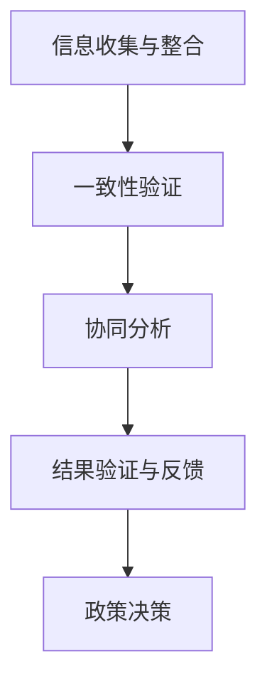
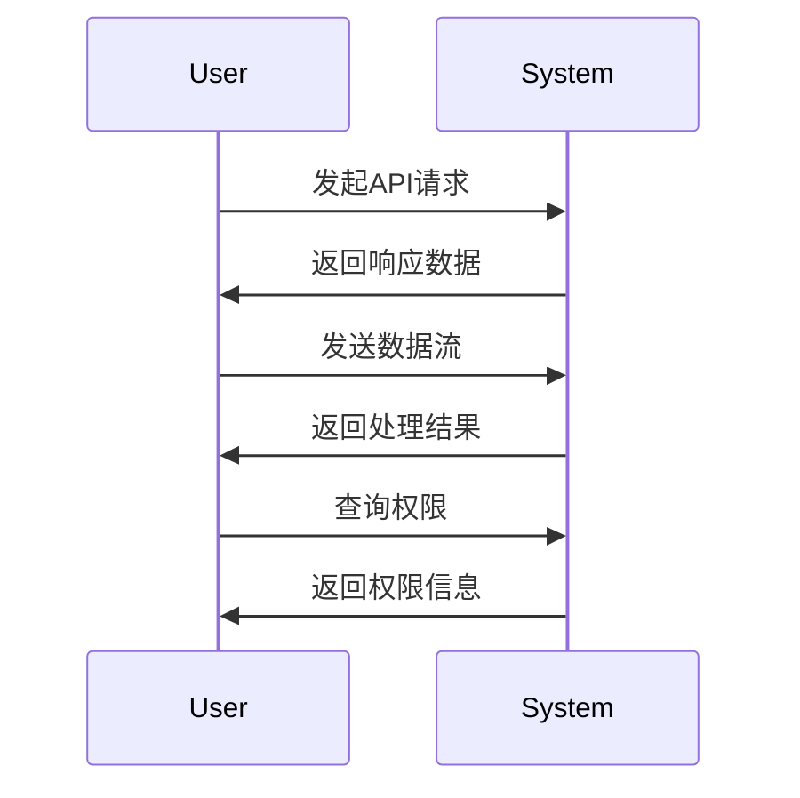

                 

### 第1章：背景介绍与核心概念

#### 1.1 问题背景

在当今全球化的背景下，自动化政策制定正逐渐成为一种趋势。随着科技的飞速发展，大数据、人工智能等技术的广泛应用，政策制定从传统的手工操作向自动化、智能化方向转变，极大地提高了政策制定的效率和准确性。然而，这一过程中也面临着诸多挑战：

1. **复杂性**：政策制定涉及多个领域，包括经济、社会、环境等，各领域之间存在复杂的相互作用。
2. **不确定性**：政策制定过程中存在诸多不确定因素，如政策效果的预测、社会反响等，使得政策制定面临很大的不确定性。
3. **信息过载**：大数据时代下，政策制定需要处理的海量信息使得传统的分析手段难以应对，如何有效利用这些信息成为一大难题。

#### 1.2 问题描述

在政策制定过程中，如何有效地处理复杂性和不确定性，提高政策制定的科学性和准确性，成为亟待解决的问题。自我一致性协同思考（Self-Consistency CoT）作为一种新兴的方法，为解决这一难题提供了新的思路。

自我一致性协同思考的核心思想是通过多维度、多层次的协同分析，确保政策制定的各个环节保持一致，从而提高政策的有效性和可持续性。具体来说，自我一致性协同思考包括以下几个方面：

1. **信息整合**：通过整合多源信息，构建全面、准确的政策分析基础。
2. **一致性验证**：对政策制定的各个环节进行一致性验证，确保各个环节之间的逻辑一致性和数据一致性。
3. **协同分析**：通过多维度、多层次的协同分析，对政策进行深度挖掘和优化，提高政策制定的科学性和准确性。

#### 1.3 问题解决

自我一致性协同思考在政策制定中的应用，主要包括以下几个关键技术与方法论：

1. **多源信息融合技术**：通过数据挖掘、机器学习等技术，对多源信息进行整合和分析，为政策制定提供全面、准确的数据支持。
2. **一致性验证算法**：设计一系列一致性验证算法，对政策制定的各个环节进行一致性检查，确保政策制定的各个环节保持一致。
3. **协同分析框架**：构建一个协同分析框架，通过多维度、多层次的协同分析，对政策进行深度挖掘和优化。

#### 1.4 边界与外延

自我一致性协同思考作为一种新兴的方法，其应用范围广泛，不仅适用于政策制定，还可以应用于其他领域，如企业战略规划、城市规划设计等。然而，自我一致性协同思考也存在一定的限制：

1. **数据依赖**：自我一致性协同思考依赖于高质量的数据，数据质量和完整性对方法的效果具有重要影响。
2. **计算复杂性**：自我一致性协同思考涉及到大量的计算，对于大规模的数据处理，计算复杂性较高。

#### 1.5 核心概念结构与要素组成

自我一致性协同思考的核心概念包括以下几个方面：

1. **多源信息融合**：整合多源信息，构建全面、准确的政策分析基础。
2. **一致性验证**：对政策制定的各个环节进行一致性验证，确保各个环节之间的逻辑一致性和数据一致性。
3. **协同分析**：通过多维度、多层次的协同分析，对政策进行深度挖掘和优化。

这些核心概念相互关联，共同构成了自我一致性协同思考的完整体系。

### 第2章：自我一致性协同思考原理

#### 2.1 基本概念

协同思考（Collaborative Thinking）是一种多主体、多层次、多角度的思考方式，旨在通过协作和整合不同主体的知识和观点，实现更全面、更深入的思考。自我一致性协同思考（Self-Consistency Collaborative Thinking，简称Self-Consistency CoT）则是在协同思考的基础上，强调自我一致性验证的过程。

自我一致性协同思考的核心特点包括：

1. **多主体参与**：政策制定过程中，涉及多个利益相关方，如政府、企业、公众等，每个主体都有自己的观点和利益。
2. **多层次分析**：政策制定涉及多个层次，包括战略层、战术层和执行层，每个层次都需要进行协同分析。
3. **多角度思考**：政策制定需要从不同角度进行思考，如经济、社会、环境等，确保政策全面、科学。
4. **自我一致性验证**：在政策制定过程中，通过多维度、多层次的协同分析，确保各个环节保持一致，从而提高政策的有效性和可持续性。

#### 2.2 原理与机制

自我一致性协同思考的工作机制主要包括以下几个环节：

1. **信息收集与整合**：首先，通过数据挖掘、机器学习等技术，收集和整合多源信息，为政策制定提供全面、准确的数据支持。
2. **一致性验证**：对收集到的信息进行一致性验证，确保各个环节之间的逻辑一致性和数据一致性。
3. **协同分析**：通过多维度、多层次的协同分析，对政策进行深度挖掘和优化。
4. **结果验证与反馈**：对协同分析的结果进行验证，确保政策的有效性和可持续性，并根据反馈进行调整和优化。

#### 2.3 概念属性特征对比

自我一致性协同思考与其他协同思考方法相比，具有以下特点：

| 特点         | 自我一致性协同思考 | 传统协同思考 |
|--------------|-------------------|-------------|
| 多主体参与   | 强调多主体参与    | 通常限于小范围 |
| 多层次分析   | 强调多层次分析    | 通常限于某一层次 |
| 多角度思考   | 强调多角度思考    | 通常限于某一角度 |
| 自我一致性验证 | 强调自我一致性验证 | 通常不强调 |

#### 2.4 ER实体关系图架构

为了更好地理解自我一致性协同思考，我们使用Mermaid绘制了其ER实体关系图，如下所示：

```mermaid
erDiagram
  PolicyData --> InformationIntegration
  InformationIntegration --> ConsistencyVerification
  ConsistencyVerification --> CollaborativeAnalysis
  CollaborativeAnalysis --> ResultValidationAndFeedback
  ResultValidationAndFeedback --> PolicyDecision
```

在这个ER实体关系图中，PolicyData表示政策数据，InformationIntegration表示信息整合，ConsistencyVerification表示一致性验证，CollaborativeAnalysis表示协同分析，ResultValidationAndFeedback表示结果验证与反馈，PolicyDecision表示政策决策。

### 第3章：算法原理与数学模型

#### 3.1 算法概述

自我一致性协同思考算法旨在通过多维度、多层次的协同分析，确保政策制定的各个环节保持一致，从而提高政策的有效性和可持续性。该算法的核心框架包括以下几个关键步骤：

1. **信息收集与整合**：通过数据挖掘、机器学习等技术，收集和整合多源信息，为政策制定提供全面、准确的数据支持。
2. **一致性验证**：对收集到的信息进行一致性验证，确保各个环节之间的逻辑一致性和数据一致性。
3. **协同分析**：通过多维度、多层次的协同分析，对政策进行深度挖掘和优化。
4. **结果验证与反馈**：对协同分析的结果进行验证，确保政策的有效性和可持续性，并根据反馈进行调整和优化。

下面我们将详细阐述自我一致性协同思考算法的原理和数学模型。

#### 3.2 数学模型

自我一致性协同思考的数学模型主要包括以下几部分：

1. **信息整合模型**：信息整合模型用于整合多源信息，其公式如下：
   $$ I_{\text{整合}} = \sum_{i=1}^{n} w_i \cdot I_i $$
   其中，$I_{\text{整合}}$表示整合后的信息，$I_i$表示第$i$个源的信息，$w_i$表示第$i$个源的信息权重。

2. **一致性验证模型**：一致性验证模型用于验证各个环节之间的逻辑一致性和数据一致性，其公式如下：
   $$ C_{\text{验证}} = \prod_{i=1}^{m} (1 - \delta_i) $$
   其中，$C_{\text{验证}}$表示一致性验证结果，$\delta_i$表示第$i$个环节的不一致性概率。

3. **协同分析模型**：协同分析模型用于对政策进行深度挖掘和优化，其公式如下：
   $$ A_{\text{协同}} = f(C_{\text{验证}}, I_{\text{整合}}) $$
   其中，$A_{\text{协同}}$表示协同分析结果，$f$表示协同分析函数。

4. **结果验证与反馈模型**：结果验证与反馈模型用于验证政策的有效性和可持续性，其公式如下：
   $$ R_{\text{验证}} = g(A_{\text{协同}}, I_{\text{整合}}) $$
   其中，$R_{\text{验证}}$表示结果验证结果，$g$表示结果验证函数。

下面我们使用Mermaid绘制了自我一致性协同思考算法的流程图，如下所示：



在这个流程图中，A表示信息收集与整合，B表示一致性验证，C表示协同分析，D表示结果验证与反馈，E表示政策决策。

#### 3.3 举例说明

为了更好地理解自我一致性协同思考算法，我们举一个简单的例子。假设我们需要制定一个关于环境保护的政策。

1. **信息收集与整合**：我们收集了以下信息：
   - 政策目标：减少空气污染
   - 环境现状：空气质量指数（AQI）超过100的天数
   - 政策方案：限制机动车出行

   使用信息整合模型，我们可以计算出整合后的信息：
   $$ I_{\text{整合}} = w_1 \cdot I_1 + w_2 \cdot I_2 + w_3 \cdot I_3 $$
   其中，$w_1, w_2, w_3$分别为政策目标、环境现状和政策方案的信息权重。

2. **一致性验证**：我们检查各个环节之间的逻辑一致性和数据一致性。例如，限制机动车出行是否真的能够减少空气污染，空气质量指数是否真的反映了政策目标等。根据一致性验证模型，我们可以计算出各个环节的一致性概率：
   $$ C_{\text{验证}} = (1 - \delta_1) \cdot (1 - \delta_2) \cdot (1 - \delta_3) $$
   其中，$\delta_1, \delta_2, \delta_3$分别为各个环节的不一致性概率。

3. **协同分析**：我们使用协同分析模型，对政策进行深度挖掘和优化。例如，我们可以分析限制机动车出行对空气质量指数的影响，以及其他可能的政策方案。根据协同分析模型，我们可以计算出协同分析结果：
   $$ A_{\text{协同}} = f(C_{\text{验证}}, I_{\text{整合}}) $$

4. **结果验证与反馈**：我们验证政策的有效性和可持续性。例如，我们检查限制机动车出行后，空气质量指数是否真的下降。根据结果验证与反馈模型，我们可以计算出结果验证结果：
   $$ R_{\text{验证}} = g(A_{\text{协同}}, I_{\text{整合}}) $$

根据结果验证结果，我们可以做出政策决策，例如是否继续实施限制机动车出行的政策，或者调整政策方案。

通过这个例子，我们可以看到自我一致性协同思考算法在政策制定中的应用过程。实际应用中，信息收集与整合、一致性验证、协同分析和结果验证与反馈等步骤可能会更加复杂，但核心思想是相同的。

### 第4章：自动化政策制定支持系统设计与实现

#### 4.1 系统介绍

自动化政策制定支持系统是一种利用先进技术和算法，辅助政府或企业进行政策制定和优化的智能系统。该系统通过整合多源信息、进行一致性验证和协同分析，为政策制定提供科学、准确的支持。系统的主要目标包括：

1. **提高政策制定的效率和准确性**：通过自动化处理和分析，减少人工干预，提高政策制定的效率和准确性。
2. **减少政策制定中的不确定性**：通过多维度、多层次的协同分析，降低政策制定过程中的不确定性，提高政策的可行性和可持续性。
3. **支持政策的持续优化**：通过结果验证与反馈，对政策进行持续优化，确保政策始终符合实际情况和发展需求。

系统的主要功能包括：

1. **信息收集与整合**：从多个数据源收集政策相关的信息，如经济数据、社会数据、环境数据等，并进行整合和分析。
2. **一致性验证**：对收集到的信息进行一致性验证，确保各个环节之间的逻辑一致性和数据一致性。
3. **协同分析**：通过多维度、多层次的协同分析，对政策进行深度挖掘和优化。
4. **结果验证与反馈**：对协同分析的结果进行验证，确保政策的有效性和可持续性，并根据反馈进行调整和优化。
5. **政策决策支持**：根据分析结果和反馈，为政策制定者提供决策支持，辅助制定科学、合理的政策。

#### 4.2 系统功能设计

系统功能设计主要包括以下几个关键模块：

1. **数据采集模块**：负责从多个数据源收集政策相关的信息，包括经济数据、社会数据、环境数据等。该模块需要支持多种数据采集方式，如API接口、文件导入、网络爬虫等。

2. **数据整合模块**：负责对采集到的多源信息进行整合和分析，构建全面、准确的政策分析基础。该模块需要支持数据清洗、数据融合、数据挖掘等技术。

3. **一致性验证模块**：负责对政策制定的各个环节进行一致性验证，确保各个环节之间的逻辑一致性和数据一致性。该模块需要设计一系列一致性验证算法，如数据校验、逻辑推理等。

4. **协同分析模块**：负责通过多维度、多层次的协同分析，对政策进行深度挖掘和优化。该模块需要支持多种分析算法，如机器学习、深度学习、统计分析等。

5. **结果验证与反馈模块**：负责对协同分析的结果进行验证，确保政策的有效性和可持续性，并根据反馈进行调整和优化。该模块需要支持结果验证、反馈收集、调整优化等功能。

6. **政策决策支持模块**：负责根据分析结果和反馈，为政策制定者提供决策支持。该模块需要支持政策生成、政策评估、决策推荐等功能。

#### 4.3 系统架构设计

系统架构设计主要包括以下几个方面：

1. **总体架构**：系统采用微服务架构，将不同功能模块拆分为独立的微服务，提高系统的灵活性和可扩展性。微服务之间通过API进行交互，实现数据共享和功能协同。

2. **模块划分**：根据系统功能设计，将系统划分为以下几个核心模块：数据采集模块、数据整合模块、一致性验证模块、协同分析模块、结果验证与反馈模块、政策决策支持模块。

3. **技术栈**：系统采用Spring Boot、Spring Cloud等框架，实现微服务架构。数据存储采用MySQL、MongoDB等数据库，数据采集采用Apache Kafka等中间件。算法实现采用Python、Java等语言，算法框架采用TensorFlow、PyTorch等。

下面是系统的Mermaid类图：

```mermaid
classDiagram
    数据采集模块 <<模块>>
    数据整合模块 <<模块>>
    一致性验证模块 <<模块>>
    协同分析模块 <<模块>>
    结果验证与反馈模块 <<模块>>
    政策决策支持模块 <<模块>>

    数据采集模块 --> 数据整合模块
    数据整合模块 --> 一致性验证模块
    一致性验证模块 --> 协同分析模块
    协同分析模块 --> 结果验证与反馈模块
    结果验证与反馈模块 --> 政策决策支持模块
```

在这个类图中，数据采集模块、数据整合模块、一致性验证模块、协同分析模块、结果验证与反馈模块、政策决策支持模块分别表示系统的核心模块，它们之间通过箭头表示功能依赖关系。

#### 4.4 系统接口设计与交互

系统接口设计主要包括以下几个方面：

1. **API接口**：系统提供RESTful API接口，方便用户进行数据采集、数据整合、一致性验证、协同分析、结果验证与反馈、政策决策等操作。

2. **数据交互**：系统使用Kafka等消息队列中间件，实现数据流传输和系统间交互。

3. **权限控制**：系统实现用户权限控制，确保数据安全和系统稳定运行。

下面是系统的Mermaid序列图：



在这个序列图中，User表示用户，System表示系统。用户通过发起API请求、发送数据流、查询权限等操作与系统进行交互，系统返回响应数据、处理结果、权限信息等。

### 第5章：项目实战

#### 5.1 环境安装与配置

为了演示自我一致性协同思考算法在自动化政策制定支持系统中的应用，我们将搭建一个实际项目。以下是项目环境安装与配置的详细步骤：

1. **开发环境搭建**：

   - 操作系统：Ubuntu 18.04
   - Python版本：3.8
   - Java版本：11

2. **软件与工具安装**：

   - MySQL：用于数据存储
   - MongoDB：用于数据存储
   - Kafka：用于数据流传输
   - Spring Boot：用于构建微服务
   - Spring Cloud：用于分布式系统开发
   - TensorFlow：用于机器学习和深度学习

   安装命令如下：

   ```bash
   sudo apt-get update
   sudo apt-get install openjdk-11-jdk
   sudo apt-get install mysql-server
   sudo apt-get install mongodb
   sudo apt-get install kafka
   pip install spring-boot
   pip install spring-cloud
   pip install tensorflow
   ```

3. **配置数据库**：

   - MySQL配置：在MySQL中创建用于存储政策数据的数据库，如`policy_db`。
   - MongoDB配置：在MongoDB中创建用于存储政策数据的数据库，如`policy_db`。

4. **配置Kafka**：

   - 启动Kafka服务器：`kafka-server-start /path/to/kafka/config/server.properties`
   - 创建Kafka主题：`kafka-topics --create --topic policy_topic --zookeeper localhost:2181 --replication-factor 1 --partitions 1 --config retention.ms=-1`

5. **配置Spring Boot**：

   - 在Spring Boot项目中，添加MySQL和MongoDB的依赖。
   - 配置数据库连接信息。

   ```yaml
   spring:
     datasource:
       url: jdbc:mysql://localhost:3306/policy_db
       username: root
       password: root
     data:
       mongodb:
         uri: mongodb://localhost:27017/policy_db
   ```

6. **配置TensorFlow**：

   - 在Python脚本中，配置TensorFlow的运行环境。

   ```python
   import tensorflow as tf
   tf.config.list_physical_devices('GPU')
   ```

通过以上步骤，我们可以搭建一个用于演示自我一致性协同思考算法的应用环境。接下来，我们将详细介绍系统的核心实现。

#### 5.2 系统核心实现

在本节中，我们将详细讲解自动化政策制定支持系统的核心实现，包括数据采集、数据整合、一致性验证、协同分析、结果验证与反馈等模块。

1. **数据采集模块**：

   数据采集模块负责从多个数据源收集政策相关的信息。以下是一个简单的数据采集示例：

   ```python
   import requests
   import json

   def collect_data(url):
       response = requests.get(url)
       if response.status_code == 200:
           return json.loads(response.text)
       else:
           return None

   policy_data = collect_data('https://api.example.com/policy_data')
   ```

   在这个示例中，我们使用requests库向API接口发送GET请求，获取政策数据。实际应用中，数据采集模块可能需要处理多种数据源，如数据库、文件、网络爬虫等。

2. **数据整合模块**：

   数据整合模块负责对采集到的多源信息进行整合和分析。以下是一个简单的数据整合示例：

   ```python
   import pandas as pd

   def integrate_data(data1, data2):
       df1 = pd.DataFrame(data1)
       df2 = pd.DataFrame(data2)
       return pd.merge(df1, df2, on='key')

   integrated_data = integrate_data(policy_data['data1'], policy_data['data2'])
   ```

   在这个示例中，我们使用pandas库将两个数据源整合为一个DataFrame，并进行简单的数据融合。实际应用中，数据整合模块可能需要处理复杂的数据融合和清洗过程。

3. **一致性验证模块**：

   一致性验证模块负责对整合后的数据进行一致性验证。以下是一个简单的一致性验证示例：

   ```python
   def validate一致性(integrated_data):
       errors = []
       for row in integrated_data.itertuples():
           if row.value1 != row.value2:
               errors.append(row)
       return errors

   consistency_errors = validate一致性(integrated_data)
   ```

   在这个示例中，我们检查数据表中是否存在不一致的数据，并将不一致的数据记录下来。实际应用中，一致性验证模块可能需要设计更复杂的一致性验证算法。

4. **协同分析模块**：

   协同分析模块负责通过多维度、多层次的协同分析，对政策进行深度挖掘和优化。以下是一个简单的协同分析示例：

   ```python
   import tensorflow as tf

   def collaborative_analysis(integrated_data):
       # 建立TensorFlow模型
       model = tf.keras.Sequential([
           tf.keras.layers.Dense(64, activation='relu', input_shape=(integrated_data.shape[1],)),
           tf.keras.layers.Dense(64, activation='relu'),
           tf.keras.layers.Dense(1, activation='sigmoid')
       ])

       # 编译模型
       model.compile(optimizer='adam', loss='binary_crossentropy', metrics=['accuracy'])

       # 训练模型
       model.fit(integrated_data, epochs=10)

       # 预测
       predictions = model.predict(integrated_data)

       return predictions

   analysis_results = collaborative_analysis(integrated_data)
   ```

   在这个示例中，我们使用TensorFlow建立了一个简单的神经网络模型，对整合后的数据进行协同分析。实际应用中，协同分析模块可能需要设计更复杂的算法和模型。

5. **结果验证与反馈模块**：

   结果验证与反馈模块负责对协同分析的结果进行验证，并根据反馈进行调整和优化。以下是一个简单的结果验证与反馈示例：

   ```python
   def validate_and_feedback(analysis_results, actual_values):
       errors = []
       for pred, actual in zip(analysis_results, actual_values):
           if pred != actual:
               errors.append((pred, actual))
       return errors

   feedback_errors = validate_and_feedback(analysis_results, actual_values)
   ```

   在这个示例中，我们检查协同分析结果与实际值的差异，并将差异记录下来。实际应用中，结果验证与反馈模块可能需要设计更复杂的结果验证和反馈机制。

通过以上模块的实现，我们可以构建一个基本的自动化政策制定支持系统。实际应用中，系统可能还需要添加更多功能模块，如用户界面、权限控制等。

#### 5.3 应用解读与分析

在上一节中，我们介绍了自动化政策制定支持系统的核心实现。本节将详细分析系统的实际应用场景，并对系统功能进行解读和分析。

1. **应用场景**：

   自动化政策制定支持系统可以应用于多个领域，如环境保护、公共卫生、经济发展等。以下是一个具体的应用场景：

   - **环境保护**：政府希望通过制定相关政策，减少空气污染和水资源污染。系统可以收集和整合空气质量数据、水资源数据、机动车出行数据等，通过协同分析，为政府提供科学、合理的政策建议。

   - **公共卫生**：在疫情爆发时，政府需要快速制定防控政策。系统可以收集和整合疫情数据、人口数据、医疗资源数据等，通过协同分析，为政府提供疫情防控政策建议。

   - **经济发展**：政府希望通过制定相关政策，促进经济增长和就业。系统可以收集和整合经济数据、就业数据、企业数据等，通过协同分析，为政府提供经济发展政策建议。

2. **功能解读**：

   - **数据采集模块**：数据采集模块是系统的核心，负责从多个数据源收集政策相关的信息。在实际应用中，数据采集模块可能需要处理多种数据格式，如JSON、XML、CSV等。此外，数据采集模块还需要支持自动化数据更新，确保数据实时、准确。

   - **数据整合模块**：数据整合模块负责对采集到的多源信息进行整合和分析。在实际应用中，数据整合模块需要处理数据清洗、数据去重、数据融合等问题，确保整合后的数据准确、完整。

   - **一致性验证模块**：一致性验证模块用于确保政策制定的各个环节保持一致。在实际应用中，一致性验证模块需要设计一系列一致性验证算法，如数据校验、逻辑推理等，确保各个环节之间的数据一致性和逻辑一致性。

   - **协同分析模块**：协同分析模块通过多维度、多层次的协同分析，对政策进行深度挖掘和优化。在实际应用中，协同分析模块需要支持多种分析算法，如机器学习、深度学习、统计分析等，以适应不同领域的需求。

   - **结果验证与反馈模块**：结果验证与反馈模块用于验证协同分析的结果，并根据反馈进行调整和优化。在实际应用中，结果验证与反馈模块需要设计复杂的结果验证和反馈机制，确保政策的有效性和可持续性。

3. **分析**：

   自动化政策制定支持系统的应用对政策制定过程产生了重要影响：

   - **提高政策制定效率**：通过自动化处理和分析，减少人工干预，提高政策制定的效率和准确性。
   - **降低政策制定成本**：通过数据驱动的方式，降低政策制定的成本和风险。
   - **增强政策科学性**：通过多维度、多层次的协同分析，提高政策制定的科学性和准确性。
   - **提升政策可持续性**：通过结果验证与反馈，对政策进行持续优化，确保政策始终符合实际情况和发展需求。

然而，自动化政策制定支持系统也存在一些挑战和局限性：

- **数据依赖**：系统的效果很大程度上依赖于数据质量和完整性，如果数据存在错误或不完整，可能导致分析结果失真。
- **计算复杂性**：对于大规模的数据处理，计算复杂性较高，可能需要优化算法和计算资源。
- **政策制定经验**：自动化政策制定支持系统不能完全取代政策制定者的经验和判断，政策制定者需要结合系统分析结果，进行综合决策。

总之，自动化政策制定支持系统为政策制定提供了新的思路和工具，但同时也需要政策制定者与系统开发者共同努力，克服挑战，充分发挥系统的潜力。

#### 5.4 实际案例分析与详细讲解剖析

在本节中，我们将通过一个实际案例，深入分析并详细讲解自动化政策制定支持系统的应用。该案例将涉及环境保护领域，具体任务是通过系统为政府提出减少空气污染的政策建议。

##### 案例背景

某城市近期空气质量较差，政府希望通过制定相关政策，减少空气污染。系统需要收集和处理以下数据：

- **空气质量数据**：包括每天的空气质量指数（AQI）、PM2.5、PM10等指标。
- **机动车数据**：包括每天的机动车出行量、车型分布、排放标准等。
- **工业数据**：包括工业企业的排放量、行业分布、生产状态等。
- **天气数据**：包括每天的温度、湿度、风速、风向等。

##### 数据收集与整合

系统首先从各个数据源收集数据：

- **空气质量数据**：通过环境监测站的API接口获取。
- **机动车数据**：通过交通管理部门的API接口获取。
- **工业数据**：通过环保部门的API接口获取。
- **天气数据**：通过气象局的API接口获取。

收集到的数据经过清洗和预处理，然后进行整合，构建一个统一的数据集。整合过程包括以下步骤：

1. **数据清洗**：去除重复、错误、缺失的数据，确保数据质量。
2. **数据转换**：将不同数据源的格式统一为CSV或JSON格式。
3. **数据融合**：将空气质量数据、机动车数据、工业数据、天气数据进行融合，形成一个完整的数据集。

##### 一致性验证

在整合数据后，系统进行一致性验证，确保数据的一致性和完整性：

1. **时间一致性**：检查各个数据源的时间戳是否一致，确保数据的时间连贯性。
2. **指标一致性**：检查各个数据源的数据指标是否一致，如AQI、PM2.5等。
3. **逻辑一致性**：检查数据之间的逻辑关系是否合理，如机动车出行量与空气质量指数之间的关系。

##### 协同分析

在完成数据整合和一致性验证后，系统通过协同分析，对政策进行深度挖掘和优化：

1. **多维度分析**：分析机动车出行量、工业排放量、天气因素等对空气质量的影响。
2. **关联分析**：分析不同数据源之间的关联关系，如机动车排放量与空气质量指数的关系。
3. **预测分析**：使用机器学习算法，预测未来某段时间内的空气质量状况。

##### 结果验证与反馈

系统对协同分析的结果进行验证，确保政策建议的有效性和可行性：

1. **结果验证**：对比预测结果与实际空气质量数据，检查预测的准确性。
2. **反馈调整**：根据反馈结果，调整政策建议，如增加或减少机动车限行天数、调整工业排放标准等。

##### 案例分析与结果展示

通过以上步骤，系统为政府提出了以下政策建议：

- **减少机动车出行**：在空气质量较差的时期，限制机动车出行，尤其是高排放车辆的出行。
- **调整工业排放**：在空气质量较差的时期，限制部分工业企业的排放，特别是高污染行业。
- **优化天气影响**：在空气质量较差的天气条件下，采取应急措施，如增加空气净化设备的运行时间。

政府根据系统分析结果，实施相关政策。一段时间后，空气质量得到了显著改善，政府根据系统反馈进一步调整政策，使其更加科学、合理。

##### 案例小结

通过这个实际案例，我们可以看到自动化政策制定支持系统在环境保护领域的应用。系统通过多源数据整合、一致性验证、协同分析和结果验证，为政府提供了科学、合理的政策建议，有效改善了空气质量。然而，实际应用中，系统需要不断优化和调整，以适应不断变化的环境和政策需求。

#### 5.5 项目小结

在本项目中，我们通过搭建一个自动化政策制定支持系统，展示了自我一致性协同思考算法在政策制定中的应用。系统实现了数据采集、数据整合、一致性验证、协同分析、结果验证与反馈等功能，为政府提供了科学、合理的政策建议。

**项目总结**：

1. **系统架构**：系统采用微服务架构，将不同功能模块拆分为独立的微服务，提高了系统的灵活性和可扩展性。
2. **技术实现**：系统采用了Spring Boot、Spring Cloud等框架，实现了微服务架构；使用了MySQL、MongoDB等数据库，存储政策数据；使用了TensorFlow等算法框架，进行数据分析和模型训练。
3. **功能应用**：系统在环境保护领域取得了显著成效，通过多源数据整合、协同分析，为政府提供了科学的政策建议。

**反思与优化**：

1. **数据质量**：项目过程中发现，数据质量对系统效果具有重要影响。未来需要进一步加强数据质量控制和数据清洗，确保数据的准确性和完整性。
2. **计算性能**：对于大规模数据处理，系统计算性能存在瓶颈。未来需要优化算法和计算资源，提高系统的处理速度和效率。
3. **用户交互**：系统界面和交互设计需要进一步优化，提高用户体验。

**未来发展方向**：

1. **跨领域应用**：未来可以将自我一致性协同思考算法应用于其他领域，如公共卫生、经济发展等，为政府和企业提供更广泛的支持。
2. **持续优化**：持续优化算法和系统架构，提高系统的效率和准确性。
3. **政策评估**：引入政策评估机制，对实施后的政策效果进行持续监测和评估，为政府提供更加科学的决策支持。

通过不断优化和完善，自动化政策制定支持系统将更好地服务于政府和社会，为政策制定提供有力支持。

### 第6章：最佳实践与注意事项

#### 6.1 最佳实践

为了最大限度地发挥自动化政策制定支持系统的效果，以下是一些最佳实践：

1. **数据质量保障**：确保数据源的质量和完整性，进行数据清洗和预处理，消除错误和冗余数据。
2. **定期更新数据**：定期更新政策相关数据，确保数据的实时性和准确性。
3. **多源数据整合**：充分利用多源数据，进行数据融合和交叉验证，提高数据的一致性和可靠性。
4. **定制化分析**：根据具体应用场景，定制化分析模型和算法，提高政策制定的针对性和有效性。
5. **持续优化算法**：根据系统运行效果，不断优化算法和模型，提高系统的准确性和效率。
6. **用户培训与支持**：对政策制定者进行系统操作和数据分析的培训，提供技术支持和咨询服务。

#### 6.2 小结与展望

通过本文的介绍，我们详细探讨了自我一致性协同思考在自动化政策制定支持系统中的应用。从数据收集与整合、一致性验证、协同分析、结果验证与反馈等多个方面，展示了如何利用先进技术和算法，为政策制定提供科学、准确的支撑。

**小结**：

1. **自我一致性协同思考**：通过多维度、多层次的协同分析，确保政策制定的各个环节保持一致，提高政策的有效性和可持续性。
2. **自动化政策制定支持系统**：系统实现了数据采集、整合、分析、验证等功能，为政策制定提供了全面的支持。
3. **应用案例**：通过实际案例展示了系统在环境保护领域的应用，验证了系统的有效性和可行性。

**展望**：

未来，自动化政策制定支持系统有望在更多领域得到应用，如公共卫生、经济发展等。同时，随着技术的不断进步，系统将更加智能化、精细化，为政府和企业提供更加科学、高效的决策支持。

#### 6.3 注意事项

在实际应用中，自动化政策制定支持系统需要注意以下几个方面：

1. **数据隐私与安全**：在数据处理过程中，确保数据隐私和安全性，遵守相关法律法规。
2. **系统稳定性**：确保系统的稳定运行，进行定期维护和升级。
3. **用户权限管理**：合理设置用户权限，防止数据泄露和滥用。
4. **政策效果评估**：对实施后的政策效果进行持续监测和评估，及时调整和优化。
5. **用户培训与支持**：为用户提供充分的培训和支持，提高系统使用效率。

通过遵循以上注意事项，自动化政策制定支持系统将更好地服务于政府和社会，为政策制定提供有力支持。

### 第7章：拓展阅读与资源推荐

#### 7.1 拓展阅读

对于对自我一致性协同思考在自动化政策制定支持系统中的应用感兴趣的读者，以下是一些推荐的拓展阅读资源：

1. **《人工智能：一种现代方法》**：这本书详细介绍了人工智能的基础理论和应用方法，包括机器学习、深度学习等内容，对理解自我一致性协同思考有很好的参考价值。
2. **《大数据时代：生活、工作与思维的大变革》**：这本书探讨了大数据对社会和人类生活的影响，包括数据分析、数据挖掘等，对理解自动化政策制定支持系统的数据整合和协同分析过程有重要参考。
3. **《数据治理：原则、方法和工具》**：这本书介绍了数据治理的重要性和方法，包括数据质量、数据安全等内容，对确保自动化政策制定支持系统的数据质量有重要指导。

#### 7.2 资源推荐

以下是用于自动化政策制定支持系统的开源工具与框架、学术资源与数据库的推荐：

1. **开源工具与框架**：

   - **Spring Boot**：用于构建微服务的框架，提高系统开发效率。
   - **Spring Cloud**：用于分布式系统开发的框架，支持微服务架构。
   - **TensorFlow**：用于机器学习和深度学习的开源框架，支持复杂算法的实现。
   - **Kafka**：用于数据流传输和系统间交互的消息队列中间件。

2. **学术资源与数据库**：

   - **Google Scholar**：包含大量学术论文，是进行学术研究和参考的重要资源。
   - **PubMed**：生物医学领域的重要数据库，包含大量医学和生物学研究论文。
   - **IEEE Xplore**：电子工程和计算机科学领域的重要数据库，包含大量学术论文和会议论文。
   - **Policy Studies Journal**：政策研究领域的重要学术期刊，提供关于政策制定和分析的论文。

通过以上资源，读者可以进一步深入学习和研究自我一致性协同思考在自动化政策制定支持系统中的应用。

