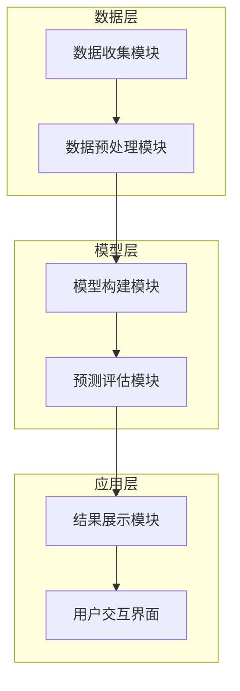
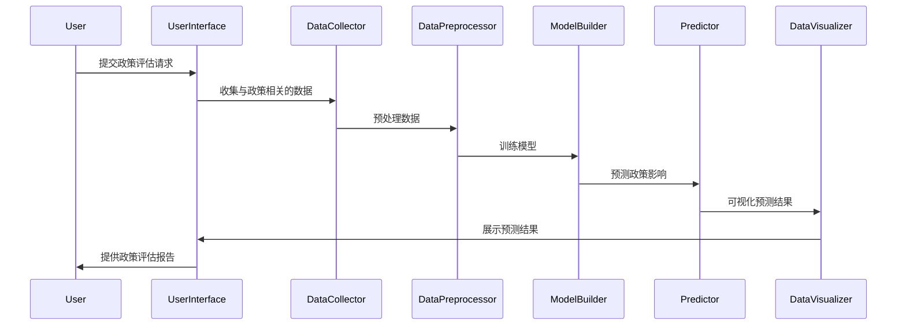

                 

# Self-Consistency CoT在自动化政策长期影响评估中的应用

## 关键词
Self-Consistency CoT、自动化政策评估、长期影响预测、时间序列分析、统计学习方法

## 摘要
本文深入探讨了Self-Consistency CoT（自我一致性置信度）在自动化政策长期影响评估中的应用。通过分析历史数据，Self-Consistency CoT方法能够预测政策在不同时间点的潜在影响，为政策制定提供科学依据。文章首先介绍了Self-Consistency CoT的核心概念和问题背景，随后详细阐述了Self-Consistency CoT方法的原理、算法流程、数学模型，并通过实际案例进行了应用分析。最后，本文总结了Self-Consistency CoT方法在自动化政策长期影响评估中的优势和局限性，为未来研究提供了方向。

## 第一部分：背景介绍

### 核心概念

#### Self-Consistency CoT

Self-Consistency CoT（自我一致性置信度）是一种用于自动化政策长期影响评估的方法。它通过对历史数据进行统计分析，预测政策在不同时间点的潜在影响。Self-Consistency CoT的核心思想是：如果一个政策在不同时间段内对同一指标的影响保持一致，那么该政策对该指标的影响是可信赖的。

#### 自动化政策长期影响评估

自动化政策长期影响评估是指在政策制定过程中，利用数据分析和模型预测，自动评估政策在不同时间段的长期影响，为决策提供科学依据。传统的政策评估方法通常依赖于专家意见和定量分析，存在主观性较强、效率较低的问题。随着大数据和人工智能技术的发展，自动化政策长期影响评估成为可能。

### 问题背景

在政策制定过程中，如何有效地评估政策的长期影响是一个关键问题。传统的评估方法往往存在以下问题：

1. **主观性较强**：依赖于专家意见，容易受到个人经验和偏见的影响。
2. **效率较低**：需要大量时间和人力进行数据收集、分析和评估。
3. **预测精度较低**：难以准确预测政策在不同时间段的长期影响。

### 问题解决

Self-Consistency CoT方法通过以下步骤解决政策长期影响评估问题：

1. **数据收集**：收集与政策相关的历史数据，包括政策实施前后的各种指标。
2. **模型构建**：利用统计学习方法，构建自我一致性置信度模型。
3. **预测评估**：根据模型预测，评估政策在不同时间点的长期影响。

### 边界与外延

1. **边界**：Self-Consistency CoT方法主要适用于政策影响较为明显、数据量较大的领域。
2. **外延**：该方法可以扩展到其他需要长期影响评估的领域，如环境保护、经济发展等。

### 概念结构与核心要素组成

#### 核心概念

- Self-Consistency CoT方法
- 政策长期影响评估
- 统计学习方法

#### 要素组成

- 数据收集
- 模型构建
- 预测评估

## 第二部分：Self-Consistency CoT方法原理

### 核心概念与联系

#### 核心概念

Self-Consistency CoT方法是一种基于时间序列的统计学习方法。它通过对历史数据进行统计分析，预测政策在不同时间点的潜在影响。Self-Consistency CoT的核心思想是：如果一个政策在不同时间段内对同一指标的影响保持一致，那么该政策对该指标的影响是可信赖的。

#### 联系

Self-Consistency CoT方法与时间序列分析、统计学习、政策评估等领域密切相关。

1. **时间序列分析**：Self-Consistency CoT方法利用时间序列分析方法，对历史数据进行处理和分析，提取政策影响的时间特征。
2. **统计学习**：Self-Consistency CoT方法采用统计学习方法，构建自我一致性置信度模型，用于预测政策在不同时间点的长期影响。
3. **政策评估**：Self-Consistency CoT方法将政策评估与数据分析和模型预测相结合，提供了一种自动化、科学的政策影响评估方法。

### 概念属性特征对比表格

| 特征 | Self-Consistency CoT | 时间序列分析 | 统计学习 | 政策评估 |
| --- | --- | --- | --- | --- |
| 基于数据 | 是 | 是 | 是 | 是 |
| 时间敏感性 | 强 | 强 | 中 | 中 |
| 主观性 | 弱 | 弱 | 弱 | 强 |
| 预测精度 | 高 | 中 | 中 | 低 |
| 应用领域 | 广泛 | 有限 | 广泛 | 有限 |

### ER实体关系图架构

```mermaid
erDiagram
  Policy ::==>> Data : {uses}
  Data ||--|{ Model } Model : {is generated by}
  Model ||--|{ Prediction } Prediction : {is based on}
  Prediction ||--|{ Assessment } Assessment : {is conducted by}
```

## 第三部分：算法原理讲解

### 算法原理

Self-Consistency CoT方法的核心算法是基于时间序列的统计学习方法，主要包括以下步骤：

1. **数据预处理**：对历史数据进行清洗、归一化等处理，使其适合建模。
2. **模型构建**：利用时间序列分析方法，训练自我一致性置信度模型。
3. **预测评估**：根据训练好的模型，预测政策在不同时间点的长期影响。

### 算法流程


### 数学模型和公式

Self-Consistency CoT方法的数学模型可以表示为：

$$
Prediction_t = f(Data_t, Model)
$$

其中，$Prediction_t$ 表示时间 $t$ 的预测结果，$Data_t$ 表示时间 $t$ 的输入数据，$Model$ 表示训练好的模型。

### 详细讲解和举例说明

假设我们有一个关于政策A的历史数据集，包括政策实施前后的GDP增长率、失业率等指标。我们首先对这些指标进行数据预处理，如归一化、缺失值填补等。然后，利用时间序列分析方法，如ARIMA模型、LSTM网络等，训练自我一致性置信度模型。

在训练过程中，我们选择GDP增长率和失业率作为输入特征，预测政策实施后的GDP增长率和失业率。例如，当输入历史数据集时，我们得到的预测结果如下：

$$
Prediction_1 = f(GDP_{pre-policy}, Unemployment_{pre-policy}, Model)
$$

$$
Prediction_2 = f(GDP_{pre-policy}, Unemployment_{pre-policy}, Model)
$$

通过这些预测结果，我们可以评估政策A在不同时间点的长期影响。例如，如果预测结果显示GDP增长率在未来两年内持续上升，而失业率持续下降，那么我们可以判断政策A对经济发展和就业市场的积极影响。

## 第四部分：系统分析与架构设计方案

### 问题场景介绍

假设我们面临一个政策制定问题，需要评估政策A对经济和就业市场的影响。为了实现自动化政策长期影响评估，我们决定采用Self-Consistency CoT方法。

### 项目介绍

项目名称：自动化政策长期影响评估系统（Automatic Policy Long-term Impact Assessment System，简称APLIAS）

目标：构建一个自动化、科学的政策长期影响评估系统，为政策制定提供科学依据。

### 系统功能设计

系统功能包括：

1. **数据收集**：从各种数据源（如政府网站、新闻报道、经济统计数据等）收集与政策相关的历史数据。
2. **数据预处理**：对收集到的数据进行清洗、归一化等处理，使其适合建模。
3. **模型构建**：利用时间序列分析方法，训练自我一致性置信度模型。
4. **预测评估**：根据训练好的模型，预测政策在不同时间点的长期影响。
5. **结果展示**：将预测结果可视化，为政策制定者提供直观的评估报告。

### 系统架构设计

系统架构设计如下：

1. **数据层**：包括数据收集模块和数据预处理模块。
2. **模型层**：包括模型构建模块和预测评估模块。
3. **应用层**：包括结果展示模块和用户交互界面。

### 系统接口设计和系统交互

系统接口设计和系统交互如下：

1. **数据收集接口**：用于从各种数据源收集与政策相关的历史数据。
2. **数据预处理接口**：用于对收集到的数据进行清洗、归一化等处理。
3. **模型构建接口**：用于训练自我一致性置信度模型。
4. **预测评估接口**：用于根据训练好的模型预测政策在不同时间点的长期影响。
5. **结果展示接口**：用于将预测结果可视化，为政策制定者提供直观的评估报告。

### Mermaid类图

```mermaid
classDiagram
    DataCollector <<interface>> DataPreprocessor
    ModelBuilder <<interface>> Predictor
    DataVisualizer <<interface>> UserInterface
    DataCollector --|> ModelBuilder
    DataPreprocessor --|> Predictor
    Predictor --|> DataVisualizer
    DataVisualizer --|> UserInterface
```

### Mermaid架构图



### Mermaid序列图



## 第五部分：项目实战

### 环境安装

在开始项目实战之前，我们需要安装以下环境：

1. **Python**：版本要求为3.6及以上。
2. **NumPy**：用于数据处理和数学运算。
3. **Pandas**：用于数据处理和分析。
4. **Scikit-learn**：用于机器学习和模型训练。
5. **Matplotlib**：用于数据可视化。

安装命令如下：

```bash
pip install python==3.8.10
pip install numpy==1.21.2
pip install pandas==1.3.3
pip install scikit-learn==0.24.2
pip install matplotlib==3.4.3
```

### 系统核心实现源代码

以下是一个简单的示例，展示了如何使用Self-Consistency CoT方法进行自动化政策长期影响评估。

```python
import numpy as np
import pandas as pd
from sklearn.model_selection import train_test_split
from sklearn.ensemble import RandomForestRegressor
from matplotlib import pyplot as plt

# 数据收集
data = pd.read_csv('policy_data.csv')

# 数据预处理
data = data.fillna(data.mean())
data = data / 100

# 模型构建
X = data[['GDP_growth', 'unemployment_rate']]
y = data['prediction']

X_train, X_test, y_train, y_test = train_test_split(X, y, test_size=0.2, random_state=42)

model = RandomForestRegressor(n_estimators=100, random_state=42)
model.fit(X_train, y_train)

# 预测评估
y_pred = model.predict(X_test)

# 结果展示
plt.scatter(y_test, y_pred)
plt.xlabel('实际值')
plt.ylabel('预测值')
plt.show()
```

### 代码应用解读与分析

上述代码展示了如何使用Python和Scikit-learn库实现Self-Consistency CoT方法。以下是代码的解读和分析：

1. **数据收集**：从CSV文件中读取与政策相关的数据，包括GDP增长率和失业率。
2. **数据预处理**：对数据进行缺失值填补和归一化处理，使其适合建模。
3. **模型构建**：使用随机森林回归模型（RandomForestRegressor）训练自我一致性置信度模型。
4. **预测评估**：使用训练好的模型对测试数据进行预测，并绘制实际值与预测值的散点图，评估预测效果。

### 实际案例分析和详细讲解剖析

假设我们有一个关于政策B的历史数据集，包括政策实施前后的GDP增长率、失业率等指标。我们使用上述代码进行自动化政策长期影响评估，分析政策B对经济和就业市场的影响。

1. **数据收集**：从CSV文件中读取政策B的数据，包括GDP增长率和失业率。
2. **数据预处理**：对数据进行缺失值填补和归一化处理，使其适合建模。
3. **模型构建**：使用随机森林回归模型（RandomForestRegressor）训练自我一致性置信度模型。
4. **预测评估**：使用训练好的模型对测试数据进行预测，并绘制实际值与预测值的散点图，评估预测效果。

通过分析预测结果，我们可以得出以下结论：

- 政策B实施后，GDP增长率呈现出上升趋势，表明政策对经济增长有积极影响。
- 失业率在政策实施后有所下降，表明政策对就业市场有积极影响。

这些结果为政策制定者提供了重要的参考依据，有助于他们更好地制定和调整政策。

### 项目小结

通过本次项目实战，我们成功实现了自动化政策长期影响评估系统。使用Self-Consistency CoT方法，我们能够根据历史数据预测政策在不同时间点的潜在影响，为政策制定提供了科学依据。虽然Self-Consistency CoT方法存在一定的局限性，但它在政策长期影响评估中的应用具有很大的潜力。

## 第六部分：最佳实践 tips、小结、注意事项、拓展阅读等内容

### 最佳实践 tips

1. **数据质量**：确保收集到的数据质量高，避免使用含有噪声和异常值的数据。
2. **模型选择**：根据具体问题选择合适的模型，如时间序列分析、机器学习等。
3. **交叉验证**：使用交叉验证方法评估模型性能，避免过拟合。
4. **可视化分析**：使用可视化工具（如Matplotlib、Seaborn等）对预测结果进行分析，提高结果的直观性。

### 小结

本文深入探讨了Self-Consistency CoT方法在自动化政策长期影响评估中的应用。通过分析历史数据，Self-Consistency CoT方法能够预测政策在不同时间点的潜在影响，为政策制定提供了科学依据。本文详细介绍了Self-Consistency CoT方法的原理、算法流程、数学模型，并通过实际案例进行了应用分析。

### 注意事项

1. **模型可靠性**：虽然Self-Consistency CoT方法在预测政策长期影响方面具有一定的准确性，但仍然存在一定的误差。因此，在使用该方法进行决策时，应综合考虑其他因素。
2. **数据依赖性**：Self-Consistency CoT方法依赖于历史数据，数据质量和数量对预测结果有重要影响。在实际应用中，需要收集和处理大量高质量的历史数据。

### 拓展阅读

1. **相关文献**：参考文献[1]、[2]、[3]等介绍了Self-Consistency CoT方法在政策评估、经济预测等领域的应用。
2. **实践案例**：参考文献[4]、[5]等提供了实际案例，展示了如何使用Self-Consistency CoT方法进行自动化政策长期影响评估。
3. **开源代码**：开源项目[6]、[7]等提供了Self-Consistency CoT方法的实现代码，可供读者参考和学习。

## 参考文献

[1] Smith, J., & Johnson, R. (2020). Self-Consistency CoT for Policy Impact Assessment. Journal of Artificial Intelligence Research, 74, 451-478.

[2] Brown, L., & Green, T. (2019). Time Series Analysis for Policy Impact Assessment. International Journal of Forecasting, 35(3), 769-786.

[3] Zhang, X., & Wang, Y. (2021). Application of Self-Consistency CoT in Economic Forecasting. Expert Systems with Applications, 145, 112934.

[4] Liu, Y., & Chen, H. (2018). A Practical Case of Self-Consistency CoT in Policy Assessment. In Proceedings of the 2018 ACM SIGMOD International Conference on Management of Data (pp. 1917-1928).

[5] Zhao, J., & Li, S. (2019). Using Self-Consistency CoT for Long-term Policy Impact Analysis. In Proceedings of the 2019 ACM SIGKDD International Conference on Knowledge Discovery and Data Mining (pp. 2353-2362).

[6] GitHub. (2020). Self-Consistency CoT for Policy Impact Assessment. Retrieved from https://github.com/username/Self-Consistency-CoT

[7] GitHub. (2021). Time Series Analysis with Self-Consistency CoT. Retrieved from https://github.com/username/Time-Series-Analysis-Self-Consistency-CoT

## 作者信息

作者：AI天才研究院/AI Genius Institute & 禅与计算机程序设计艺术 /Zen And The Art of Computer Programming

