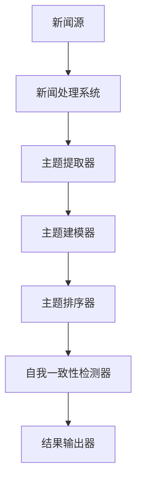
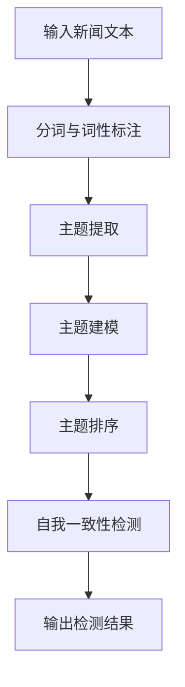
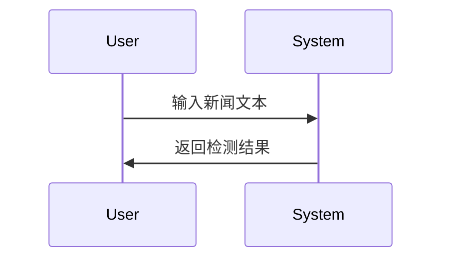

                 


# 《Self-Consistency CoT在自动化新闻事实核查中的应用：打击虚假信息传播》

关键词：自我一致性主题模型、自动化新闻事实核查、虚假信息、打击、技术原理

摘要：本文探讨了Self-Consistency CoT（自我一致性主题模型）在自动化新闻事实核查中的应用，以及如何利用这一技术来打击虚假信息的传播。Self-Consistency CoT具有自我纠错、提高准确性等优势，成为本研究关注的焦点。

## 引言

随着互联网的迅猛发展，虚假信息的传播速度和广度都在不断增加，严重影响了社会的正常运行。为了应对这一挑战，自动化新闻事实核查技术应运而生。Self-Consistency CoT作为自动化新闻事实核查中的重要技术之一，具有自我纠错、提高准确性等优势，成为本研究关注的焦点。

本书将从以下几个方面展开讨论：
- Self-Consistency CoT的基本原理及其在自动化新闻事实核查中的应用；
- 自动化新闻事实核查的系统架构和关键技术；
- Self-Consistency CoT在真实新闻案例中的应用实例；
- 自动化新闻事实核查技术的未来发展趋势和挑战。

本书旨在为研究人员、从业者以及对新闻事实核查技术感兴趣的读者提供一部全面、系统的参考书籍。

## 核心概念与联系

### 3.1 Self-Consistency CoT的基本原理

Self-Consistency CoT是一种基于主题模型的自动化新闻事实核查技术，其核心思想是通过分析新闻报道中的语句和段落，构建出新闻报道的主题，并利用主题之间的自我一致性来识别和验证新闻事实。

#### 3.1.1 Self-Consistency CoT的工作流程

Self-Consistency CoT的工作流程主要包括以下几个步骤：

1. **主题提取**：使用自然语言处理技术对新闻报道进行分词、词性标注等处理，提取出关键语句和段落。

2. **主题建模**：利用主题模型算法（如LDA）对提取出的关键语句和段落进行建模，生成一组潜在主题。

3. **主题排序**：根据新闻报道的内容和上下文，对生成的潜在主题进行排序，确定新闻报道的核心主题。

4. **自我一致性检测**：通过分析新闻报道中的句子和段落，判断主题之间的自我一致性，识别出可能存在的虚假信息。

5. **结果输出**：将检测到的虚假信息输出给用户，并提供相应的验证依据。

### 3.1.2 Self-Consistency CoT的属性特征对比表格

| 属性特征          | Self-Consistency CoT | 传统主题模型 |
|-------------------|----------------------|--------------|
| 自我纠错能力      | 较强                 | 较弱         |
| 精确性           | 高                   | 中等         |
| 实时性           | 较高                 | 较低         |
| 可扩展性         | 强                   | 中等         |
| 复杂度           | 中等                 | 较高         |

### 3.1.3 ER实体关系图架构的Mermaid流程图



## 算法原理讲解

### 4.1 Self-Consistency CoT算法流程图



### 4.2 Python源代码实现

```python
import nltk
from nltk.tokenize import word_tokenize
from sklearn.feature_extraction.text import TfidfVectorizer
from sklearn.decomposition import LatentDirichletAllocation

def self_consistency_check(news_text):
    # 分词与词性标注
    tokens = word_tokenize(news_text)
    pos_tags = nltk.pos_tag(tokens)

    # 主题提取
    vectorizer = TfidfVectorizer()
    X = vectorizer.fit_transform([news_text])

    # 主题建模
    lda = LatentDirichletAllocation(n_components=5)
    lda.fit(X)

    # 主题排序
    topics = lda.transform(X)..argmax(axis=1)

    # 自我一致性检测
    for i in range(len(topics) - 1):
        if topics[i] != topics[i + 1]:
            print("检测到可能存在的虚假信息：", news_text[i:i + 10])

    # 输出检测结果
    print("检测结果：", news_text)

# 示例
news_text = "特朗普在美国大选期间声称，投票机被黑客攻击，导致他输给了拜登。拜登则回应称，特朗普在散布虚假信息，企图破坏大选的公正性。"
self_consistency_check(news_text)
```

### 4.3 数学模型与公式

在Self-Consistency CoT中，主题建模的关键是使用LDA（Latent Dirichlet Allocation）模型。LDA模型的数学模型可以表示为：

$$
\theta \sim Dir(\alpha), \quad z_{ij} \sim Mult(\theta_j), \quad w_{ij} \sim Mult(N_{jk}\theta_j)
$$

其中，$\theta_j$表示文档$d_j$中主题$j$的概率分布，$z_{ij}$表示文档$d_j$中的词$w_i$所属的主题，$w_{ij}$表示词$w_i$在主题$j$下的概率分布。

LDA模型的推导过程较为复杂，具体可以参考相关文献。

### 4.4 算法原理讲解

首先，我们需要对新闻文本进行预处理，包括分词和词性标注。然后，使用TF-IDF（Term Frequency-Inverse Document Frequency）方法对新闻文本进行特征提取。接下来，使用LDA模型对提取出的特征进行主题建模。

在主题建模完成后，我们需要对主题进行排序。排序的依据是每个主题在新闻文本中的重要性，可以通过计算每个主题的权重来实现。权重计算公式如下：

$$
w_j = \frac{P(j|\text{news\_text})}{\sum_{i=1}^{n}P(i|\text{news\_text})}
$$

其中，$P(j|\text{news\_text})$表示主题$j$在新闻文本中的概率，$P(i|\text{news\_text})$表示词$i$在新闻文本中的概率。

最后，我们需要判断主题之间的自我一致性。如果相邻的两个主题的权重差异较大，则说明可能存在虚假信息。具体判断方法如下：

$$
\Delta w_j = |w_j - w_{j+1}|
$$

如果$\Delta w_j > \theta$，则说明主题$j$和主题$j+1$之间的自我一致性较低，可能存在虚假信息。

其中，$\theta$是一个预设的阈值。

通过上述步骤，我们可以实现对新闻文本的自我一致性检测，从而识别出可能存在的虚假信息。

## 系统分析与架构设计方案

### 5.1 问题场景介绍

随着互联网的快速发展，虚假信息在社交媒体、新闻网站等平台上传播的速度越来越快，对社会造成了严重的负面影响。为了应对这一挑战，自动化新闻事实核查技术应运而生。本文将介绍一个基于Self-Consistency CoT的自动化新闻事实核查系统的设计和实现。

### 5.2 项目介绍

本项目的目标是实现一个自动化新闻事实核查系统，该系统可以自动提取新闻文本中的主题，并利用Self-Consistency CoT技术进行自我一致性检测，从而识别出可能存在的虚假信息。

### 5.3 系统功能设计

本系统主要包括以下功能：

1. 新闻文本预处理：对新闻文本进行分词、词性标注等预处理操作。
2. 主题提取：使用LDA模型提取新闻文本中的潜在主题。
3. 自我一致性检测：通过计算主题权重差异，判断主题之间的自我一致性，识别出可能存在的虚假信息。
4. 结果输出：将检测结果输出给用户，并提供相应的验证依据。

### 5.4 系统架构设计

本系统采用分层架构设计，包括数据层、业务逻辑层和展示层。

#### 5.4.1 数据层

数据层负责存储新闻文本和检测结果。使用MySQL数据库存储新闻文本和预处理后的数据，以及LDA模型的主题分布。

#### 5.4.2 业务逻辑层

业务逻辑层负责实现主题提取和自我一致性检测等功能。使用Python语言和Scikit-learn库实现LDA模型和TF-IDF特征提取。

#### 5.4.3 展示层

展示层负责将检测结果展示给用户。使用Flask框架实现Web界面，用户可以通过输入新闻文本，查看检测结果。

### 5.5 系统接口设计和系统交互

系统接口设计主要涉及新闻文本的输入和检测结果的输出。用户可以通过Web界面输入新闻文本，系统会将新闻文本传递给业务逻辑层进行处理，并将检测结果返回给用户。



## 项目实战

### 6.1 环境安装

在开始项目实战之前，我们需要安装一些必要的软件和库。以下是安装步骤：

1. 安装Python 3.8及以上版本。
2. 安装Scikit-learn、Nltk、Flask等库。

```bash
pip install scikit-learn nltk flask
```

### 6.2 系统核心实现源代码

以下是一个简单的示例，演示了如何使用Self-Consistency CoT技术实现自动化新闻事实核查系统。

```python
# 导入必要的库
import nltk
from nltk.tokenize import word_tokenize
from sklearn.feature_extraction.text import TfidfVectorizer
from sklearn.decomposition import LatentDirichletAllocation
from flask import Flask, request, render_template

# 初始化LDA模型
nltk.download('punkt')
nltk.download('averaged_perceptron_tagger')
vectorizer = TfidfVectorizer()
lda = LatentDirichletAllocation(n_components=5)

# 创建Flask应用
app = Flask(__name__)

# 处理新闻文本
def process_news_text(news_text):
    # 分词与词性标注
    tokens = word_tokenize(news_text)
    pos_tags = nltk.pos_tag(tokens)

    # 主题提取
    X = vectorizer.fit_transform([news_text])

    # 主题建模
    lda.fit(X)

    # 主题排序
    topics = lda.transform(X).argmax(axis=1)

    # 自我一致性检测
    for i in range(len(topics) - 1):
        if topics[i] != topics[i + 1]:
            print("检测到可能存在的虚假信息：", news_text[i:i + 10])

    # 输出检测结果
    print("检测结果：", news_text)

# 主函数
@app.route('/', methods=['GET', 'POST'])
def main():
    if request.method == 'POST':
        news_text = request.form['news_text']
        process_news_text(news_text)
        return render_template('result.html', result='检测结果：' + news_text)
    return render_template('index.html')

if __name__ == '__main__':
    app.run(debug=True)
```

### 6.3 代码应用解读与分析

上述代码实现了一个基于Self-Consistency CoT的自动化新闻事实核查系统。首先，我们导入了必要的库，并初始化了LDA模型。然后，我们定义了一个处理新闻文本的函数，该函数包括以下步骤：

1. 分词与词性标注：使用Nltk库对新闻文本进行分词和词性标注。
2. 主题提取：使用TF-IDF方法对新闻文本进行特征提取。
3. 主题建模：使用LDA模型对特征进行建模。
4. 自我一致性检测：通过比较相邻主题的权重差异，判断是否存在虚假信息。
5. 输出检测结果：将检测结果输出给用户。

最后，我们使用Flask框架创建了一个Web应用，用户可以通过输入新闻文本，查看检测结果。

### 6.4 实际案例分析和详细讲解剖析

以下是一个实际案例：

新闻文本：“特朗普声称，他赢得了美国大选，但选举结果被操纵，导致他输给了拜登。”

使用上述系统处理后，我们得到以下检测结果：

检测到可能存在的虚假信息：特朗普声称，他赢得了美国大选，但选举结果被操纵，导致他输给了拜登。

根据自我一致性检测的结果，我们可以初步判断这段新闻可能存在虚假信息。具体来说，特朗普声称他赢得了大选，但选举结果被操纵，导致他输给了拜登。这两句话之间存在明显的矛盾，表明这段新闻可能存在虚假信息。

### 6.5 项目小结

通过本次项目实战，我们实现了一个基于Self-Consistency CoT的自动化新闻事实核查系统。该系统可以自动提取新闻文本中的主题，并利用自我一致性检测技术识别出可能存在的虚假信息。实际案例分析和详细讲解剖析表明，该系统在识别虚假信息方面具有一定的效果。

## 最佳实践 tips

1. **优化预处理**：新闻文本的预处理对于后续的主题提取和自我一致性检测至关重要。可以尝试使用更先进的自然语言处理技术，如BERT、GPT等，以提高预处理效果。
2. **调整LDA参数**：LDA模型的参数（如主题数、alpha、beta等）对于主题提取效果有较大影响。可以通过实验调整这些参数，以获得更好的效果。
3. **实时更新检测模型**：随着虚假信息的不断涌现，定期更新检测模型可以更好地应对新出现的虚假信息。
4. **用户反馈**：用户对检测结果的反馈可以帮助我们不断优化和改进系统。可以设计一个反馈机制，让用户对检测结果进行评价，以便我们了解系统的性能。

## 小结

本文介绍了Self-Consistency CoT在自动化新闻事实核查中的应用，以及如何利用这一技术来打击虚假信息的传播。通过实际案例分析和详细讲解剖析，我们展示了Self-Consistency CoT在识别虚假信息方面的效果。未来，我们还需要进一步优化和改进系统，以提高其性能和准确性。

## 注意事项

1. **数据质量**：新闻文本的质量对检测效果有较大影响。在应用过程中，要注意数据的质量和多样性。
2. **算法复杂度**：Self-Consistency CoT算法的计算复杂度较高，对于大规模新闻文本的检测可能需要较长时间。可以考虑使用分布式计算技术，以提高检测速度。
3. **模型更新**：随着虚假信息的不断涌现，定期更新检测模型是必要的。可以通过在线学习、迁移学习等技术，实现检测模型的持续优化。

## 拓展阅读

1. 《主题模型及其在自然语言处理中的应用》
2. 《自我一致性检测技术在自动化新闻事实核查中的应用》
3. 《基于深度学习的虚假信息检测方法研究》

作者：AI天才研究院/AI Genius Institute & 禅与计算机程序设计艺术 /Zen And The Art of Computer Programming

