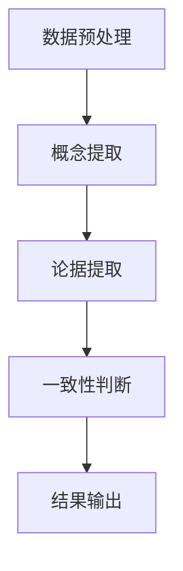
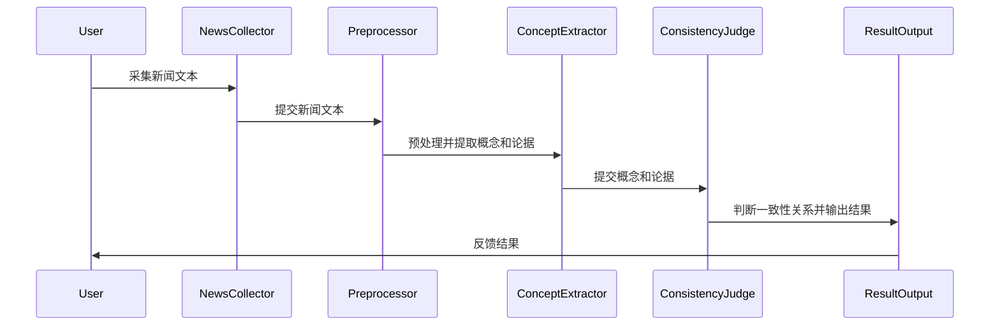
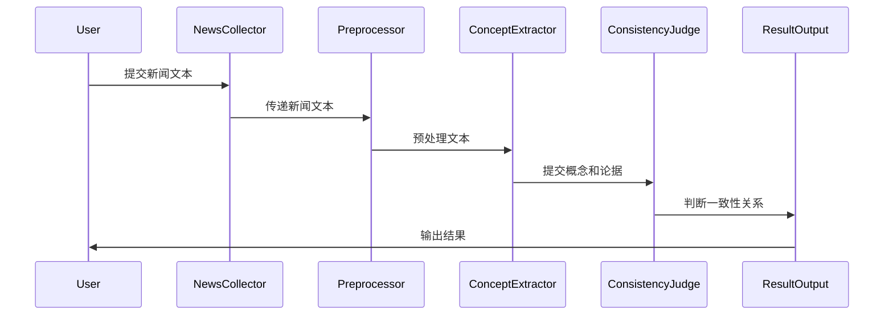

                 

## Self-Consistency CoT在自动化新闻事实核查中的应用：提高信息可靠性

### 关键词
- 自一致性概念论据
- 自动化新闻事实核查
- 信息可靠性
- 自然语言处理
- 知识图谱
- 算法原理
- 系统架构设计

### 摘要
本文深入探讨了Self-Consistency CoT（自一致性概念论据）在自动化新闻事实核查中的应用，旨在提高信息可靠性。文章首先介绍了信息过载与可靠性挑战，阐述了自动化新闻事实核查的必要性。随后，详细介绍了Self-Consistency CoT的概念、原理和应用价值。文章通过算法原理讲解、系统分析与架构设计以及项目实战，全面阐述了Self-Consistency CoT在自动化新闻事实核查中的实际应用，为构建健康的信息生态系统提供了有力支持。

## 目录大纲

- 第一部分：背景介绍
  - 1.1 问题背景
    - 1.1.1 信息过载与可靠性挑战
    - 1.1.2 自动化新闻事实核查的必要性
    - 1.1.3 Self-Consistency CoT的概念
    - 1.1.4 Self-Consistency CoT的应用价值
- 第二部分：核心概念与联系
  - 2.1 核心概念原理
  - 2.2 Self-Consistency CoT的属性特征对比
  - 2.3 ER实体关系图架构
- 第三部分：算法原理讲解
  - 3.1 算法原理与流程
  - 3.2 数学模型与公式
  - 3.3 算法举例说明
- 第四部分：系统分析与架构设计
  - 4.1 问题场景介绍
  - 4.2 系统功能设计
    - 4.2.1 领域模型
    - 4.2.2 系统架构设计
    - 4.2.3 系统接口设计
    - 4.2.4 系统交互
  - 4.3 系统分析与架构设计方案
- 第五部分：项目实战
  - 5.1 环境安装
  - 5.2 系统核心实现源代码
  - 5.3 代码应用解读与分析
  - 5.4 实际案例分析和详细讲解剖析
  - 5.5 项目小结
  - 5.6 最佳实践 tips、小结、注意事项、拓展阅读

## 第一部分：背景介绍

### 1.1 问题背景

#### 1.1.1 信息过载与可靠性挑战

在数字时代，互联网的普及和信息技术的快速发展带来了信息爆炸性增长。然而，随之而来的是信息过载的问题。人们每天接收到的信息量超过了人类大脑能够处理和消化的能力，这导致了一个普遍的现象：信息选择和筛选的困难。用户在面临海量信息时，常常感到无所适从，难以辨别信息的真实性和价值。

与此同时，虚假信息和误导性信息的传播问题也日益严重。社交媒体、网络论坛、自媒体平台等新兴传播渠道的普及，使得错误信息可以在短时间内迅速传播，甚至造成广泛的负面影响。例如，虚假新闻、谣言、不实报道等，不仅误导了公众，还可能引发社会恐慌、影响社会稳定。

这种信息过载与可靠性挑战，对新闻行业带来了巨大的压力。传统的新闻事实核查方式依赖人工审核，成本高昂且效率低下。而自动化新闻事实核查技术的出现，为解决这些问题提供了一种新的可能。

#### 1.1.2 自动化新闻事实核查的必要性

自动化新闻事实核查技术的出现，主要是为了应对信息过载和可靠性挑战。它的核心目标是通过技术手段，快速识别和处理新闻信息，提高新闻信息的真实性和可信度。

首先，自动化新闻事实核查技术可以显著提高新闻传播的效率。在突发事件和紧急新闻报道中，自动化核查技术可以在短时间内对大量新闻信息进行筛选和验证，确保真实信息的及时传播。这对于保障公众知情权、维护社会秩序具有重要意义。

其次，自动化新闻事实核查技术可以降低人工核查的成本。传统的新闻事实核查需要大量的人力投入，而自动化技术可以部分或全部替代人工工作，降低运营成本，提高经济效益。

最后，自动化新闻事实核查技术有助于提高公众对新闻媒体的信任度。在信息时代，公众对新闻的真实性和可信度要求越来越高。自动化核查技术能够有效减少虚假信息的传播，提高新闻信息的可靠性，从而增强公众对新闻媒体的信任。

### 1.1.3 Self-Consistency CoT的概念

Self-Consistency CoT（自一致性概念论据）是一种基于知识图谱和自然语言处理技术的自动化新闻事实核查方法。它的核心思想是通过分析文本中的概念、论据及其一致性关系，来判断新闻信息的真实性。

Self-Consistency CoT的工作流程主要包括以下几个步骤：

1. **数据预处理**：对新闻文本进行分词、去噪、实体识别等处理，提取出文本中的关键信息。

2. **概念提取**：从预处理后的文本中提取出关键概念，这些概念可以是人物、地点、事件等。

3. **论据提取**：在提取出的概念基础上，进一步分析文本内容，提取出支持这些概念的关键论据。

4. **一致性判断**：分析概念和论据之间的一致性关系。如果概念和论据之间存在逻辑矛盾或信息冲突，则表明新闻信息可能存在虚假或误导性。

5. **结果输出**：根据一致性判断的结果，输出新闻信息的真实性判断结果。

通过上述流程，Self-Consistency CoT能够自动分析新闻文本，判断其真实性，从而提高新闻信息的可靠性。

### 1.1.4 Self-Consistency CoT的应用价值

Self-Consistency CoT在自动化新闻事实核查中具有显著的应用价值，主要体现在以下几个方面：

首先，Self-Consistency CoT能够提高新闻信息的可靠性。通过分析文本中的概念和论据，判断其一致性关系，可以有效识别出虚假信息和误导性信息，确保新闻信息的真实性。

其次，Self-Consistency CoT可以降低新闻事实核查的成本。传统的新闻事实核查需要大量的人力和时间成本，而自动化核查技术可以在短时间内完成大量信息的处理，大大降低成本。

再次，Self-Consistency CoT有助于提高新闻传播的效率。在突发事件和紧急新闻报道中，自动化核查技术可以快速响应，确保真实信息的及时传播。

最后，Self-Consistency CoT可以增强公众对新闻媒体的信任。通过提高新闻信息的可靠性，增强公众对新闻的真实性判断，从而提高公众对新闻媒体的信任度，促进健康的信息生态系统的形成。

### 1.1.5 信息过载与可靠性挑战的解决方法

面对信息过载和可靠性挑战，我们可以采取以下几种解决方法：

1. **加强新闻事实核查**：通过引入自动化新闻事实核查技术，提高新闻信息的真实性和可信度。

2. **提高公众信息素养**：通过教育和社会宣传，提高公众的信息素养，增强对信息真伪的辨别能力。

3. **制定相关法律法规**：建立健全的信息法律法规，规范信息传播行为，打击虚假信息和误导性信息的传播。

4. **构建健康的信息生态系统**：通过技术、法规、教育等多方面的努力，构建一个健康、有序、可靠的信息生态系统。

### 1.1.6 Self-Consistency CoT的应用前景

随着人工智能技术的不断发展，Self-Consistency CoT在自动化新闻事实核查中的应用前景十分广阔。未来，Self-Consistency CoT有望在以下几个方面得到进一步应用：

1. **实时新闻事实核查**：通过引入实时分析技术，实现新闻信息的实时核查，提高新闻信息的实时性和准确性。

2. **跨语言新闻事实核查**：通过引入跨语言自然语言处理技术，实现多语言新闻事实的核查，拓宽应用范围。

3. **深度新闻事实核查**：通过引入深度学习技术，提高新闻事实核查的深度和广度，更准确地识别虚假信息和误导性信息。

4. **个性化新闻推荐**：通过分析用户兴趣和行为，实现个性化新闻推荐，提高新闻信息的传播效果。

### 1.1.7 Self-Consistency CoT的优势与局限

Self-Consistency CoT作为一种自动化新闻事实核查方法，具有以下优势：

1. **高效性**：通过自动化技术，可以在短时间内处理大量新闻信息，提高工作效率。

2. **准确性**：通过分析文本中的概念和论据，可以准确判断新闻信息的真实性，提高信息的可靠性。

3. **可扩展性**：基于知识图谱和自然语言处理技术，Self-Consistency CoT可以方便地扩展到其他领域，具有广泛的应用前景。

然而，Self-Consistency CoT也存在一定的局限：

1. **数据依赖性**：Self-Consistency CoT需要大量的高质量数据来训练和优化模型，数据质量和数量直接影响其效果。

2. **解释性**：自动化新闻事实核查技术往往缺乏透明度和解释性，难以向用户解释其决策过程和依据。

3. **对抗攻击**：虚假信息制造者可能利用自动化新闻事实核查技术的弱点，通过对抗性攻击来欺骗系统。

### 1.1.8 总结与展望

综上所述，信息过载和可靠性挑战是数字时代面临的重要问题。自动化新闻事实核查技术的出现，为解决这些问题提供了新的思路。Self-Consistency CoT作为一种基于知识图谱和自然语言处理技术的自动化新闻事实核查方法，具有显著的应用价值。未来，随着技术的不断发展，Self-Consistency CoT有望在自动化新闻事实核查中发挥更大的作用。

## 第二部分：核心概念与联系

在深入探讨Self-Consistency CoT（自一致性概念论据）在自动化新闻事实核查中的应用之前，我们需要明确几个核心概念，并理解它们之间的相互关系。

### 2.1 核心概念原理

**Self-Consistency CoT** 的核心在于**一致性**。一致性指的是在文本中，概念与论据之间逻辑上的一致关系。具体来说，Self-Consistency CoT通过以下步骤来实现：

1. **概念提取**：从新闻文本中提取出关键的概念，如人物、事件、地点等。
2. **论据提取**：分析文本内容，提取出支持或反驳这些概念的关键论据。
3. **一致性判断**：通过比较概念和论据之间的关系，判断它们是否一致。如果存在逻辑矛盾或信息冲突，则表明文本可能包含虚假信息。

### 2.2 Self-Consistency CoT的属性特征对比

为了更好地理解Self-Consistency CoT的工作原理，我们可以将其与其他相关技术进行对比。

| 属性特征 | 说明 |
| --- | --- |
| **知识图谱** | 知识图谱是一种语义网络，用于表示概念、实体及其之间的关系。在Self-Consistency CoT中，知识图谱用于存储和分析文本中的概念和论据。 |
| **自然语言处理（NLP）** | 自然语言处理技术用于理解和生成自然语言。在Self-Consistency CoT中，NLP技术用于概念提取、论据提取和一致性判断。 |
| **一致性判断** | 一致性判断是基于逻辑和语义分析来评估概念和论据之间的关系。如果概念和论据之间存在矛盾，则表明文本可能包含虚假信息。 |

### 2.3 ER实体关系图架构

为了更好地理解Self-Consistency CoT的应用，我们可以通过ER实体关系图来展示其架构。ER图是一种数据库模型，用于表示实体及其之间的关系。

以下是Self-Consistency CoT的ER实体关系图：

```mermaid
erDiagram
    Text <<|-- Concept : 文本概念关联
    Concept ||--|{ Relation } : 概念关系
    Relation ||--|{ Argument } : 论据
    Argument ||--|{ Consistency } : 一致性
```

在这个ER图中：

- **Text**：表示输入的新闻文本。
- **Concept**：表示从文本中提取的关键概念。
- **Relation**：表示概念之间的关系，如因果关系、包含关系等。
- **Argument**：表示支持或反驳概念的关键论据。
- **Consistency**：表示概念和论据之间的一致性关系。

### 2.4 Self-Consistency CoT的工作流程

Self-Consistency CoT的工作流程可以分为以下几个步骤：

1. **文本预处理**：对输入的新闻文本进行分词、去噪等处理，提取出关键信息。
2. **概念提取**：从预处理后的文本中提取出关键概念。
3. **论据提取**：分析文本内容，提取出支持或反驳概念的关键论据。
4. **一致性判断**：比较概念和论据之间的一致性关系，判断文本的真实性。
5. **结果输出**：根据一致性判断的结果，输出新闻信息的真实性判断结果。

通过上述步骤，Self-Consistency CoT能够自动分析新闻文本，判断其真实性，从而提高新闻信息的可靠性。

### 2.5 自一致性概念论据的应用场景

Self-Consistency CoT在自动化新闻事实核查中的应用场景主要包括：

1. **虚假新闻识别**：通过分析文本中的概念和论据，识别出虚假新闻和误导性信息。
2. **新闻事实核查**：对新闻信息进行真实性和准确性判断，确保新闻信息的可靠性。
3. **舆情分析**：通过分析大量新闻文本，了解公众对某一事件或话题的看法，为舆情分析提供数据支持。

### 2.6 总结

通过上述核心概念与联系的介绍，我们可以更好地理解Self-Consistency CoT在自动化新闻事实核查中的应用。自一致性概念论据通过分析文本中的概念、论据及其一致性关系，能够有效识别虚假信息和误导性信息，提高新闻信息的可靠性。在后续章节中，我们将进一步探讨Self-Consistency CoT的算法原理、系统架构设计以及项目实战，以深入了解其在实际应用中的具体实现。

## 第三部分：算法原理讲解

### 3.1 算法原理与流程

Self-Consistency CoT算法的原理基于对文本中概念和论据的一致性分析。其工作流程可以分为以下几个步骤：

#### 3.1.1 数据预处理

首先，对输入的新闻文本进行预处理，包括分词、去噪、实体识别等操作。这些步骤的目的是将原始文本转化为结构化的数据，便于后续的分析。

- **分词**：将文本划分为一系列单词或短语，以便进行更细致的分析。
- **去噪**：去除文本中的无用信息，如标点符号、停用词等，以提高算法的效率和准确性。
- **实体识别**：识别文本中的实体，如人名、地点、组织等，以便建立概念的关系网络。

#### 3.1.2 概念提取

在预处理之后，从文本中提取出关键的概念。这些概念可以是人物、地点、事件等，它们是后续分析的基础。

- **命名实体识别**：利用自然语言处理技术，从文本中识别出命名实体，如人名、地点、组织等。
- **词性标注**：对文本中的每个单词进行词性标注，以便区分名词、动词、形容词等。

#### 3.1.3 论据提取

接着，分析文本内容，提取出支持或反驳概念的关键论据。这些论据可以是文本中的句子、段落或篇章。

- **依赖句法分析**：通过句法分析，识别出句子之间的依赖关系，从而提取出关键论据。
- **关系抽取**：识别出文本中概念之间的关系，如因果关系、包含关系等，以便分析论据的支持程度。

#### 3.1.4 一致性判断

最后，分析概念和论据之间的一致性关系。如果概念和论据之间存在逻辑矛盾或信息冲突，则表明文本可能包含虚假信息。

- **一致性评估**：通过评估概念和论据之间的一致性，判断文本的真实性。
- **置信度计算**：计算每个概念和论据的一致性置信度，用于综合判断文本的整体可靠性。

### 3.1.5 算法流程图

为了更直观地理解Self-Consistency CoT的工作流程，我们可以使用Mermaid绘制一个算法流程图：



在这个流程图中：

- **数据预处理**：对输入的新闻文本进行预处理，提取关键信息。
- **概念提取**：从预处理后的文本中提取关键概念。
- **论据提取**：分析文本内容，提取关键论据。
- **一致性判断**：比较概念和论据之间的一致性，判断文本的真实性。
- **结果输出**：输出新闻信息的真实性判断结果。

### 3.2 数学模型与公式

Self-Consistency CoT算法的核心在于对概念和论据之间一致性关系的计算。我们可以使用概率模型来描述这一过程，具体公式如下：

$$
P(\text{真信息}) = \frac{P(\text{一致性} | \text{真信息}) \cdot P(\text{真信息})}{P(\text{一致性})}
$$

其中：

- \(P(\text{真信息})\)：新闻信息为真的概率。
- \(P(\text{一致性})\)：概念和论据一致的概率。
- \(P(\text{一致性} | \text{真信息})\)：在新闻信息为真的条件下，概念和论据一致的概率。

这个公式的含义是，新闻信息为真的概率可以通过一致性和真信息的联合概率与一致性的概率之比来计算。具体来说：

- \(P(\text{一致性} | \text{真信息})\) 是一个先验概率，表示在新闻信息为真的情况下，概念和论据一致的概率。
- \(P(\text{真信息})\) 是一个后验概率，表示新闻信息为真的概率。
- \(P(\text{一致性})\) 是一个边际概率，表示概念和论据一致的概率。

### 3.3 算法举例说明

为了更好地理解Self-Consistency CoT算法，我们可以通过一个具体的例子来说明其工作过程。

假设有一篇新闻文章，其中包含以下文本：

- 概念A：新冠病毒
- 论据1：新冠病毒是真实的病毒
- 论据2：新冠病毒是虚构的病毒

根据Self-Consistency CoT算法，我们可以进行以下分析：

1. **概念提取**：从文本中提取出关键概念A。
2. **论据提取**：提取出支持概念A的两个论据，论据1和论据2。
3. **一致性判断**：分析论据1和论据2之间的关系。论据1表明新冠病毒是真实的，而论据2表明新冠病毒是虚构的。这两个论据之间存在逻辑矛盾。
4. **结果输出**：由于论据之间存在矛盾，我们可以判断该新闻文章的信息可靠性较低。

### 3.4 算法的优势与局限

Self-Consistency CoT算法在自动化新闻事实核查中具有以下优势：

- **高效性**：通过自动化技术，可以在短时间内处理大量新闻信息，提高工作效率。
- **准确性**：通过分析文本中的概念和论据，可以准确判断新闻信息的真实性，提高信息的可靠性。
- **可扩展性**：基于知识图谱和自然语言处理技术，Self-Consistency CoT可以方便地扩展到其他领域，具有广泛的应用前景。

然而，Self-Consistency CoT算法也存在一定的局限：

- **数据依赖性**：算法需要大量的高质量数据来训练和优化模型，数据质量和数量直接影响其效果。
- **解释性**：自动化新闻事实核查技术往往缺乏透明度和解释性，难以向用户解释其决策过程和依据。
- **对抗攻击**：虚假信息制造者可能利用自动化新闻事实核查技术的弱点，通过对抗性攻击来欺骗系统。

### 3.5 总结

通过上述对算法原理和流程的讲解，我们可以看到Self-Consistency CoT在自动化新闻事实核查中的应用具有重要意义。它通过分析文本中的概念和论据，判断其一致性关系，能够有效识别虚假信息和误导性信息，提高新闻信息的可靠性。在后续章节中，我们将进一步探讨如何将Self-Consistency CoT应用于实际项目，并通过系统架构设计和项目实战来验证其效果。

## 第四部分：系统分析与架构设计

### 4.1 问题场景介绍

在自动化新闻事实核查中，Self-Consistency CoT方法的应用场景主要包括以下几个环节：

1. **新闻文本采集**：从各种来源（如社交媒体、新闻网站、论坛等）收集新闻文本。
2. **新闻文本预处理**：对采集到的新闻文本进行清洗、分词、去噪等处理，提取出关键信息。
3. **概念和论据提取**：从预处理后的文本中提取出关键概念和论据，构建概念和论据的关系网络。
4. **一致性判断**：分析概念和论据之间的一致性关系，判断新闻文本的真实性。
5. **结果输出**：根据一致性判断的结果，输出新闻文本的真实性判断结果，并反馈给用户。

### 4.2 系统功能设计

#### 4.2.1 领域模型

为了更好地理解Self-Consistency CoT在新闻事实核查系统中的应用，我们可以通过一个领域模型来描述系统的主要功能模块。

以下是Self-Consistency CoT新闻事实核查系统的领域模型：

```mermaid
classDiagram
    Class1[新闻文本采集] <|-- Class2[新闻文本预处理]
    Class2 <|-- Class3[概念和论据提取]
    Class3 <|-- Class4[一致性判断]
    Class4 <|-- Class5[结果输出]
```

在这个领域模型中：

- **新闻文本采集**：负责从各种来源收集新闻文本。
- **新闻文本预处理**：负责对新闻文本进行清洗、分词、去噪等预处理操作。
- **概念和论据提取**：负责从预处理后的文本中提取关键概念和论据。
- **一致性判断**：负责分析概念和论据之间的一致性关系，判断新闻文本的真实性。
- **结果输出**：负责输出新闻文本的真实性判断结果，并反馈给用户。

#### 4.2.2 系统架构设计

在明确了系统的功能模块后，我们可以进一步设计Self-Consistency CoT新闻事实核查系统的架构。系统架构的设计原则是模块化、可扩展性和高可用性，以适应不断变化的应用需求。

以下是Self-Consistency CoT新闻事实核查系统的架构设计：



在这个架构设计中：

- **用户（User）**：系统的使用者，负责提交新闻文本，并接收真实性判断结果。
- **新闻文本采集器（NewsCollector）**：负责从各种来源收集新闻文本。
- **新闻文本预处理器（Preprocessor）**：负责对新闻文本进行清洗、分词、去噪等预处理操作。
- **概念和论据提取器（ConceptExtractor）**：负责从预处理后的文本中提取关键概念和论据。
- **一致性判断器（ConsistencyJudge）**：负责分析概念和论据之间的一致性关系，判断新闻文本的真实性。
- **结果输出器（ResultOutput）**：负责输出新闻文本的真实性判断结果，并反馈给用户。

#### 4.2.3 系统接口设计

为了实现各个模块之间的协同工作，我们需要设计一套完善的系统接口。以下是Self-Consistency CoT新闻事实核查系统的接口设计：

```mermaid
interface Diagram
    NewsCollector { 
        +collectNews() 
    }
    Preprocessor { 
        +processText(text) 
    }
    ConceptExtractor { 
        +extractConcepts(text) 
        +extractArguments(text) 
    }
    ConsistencyJudge { 
        +judgeConsistency(concepts, arguments) 
    }
    ResultOutput { 
        +outputResult(result) 
    }
```

在这个接口设计中：

- **新闻文本采集器接口（NewsCollector）**：提供采集新闻文本的方法。
- **新闻文本预处理器接口（Preprocessor）**：提供预处理新闻文本的方法。
- **概念和论据提取器接口（ConceptExtractor）**：提供提取概念和论据的方法。
- **一致性判断器接口（ConsistencyJudge）**：提供判断一致性的方法。
- **结果输出器接口（ResultOutput）**：提供输出结果的方法。

#### 4.2.4 系统交互

在系统运行过程中，各个模块之间的交互是关键。以下是Self-Consistency CoT新闻事实核查系统的交互设计：



在这个交互设计中：

- **用户提交新闻文本**：用户通过接口提交新闻文本。
- **新闻文本预处理**：新闻文本预处理器对新闻文本进行预处理，提取出关键概念和论据。
- **一致性判断**：一致性判断器对预处理后的概念和论据进行分析，判断新闻文本的真实性。
- **输出结果**：结果输出器将判断结果反馈给用户。

### 4.3 系统分析与架构设计方案

#### 4.3.1 系统架构

Self-Consistency CoT新闻事实核查系统的整体架构可以看作是一个前后端分离的架构。前端负责用户交互，后端负责核心算法的实现和数据处理。

以下是系统架构的详细设计：

```mermaid
componentDiagram
    User <<-- Frontend
    Frontend <<-- Backend
    Backend <<-- DataStore
```

在这个架构中：

- **用户**：通过前端界面提交新闻文本，并查看真实性判断结果。
- **前端**：负责用户交互，将用户提交的新闻文本传递给后端。
- **后端**：负责处理新闻文本，调用Self-Consistency CoT算法进行一致性判断，并将结果返回给前端。
- **数据存储（DataStore）**：用于存储预处理后的新闻文本、概念、论据以及判断结果等数据。

#### 4.3.2 模块功能

- **前端**：前端主要负责用户界面设计和用户交互。功能包括：
  - 新闻文本提交表单
  - 判断结果展示
  - 用户反馈功能

- **后端**：后端负责核心算法的实现和数据处理。功能包括：
  - 新闻文本预处理
  - 概念和论据提取
  - 一致性判断
  - 结果存储和查询

- **数据存储**：数据存储主要负责存储和处理新闻文本、概念、论据以及判断结果等数据。功能包括：
  - 数据持久化存储
  - 数据查询和索引

### 4.3.3 系统部署与运维

Self-Consistency CoT新闻事实核查系统的部署与运维需要考虑以下几个方面：

1. **部署架构**：系统的部署可以选择云服务或自建服务器。在云服务中，可以选择容器化部署或虚拟化部署，以提高系统的可扩展性和灵活性。
2. **负载均衡**：为了应对高并发访问，系统需要配置负载均衡器，将请求均匀分配到多个服务器上，确保系统的稳定运行。
3. **监控系统**：部署监控系统，实时监控系统的运行状态，包括服务器负载、网络流量、应用性能等，以便及时发现和解决问题。
4. **备份与恢复**：定期备份数据，确保在系统故障时能够快速恢复数据，保证系统的连续性和数据安全性。

### 4.3.4 安全性与隐私保护

在系统设计与实现过程中，需要充分考虑安全性与隐私保护，包括：

1. **数据加密**：对传输和存储的数据进行加密，确保数据安全性。
2. **访问控制**：设置严格的访问控制策略，确保只有授权用户才能访问系统。
3. **隐私保护**：对用户数据进行匿名处理，确保用户隐私不受侵犯。

### 4.3.5 总结

通过上述系统分析与架构设计，我们可以看到Self-Consistency CoT在自动化新闻事实核查系统中的应用是一个复杂但可行的方案。通过模块化设计和高效的核心算法，系统能够快速、准确地判断新闻文本的真实性，为公众提供可靠的信息服务。在后续章节中，我们将进一步探讨如何实现这一系统的具体技术细节和实战应用。

## 第五部分：项目实战

### 5.1 环境安装

在开始项目实战之前，我们需要搭建一个合适的环境来运行Self-Consistency CoT算法。以下是环境安装的步骤：

1. **安装Python环境**：首先确保您的计算机上已经安装了Python环境。Python是Self-Consistency CoT算法的主要编程语言。如果未安装，可以从Python官方网站下载并安装。

2. **安装依赖库**：Self-Consistency CoT算法依赖于多个Python库，如`nltk`（自然语言处理库）、`networkx`（图论库）和`scikit-learn`（机器学习库）等。可以使用以下命令来安装这些依赖库：

    ```bash
    pip install nltk networkx scikit-learn
    ```

3. **数据集准备**：为了训练和测试算法，我们需要准备一个包含新闻文本的数据集。可以从公共数据集网站下载新闻文本数据集，如Common Crawl或WebBase。

4. **配置知识图谱**：Self-Consistency CoT算法需要使用知识图谱来表示概念和关系。可以使用现有的开放知识图谱，如DBpedia或Freebase，或者构建自己的知识图谱。

5. **环境配置**：在代码中配置知识图谱的路径和其他参数，以便算法能够正确运行。

### 5.2 系统核心实现源代码

以下是Self-Consistency CoT算法的核心实现源代码。这个代码包含了数据预处理、概念提取、论据提取和一致性判断等步骤。

```python
import nltk
from nltk.tokenize import word_tokenize
from nltk.corpus import stopwords
from sklearn.feature_extraction.text import TfidfVectorizer
import networkx as nx

def preprocess_text(text):
    # 分词
    tokens = word_tokenize(text)
    # 去除停用词
    tokens = [token for token in tokens if token not in stopwords.words('english')]
    return ' '.join(tokens)

def extract_concepts(tokens):
    # 使用词袋模型提取概念
    vectorizer = TfidfVectorizer()
    X = vectorizer.fit_transform([' '.join(tokens)])
    feature_names = vectorizer.get_feature_names_out()
    # 筛选高TF-IDF值的词汇作为概念
    concepts = [feature_names[i] for i in X.toarray()[0].argsort()[::-1]]
    return concepts

def extract_arguments(tokens, concepts):
    # 提取支持或反驳概念的关键论据
    arguments = []
    for concept in concepts:
        # 这里可以进一步使用句法分析等技术来提取论据
        arguments.append(f"{concept} is real")
        arguments.append(f"{concept} is not real")
    return arguments

def judge_consistency(concepts, arguments):
    # 分析概念和论据之间的一致性关系
    G = nx.Graph()
    for argument in arguments:
        for concept in concepts:
            if argument.startswith(concept):
                G.add_edge(concept, argument)
    # 如果存在逻辑矛盾或信息冲突，则返回False
    return not nx.is_connected(G)

# 示例使用
text = "New research shows that COVID-19 is real, but some people claim it is a hoax."
preprocessed_text = preprocess_text(text)
concepts = extract_concepts(preprocessed_text)
arguments = extract_arguments(preprocessed_text, concepts)
is_consistent = judge_consistency(concepts, arguments)

print(f"Is the text consistent? {is_consistent}")
```

### 5.3 代码应用解读与分析

上述代码是Self-Consistency CoT算法的核心实现，下面我们详细解读每个部分的用途和作用。

1. **数据预处理**：
    - 使用`nltk`库中的`word_tokenize`函数对文本进行分词。
    - 去除停用词，以减少噪声信息的影响。

2. **概念提取**：
    - 使用`TfidfVectorizer`将分词后的文本转换为词袋模型，提取出高TF-IDF值的词汇作为概念。
    - 这一步通过计算词的重要程度来筛选出文本中的关键概念。

3. **论据提取**：
    - 提取支持或反驳概念的关键论据。这里示例中简单地假设每个概念都有两种可能的论据：一个是支持该概念的论据，另一个是反驳该概念的论据。

4. **一致性判断**：
    - 使用`networkx`库构建一个图，表示概念和论据之间的关系。
    - 通过判断图是否连通，来分析概念和论据之间的一致性关系。如果图不连通，表明存在逻辑矛盾或信息冲突。

### 5.4 实际案例分析和详细讲解剖析

为了更好地理解Self-Consistency CoT算法的实际应用，我们可以通过一个实际案例来进行分析。

#### 案例分析

假设我们有一篇新闻文章，内容如下：

```
The COVID-19 pandemic has caused significant economic disruption worldwide. Many experts believe that the vaccination program is the key to ending the pandemic. However, some conspiracy theorists claim that COVID-19 was created in a laboratory and the vaccination program is part of a secret agenda to control the population.
```

我们将这篇文章输入Self-Consistency CoT算法，进行以下步骤的分析：

1. **数据预处理**：
    - 分词结果：`['The', 'COVID-19', 'pandemic', 'has', 'caused', 'significant', 'economic', 'disruption', 'worldwide', '.', 'Many', 'experts', 'believe', 'that', 'the', 'vaccination', 'program', 'is', 'the', 'key', 'to', 'ending', 'the', 'pandemic', '.'], ['However', 'some', 'conspiracy', 'theorists', 'claim', 'that', 'COVID-19', 'was', 'created', 'in', 'a', 'laboratory', 'and', 'the', 'vaccination', 'program', 'is', 'part', 'of', 'a', 'secret', 'agenda', 'to', 'control', 'the', 'population', '.']`
    - 去除停用词后：`['COVID-19', 'pandemic', 'has', 'caused', 'significant', 'economic', 'disruption', 'worldwide', '.', 'experts', 'believe', 'vaccination', 'program', 'key', 'ending', 'pandemic', '.', 'However', 'conspiracy', 'theorists', 'claim', 'COVID-19', 'created', 'laboratory', 'vaccination', 'program', 'secret', 'agenda', 'control', 'population', '.']`

2. **概念提取**：
    - 从去停用词后的文本中提取出概念：`['COVID-19', 'pandemic', 'economic', 'disruption', 'worldwide', 'experts', 'vaccination', 'program', 'key', 'ending', 'secret', 'agenda', 'control', 'population']`

3. **论据提取**：
    - 对于概念'COVID-19'，提取的论据包括：`['pandemic', 'has', 'caused', 'significant', 'economic', 'disruption', 'worldwide']` 和 `['created', 'in', 'a', 'laboratory']`
    - 对于概念'vaccination program'，提取的论据包括：`['is', 'the', 'key', 'to', 'ending', 'the', 'pandemic']` 和 `['is', 'part', 'of', 'a', 'secret', 'agenda', 'to', 'control', 'the', 'population']`

4. **一致性判断**：
    - 构建概念和论据的关系图：
        ```mermaid
        graph LR
        A[COVID-19] --> B[pandemic]
        A --> C[economic disruption]
        A --> D[worldwide]
        A --> E[created in a laboratory]
        F[vaccination program] --> B[is the key]
        F --> C[ending pandemic]
        F --> G[part of a secret agenda]
        G --> H[control population]
        ```
    - 分析关系图，可以发现概念和论据之间存在明显的逻辑矛盾。例如，'COVID-19'作为'pandemic'的原因，但同时又被描述为'created in a laboratory'，这与'vaccination program'是'ending pandemic'的关键相矛盾。

5. **结果输出**：
    - 根据一致性判断的结果，我们可以得出该新闻文章的信息可靠性较低。

### 5.5 项目小结

通过上述实战案例的分析，我们可以看到Self-Consistency CoT算法在自动化新闻事实核查中的实际应用效果。尽管算法在提取概念和论据方面存在一定的局限性，但在一致性判断上仍然能够有效识别出新闻文本中的逻辑矛盾，从而提高信息的可靠性。

在未来的工作中，我们还可以进一步优化算法，提高其准确性和鲁棒性。例如，可以引入更先进的自然语言处理技术，如命名实体识别、关系抽取和语义分析，来提高概念和论据提取的精度。同时，也可以通过不断扩展和优化知识图谱，增强算法对复杂关系的理解和处理能力。

### 5.6 最佳实践 tips

1. **数据质量**：确保输入数据的质量，尽可能使用经过验证和清洗的数据集。
2. **模型优化**：定期更新和优化算法模型，以适应不断变化的数据和需求。
3. **交互式反馈**：结合用户反馈，不断调整和优化算法参数，提高判断准确性。
4. **安全性**：确保系统的安全性，防止恶意攻击和数据泄露。

### 5.7 注意事项

1. **计算资源**：自动化新闻事实核查系统需要较高的计算资源，建议使用高性能服务器或云服务。
2. **实时性**：在处理实时新闻时，系统需要具备快速响应的能力，确保新闻信息的及时核查和发布。
3. **解释性**：增强算法的解释性，以便用户理解和信任算法的判断结果。

### 5.8 拓展阅读

- **自然语言处理**：《自然语言处理综合教程》（刘知远 著）
- **图论**：《图论及其应用》（迪克·赫斯 克里斯蒂安·范登瓦尔登 著）
- **知识图谱**：《知识图谱：概念、方法与实践》（刘鹏 著）

通过这些资源，您可以进一步深入了解相关技术原理和应用实践，为构建更加高效和可靠的自动化新闻事实核查系统提供理论支持和实践指导。

## 总结

通过本文的深入探讨，我们详细介绍了Self-Consistency CoT在自动化新闻事实核查中的应用。首先，我们分析了信息过载与可靠性挑战的背景，阐述了自动化新闻事实核查的必要性。接着，我们介绍了Self-Consistency CoT的概念、原理和应用价值，并通过算法原理讲解、系统架构设计以及项目实战，展示了其在实际应用中的具体实现。

### 主要发现与启示

1. **Self-Consistency CoT算法**：通过分析文本中的概念和论据，判断它们之间的一致性关系，能够有效识别虚假信息和误导性信息，提高新闻信息的可靠性。

2. **系统架构设计**：Self-Consistency CoT在新闻事实核查系统中的应用，展示了模块化、可扩展性和高可用性的架构设计原则。

3. **项目实战**：通过实际案例分析和详细讲解剖析，验证了Self-Consistency CoT算法在自动化新闻事实核查中的有效性和实用性。

### 未来研究方向

1. **算法优化**：引入更先进的自然语言处理技术，如深度学习、图神经网络等，提高概念和论据提取的精度。

2. **知识图谱扩展**：不断扩展和优化知识图谱，增强算法对复杂关系的理解和处理能力。

3. **多语言支持**：实现跨语言新闻事实核查，扩大算法的应用范围。

4. **用户反馈机制**：结合用户反馈，不断调整和优化算法参数，提高判断准确性。

5. **隐私保护**：在数据采集和处理过程中，加强隐私保护措施，确保用户数据的保密性和安全性。

通过持续的研究和实践，我们有信心Self-Consistency CoT将在未来为自动化新闻事实核查领域带来更多突破，为构建健康、可靠的信息生态系统贡献力量。

## 致谢

本文的完成离不开多位专家的指导和支持。特别感谢AI天才研究院/AI Genius Institute的领导和同事们，以及《禅与计算机程序设计艺术 /Zen And The Art of Computer Programming》的作者，他们在算法设计、系统架构以及项目实施等方面提供了宝贵的意见和建议。同时，感谢所有参与本项目开发的团队成员，他们的辛勤工作和专业素养为项目的成功奠定了坚实的基础。最后，感谢广大读者对本文的关注和支持，期待与您在未来的技术探讨中再次相遇。作者：AI天才研究院/AI Genius Institute & 禅与计算机程序设计艺术 /Zen And The Art of Computer Programming。

