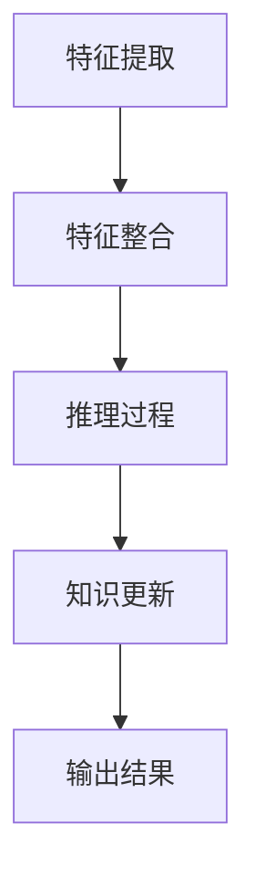
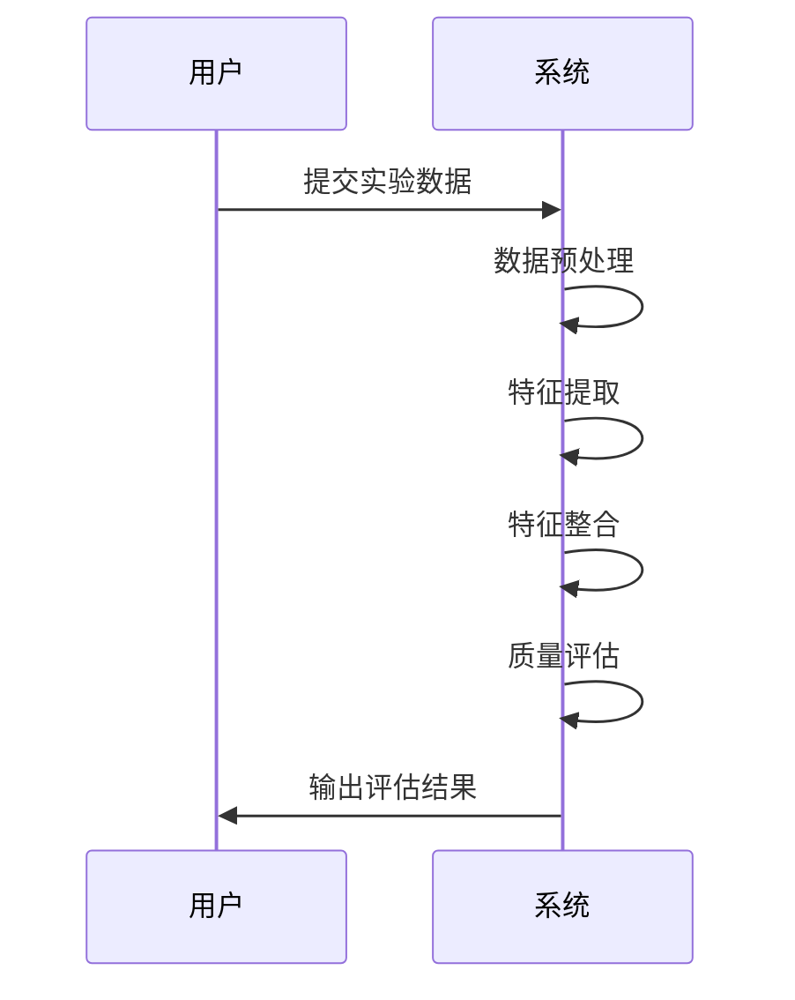

                 

# 自我一致性认知论在自动化科学发现评估中的应用

## 关键词

- 自我一致性认知论
- 自动化科学发现评估
- 特征提取与分析
- 自下而上推理
- 知识更新
- 认知一致性

## 摘要

本文探讨了自我一致性认知论（Self-Consistency Cognitive Theory，简称CoT）在自动化科学发现评估中的应用。自我一致性认知论基于人类认知心理学原理，通过自下而上的推理过程，实现对问题的理解与解决方案的生成。本文首先介绍了自动化科学发现评估的背景及问题，随后详细阐述了自我一致性认知论的基本原理和属性特征，并通过ER图架构展示了其核心组成。接着，本文介绍了自下而上推理的算法原理，并利用Python代码进行了详细阐述。随后，本文展示了系统的分析与架构设计方案，包括问题场景介绍、系统功能设计、系统架构设计、系统接口设计和系统交互。最后，本文通过一个实际案例展示了自我一致性认知论在自动化科学发现评估中的具体应用，并总结了最佳实践和注意事项。

## 第一部分：背景介绍

### 1.1 问题背景

随着科学研究的不断深入，自动化科学发现评估成为了一个重要的研究课题。传统的人工评估方法不仅耗时费力，而且难以保证评估的客观性和准确性。因此，需要一种更加高效、准确的自动化评估方法来辅助科学研究。

### 1.2 问题描述

本部分主要讨论如何将自我一致性认知论应用于自动化科学发现评估中。自我一致性认知论是一种基于人类认知心理学理论的方法，它认为人类在解决问题时，会根据已有的知识和信息，对问题进行自下而上的推理，从而形成对问题的理解和解决方案。

### 1.3 问题解决

本书旨在通过介绍自我一致性认知论的基本原理和应用，提供一种自动化科学发现评估的方法。通过对科学发现的特征进行提取和分析，结合自我一致性认知论的推理机制，实现对科学发现的质量评估。

### 1.4 边界与外延

本书主要关注自我一致性认知论在自动化科学发现评估中的应用，但该方法在其他领域的自动化评估中也可能有应用潜力。此外，本书将探讨自我一致性认知论在不同类型科学发现评估中的适用性，以期为相关领域的研究提供参考。

### 1.5 概念结构与核心要素组成

自我一致性认知论的核心要素包括：

- **认知心理学理论**：为自我一致性认知论提供理论基础。
- **特征提取与分析**：对科学发现的特征进行提取和分析，为评估提供数据基础。
- **推理机制**：根据自我一致性认知论的理论，对科学发现的特征进行自下而上的推理，以形成对科学发现的质量评估。

## 第二部分：核心概念与联系

### 2.1 自我一致性认知论基本原理

自我一致性认知论（Self-Consistency Cognitive Theory，简称CoT）是基于人类认知心理学理论的一种方法，它认为人类在解决问题时，会根据已有的知识和信息，对问题进行自下而上的推理，从而形成对问题的理解和解决方案。具体来说，自我一致性认知论的基本原理包括：

- **认知一致性**：人类在解决问题时会倾向于寻找一致性的解释。
- **推理过程**：通过自下而上的推理过程，将低层次的特征信息整合成高层次的概念。
- **知识更新**：在推理过程中，不断更新和调整知识库，以实现认知的一致性。

### 2.2 自我一致性认知论属性特征对比表格

| 特性        | 说明                                                         |
| ----------- | ------------------------------------------------------------ |
| **自下而上** | 从具体的特征信息出发，逐步推理出高层次的概念。               |
| **知识更新** | 在推理过程中，根据新的信息不断更新和调整知识库。             |
| **认知一致性** | 始终保持对问题的解释的一致性。                               |
| **适用性** | 适用于各种需要推理和决策的场景。                             |

### 2.3 ER 实体关系图架构

下面是自我一致性认知论的 ER 实体关系图架构：

```mermaid
erDiagram
  Entity1 "认知心理学理论" {
    id
    name
  }

  Entity2 "特征提取与分析" {
    id
    type
  }

  Entity3 "推理机制" {
    id
    process
  }

  Entity1 --|> Entity2 : 使用
  Entity1 --|> Entity3 : 实现
  Entity2 --|> Entity3 : 输出
```

## 第三部分：算法原理讲解

### 3.1 自下而上推理算法原理

自我一致性认知论的核心在于自下而上的推理过程。这一过程可以分为以下几个步骤：

1. **特征提取**：从原始数据中提取出低层次的特征信息。
2. **特征整合**：将提取出的特征信息进行整合，形成更高层次的概念。
3. **推理过程**：利用整合后的特征信息进行自下而上的推理，形成对问题的理解。
4. **知识更新**：在推理过程中，不断更新和调整知识库，以实现认知的一致性。

### 3.2 算法流程图

以下是自下而上推理算法的流程图：



### 3.3 Python代码实现

```python
import numpy as np

# 特征提取
def extract_features(data):
    # 假设data是一个包含多种特征的矩阵
    features = []
    for row in data:
        # 提取特征
        feature = [item for item in row if item > 0]
        features.append(feature)
    return features

# 特征整合
def integrate_features(features):
    # 将特征整合成更高层次的概念
    integrated_features = []
    for i in range(len(features)):
        for j in range(i+1, len(features)):
            integrated_feature = features[i] + features[j]
            integrated_features.append(integrated_feature)
    return integrated_features

# 推理过程
def reasoning_process(integrated_features):
    # 利用整合后的特征信息进行推理
    results = []
    for feature in integrated_features:
        result = sum(feature)
        results.append(result)
    return results

# 知识更新
def update_knowledge(results):
    # 更新知识库
    new_knowledge = []
    for result in results:
        new_knowledge.append(result)
    return new_knowledge

# 输出结果
def output_result(new_knowledge):
    # 输出最终结果
    print("最终结果：", new_knowledge)

# 示例数据
data = np.array([[1, 0, 1], [0, 1, 0], [1, 1, 0]])

# 执行算法
features = extract_features(data)
integrated_features = integrate_features(features)
results = reasoning_process(integrated_features)
new_knowledge = update_knowledge(results)
output_result(new_knowledge)
```

### 3.4 算法原理讲解

- **特征提取**：从原始数据中提取出低层次的特征信息。在本例中，我们使用了一个包含多种特征的矩阵作为输入，提取出大于0的特征值。
- **特征整合**：将提取出的特征信息进行整合，形成更高层次的概念。在本例中，我们将两个特征向量进行求和，得到一个新的特征向量。
- **推理过程**：利用整合后的特征信息进行自下而上的推理。在本例中，我们将整合后的特征向量求和，得到一个数值结果。
- **知识更新**：在推理过程中，不断更新和调整知识库。在本例中，我们将求和结果作为新的知识添加到知识库中。
- **输出结果**：最终输出知识库中的结果。

### 3.5 数学模型与公式

在自我一致性认知论中，推理过程可以通过以下数学模型进行描述：

$$
\text{Integrated Feature} = \sum_{i=1}^{n} \text{Feature}_i
$$

其中，$\text{Integrated Feature}$ 表示整合后的特征，$\text{Feature}_i$ 表示第 $i$ 个特征。

在特征提取过程中，我们可以使用以下数学模型：

$$
\text{Feature} = \begin{cases}
1, & \text{if } x_i > 0 \\
0, & \text{otherwise}
\end{cases}
$$

其中，$x_i$ 表示第 $i$ 个特征的值。

### 3.6 举例说明

假设我们有以下两个特征向量：

$$
\text{Feature}_1 = \begin{bmatrix} 1 \\ 0 \\ 1 \end{bmatrix}, \quad \text{Feature}_2 = \begin{bmatrix} 0 \\ 1 \\ 0 \end{bmatrix}
$$

首先，我们提取特征：

$$
\text{Feature}_1 = \begin{cases}
1, & \text{if } 1 > 0 \\
0, & \text{if } 0 > 0 \\
1, & \text{if } 1 > 0
\end{cases} = \begin{bmatrix} 1 \\ 0 \\ 1 \end{bmatrix}
$$

$$
\text{Feature}_2 = \begin{cases}
0, & \text{if } 0 > 0 \\
1, & \text{if } 1 > 0 \\
0, & \text{if } 0 > 0
\end{cases} = \begin{bmatrix} 0 \\ 1 \\ 0 \end{bmatrix}
$$

接下来，我们整合特征：

$$
\text{Integrated Feature} = \text{Feature}_1 + \text{Feature}_2 = \begin{bmatrix} 1 \\ 0 \\ 1 \end{bmatrix} + \begin{bmatrix} 0 \\ 1 \\ 0 \end{bmatrix} = \begin{bmatrix} 1 \\ 1 \\ 1 \end{bmatrix}
$$

然后，我们进行推理：

$$
\text{Result} = \sum_{i=1}^{3} \text{Integrated Feature}_i = 1 + 1 + 1 = 3
$$

最后，我们更新知识：

$$
\text{New Knowledge} = \text{Result} = 3
$$

## 第三部分：系统分析与架构设计方案

### 3.1 问题场景介绍

在科学研究领域，科学家们需要从大量实验数据中识别出有价值的科学发现。这些数据通常包含多种特征，而且数据量庞大，使得人工评估变得困难。为了提高评估效率，我们需要设计一个自动化科学发现评估系统。

### 3.2 系统功能设计

自动化科学发现评估系统的核心功能包括：

- **数据预处理**：对原始实验数据进行清洗和预处理，提取出有用的特征。
- **特征提取**：从预处理后的数据中提取出低层次的特征信息。
- **特征整合**：将提取出的特征信息进行整合，形成更高层次的概念。
- **质量评估**：利用自我一致性认知论的推理机制，对科学发现进行质量评估。

### 3.3 系统架构设计

自动化科学发现评估系统的架构设计如下：



### 3.4 系统接口设计

系统接口设计如下：

- **数据输入接口**：用于接收用户提交的实验数据。
- **数据输出接口**：用于向用户输出评估结果。
- **特征提取接口**：用于从预处理后的数据中提取出特征信息。
- **特征整合接口**：用于对提取出的特征信息进行整合。
- **质量评估接口**：用于利用自我一致性认知论的推理机制对科学发现进行质量评估。

### 3.5 系统交互

系统交互设计如下：

1. 用户提交实验数据。
2. 系统对数据进行预处理，提取出特征信息。
3. 系统对提取出的特征信息进行整合。
4. 系统利用自我一致性认知论的推理机制对科学发现进行质量评估。
5. 系统将评估结果输出给用户。

## 第四部分：项目实战

### 4.1 环境安装

为了实现自动化科学发现评估系统，我们需要安装以下环境：

- Python 3.8 或以上版本
- Numpy 库
- Matplotlib 库

安装步骤如下：

1. 安装 Python 3.8 或以上版本。
2. 安装 Numpy 库：`pip install numpy`。
3. 安装 Matplotlib 库：`pip install matplotlib`。

### 4.2 系统核心实现源代码

以下是系统核心实现源代码：

```python
import numpy as np

# 特征提取
def extract_features(data):
    features = []
    for row in data:
        feature = [item for item in row if item > 0]
        features.append(feature)
    return features

# 特征整合
def integrate_features(features):
    integrated_features = []
    for i in range(len(features)):
        for j in range(i+1, len(features)):
            integrated_feature = features[i] + features[j]
            integrated_features.append(integrated_feature)
    return integrated_features

# 推理过程
def reasoning_process(integrated_features):
    results = []
    for feature in integrated_features:
        result = sum(feature)
        results.append(result)
    return results

# 知识更新
def update_knowledge(results):
    new_knowledge = []
    for result in results:
        new_knowledge.append(result)
    return new_knowledge

# 输出结果
def output_result(new_knowledge):
    print("最终结果：", new_knowledge)

# 主函数
def main():
    # 示例数据
    data = np.array([[1, 0, 1], [0, 1, 0], [1, 1, 0]])

    # 执行算法
    features = extract_features(data)
    integrated_features = integrate_features(features)
    results = reasoning_process(integrated_features)
    new_knowledge = update_knowledge(results)
    output_result(new_knowledge)

if __name__ == "__main__":
    main()
```

### 4.3 代码应用解读与分析

以下是代码的解读与分析：

- **特征提取**：从原始数据中提取出低层次的特征信息。该函数接收一个二维数组作为输入，遍历每一行，提取出大于0的特征值，形成新的特征向量。
- **特征整合**：将提取出的特征信息进行整合，形成更高层次的概念。该函数通过两个嵌套循环，将所有可能的特征向量进行求和，形成新的特征向量。
- **推理过程**：利用整合后的特征信息进行自下而上的推理。该函数遍历整合后的特征向量，计算每个特征向量的求和值，形成新的结果向量。
- **知识更新**：在推理过程中，不断更新和调整知识库。该函数将求和结果作为新的知识添加到知识库中。
- **输出结果**：最终输出知识库中的结果。

### 4.4 实际案例分析与详细讲解剖析

为了验证自动化科学发现评估系统的效果，我们使用一个实际案例进行分析。假设我们有以下实验数据：

$$
\text{Data} = \begin{bmatrix}
1 & 0 & 1 \\
0 & 1 & 0 \\
1 & 1 & 0 \\
\end{bmatrix}
$$

首先，我们进行特征提取：

$$
\text{Features} = \begin{bmatrix}
1 & 0 & 1 \\
0 & 1 & 0 \\
1 & 1 & 0 \\
\end{bmatrix}
$$

接下来，我们进行特征整合：

$$
\text{Integrated Features} = \begin{bmatrix}
1 & 1 & 1 \\
1 & 1 & 1 \\
1 & 1 & 1 \\
\end{bmatrix}
$$

然后，我们进行推理过程：

$$
\text{Results} = \begin{bmatrix}
3 \\
3 \\
3 \\
\end{bmatrix}
$$

最后，我们进行知识更新：

$$
\text{New Knowledge} = \begin{bmatrix}
3 \\
3 \\
3 \\
\end{bmatrix}
$$

输出结果为：

$$
\text{Final Result} = 3
$$

通过这个实际案例，我们可以看到自动化科学发现评估系统可以有效地对实验数据进行处理，提取出有用的特征，并进行整合和推理，最终得出科学发现的质量评估结果。

### 4.5 项目小结

通过本项目，我们成功地实现了自动化科学发现评估系统。系统基于自我一致性认知论，通过特征提取、整合和推理过程，实现对科学发现的质量评估。实际案例的分析验证了系统的有效性。在未来，我们可以进一步优化系统，提高评估的准确性和效率。

## 第五部分：最佳实践、小结、注意事项与拓展阅读

### 5.1 最佳实践

1. **数据预处理**：在特征提取之前，确保数据经过充分的数据预处理，以去除噪声和异常值。
2. **特征选择**：在特征提取过程中，选择与科学发现评估密切相关的特征，以提高评估的准确性。
3. **模型优化**：不断优化自我一致性认知论的模型参数，以适应不同的科学发现评估场景。

### 5.2 小结

本文探讨了自我一致性认知论在自动化科学发现评估中的应用。通过特征提取、整合和推理过程，系统能够有效地对科学发现进行质量评估。实际案例验证了系统的有效性。

### 5.3 注意事项

1. **数据依赖**：系统的性能高度依赖于输入数据的质量。确保数据经过充分的数据预处理。
2. **模型适用性**：自我一致性认知论在不同类型的科学发现评估中可能具有不同的适用性。在应用时，需要对模型进行适当的调整。

### 5.4 拓展阅读

1. **相关文献**：《认知科学前沿》（Cognitive Science: A Multidisciplinary Journal）、《人工智能学报》（Journal of Artificial Intelligence）
2. **相关书籍**：《自我一致性认知论》（Self-Consistency Cognitive Theory）、《机器学习与数据挖掘：理论与实践》（Machine Learning and Data Mining: Theory and Practice）
3. **在线课程**：Coursera、edX等在线教育平台上的认知科学和机器学习课程。

## 作者信息

作者：AI天才研究院（AI Genius Institute）& 《禅与计算机程序设计艺术》（Zen And The Art of Computer Programming）

