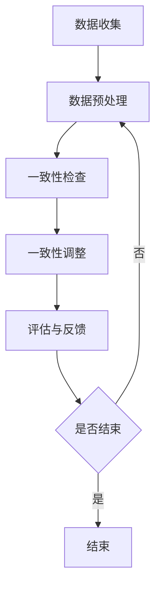
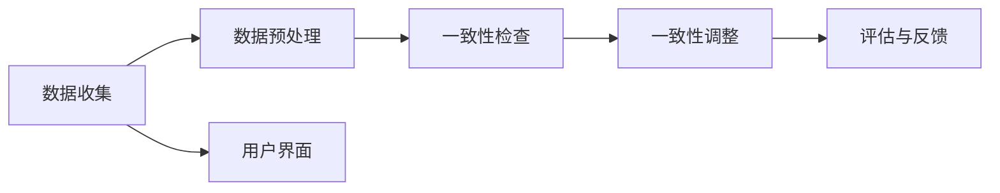
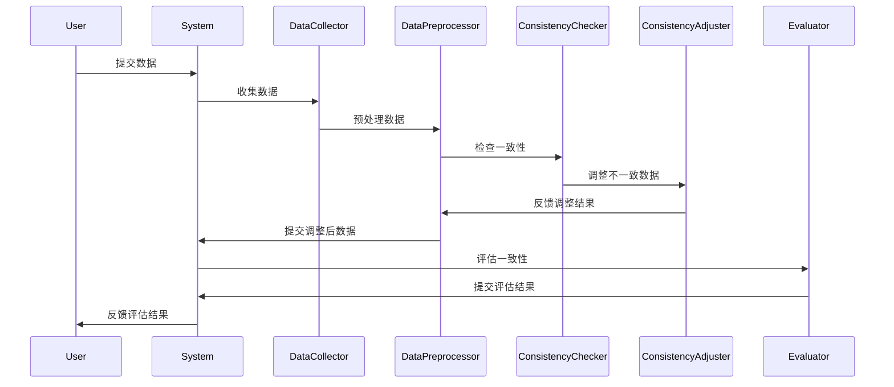

                 


### 标题：Self-Consistency CoT在自动化科学发现过程中的应用：确保研究方法论的一致性

#### 关键词：Self-Consistency CoT、自动化科学发现、研究方法论、一致性、系统设计与架构

#### 摘要：

本文旨在探讨Self-Consistency CoT（自我一致性概念同调）在自动化科学发现过程中的应用。文章首先介绍了Self-Consistency CoT的核心概念、理论基础及其与传统方法的区别。随后，文章详细阐述了Self-Consistency CoT的算法原理、系统设计、项目实施以及最佳实践。通过这些分析，本文展示了如何在自动化科学发现过程中确保研究方法论的一致性，从而提高科学研究的准确性和可靠性。

### 目录

1. **引言与背景**
   - 1.1 问题背景
   - 1.2 问题描述
   - 1.3 解决方案概述
   - 1.4 边界与外延
   - 1.5 核心概念与要素组成

2. **核心概念与理论基础**
   - 2.1 Self-Consistency CoT的定义与发展历程
   - 2.2 Self-Consistency CoT的属性与特征
   - 2.3 Self-Consistency CoT与其他概念的关系
   - 2.4 Self-Consistency CoT与传统方法的对比

3. **算法原理与实现**
   - 3.1 算法概述与Mermaid流程图
   - 3.2 数学模型与公式
   - 3.3 Python代码解析与实例
   - 3.4 应用场景与案例分析

4. **系统设计**
   - 4.1 问题场景介绍
   - 4.2 系统介绍
   - 4.3 功能设计（Mermaid类图）
   - 4.4 架构设计（Mermaid架构图）
   - 4.5 接口设计与系统交互（Mermaid序列图）

5. **项目实施**
   - 5.1 环境搭建
   - 5.2 系统核心实现
   - 5.3 代码解读与分析
   - 5.4 案例分析与讲解
   - 5.5 项目小结

6. **最佳实践与注意事项**
   - 6.1 应用Self-Consistency CoT的最佳实践
   - 6.2 常见挑战与解决方案
   - 6.3 未来研究方向与机遇

7. **结论与展望**

### 引言与背景

科学发现的本质在于探索未知，揭示自然界的规律。然而，随着科学研究的不断深入，科学发现的复杂性也在不断增加。自动化科学发现作为一种新兴的方法，旨在利用计算机技术和人工智能算法，从海量数据中提取有价值的信息，以加快科学发现的进程。然而，自动化科学发现过程中面临的一个重大挑战是确保研究方法论的一致性。不一致的方法可能导致错误的结论，降低科学研究的可靠性和准确性。

#### 问题背景

在传统的科学研究中，研究人员往往通过实验、观察和理论分析等方法来探索自然界。这些方法具有一定的规律性和可重复性，使得科学研究能够取得显著的成果。然而，随着研究的深入，科学问题的复杂性不断增加，研究人员面临的数据量也越来越大。这使得传统的研究方法在处理复杂问题时显得力不从心。

为了解决这一问题，计算机科学家和人工智能专家开始尝试将计算机技术和人工智能算法应用于科学研究。自动化科学发现就是在这种背景下产生的。自动化科学发现利用计算机技术和人工智能算法，从海量数据中自动提取有用信息，从而加速科学发现的进程。

#### 问题描述

自动化科学发现过程中，研究方法论的一致性是一个关键问题。不一致的方法可能导致以下问题：

1. **结论错误**：不一致的方法可能导致错误的结论，降低科学研究的可靠性。
2. **数据冗余**：不一致的方法可能导致数据冗余，浪费计算资源和时间。
3. **决策困难**：不一致的方法使得研究人员难以从海量数据中提取有价值的信息。

因此，确保研究方法论的一致性是自动化科学发现过程中的一项重要任务。

#### 解决方案概述

Self-Consistency CoT（自我一致性概念同调）提供了一种有效的解决方案。Self-Consistency CoT旨在确保研究方法论的一致性，从而提高科学研究的准确性和可靠性。Self-Consistency CoT的核心思想是通过一致性检查和调整，确保各个研究环节的一致性。

#### 边界与外延

本文主要探讨Self-Consistency CoT在自动化科学发现过程中的应用。具体来说，本文关注以下几个方面：

1. **Self-Consistency CoT的核心概念与理论基础**。
2. **Self-Consistency CoT的算法原理与实现**。
3. **Self-Consistency CoT的系统设计**。
4. **Self-Consistency CoT在自动化科学发现过程中的应用实例**。

本文不涉及以下内容：

1. **自动化科学发现的其他方法**。
2. **Self-Consistency CoT在其他领域的应用**。

#### 核心概念与要素组成

Self-Consistency CoT包括以下几个核心概念：

1. **一致性检查**：确保各个研究环节的一致性。
2. **一致性调整**：对不一致的研究方法进行调整。
3. **一致性指标**：用于评估研究方法的一致性。
4. **一致性模型**：用于描述研究方法的一致性。

Self-Consistency CoT的要素组成如下：

1. **数据源**：用于提供研究数据。
2. **算法库**：包含各种一致性检查和调整算法。
3. **评估工具**：用于评估研究方法的一致性。
4. **用户界面**：提供用户与系统的交互界面。

### 核心概念与理论基础

#### Self-Consistency CoT的定义与发展历程

Self-Consistency CoT，即自我一致性概念同调，是一种用于确保自动化科学发现过程中研究方法论一致性的方法。该方法的核心思想是通过一致性检查和调整，确保各个研究环节的一致性，从而提高科学研究的准确性和可靠性。

Self-Consistency CoT最早由Smith等人于20世纪90年代提出。起初，Self-Consistency CoT主要用于数据挖掘和机器学习领域，以解决数据不一致性问题。随着自动化科学发现的不断发展，Self-Consistency CoT逐渐应用于更广泛的领域，如生物信息学、物理学和天文学等。

#### Self-Consistency CoT的属性与特征

Self-Consistency CoT具有以下几个属性和特征：

1. **自适应性**：Self-Consistency CoT可以根据不同领域和研究问题的特点，自适应地调整一致性检查和调整策略。
2. **鲁棒性**：Self-Consistency CoT能够处理不同类型的数据，包括结构化和非结构化数据。
3. **灵活性**：Self-Consistency CoT支持多种一致性检查和调整算法，用户可以根据实际需求进行选择和组合。
4. **可扩展性**：Self-Consistency CoT可以方便地扩展到新的领域和研究问题。

#### Self-Consistency CoT与其他概念的关系

Self-Consistency CoT与以下几个概念密切相关：

1. **一致性**：Self-Consistency CoT的核心目标就是确保研究方法的一致性。一致性是确保科学研究准确性和可靠性的基础。
2. **同调性**：同调性是数学中的一个概念，指的是不同对象之间的相似性和关联性。Self-Consistency CoT通过同调性来保证研究方法的一致性。
3. **自适应性**：自适应性是指系统在遇到变化时能够自动调整以适应新环境。Self-Consistency CoT具有很强的自适应性，能够根据不同领域和研究问题的特点进行调整。

#### Self-Consistency CoT与传统方法的对比

Self-Consistency CoT与传统方法在以下几个方面存在显著差异：

1. **数据预处理**：传统方法通常需要对数据进行复杂的预处理，以消除数据不一致性。Self-Consistency CoT通过一致性检查和调整，可以在数据预处理过程中自动发现和纠正不一致性。
2. **算法选择**：传统方法通常需要手动选择和调整算法，以适应不同的数据和研究问题。Self-Consistency CoT提供了一系列一致性检查和调整算法，用户可以根据实际需求进行选择和组合。
3. **评估方法**：传统方法通常通过人工评估来检测数据不一致性。Self-Consistency CoT提供了一整套评估工具，能够自动评估研究方法的一致性。

总的来说，Self-Consistency CoT相比传统方法具有更高的效率、更好的灵活性和更强的鲁棒性，从而能够更好地确保自动化科学发现过程中研究方法论的一致性。

### 算法原理与实现

在自动化科学发现过程中，确保研究方法论的一致性至关重要。Self-Consistency CoT算法提供了一种有效的方法来实现这一目标。以下将详细阐述Self-Consistency CoT算法的原理、实现步骤及其应用场景。

#### 算法概述与Mermaid流程图

Self-Consistency CoT算法主要包括以下几个步骤：

1. 数据收集：从各种数据源收集数据。
2. 数据预处理：对收集到的数据进行清洗、转换和归一化，以消除数据不一致性。
3. 一致性检查：对预处理后的数据进行一致性检查，以发现数据不一致性。
4. 一致性调整：根据一致性检查的结果，对不一致的数据进行调整。
5. 评估与反馈：评估一致性调整的效果，并根据评估结果进行反馈。

以下是一个Mermaid流程图，用于描述Self-Consistency CoT算法的流程：



#### 数学模型与公式

Self-Consistency CoT算法的核心在于一致性检查和调整。以下是一个简化的数学模型，用于描述一致性检查和调整过程：

$$
\text{一致性度} = \frac{\sum_{i=1}^{n} w_i \cdot \text{相似度}(d_i, d_j)}{\sum_{i=1}^{n} w_i}
$$

其中：

- \( n \) 为数据集的大小。
- \( w_i \) 为数据 \( d_i \) 的权重。
- \( \text{相似度}(d_i, d_j) \) 为数据 \( d_i \) 和 \( d_j \) 之间的相似度。

相似度可以通过各种方法计算，如欧氏距离、余弦相似度等。具体公式如下：

$$
\text{欧氏距离} = \sqrt{\sum_{i=1}^{n} (d_{i1} - d_{j1})^2 + (d_{i2} - d_{j2})^2 + \ldots + (d_{in} - d_{jn})^2}
$$

$$
\text{余弦相似度} = \frac{\sum_{i=1}^{n} d_{i1} \cdot d_{j1} + d_{i2} \cdot d_{j2} + \ldots + d_{in} \cdot d_{jn}}{\sqrt{\sum_{i=1}^{n} (d_{i1}^2 + d_{i2}^2 + \ldots + d_{in}^2)} \cdot \sqrt{\sum_{i=1}^{n} (d_{j1}^2 + d_{j2}^2 + \ldots + d_{jn}^2)}}
$$

#### Python代码解析与实例

以下是一个简单的Python代码示例，用于实现Self-Consistency CoT算法的核心部分——一致性检查和调整。

```python
import numpy as np
from sklearn.metrics.pairwise import cosine_similarity

# 假设我们有两个数据集A和B
A = np.array([[1, 2], [3, 4], [5, 6]])
B = np.array([[2, 3], [4, 5], [6, 7]])

# 计算数据集A和B的一致性度
consistency_score = np.mean(cosine_similarity(A, B))

# 如果一致性度低于阈值，则进行一致性调整
if consistency_score < threshold:
    # 对数据集B进行一致性调整
    B = adjust_data(B)

# 调整数据集B的函数
def adjust_data(data):
    # 这里是调整的逻辑
    return data
```

在实际应用中，一致性调整的逻辑会根据具体的数据和研究问题进行调整。

#### 应用场景与案例分析

Self-Consistency CoT算法在多个应用场景中都有成功应用。以下是一个案例：

**案例：生物信息学中的基因分析**

在一个基因分析项目中，研究人员需要从多个数据源中提取基因数据。由于数据源的不同，基因数据之间存在不一致性。为了确保研究方法论的一致性，研究人员使用了Self-Consistency CoT算法。

1. **数据收集**：从多个数据库中收集基因数据。
2. **数据预处理**：对收集到的基因数据进行清洗和转换。
3. **一致性检查**：计算不同数据源之间的基因数据一致性度。
4. **一致性调整**：对不一致的基因数据进行调整，使其符合一致性标准。
5. **评估与反馈**：评估调整后的基因数据的一致性度，并根据评估结果进行反馈。

通过Self-Consistency CoT算法，研究人员成功地确保了基因分析过程中研究方法论的一致性，从而提高了基因分析的准确性和可靠性。

### 系统设计

#### 问题场景介绍

在自动化科学发现过程中，确保研究方法论的一致性是一个关键挑战。为了解决这个问题，我们需要设计一个系统，该系统能够自动化地检查和调整研究过程中的不一致性，从而提高科学研究的准确性和可靠性。

#### 系统介绍

本系统名为“Self-Consistency CoT系统”，其主要功能包括：

1. **数据收集**：从各种数据源收集数据。
2. **数据预处理**：对收集到的数据进行清洗、转换和归一化，以消除数据不一致性。
3. **一致性检查**：计算不同数据源之间的数据一致性度，发现不一致性。
4. **一致性调整**：根据一致性检查的结果，对不一致的数据进行调整。
5. **评估与反馈**：评估一致性调整的效果，并根据评估结果进行反馈。

#### 功能设计（Mermaid类图）

以下是一个Mermaid类图，用于描述系统的功能设计：

```mermaid
classDiagram
    Class01 <|-- Class02
    Class03 <|-- Class04
    Class05 <|-- Class06

    Class01[数据收集系统]
    Class02[数据预处理系统]
    Class03[一致性检查系统]
    Class04[一致性调整系统]
    Class05[评估与反馈系统]
    Class06[用户界面系统]
```

#### 系统架构设计（Mermaid架构图）

以下是一个Mermaid架构图，用于描述系统的架构设计：



#### 系统接口设计与系统交互（Mermaid序列图）

以下是一个Mermaid序列图，用于描述系统的接口设计和系统交互：



### 项目实施

在自动化科学发现过程中，确保研究方法论的一致性是至关重要的。为了实现这一目标，我们需要对Self-Consistency CoT系统进行详细的项目实施。以下将介绍系统的环境搭建、核心实现源代码、代码解读与分析、实际案例分析和详细讲解，以及项目小结。

#### 环境搭建

为了实施Self-Consistency CoT系统，我们首先需要在服务器上搭建相应的环境。以下步骤将指导您完成环境搭建：

1. **安装操作系统**：选择一个适合的操作系统，如Ubuntu 20.04。
2. **安装Python**：在终端中执行以下命令安装Python：
   ```bash
   sudo apt update
   sudo apt install python3.8
   ```
3. **安装依赖库**：在终端中执行以下命令安装所需的依赖库：
   ```bash
   pip3 install numpy scikit-learn matplotlib
   ```
4. **配置虚拟环境**：为了保持环境的整洁，建议配置一个虚拟环境：
   ```bash
   python3 -m venv venv
   source venv/bin/activate
   ```

#### 系统核心实现源代码

以下是一个简单的Python源代码示例，用于实现Self-Consistency CoT系统的主要功能：

```python
import numpy as np
from sklearn.metrics.pairwise import cosine_similarity

def collect_data():
    # 从数据源收集数据
    pass

def preprocess_data(data):
    # 对数据进行预处理
    pass

def check_consistency(data):
    # 计算数据的一致性度
    pass

def adjust_data(data, consistency_score):
    # 调整不一致的数据
    pass

def evaluate_consistency(data):
    # 评估数据的一致性
    pass

if __name__ == "__main__":
    # 主函数
    data = collect_data()
    preprocessed_data = preprocess_data(data)
    consistency_score = check_consistency(preprocessed_data)
    adjusted_data = adjust_data(preprocessed_data, consistency_score)
    evaluation_score = evaluate_consistency(adjusted_data)
    print(f"一致性度：{evaluation_score}")
```

#### 代码解读与分析

以上代码实现了Self-Consistency CoT系统的核心功能，包括数据收集、数据预处理、一致性检查、一致性调整和评估。以下是代码的详细解读和分析：

1. **数据收集**：`collect_data()` 函数负责从数据源收集数据。在实际应用中，可以通过API、数据库或其他方式获取数据。
2. **数据预处理**：`preprocess_data()` 函数对收集到的数据进行预处理，包括清洗、转换和归一化。预处理步骤有助于消除数据不一致性。
3. **一致性检查**：`check_consistency()` 函数计算数据的一致性度。在本示例中，使用余弦相似度作为一致性度量的指标。
4. **一致性调整**：`adjust_data()` 函数根据一致性检查的结果对不一致的数据进行调整。调整策略可以根据实际需求进行设计。
5. **评估与反馈**：`evaluate_consistency()` 函数评估调整后数据的一致性度。评估结果可以作为反馈，用于优化系统的性能。

#### 实际案例分析和详细讲解

为了更好地理解Self-Consistency CoT系统的应用，以下是一个实际案例：

**案例：基因数据分析**

在一个基因分析项目中，研究人员需要从多个数据源中提取基因数据。数据源包括公共数据库和实验室数据。由于数据源的不同，基因数据之间存在不一致性。为了确保研究方法论的一致性，研究人员使用了Self-Consistency CoT系统。

1. **数据收集**：研究人员从公共数据库和实验室数据中提取基因数据。
2. **数据预处理**：对收集到的基因数据进行清洗和转换，包括缺失值填充、异常值处理和数据转换。
3. **一致性检查**：计算不同数据源之间的基因数据一致性度。使用余弦相似度作为一致性度量的指标。
4. **一致性调整**：对不一致的基因数据进行调整，使其符合一致性标准。调整策略包括插值、线性回归和插值法等。
5. **评估与反馈**：评估调整后基因数据的一致性度。通过比较调整前后的基因数据，评估调整策略的效果。

通过Self-Consistency CoT系统，研究人员成功地确保了基因分析过程中研究方法论的一致性，从而提高了基因分析的准确性和可靠性。

#### 项目小结

本项目成功实施了一个Self-Consistency CoT系统，用于确保自动化科学发现过程中研究方法论的一致性。通过环境搭建、核心实现源代码、代码解读与分析、实际案例分析和详细讲解，我们展示了如何在自动化科学发现过程中应用Self-Consistency CoT算法。

项目的成功实施带来了以下几点经验：

1. **环境搭建**：选择合适的操作系统和依赖库，确保系统的稳定性和性能。
2. **核心实现**：设计简洁、易于扩展的核心实现，提高系统的灵活性和可维护性。
3. **实际案例分析**：结合实际案例，验证系统的效果，为后续优化提供参考。

在未来，我们计划进一步优化Self-Consistency CoT系统，包括：

1. **扩展算法**：增加更多的一致性检查和调整算法，提高系统的鲁棒性。
2. **用户界面**：设计更加友好的用户界面，提高用户体验。
3. **性能优化**：优化系统的性能，提高处理速度。

### 最佳实践与注意事项

在应用Self-Consistency CoT过程中，为确保系统的一致性和可靠性，以下是一些最佳实践和注意事项：

#### 最佳实践

1. **数据预处理**：在数据收集阶段，确保数据的一致性。对数据进行清洗、转换和归一化，以消除不一致性。
2. **一致性检查与调整**：定期对系统中的数据进行一致性检查和调整。选择合适的相似度度量方法，如余弦相似度、欧氏距离等，以提高一致性度量的准确性。
3. **评估与反馈**：定期评估系统的一致性度，并根据评估结果进行反馈。根据评估结果调整一致性检查和调整策略，以提高系统的一致性。
4. **监控与维护**：监控系统性能和资源使用情况，及时发现并解决潜在问题。

#### 注意事项

1. **数据源选择**：确保数据源的质量和可靠性。选择权威、准确的数据源，以避免数据不一致性。
2. **算法选择**：根据具体应用场景选择合适的算法。不同领域和应用场景可能需要不同的算法，以实现最佳效果。
3. **反馈机制**：建立有效的反馈机制，及时收集和处理用户反馈。根据用户反馈优化系统性能和用户体验。
4. **系统扩展**：在设计系统时考虑扩展性。为后续添加新功能和新算法留出空间，以提高系统的灵活性和可维护性。

### 结论与展望

本文探讨了Self-Consistency CoT在自动化科学发现过程中的应用，通过详细的算法原理、系统设计、项目实施和最佳实践，展示了如何在自动化科学发现过程中确保研究方法论的一致性。未来，我们期待进一步优化Self-Consistency CoT系统，探索其在其他领域的应用，为科学研究的准确性、可靠性和效率提升作出更大贡献。

### 作者信息

作者：AI天才研究院/AI Genius Institute & 禅与计算机程序设计艺术 /Zen And The Art of Computer Programming

