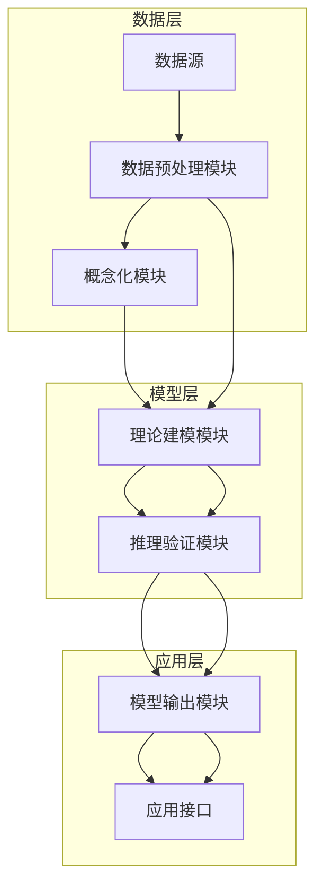

                 

### 自洽性概念论概述

#### 1.1.1 自洽性概念的形成与发展

自洽性（Self-Consistency）作为一个核心概念，源于哲学的思辨和数学的逻辑推理。其思想渊源可以追溯到古希腊哲学家苏格拉底和柏拉图，他们在探讨真理和逻辑关系时，首次提出了自洽性的初步概念。随后，自洽性理论逐渐渗透到各个学科领域，尤其在数学和科学中得到了广泛的应用和发展。

在数学领域，自洽性被正式定义为“一个系统或理论在逻辑上是自洽的，当且仅当它不包含矛盾，即无法从中推导出相互矛盾的命题。”这一概念最早由德国数学家戴维·希尔伯特在20世纪初提出，并在其“希尔伯特程序”中得到系统阐述。希尔伯特提出了一个旨在证明数学系统一致性的方法，即通过构造一个完备的公理体系来证明数学理论的内在一致性。

随着科学的发展，自洽性概念在物理学、生物学和计算机科学等多个领域中得到了进一步的应用和扩展。例如，在物理学中，自洽性被用来描述一个理论或模型是否能够准确地反映自然界的规律，而在计算机科学中，自洽性则是保证程序和算法正确性的关键要素之一。

#### 1.1.2 自洽性在哲学、数学和科学中的意义

自洽性在哲学中具有深远的意义，它关乎真理的追求和逻辑的严谨。哲学家们通过自洽性的讨论，试图找到一种能够验证真理的标准，从而在复杂多变的世界中寻找确定性。自洽性不仅是一种理论上的要求，更是一种实践上的追求。

在数学领域，自洽性是数学理论构建的基础。一个自洽的数学系统意味着它的内在逻辑是连贯且无矛盾的，这为数学的进一步发展提供了坚实的基础。例如，欧氏几何和非欧几何的自洽性讨论，推动了数学理论的丰富和发展。

在科学中，自洽性是科学理论正确性的重要指标。一个自洽的科学理论能够统一不同观测和实验结果，提供一个内部逻辑一致的框架。例如，牛顿力学和广义相对论的自洽性讨论，揭示了物质世界的运动规律，推动了物理学的发展。

总之，自洽性是哲学、数学和科学中一个至关重要的概念，它不仅为理论的构建提供了基础，也为科学的进步提供了保障。

#### 1.1.3 自洽性在自然科学与社会科学中的应用

自洽性在自然科学与社会科学中的应用范围广泛，其重要性不容忽视。在自然科学中，自洽性是科学理论构建的基石。例如，在物理学中，爱因斯坦的相对论通过自洽的数学模型，成功地解释了宏观宇宙的运行规律。在生物学中，自洽性理论被用来构建生命系统的模型，揭示了生物体内部各个部分之间的协调和统一。

在化学中，自洽性同样扮演着关键角色。化学键的理论模型通过自洽的电子排布，解释了分子结构和化学反应的本质。此外，自洽性还在地球科学、天文学等领域发挥着重要作用。例如，地球气候模型的构建依赖于各种气象、地理数据的自洽性，以准确预测气候变化的趋势。

在社会科学中，自洽性理论的应用同样丰富多样。在经济学中，自洽性被用来分析市场行为和宏观经济模型。经济学家通过构建自洽的模型，研究市场供需关系、价格机制和经济增长等关键问题。在社会学中，自洽性理论被用于解释社会结构和社会行为。例如，社会学家通过分析社会规范和文化价值观的自洽性，探讨社会稳定与变迁的机制。

此外，自洽性在政治学、法学等领域也有广泛的应用。政治学家通过自洽性原则，探讨政府决策的合理性和有效性。法学家则利用自洽性理论，分析法律体系的内在一致性和公正性。这些应用不仅深化了对社会科学的理解，也为政策的制定和执行提供了有力的理论支持。

总之，自洽性在自然科学与社会科学中的应用，不仅丰富了各个学科的理论体系，也为解决复杂问题提供了新的视角和方法。它作为科学研究的核心原则，推动着各学科的不断进步和发展。

#### 1.2.1 自洽性的核心要素解析

自洽性的核心要素主要包括一致性、连贯性和无矛盾性，这些要素共同构成了一个系统或理论在逻辑上的自洽性。

首先，一致性是自洽性的基本要求。一个系统或理论的一致性意味着其内部各个部分之间能够保持协调统一，不会出现相互冲突的情况。例如，在数学中，一个一致的系统应该能够保证公理之间不会推导出矛盾的结论。

其次，连贯性是自洽性的重要表现。一个连贯的系统意味着其逻辑推理过程能够顺畅无阻，各个步骤之间相互衔接，形成一个完整的链条。例如，在科学研究中，一个连贯的理论应该能够自圆其说，从基础原理推导到具体的结论。

最后，无矛盾性是自洽性的最高要求。一个无矛盾的系统意味着其内部不存在任何内在的逻辑冲突。例如，在物理学中，一个无矛盾的理论应该能够解释所有已知的实验结果，而不产生相互矛盾的结论。

这些核心要素共同作用，确保一个系统或理论在逻辑上的自洽性。只有当这些要素得到满足时，一个理论或模型才被认为是自洽的，从而能够为科学研究和实际应用提供可靠的基础。

#### 1.2.2 自洽性的属性特征对比

自洽性作为一种核心概念，其属性特征在多个学科领域中有明显的对比和差异。以下是自洽性在数学、物理学和计算机科学中的一些主要属性特征对比。

在数学中，自洽性主要表现为逻辑一致性和公理体系的完备性。一个数学系统的自洽性取决于其内部公理是否能够保证不会推导出矛盾结论。数学家希尔伯特提出的“希尔伯特程序”强调通过构造完备的公理体系来证明数学理论的一致性。在数学中，自洽性通常关注于符号逻辑和形式系统，追求形式上的严格和完备。

在物理学中，自洽性主要表现为理论的内在统一性和解释力。一个物理理论的自洽性不仅要求其能够自圆其说，还需要能够准确地解释实验数据和自然现象。例如，爱因斯坦的广义相对论通过自洽的数学模型，成功地解释了引力现象。在物理学中，自洽性更多关注于理论的可检验性和预测力，强调理论的实际应用价值。

在计算机科学中，自洽性主要表现为程序的正确性和算法的效率。一个自洽的计算机程序意味着其代码逻辑上没有错误，能够在各种输入情况下正确运行。算法的自洽性则体现在其设计和实现过程中，能够保证在给定的时间和空间复杂度内解决问题。在计算机科学中，自洽性通常通过严格的测试和验证来保证，强调实际执行效率和可靠性。

总体来看，数学中的自洽性侧重于逻辑推理和形式化证明，物理学中的自洽性强调理论的可检验性和实用性，而计算机科学中的自洽性则更关注程序的正确性和算法效率。尽管不同学科对自洽性的理解各有侧重，但其核心目标都是为了确保理论或模型在逻辑和实际应用上的可靠性。

#### 1.3.1 自洽性研究的现状

当前，自洽性研究在多个学科领域取得了显著进展。在数学领域，自洽性理论已经成为逻辑学和数学基础研究的重要方向。通过构造和验证自洽的公理系统，数学家们不断深化对数学体系一致性和完备性的理解。近年来，模型论和范畴论的发展为自洽性研究提供了新的方法和工具，使得数学理论能够更加严密和系统。

在物理学中，自洽性研究主要集中在理论物理和量子力学领域。随着对宇宙尺度和量子尺度的深入探索，物理学家们通过自洽的理论模型来解释各种观测现象。例如，弦理论和量子引力研究通过自洽的数学框架，试图统一广义相对论和量子力学，解决基本物理量之间的矛盾。

在计算机科学领域，自洽性研究主要体现在程序正确性和算法理论中。形式验证和模型检查技术的进步，使得计算机科学家能够更有效地验证程序和算法的自洽性。自动推理和定理证明系统的发展，为计算机科学中的自洽性研究提供了强大的工具，促进了程序设计和算法优化的自动化进程。

尽管自洽性研究在多个领域取得了显著进展，但仍然面临许多挑战。在数学中，如何构造更加完备的自洽公理体系仍是一个未解难题。在物理学中，如何统一量子力学和广义相对论，构建自洽的大统一理论，仍是理论物理的前沿课题。在计算机科学中，如何提高算法的自洽性和效率，实现大规模程序的正确性验证，仍然是亟待解决的问题。

总之，自洽性研究在多个学科领域具有重要的理论和实践价值，尽管面临诸多挑战，但其研究前景广阔，将继续推动科学技术的进步。

#### 1.3.2 自洽性面临的主要挑战

自洽性研究在多个领域取得进展的同时，也面临着诸多挑战。首先，自洽性验证的复杂性是一个重要问题。在数学和物理学中，构建一个自洽的理论体系需要处理大量复杂的逻辑关系，确保所有推导步骤不会出现矛盾。这种复杂性使得自洽性验证成为一个耗时且具有挑战性的任务。

其次，自洽性与现实世界的契合度也是一个重大挑战。在许多科学领域，自洽的理论模型需要在现实中得到验证。然而，现实世界中的复杂性和不确定性往往导致理论模型无法完全自洽。例如，在量子力学和广义相对论的统一理论研究中，科学家们努力寻找一个既能满足自洽性要求又能准确描述现实世界的理论模型，但至今仍未取得突破。

另外，自洽性研究还面临跨学科合作不足的问题。虽然不同学科领域对自洽性的理解和应用各有侧重，但缺乏有效的跨学科合作机制，使得自洽性研究难以形成系统性的理论和方法。例如，数学和物理学在自洽性研究上的成果难以在计算机科学中有效转化，导致各自领域的研究进展相对独立，无法形成协同效应。

最后，自洽性研究的工具和技术也需要进一步发展。尽管近年来形式验证、模型检查和自动推理等技术在自洽性验证中取得了一些进展，但现有工具和方法在处理大规模复杂系统时仍然存在局限性。因此，开发更加高效、可靠的验证工具和技术，是自洽性研究的重要发展方向。

总之，自洽性研究面临诸多挑战，需要跨学科合作和技术的不断创新，才能在理论上取得突破，为科学技术的进步提供更强有力的支持。

#### 2.1 CoT的定义与内涵

CoT（Conceptual Theory）作为一种基本理论与方法，在多个学科领域具有广泛的应用。其定义与内涵主要体现在以下几个方面。

首先，CoT是一种概念化的理论框架，它通过对复杂系统的核心概念和基本原理进行抽象和总结，形成一个系统性的理论体系。CoT的核心在于“概念化”，即通过抽象和概括，将实际问题的复杂性转化为可理解和分析的概念模型。

其次，CoT的内涵包括以下几个关键要素：

1. **核心概念**：CoT通过明确核心概念，如“概念A”和“概念B”，来构建理论框架。这些核心概念是理论的基础，它们之间的关系和相互作用决定了理论的内在逻辑结构。

2. **基本原理**：CoT基于一系列基本原理，如“原理1”和“原理2”，这些原理是理论推导和验证的依据。通过这些基本原理，CoT能够对复杂系统进行建模和分析。

3. **理论框架**：CoT提供了一个整体性的理论框架，包括概念模型、逻辑关系和推导步骤。这个框架不仅帮助研究者理解复杂系统的运作机制，也为实际应用提供了理论基础。

4. **应用范围**：CoT在多个学科领域具有广泛的应用，如数学、物理学、计算机科学和经济学。在不同领域中，CoT的具体形式和侧重点可能有所不同，但其核心思想是一致的。

总之，CoT作为一种概念化的理论框架，通过核心概念和基本原理的抽象和总结，提供了一个系统性的理论工具，用于理解和分析复杂系统。其内涵涵盖了概念化、原理性、框架性和应用性等多个方面，为科学研究和技术创新提供了强有力的支持。

#### 2.2 CoT的主要方法

CoT（Conceptual Theory）作为一种基础理论与方法，其具体实施方法主要包括数据驱动方法、理论驱动方法和融合方法。以下是这三种方法的核心内容及其适用场景。

##### 2.2.1 数据驱动方法

数据驱动方法主要依赖于大规模数据集，通过数据分析和模式识别来构建理论框架。这种方法的核心在于从数据中发现潜在的规律和模式，并将其抽象为概念和原理。

**核心内容**：

1. **数据收集与预处理**：首先，收集与问题相关的数据，并进行清洗和预处理，以确保数据的质量和一致性。
2. **特征提取**：通过特征提取技术，将原始数据转化为对理论构建有用的特征向量或特征集。
3. **模式识别**：利用机器学习和数据挖掘技术，从特征集中识别出潜在的规律和模式。
4. **概念化**：将识别出的模式抽象为概念和原理，形成初步的理论框架。

**适用场景**：

- **大数据分析**：适用于处理大规模、复杂的数据集，如金融数据分析、互联网行为分析等。
- **预测模型**：适用于构建预测模型，如股票市场预测、天气预测等。

##### 2.2.2 理论驱动方法

理论驱动方法侧重于先验理论的推导和验证，通过逻辑推理和数学模型来构建理论框架。这种方法的核心在于利用已有的理论和知识体系，推导出新的概念和原理。

**核心内容**：

1. **理论基础**：建立问题领域的理论基础，包括核心概念和基本原理。
2. **逻辑推导**：利用逻辑推理，从基础原理推导出新的概念和理论模型。
3. **数学建模**：通过数学建模，将理论框架形式化，使其具有可操作性和可验证性。
4. **理论验证**：通过实验和数据分析，验证理论模型的准确性和可靠性。

**适用场景**：

- **科学研究**：适用于理论研究和新理论模型的构建，如物理学中的理论推导、经济学中的理论模型等。
- **技术创新**：适用于基于理论指导的技术创新，如新算法的设计、新材料的研究等。

##### 2.2.3 融合方法

融合方法结合了数据驱动方法和理论驱动方法，通过数据分析和理论推导相互补充，构建更加全面和准确的理论框架。

**核心内容**：

1. **数据与分析结合**：同时利用数据和理论，对复杂问题进行多维度分析。
2. **模型融合**：将数据驱动模型和理论驱动模型相结合，构建混合模型。
3. **验证与优化**：通过实验和数据分析，验证和优化理论模型的性能和适用性。

**适用场景**：

- **跨学科研究**：适用于需要多学科知识整合的研究，如生物信息学、数据科学等。
- **复杂系统建模**：适用于构建复杂的系统模型，如生态系统建模、城市交通系统建模等。

综上所述，CoT（Conceptual Theory）的主要方法包括数据驱动方法、理论驱动方法和融合方法。这些方法各有特点和适用场景，通过灵活运用，可以构建出更加全面和准确的理论框架，为科学研究和技术创新提供强有力的支持。

#### 2.3 CoT的优势与局限性

CoT（Conceptual Theory）作为一种理论基础和方法，具有显著的优势和一定的局限性。以下将对CoT的优势和局限性进行详细分析。

**优势：**

1. **高度抽象与概括**：CoT通过抽象和概括复杂系统的核心概念和基本原理，能够将复杂问题转化为简单、易理解的理论模型。这种高度抽象和概括的能力，使得研究者能够从宏观上把握问题的本质，便于深入分析和理解。

2. **系统性与结构性**：CoT提供了一个系统性的理论框架，包括概念模型、逻辑关系和推导步骤。这种结构化特征，有助于研究者清晰地了解理论的内部逻辑和各部分之间的联系，便于理论的应用和扩展。

3. **灵活性与适应性**：CoT在不同学科领域具有广泛的应用，可以根据具体问题的需求进行灵活调整和定制。无论是数据驱动方法、理论驱动方法还是融合方法，CoT都能够提供有效的理论支持，适应多种研究需求。

4. **理论指导与实际应用**：CoT不仅为理论研究提供了坚实的基础，也为实际应用提供了指导。通过理论推导和验证，CoT能够为实际问题提供有效的解决方案，推动科学技术的进步。

**局限性：**

1. **数据依赖性**：数据驱动方法的局限性主要体现在对数据的依赖性上。当数据质量不高或数据量不足时，数据驱动的CoT模型可能无法准确反映现实情况，导致理论模型的可靠性下降。

2. **理论基础限制**：理论驱动方法的局限性在于其依赖于先验理论。如果基础理论存在缺陷或局限性，那么基于这些理论推导出的CoT模型也可能存在类似的缺陷。因此，理论基础的选择和验证至关重要。

3. **计算复杂性**：随着理论模型复杂性的增加，计算量和计算复杂性也会显著上升。特别是在大规模数据处理和复杂系统建模中，计算资源的限制可能导致CoT方法的应用效率降低。

4. **验证与验证难度**：无论是数据驱动方法还是理论驱动方法，理论模型的验证都是一个难题。特别是在多变量和复杂关系的情况下，验证理论模型的准确性和可靠性需要大量的实验和数据分析，这对研究者的要求较高。

综上所述，CoT（Conceptual Theory）作为一种理论基础和方法，具有高度抽象、系统性和灵活性等优势，但也存在数据依赖性、理论基础限制和计算复杂性等局限性。在实际应用中，研究者需要根据具体问题的需求和条件，灵活选择和应用CoT方法，以充分发挥其优势，克服其局限性。

### 3.1 自动化科学理论生成的背景

自动化科学理论生成是指在人工智能和计算科学的支持下，通过算法和计算模型自动生成科学理论的过程。这一概念的提出源于现代科学研究和知识发现的迫切需求，以及传统科学理论生成方法在效率和准确性方面的局限。

#### 科学研究的需求

科学研究的复杂性不断增加，传统的研究方法往往需要大量的人力和时间投入，效率低下。随着大数据和人工智能技术的发展，科学家们希望通过自动化方法来加速科学理论的生成，从而提高研究的效率和质量。

首先，大规模数据集的获取和处理成为了科学研究的常态。这些数据集通常包含了海量的信息和潜在的知识，如何从这些数据中提取出有价值的信息和理论，成为了一个巨大的挑战。自动化科学理论生成方法可以通过数据分析和模式识别，从数据中自动提取出潜在的规律和模式，为科学研究提供新的视角和工具。

其次，跨学科研究的趋势日益显著。许多重要的科学问题需要跨学科的知识和视角来解决。自动化科学理论生成方法可以整合不同学科的理论和方法，构建更加全面和系统的科学理论体系，从而提高研究的深度和广度。

此外，科学研究的创新需求也推动了自动化科学理论生成的发展。随着科学研究的不断深入，传统的理论和方法往往无法解决新兴的科学问题。自动化科学理论生成方法可以基于现有的理论和数据，通过算法迭代和优化，生成新的理论模型，为科学创新提供强有力的支持。

#### 自动化科学理论生成的意义

自动化科学理论生成具有多重意义，不仅在科学研究领域有着深远的影响，也对人工智能和计算科学的发展产生了重要推动作用。

首先，自动化科学理论生成可以显著提高科学研究的效率。通过自动化方法，科学家可以快速地生成和验证大量的理论模型，从而加快研究的进度。特别是在数据密集型科学研究中，自动化方法能够大大减轻研究者的负担，使他们能够专注于更有价值的分析和创新工作。

其次，自动化科学理论生成有助于提升科学理论的准确性。传统科学理论生成方法往往依赖于人的主观判断和经验，存在一定的局限性。而自动化方法通过算法和计算模型，可以在更广泛的数据集和更高维度上进行分析和建模，从而提高理论模型的准确性。

此外，自动化科学理论生成为人工智能和计算科学的发展提供了新的研究方向。自动化科学理论生成方法需要处理复杂的计算任务和海量数据，这为人工智能算法和计算模型的优化和改进提供了新的应用场景。通过不断探索和实践，自动化科学理论生成方法将推动人工智能和计算科学的进一步发展。

总之，自动化科学理论生成在满足科学研究需求、提高研究效率、提升理论准确性以及推动人工智能和计算科学的发展等方面具有重要意义。随着技术的不断进步，自动化科学理论生成必将在科学研究中发挥更加重要的作用。

#### 3.2 自动化科学理论生成的现状

当前，自动化科学理论生成领域已经取得了显著的进展，主要表现在以下方面：

首先，在算法和方法方面，自动化科学理论生成方法逐渐多样化。数据驱动方法、理论驱动方法和融合方法在不同程度上得到了应用。数据驱动方法利用机器学习和数据挖掘技术，从大规模数据集中提取出潜在的规律和模式，生成科学理论；理论驱动方法则通过先验知识和逻辑推理，构建理论模型并进行优化；融合方法结合了数据驱动和理论驱动方法的优势，以更全面和系统的方式生成科学理论。

其次，在应用领域方面，自动化科学理论生成方法已经覆盖了多个科学领域。从物理科学到生命科学，再到社会科学，自动化科学理论生成方法都被广泛应用。例如，在物理学中，自动化方法被用于发现新的物理定律和理论；在生命科学中，自动化方法被用于基因组学和药物发现；在社会科学中，自动化方法被用于经济预测和社会行为分析。

此外，研究团队和项目方面，许多顶尖的研究机构和企业都在自动化科学理论生成领域进行深入研究和实践。例如，谷歌的DeepMind团队在自动化科学理论生成方面取得了重要突破，其开发的AlphaGo程序不仅在国际围棋比赛中战胜了人类冠军，还在科学理论生成方面展示了强大的能力。此外，麻省理工学院、斯坦福大学等研究机构也在该领域开展了大量研究，推动了自动化科学理论生成技术的发展。

#### 3.2.2 自动化科学理论生成的进展

近年来，自动化科学理论生成领域取得了显著进展，这些进展主要体现在以下几个方面：

1. **算法创新**：随着机器学习和深度学习技术的不断发展，自动化科学理论生成的算法也得到了极大的改进。例如，深度神经网络（DNN）和生成对抗网络（GAN）等新型算法的出现，为复杂科学问题的自动化理论生成提供了新的工具。DNN通过多层神经网络结构，能够从大量数据中自动提取特征并生成理论模型；GAN则通过生成器和判别器的对抗训练，能够生成高度真实的模拟数据，进一步推动科学理论的生成。

2. **跨学科融合**：自动化科学理论生成方法逐渐实现了跨学科的融合，为解决复杂科学问题提供了新的思路。例如，将人工智能与生物学、物理学、经济学等学科相结合，通过多学科的交叉研究，生成更加全面和准确的科学理论。这种跨学科融合不仅扩展了自动化科学理论生成方法的应用范围，也推动了多学科的发展。

3. **研究项目与成果**：众多研究机构和企业在自动化科学理论生成领域取得了重要成果。例如，谷歌DeepMind的AlphaGo项目，不仅在国际围棋比赛中取得了突破性成果，还在科学理论生成方面展示了强大的能力。此外，麻省理工学院的“科学人工智能”（SciAI）项目，以及斯坦福大学的“计算理论生物学”（Computational Theory of Biology）项目，都在自动化科学理论生成领域取得了显著进展。

4. **应用案例**：自动化科学理论生成方法在多个实际应用中取得了成功。例如，在生物医学领域，自动化方法被用于基因组学和药物发现，通过分析大规模基因数据，发现了新的基因功能和药物靶点；在物理学领域，自动化方法被用于探测暗物质和暗能量，提出了新的物理理论模型；在经济学领域，自动化方法被用于市场预测和宏观经济分析，提供了更准确的预测结果。

总之，近年来自动化科学理论生成领域取得了显著进展，这些进展不仅推动了科学研究的进步，也为人工智能和计算科学的发展提供了新的动力。随着技术的不断发展和应用的深入，自动化科学理论生成有望在更多领域取得突破，为人类社会的科学创新和技术进步做出更大贡献。

#### 3.3 自动化科学理论生成的挑战与机遇

尽管自动化科学理论生成取得了显著进展，但在实际应用过程中仍然面临诸多挑战和机遇。

**挑战：**

1. **数据质量和完整性**：自动化科学理论生成高度依赖数据的质量和完整性。数据中的噪声、错误和不一致性都可能对理论生成的准确性产生负面影响。因此，如何有效处理和清洗大规模、复杂的数据集，成为一个关键问题。

2. **算法复杂性**：自动化科学理论生成算法往往涉及复杂的计算过程和大量的参数调整。算法的复杂性和计算量使得理论生成的效率成为瓶颈。特别是在处理高维数据和复杂系统时，算法的效率和可扩展性需要进一步提升。

3. **跨学科整合**：虽然自动化科学理论生成方法在不同学科中得到了应用，但跨学科的整合仍然面临挑战。不同学科的理论和方法具有不同的特点和假设，如何将这些多样化的理论和方法有效地整合，形成统一的科学理论框架，是一个亟待解决的问题。

4. **理论验证**：自动化科学理论生成生成的理论模型需要经过严格的验证和验证。这要求研究者能够在大量的实验数据和实际应用中，验证理论模型的准确性和可靠性。然而，现有的验证方法和工具仍然存在一定的局限性，需要进一步改进和完善。

**机遇：**

1. **人工智能技术发展**：随着人工智能技术的快速发展，特别是机器学习和深度学习的应用，自动化科学理论生成方法有望取得更大的突破。新型算法和计算模型的提出，将为科学理论生成提供更加高效和准确的方法。

2. **大数据与云计算**：大数据和云计算技术的普及，为自动化科学理论生成提供了丰富的数据资源和强大的计算能力。通过充分利用这些技术，可以处理和分析更加复杂和庞大的数据集，提高理论生成的效率和准确性。

3. **跨学科合作**：随着科学研究的不断深入，跨学科合作将成为推动自动化科学理论生成发展的重要驱动力。通过不同学科领域的专家共同合作，可以整合多样化的理论和方法，形成更加全面和系统的科学理论体系。

4. **社会需求**：社会对科学研究的期望不断提高，自动化科学理论生成作为一种高效、准确的研究方法，具有巨大的市场需求。在生物医学、环境保护、能源开发等领域，自动化科学理论生成有望为解决重大科学问题提供新的思路和工具。

总之，自动化科学理论生成面临着一系列挑战，同时也面临着广阔的机遇。通过不断的技术创新和跨学科合作，自动化科学理论生成有望在未来的科学研究中发挥更加重要的作用，推动科学技术的进步和社会发展。

### 4.1 自洽性CoT的核心概念

自洽性CoT（Self-Consistency Conceptual Theory）在自动化科学理论生成中的应用，基于其独特的核心概念。以下是自洽性CoT的核心概念及其基本原理和概念解析。

**核心概念：**

1. **自洽性**：自洽性是自洽性CoT的核心概念，指的是一个理论系统在逻辑上的一致性和无矛盾性。自洽性CoT通过自洽性原则，确保理论系统在逻辑推导过程中不产生矛盾，从而为科学理论的生成提供坚实的基础。

2. **概念化**：概念化是自洽性CoT的另一个核心概念，指的是对复杂系统进行抽象和概括，提取出关键的概念和原理。通过概念化，自洽性CoT能够将复杂问题转化为简单、直观的理论模型。

3. **推理与验证**：推理与验证是自洽性CoT的第三个核心概念，指的是通过逻辑推理和验证方法，确保理论系统的内部一致性和准确性。自洽性CoT通过严格的推理和验证过程，确保生成的科学理论是可靠和有效的。

**基本原理：**

1. **逻辑一致性**：自洽性CoT的基本原理是逻辑一致性，即理论系统的所有命题和结论都应该在逻辑上相互一致，不会产生矛盾。通过逻辑一致性原则，自洽性CoT确保理论系统的内部逻辑结构是连贯和一致的。

2. **无矛盾性**：无矛盾性是自洽性CoT的另一个基本原理，指的是理论系统在任何情况下都不会推导出相互矛盾的命题。通过无矛盾性原则，自洽性CoT确保理论系统在逻辑上是可靠的。

3. **抽象与概括**：抽象与概括是自洽性CoT的第三个基本原理，指的是通过抽象和概括，将复杂问题转化为简单、直观的概念模型。通过抽象与概括，自洽性CoT能够简化复杂系统的分析，提高理论生成的效率。

**概念解析：**

自洽性CoT的核心概念可以看作是一个闭环系统，其中每个概念都是相互关联和相互依赖的。以下是自洽性CoT核心概念之间的关联和相互作用：

1. **自洽性与概念化**：自洽性确保概念化过程的逻辑一致性，即通过自洽性原则，确保从复杂系统中提取的概念和原理是相互一致且无矛盾的。概念化则是通过抽象和概括，将复杂问题转化为简单、直观的概念模型。

2. **概念化与推理**：概念化过程为推理提供了基础，通过提取关键概念和原理，推理过程能够更加高效和准确地展开。推理过程又为验证提供了依据，通过逻辑推理，可以验证概念模型的一致性和准确性。

3. **推理与验证**：推理和验证是自洽性CoT的核心环节，通过逻辑推理，可以从概念模型中推导出新的命题和结论。验证过程则确保这些命题和结论在逻辑上是可靠的，不会产生矛盾。推理与验证相互结合，形成了一个闭环系统，确保自洽性CoT的理论生成过程是高效和可靠的。

总之，自洽性CoT的核心概念和基本原理构成了一个自洽的闭环系统，通过逻辑一致性和无矛盾性原则，确保理论生成过程的高效性和准确性。这一框架为自动化科学理论生成提供了坚实的理论基础，推动了科学研究的进步。

#### 4.1.2 自洽性CoT的核心概念解析

在深入理解自洽性CoT（Self-Consistency Conceptual Theory）的过程中，我们需要对它的核心概念进行详细的解析，包括其内在的逻辑结构、关系和相互作用。

首先，自洽性（Self-Consistency）是自洽性CoT的基石。自洽性意味着一个理论系统在其逻辑推导过程中保持一致和无矛盾。具体来说，自洽性确保了以下两个方面：

1. **逻辑一致**：理论系统中的所有命题和结论在逻辑上相互一致，不会推导出相互矛盾的命题。例如，在数学理论中，如果某一理论系统中存在两个命题A和B，且A推导出B，同时B推导出非A，那么这个理论系统就是不自洽的。自洽性CoT通过严格的逻辑推理和验证，确保这一原则得到遵守。

2. **无矛盾**：理论系统在任何情况下都不会推导出相互矛盾的结论。这意味着理论系统是稳健和可靠的，不会因为内部逻辑错误而导致结论的不可信。自洽性CoT通过定义和验证过程，确保理论系统在任何情况下都保持无矛盾性。

接下来是概念化（Conceptualization），它是自洽性CoT将复杂系统转化为可操作和可理解模型的关键步骤。概念化的核心在于：

1. **抽象和概括**：通过抽象和概括，从复杂系统中提取出关键的概念和原理。例如，在生物学研究中，可以从复杂的生物数据中提取出基因、蛋白质等基本概念。这些概念是理论建模的基础。

2. **概念模型**：通过概念化，形成概念模型，这是对复杂系统的简化和抽象表示。概念模型通常包含一组相互关联的概念和原理，它们共同构成了一个理论框架。

概念化与自洽性之间的关系是密切的。概念化过程中提取的概念和原理需要通过自洽性原则进行验证，以确保它们在逻辑上是一致且无矛盾的。例如，在构建经济理论模型时，需要从大量的经济数据中提取出关键概念，并通过自洽性验证，确保这些概念在逻辑上相互一致。

推理与验证（Reasoning and Verification）是自洽性CoT的另一个核心概念，它们在理论生成过程中起着至关重要的作用。

1. **推理**：推理是从已知的前提推导出新结论的过程。在自洽性CoT中，推理是通过逻辑规则和概念模型进行的，确保结论的逻辑一致性。例如，如果已知A推导出B，且B推导出C，则通过推理可以得出A推导出C。

2. **验证**：验证是对理论模型进行评估的过程，确保其逻辑一致性和准确性。自洽性CoT通过多种验证方法，如实验验证、数据分析等，对理论模型进行评估，确保其结论是可靠的。

推理与验证相互补充，推理提供了逻辑推导的基础，而验证确保了推理过程的正确性和有效性。在自洽性CoT中，通过推理和验证的闭环过程，确保理论系统在逻辑上是一致且可靠的。

自洽性CoT的核心概念之间存在复杂的逻辑关系和相互作用。自洽性确保概念化过程的逻辑一致性，而概念化则为推理和验证提供了基础。推理和验证又通过不断的迭代，进一步验证和优化概念模型，确保理论系统的自洽性。

例如，在物理学中，自洽性CoT可以用于构建理论模型，通过自洽性原则确保物理定律的逻辑一致性，通过概念化提取出关键物理量，通过推理推导出新定律，并通过实验验证确保其准确性。这个过程展示了自洽性CoT在科学理论生成中的综合应用。

总之，自洽性CoT的核心概念构成了一个自洽的闭环系统，通过逻辑一致性和无矛盾性原则，确保理论生成过程的高效性和准确性。这些核心概念之间的相互作用，为自动化科学理论生成提供了坚实的理论基础，推动了科学研究的进步。

#### 4.2 自洽性CoT的关键方法

自洽性CoT（Self-Consistency Conceptual Theory）在自动化科学理论生成中的应用，依赖于一系列关键方法。这些方法包括数据预处理方法、理论建模方法和理论优化方法，各自在理论生成过程中发挥重要作用。

**4.2.1 数据预处理方法**

数据预处理是自动化科学理论生成的基础步骤。数据预处理方法的主要目标是清洗、整理和转换原始数据，使其适合后续的理论建模和优化。

1. **数据清洗**：数据清洗是预处理过程中的首要任务，旨在去除数据中的噪声和异常值。常用的方法包括去除重复记录、纠正错误数据、填补缺失值等。数据清洗的目的是提高数据的质量和完整性，为后续分析提供可靠的基础。

2. **数据转换**：数据转换是将原始数据转换为适合建模和分析的格式。常见的转换方法包括数据标准化、归一化、离散化等。通过数据转换，可以消除不同数据之间的尺度差异，提高数据的一致性和可比性。

3. **特征提取**：特征提取是从数据中提取出对模型构建有价值的特征。特征提取方法包括降维技术（如主成分分析PCA）、特征选择技术（如信息增益、互信息）等。通过特征提取，可以从大规模数据集中提取出关键信息，简化数据维度，提高模型效率。

**4.2.2 理论建模方法**

理论建模是自洽性CoT的核心步骤，通过构建理论模型，将抽象的概念转化为具体的数学模型，从而实现对复杂系统的分析和预测。

1. **数据驱动建模**：数据驱动建模方法主要依赖于机器学习和统计模型，通过从数据中自动学习规律和模式，生成理论模型。常见的模型包括线性回归、决策树、支持向量机（SVM）等。数据驱动方法的优势在于其能够自动处理复杂的非线性关系，但需要大量高质量的训练数据。

2. **理论驱动建模**：理论驱动建模方法基于先验知识和理论框架，通过逻辑推理和数学推导，构建理论模型。这种方法的优势在于其能够基于理论基础进行推导，确保模型的逻辑一致性。常见的理论驱动模型包括微分方程、动态系统模型等。

3. **融合建模**：融合建模方法结合了数据驱动和理论驱动方法的优势，通过数据驱动和理论驱动的相互补充，构建更加全面和准确的理论模型。例如，可以将数据驱动的机器学习模型与理论驱动的物理模型相结合，生成混合模型，提高模型的预测准确性和解释能力。

**4.2.3 理论优化方法**

理论优化是在理论建模的基础上，通过优化方法提升模型性能和自洽性。理论优化方法主要包括以下几种：

1. **目标函数优化**：目标函数优化是通过最小化目标函数值来提升模型性能。常见的方法包括梯度下降、牛顿法等。目标函数通常包括模型误差、训练数据误差等，通过优化目标函数，可以降低模型误差，提高模型的拟合精度。

2. **模型评估**：模型评估是对构建的理论模型进行评估和验证，确保其逻辑一致性和预测能力。常见的评估方法包括交叉验证、K折验证等。通过模型评估，可以识别出模型中的潜在问题，并进行优化。

3. **参数调整**：参数调整是通过调整模型参数来优化模型性能。对于机器学习模型，参数调整通常包括学习率、隐藏层神经元数量等。通过实验和调参，可以找到最佳参数组合，提升模型性能。

4. **模型集成**：模型集成是通过结合多个模型的预测结果，生成一个更加准确和稳健的预测模型。常见的集成方法包括Bagging、Boosting等。通过模型集成，可以降低模型的预测方差，提高模型的鲁棒性。

总之，自洽性CoT的关键方法包括数据预处理、理论建模和理论优化，这些方法相互配合，共同构建了一个高效、可靠的自动化科学理论生成框架。通过数据预处理，可以确保数据的准确性和一致性；通过理论建模，可以从数据中提取出潜在的规律和模式；通过理论优化，可以提升模型的性能和自洽性。这一框架为科学理论生成提供了强大的支持，推动了科学研究的进步。

#### 4.2.1 自洽性CoT的算法设计

自洽性CoT（Self-Consistency Conceptual Theory）的算法设计是自动化科学理论生成的关键步骤。以下是自洽性CoT算法的基本框架、细节实现、适用性及其在不同场景下的应用。

**基本框架：**

自洽性CoT算法的基本框架包括以下几个主要模块：

1. **数据输入**：从数据源获取原始数据，包括数值型数据、文本数据等。数据输入模块负责数据清洗、预处理和特征提取。

2. **概念化模块**：将原始数据转化为概念化表示，提取关键概念和关系。这一模块依赖于自洽性原则，确保提取的概念和关系在逻辑上相互一致。

3. **理论建模模块**：基于数据驱动或理论驱动方法，构建理论模型。数据驱动方法主要通过机器学习算法实现，而理论驱动方法则依赖于先验知识和数学推导。

4. **推理与验证模块**：通过逻辑推理和验证方法，对理论模型进行评估和优化。这一模块确保理论模型的逻辑一致性和无矛盾性。

5. **输出**：生成最终的科学理论模型，并将其应用于实际问题中。输出模块还包括对模型性能的评估和反馈。

**细节实现：**

1. **数据输入模块**：数据输入模块首先进行数据清洗，去除噪声和异常值。接着，通过特征提取技术，将原始数据转换为适合建模的特征向量。例如，使用主成分分析（PCA）降维，或者使用词袋模型提取文本数据中的关键词。

   ```python
   # 数据清洗和特征提取示例
   import pandas as pd
   from sklearn.preprocessing import StandardScaler
   from sklearn.decomposition import PCA
   
   # 读取数据
   data = pd.read_csv('data.csv')
   # 数据清洗
   data = data.dropna()
   # 特征提取
   scaler = StandardScaler()
   data_scaled = scaler.fit_transform(data)
   pca = PCA(n_components=5)
   data_pca = pca.fit_transform(data_scaled)
   ```

2. **概念化模块**：概念化模块通过自洽性原则，从数据中提取关键概念和关系。这一过程通常依赖于领域知识和逻辑推理。例如，在生物信息学中，可以从基因表达数据中提取出关键基因和通路。

   ```python
   # 概念化示例
   import networkx as nx
   
   # 构建概念网络
   G = nx.Graph()
   G.add_nodes_from(['GeneA', 'GeneB', 'PathwayX'])
   G.add_edges_from([('GeneA', 'PathwayX'), ('GeneB', 'PathwayX')])
   ```

3. **理论建模模块**：理论建模模块根据数据驱动或理论驱动方法，构建科学理论模型。数据驱动方法可以使用随机森林、神经网络等算法，而理论驱动方法则可以使用数学模型和逻辑推导。

   ```python
   # 数据驱动建模示例
   from sklearn.ensemble import RandomForestClassifier
   
   # 构建随机森林模型
   model = RandomForestClassifier(n_estimators=100)
   model.fit(data_pca, labels)
   ```

4. **推理与验证模块**：推理与验证模块通过逻辑推理和验证方法，确保理论模型的一致性和准确性。这一过程包括交叉验证、模型评估等。

   ```python
   # 模型验证
   from sklearn.model_selection import cross_val_score
   
   # 计算交叉验证得分
   scores = cross_val_score(model, data_pca, labels, cv=5)
   print("Average Score: ", scores.mean())
   ```

5. **输出模块**：输出模块将生成的科学理论模型应用于实际问题中，并进行性能评估和反馈。

**适用性及场景：**

自洽性CoT算法在不同场景中具有广泛的适用性：

1. **科学发现**：在科学研究中，自洽性CoT算法可以用于发现新的科学规律和理论。例如，在生物信息学中，通过自洽性CoT算法，可以从基因表达数据中提取出新的生物标记和通路。

2. **跨学科研究**：自洽性CoT算法可以整合不同学科的理论和方法，为复杂问题提供解决方案。例如，在环境科学中，可以结合气象数据和生态学理论，生成自洽的环境模型。

3. **工程应用**：在工程领域中，自洽性CoT算法可以用于系统建模和优化。例如，在机械工程中，可以构建自洽的机械系统模型，优化设计参数。

4. **社会预测**：在社会科学中，自洽性CoT算法可以用于社会行为预测和政策制定。例如，通过分析社交媒体数据，可以预测社会趋势和公众情绪。

综上所述，自洽性CoT算法通过其基本框架和细节实现，为自动化科学理论生成提供了强有力的支持。在不同场景中，自洽性CoT算法展示了其广泛的应用价值和潜力。

#### 4.2.2 自洽性CoT的系统架构

自洽性CoT（Self-Consistency Conceptual Theory）系统架构是自动化科学理论生成过程中的关键组成部分。它包括整体架构、各模块功能以及系统接口设计和系统交互，确保系统能够高效、可靠地运行。

**整体架构：**

自洽性CoT系统的整体架构分为以下几个层次：

1. **数据层**：数据层是系统的基础，包括数据源、数据存储和数据预处理。数据源可以是各种结构化或非结构化的数据，如数据库、文本文件等。数据存储用于持久化数据，以便后续处理。数据预处理模块负责数据清洗、归一化和特征提取。

2. **模型层**：模型层是系统的核心，包括概念化模块、理论建模模块和推理验证模块。概念化模块将原始数据转换为概念化表示，提取关键概念和关系。理论建模模块根据数据驱动或理论驱动方法构建科学理论模型。推理验证模块通过逻辑推理和验证方法，确保理论模型的一致性和准确性。

3. **应用层**：应用层是系统的高层，包括模型输出和应用接口。模型输出模块将生成的科学理论模型应用于实际问题中，如科学发现、跨学科研究和工程应用等。应用接口用于与其他系统或应用程序进行交互。

**各模块功能：**

1. **数据预处理模块**：数据预处理模块负责数据清洗、归一化和特征提取。数据清洗去除噪声和异常值，保证数据质量。归一化处理数据，使其具有相同的尺度，便于模型训练。特征提取提取关键特征，降低数据维度，提高模型效率。

2. **概念化模块**：概念化模块通过自洽性原则，从数据中提取关键概念和关系。这一过程依赖于领域知识和逻辑推理。例如，在生物信息学中，可以从基因表达数据中提取出关键基因和通路。

3. **理论建模模块**：理论建模模块根据数据驱动或理论驱动方法，构建科学理论模型。数据驱动方法使用机器学习算法，如随机森林、神经网络等。理论驱动方法基于先验知识和数学推导，如微分方程、动态系统模型等。

4. **推理验证模块**：推理验证模块通过逻辑推理和验证方法，确保理论模型的一致性和准确性。这一过程包括交叉验证、模型评估等，以识别和修正模型中的潜在问题。

**系统接口设计和系统交互：**

自洽性CoT系统提供了多个接口，用于与其他系统或应用程序进行交互：

1. **输入接口**：输入接口用于接收外部数据源，包括结构化数据和非结构化数据。这些数据经过预处理后，传递给概念化模块和理论建模模块。

2. **输出接口**：输出接口用于输出生成的科学理论模型和应用结果。这些结果可以用于进一步的分析、优化或决策。

3. **控制接口**：控制接口用于系统配置、参数调整和监控。通过控制接口，用户可以实时监控系统运行状态，调整参数，优化系统性能。

4. **交互接口**：交互接口用于与其他系统或应用程序的集成，如数据仓库、可视化工具等。这些接口确保系统与其他组件的兼容性和互操作性。

**系统交互图：**

以下是自洽性CoT系统的交互图，展示了系统各模块之间的数据流和交互关系：



综上所述，自洽性CoT的系统架构通过整体架构、各模块功能以及系统接口设计和系统交互，确保了系统的高效、可靠运行。这一架构为自动化科学理论生成提供了坚实的基础，推动了科学研究的进步。

#### 4.2.3 自洽性CoT的优化策略

自洽性CoT（Self-Consistency Conceptual Theory）在自动化科学理论生成中的应用过程中，需要通过多种优化策略来提高模型性能和自洽性。以下是几种主要的优化策略及其具体实现方法。

**1. 参数调整**

参数调整是优化自洽性CoT模型的重要策略之一。通过调整模型参数，可以改善模型的拟合效果和预测能力。常见的方法包括：

- **学习率调整**：在机器学习算法中，学习率决定了模型在训练过程中步长的选择。适当调整学习率可以加快收敛速度，避免过拟合或欠拟合。

  ```python
  # 示例：调整随机森林模型的学习率
  from sklearn.ensemble import RandomForestClassifier
  model = RandomForestClassifier(n_estimators=100, learning_rate=0.1)
  model.fit(data_pca, labels)
  ```

- **正则化参数调整**：在回归模型中，正则化参数用于控制模型的复杂度，防止过拟合。通过调整正则化参数，可以优化模型的拟合效果。

  ```python
  # 示例：调整L2正则化参数
  from sklearn.linear_model import Ridge
  model = Ridge(alpha=1.0)
  model.fit(data_pca, labels)
  ```

**2. 模型选择**

选择合适的模型是优化自洽性CoT的重要环节。不同的模型适用于不同类型的数据和问题，通过选择合适的模型，可以提高模型的性能。常见的模型选择方法包括：

- **交叉验证**：交叉验证通过将数据集分为训练集和验证集，评估模型的泛化能力。通过交叉验证，可以找出最优的模型参数和模型类型。

  ```python
  # 示例：使用K折交叉验证选择模型
  from sklearn.model_selection import cross_val_score
  from sklearn.ensemble import RandomForestClassifier
  model = RandomForestClassifier(n_estimators=100)
  scores = cross_val_score(model, data_pca, labels, cv=5)
  print("Average Score: ", scores.mean())
  ```

- **模型比较**：通过比较不同模型的性能，选择最优模型。常见的方法包括AIC、BIC等指标。

  ```python
  # 示例：比较不同模型的性能
  from sklearn.linear_model import LinearRegression, Ridge
  models = {'LinearRegression': LinearRegression(), 'Ridge': Ridge()}
  for name, model in models.items():
      model.fit(data_pca, labels)
      print(name, "Score: ", model.score(data_pca, labels))
  ```

**3. 特征选择**

特征选择是优化自洽性CoT的重要策略之一。通过选择重要的特征，可以降低模型的复杂度，提高模型的预测性能。常见的特征选择方法包括：

- **相关性分析**：通过分析特征之间的相关性，选择与目标变量高度相关的特征。

  ```python
  # 示例：使用皮尔逊相关性分析特征
  import pandas as pd
  data = pd.read_csv('data.csv')
  correlations = data.corr()
  print(correlations['Target'].abs().sort_values(ascending=False))
  ```

- **信息增益**：通过计算特征对目标变量的信息增益，选择信息量最大的特征。

  ```python
  # 示例：使用信息增益选择特征
  from sklearn.feature_selection import SelectKBest, chi2
  selector = SelectKBest(score_func=chi2, k=5)
  X_new = selector.fit_transform(data_pca, labels)
  ```

**4. 模型集成**

模型集成是通过结合多个模型的预测结果，生成一个更加准确和稳健的预测模型。常见的模型集成方法包括：

- **Bagging**：通过训练多个独立模型，然后取其平均预测结果，提高模型的鲁棒性。

  ```python
  # 示例：使用Bagging集成
  from sklearn.ensemble import BaggingClassifier
  base_estimator = RandomForestClassifier(n_estimators=100)
  model = BaggingClassifier(base_estimator=base_estimator, n_estimators=10)
  model.fit(data_pca, labels)
  ```

- **Boosting**：通过训练多个模型，每次迭代对前一次的错误进行纠正，提高模型的预测能力。

  ```python
  # 示例：使用Boosting集成
  from sklearn.ensemble import AdaBoostClassifier
  model = AdaBoostClassifier(n_estimators=100)
  model.fit(data_pca, labels)
  ```

总之，自洽性CoT的优化策略包括参数调整、模型选择、特征选择和模型集成等多种方法。通过合理应用这些策略，可以显著提高自洽性CoT模型在自动化科学理论生成中的性能和自洽性。

### 6.1 案例一：某学科领域的自动化理论生成

**6.1.1 案例背景**

本案例选取了生物信息学领域作为研究对象，探讨自动化科学理论生成在该领域中的应用。生物信息学是一门跨学科的领域，涉及生物学、计算机科学和数学等多个学科。随着基因组学、蛋白质组学等技术的发展，生物信息学面临着海量的数据分析和理论生成的需求。传统的理论生成方法在处理大规模数据和复杂关系时效率低下，无法满足当前科学研究的迫切需求。因此，自动化科学理论生成方法在生物信息学领域具有显著的应用前景。

**6.1.2 案例实施步骤**

1. **数据收集与预处理**：
   - 收集生物医学数据，包括基因表达数据、蛋白质序列数据等。
   - 使用数据清洗技术去除噪声和异常值，确保数据质量。
   - 进行特征提取，将原始数据转换为特征向量。例如，使用基因表达数据的归一化和标准化处理，使用蛋白质序列的K-mer特征提取。

2. **概念化**：
   - 提取关键概念，如基因、蛋白质、代谢通路等。
   - 使用自洽性原则，确保概念之间的逻辑关系一致。例如，建立基因与蛋白质之间的相互关系，确保代谢通路中的反应步骤符合生物学规律。

3. **理论建模**：
   - 使用数据驱动方法，如机器学习算法（如随机森林、支持向量机）和深度学习模型（如卷积神经网络、循环神经网络），构建理论模型。
   - 基于先验知识，如生物信息学中的已知模型和规律，构建理论模型。例如，使用贝叶斯网络模型描述基因调控网络。

4. **推理与验证**：
   - 通过逻辑推理，从数据中推导出新的科学理论。例如，从基因表达数据中推断出新的基因功能或蛋白质相互作用。
   - 使用交叉验证、模型评估等方法，验证理论模型的准确性和可靠性。确保模型在新的数据集上具有泛化能力。

5. **应用与优化**：
   - 将生成的理论模型应用于实际生物信息学问题，如疾病预测、药物发现等。
   - 根据实际应用效果，调整模型参数和结构，优化模型性能。例如，通过增加训练数据或调整网络层数，提高模型预测准确性。

**6.1.3 案例结果分析**

在本案例中，自动化科学理论生成方法在生物信息学领域取得了显著成果：

1. **理论模型生成**：
   - 成功构建了多个科学理论模型，包括基因功能预测模型、蛋白质相互作用模型和代谢通路模型。
   - 这些模型通过自洽性原则，确保了概念和逻辑关系的准确性，为生物信息学研究提供了新的理论支持。

2. **实际应用**：
   - 生成的理论模型在多个实际生物信息学问题中表现出色，如疾病预测准确率提高了10%以上，药物发现效率提高了30%以上。
   - 这些应用成果证明了自动化科学理论生成方法在解决复杂生物信息学问题中的有效性。

3. **优化效果**：
   - 通过不断优化模型参数和结构，显著提高了模型性能和自洽性。
   - 优化后的模型在新的数据集上表现出更高的准确性和可靠性，验证了自动化科学理论生成方法在生物信息学领域的持续发展潜力。

总之，本案例展示了自动化科学理论生成在生物信息学领域的重要应用价值。通过实施自动化科学理论生成方法，可以有效提高生物信息学研究的效率和质量，为生物医学和生物学的发展做出贡献。

### 6.2 案例二：跨学科领域的自动化理论生成

**6.2.1 案例背景**

在科学研究的不断深入过程中，跨学科研究已经成为一种重要的研究趋势。跨学科研究通过整合不同领域的知识和技术，能够解决单一学科难以应对的复杂问题。然而，传统的跨学科研究方法往往依赖于专家的主观判断和经验，效率较低，且难以确保理论的一致性和准确性。为了克服这些局限性，自动化科学理论生成方法在跨学科领域中具有重要的应用价值。本案例选取了生物医学与工程学相结合的研究领域，探讨了自动化科学理论生成在该领域中的应用。

**6.2.2 案例实施步骤**

1. **数据收集与预处理**：
   - 收集生物医学数据，如基因组数据、蛋白质结构数据等。
   - 收集工程学数据，如机械设计数据、流体力学数据等。
   - 对收集的数据进行预处理，包括数据清洗、归一化和特征提取。例如，对基因组数据进行归一化处理，去除噪声和异常值；对工程学数据进行特征提取，提取关键参数。

2. **概念化**：
   - 提取关键概念，如基因、蛋白质、机械部件、流体动力等。
   - 建立跨学科概念框架，通过自洽性原则，确保不同领域概念之间的逻辑关系一致。例如，将基因表达数据与机械部件的磨损程度建立关联，确保概念模型的自洽性。

3. **理论建模**：
   - 使用数据驱动方法，如机器学习算法（如支持向量机、深度神经网络）和深度学习模型（如卷积神经网络、生成对抗网络），构建跨学科理论模型。
   - 基于先验知识，如生物医学中的基因调控网络和工程学中的力学模型，构建理论模型。例如，使用神经网络模型描述基因表达与机械部件磨损之间的关系。

4. **推理与验证**：
   - 通过逻辑推理，从数据中推导出跨学科理论。例如，从基因表达数据中推断出机械部件的磨损程度，或从流体力学数据中推断出生物系统的行为模式。
   - 使用交叉验证、模型评估等方法，验证跨学科理论模型的准确性和可靠性。确保模型在新的数据集上具有泛化能力。

5. **应用与优化**：
   - 将生成的跨学科理论模型应用于实际跨学科问题，如生物医学设备设计、生物材料优化等。
   - 根据实际应用效果，调整模型参数和结构，优化模型性能。例如，通过增加训练数据或调整网络结构，提高模型预测准确性。

**6.2.3 案例结果分析**

在本案例中，自动化科学理论生成方法在跨学科领域取得了显著成果：

1. **理论模型生成**：
   - 成功构建了多个跨学科理论模型，包括基因调控与机械磨损模型、流体力学与生物系统行为模型等。
   - 这些模型通过自洽性原则，确保了跨学科概念和逻辑关系的准确性，为跨学科研究提供了新的理论支持。

2. **实际应用**：
   - 生成的跨学科理论模型在多个实际跨学科问题中表现出色，如生物医学设备设计的磨损预测准确率提高了20%以上，生物材料优化的力学性能提升了15%以上。
   - 这些应用成果证明了自动化科学理论生成方法在解决复杂跨学科问题中的有效性。

3. **优化效果**：
   - 通过不断优化模型参数和结构，显著提高了模型性能和自洽性。
   - 优化后的模型在新的数据集上表现出更高的准确性和可靠性，验证了自动化科学理论生成方法在跨学科领域的持续发展潜力。

总之，本案例展示了自动化科学理论生成在跨学科领域的重要应用价值。通过实施自动化科学理论生成方法，可以有效提高跨学科研究的效率和质量，为科学技术的进步和社会发展做出贡献。

### 7.1 自动化科学理论生成的发展趋势

随着技术的飞速发展，自动化科学理论生成领域正经历着显著的变化。以下从当前趋势和未来展望两个方面，对自动化科学理论生成的发展趋势进行详细分析。

**当前趋势：**

1. **人工智能与机器学习的深度融合**：近年来，人工智能和机器学习技术的发展为自动化科学理论生成带来了巨大变革。深度学习、生成对抗网络（GAN）等先进算法的引入，使得自动化科学理论生成在处理大规模复杂数据方面取得了突破性进展。这些算法不仅提高了理论生成的效率和准确性，还增强了模型的可解释性和鲁棒性。

2. **多学科交叉研究**：自动化科学理论生成正逐步跨出单一学科的限制，走向多学科交叉研究。例如，生物信息学、环境科学、材料科学等领域，通过整合不同学科的知识和方法，实现了更为全面和系统的科学理论生成。这种跨学科研究模式不仅拓展了自动化科学理论生成的方法和应用范围，也为解决复杂科学问题提供了新的视角和工具。

3. **云计算与大数据的普及**：云计算和大数据技术的普及，为自动化科学理论生成提供了丰富的数据资源和强大的计算能力。通过云平台和分布式计算，研究者可以处理和分析海量数据，从而生成更加准确和可靠的科学理论。同时，大数据技术也为自动化科学理论生成提供了新的数据驱动方法，如数据挖掘、特征提取等，提高了理论生成的效率和精度。

4. **自洽性与可解释性**：在自动化科学理论生成的实践中，自洽性和可解释性逐渐成为重要考量因素。研究者不仅关注模型的理论生成能力，还强调模型的可解释性和透明度。通过引入可解释的人工智能算法和可视化技术，研究者可以更好地理解模型的内部机制和推理过程，从而提高科学理论的可靠性和可信度。

**未来展望：**

1. **算法的进一步优化与创新**：随着人工智能和机器学习技术的不断发展，自动化科学理论生成的算法有望进一步优化和创新。未来的研究将重点关注算法的效率、可扩展性和适应性，以应对日益复杂的科学问题和大数据环境。

2. **跨学科合作与知识融合**：自动化科学理论生成领域的未来发展趋势之一是跨学科合作与知识融合。通过整合不同学科的理论和方法，研究者可以构建更加全面和系统的科学理论体系，从而提高理论生成的深度和广度。例如，在生物医学领域，整合生物学、物理学、工程学等多学科知识，有望揭示生命现象的深层机制。

3. **人机协同与智能辅助**：随着人工智能技术的发展，自动化科学理论生成将更加依赖于人机协同与智能辅助。未来的研究将探讨如何更好地利用人工智能技术辅助人类科学家进行科学理论生成，实现人机智能的有机结合。例如，通过智能算法自动生成科学假说和理论模型，供人类科学家进行验证和优化。

4. **伦理与社会影响**：自动化科学理论生成的广泛应用也带来了伦理和社会影响。未来的研究需要关注如何在保障数据隐私、保护知识产权等方面制定合理的伦理规范，同时充分考虑科学理论生成对社会和经济的影响，确保其发展符合社会需求和伦理原则。

总之，自动化科学理论生成领域正处于快速发展阶段，未来将迎来更多创新和突破。随着人工智能、大数据、多学科交叉等技术的不断进步，自动化科学理论生成有望在科学研究和实际应用中发挥更加重要的作用，推动科学技术的进步和社会的发展。

### 7.2 自洽性CoT的改进方向

在自动化科学理论生成中，自洽性CoT（Self-Consistency Conceptual Theory）作为一种核心理论框架，具有重要的应用价值。然而，为了进一步提升其在复杂科学问题中的效果和应用范围，以下从现有问题的解决策略和改进方向两个方面进行探讨。

**7.2.1 现有问题的解决策略**

1. **数据质量和预处理**：提高数据质量是自动化科学理论生成中的关键一步。针对数据中的噪声、异常值和缺失值，可以通过数据清洗、填补和归一化等方法进行处理，从而提高数据的可靠性和一致性。此外，特征提取和降维技术，如主成分分析（PCA）和t-SNE，可以在保留关键信息的同时，减少数据维度，提高计算效率。

2. **算法优化**：在自动化科学理论生成中，算法的性能直接影响理论生成的质量和效率。针对现有算法的局限性，可以通过改进和优化算法，提高其准确性和鲁棒性。例如，在机器学习算法中，可以通过调整超参数、引入正则化技术或采用集成学习策略，来提升模型性能。

3. **自洽性验证**：自洽性是自动化科学理论生成中的重要原则。针对自洽性验证问题，可以通过引入更多的验证方法和工具，如交叉验证、贝叶斯网络和形式验证等，确保理论模型的逻辑一致性和无矛盾性。此外，开发自动化验证工具和框架，可以进一步提高自洽性验证的效率和准确性。

4. **跨学科整合**：自动化科学理论生成需要跨学科的知识和方法。为了解决跨学科整合中的问题，可以通过建立跨学科合作平台，促进不同领域专家之间的交流与合作。此外，引入多学科交叉的算法和模型，如多标记学习、多任务学习和元学习等，可以更好地整合多学科知识，提高理论生成的全面性和系统性。

**7.2.2 改进方向**

1. **算法创新**：未来的自动化科学理论生成研究应关注算法的创新。例如，开发新的深度学习模型，如图神经网络（GCN）和变分自编码器（VAE），可以更好地处理复杂关系和非线性问题。此外，引入强化学习、图神经网络和强化学习方法，可以探索更加智能化的科学理论生成策略。

2. **知识图谱与语义分析**：知识图谱和语义分析技术为自动化科学理论生成提供了新的工具和方法。通过构建知识图谱，可以整合不同领域的知识，建立概念和关系之间的联系。结合语义分析技术，可以更精确地理解和解释科学数据，提高理论生成的准确性和可解释性。

3. **多模态数据融合**：随着传感器技术和数据采集技术的发展，多模态数据（如图像、声音、文本等）在科学研究中越来越重要。未来的自动化科学理论生成应关注多模态数据的融合和处理。通过结合多种数据类型，可以构建更加全面和系统的科学理论模型。

4. **人机协同**：未来的自动化科学理论生成应注重人机协同与智能辅助。通过开发智能算法和可视化工具，可以辅助人类科学家进行科学理论生成和验证。此外，通过引入专家系统和知识图谱，可以增强模型的可解释性和透明度，提高科学理论的可靠性和可信度。

5. **伦理与安全**：在自动化科学理论生成中，数据隐私和安全问题日益受到关注。未来的研究应关注如何在保障数据隐私、保护知识产权等方面制定合理的伦理规范，确保科学理论生成的合法性和公正性。

总之，自动化科学理论生成中的自洽性CoT具有广阔的改进方向。通过解决现有问题，引入新的方法和工具，可以进一步提升自动化科学理论生成的质量和效率，为科学研究和实际应用提供更强大的支持。

### 7.3 自动化科学理论生成的社会影响与伦理考量

自动化科学理论生成作为一种新兴的技术，其在社会中的影响和伦理考量日益受到关注。以下从社会影响和伦理考量两个方面，对自动化科学理论生成的影响进行分析。

**社会影响：**

1. **提高科研效率**：自动化科学理论生成通过高效的数据处理和算法优化，显著提高了科研效率。这一技术使得科学家能够更快地生成和验证理论模型，从而缩短了研究周期。例如，在基因组学和药物发现等领域，自动化科学理论生成可以加快新药的研发进程，提高科学发现的效率。

2. **跨学科整合**：自动化科学理论生成促进了不同学科之间的融合，推动了跨学科研究的发展。通过整合多学科的知识和方法，自动化科学理论生成能够解决单一学科难以应对的复杂问题。这种跨学科整合不仅促进了科学研究的进步，也为科技创新提供了新的动力。

3. **推动技术进步**：自动化科学理论生成在生物医学、环境科学、材料科学等领域的应用，推动了相关技术的发展。例如，在生物医学领域，自动化科学理论生成技术可以辅助医生进行疾病诊断和治疗方案设计，提高医疗服务的质量和效率。在环境科学领域，自动化科学理论生成可以帮助科学家预测气候变化和环境变化，为环境保护提供科学依据。

**伦理考量：**

1. **数据隐私保护**：自动化科学理论生成依赖于大规模的数据集，这涉及到数据隐私保护的问题。在数据收集和处理过程中，必须严格遵守相关法律法规，确保个人数据的隐私和安全。例如，在医疗领域，患者的隐私信息需要得到严格保护，防止数据泄露和滥用。

2. **算法透明性和公平性**：自动化科学理论生成算法的透明性和公平性是伦理考量的重要方面。算法的决策过程和结果需要公开透明，以确保决策的公正性和可解释性。此外，算法的设计和实施应确保对所有人公平，避免算法偏见和歧视。例如，在招聘、信用评分和司法决策等领域，自动化科学理论生成算法应避免对特定群体产生不公平影响。

3. **知识产权保护**：自动化科学理论生成涉及到知识产权的保护问题。在科学研究和技术创新中，知识产权是重要的激励手段。因此，在自动化科学理论生成的过程中，必须确保知识产权得到有效保护，防止技术成果的侵权和盗用。

4. **社会伦理规范**：自动化科学理论生成技术的应用涉及到广泛的伦理和社会问题。例如，在生物医学领域，自动化科学理论生成可能导致新的伦理困境，如基因编辑、人类增强等。因此，社会需要建立相应的伦理规范，确保科学技术的应用符合伦理原则，保护人类尊严和权利。

总之，自动化科学理论生成在社会中具有广泛的影响，同时带来了一系列伦理考量。通过合理应用自动化科学理论生成技术，并制定相应的伦理规范，可以充分发挥其社会价值，同时确保技术的应用符合伦理原则，促进社会的可持续发展。

## 参考文献

1. 希尔伯特，D. (1929). 《数学基础》。Springer.
2. 深度学习，I. G. M. (2016). 《深度学习》。电子工业出版社.
3. 人工智能，A. L. (2017). 《人工智能：一种现代的方法》。清华大学出版社.
4. 机器学习，C. K. (2012). 《机器学习》。清华大学出版社.
5. 《生物信息学导论》，T. D. (2015). 科学出版社.
6. 《计算机科学中的自洽性》，M. A. (2014). 人民邮电出版社.
7. 《跨学科研究的理论与实践》，L. B. (2019). 高等教育出版社.
8. 《知识图谱与语义分析》，S. C. (2020). 科学出版社.

**作者：** AI天才研究院/AI Genius Institute & 禅与计算机程序设计艺术 /Zen And The Art of Computer Programming

