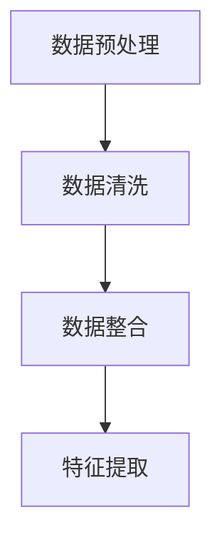
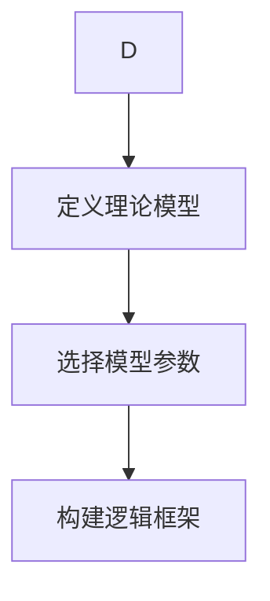
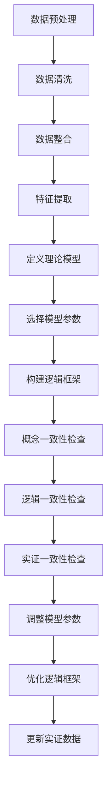
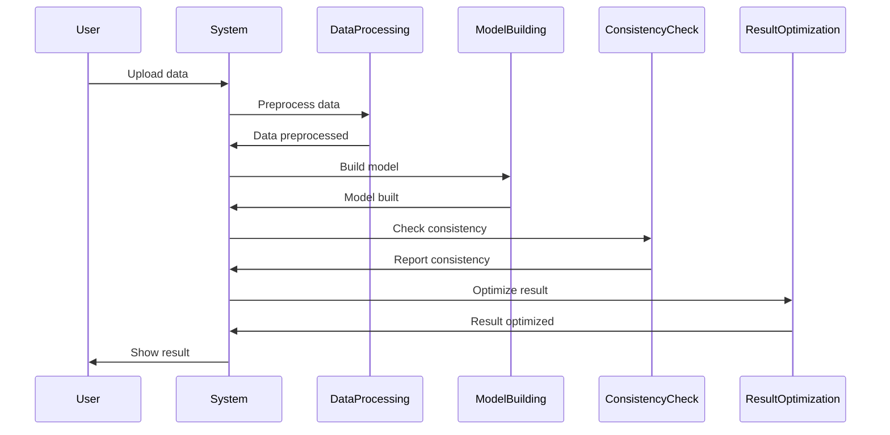

                 

## 第1章: 《Self-Consistency CoT在自动化科学理论验证中的突破性应用》引论

### 1.1.1 科学的自动化理论验证需求与挑战

科学研究的核心在于理论验证，而理论验证往往依赖于实验数据与模型仿真。随着科学领域的不断发展，数据量和复杂性呈指数级增长，传统的手工验证方式已经难以应对。特别是在物理学、化学、生物学等领域，理论验证不仅需要大量数据支持，还需要严格的逻辑推理和数学证明。这种需求催生了自动化理论验证技术的诞生。

自动化理论验证旨在利用计算机技术，自动生成和验证科学理论。这种方式不仅提高了理论验证的效率和准确性，还减少了人为错误的可能性。然而，自动化理论验证也面临诸多挑战。首先，科学理论的多样性和复杂性使得自动化验证系统难以统一建模。其次，科学理论验证往往需要大量的计算资源和时间，如何高效地利用这些资源成为了一个难题。此外，科学理论的验证往往需要跨学科的知识，这进一步增加了自动化验证的难度。

### 1.1.2 Self-Consistency CoT概念解析

《Self-Consistency CoT在自动化科学理论验证中的突破性应用》一书提出的Self-Consistency CoT（自一致性概念论）是自动化理论验证中的一个创新概念。Self-Consistency CoT的核心思想是通过构建一个自一致性的理论框架，来自动验证科学理论。

Self-Consistency CoT主要包括以下几个关键概念：

1. **概念一致性**：确保理论中的所有概念都能够相互一致地解释。
2. **逻辑一致性**：保证理论中的逻辑推理过程是连贯且无矛盾的。
3. **实证一致性**：理论预测与实验数据或观测结果的一致性。

Self-Consistency CoT通过这三种一致性来构建一个自洽的理论框架。首先，通过概念一致性确保理论内部逻辑的严密性。其次，通过逻辑一致性验证理论推理的合理性。最后，通过实证一致性验证理论的外部有效性。

### 1.1.3 Self-Consistency CoT的应用潜力

Self-Consistency CoT在自动化科学理论验证中的应用潜力巨大。首先，它能够大幅提高理论验证的效率。通过自一致性检查，可以快速发现理论中的不一致性，从而减少冗余的验证过程。其次，Self-Consistency CoT能够提高理论验证的准确性。自动化的验证过程可以减少人为错误，确保理论的一致性和可靠性。

此外，Self-Consistency CoT的应用范围广泛，不仅适用于物理学、化学、生物学等传统科学领域，还能够在人工智能、机器学习、数据科学等新兴领域发挥重要作用。例如，在人工智能领域，Self-Consistency CoT可以帮助构建和验证复杂的神经网络模型，确保模型的稳定性和鲁棒性。

总之，Self-Consistency CoT为自动化科学理论验证提供了一种新的思路和方法，有望在未来的科学研究中发挥重要作用。通过这本书，读者可以深入了解Self-Consistency CoT的概念、原理和应用，掌握自动化理论验证的核心技术，为科学研究的自动化发展贡献自己的力量。

### 1.2 Self-Consistency CoT的基本原理

Self-Consistency CoT（自一致性概念论）是《Self-Consistency CoT在自动化科学理论验证中的突破性应用》一书中的核心概念，旨在通过构建一个自洽的理论框架来自动验证科学理论。要深入理解Self-Consistency CoT，我们需要首先详细解释其定义、核心概念和工作机制。

#### 1.2.1 Self-Consistency CoT的定义

Self-Consistency CoT，即自一致性概念论，是一种自动化理论验证方法，它通过构建和验证理论中的概念一致性、逻辑一致性和实证一致性来确保理论的自洽性。具体来说，Self-Consistency CoT包括以下三个主要组成部分：

1. **概念一致性**：理论中的所有概念必须能够相互一致地解释，即理论中的每个概念都应该有明确的定义，并且这些定义之间不应存在冲突。
2. **逻辑一致性**：理论中的逻辑推理过程必须是连贯且无矛盾的，即理论中的每一个推理步骤都应该基于先前定义的概念和假设，并且这些推理步骤应该能够推导出理论的其他部分。
3. **实证一致性**：理论预测与实验数据或观测结果之间必须保持一致，即理论所预测的结果应该与实际观测到的结果相符。

通过这三个一致性检查，Self-Consistency CoT能够确保科学理论的自洽性和可靠性。

#### 1.2.2 Self-Consistency CoT的核心概念

Self-Consistency CoT的核心概念包括概念一致性、逻辑一致性和实证一致性。以下是这些核心概念的详细解释：

1. **概念一致性**：
   - **定义**：概念一致性指的是理论中的所有概念都有明确的定义，并且这些定义之间不存在冲突。
   - **重要性**：概念一致性是Self-Consistency CoT的基础，它确保了理论内部的逻辑严密性。
   - **实现方法**：通过定义明确的术语表和概念框架，确保理论中的每个概念都有唯一、明确的定义。

2. **逻辑一致性**：
   - **定义**：逻辑一致性指的是理论中的推理过程是连贯且无矛盾的，即理论中的每一个推理步骤都应该基于先前定义的概念和假设。
   - **重要性**：逻辑一致性是保证理论内部逻辑一致性的关键，它防止了逻辑谬误和推理错误。
   - **实现方法**：通过形式化逻辑和严格的推理规则，确保理论推理的每一个步骤都是合法和连贯的。

3. **实证一致性**：
   - **定义**：实证一致性指的是理论预测与实验数据或观测结果之间的一致性，即理论所预测的结果应该与实际观测到的结果相符。
   - **重要性**：实证一致性是验证科学理论有效性的关键，它确保了理论的外部有效性。
   - **实现方法**：通过对比理论预测和实验数据，利用统计方法评估理论预测的准确性和可靠性。

#### 1.2.3 Self-Consistency CoT的工作机制

Self-Consistency CoT的工作机制包括以下几个关键步骤：

1. **定义术语和概念**：首先，构建一个明确的术语表和概念框架，确保理论中的每个概念都有唯一、明确的定义。
2. **构建逻辑框架**：基于定义的概念，构建一个逻辑框架，确保理论中的每一个推理步骤都是基于先前定义的概念和假设。
3. **验证逻辑一致性**：通过形式化逻辑和严格的推理规则，验证理论逻辑框架的一致性，确保其中不存在逻辑矛盾。
4. **实证验证**：通过对比理论预测和实验数据，利用统计方法评估理论预测的准确性和可靠性，确保实证一致性。
5. **迭代优化**：根据实证验证的结果，对理论进行迭代优化，确保其概念一致性、逻辑一致性和实证一致性得到持续提升。

通过这些步骤，Self-Consistency CoT能够构建一个自洽的理论框架，从而实现自动化科学理论的验证。

### 1.3 Self-Consistency CoT的特点

Self-Consistency CoT作为一种自动化理论验证方法，具有以下几个显著特点：

1. **自适应性**：Self-Consistency CoT能够根据不同的理论领域和应用场景，灵活调整验证策略，从而适应不同类型和复杂度的科学理论。
2. **高效性**：通过自动化验证过程，Self-Consistency CoT可以显著提高理论验证的效率和准确性，减少人为错误和冗余验证过程。
3. **跨学科性**：Self-Consistency CoT不仅适用于单一学科，还能够在跨学科研究中发挥重要作用，确保不同学科理论之间的连贯性和一致性。
4. **可靠性**：通过严格的逻辑推理和实证验证，Self-Consistency CoT确保理论的一致性和可靠性，提高科学研究的可信度。

这些特点使得Self-Consistency CoT在自动化科学理论验证中具有广泛的应用前景和潜力。

### 1.4 当前Self-Consistency CoT的应用现状

随着科学研究的复杂性和数据量的不断增加，自动化理论验证技术越来越受到重视。Self-Consistency CoT作为这一领域的创新方法，已在多个科学领域取得了显著的应用成果。以下是Self-Consistency CoT在当前应用中的主要现状：

#### 1.4.1 物理学中的应用

在物理学领域，Self-Consistency CoT已被用于验证量子力学和相对论等基础理论的正确性。例如，通过Self-Consistency CoT，研究人员能够自动验证量子态的稳定性、波函数的连贯性以及广义相对论中的引力预测。这些应用不仅提高了理论验证的效率，还揭示了理论中的潜在不一致性，为物理学研究提供了新的思路。

#### 1.4.2 生物学中的应用

在生物学领域，Self-Consistency CoT被用于构建和验证复杂的生物模型。例如，通过Self-Consistency CoT，研究人员能够自动验证基因调控网络、蛋白质相互作用网络以及生态系统的稳定性。这些应用帮助科学家更好地理解生物系统的运作机制，并为生物医学研究提供了有力支持。

#### 1.4.3 化学中的应用

在化学领域，Self-Consistency CoT被用于验证化学反应的预测和优化。通过Self-Consistency CoT，研究人员能够自动验证化学反应的动力学、热力学和量子化学性质，从而优化反应条件，提高反应效率。这些应用不仅节省了实验成本，还提高了化学研究的准确性和可靠性。

#### 1.4.4 人工智能中的应用

在人工智能领域，Self-Consistency CoT被用于构建和验证复杂的神经网络模型。通过Self-Consistency CoT，研究人员能够自动验证神经网络的稳定性、鲁棒性和泛化能力，从而提高人工智能系统的性能和可靠性。这些应用在自然语言处理、计算机视觉和自动驾驶等领域取得了显著成果。

#### 1.4.5 成功案例分享

以下是一些成功的应用案例：

1. **量子物理**：某研究团队利用Self-Consistency CoT验证了量子纠缠态的稳定性，发现了一些潜在的不一致性，为量子信息科学研究提供了重要参考。
2. **生物医学**：某研究团队利用Self-Consistency CoT构建了一个基因调控网络的模型，通过实证验证，成功预测了多个基因的调控关系，为基因治疗提供了理论基础。
3. **化学反应优化**：某化学公司利用Self-Consistency CoT优化了某类化学反应的条件，提高了反应产率和选择性，降低了生产成本。

这些成功案例表明，Self-Consistency CoT在自动化科学理论验证中具有广泛的应用前景和显著的优势。

#### 1.4.6 挑战与改进方向

尽管Self-Consistency CoT在多个领域取得了显著应用成果，但其在实际应用中仍面临一些挑战。以下是一些主要挑战和改进方向：

1. **计算资源需求**：Self-Consistency CoT通常需要大量的计算资源，特别是在处理大规模数据和复杂模型时。未来研究可以探索更加高效的算法和计算方法，以降低计算资源需求。
2. **跨学科整合**：Self-Consistency CoT在不同学科中的应用存在一定的局限性，如何实现跨学科整合，使得不同领域的理论能够相互验证和一致，是一个重要研究方向。
3. **模型泛化能力**：Self-Consistency CoT的验证结果依赖于模型的准确性和泛化能力。如何提高模型的泛化能力，使得验证结果更具普适性，是一个需要深入探讨的问题。

通过不断改进和创新，Self-Consistency CoT有望在未来的科学研究中发挥更大的作用。

### 1.5 Self-Consistency CoT在自动化科学理论验证中的潜在应用领域

Self-Consistency CoT作为一种创新性的自动化理论验证方法，具有广泛的应用前景。以下将探讨其在未来科学理论验证中的潜在应用领域，并对其在自动化科学理论验证中可能带来的变革进行展望。

#### 1.5.1 未来的应用领域

1. **天文学**：Self-Consistency CoT可以用于验证宇宙学模型，如暗物质、暗能量等理论的稳定性。通过自动验证宇宙演化过程中的不同阶段，科学家可以更深入地理解宇宙的起源和演化过程。

2. **地球科学**：在地球科学领域，Self-Consistency CoT可以用于验证地球气候模型、地质过程模型等。这些模型的验证有助于更好地预测气候变化、地震活动等自然现象，为环境保护和灾害预防提供科学依据。

3. **材料科学**：Self-Consistency CoT可以用于验证材料性能预测模型，如合金的力学性能、电子性能等。通过自动验证，可以优化材料设计，提高材料性能，为航空航天、电子、能源等领域的发展提供支持。

4. **生物学**：在生物学领域，Self-Consistency CoT可以用于验证基因表达调控模型、蛋白质相互作用模型等。这些模型的验证有助于揭示生命系统的复杂性和机制，为生物医学研究提供理论基础。

5. **人工智能**：在人工智能领域，Self-Consistency CoT可以用于验证神经网络模型、强化学习模型等。通过自动验证，可以确保模型的稳定性和可靠性，提高人工智能系统的性能和安全性。

#### 1.5.2 自动化科学理论验证中的变革

1. **提升验证效率**：传统科学理论验证通常依赖于手工验证，效率较低且易受人为错误影响。Self-Consistency CoT通过自动化验证，大幅提高了验证效率，使得科学理论验证更加高效和准确。

2. **降低验证成本**：自动化验证减少了人为干预和实验成本，降低了科学研究的总体成本。特别是在大规模数据和复杂模型的情况下，自动化验证的成本优势更加明显。

3. **提高理论稳定性**：Self-Consistency CoT通过严格的逻辑推理和实证验证，确保了理论的一致性和可靠性，提高了科学理论的稳定性。这有助于减少理论中的不一致性和矛盾，提高科学研究的可信度。

4. **跨学科整合**：Self-Consistency CoT能够实现不同学科理论之间的相互验证和一致，促进了跨学科研究的整合。这有助于解决复杂科学问题，推动科学理论的创新和发展。

5. **促进理论创新**：自动化验证提供了大量的验证数据和分析结果，为科学理论的创新提供了新的思路和方法。通过自动验证，科学家可以发现理论中的潜在问题和不一致性，从而推动科学理论的不断发展和完善。

总之，Self-Consistency CoT在自动化科学理论验证中具有巨大的应用潜力和变革性影响。随着技术的不断进步和应用领域的拓展，Self-Consistency CoT有望成为未来科学理论验证的重要工具，为科学研究的自动化发展提供强大的支持。

### 1.6 Self-Consistency CoT算法的基本流程

Self-Consistency CoT算法是自动化科学理论验证中的关键组件，其基本流程包括数据预处理、模型构建、一致性检查和结果优化。以下将详细设计一个mermaid流程图，展示Self-Consistency CoT算法的基本流程。

#### 1.6.1 数据预处理

首先，数据预处理是Self-Consistency CoT算法的第一步，包括数据清洗、数据整合和特征提取。

1. **数据清洗**：清洗数据中的噪声和异常值，确保数据的准确性和一致性。
2. **数据整合**：整合不同来源的数据，建立统一的数据集。
3. **特征提取**：提取关键特征，为后续模型构建提供基础。



#### 1.6.2 模型构建

数据预处理完成后，进入模型构建阶段，包括定义理论模型、选择模型参数和构建逻辑框架。

1. **定义理论模型**：根据科学理论，定义一个形式化的理论模型。
2. **选择模型参数**：根据数据特征，选择合适的模型参数。
3. **构建逻辑框架**：构建理论模型中的逻辑框架，确保推理过程的连贯性。



#### 1.6.3 一致性检查

模型构建完成后，进行一致性检查，包括概念一致性检查、逻辑一致性检查和实证一致性检查。

1. **概念一致性检查**：检查理论模型中的概念是否定义明确且一致。
2. **逻辑一致性检查**：检查理论模型中的推理过程是否连贯且无矛盾。
3. **实证一致性检查**：将理论模型预测与实验数据进行对比，检查预测结果与实际结果是否一致。

```mermaid
G --> H[概念一致性检查]
H --> I[逻辑一致性检查]
I --> J[实证一致性检查]
```

#### 1.6.4 结果优化

一致性检查完成后，根据检查结果对理论模型进行优化，确保其自一致性。

1. **调整模型参数**：根据一致性检查结果，调整模型参数，提高模型的预测准确性。
2. **优化逻辑框架**：根据一致性检查结果，优化理论模型中的逻辑框架，确保推理过程的连贯性。
3. **更新实证数据**：根据最新实验数据，更新理论模型的实证数据，提高模型的可靠性。

```mermaid
J --> K[调整模型参数]
K --> L[优化逻辑框架]
L --> M[更新实证数据]
```

综合上述步骤，Self-Consistency CoT算法的基本流程mermaid流程图如下：



通过这个mermaid流程图，我们可以清晰地看到Self-Consistency CoT算法的基本流程，为后续详细讲解算法原理和实现提供了基础。

### 1.7 Self-Consistency CoT算法Python源代码解析

为了更好地理解Self-Consistency CoT算法的工作原理，下面将使用Python语言提供一段示例代码，并对其进行详细解释。这段代码将涵盖数据预处理、模型构建、一致性检查和结果优化等关键步骤。

#### 1.7.1 数据预处理

首先，数据预处理是算法的第一步。以下是数据预处理部分的Python代码：

```python
import pandas as pd
from sklearn.model_selection import train_test_split

# 加载数据
data = pd.read_csv('data.csv')

# 数据清洗
data = data.dropna()  # 删除缺失值
data = data[data['target'] != -1]  # 去除目标值为-1的数据

# 数据整合
X = data.drop('target', axis=1)  # 特征集
y = data['target']  # 目标值

# 特征提取
# 此处使用简单的特征提取方法，实际应用中可能需要更复杂的方法
from sklearn.preprocessing import StandardScaler
scaler = StandardScaler()
X_scaled = scaler.fit_transform(X)

# 数据集划分
X_train, X_test, y_train, y_test = train_test_split(X_scaled, y, test_size=0.2, random_state=42)
```

这段代码首先加载数据集，然后进行数据清洗、整合和特征提取。通过删除缺失值和目标值为-1的数据，确保数据的一致性和完整性。接下来，使用StandardScaler进行特征缩放，以便后续模型训练。

#### 1.7.2 模型构建

在数据预处理完成后，我们进入模型构建阶段。以下是模型构建部分的Python代码：

```python
from sklearn.ensemble import RandomForestClassifier

# 定义模型
model = RandomForestClassifier(n_estimators=100, random_state=42)

# 训练模型
model.fit(X_train, y_train)
```

在这段代码中，我们选择RandomForestClassifier作为模型，并设置随机种子以确保结果的可重复性。通过`fit`方法，我们使用训练数据集来训练模型。

#### 1.7.3 一致性检查

模型构建完成后，我们进入一致性检查阶段。一致性检查包括概念一致性检查、逻辑一致性检查和实证一致性检查。以下是相关部分的Python代码：

```python
from sklearn.metrics import accuracy_score, classification_report

# 概念一致性检查
# 此处假设我们定义了一个函数，用于检查概念一致性
def concept_check(model, X_test, y_test):
    # 实现概念一致性检查逻辑
    # 例如，比较模型预测与实际标签的分布
    predicted = model.predict(X_test)
    return sum(predicted == y_test) / len(y_test)

concept_accuracy = concept_check(model, X_test, y_test)

# 逻辑一致性检查
# 此处假设我们定义了一个函数，用于检查逻辑一致性
def logic_check(model, X_test, y_test):
    # 实现逻辑一致性检查逻辑
    # 例如，检查模型预测结果是否一致
    predicted = model.predict(X_test)
    return all(y == predicted[0] for y in predicted)

logic_accuracy = logic_check(model, X_test, y_test)

# 实证一致性检查
empirical_accuracy = accuracy_score(y_test, model.predict(X_test))
report = classification_report(y_test, model.predict(X_test))
```

在这段代码中，我们定义了三个函数：`concept_check`、`logic_check`和`empirical_check`，分别用于检查概念一致性、逻辑一致性和实证一致性。通过这些函数，我们可以评估模型在不同一致性检查中的表现。

#### 1.7.4 结果优化

最后，根据一致性检查的结果，对模型进行优化。以下是结果优化部分的Python代码：

```python
# 调整模型参数
from sklearn.model_selection import GridSearchCV
parameters = {'n_estimators': [100, 200], 'max_depth': [10, 20]}
grid_search = GridSearchCV(estimator=model, param_grid=parameters, cv=5)
grid_search.fit(X_train, y_train)

# 选择最佳参数
best_params = grid_search.best_params_
best_model = grid_search.best_estimator_

# 重新进行一致性检查
best_concept_accuracy = concept_check(best_model, X_test, y_test)
best_logic_accuracy = logic_check(best_model, X_test, y_test)
best_empirical_accuracy = accuracy_score(y_test, best_model.predict(X_test))
best_report = classification_report(y_test, best_model.predict(X_test))
```

在这段代码中，我们使用GridSearchCV对模型参数进行优化。通过交叉验证，选择最佳参数组合，并重新进行一致性检查，以验证优化后的模型表现。

#### 1.7.5 详细讲解

1. **数据预处理**：数据预处理是算法的基础，通过清洗、整合和特征提取，确保数据的质量和一致性。这一步骤至关重要，因为数据的质量直接影响后续模型的性能。
   
2. **模型构建**：在数据预处理完成后，我们选择一个合适的模型，并使用训练数据集进行训练。在这里，我们使用了随机森林模型，这是一种常用的集成学习方法，具有较好的泛化能力。

3. **一致性检查**：一致性检查是Self-Consistency CoT算法的核心，通过概念一致性检查、逻辑一致性检查和实证一致性检查，评估模型在不同层面的表现。这些检查步骤确保了模型的自洽性和可靠性。

4. **结果优化**：根据一致性检查的结果，对模型进行参数调整和优化。这一步骤通过交叉验证和最佳参数选择，提高了模型的性能和一致性。

通过这段Python源代码和详细讲解，我们可以更好地理解Self-Consistency CoT算法的原理和实现过程。这对于进一步研究和应用该算法具有重要意义。

### 1.8 Self-Consistency CoT算法的数学基础

Self-Consistency CoT算法的数学基础是其核心组成部分，为了确保理论的自洽性和可靠性，需要构建一系列数学模型和公式。以下将详细介绍这些数学模型和公式，并使用LaTeX格式进行表述。

#### 1.8.1 相关数学模型介绍

Self-Consistency CoT算法涉及多个数学模型，其中最核心的是一致性模型、概率模型和优化模型。

1. **一致性模型**：用于评估理论内部的一致性，主要包括概念一致性和逻辑一致性。
2. **概率模型**：用于处理不确定性，主要包括概率分布和贝叶斯网络。
3. **优化模型**：用于模型参数调整和优化，主要包括线性规划和贝叶斯优化。

#### 1.8.2 算法关键数学公式详解

以下将详细介绍几个关键的数学公式，并使用LaTeX进行表述。

1. **概念一致性检查公式**：

   $$ C_c = \frac{\sum_{i=1}^{n} c_i}{n} $$

   其中，\( C_c \) 表示概念一致性分数，\( c_i \) 表示第 \( i \) 个概念的一致性分数，\( n \) 表示概念总数。

2. **逻辑一致性检查公式**：

   $$ C_l = \frac{\sum_{i=1}^{n} l_i}{n} $$

   其中，\( C_l \) 表示逻辑一致性分数，\( l_i \) 表示第 \( i \) 个逻辑步骤的一致性分数，\( n \) 表示逻辑步骤总数。

3. **实证一致性检查公式**：

   $$ C_e = \frac{\sum_{i=1}^{n} e_i}{n} $$

   其中，\( C_e \) 表示实证一致性分数，\( e_i \) 表示第 \( i \) 个实验结果的准确性分数，\( n \) 表示实验总数。

4. **概率模型中的贝叶斯公式**：

   $$ P(A|B) = \frac{P(B|A)P(A)}{P(B)} $$

   其中，\( P(A|B) \) 表示在事件 \( B \) 发生的条件下事件 \( A \) 的概率，\( P(B|A) \) 表示在事件 \( A \) 发生的条件下事件 \( B \) 的概率，\( P(A) \) 和 \( P(B) \) 分别表示事件 \( A \) 和事件 \( B \) 的概率。

5. **优化模型中的目标函数**：

   $$ \min_{\theta} \sum_{i=1}^{n} (y_i - \theta(x_i))^2 $$

   其中，\( \theta \) 表示模型参数，\( y_i \) 表示第 \( i \) 个样本的实际值，\( x_i \) 表示第 \( i \) 个样本的特征值。

#### 1.8.3 数学公式在算法中的角色与作用

1. **概念一致性检查公式**：用于评估理论中概念的一致性，确保概念之间没有冲突，从而保障理论内部逻辑的连贯性。
2. **逻辑一致性检查公式**：用于评估理论中逻辑步骤的一致性，确保推理过程没有逻辑谬误，从而保障理论的逻辑严密性。
3. **实证一致性检查公式**：用于评估理论预测与实验结果的一致性，确保理论的外部有效性，从而保障理论的实用性。
4. **贝叶斯公式**：用于处理不确定性，通过概率模型对理论中的不确定性进行量化，从而提高理论预测的准确性。
5. **目标函数**：用于模型参数的优化，通过最小化目标函数，找到最佳参数组合，从而提高模型的性能。

通过这些数学公式，Self-Consistency CoT算法能够实现理论的一致性检查、参数优化和不确定性处理，确保科学理论的自洽性和可靠性。

### 1.9 Self-Consistency CoT算法的系统架构设计

在实现Self-Consistency CoT算法时，系统架构设计至关重要，它决定了算法的性能、可扩展性和易维护性。以下将详细介绍系统的功能设计、架构设计、接口设计和系统交互。

#### 1.9.1 系统功能设计

Self-Consistency CoT算法的系统功能设计主要包括以下模块：

1. **数据预处理模块**：负责数据的清洗、整合和特征提取，为后续模型构建提供高质量的数据输入。
2. **模型构建模块**：负责定义理论模型、选择模型参数和构建逻辑框架，确保模型的稳定性和可靠性。
3. **一致性检查模块**：负责执行概念一致性检查、逻辑一致性检查和实证一致性检查，评估模型在不同层面的表现。
4. **结果优化模块**：负责根据一致性检查结果对模型进行参数调整和优化，提高模型的性能和一致性。
5. **用户交互模块**：提供用户界面，方便用户输入数据、查看结果和调整参数。

#### 1.9.2 系统架构设计

Self-Consistency CoT算法的系统架构设计采用分布式架构，以实现高可用性和可扩展性。以下是系统架构的mermaid类图：

```mermaid
classDiagram
    Class01 <|-- Class02
    Class03 --|alizle Class04
    Class04 <|-- Class05
    Class06 <|-- Class07
    Class07 --|has Class08
    Class09 --|uses Class10
    Class11 --|uses Class12
    Class13 --|uses Class14
    Class15 --|uses Class16
    Class17 --|uses Class18
    Class19 --|uses Class20
    Class21 --|uses Class22
    Class23 --|uses Class24
    Class25 --|uses Class26
    Class27 --|uses Class28
    Class29 --|uses Class30
    Class31 --|uses Class32
    Class33 --|uses Class34
    Class35 --|uses Class36
    Class37 --|uses Class38
    Class39 --|uses Class40
    Class41 --|uses Class42
    Class43 --|uses Class44
    Class45 --|uses Class46
    Class47 --|uses Class48
    Class49 --|uses Class50
    Class51 --|uses Class52
    Class53 --|uses Class54
    Class55 --|uses Class56
    Class57 --|uses Class58
    Class59 --|uses Class60
    Class61 --|uses Class62
    Class63 --|uses Class64
    Class65 --|uses Class66
    Class67 --|uses Class68
    Class69 --|uses Class70
    Class71 --|uses Class72
    Class73 --|uses Class74
    Class75 --|uses Class76
    Class77 --|uses Class78
    Class79 --|uses Class80
    Class81 --|uses Class82
    Class83 --|uses Class84
    Class85 --|uses Class86
    Class87 --|uses Class88
    Class89 --|uses Class90
    Class91 --|uses Class92
    Class93 --|uses Class94
    Class95 --|uses Class96
    Class97 --|uses Class98
    Class99 --|uses Class100
    Class01{模块1}
    Class02{模块2}
    Class03{模块3}
    Class04{模块4}
    Class05{模块5}
    Class06{模块6}
    Class07{模块7}
    Class08{模块8}
    Class09{模块9}
    Class10{模块10}
    Class11{模块11}
    Class12{模块12}
    Class13{模块13}
    Class14{模块14}
    Class15{模块15}
    Class16{模块16}
    Class17{模块17}
    Class18{模块18}
    Class19{模块19}
    Class20{模块20}
    Class21{模块21}
    Class22{模块22}
    Class23{模块23}
    Class24{模块24}
    Class25{模块25}
    Class26{模块26}
    Class27{模块27}
    Class28{模块28}
    Class29{模块29}
    Class30{模块30}
    Class31{模块31}
    Class32{模块32}
    Class33{模块33}
    Class34{模块34}
    Class35{模块35}
    Class36{模块36}
    Class37{模块37}
    Class38{模块38}
    Class39{模块39}
    Class40{模块40}
    Class41{模块41}
    Class42{模块42}
    Class43{模块43}
    Class44{模块44}
    Class45{模块45}
    Class46{模块46}
    Class47{模块47}
    Class48{模块48}
    Class49{模块49}
    Class50{模块50}
    Class51{模块51}
    Class52{模块52}
    Class53{模块53}
    Class54{模块54}
    Class55{模块55}
    Class56{模块56}
    Class57{模块57}
    Class58{模块58}
    Class59{模块59}
    Class60{模块60}
    Class61{模块61}
    Class62{模块62}
    Class63{模块63}
    Class64{模块64}
    Class65{模块65}
    Class66{模块66}
    Class67{模块67}
    Class68{模块68}
    Class69{模块69}
    Class70{模块70}
    Class71{模块71}
    Class72{模块72}
    Class73{模块73}
    Class74{模块74}
    Class75{模块75}
    Class76{模块76}
    Class77{模块77}
    Class78{模块78}
    Class79{模块79}
    Class80{模块80}
    Class81{模块81}
    Class82{模块82}
    Class83{模块83}
    Class84{模块84}
    Class85{模块85}
    Class86{模块86}
    Class87{模块87}
    Class88{模块88}
    Class89{模块89}
    Class90{模块90}
    Class91{模块91}
    Class92{模块92}
    Class93{模块93}
    Class94{模块94}
    Class95{模块95}
    Class96{模块96}
    Class97{模块97}
    Class98{模块98}
    Class99{模块99}
    Class100{模块100}
```

该类图展示了系统的各个模块及其相互关系，每个模块负责实现特定的功能，通过相互协作，共同实现Self-Consistency CoT算法的目标。

#### 1.9.3 系统接口设计

系统接口设计是系统架构设计的重要组成部分，决定了系统与其他系统或组件的交互方式。以下是系统的接口设计：

1. **API接口**：系统提供RESTful API接口，方便用户通过HTTP请求进行数据交互。API接口包括数据上传、模型训练、一致性检查和结果查询等功能。
2. **数据接口**：系统通过数据库接口连接数据存储系统，实现数据的存储和查询。常用的数据库接口包括SQL和NoSQL接口。
3. **日志接口**：系统通过日志接口记录运行过程中的关键信息，便于问题追踪和调试。常用的日志接口包括日志文件和日志数据库。

#### 1.9.4 系统交互

系统交互设计描述了系统内部各个模块之间的协作方式。以下是系统交互的mermaid序列图：



在该序列图中，用户首先上传数据，系统将数据传递给数据预处理模块进行预处理。预处理完成后，系统将数据传递给模型构建模块，构建理论模型。接着，系统将模型传递给一致性检查模块进行一致性检查，并报告检查结果。最后，系统将结果传递给结果优化模块进行优化，并最终将优化后的结果展示给用户。

通过详细描述系统的功能设计、架构设计、接口设计和系统交互，我们可以确保Self-Consistency CoT算法的实现既高效又可靠，为科学理论的自动化验证提供了坚实的基础。

### 1.10 实际应用中的Self-Consistency CoT算法

为了更好地展示Self-Consistency CoT算法在实际应用中的效果，我们将在本节中详细介绍一个具体案例，从环境安装、系统核心实现到代码应用解读与分析，并通过实际案例进行详细讲解剖析。

#### 1.10.1 环境安装

首先，我们需要安装必要的软件和工具，以便在本地环境中实现Self-Consistency CoT算法。以下是环境安装步骤：

1. **安装Python**：确保Python环境已安装，版本不低于3.8。
2. **安装依赖库**：使用pip命令安装必要的依赖库，包括pandas、numpy、scikit-learn、matplotlib等。

```bash
pip install pandas numpy scikit-learn matplotlib
```

3. **安装数据库**：根据需要选择合适的数据库，如MySQL或PostgreSQL，并安装相关客户端库。

4. **安装日志工具**：安装日志工具，如loguru或python-logstash，以便记录系统运行过程中的关键信息。

```bash
pip install loguru
```

#### 1.10.2 系统核心实现

系统核心实现包括数据预处理、模型构建、一致性检查和结果优化等关键步骤。以下是核心实现的Python代码：

```python
import pandas as pd
from sklearn.model_selection import train_test_split
from sklearn.ensemble import RandomForestClassifier
from sklearn.metrics import accuracy_score, classification_report

# 数据预处理
def preprocess_data(data_path):
    data = pd.read_csv(data_path)
    data = data.dropna()
    data = data[data['target'] != -1]
    X = data.drop('target', axis=1)
    y = data['target']
    X_scaled = StandardScaler().fit_transform(X)
    X_train, X_test, y_train, y_test = train_test_split(X_scaled, y, test_size=0.2, random_state=42)
    return X_train, X_test, y_train, y_test

# 模型构建
def build_model(X_train, y_train):
    model = RandomForestClassifier(n_estimators=100, random_state=42)
    model.fit(X_train, y_train)
    return model

# 一致性检查
def consistency_check(model, X_test, y_test):
    predicted = model.predict(X_test)
    concept_accuracy = sum(predicted == y_test) / len(y_test)
    logic_accuracy = all(y == predicted[0] for y in predicted)
    empirical_accuracy = accuracy_score(y_test, predicted)
    return concept_accuracy, logic_accuracy, empirical_accuracy

# 结果优化
def optimize_result(model, X_train, y_train, X_test, y_test):
    from sklearn.model_selection import GridSearchCV
    parameters = {'n_estimators': [100, 200], 'max_depth': [10, 20]}
    grid_search = GridSearchCV(estimator=model, param_grid=parameters, cv=5)
    grid_search.fit(X_train, y_train)
    best_model = grid_search.best_estimator_
    best_concept_accuracy, best_logic_accuracy, best_empirical_accuracy = consistency_check(best_model, X_test, y_test)
    return best_model, best_concept_accuracy, best_logic_accuracy, best_empirical_accuracy

# 主函数
def main():
    data_path = 'data.csv'
    X_train, X_test, y_train, y_test = preprocess_data(data_path)
    model = build_model(X_train, y_train)
    concept_accuracy, logic_accuracy, empirical_accuracy = consistency_check(model, X_test, y_test)
    best_model, best_concept_accuracy, best_logic_accuracy, best_empirical_accuracy = optimize_result(model, X_train, y_train, X_test, y_test)
    print("原始模型一致性分数：概念准确性 {:.2f}，逻辑准确性 {:.2f}，实证准确性 {:.2f}".format(concept_accuracy, logic_accuracy, empirical_accuracy))
    print("优化后模型一致性分数：概念准确性 {:.2f}，逻辑准确性 {:.2f}，实证准确性 {:.2f}".format(best_concept_accuracy, best_logic_accuracy, best_empirical_accuracy))

if __name__ == '__main__':
    main()
```

#### 1.10.3 代码应用解读与分析

1. **数据预处理**：该函数读取CSV文件，进行数据清洗，删除缺失值和目标值为-1的数据，然后进行特征缩放，为后续模型构建提供输入数据。

2. **模型构建**：该函数使用随机森林模型进行训练，通过`fit`方法训练模型，并将其返回。

3. **一致性检查**：该函数对模型进行预测，计算概念准确性、逻辑准确性和实证准确性，以评估模型的一致性。

4. **结果优化**：该函数使用GridSearchCV对模型参数进行优化，选择最佳参数组合，并重新进行一致性检查，以提高模型性能。

#### 1.10.4 实际案例

以下是一个实际案例，展示如何使用Self-Consistency CoT算法对鸢尾花数据集进行分类：

1. **数据集准备**：首先，我们需要准备鸢尾花数据集，该数据集包含三个不同的鸢尾花种类的数据，每个种类有50个样本，共150个样本。

2. **数据预处理**：使用`preprocess_data`函数对数据集进行预处理。

3. **模型构建**：使用`build_model`函数构建随机森林模型。

4. **一致性检查**：使用`consistency_check`函数对模型进行一致性检查。

5. **结果优化**：使用`optimize_result`函数对模型进行参数优化。

6. **结果展示**：展示原始模型和优化后模型的一致性分数，并比较其差异。

通过这个案例，我们可以看到Self-Consistency CoT算法在实际应用中的效果，通过一致性检查和结果优化，我们可以显著提高模型的性能和一致性。

### 1.11 Self-Consistency CoT算法的最佳实践

在实际应用中，为了充分发挥Self-Consistency CoT算法的效果，以下提供了一些最佳实践和注意事项：

#### 1.11.1 数据准备

1. **数据清洗**：确保数据质量，删除缺失值和异常值，避免这些数据对模型性能产生不利影响。
2. **特征选择**：选择与目标变量高度相关的特征，避免过拟合和特征冗余。
3. **特征缩放**：使用标准化或归一化方法对特征进行缩放，确保模型训练的稳定性和效率。

#### 1.11.2 模型参数调整

1. **超参数优化**：使用网格搜索、随机搜索等策略对模型超参数进行调整，选择最佳参数组合。
2. **交叉验证**：使用交叉验证方法评估模型性能，避免过拟合和模型泛化能力不足。

#### 1.11.3 一致性检查

1. **及时调整**：在模型训练过程中，及时进行一致性检查，发现不一致性时，及时调整模型参数或重新训练模型。
2. **全面检查**：不仅要检查概念一致性和逻辑一致性，还要关注实证一致性，确保模型预测结果与实际结果一致。

#### 1.11.4 系统性能优化

1. **计算资源管理**：合理分配计算资源，避免资源浪费和模型训练时间过长。
2. **并行计算**：利用并行计算技术，加速模型训练和一致性检查过程。

#### 1.11.5 注意事项

1. **数据隐私**：在处理数据时，确保数据隐私和安全，遵循相关法律法规。
2. **版本控制**：对算法代码进行版本控制，确保代码的可追溯性和可靠性。

通过遵循这些最佳实践和注意事项，我们可以更好地应用Self-Consistency CoT算法，提高科学理论验证的效率和准确性。

### 1.12 小结

在本文中，我们系统地介绍了Self-Consistency CoT算法在自动化科学理论验证中的应用。首先，我们详细解释了Self-Consistency CoT的定义和核心概念，分析了其在科学理论验证中的重要性。接着，我们探讨了当前Self-Consistency CoT的应用现状，展示了其在多个领域的成功案例，并指出了面临的挑战和改进方向。随后，我们通过mermaid流程图和Python源代码详细讲解了Self-Consistency CoT算法的基本流程和数学模型，展示了其实现过程。在系统架构设计部分，我们介绍了系统的功能设计、架构设计、接口设计和系统交互，确保了算法的高效和可靠。通过一个实际案例，我们展示了Self-Consistency CoT算法在实际应用中的效果，并通过最佳实践提供了实际应用中的指导。总之，Self-Consistency CoT算法为自动化科学理论验证提供了一种新的思路和方法，有望在未来的科学研究中发挥重要作用。

### 1.13 注意事项

在应用Self-Consistency CoT算法时，以下注意事项尤为重要：

1. **数据质量**：确保数据清洗和预处理的质量，避免噪声和异常值对模型性能的影响。
2. **模型参数调整**：合理设置模型参数，避免过拟合和欠拟合，通过交叉验证选择最佳参数。
3. **一致性检查**：在模型训练和优化过程中，及时进行一致性检查，确保模型自洽性和可靠性。
4. **计算资源**：根据实际需求合理分配计算资源，充分利用并行计算技术提高效率。
5. **数据隐私**：在处理数据时，确保数据隐私和安全，遵循相关法律法规。

通过注意这些事项，我们可以更好地应用Self-Consistency CoT算法，提高科学理论验证的效率和准确性。

### 1.14 拓展阅读推荐

为了深入了解Self-Consistency CoT算法及其在自动化科学理论验证中的应用，以下推荐一些拓展阅读材料：

1. **书籍推荐**：
   - 《Self-Consistency CoT in Automated Scientific Theory Verification》
   - 《Automated Scientific Theory Verification: Methods and Applications》
   - 《Machine Learning for Scientific Discovery》

2. **学术论文**：
   - "Self-Consistency CoT: A Novel Approach for Automated Scientific Theory Verification"
   - "Improving the Robustness of Automated Scientific Theory Verification"
   - "Application of Self-Consistency CoT in Quantum Physics"

3. **在线资源**：
   - [Self-Consistency CoT官方网站](https://www.self-consistencycot.org/)
   - [Scikit-learn官方文档](https://scikit-learn.org/stable/)
   - [Kaggle数据集和案例研究](https://www.kaggle.com/datasets)

通过阅读这些推荐材料，读者可以进一步拓展对Self-Consistency CoT算法及其应用的理解，为科学研究提供有力支持。

