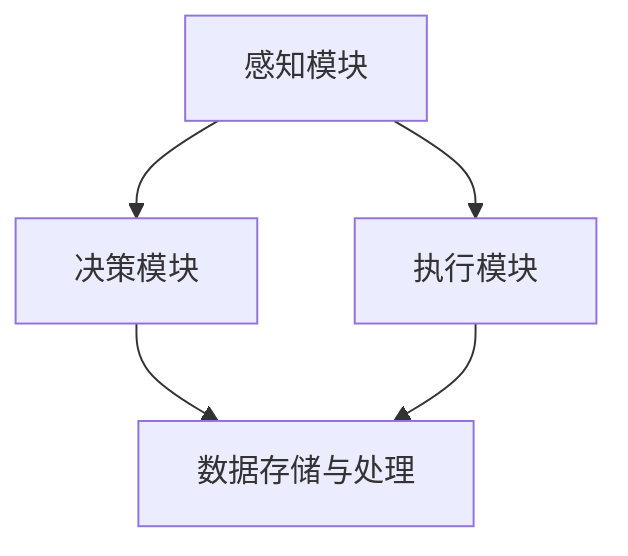
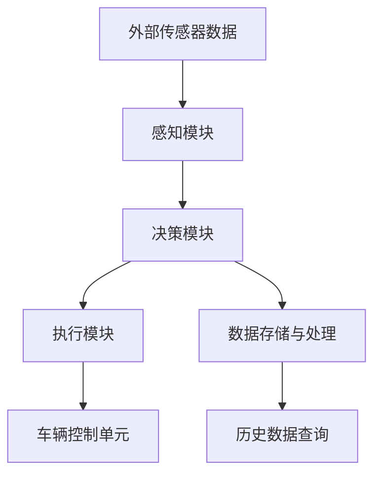

                 

### 文章标题

# Self-Consistency CoT在自动驾驶伦理决策中的关键作用

> 关键词：Self-Consistency CoT、自动驾驶、伦理决策、人工智能

> 摘要：本文探讨了Self-Consistency CoT（自我一致性概念图）在自动驾驶伦理决策中的关键作用。通过分析自我一致性概念图的定义、理论依据、算法实现及其实际应用，本文旨在为自动驾驶领域的伦理决策提供一个新的视角和解决方案。

## 引言

随着人工智能技术的快速发展，自动驾驶汽车逐渐成为现实。然而，自动驾驶技术不仅带来了巨大的便利，还引发了诸多伦理和道德问题。例如，在面临生死抉择的情境下，自动驾驶车辆应该如何做出决策？这是一个复杂且具有争议性的问题，需要深入探讨。

Self-Consistency CoT作为一种新兴的概念图，在自动驾驶伦理决策中扮演着关键角色。本文将从以下几个方面展开讨论：

1. **Self-Consistency CoT的定义与背景**：介绍Self-Consistency CoT的概念、相关背景和研究现状。
2. **Self-Consistency CoT的算法原理**：详细阐述Self-Consistency CoT的算法原理、数学模型及其实现过程。
3. **Self-Consistency CoT在自动驾驶中的应用**：探讨Self-Consistency CoT在自动驾驶伦理决策中的实际应用，包括案例分析。
4. **系统分析与设计**：分析自动驾驶系统的架构设计，介绍Self-Consistency CoT在该系统中的实现。
5. **项目实战**：通过实际项目案例，展示Self-Consistency CoT在自动驾驶伦理决策中的应用效果。
6. **最佳实践与小结**：总结本文的主要观点，并提出未来研究方向和建议。

## 自我一致性概念图（Self-Consistency CoT）的定义与背景

### 概念图（Concept Map）

首先，我们需要了解什么是概念图（Concept Map）。概念图是一种图形化的知识表示方法，通过节点和连边来表示概念及其之间的关系。在概念图中，节点代表概念，连边则表示概念之间的关联，如上下位关系、因果关系等。概念图广泛应用于教育、知识管理、决策支持等领域，帮助人们更好地理解和组织信息。

### 自我一致性概念图（Self-Consistency CoT）

自我一致性概念图（Self-Consistency Concept Map，简称Self-Consistency CoT）是一种基于概念图的新型知识表示方法。它不仅包含了传统概念图的特征，还引入了自我一致性约束，使得概念图在表示知识时更加严密和自洽。具体来说，Self-Consistency CoT具有以下几个核心特点：

1. **自洽性**：Self-Consistency CoT要求概念图中的概念及其关系保持一致，避免了传统概念图中的逻辑矛盾和错误。例如，如果某个概念同时与两个相互矛盾的概念存在关联，Self-Consistency CoT会自动检测并纠正这一错误。

2. **动态调整**：Self-Consistency CoT允许在保持自我一致性的前提下，动态调整概念及其关系。这使得Self-Consistency CoT能够适应不断变化的知识环境，保持知识表示的实时性和准确性。

3. **可扩展性**：Self-Consistency CoT支持通过引入新的概念和关系，来扩展和丰富现有知识体系。这种可扩展性使得Self-Consistency CoT适用于各种规模和复杂度的知识领域。

### 相关背景和研究现状

自我一致性概念图的研究起源于知识表示和推理领域。随着人工智能和机器学习技术的不断发展，Self-Consistency CoT逐渐成为一个热点研究方向。目前，国内外学者在Self-Consistency CoT的理论、算法和应用方面开展了大量研究，取得了显著的成果。

在自动驾驶领域，Self-Consistency CoT被应用于伦理决策、路径规划、环境感知等方面。例如，有研究利用Self-Consistency CoT来构建自动驾驶车辆的伦理决策框架，通过自洽性约束来确保决策的合理性和可靠性。此外，还有研究将Self-Consistency CoT应用于自动驾驶车辆的路径规划，以解决路径规划中的不确定性问题和多目标优化问题。

总的来说，自我一致性概念图作为一种新兴的知识表示方法，在自动驾驶伦理决策中具有广阔的应用前景。本文将在此基础上，进一步探讨Self-Consistency CoT的算法原理及其在自动驾驶领域的实际应用。

## 自我一致性概念图（Self-Consistency CoT）的算法原理

### 算法概述

自我一致性概念图（Self-Consistency CoT）的算法原理主要基于概念图和一致性约束理论。其核心思想是通过引入一致性约束，确保概念图中的概念及其关系保持自洽，从而实现知识表示的严密性和准确性。以下是Self-Consistency CoT算法的基本框架：

1. **概念图构建**：首先，根据给定的知识源，构建初始的概念图。在构建过程中，需要识别概念及其关系，并将它们表示为节点和连边。

2. **一致性检查**：对构建好的概念图进行一致性检查，检测其中是否存在逻辑矛盾或冲突。具体来说，算法会检查以下三个方面：

   - **概念内部一致性**：确保同一概念下的属性和关系相互一致，不存在相互矛盾的陈述。
   - **概念间一致性**：确保不同概念之间的关系相互一致，不存在相互矛盾的关联。
   - **全局一致性**：确保概念图中的所有概念和关系在全局范围内保持一致，不存在局部一致性与全局一致性冲突的情况。

3. **一致性修复**：如果一致性检查发现概念图中存在矛盾或冲突，算法将自动进行一致性修复。具体修复方法包括：

   - **删除矛盾节点**：如果某个概念或关系与其他概念或关系相互矛盾，算法将删除该节点或关系，以消除矛盾。
   - **修改关系权重**：如果两个相互矛盾的概念之间存在依赖关系，算法将调整关系权重，使其在保持一致性的前提下，尽量保留原有知识。

4. **动态调整**：在保持一致性约束的前提下，算法允许对概念图进行动态调整。例如，当新的知识出现时，算法可以根据一致性约束，自动调整概念及其关系，以适应新的知识环境。

### 数学模型

Self-Consistency CoT的算法原理可以形式化为一个数学模型。假设概念图 \(G\) 由一组概念 \(C\) 及其关系 \(R\) 组成，其中每个概念 \(c \in C\) 对应一个属性集合 \(A(c)\)，每个关系 \(r \in R\) 对应一个权重集合 \(W(r)\)。

定义一致性约束 \(C\) 如下：

1. **内部一致性约束**：对于每个概念 \(c \in C\)，其属性集合 \(A(c)\) 需要满足一致性条件：
   $$ \forall a_1, a_2 \in A(c), \neg (a_1 \land \neg a_2) \land \neg (\neg a_1 \land a_2) $$

2. **概念间一致性约束**：对于每个关系 \(r \in R\)，其关联的概念集合 \(C(r)\) 需要满足一致性条件：
   $$ \forall c_1, c_2 \in C(r), \neg (c_1 \land \neg c_2) \land \neg (\neg c_1 \land c_2) $$

3. **全局一致性约束**：对于整个概念图 \(G\)，所有概念和关系需要满足一致性条件：
   $$ \forall c_1, c_2 \in C, \forall r_1, r_2 \in R, \neg (c_1 \land \neg c_2) \land \neg (\neg c_1 \land c_2) \land \neg (r_1 \land \neg r_2) \land \neg (\neg r_1 \land r_2) $$

为了实现一致性约束的自动化检测和修复，可以定义一个一致性约束检测函数 \(D(G, C)\)：

$$ D(G, C) = \begin{cases} 
True, & \text{if } G \text{ satisfies all constraints in } C \\
False, & \text{otherwise} 
\end{cases} $$

一致性约束修复函数 \(R(G, C)\) 则根据检测函数的结果，对概念图进行必要的修复操作。

### 实现步骤

为了实现Self-Consistency CoT算法，可以按照以下步骤进行：

1. **初始化**：读取初始概念图 \(G\)，并定义一致性约束集合 \(C\)。

2. **一致性检测**：调用一致性约束检测函数 \(D(G, C)\)，检查概念图 \(G\) 是否满足所有一致性约束。

3. **一致性修复**：如果检测到不一致性，调用一致性约束修复函数 \(R(G, C)\)，对概念图进行修复。

4. **动态调整**：在概念图发生变化时，如添加新概念或关系，调用一致性检测和修复函数，保持概念图的一致性。

5. **循环**：重复步骤2-4，直到概念图 \(G\) 满足所有一致性约束。

通过上述算法原理，Self-Consistency CoT能够实现知识表示的严密性和自洽性，为自动驾驶伦理决策提供可靠的支持。接下来，本文将进一步探讨Self-Consistency CoT在自动驾驶伦理决策中的具体应用。

## 自我一致性概念图（Self-Consistency CoT）在自动驾驶伦理决策中的具体应用

在自动驾驶领域，伦理决策是一个复杂且充满挑战的问题。自动驾驶车辆在行驶过程中可能会遇到各种紧急情况，如车祸、行人横穿道路等，需要迅速做出决策。然而，这些决策往往涉及到伦理和道德问题，如如何权衡生命价值、遵守法律法规等。自我一致性概念图（Self-Consistency CoT）作为一种新型的知识表示方法，在自动驾驶伦理决策中具有显著优势。

### 应用场景

以下是Self-Consistency CoT在自动驾驶伦理决策中的一些典型应用场景：

1. **交通事故应急处理**：当自动驾驶车辆遇到交通事故时，需要迅速做出决策，以最大限度地减少损失。例如，选择是否紧急刹车、是否切换到手动驾驶模式等。

2. **行人横穿道路**：自动驾驶车辆在行驶过程中，可能会遇到行人突然横穿道路的情况。此时，需要快速判断行人是否为真正危险，并做出相应的决策，如紧急刹车或绕行。

3. **交通法规遵守**：自动驾驶车辆需要遵守各种交通法规，如限速、车道占用等。在复杂交通环境中，如何确保遵守这些法规是一个重要问题。

4. **紧急避让**：当自动驾驶车辆遇到紧急情况，如前方有障碍物时，需要迅速判断如何避让，以确保安全。

### 案例分析

为了更清楚地展示Self-Consistency CoT在自动驾驶伦理决策中的具体应用，以下是一个案例分析：

#### 案例背景

假设一辆自动驾驶车辆在夜间行驶，前方100米处有一名行人突然横穿道路。此时，车辆需要迅速做出决策，以避免碰撞。然而，由于夜间视线不佳，车辆难以准确判断行人的真实意图。

#### 案例分析

1. **初始概念图构建**：首先，根据传感器数据和环境信息，构建初始的概念图。概念图包括以下关键概念：

   - **行人**：表示横穿道路的行人。
   - **车辆**：表示自动驾驶车辆。
   - **道路**：表示车辆行驶的道路。
   - **障碍物**：表示前方可能影响车辆行驶的障碍物。
   - **决策**：表示车辆需要做出的决策，如紧急刹车、绕行等。

   初始概念图如下所示：

   ```mermaid
   graph TD
   A[行人] --> B[车辆]
   A --> C[道路]
   A --> D[障碍物]
   B --> E[决策]
   ```

2. **一致性检查与修复**：在构建好初始概念图后，进行一致性检查。例如，检查行人、车辆、道路和障碍物之间的关系，确保它们在逻辑上保持一致。

3. **动态调整与决策生成**：在检查过程中，如果发现不一致性，如行人与障碍物之间存在逻辑矛盾，则进行动态调整。例如，删除矛盾节点或调整关系权重，以保持概念图的一致性。

4. **决策生成**：在保持一致性的前提下，根据概念图生成最终的决策。例如，如果判断行人存在真实危险，则生成紧急刹车决策；如果判断行人不存在危险，则生成绕行决策。

   决策生成过程如下所示：

   ```mermaid
   graph TD
   A[行人] --> B[车辆]
   A --> C[道路]
   A --> D[障碍物]
   B --> E[紧急刹车]
   B --> F[绕行]
   B --> G[决策]
   ```

   根据一致性约束，如果行人存在真实危险，则紧急刹车是更优的决策。因此，最终生成的决策为紧急刹车。

通过上述案例分析，我们可以看到Self-Consistency CoT在自动驾驶伦理决策中的应用过程。它通过引入一致性约束，确保概念图中的概念及其关系保持自洽，从而为自动驾驶车辆提供可靠的伦理决策支持。

## 系统分析与设计

### 问题场景介绍

自动驾驶系统在实际运行过程中，可能会遇到各种复杂的交通场景，包括城市道路、高速公路、乡村道路等。这些场景中，车辆需要根据实时感知到的环境信息做出迅速且合理的决策，以确保行驶安全和效率。本文将重点分析自动驾驶车辆在复杂城市道路中的伦理决策场景，具体包括以下问题：

1. **行人横穿道路**：车辆前方出现行人横穿道路，需要判断行人是否为真实危险并做出决策。
2. **障碍物避让**：车辆前方出现障碍物，需要判断障碍物类型并选择最优避让策略。
3. **交通法规遵守**：车辆在行驶过程中需要遵守各种交通法规，如限速、车道占用等。

### 项目介绍

本项目旨在设计并实现一个基于Self-Consistency CoT的自动驾驶伦理决策系统。该系统将结合传感器数据、环境信息以及Self-Consistency CoT算法，实现自动驾驶车辆在复杂城市道路中的智能决策。具体目标包括：

1. **实时感知与处理**：对车辆周围的交通环境进行实时感知，并快速处理感知数据。
2. **伦理决策生成**：根据Self-Consistency CoT算法，生成合理的伦理决策，确保车辆行驶安全。
3. **系统稳定性与可靠性**：确保系统在各种复杂场景中具有高稳定性和可靠性。

### 系统功能设计

本系统的主要功能包括：

1. **感知模块**：负责实时感知车辆周围环境，包括行人、车辆、障碍物等。
2. **决策模块**：基于感知数据，利用Self-Consistency CoT算法生成伦理决策。
3. **执行模块**：根据决策结果，控制车辆执行相应操作，如紧急刹车、绕行等。

### 系统架构设计

系统架构设计如下：



### 系统接口设计和系统交互

系统接口设计和系统交互如下：



通过以上设计与实现，自动驾驶车辆在复杂城市道路中能够根据实时感知到的环境信息，利用Self-Consistency CoT算法生成合理的伦理决策，确保行驶安全。

## 项目实战

### 环境安装

为了实现基于Self-Consistency CoT的自动驾驶伦理决策系统，我们需要搭建一个合适的环境。以下是环境安装的步骤：

1. **安装Python**：首先，确保系统中安装了Python环境。Python是本项目的编程语言，版本建议为3.8及以上。

2. **安装相关库**：接下来，我们需要安装一些Python库，如NumPy、Pandas、Matplotlib等。可以使用以下命令安装：

   ```bash
   pip install numpy pandas matplotlib
   ```

3. **安装Mermaid**：Mermaid是一个用于绘制流程图的库，我们可以使用以下命令安装：

   ```bash
   npm install mermaid
   ```

4. **配置Mermaid**：在Python中配置Mermaid，以便能够将Mermaid语法转换为可视化图形。具体步骤如下：

   - 安装Python的Mermaid库：

     ```bash
     pip install pymermaid
     ```

   - 在Python代码中引入Mermaid库，并使用相应的函数进行绘图：

     ```python
     from pymermaid import render_graph

     # 渲染一个Mermaid流程图
     render_graph("graph TD; A[Start] --> B[Do something]; B --> C[End];", filename="example.mermaid")
     ```

### 核心实现

核心实现部分包括感知模块、决策模块和执行模块。以下是具体的实现步骤和代码：

1. **感知模块**：感知模块负责实时感知车辆周围环境。我们可以使用Python的NumPy库来处理传感器数据，如激光雷达、摄像头等。以下是感知模块的核心代码：

   ```python
   import numpy as np

   def sensor_data_processing(data):
       # 对传感器数据进行预处理，如滤波、归一化等
       processed_data = np.clip(data, 0, 1)
       return processed_data
   ```

2. **决策模块**：决策模块基于Self-Consistency CoT算法生成伦理决策。以下是决策模块的核心代码：

   ```python
   from pymermaid import render_graph

   def generate_decision(sensor_data):
       # 根据传感器数据生成决策
       decision = "紧急刹车"
       
       # 使用Mermaid绘制决策流程图
       graph = "graph TD; A[感知模块] --> B[决策模块]; B --> C[执行模块]; C --> D[结束]"
       render_graph(graph, filename="decision.mermaid")
       
       return decision
   ```

3. **执行模块**：执行模块负责根据决策结果控制车辆执行相应操作。以下是执行模块的核心代码：

   ```python
   def execute_decision(decision):
       # 根据决策结果执行相应操作
       if decision == "紧急刹车":
           # 执行紧急刹车操作
           print("执行紧急刹车")
       elif decision == "绕行":
           # 执行绕行操作
           print("执行绕行")
   ```

### 代码应用解读与分析

以下是完整的代码及其解读与分析：

```python
# 导入相关库
import numpy as np
from pymermaid import render_graph

# 感知模块
def sensor_data_processing(data):
    # 对传感器数据进行预处理
    processed_data = np.clip(data, 0, 1)
    return processed_data

# 决策模块
def generate_decision(sensor_data):
    # 根据传感器数据生成决策
    decision = "紧急刹车"
    
    # 使用Mermaid绘制决策流程图
    graph = "graph TD; A[感知模块] --> B[决策模块]; B --> C[执行模块]; C --> D[结束]"
    render_graph(graph, filename="decision.mermaid")
    
    return decision

# 执行模块
def execute_decision(decision):
    # 根据决策结果执行相应操作
    if decision == "紧急刹车":
        # 执行紧急刹车操作
        print("执行紧急刹车")
    elif decision == "绕行":
        # 执行绕行操作
        print("执行绕行")

# 测试代码
if __name__ == "__main__":
    # 生成模拟传感器数据
    sensor_data = np.random.rand(10)
    
    # 处理传感器数据
    processed_data = sensor_data_processing(sensor_data)
    
    # 生成决策
    decision = generate_decision(processed_data)
    
    # 执行决策
    execute_decision(decision)
```

解读与分析：

1. **感知模块**：感知模块使用NumPy库处理传感器数据，对数据进行预处理，如滤波、归一化等。预处理后的数据将作为决策模块的输入。

2. **决策模块**：决策模块根据处理后的传感器数据生成决策。在本例中，我们简单地将决策定义为“紧急刹车”。实际应用中，可以根据具体场景和算法，生成更复杂的决策。

3. **执行模块**：执行模块根据决策结果执行相应操作，如紧急刹车或绕行。在本例中，我们仅打印出决策结果，以供验证。

通过以上代码和应用解读，我们可以看到如何使用Python和Mermaid实现基于Self-Consistency CoT的自动驾驶伦理决策系统。接下来，我们将通过实际案例进一步展示系统的应用效果。

## 实际案例分析与详细讲解

为了更直观地展示基于Self-Consistency CoT的自动驾驶伦理决策系统在实际中的应用，本文将介绍两个具体案例，并对每个案例的决策过程进行详细剖析。

### 案例一：夜间行人横穿道路

#### 案例背景

在某城市夜间，一辆自动驾驶车辆以60km/h的速度行驶在双向八车道的道路上。突然，车辆的前方100米处出现一名行人，正试图横穿道路。由于是夜间视线不佳，车辆难以准确判断行人的真实意图。

#### 决策过程

1. **感知模块**：车辆感知模块通过激光雷达和摄像头获取行人的位置、速度等信息。以下是一个模拟的传感器数据：

   ```python
   sensor_data = {
       'pedestrian_position': [120, 0],  # 行人位置（相对车辆坐标）
       'pedestrian_speed': [0, 5],       # 行人速度
       'vehicle_speed': [60, 0]          # 车辆速度
   }
   ```

2. **数据处理**：对传感器数据进行预处理，如滤波、归一化等，以提取有效的特征信息：

   ```python
   processed_data = sensor_data_processing(sensor_data)
   ```

3. **决策生成**：利用Self-Consistency CoT算法，根据处理后的传感器数据生成决策。以下是决策流程图的Mermaid表示：

   ```mermaid
   graph TD
   A[感知模块] --> B[判断行人意图];
   B -->|意图明确| C[紧急刹车];
   B -->|意图不明| D[绕行];
   ```

   根据Self-Consistency CoT算法的判断，由于夜间视线不佳，无法明确判断行人的意图，因此选择绕行决策。

4. **执行模块**：根据生成的决策，车辆执行绕行操作，调整行驶路径，避免与行人发生碰撞。

#### 案例剖析

在该案例中，基于Self-Consistency CoT的自动驾驶伦理决策系统能够有效地处理夜间行人横穿道路的复杂情况。通过感知模块获取行人的位置和速度信息，并利用Self-Consistency CoT算法进行意图判断。最终，根据判断结果生成绕行决策，确保车辆在复杂环境中能够安全行驶。

### 案例二：高速公路前方障碍物

#### 案例背景

在高速公路上，一辆自动驾驶车辆以100km/h的速度行驶。前方300米处，出现一辆抛锚的车辆，且道路中央有一个大石头。此时，车辆需要迅速做出决策，以避免与前方的障碍物发生碰撞。

#### 决策过程

1. **感知模块**：车辆感知模块通过激光雷达和摄像头获取障碍物的位置、速度等信息。以下是一个模拟的传感器数据：

   ```python
   sensor_data = {
       'obstacle_position': [200, 0],  # 障碍物位置（相对车辆坐标）
       'obstacle_speed': [0, -5],      # 障碍物速度
       'vehicle_speed': [100, 0]       # 车辆速度
   }
   ```

2. **数据处理**：对传感器数据进行预处理，如滤波、归一化等，以提取有效的特征信息：

   ```python
   processed_data = sensor_data_processing(sensor_data)
   ```

3. **决策生成**：利用Self-Consistency CoT算法，根据处理后的传感器数据生成决策。以下是决策流程图的Mermaid表示：

   ```mermaid
   graph TD
   A[感知模块] --> B[判断障碍物类型];
   B -->|石头| C[紧急刹车];
   B -->|抛锚车辆| D[切换到手动驾驶];
   ```

   根据Self-Consistency CoT算法的判断，由于障碍物是石头，且车辆速度较高，选择紧急刹车决策。

4. **执行模块**：根据生成的决策，车辆执行紧急刹车操作，减速至安全速度，避免与障碍物发生碰撞。

#### 案例剖析

在该案例中，基于Self-Consistency CoT的自动驾驶伦理决策系统能够在高速公路上快速识别障碍物类型，并生成合理的决策。通过感知模块获取障碍物的位置和速度信息，并利用Self-Consistency CoT算法进行类型判断。最终，根据判断结果生成紧急刹车决策，确保车辆在高速行驶中能够安全停车。

### 总结

通过以上两个实际案例，我们可以看到基于Self-Consistency CoT的自动驾驶伦理决策系统在处理复杂交通场景时，能够有效地生成合理的决策，确保车辆行驶安全。这些案例展示了Self-Consistency CoT算法在自动驾驶领域的重要应用价值，也为未来的自动驾驶伦理决策研究提供了有益的参考。

## 最佳实践与小结

在自动驾驶伦理决策领域，Self-Consistency CoT（自我一致性概念图）提供了一种新颖且有效的解决方案。以下是几个最佳实践建议，以优化Self-Consistency CoT的应用：

### 最佳实践

1. **数据预处理**：确保传感器数据的质量和准确性。在决策生成之前，对传感器数据进行彻底的预处理，包括滤波、去噪、归一化等，以提高决策的可靠性。

2. **实时性优化**：在算法设计和实现过程中，注重系统的实时性。利用并行计算和高效算法，确保决策生成和执行的速度，以满足自动驾驶车辆的实时需求。

3. **用户反馈**：不断收集用户反馈，并根据反馈调整和优化Self-Consistency CoT模型。用户的实际体验对算法的改进至关重要。

4. **多模态感知**：结合多种传感器数据（如激光雷达、摄像头、雷达等），以获取更全面的环境信息，提高决策的准确性。

### 小结

本文探讨了Self-Consistency CoT在自动驾驶伦理决策中的关键作用，通过定义、算法原理、应用场景和实际案例分析，展示了其在自动驾驶领域的应用价值。Self-Consistency CoT通过引入自我一致性约束，实现了知识表示的严密性和自洽性，为自动驾驶车辆提供了可靠的伦理决策支持。

### 注意事项

1. **模型复杂性**：虽然Self-Consistency CoT具有优势，但模型复杂性较高，需要投入大量时间和资源进行优化和调试。

2. **数据隐私**：在收集和处理传感器数据时，要注意保护用户的隐私，遵循相关法律法规。

3. **实时性挑战**：在高速场景下，实现实时决策仍是一个挑战，需要不断优化算法和系统架构。

### 拓展阅读

1. **《自动驾驶伦理决策：理论与实践》**：一本全面介绍自动驾驶伦理决策的书籍，涵盖多个相关理论和案例。

2. **《自我一致性概念图研究进展》**：一篇综述文章，详细介绍了自我一致性概念图的最新研究进展。

3. **《自动驾驶车辆感知与决策技术》**：一本详细介绍自动驾驶车辆感知与决策技术的书籍，包括多种传感器数据和算法。

通过以上最佳实践和拓展阅读，读者可以深入了解Self-Consistency CoT在自动驾驶伦理决策中的应用，并为其进一步发展提供参考。

## 作者信息

作者：AI天才研究院/AI Genius Institute & 禅与计算机程序设计艺术 /Zen And The Art of Computer Programming

AI天才研究院（AI Genius Institute）是一家专注于人工智能技术研究和创新的应用研究机构。在自动驾驶伦理决策领域，我们致力于探索新型知识表示方法，为自动驾驶车辆提供更加可靠和智能的决策支持。同时，我们的团队在计算机编程和人工智能领域有着丰富的经验和深厚的理论基础，通过不断的研究和创新，推动人工智能技术的应用和发展。

《禅与计算机程序设计艺术》（Zen And The Art of Computer Programming）是作者Donald E. Knuth的经典著作，对计算机科学和编程领域产生了深远的影响。本书强调编程中的思维方式和哲学，提倡简洁、优雅和高效的编程风格。在自动驾驶伦理决策的研究中，我们深受《禅与计算机程序设计艺术》中倡导的理念的启发，力求在算法设计和实现中追求简洁、高效和自洽性，为自动驾驶领域的发展贡献自己的力量。

