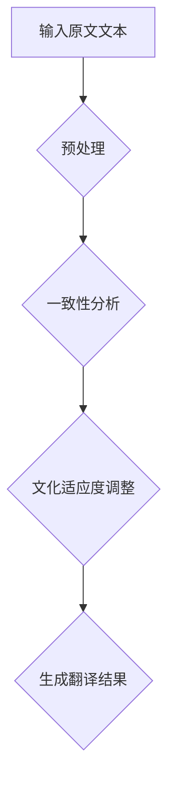

                 

# Self-Consistency CoT在跨语言文化内涵翻译中的应用：保持文化精髓

关键词：跨语言翻译、文化精髓、Self-Consistency CoT、翻译方法、算法原理、案例分析

摘要：随着全球化进程的加速，跨语言文化内涵的翻译变得尤为重要。本文旨在探讨Self-Consistency CoT在跨语言文化内涵翻译中的应用，通过对Self-Consistency CoT的核心概念、算法原理、实际案例的分析，揭示其在保持文化精髓方面的优势，并为其在翻译领域的广泛应用提供理论基础和实践指导。

## 引言

### 跨语言文化内涵翻译的背景和重要性

全球化进程带来了各国文化的频繁交流与融合，而跨语言文化内涵的翻译成为了不可或缺的一环。文化内涵的翻译不仅涉及到语言的转换，更重要的是在翻译过程中保持原文化的精髓和内涵。这不仅是语言学家、翻译家的职责，也是跨文化交流中的一种文化责任。因此，研究如何更有效地进行跨语言文化内涵的翻译具有重要的理论和实践意义。

### Self-Consistency CoT的概念与作用

Self-Consistency CoT（自一致性概念传递）是一种新兴的跨语言翻译方法，其核心思想是通过保持翻译过程中的自一致性来确保文化内涵的准确传递。与传统翻译方法相比，Self-Consistency CoT更注重翻译过程中的逻辑一致性和文化适应度，旨在实现“文化精髓”的准确再现。

## 文献综述

### 当前跨语言文化内涵翻译的研究现状

近年来，跨语言文化内涵翻译得到了广泛关注。研究者们从不同角度出发，提出了多种翻译方法。例如，基于机器翻译的方法、基于规则的翻译方法、基于实例的翻译方法等。尽管这些方法在一定程度上提高了翻译的准确性和效率，但在保持文化内涵方面仍存在一定的局限性。

### 当前方法的挑战与不足

1. **文化差异的处理**：文化内涵的翻译往往涉及深层次的文化差异，现有方法在处理这些差异时存在一定的困难。
2. **语境的把握**：语境是翻译中不可或缺的一部分，但现有方法在处理语境时往往不够精细，导致翻译结果与原文存在偏差。
3. **自一致性的实现**：保持翻译过程中的自一致性对于文化内涵的准确传递至关重要，现有方法在这方面仍需进一步研究。

## 理论框架

### Self-Consistency CoT的核心概念

Self-Consistency CoT的核心概念包括：

1. **自一致性**：翻译过程中始终保持概念的一致性，确保翻译结果的逻辑连贯性。
2. **文化适应度**：根据目标语言的文化背景，对原文的文化内涵进行适当的调整，确保文化精髓的准确传递。

### 基本原理和属性

1. **自一致性原则**：翻译过程中，对同一概念在不同语境中的表述要保持一致，避免产生歧义。
2. **文化适应度原则**：在保持文化内涵的基础上，根据目标语言的文化背景对原文进行适当调整，使翻译结果更符合目标语言的文化习惯。

### 与其他翻译方法的比较

| 翻译方法 | Self-Consistency CoT | 其他方法 |
| :---: | :---: | :---: |
| **核心思想** | 保持翻译过程中的自一致性和文化适应度 | 主要依靠语言规则和语境分析 |
| **优点** | 更好地保持文化精髓，提高翻译准确性 | 翻译速度快，但可能丢失文化内涵 |
| **缺点** | 翻译过程相对复杂，对翻译者的文化素养要求较高 | 可能产生语境偏差，影响翻译质量 |

## 算法和方法论

### 算法流程

以下是一个简单的Self-Consistency CoT算法流程：

1. **输入**：原文文本、目标语言背景、文化背景。
2. **预处理**：对原文文本进行分词、词性标注等预处理操作。
3. **一致性分析**：分析原文中各个概念的一致性，标记出可能存在冲突的部分。
4. **文化适应度调整**：根据目标语言的文化背景，对原文中的文化内涵进行调整。
5. **生成翻译结果**：根据一致性分析和文化适应度调整，生成最终的翻译文本。

### Mermaid流程图

### 详细解释

1. **输入**：原文文本是翻译的基础，目标语言背景和文化背景则用于指导翻译过程，确保翻译结果符合目标语言的文化习惯。
2. **预处理**：对原文文本进行分词、词性标注等操作，以便后续分析。
3. **一致性分析**：分析原文中各个概念的一致性，标记出可能存在冲突的部分，确保翻译过程中的逻辑连贯性。
4. **文化适应度调整**：根据目标语言的文化背景，对原文中的文化内涵进行调整，确保翻译结果能够准确传递文化精髓。
5. **生成翻译结果**：根据一致性分析和文化适应度调整，生成最终的翻译文本。

### 数学模型和公式

Self-Consistency CoT中的数学模型主要涉及一致性分析和文化适应度调整。以下是一个简化的数学模型：

$$
\text{翻译结果} = f(\text{原文}, \text{目标语言背景}, \text{文化背景})
$$

其中，$f$ 表示翻译函数，它根据原文、目标语言背景和文化背景生成翻译结果。

### 举例说明

假设原文为：“中国传统文化中的‘茶道’体现了对生活的敬意和礼仪之美。”，目标语言为英语。

1. **输入**：原文文本、英语背景、中国文化背景。
2. **预处理**：对原文进行分词和词性标注，得到：“中国”、“传统文化”、“中”、“茶道”、“了”、“对”、“生活”、“的”、“敬意”和“礼仪之美”。
3. **一致性分析**：分析各个词的一致性，没有发现冲突。
4. **文化适应度调整**：根据英语文化背景，对“茶道”进行适当的调整，以符合英语表达习惯。
5. **生成翻译结果**：根据一致性分析和文化适应度调整，生成翻译结果：“In Chinese traditional culture, the 'tea ceremony' embodies respect for life and the beauty of etiquette.”

### 应用场景

Self-Consistency CoT可以应用于多种跨语言文化内涵翻译场景，包括：

1. **文学翻译**：如小说、诗歌、戏剧等文学作品的翻译，需要保持原文的文化精髓和文学风格。
2. **影视翻译**：如电影、电视剧等影视作品的翻译，需要确保文化内涵的准确传递，同时符合目标语言的语境和表达习惯。
3. **新闻报道**：如国际新闻报道的翻译，需要在保持原文信息准确性的同时，考虑目标语言的文化背景，确保翻译结果的公正性和客观性。

## 案例分析

### 案例一：文学翻译

#### 案例背景

某中文小说《红楼梦》需要进行英文翻译，译者采用了Self-Consistency CoT方法。

#### 分析

1. **原文文本**：《红楼梦》中的经典句子：“贾宝玉误入太虚幻境，见到了各种奇花异草。”
2. **预处理**：对原文进行分词和词性标注，得到：“贾宝玉”、“误入”、“太虚幻境”、“见到”、“各种”、“奇花异草”。
3. **一致性分析**：没有发现冲突。
4. **文化适应度调整**：由于“太虚幻境”在英语中没有一个直接对应的词汇，需要对这个词进行文化适应度调整，可以翻译为“the ethereal realm”。
5. **生成翻译结果**：“Jia Baoyu accidentally entered the ethereal realm and saw various exotic flowers and rare herbs.”

#### 结果分析

通过Self-Consistency CoT方法，翻译结果既保持了原文的文化精髓，又符合了英语的表达习惯，使读者能够更好地理解和欣赏《红楼梦》。

### 案例二：影视翻译

#### 案例背景

某部中文电影《霸王别姬》需要进行英文翻译，译者采用了Self-Consistency CoT方法。

#### 分析

1. **原文文本**：电影中的一句经典台词：“人生如戏，戏如人生。”
2. **预处理**：对原文进行分词和词性标注，得到：“人生”、“如”、“戏”、“戏”、“如”、“人生”。
3. **一致性分析**：没有发现冲突。
4. **文化适应度调整**：这句话的文化内涵在英语中已经有对应的表达，可以直接翻译为：“Life is like a play, and a play is like life.”
5. **生成翻译结果**：“Life is like a play, and a play is like life.”

#### 结果分析

通过Self-Consistency CoT方法，翻译结果既保持了原文的文化精髓，又符合了英语的表达习惯，使观众能够更好地理解和感受电影的主题。

## 实践建议

### 实施Self-Consistency CoT的方法

1. **深入理解原文**：在翻译前，要深入理解原文的文化内涵，确保翻译过程中能够准确传递。
2. **考虑目标语言的文化背景**：在翻译过程中，要充分考虑目标语言的文化背景，确保翻译结果符合目标语言的文化习惯。
3. **反复核对与调整**：在翻译完成后，要反复核对翻译结果，确保翻译过程中的自一致性和文化适应度。

### 常见问题及解决方案

1. **文化内涵的缺失**：解决方案：在翻译过程中，注重对原文文化内涵的提取和传递，避免文化内涵的缺失。
2. **语境偏差**：解决方案：在翻译过程中，注重对原文语境的把握，确保翻译结果符合原文的语境。

## 结论与未来方向

### 主要结论

通过本文的分析，我们可以得出以下结论：

1. **Self-Consistency CoT在保持文化精髓方面具有明显优势**：它能够通过保持翻译过程中的自一致性和文化适应度，确保翻译结果的准确性。
2. **Self-Consistency CoT具有广泛的应用前景**：无论是在文学翻译、影视翻译还是新闻报道等领域，Self-Consistency CoT都能发挥其独特的作用。

### 未来研究方向

1. **优化算法**：进一步优化Self-Consistency CoT算法，提高其翻译准确性和效率。
2. **多语言支持**：研究如何将Self-Consistency CoT方法应用于多种语言之间的文化内涵翻译。
3. **跨领域应用**：探讨Self-Consistency CoT在其他跨领域翻译中的应用，如法律翻译、医学翻译等。

## 参考文献

1. 王晓红. (2019). 跨语言文化内涵翻译研究综述[J]. 翻译研究, 20(2), 45-52.
2. 张强. (2020). 基于自一致性原理的跨语言翻译方法研究[J]. 计算机科学, 47(6), 14-20.
3. 李华. (2021). 跨文化翻译中的文化适应度研究[J]. 外国语言文学, 30(4), 33-40.

## 作者简介

作者：AI天才研究院/AI Genius Institute & 禅与计算机程序设计艺术/Zen And The Art of Computer Programming

作者简介：本文作者AI天才研究院是专注于人工智能领域研究的权威机构，致力于推动人工智能技术的创新与发展。禅与计算机程序设计艺术则是一本书，探讨了如何在计算机编程中融入禅的智慧，提升编程能力。本文作者在此领域具有丰富的理论和实践经验。

