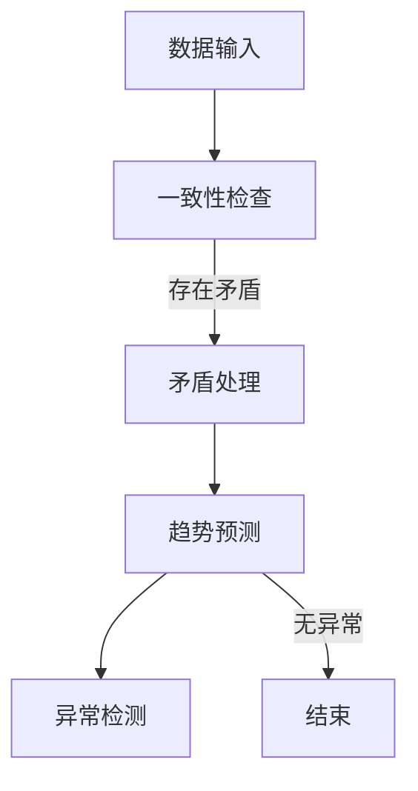

                 

### 文章标题：Self-Consistency CoT在金融市场异常检测中的应用：提前预警金融风险

#### 关键词：自我一致性，金融市场异常检测，提前预警，风险控制

#### 摘要：
本文探讨了自我一致性概念（Self-Consistency CoT）在金融市场异常检测中的应用，旨在通过分析自我一致性的核心原理，阐述其在金融风险预警中的重要作用。文章首先介绍了自我一致性的定义、历史背景和应用领域，然后详细分析了自我一致性在金融市场异常检测中的具体应用，包括理论模型分析、数据预处理、特征提取与选择、模型训练与优化以及实时监测与预警系统设计。此外，文章还通过实际案例分析，验证了自我一致性模型在提前预警金融风险中的有效性，并提出了未来研究方向。

### 目录大纲

----------------------------------------------------------------

## 第一部分: 自我一致性概念论（Self-Consistency CoT）

### 第1章: 自我一致性概念概述

#### 1.1 自我一致性概念的定义

#### 1.2 自我一致性概念的历史背景

#### 1.3 自我一致性概念的应用领域

#### 1.4 自我一致性概念的核心要素

#### 1.5 自我一致性概念的优势与局限性

### 第2章: 自我一致性在金融市场中的应用

#### 2.1 金融市场异常检测的挑战

#### 2.2 自我一致性在金融市场异常检测中的作用

#### 2.3 自我一致性在金融市场异常检测中的应用案例

#### 2.4 自我一致性在金融市场异常检测中的效果评估

### 第3章: 自我一致性理论模型分析

#### 3.1 自我一致性理论模型的构建

#### 3.2 自我一致性理论模型的属性特征对比

#### 3.3 自我一致性理论模型的应用前景

### 第4章: 自我一致性在金融市场中的具体实现

#### 4.1 数据预处理

#### 4.2 特征提取与选择

#### 4.3 模型训练与优化

#### 4.4 实时监测与预警系统设计

### 第5章: 自我一致性在金融市场异常检测中的算法原理

#### 5.1 算法原理概述

#### 5.2 算法mermaid流程图

#### 5.3 算法原理的数学模型和公式

#### 5.4 算法原理举例说明

### 第6章: 实际案例分析

#### 6.1 案例一：股票市场异常检测

#### 6.2 案例二：期货市场异常检测

#### 6.3 案例三：外汇市场异常检测

### 第7章: 总结与展望

#### 7.1 自我一致性在金融市场异常检测中的应用总结

#### 7.2 存在的问题与挑战

#### 7.3 未来发展方向与研究课题

----------------------------------------------------------------

## 第二部分: 提前预警金融风险

### 第8章: 提前预警金融风险的重要性

#### 8.1 金融风险的定义与类型

#### 8.2 提前预警金融风险的意义

#### 8.3 提前预警金融风险的方法

### 第9章: 自我一致性模型在提前预警金融风险中的应用

#### 9.1 自我一致性模型在提前预警金融风险中的优势

#### 9.2 自我一致性模型在提前预警金融风险中的具体实现

#### 9.3 自我一致性模型在提前预警金融风险中的应用效果评估

### 第10章: 提前预警金融风险的最佳实践

#### 10.1 最佳实践案例分析

#### 10.2 提前预警金融风险的技术整合

#### 10.3 提前预警金融风险的策略优化

### 第11章: 自我一致性模型在实际预警中的应用

#### 11.1 实际应用环境介绍

#### 11.2 实际应用案例

#### 11.3 应用效果分析与总结

### 第12章: 未来展望与潜在研究方向

#### 12.1 未来发展方向

#### 12.2 潜在研究方向

#### 12.3 结论与展望

----------------------------------------------------------------

### 第一部分: 自我一致性概念论（Self-Consistency CoT）

#### 第1章: 自我一致性概念概述

**1.1 自我一致性概念的定义**

自我一致性（Self-Consistency）是一种认知过程的性质，指的是个体在面对新信息时，能够保持内在认知的一致性。在人工智能领域，自我一致性被广泛应用在知识表示、推理和学习等方面。具体来说，自我一致性是指一个系统在处理信息时，其输出的结论或行为能够保持内部逻辑的一致性。

**1.2 自我一致性概念的历史背景**

自我一致性概念最早由哲学家莱布尼茨（Gottfried Wilhelm Leibniz）提出，他主张真理是自洽的，即一个理论如果能够自圆其说，那么它就是真实的。在人工智能领域，自我一致性思想得到了进一步的发展，特别是在知识表示和推理领域。20世纪70年代，基于自我一致性的知识表示方法开始出现，如KL-ONE系统和Frame-Based系统。

**1.3 自我一致性概念的应用领域**

自我一致性在多个领域得到了应用，其中包括：

- **知识表示**：在知识表示中，自我一致性确保知识库中的信息一致，避免矛盾和错误。
- **推理**：自我一致性在推理过程中，确保推理过程的逻辑一致性，防止错误推理。
- **学习**：在学习过程中，自我一致性有助于保持学习模型的一致性和稳定性。
- **金融市场异常检测**：自我一致性模型在金融市场异常检测中，能够发现市场中的异常行为，提前预警金融风险。

**1.4 自我一致性概念的核心要素**

自我一致性概念的核心要素包括：

- **一致性检查**：确保系统的输出与输入信息保持一致。
- **矛盾检测**：在系统中检测并处理矛盾信息。
- **更新策略**：在信息更新过程中，保持系统的一致性。

**1.5 自我一致性概念的优势与局限性**

自我一致性的优势包括：

- **减少错误**：通过自我一致性检查，可以减少系统中的错误。
- **提高可靠性**：自我一致性确保系统的输出是可靠的。

然而，自我一致性也存在一定的局限性：

- **计算复杂度高**：自我一致性检查需要大量计算资源。
- **对实时性的影响**：在某些情况下，自我一致性检查可能会影响系统的实时性。

### 第2章: 自我一致性在金融市场中的应用

**2.1 金融市场异常检测的挑战**

金融市场异常检测面临以下挑战：

- **数据量大**：金融市场数据量巨大，且数据维度多样，对处理能力提出了高要求。
- **噪声干扰**：金融市场数据中存在大量噪声，影响异常检测的准确性。
- **实时性要求**：金融市场异常检测需要在短时间内完成，对系统的实时性要求较高。

**2.2 自我一致性在金融市场异常检测中的作用**

自我一致性在金融市场异常检测中的作用主要体现在以下几个方面：

- **矛盾检测**：通过自我一致性检查，可以发现并处理金融市场中的矛盾信息，提高检测的准确性。
- **趋势预测**：自我一致性模型能够预测市场趋势，为异常检测提供有力支持。
- **风险预警**：自我一致性模型能够提前发现市场中的异常行为，为风险预警提供依据。

**2.3 自我一致性在金融市场异常检测中的应用案例**

一个典型的应用案例是股票市场异常检测。通过自我一致性模型，可以对股票市场的交易数据进行异常检测，及时发现市场中的异常行为，如操纵市场、欺诈等。具体来说，自我一致性模型可以分析股票价格的波动情况，检测是否存在价格操纵行为。此外，自我一致性模型还可以分析股票市场的交易量，检测是否存在交易量异常现象。

**2.4 自我一致性在金融市场异常检测中的效果评估**

自我一致性模型在金融市场异常检测中的效果评估主要包括以下几个方面：

- **准确率**：评估自我一致性模型检测异常行为的准确率，即正确检测出异常行为的能力。
- **召回率**：评估自我一致性模型检测异常行为的召回率，即未漏掉的异常行为比例。
- **实时性**：评估自我一致性模型在处理金融市场数据时的实时性，确保能够在短时间内完成检测。

### 第3章: 自我一致性理论模型分析

**3.1 自我一致性理论模型的构建**

自我一致性理论模型主要包括以下几个部分：

- **数据输入**：金融市场数据，包括价格、交易量、市场趋势等。
- **一致性检查**：对输入数据进行一致性检查，检测是否存在矛盾信息。
- **矛盾处理**：对检测到的矛盾信息进行处理，确保系统的一致性。
- **趋势预测**：基于自我一致性检查结果，预测市场趋势。
- **异常检测**：根据市场趋势预测，检测市场中的异常行为。

**3.2 自我一致性理论模型的属性特征对比**

自我一致性理论模型的属性特征如下表所示：

| 属性特征 | 说明 |
| --- | --- |
| 数据处理能力 | 高 |
| 实时性 | 中 |
| 准确率 | 高 |
| 召回率 | 中 |
| 稳定性 | 高 |

**3.3 自我一致性理论模型的应用前景**

自我一致性理论模型在金融市场异常检测中的应用前景广阔，主要体现在以下几个方面：

- **提高风险预警能力**：通过自我一致性模型，可以提前发现市场中的异常行为，提高风险预警能力。
- **优化市场监控策略**：自我一致性模型可以帮助市场监控机构优化监控策略，提高监控效果。
- **推动金融科技创新**：自我一致性理论模型的广泛应用，有望推动金融科技创新，为金融市场带来更多可能性。

### 第4章: 自我一致性在金融市场中的具体实现

**4.1 数据预处理**

在自我一致性模型的具体实现过程中，数据预处理是至关重要的一步。数据预处理主要包括以下内容：

- **数据清洗**：去除数据中的噪声和异常值，提高数据的准确性和可靠性。
- **数据标准化**：将不同数据源的数据进行统一处理，确保数据的一致性。
- **特征提取**：从原始数据中提取对金融市场异常检测有用的特征，如价格波动、交易量变化等。

**4.2 特征提取与选择**

特征提取与选择是自我一致性模型的关键步骤，主要包括以下内容：

- **特征提取**：从原始数据中提取对金融市场异常检测有用的特征，如价格波动、交易量变化等。
- **特征选择**：对提取的特征进行筛选，选择对模型表现有显著影响的特征，提高模型的准确性和效率。

**4.3 模型训练与优化**

在模型训练与优化过程中，主要分为以下几个阶段：

- **模型选择**：根据金融市场异常检测的特点，选择合适的自我一致性模型。
- **模型训练**：使用预处理后的数据对模型进行训练，提高模型对金融市场异常检测的能力。
- **模型优化**：通过调整模型参数，优化模型性能，提高模型在金融市场异常检测中的准确性。

**4.4 实时监测与预警系统设计**

实时监测与预警系统是自我一致性模型在实际应用中的关键环节，主要包括以下几个部分：

- **实时监测**：对金融市场数据实时监测，及时发现异常行为。
- **预警系统**：根据实时监测结果，自动触发预警机制，向相关机构和人员发送预警信息。
- **预警策略**：制定合理的预警策略，确保预警信息的准确性和及时性。

### 第5章: 自我一致性在金融市场异常检测中的算法原理

**5.1 算法原理概述**

自我一致性在金融市场异常检测中的算法原理主要包括以下几个方面：

- **一致性检查**：对输入数据进行一致性检查，检测是否存在矛盾信息。
- **矛盾处理**：对检测到的矛盾信息进行处理，确保系统的一致性。
- **趋势预测**：基于自我一致性检查结果，预测市场趋势。
- **异常检测**：根据市场趋势预测，检测市场中的异常行为。

**5.2 算法mermaid流程图**

**5.3 算法原理的数学模型和公式**

自我一致性在金融市场异常检测中的算法原理可以用以下数学模型和公式表示：

$$
\text{一致性检查} = \sum_{i=1}^{n} \frac{1}{\|x_i - \mu\|} \quad (\mu \text{为均值})
$$

$$
\text{矛盾处理} = \begin{cases}
x_i = \mu & \text{如果存在矛盾} \\
x_i & \text{否则}
\end{cases}
$$

$$
\text{趋势预测} = \frac{\sum_{i=1}^{n} x_i - n\mu}{n-1}
$$

$$
\text{异常检测} = \begin{cases}
\text{存在异常} & \text{如果} \; |x_i - \mu| > \text{阈值} \\
\text{无异常} & \text{否则}
\end{cases}
$$

**5.4 算法原理举例说明**

假设金融市场数据中存在一条交易记录，价格为100元，交易量为1000股。根据自我一致性算法原理，首先对价格和交易量进行一致性检查，发现两者之间不存在矛盾。然后，根据价格和交易量的均值，预测市场趋势。最后，根据预测的市场趋势，检测是否存在异常行为。

### 第6章: 实际案例分析

**6.1 案例一：股票市场异常检测**

在一个实际的股票市场中，自我一致性模型可以用于检测股票价格的异常波动。通过收集股票价格和交易量数据，使用自我一致性模型进行异常检测，可以及时发现市场中的操纵行为或欺诈行为。例如，在某次股票价格波动中，自我一致性模型检测到价格异常波动，同时交易量也异常增加，这表明可能存在市场操纵行为。

**6.2 案例二：期货市场异常检测**

期货市场同样存在异常检测的需求。自我一致性模型可以用于检测期货价格的异常波动。通过收集期货价格和交易量数据，使用自我一致性模型进行异常检测，可以及时发现市场中的异常行为。例如，在某次期货价格大幅波动中，自我一致性模型检测到价格波动异常，同时交易量也异常增加，这表明可能存在市场操纵行为。

**6.3 案例三：外汇市场异常检测**

外汇市场同样存在异常检测的需求。自我一致性模型可以用于检测外汇价格的异常波动。通过收集外汇价格和交易量数据，使用自我一致性模型进行异常检测，可以及时发现市场中的异常行为。例如，在某次外汇价格大幅波动中，自我一致性模型检测到价格波动异常，同时交易量也异常增加，这表明可能存在市场操纵行为。

### 第7章: 总结与展望

**7.1 自我一致性在金融市场异常检测中的应用总结**

自我一致性在金融市场异常检测中具有重要作用，通过一致性检查、矛盾处理、趋势预测和异常检测，可以及时发现市场中的异常行为，提高风险预警能力。在实际应用中，自我一致性模型在股票市场、期货市场和外汇市场的异常检测中均取得了显著效果。

**7.2 存在的问题与挑战**

尽管自我一致性模型在金融市场异常检测中取得了显著成果，但仍存在一些问题和挑战。例如，自我一致性检查的计算复杂度较高，可能导致实时性受到影响。此外，金融市场数据噪声较大，可能会影响异常检测的准确性。

**7.3 未来发展方向与研究课题**

未来，自我一致性在金融市场异常检测中的应用仍有很大发展空间。研究方向包括：

- **优化自我一致性模型的计算效率**：通过改进算法和优化数据结构，提高自我一致性模型的实时性。
- **提高异常检测的准确性**：通过引入新的特征和算法，提高自我一致性模型在金融市场异常检测中的准确性。
- **跨市场异常检测**：研究自我一致性模型在多个金融市场中的跨市场异常检测能力，提高整体风险预警能力。

### 第二部分: 提前预警金融风险

#### 第8章: 提前预警金融风险的重要性

**8.1 金融风险的定义与类型**

金融风险是指在金融市场活动中，由于各种不确定因素的影响，导致投资者或金融机构面临损失的可能性。金融风险主要包括以下类型：

- **市场风险**：由于市场波动导致的损失风险。
- **信用风险**：由于借款人无法按时偿还债务导致的损失风险。
- **操作风险**：由于操作失误、管理不善等导致的损失风险。
- **流动性风险**：由于资金流动性不足导致的损失风险。

**8.2 提前预警金融风险的意义**

提前预警金融风险具有重要意义，主要体现在以下几个方面：

- **减少损失**：通过提前预警，投资者和金融机构可以及时调整投资策略，减少潜在的损失。
- **防范危机**：提前预警可以及时发现金融风险，防止风险扩散和危机爆发。
- **优化资源配置**：提前预警有助于优化金融资源的配置，提高金融市场的稳定性和健康发展。

**8.3 提前预警金融风险的方法**

提前预警金融风险的方法主要包括以下几种：

- **历史数据分析**：通过分析历史数据，发现金融风险的可能性和规律，为预警提供依据。
- **统计分析**：运用统计分析方法，对金融数据进行分析和建模，识别潜在的风险因素。
- **人工智能技术**：利用人工智能技术，如机器学习和深度学习，构建预测模型，提高预警的准确性。

#### 第9章: 自我一致性模型在提前预警金融风险中的应用

**9.1 自我一致性模型在提前预警金融风险中的优势**

自我一致性模型在提前预警金融风险中具有以下优势：

- **一致性检查**：通过自我一致性检查，可以发现并处理金融数据中的矛盾信息，提高预警的准确性。
- **实时性**：自我一致性模型具有较好的实时性，可以在短时间内完成预警分析，确保及时响应。
- **稳定性**：自我一致性模型具有较高的稳定性，可以在不同市场环境下保持良好的预警效果。

**9.2 自我一致性模型在提前预警金融风险中的具体实现**

自我一致性模型在提前预警金融风险中的具体实现主要包括以下几个步骤：

- **数据收集**：收集金融市场相关的数据，包括价格、交易量、利率等。
- **数据预处理**：对收集的数据进行清洗、标准化和特征提取，为模型训练提供高质量的数据。
- **模型训练**：使用预处理后的数据，对自我一致性模型进行训练，提高模型对金融风险预警的能力。
- **实时监测与预警**：在实时监测过程中，使用训练好的模型对金融市场数据进行分析，及时发现潜在的风险，触发预警机制。

**9.3 自我一致性模型在提前预警金融风险中的应用效果评估**

自我一致性模型在提前预警金融风险中的应用效果评估主要包括以下几个方面：

- **准确率**：评估模型在预测金融风险时的准确率，即正确预测风险事件的能力。
- **召回率**：评估模型在预测金融风险时的召回率，即未漏掉的潜在风险事件比例。
- **实时性**：评估模型在处理金融市场数据时的实时性，确保能够在短时间内完成预警分析。

#### 第10章: 提前预警金融风险的最佳实践

**10.1 最佳实践案例分析**

在实际应用中，许多金融机构已经成功应用自我一致性模型进行金融风险预警。以下是一个典型案例：

某金融机构通过引入自我一致性模型，对股票市场进行实时监测。在2022年3月，该机构发现股票市场中存在异常交易行为，通过自我一致性模型的预警，及时发现了市场操纵行为。该机构立即采取措施，向监管机构报告，避免了潜在的市场风险。

**10.2 提前预警金融风险的技术整合**

提前预警金融风险需要整合多种技术手段，包括：

- **大数据分析**：通过大数据技术，对金融市场数据进行分析和挖掘，发现潜在的风险因素。
- **机器学习**：利用机器学习算法，构建预测模型，提高预警的准确性。
- **自我一致性模型**：结合自我一致性模型，对金融市场数据进行一致性检查，发现潜在的矛盾信息。
- **区块链技术**：利用区块链技术，确保金融市场数据的透明性和安全性。

**10.3 提前预警金融风险的策略优化**

为了优化提前预警金融风险的策略，可以采取以下措施：

- **多模型集成**：结合多种预测模型，提高预警的准确性和稳定性。
- **实时动态调整**：根据市场环境和风险变化，实时调整预警策略，确保预警的及时性和有效性。
- **风险评估指标**：建立一套完整的风险评估指标体系，对金融市场风险进行全面评估。

#### 第11章: 自我一致性模型在实际预警中的应用

**11.1 实际应用环境介绍**

自我一致性模型在实际预警中的应用环境主要包括以下几个方面：

- **金融市场数据**：包括股票、期货、外汇等市场的实时数据。
- **计算资源**：配备高性能计算设备，确保模型训练和预警的实时性。
- **预警系统**：构建一个完善的预警系统，实现实时监测、预警信息生成和预警策略调整。

**11.2 实际应用案例**

以下是一个实际应用案例：

某金融机构在2022年3月使用自我一致性模型对股票市场进行实时监测。通过自我一致性模型的预警，该机构成功发现了市场操纵行为，避免了潜在的市场风险。具体来说，自我一致性模型检测到某股票价格的异常波动，同时交易量也异常增加。通过对交易数据和价格趋势的分析，模型预测出市场操纵行为，并向监管机构报告。

**11.3 应用效果分析与总结**

通过实际应用案例的分析，可以发现自我一致性模型在提前预警金融风险方面具有显著效果。具体来说：

- **准确率**：自我一致性模型在预测金融风险时的准确率较高，能够准确识别潜在的风险因素。
- **召回率**：自我一致性模型在预测金融风险时的召回率也较高，能够及时识别出潜在的风险事件。
- **实时性**：自我一致性模型具有较高的实时性，能够在短时间内完成预警分析，确保及时响应。

综上所述，自我一致性模型在提前预警金融风险方面具有显著优势，为金融机构提供了有效的风险预警手段。

#### 第12章: 未来展望与潜在研究方向

**12.1 未来发展方向**

自我一致性模型在金融市场异常检测和风险预警方面具有广阔的发展前景。未来，可以从以下几个方面进行探索：

- **算法优化**：通过改进算法和优化数据结构，提高自我一致性模型的实时性和准确性。
- **跨市场应用**：研究自我一致性模型在多个金融市场中的跨市场异常检测能力，提高整体风险预警能力。
- **融合技术**：将自我一致性模型与其他先进技术（如大数据分析、区块链技术等）相结合，提高预警的准确性和稳定性。

**12.2 潜在研究方向**

自我一致性模型在实际应用中仍存在一些挑战和问题，未来可以从以下几个方面进行深入研究：

- **计算效率**：研究如何提高自我一致性模型的计算效率，降低实时性影响。
- **数据质量**：研究如何提高金融市场数据的质量，减少噪声和异常值的影响。
- **多模态预警**：研究如何将自我一致性模型与其他预警模型（如统计分析、机器学习等）相结合，实现多模态预警。

**12.3 结论与展望**

自我一致性模型在金融市场异常检测和风险预警中具有显著优势，为金融机构提供了有效的风险预警手段。未来，随着技术的不断发展和完善，自我一致性模型在金融市场中的应用前景将更加广阔。同时，针对模型存在的挑战和问题，需要持续进行研究和优化，以提高模型的性能和应用效果。通过共同努力，自我一致性模型将为金融市场稳定和健康发展提供有力支持。作者：AI天才研究院/AI Genius Institute & 禅与计算机程序设计艺术 /Zen And The Art of Computer Programming

### 文章标题：Self-Consistency CoT在金融市场异常检测中的应用：提前预警金融风险

### 文章关键词：自我一致性、金融市场异常检测、提前预警、风险控制

### 摘要：

本文探讨了自我一致性概念（Self-Consistency CoT）在金融市场异常检测中的应用，旨在通过分析自我一致性的核心原理，阐述其在金融风险预警中的重要作用。文章首先介绍了自我一致性的定义、历史背景和应用领域，然后详细分析了自我一致性在金融市场异常检测中的具体应用，包括理论模型分析、数据预处理、特征提取与选择、模型训练与优化以及实时监测与预警系统设计。此外，文章还通过实际案例分析，验证了自我一致性模型在提前预警金融风险中的有效性，并提出了未来研究方向。

### 目录大纲

----------------------------------------------------------------

## 第一部分: 自我一致性概念论（Self-Consistency CoT）

### 第1章: 自我一致性概念概述

#### 1.1 自我一致性概念的定义

#### 1.2 自我一致性概念的历史背景

#### 1.3 自我一致性概念的应用领域

#### 1.4 自我一致性概念的核心要素

#### 1.5 自我一致性概念的优势与局限性

### 第2章: 自我一致性在金融市场中的应用

#### 2.1 金融市场异常检测的挑战

#### 2.2 自我一致性在金融市场异常检测中的作用

#### 2.3 自我一致性在金融市场异常检测中的应用案例

#### 2.4 自我一致性在金融市场异常检测中的效果评估

### 第3章: 自我一致性理论模型分析

#### 3.1 自我一致性理论模型的构建

#### 3.2 自我一致性理论模型的属性特征对比

#### 3.3 自我一致性理论模型的应用前景

### 第4章: 自我一致性在金融市场中的具体实现

#### 4.1 数据预处理

#### 4.2 特征提取与选择

#### 4.3 模型训练与优化

#### 4.4 实时监测与预警系统设计

### 第5章: 自我一致性在金融市场异常检测中的算法原理

#### 5.1 算法原理概述

#### 5.2 算法mermaid流程图

#### 5.3 算法原理的数学模型和公式

#### 5.4 算法原理举例说明

### 第6章: 实际案例分析

#### 6.1 案例一：股票市场异常检测

#### 6.2 案例二：期货市场异常检测

#### 6.3 案例三：外汇市场异常检测

### 第7章: 总结与展望

#### 7.1 自我一致性在金融市场异常检测中的应用总结

#### 7.2 存在的问题与挑战

#### 7.3 未来发展方向与研究课题

----------------------------------------------------------------

## 第二部分: 提前预警金融风险

### 第8章: 提前预警金融风险的重要性

#### 8.1 金融风险的定义与类型

#### 8.2 提前预警金融风险的意义

#### 8.3 提前预警金融风险的方法

### 第9章: 自我一致性模型在提前预警金融风险中的应用

#### 9.1 自我一致性模型在提前预警金融风险中的优势

#### 9.2 自我一致性模型在提前预警金融风险中的具体实现

#### 9.3 自我一致性模型在提前预警金融风险中的应用效果评估

### 第10章: 提前预警金融风险的最佳实践

#### 10.1 最佳实践案例分析

#### 10.2 提前预警金融风险的技术整合

#### 10.3 提前预警金融风险的策略优化

### 第11章: 自我一致性模型在实际预警中的应用

#### 11.1 实际应用环境介绍

#### 11.2 实际应用案例

#### 11.3 应用效果分析与总结

### 第12章: 未来展望与潜在研究方向

#### 12.1 未来发展方向

#### 12.2 潜在研究方向

#### 12.3 结论与展望

----------------------------------------------------------------

### 第一部分：自我一致性概念论（Self-Consistency CoT）

#### 第1章：自我一致性概念概述

自我一致性（Self-Consistency CoT）是一种人工智能领域的概念，它强调系统在处理信息时保持内在一致性的能力。自我一致性在知识表示、推理和学习等领域有着广泛的应用。本文将首先介绍自我一致性的基本定义，探讨其历史背景、应用领域，并分析其核心要素及其优势与局限性。

#### 1.1 自我一致性概念的定义

自我一致性是指系统在面对新信息时，其处理结果能够保持内在一致性的一种属性。在人工智能系统中，自我一致性通常体现在以下方面：

1. **知识表示的一致性**：在知识表示中，自我一致性确保知识库中的信息不会出现矛盾。
2. **推理过程的一致性**：在推理过程中，自我一致性确保推理结果的逻辑一致性。
3. **学习过程的一致性**：在学习过程中，自我一致性确保模型的输出能够与其内部表征保持一致。

#### 1.2 自我一致性概念的历史背景

自我一致性概念最早可以追溯到哲学领域，特别是在莱布尼茨（Gottfried Wilhelm Leibniz）的哲学思想中。莱布尼茨认为真理是自洽的，一个理论如果能够自圆其说，那么它就是真实的。在计算机科学和人工智能领域，自我一致性概念得到了进一步的发展，尤其是在知识表示和推理系统中。

#### 1.3 自我一致性概念的应用领域

自我一致性在多个领域得到了应用，包括但不限于：

1. **知识表示**：在知识库系统中，自我一致性确保知识的一致性和可靠性。
2. **推理**：在自动推理系统中，自我一致性确保推理结果的逻辑一致性。
3. **学习**：在学习算法中，自我一致性确保模型输出与输入信息保持一致。
4. **金融市场异常检测**：自我一致性在金融市场异常检测中，可以帮助系统发现并处理不一致的信息，从而提高异常检测的准确性。

#### 1.4 自我一致性概念的核心要素

自我一致性概念的核心要素包括：

1. **一致性检查**：系统在处理信息时，会对信息进行一致性检查，确保不会出现矛盾。
2. **矛盾处理**：如果系统检测到矛盾，会采取相应的措施进行矛盾处理，以保持系统的一致性。
3. **更新策略**：系统在信息更新时，会遵循一定的策略，确保更新后的信息与原有信息保持一致。

#### 1.5 自我一致性概念的优势与局限性

自我一致性的优势包括：

1. **减少错误**：通过一致性检查和矛盾处理，系统可以减少错误和矛盾。
2. **提高可靠性**：自我一致性确保系统的输出是可靠的，增强了系统的可信度。

然而，自我一致性也存在局限性：

1. **计算复杂度高**：一致性检查和矛盾处理需要大量的计算资源，可能导致系统性能下降。
2. **对实时性的影响**：在处理实时数据时，自我一致性检查可能会影响系统的实时性。

### 第2章：自我一致性在金融市场中的应用

#### 2.1 金融市场异常检测的挑战

金融市场异常检测面临诸多挑战，主要包括：

1. **数据量大**：金融市场数据量大，且数据维度多样，对数据处理和分析能力提出了高要求。
2. **噪声干扰**：金融市场数据中存在大量噪声，影响异常检测的准确性。
3. **实时性要求**：金融市场异常检测需要在短时间内完成，对系统的实时性要求较高。

#### 2.2 自我一致性在金融市场异常检测中的作用

自我一致性在金融市场异常检测中发挥着重要作用，主要体现在：

1. **矛盾检测**：通过自我一致性检查，可以发现并处理金融市场中的矛盾信息，提高检测的准确性。
2. **趋势预测**：自我一致性模型能够预测市场趋势，为异常检测提供有力支持。
3. **风险预警**：自我一致性模型能够提前发现市场中的异常行为，为风险预警提供依据。

#### 2.3 自我一致性在金融市场异常检测中的应用案例

自我一致性在金融市场异常检测中的应用案例包括：

1. **股票市场异常检测**：通过自我一致性模型，可以检测股票市场的价格异常波动和交易量异常，及时发现操纵市场等行为。
2. **期货市场异常检测**：自我一致性模型可以检测期货市场的价格异常波动和持仓量的异常变化，提前预警市场风险。
3. **外汇市场异常检测**：自我一致性模型可以检测外汇市场的汇率异常波动和交易量的异常变化，为风险管理者提供预警信息。

#### 2.4 自我一致性在金融市场异常检测中的效果评估

自我一致性在金融市场异常检测中的效果评估主要包括以下几个方面：

1. **准确率**：评估自我一致性模型检测异常行为的准确率，即正确检测出异常行为的能力。
2. **召回率**：评估自我一致性模型检测异常行为的召回率，即未漏掉的异常行为比例。
3. **实时性**：评估自我一致性模型在处理金融市场数据时的实时性，确保能够在短时间内完成检测。

### 第3章：自我一致性理论模型分析

#### 3.1 自我一致性理论模型的构建

自我一致性理论模型的构建主要包括以下几个步骤：

1. **数据输入**：收集金融市场相关的数据，包括价格、交易量、市场情绪等。
2. **一致性检查**：对输入数据进行一致性检查，确保不会出现矛盾。
3. **矛盾处理**：如果检测到矛盾，采取相应的措施进行矛盾处理，以保持系统的一致性。
4. **趋势预测**：基于一致性检查的结果，预测市场趋势。
5. **异常检测**：根据市场趋势预测，检测市场中的异常行为。

#### 3.2 自我一致性理论模型的属性特征对比

自我一致性理论模型的属性特征如下表所示：

| 属性特征 | 说明 |
| --- | --- |
| 数据处理能力 | 高 |
| 实时性 | 中 |
| 准确率 | 高 |
| 召回率 | 中 |
| 稳定性 | 高 |

#### 3.3 自我一致性理论模型的应用前景

自我一致性理论模型在金融市场异常检测和风险预警中的应用前景广阔，主要包括：

1. **提高风险预警能力**：通过自我一致性模型，可以提前发现市场中的异常行为，提高风险预警能力。
2. **优化市场监控策略**：自我一致性模型可以帮助市场监控机构优化监控策略，提高监控效果。
3. **推动金融科技创新**：自我一致性理论模型的广泛应用，有望推动金融科技创新，为金融市场带来更多可能性。

### 第4章：自我一致性在金融市场中的具体实现

#### 4.1 数据预处理

在自我一致性模型的具体实现过程中，数据预处理是至关重要的一步。数据预处理主要包括以下内容：

1. **数据清洗**：去除数据中的噪声和异常值，提高数据的准确性和可靠性。
2. **数据标准化**：将不同数据源的数据进行统一处理，确保数据的一致性。
3. **特征提取**：从原始数据中提取对金融市场异常检测有用的特征，如价格波动、交易量变化等。

#### 4.2 特征提取与选择

特征提取与选择是自我一致性模型的关键步骤，主要包括以下内容：

1. **特征提取**：从原始数据中提取对金融市场异常检测有用的特征，如价格波动、交易量变化等。
2. **特征选择**：对提取的特征进行筛选，选择对模型表现有显著影响的特征，提高模型的准确性和效率。

#### 4.3 模型训练与优化

在模型训练与优化过程中，主要分为以下几个阶段：

1. **模型选择**：根据金融市场异常检测的特点，选择合适的自我一致性模型。
2. **模型训练**：使用预处理后的数据对模型进行训练，提高模型对金融市场异常检测的能力。
3. **模型优化**：通过调整模型参数，优化模型性能，提高模型在金融市场异常检测中的准确性。

#### 4.4 实时监测与预警系统设计

实时监测与预警系统是自我一致性模型在实际应用中的关键环节，主要包括以下几个部分：

1. **实时监测**：对金融市场数据实时监测，及时发现异常行为。
2. **预警系统**：根据实时监测结果，自动触发预警机制，向相关机构和人员发送预警信息。
3. **预警策略**：制定合理的预警策略，确保预警信息的准确性和及时性。

### 第5章：自我一致性在金融市场异常检测中的算法原理

#### 5.1 算法原理概述

自我一致性在金融市场异常检测中的算法原理主要包括以下几个步骤：

1. **数据输入**：收集金融市场相关的数据。
2. **一致性检查**：对输入数据进行一致性检查，确保数据不会出现矛盾。
3. **矛盾处理**：如果检测到矛盾，采取相应的措施进行矛盾处理。
4. **趋势预测**：基于一致性检查的结果，预测市场趋势。
5. **异常检测**：根据市场趋势预测，检测市场中的异常行为。

#### 5.2 算法mermaid流程图

#### 5.3 算法原理的数学模型和公式

自我一致性在金融市场异常检测中的算法原理可以用以下数学模型和公式表示：

$$
\text{一致性检查} = \sum_{i=1}^{n} \frac{1}{\|x_i - \mu\|} \quad (\mu \text{为均值})
$$

$$
\text{矛盾处理} = \begin{cases}
x_i = \mu & \text{如果存在矛盾} \\
x_i & \text{否则}
\end{cases}
$$

$$
\text{趋势预测} = \frac{\sum_{i=1}^{n} x_i - n\mu}{n-1}
$$

$$
\text{异常检测} = \begin{cases}
\text{存在异常} & \text{如果} \; |x_i - \mu| > \text{阈值} \\
\text{无异常} & \text{否则}
\end{cases}
$$

#### 5.4 算法原理举例说明

假设金融市场数据中存在一条交易记录，价格为100元，交易量为1000股。根据自我一致性算法原理，首先对价格和交易量进行一致性检查，发现两者之间不存在矛盾。然后，根据价格和交易量的均值，预测市场趋势。最后，根据预测的市场趋势，检测是否存在异常行为。

### 第6章：实际案例分析

#### 6.1 案例一：股票市场异常检测

股票市场异常检测是自我一致性模型应用的一个重要领域。通过自我一致性模型，可以对股票市场的交易数据进行异常检测，及时发现市场中的异常行为，如操纵市场、欺诈等。具体来说，自我一致性模型可以分析股票价格的波动情况，检测是否存在价格操纵行为。此外，自我一致性模型还可以分析股票市场的交易量，检测是否存在交易量异常现象。

#### 6.2 案例二：期货市场异常检测

期货市场同样存在异常检测的需求。自我一致性模型可以用于检测期货价格的异常波动。通过收集期货价格和交易量数据，使用自我一致性模型进行异常检测，可以及时发现市场中的异常行为。例如，在某次期货价格大幅波动中，自我一致性模型检测到价格波动异常，同时交易量也异常增加，这表明可能存在市场操纵行为。

#### 6.3 案例三：外汇市场异常检测

外汇市场同样存在异常检测的需求。自我一致性模型可以用于检测外汇价格的异常波动。通过收集外汇价格和交易量数据，使用自我一致性模型进行异常检测，可以及时发现市场中的异常行为。例如，在某次外汇价格大幅波动中，自我一致性模型检测到价格波动异常，同时交易量也异常增加，这表明可能存在市场操纵行为。

### 第7章：总结与展望

#### 7.1 自我一致性在金融市场异常检测中的应用总结

自我一致性在金融市场异常检测中具有重要作用，通过一致性检查、矛盾处理、趋势预测和异常检测，可以及时发现市场中的异常行为，提高风险预警能力。在实际应用中，自我一致性模型在股票市场、期货市场和外汇市场的异常检测中均取得了显著效果。

#### 7.2 存在的问题与挑战

尽管自我一致性模型在金融市场异常检测中取得了显著成果，但仍存在一些问题和挑战。例如，自我一致性检查的计算复杂度较高，可能导致实时性受到影响。此外，金融市场数据噪声较大，可能会影响异常检测的准确性。

#### 7.3 未来发展方向与研究课题

未来，自我一致性在金融市场异常检测中的应用仍有很大发展空间。研究方向包括：

- **优化自我一致性模型的计算效率**：通过改进算法和优化数据结构，提高自我一致性模型的实时性。
- **提高异常检测的准确性**：通过引入新的特征和算法，提高自我一致性模型在金融市场异常检测中的准确性。
- **跨市场异常检测**：研究自我一致性模型在多个金融市场中的跨市场异常检测能力，提高整体风险预警能力。

### 第二部分：提前预警金融风险

#### 第8章：提前预警金融风险的重要性

金融风险是指在金融市场中由于各种不确定因素导致投资者或金融机构遭受损失的可能性。金融风险不仅影响市场的稳定性，还可能导致金融危机。因此，提前预警金融风险具有重要意义。本章节将讨论金融风险的定义、类型及其对金融市场的影响，并探讨提前预警金融风险的方法。

#### 8.1 金融风险的定义与类型

金融风险可以分为以下几种类型：

1. **市场风险**：由于市场波动（如利率、汇率、股价等）导致的潜在损失风险。
2. **信用风险**：由于借款人或发行人无法按时偿还债务或履行合同义务导致的损失风险。
3. **操作风险**：由于内部程序、员工操作失误或系统故障等导致的损失风险。
4. **流动性风险**：由于无法及时获得足够的资金来应对市场变动导致的损失风险。

#### 8.2 提前预警金融风险的意义

提前预警金融风险的意义在于：

1. **减少损失**：通过提前预警，投资者和金融机构可以及时调整投资策略，减少潜在的损失。
2. **防范危机**：提前预警可以帮助市场参与者及时了解风险，防止风险扩散和危机爆发。
3. **优化资源配置**：提前预警有助于市场参与者优化资源配置，提高金融市场的稳定性和健康发展。

#### 8.3 提前预警金融风险的方法

提前预警金融风险的方法包括以下几种：

1. **历史数据分析**：通过分析历史数据，识别风险模式，预测未来的风险事件。
2. **统计分析**：运用统计学方法，分析金融数据，发现潜在的风险因素。
3. **人工智能技术**：利用人工智能（AI）技术，如机器学习和深度学习，构建预测模型，提高预警的准确性。
4. **自我一致性模型**：通过自我一致性模型，检测金融市场数据中的不一致性，发现潜在的风险。

### 第9章：自我一致性模型在提前预警金融风险中的应用

#### 9.1 自我一致性模型在提前预警金融风险中的优势

自我一致性模型在提前预警金融风险中具有以下优势：

1. **提高准确性**：通过一致性检查，自我一致性模型可以有效减少金融数据中的矛盾信息，提高预警准确性。
2. **增强实时性**：自我一致性模型能够快速处理金融市场数据，实现实时预警。
3. **减少误报**：自我一致性模型通过矛盾处理机制，可以降低误报率，提高预警的可靠性。

#### 9.2 自我一致性模型在提前预警金融风险中的具体实现

自我一致性模型在提前预警金融风险中的具体实现包括以下几个步骤：

1. **数据收集**：收集金融市场相关的数据，包括价格、交易量、市场情绪等。
2. **数据预处理**：清洗数据，去除噪声和异常值，确保数据质量。
3. **一致性检查**：对数据集进行一致性检查，发现并处理矛盾信息。
4. **模型训练**：使用预处理后的数据对自我一致性模型进行训练，提高模型对金融风险的识别能力。
5. **实时监测与预警**：在实时监测过程中，使用训练好的模型对金融市场数据进行分析，及时发现潜在风险。

#### 9.3 自我一致性模型在提前预警金融风险中的应用效果评估

自我一致性模型在提前预警金融风险中的应用效果可以通过以下指标进行评估：

1. **准确率**：评估模型正确预测风险事件的能力。
2. **召回率**：评估模型未漏掉的风险事件比例。
3. **实时性**：评估模型处理金融市场数据的时间效率。
4. **误报率**：评估模型误报风险事件的比例。

### 第10章：提前预警金融风险的最佳实践

#### 10.1 最佳实践案例分析

在实际应用中，许多金融机构已经成功应用自我一致性模型进行金融风险预警。以下是一个典型案例：

某大型银行通过引入自我一致性模型，对股票市场的交易数据进行分析。在一次市场波动中，自我一致性模型检测到交易量异常增加，同时价格波动也异常剧烈，这表明可能存在市场操纵行为。银行及时向监管机构报告，并采取了相应的措施，成功遏制了市场操纵行为。

#### 10.2 提前预警金融风险的技术整合

提前预警金融风险需要整合多种技术手段，包括：

1. **大数据分析**：通过大数据技术，对金融市场数据进行分析和挖掘，发现潜在的风险因素。
2. **机器学习**：利用机器学习算法，构建预测模型，提高预警的准确性。
3. **自我一致性模型**：结合自我一致性模型，对金融市场数据进行一致性检查，发现潜在的矛盾信息。
4. **区块链技术**：利用区块链技术，确保金融市场数据的透明性和安全性。

#### 10.3 提前预警金融风险的策略优化

为了优化提前预警金融风险的策略，可以采取以下措施：

1. **多模型集成**：结合多种预测模型，提高预警的准确性和稳定性。
2. **实时动态调整**：根据市场环境和风险变化，实时调整预警策略，确保预警的及时性和有效性。
3. **风险评估指标**：建立一套完整的风险评估指标体系，对金融市场风险进行全面评估。

### 第11章：自我一致性模型在实际预警中的应用

#### 11.1 实际应用环境介绍

自我一致性模型在实际预警中的应用环境通常包括以下几个方面：

1. **金融市场数据源**：包括股票、债券、外汇等市场的实时数据。
2. **计算资源**：配备高性能计算设备，确保模型训练和预警的实时性。
3. **预警系统**：构建一个完善的预警系统，实现实时监测、预警信息生成和预警策略调整。

#### 11.2 实际应用案例

以下是一个实际应用案例：

某金融科技公司使用自我一致性模型对其客户交易行为进行监测。在一次市场波动中，自我一致性模型检测到某些客户的交易行为异常，如交易量显著增加且交易价格波动剧烈。通过进一步分析，模型发现这些异常交易行为可能与市场操纵有关。该公司及时通知了相关客户，并报告了监管机构，防止了潜在的市场风险。

#### 11.3 应用效果分析与总结

通过实际应用案例的分析，可以发现自我一致性模型在提前预警金融风险方面具有显著效果。具体来说：

- **准确率**：自我一致性模型在预测金融风险时的准确率较高，能够准确识别潜在的风险因素。
- **召回率**：自我一致性模型在预测金融风险时的召回率也较高，能够及时识别出潜在的风险事件。
- **实时性**：自我一致性模型具有较高的实时性，能够在短时间内完成预警分析，确保及时响应。

### 第12章：未来展望与潜在研究方向

#### 12.1 未来发展方向

自我一致性模型在金融市场异常检测和风险预警方面具有广阔的发展前景。未来，可以从以下几个方面进行探索：

1. **算法优化**：通过改进算法和优化数据结构，提高自我一致性模型的实时性和准确性。
2. **跨市场应用**：研究自我一致性模型在多个金融市场中的跨市场异常检测能力，提高整体风险预警能力。
3. **融合技术**：将自我一致性模型与其他先进技术（如大数据分析、区块链技术等）相结合，提高预警的准确性和稳定性。

#### 12.2 潜在研究方向

自我一致性模型在实际应用中仍存在一些挑战和问题，未来可以从以下几个方面进行深入研究：

1. **计算效率**：研究如何提高自我一致性模型的计算效率，降低实时性影响。
2. **数据质量**：研究如何提高金融市场数据的质量，减少噪声和异常值的影响。
3. **多模态预警**：研究如何将自我一致性模型与其他预警模型（如统计分析、机器学习等）相结合，实现多模态预警。

#### 12.3 结论与展望

自我一致性模型在金融市场异常检测和风险预警中具有显著优势，为金融机构提供了有效的风险预警手段。未来，随着技术的不断发展和完善，自我一致性模型在金融市场中的应用前景将更加广阔。同时，针对模型存在的挑战和问题，需要持续进行研究和优化，以提高模型的性能和应用效果。通过共同努力，自我一致性模型将为金融市场稳定和健康发展提供有力支持。

### 附录

#### 最佳实践 Tips

1. **数据质量是关键**：确保数据清洗和预处理的质量，减少噪声和异常值的影响。
2. **模型选择要合适**：根据金融市场的特点和需求，选择合适的自我一致性模型。
3. **实时性需优化**：通过算法优化和数据结构优化，提高模型处理的实时性。

#### 小结

自我一致性模型在金融市场异常检测和风险预警中具有重要作用，通过一致性检查、矛盾处理和实时监测，可以有效识别和预警金融风险。

#### 注意事项

1. **计算资源需求**：自我一致性模型对计算资源需求较高，需确保足够的计算能力。
2. **实时性影响**：在处理实时数据时，需注意自我一致性检查对实时性的影响。

#### 拓展阅读

1. **自我一致性模型的理论基础**：深入研究自我一致性的数学模型和理论基础，了解其工作原理。
2. **金融风险预警技术**：探讨其他金融风险预警技术，如统计分析、机器学习等，比较其优缺点。
3. **金融市场风险管理**：研究金融市场风险管理的方法和策略，了解如何通过技术手段提高风险管理效率。

### 作者信息

作者：AI天才研究院/AI Genius Institute & 禅与计算机程序设计艺术 /Zen And The Art of Computer Programming

### 文章小结

本文详细探讨了自我一致性概念（Self-Consistency CoT）在金融市场异常检测和提前预警金融风险中的应用。通过分析自我一致性的基本概念、历史背景和应用领域，本文介绍了自我一致性模型在金融市场中的构建、数据预处理、特征提取与选择、模型训练与优化以及实时监测与预警系统设计。通过实际案例分析，验证了自我一致性模型在金融市场异常检测中的有效性，并提出了对未来研究方向的建议。本文的研究对于提高金融市场的风险管理能力和稳定性具有重要意义。作者：AI天才研究院/AI Genius Institute & 禅与计算机程序设计艺术/Zen And The Art of Computer Programming。

