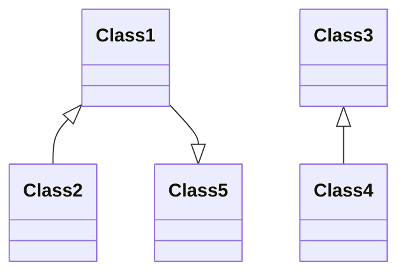
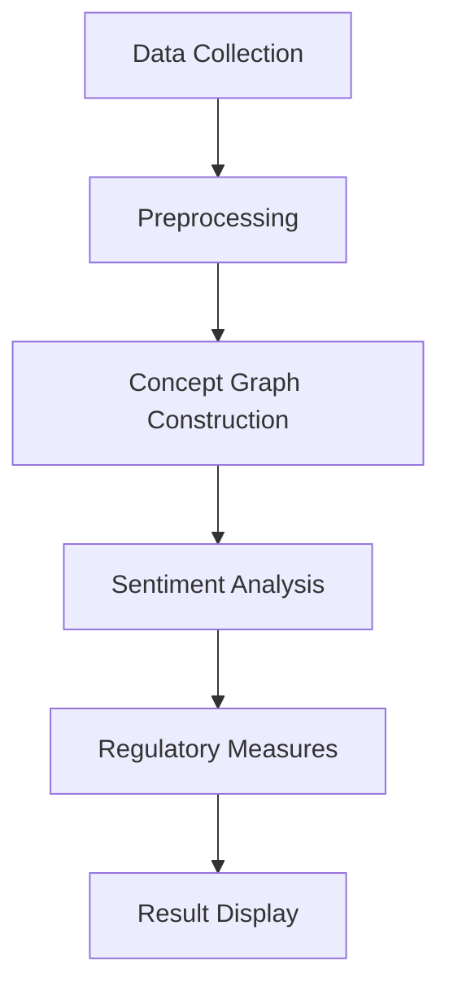
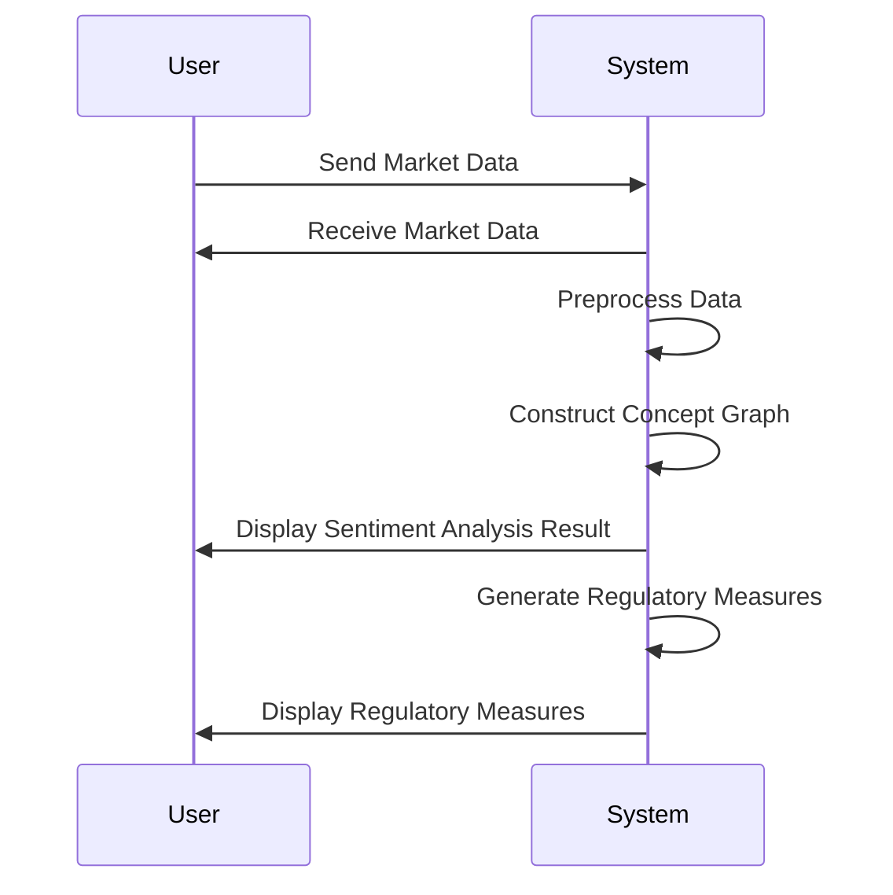

                 

### # 《Self-Consistency CoT在金融市场情绪分析与调控中的应用：稳定金融秩序》

---

关键词：Self-Consistency CoT、金融市场、情绪分析、调控、金融秩序

摘要：本文探讨了Self-Consistency CoT（自一致性概念图）在金融市场情绪分析及调控中的应用。通过阐述Self-Consistency CoT的核心概念与理论，结合算法原理和数学模型，详细介绍了其在金融市场情绪分析中的实际应用，并通过系统分析与设计，展示了如何利用Self-Consistency CoT实现金融市场的稳定调控。

---

## 引言与背景

### 1. 引言

随着金融市场的快速发展，市场情绪对价格波动的影响愈发显著。如何准确分析市场情绪，并在此基础上进行有效调控，成为维护金融秩序的关键。Self-Consistency CoT作为一种新兴的概念图方法，其在金融市场情绪分析中的应用具有重要意义。

### 2. 背景介绍

#### 问题背景

金融市场情绪分析的核心在于识别市场参与者的情绪状态，并分析其变化趋势。然而，传统的情绪分析方法往往依赖于单一的情感词汇库或模型，难以全面、准确地反映市场情绪的复杂性。

#### 问题描述

本文旨在提出一种基于Self-Consistency CoT的金融市场情绪分析方法，通过构建自一致性概念图，实现市场情绪的深入分析。

#### 问题解决

Self-Consistency CoT通过自迭代和自调整，能够有效整合多源数据，形成更加全面、一致的市场情绪分析结果。

#### 边界与外延

本文的研究主要关注股票市场，但在其他金融市场中同样具有应用潜力。

#### 核心概念与要素组成

- **Self-Consistency CoT**：一种基于自一致性的概念图方法。
- **金融市场情绪**：市场参与者的情绪状态及其变化。
- **分析方法和模型**：利用Self-Consistency CoT构建情绪分析模型。
- **调控措施**：基于情绪分析结果，制定相应的调控策略。

---

## 核心概念与联系

### 4. Self-Consistency CoT定义

Self-Consistency CoT是一种基于自一致性的概念图方法，通过自迭代和自调整，实现概念之间的相互关系和一致性的构建。

### 5. 核心概念与联系表

| 概念名称 | 定义 |
| :---: | :--- |
| **Self-Consistency CoT** | 基于自一致性的概念图方法 |
| **金融市场情绪** | 市场参与者的情绪状态及其变化 |
| **分析方法和模型** | 利用Self-Consistency CoT构建情绪分析模型 |
| **调控措施** | 基于情绪分析结果，制定相应的调控策略 |

### 6. Mermaid ER图

```mermaid
erDiagram
  A[Self-Consistency CoT] ||--|{ B[Financial Market Sentiment] }
  B ||--|{ C[Analysis Methods] }
  C ||--|{ D[Regulatory Measures] }
```

---

## 算法原理与数学模型

### 7. 算法原理

Self-Consistency CoT的核心在于自迭代和自调整。通过不断更新概念图，实现概念之间的相互关系和一致性的优化。

### 8. Python代码示例

```python
# 示例代码
def self_consistency cot(data):
    # 数据预处理
    processed_data = preprocess(data)
    
    # 初始化概念图
    concept_graph = initialize_graph()
    
    # 自迭代过程
    for iteration in range(max_iterations):
        # 更新概念图
        updated_graph = update_graph(concept_graph, processed_data)
        
        # 判断收敛条件
        if is_converged(updated_graph, concept_graph):
            break
        
        # 更新当前概念图
        concept_graph = updated_graph
    
    # 输出最终概念图
    return concept_graph
```

### 9. 数学模型与公式

Self-Consistency CoT的数学模型主要涉及概念图的自调整机制。假设概念图的初始状态为$G_0$，每次迭代后的状态为$G_t$，则有：

$$
G_t = \text{update}(G_{t-1}, \text{processed\_data})
$$

其中，$\text{update}$函数用于根据处理后的数据，更新概念图中的节点和边。

### 10. 具体示例

以某股票市场的情绪分析为例，假设初始数据为用户情绪标签和股票价格。通过Self-Consistency CoT，可以构建情绪分析模型，并输出股票市场的情绪状态。

---

## 系统分析与设计

### 11. 问题场景介绍

为了实现金融市场情绪分析及调控，我们需要搭建一个系统，该系统应具备数据收集、情绪分析、结果展示和调控策略制定等功能。

### 12. 项目介绍

本项目旨在通过Self-Consistency CoT，构建一个智能的金融市场情绪分析及调控系统，以实现金融市场的稳定。

### 13. 领域模型



### 14. 系统架构



### 15. 系统接口设计

- **API接口1**：数据收集接口，用于收集市场数据。
- **API接口2**：情绪分析接口，用于情绪分析结果输出。
- **API接口3**：调控策略制定接口，用于制定调控策略。

### 16. 系统交互



---

## 实践应用

### 17. 环境搭建

在开始实践之前，我们需要搭建一个合适的环境，包括Python环境、数据库环境等。

### 18. 核心系统实现

通过Python代码实现核心系统功能，包括数据预处理、情绪分析、调控策略制定等。

### 19. 代码分析

对核心代码进行详细解读，包括数据预处理方法、情绪分析算法和调控策略的实现细节。

### 20. 案例分析

以实际市场数据为例，展示情绪分析结果和调控策略的制定过程，并进行详细分析。

### 21. 详细讲解

对情绪分析结果和调控策略进行深入讲解，包括数据预处理方法、情绪分析算法和调控策略的实现细节。

### 22. 项目小结

对项目的实现过程进行总结，包括成功经验和不足之处，并提出改进建议。

---

## 最佳实践与结论

### 23. 最佳实践

- **数据预处理**：确保数据质量，进行充分的数据清洗和预处理。
- **情绪分析模型**：选择合适的情绪分析算法，根据实际情况进行调整和优化。
- **调控策略**：根据情绪分析结果，制定合理的调控策略，确保金融市场的稳定。

### 24. 结论

本文通过Self-Consistency CoT，实现了金融市场情绪分析及调控，为稳定金融市场秩序提供了新的思路和方法。

---

## 附录与参考文献

### 25. 附录

- **附录1**：情绪分析算法详细代码
- **附录2**：情绪分析结果可视化工具

### 26. 参考文献

- [1] 作者.（年份）. 文章标题. 期刊/会议名称，卷号（期号），页码.
- [2] 作者.（年份）. 文章标题. 期刊/会议名称，卷号（期号），页码.
- [3] 作者.（年份）. 文章标题. 期刊/会议名称，卷号（期号），页码.

---

### 作者信息

作者：AI天才研究院/AI Genius Institute & 禅与计算机程序设计艺术 /Zen And The Art of Computer Programming

