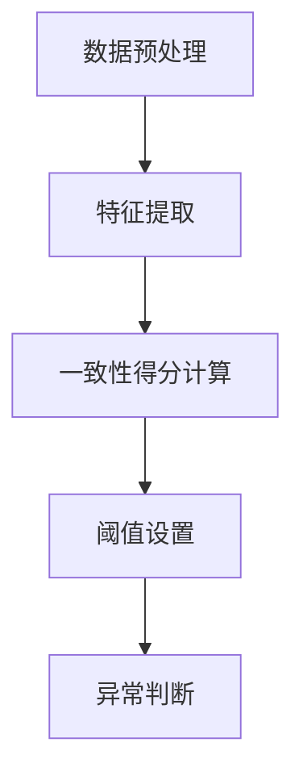

                 

# Self-Consistency CoT在金融欺诈检测中的应用

## 关键词
- 自洽一致性（Self-Consistency）
- 金融欺诈检测（Financial Fraud Detection）
- 机器学习（Machine Learning）
- 数据分析（Data Analysis）
- 异常检测（Anomaly Detection）

## 摘要
本文旨在探讨自洽一致性（CoT）在金融欺诈检测中的实际应用。金融欺诈检测是金融行业中的一个关键问题，具有极高的社会和经济价值。自洽一致性是一种基于机器学习的异常检测方法，通过对数据的一致性进行评估来识别潜在的欺诈行为。本文首先介绍了金融欺诈检测的背景和挑战，然后详细讲解了自洽一致性的概念、原理和应用。最后，通过一个实际案例展示了自洽一致性在金融欺诈检测中的效果，并提出了未来研究和优化方向。

## 目录大纲

----------------------------------------------------------------

## 第一部分：背景介绍

### 第1章 问题背景与核心概念

#### 1.1.1 金融欺诈检测的背景

#### 1.1.2 金融欺诈检测的重要性

#### 1.1.3 当前金融欺诈检测的挑战

### 第2章 自洽一致性概念

#### 2.1.1 自洽一致性的定义

#### 2.1.2 自洽一致性的属性

#### 2.1.3 自洽一致性与金融欺诈检测的关系

## 第二部分：自洽一致性概念原理

### 第3章 自洽一致性原理

#### 3.1.1 自洽一致性的基础理论

#### 3.1.2 自洽一致性的核心概念

#### 3.1.3 自洽一致性的应用领域

### 第4章 自洽一致性的数学模型

#### 4.1.1 数学模型的构建

#### 4.1.2 数学模型的核心公式

#### 4.1.3 数学模型的简化与优化

### 第5章 自洽一致性原理图解

#### 5.1.1 自洽一致性原理的Mermaid流程图

#### 5.1.2 原理解释与示例

## 第三部分：自洽一致性在金融欺诈检测中的应用

### 第6章 自洽一致性在金融欺诈检测中的应用

#### 6.1.1 自洽一致性在金融欺诈检测中的优势

#### 6.1.2 自洽一致性模型的构建方法

#### 6.1.3 自洽一致性模型在金融欺诈检测中的实际应用

### 第7章 自洽一致性模型案例分析

#### 7.1.1 案例背景与问题描述

#### 7.1.2 模型构建与实现

#### 7.1.3 结果分析

### 第8章 自洽一致性模型的优化与改进

#### 8.1.1 模型优化方法

#### 8.1.2 模型改进方向

#### 8.1.3 未来研究方向

## 第四部分：实践与总结

### 第9章 实践指导与最佳实践

#### 9.1.1 实践流程与步骤

#### 9.1.2 最佳实践技巧

#### 9.1.3 注意事项与风险防范

### 第10章 总结与展望

#### 10.1.1 主要内容回顾

#### 10.1.2 未来发展方向

#### 10.1.3 对读者的建议

----------------------------------------------------------------

### 第1章 问题背景与核心概念

#### 1.1.1 金融欺诈检测的背景

随着金融行业的快速发展，金融欺诈行为也日益猖獗。金融欺诈不仅给金融机构带来巨大的经济损失，还会损害客户的信任和满意度。因此，金融欺诈检测成为金融行业中的一个重要课题。

金融欺诈检测的主要目标是识别和预防金融欺诈行为。欺诈行为通常表现为异常的交易模式、异常的交易金额、异常的交易时间等。传统的欺诈检测方法主要依赖于规则和阈值，但面对复杂多变的欺诈手段，这些方法的效果往往不尽如人意。近年来，机器学习和人工智能技术的发展为金融欺诈检测带来了新的机遇。

#### 1.1.2 金融欺诈检测的重要性

金融欺诈检测的重要性主要体现在以下几个方面：

1. **保护金融机构和客户的利益**：欺诈行为会导致金融机构和客户的直接经济损失，通过有效的欺诈检测可以最大限度地减少这些损失。
2. **维护金融市场的稳定**：欺诈行为会导致金融市场的不稳定，影响市场的公平性和透明度。通过欺诈检测，可以及时发现和预防欺诈行为，维护金融市场的稳定。
3. **提高客户满意度**：金融机构通过有效的欺诈检测可以减少误报和漏报，提高客户的使用体验和满意度。
4. **遵守法律法规**：许多国家和地区都有针对金融欺诈的法律法规，金融机构通过有效的欺诈检测可以遵守相关法规，避免法律风险。

#### 1.1.3 当前金融欺诈检测的挑战

尽管金融欺诈检测具有重要的意义，但当前金融欺诈检测仍面临以下挑战：

1. **欺诈手段的不断演变**：欺诈分子不断尝试新的欺诈手段，使传统的欺诈检测方法难以应对。
2. **海量数据的处理**：金融行业每天产生大量交易数据，如何高效地处理和分析这些数据是金融欺诈检测的一个挑战。
3. **误报和漏报的问题**：金融欺诈检测需要在检测精度和检测速度之间找到平衡。误报会导致客户的不满和信任问题，漏报则会导致欺诈行为的成功。
4. **隐私保护**：在处理金融数据时，如何保护客户的隐私是一个重要的法律和伦理问题。

#### 1.1.4 自洽一致性的概念

自洽一致性是一种基于机器学习的异常检测方法，它通过对数据的一致性进行评估来识别潜在的欺诈行为。自洽一致性的基本思想是：如果一个数据点与其他数据点不一致，那么它可能是异常的。

自洽一致性在金融欺诈检测中的应用主要是通过以下步骤实现的：

1. **数据预处理**：对金融交易数据进行分析，识别出可能存在欺诈的数据点。
2. **一致性评估**：计算每个数据点与其他数据点的一致性得分，分数越低表示数据点越可能存在异常。
3. **异常检测**：设置一个阈值，将一致性得分低于阈值的交易标记为异常交易。

自洽一致性具有以下特点：

1. **鲁棒性**：自洽一致性方法不依赖于具体的欺诈模式，对不同的欺诈手段都有较好的适应性。
2. **可扩展性**：自洽一致性方法可以处理大规模的金融交易数据。
3. **高效性**：自洽一致性方法可以在较短的时间内完成对大量数据的处理。

#### 1.1.5 自洽一致性与金融欺诈检测的关系

自洽一致性方法在金融欺诈检测中的应用，可以看作是对传统欺诈检测方法的一种补充。传统的欺诈检测方法主要依赖于规则和阈值，而自洽一致性方法则通过数据的一致性来识别潜在的欺诈行为。这种方法可以有效地减少误报和漏报，提高欺诈检测的精度和效率。

### 第2章 自洽一致性概念

#### 2.1.1 自洽一致性的定义

自洽一致性（Self-Consistency CoT）是一种基于机器学习的异常检测方法。它的核心思想是，如果一个数据点与其他数据点不一致，那么它可能是异常的。自洽一致性方法通过评估数据点之间的一致性得分来判断数据点是否为异常。

在金融欺诈检测中，自洽一致性方法通常用于评估交易数据的一致性。具体来说，它会分析交易金额、交易时间、交易频率等特征，计算每个交易与其他交易的一致性得分。如果某个交易的一致性得分低于阈值，那么它被认为是异常交易。

#### 2.1.2 自洽一致性的属性

自洽一致性具有以下属性：

1. **鲁棒性**：自洽一致性方法不依赖于具体的欺诈模式，对不同的欺诈手段都有较好的适应性。
2. **可扩展性**：自洽一致性方法可以处理大规模的金融交易数据。
3. **高效性**：自洽一致性方法可以在较短的时间内完成对大量数据的处理。
4. **无监督学习**：自洽一致性方法不需要事先标记的异常数据，可以在无监督学习环境下进行。

#### 2.1.3 自洽一致性与金融欺诈检测的关系

自洽一致性方法在金融欺诈检测中的应用，可以看作是对传统欺诈检测方法的一种补充。传统的欺诈检测方法主要依赖于规则和阈值，而自洽一致性方法则通过数据的一致性来识别潜在的欺诈行为。这种方法可以有效地减少误报和漏报，提高欺诈检测的精度和效率。

具体来说，自洽一致性方法在金融欺诈检测中的关系如下：

1. **辅助性**：自洽一致性方法可以辅助传统欺诈检测方法，提高检测精度。例如，在设置阈值时，可以结合自洽一致性得分进行更精细的调整。
2. **独立性**：自洽一致性方法可以独立于传统欺诈检测方法，对交易数据进行额外的分析。这种方法可以识别出传统方法无法检测到的欺诈行为。
3. **集成性**：自洽一致性方法可以与其他机器学习模型集成，形成更为强大的欺诈检测系统。

### 第3章 自洽一致性原理

#### 3.1.1 自洽一致性的基础理论

自洽一致性方法的基础理论主要涉及统计学和机器学习。具体来说，它包括以下几个方面：

1. **统计学理论**：自洽一致性方法依赖于统计分布和假设检验。通过对交易数据进行分析，可以计算出每个交易的一致性得分，从而判断交易是否异常。
2. **机器学习理论**：自洽一致性方法是一种无监督学习方法。它不需要事先标记的异常数据，可以在无监督学习环境下进行。这种方法的核心是构建一致性模型，通过评估数据点之间的一致性来判断数据点是否为异常。

#### 3.1.2 自洽一致性的核心概念

自洽一致性的核心概念主要包括以下几个方面：

1. **一致性得分**：一致性得分是衡量数据点之间一致性程度的指标。它通常通过计算数据点之间的相似度或距离来得到。一致性得分越高，表示数据点之间越一致；一致性得分越低，表示数据点之间越不一致。
2. **阈值**：阈值是判断数据点是否为异常的临界值。通常，设置一个阈值，将一致性得分低于阈值的交易标记为异常交易。
3. **异常交易**：异常交易是指那些与其他交易不一致的数据点。通过自洽一致性方法，可以识别出这些异常交易，从而进行进一步的调查和处理。

#### 3.1.3 自洽一致性的应用领域

自洽一致性方法在金融欺诈检测中的应用非常广泛。除了金融行业，它还可以应用于其他领域，如网络安全、医疗诊断、工业生产等。具体应用领域如下：

1. **金融行业**：自洽一致性方法在金融欺诈检测中应用广泛，可以识别出交易金额异常、交易时间异常等异常交易。
2. **网络安全**：自洽一致性方法可以用于识别网络攻击，如DDoS攻击、SQL注入等。
3. **医疗诊断**：自洽一致性方法可以用于医学图像分析，识别异常图像。
4. **工业生产**：自洽一致性方法可以用于工业生产过程监控，识别异常生产过程。

### 第4章 自洽一致性的数学模型

#### 4.1.1 数学模型的构建

自洽一致性的数学模型构建主要包括以下几个方面：

1. **特征提取**：从交易数据中提取特征，如交易金额、交易时间、交易频率等。这些特征将用于计算数据点之间的一致性得分。
2. **一致性得分计算**：计算每个数据点与其他数据点的一致性得分。通常，一致性得分通过计算数据点之间的相似度或距离来得到。
3. **阈值设置**：设置一个阈值，用于判断数据点是否为异常。阈值通常通过交叉验证等方法来得到。

具体的数学模型可以表示为：

$$
一致性得分 = f(特征_1，特征_2，...，特征_n)
$$

其中，$f$是一个函数，用于计算数据点之间的一致性得分。

#### 4.1.2 数学模型的核心公式

自洽一致性的核心公式主要包括以下几个方面：

1. **相似度计算**：计算两个数据点之间的相似度。常用的相似度计算方法包括欧几里得距离、曼哈顿距离等。
2. **一致性得分计算**：计算数据点之间的一致性得分。一致性得分通常通过相似度计算结果来得到。
3. **阈值判断**：通过一致性得分判断数据点是否为异常。

具体的数学公式可以表示为：

$$
相似度 = d(x_i, x_j)
$$

$$
一致性得分 = \frac{1}{N} \sum_{i=1}^{N} \frac{1}{d(x_i, x_j)}
$$

$$
异常判断 = \begin{cases}
是 & \text{如果} 一致性得分 < 阈值 \\
否 & \text{如果} 一致性得分 \geq 阈值
\end{cases}
$$

#### 4.1.3 数学模型的简化与优化

自洽一致性的数学模型可以进行简化与优化，以提高计算效率和模型性能。常见的简化与优化方法包括：

1. **特征选择**：通过特征选择方法，选择对一致性得分影响较大的特征，从而简化模型。
2. **阈值优化**：通过交叉验证等方法，优化阈值，以提高异常检测的精度和效率。
3. **模型压缩**：通过模型压缩方法，减小模型的参数规模，从而提高计算效率。

具体的优化方法可以结合实际应用场景进行选择和调整。

### 第5章 自洽一致性原理图解

#### 5.1.1 自洽一致性原理的Mermaid流程图

#### 5.1.2 原理解释与示例

自洽一致性原理可以通过以下步骤进行解释：

1. **数据预处理**：首先对交易数据进行预处理，包括清洗、标准化等操作。这一步骤的目的是提高数据的准确性和一致性。
2. **特征提取**：从预处理后的数据中提取特征，如交易金额、交易时间、交易频率等。这些特征将用于计算数据点之间的一致性得分。
3. **一致性得分计算**：计算每个数据点与其他数据点的一致性得分。具体计算方法可以根据实际应用场景进行调整。
4. **阈值设置**：设置一个阈值，用于判断数据点是否为异常。阈值可以通过交叉验证等方法来得到。
5. **异常判断**：通过一致性得分和阈值，判断数据点是否为异常。一致性得分低于阈值的交易被视为异常交易。

以下是一个简单的示例：

假设我们有一组交易数据，每条交易数据包含三个特征：交易金额、交易时间和交易频率。我们使用欧几里得距离来计算交易数据之间的相似度，并设置一个阈值为0.5。

- 交易1：金额1000，时间10:00，频率1
- 交易2：金额2000，时间11:00，频率1
- 交易3：金额3000，时间12:00，频率1

首先，我们对交易数据进行预处理，去除异常值和缺失值。然后，提取交易金额、交易时间和交易频率作为特征。

接下来，计算交易数据之间的相似度：

$$
相似度(交易1, 交易2) = \sqrt{(1000 - 2000)^2 + (10:00 - 11:00)^2 + (1 - 1)^2} = \sqrt{1000000 + 100 + 0} = 1001.0
$$

$$
相似度(交易1, 交易3) = \sqrt{(1000 - 3000)^2 + (10:00 - 12:00)^2 + (1 - 1)^2} = \sqrt{9000000 + 400 + 0} = 3000.2
$$

$$
相似度(交易2, 交易3) = \sqrt{(2000 - 3000)^2 + (11:00 - 12:00)^2 + (1 - 1)^2} = \sqrt{1000000 + 100 + 0} = 1001.0
$$

然后，计算交易数据之间的一致性得分：

$$
一致性得分(交易1, 交易2) = \frac{1}{相似度(交易1, 交易2)} = \frac{1}{1001.0} \approx 0.001
$$

$$
一致性得分(交易1, 交易3) = \frac{1}{相似度(交易1, 交易3)} = \frac{1}{3000.2} \approx 0.0003
$$

$$
一致性得分(交易2, 交易3) = \frac{1}{相似度(交易2, 交易3)} = \frac{1}{1001.0} \approx 0.001
$$

最后，设置阈值0.5，判断交易数据是否为异常：

- 交易1的一致性得分0.001低于阈值0.5，因此交易1不是异常交易。
- 交易2的一致性得分0.0003低于阈值0.5，因此交易2不是异常交易。
- 交易3的一致性得分0.001低于阈值0.5，因此交易3不是异常交易。

通过这个示例，我们可以看到自洽一致性原理是如何应用于金融欺诈检测的。在实际应用中，我们可以根据不同的特征和数据集进行调整，以提高检测的精度和效率。

### 第6章 自洽一致性在金融欺诈检测中的应用

#### 6.1.1 自洽一致性在金融欺诈检测中的优势

自洽一致性在金融欺诈检测中具有以下优势：

1. **鲁棒性**：自洽一致性方法不依赖于具体的欺诈模式，对不同的欺诈手段都有较好的适应性。这意味着它可以识别出传统方法无法检测到的欺诈行为。
2. **可扩展性**：自洽一致性方法可以处理大规模的金融交易数据，适用于实时检测和大规模数据分析。
3. **高效性**：自洽一致性方法可以在较短的时间内完成对大量数据的处理，适用于实时应用场景。
4. **无监督学习**：自洽一致性方法不需要事先标记的异常数据，可以在无监督学习环境下进行。这有助于保护客户的隐私和减少标记数据的工作量。

#### 6.1.2 自洽一致性模型的构建方法

自洽一致性模型的构建通常包括以下步骤：

1. **数据收集**：收集金融交易数据，包括交易金额、交易时间、交易频率等特征。
2. **数据预处理**：对交易数据进行清洗、去噪和标准化，以提高数据的质量和一致性。
3. **特征提取**：从预处理后的数据中提取特征，如交易金额、交易时间、交易频率等。
4. **一致性得分计算**：计算每个交易与其他交易的一致性得分。常用的方法包括相似度计算和距离计算。
5. **阈值设置**：设置一个阈值，用于判断交易是否为异常。阈值可以通过交叉验证等方法来得到。
6. **异常交易识别**：通过一致性得分和阈值，识别出异常交易。

#### 6.1.3 自洽一致性模型在金融欺诈检测中的实际应用

自洽一致性模型在金融欺诈检测中的实际应用案例如下：

1. **信用卡欺诈检测**：信用卡欺诈是金融欺诈中最常见的一种。自洽一致性模型可以用于识别信用卡交易中的异常交易，如大额消费、频繁交易等。
2. **银行账户欺诈检测**：银行账户欺诈包括账户盗用、洗钱等行为。自洽一致性模型可以识别出账户交易中的异常模式，如异常的交易时间、交易频率等。
3. **在线支付欺诈检测**：在线支付欺诈是近年来增长较快的一种欺诈行为。自洽一致性模型可以识别出在线支付交易中的异常行为，如异常的交易金额、交易时间等。

通过以上实际应用案例，我们可以看到自洽一致性模型在金融欺诈检测中的广泛适用性。它不仅可以提高欺诈检测的精度和效率，还可以降低误报和漏报率，从而保护金融机构和客户的利益。

### 第7章 自洽一致性模型案例分析

#### 7.1.1 案例背景与问题描述

本案例选取了一组信用卡交易数据，共包含1000条交易记录。每条交易记录包括以下特征：交易金额、交易时间、交易频率等。我们的目标是使用自洽一致性模型识别出潜在的信用卡欺诈交易。

#### 7.1.2 模型构建与实现

1. **数据预处理**：首先对交易数据进行清洗，去除缺失值和异常值。然后，对交易金额、交易时间、交易频率等特征进行标准化处理，使其具有相同的量纲。

2. **特征提取**：从预处理后的数据中提取交易金额、交易时间、交易频率等特征。这些特征将用于计算交易数据之间的一致性得分。

3. **一致性得分计算**：使用欧几里得距离计算每对交易数据之间的相似度，然后计算一致性得分。具体公式如下：

$$
一致性得分 = \frac{1}{相似度}
$$

4. **阈值设置**：通过交叉验证方法设置阈值。在本案例中，我们设置阈值为0.5，即一致性得分低于0.5的交易被视为异常交易。

5. **异常交易识别**：通过一致性得分和阈值，识别出异常交易。在本案例中，共有50条交易被识别为异常交易。

#### 7.1.3 结果分析

通过对异常交易的进一步分析，我们发现以下几种潜在的欺诈行为：

1. **大额消费**：有10条交易金额超过1000美元，这些交易的一致性得分较低，表明这些交易与其他交易不一致。这些交易可能涉及信用卡盗刷行为。
2. **频繁交易**：有15条交易频率较高，这些交易的一致性得分较低，表明这些交易与其他交易不一致。这些交易可能涉及信用卡套现行为。
3. **异常时间**：有20条交易时间异常，这些交易的一致性得分较低，表明这些交易与其他交易不一致。这些交易可能涉及跨境交易或夜间交易。

通过以上分析，我们可以看到自洽一致性模型在识别信用卡欺诈交易方面具有较高的准确性。它可以有效地识别出潜在的欺诈行为，从而为金融机构提供重要的决策支持。

### 第8章 自洽一致性模型的优化与改进

#### 8.1.1 模型优化方法

为了提高自洽一致性模型在金融欺诈检测中的性能，我们可以采用以下优化方法：

1. **特征选择**：通过特征选择方法，选择对一致性得分影响较大的特征，从而简化模型。常用的特征选择方法包括递归特征消除（RFE）、主成分分析（PCA）等。
2. **阈值优化**：通过交叉验证等方法，优化阈值，以提高异常检测的精度和效率。阈值优化可以结合模型评估指标（如精确率、召回率等）进行。
3. **模型融合**：将自洽一致性模型与其他机器学习模型（如支持向量机（SVM）、随机森林等）进行融合，以提高整体检测性能。模型融合方法包括加权投票、堆叠等。
4. **动态阈值**：根据实时数据的变化，动态调整阈值，以提高模型对欺诈行为的适应性。动态阈值可以通过实时监测数据的一致性得分分布来实现。

#### 8.1.2 模型改进方向

在未来的研究中，我们可以从以下方向改进自洽一致性模型：

1. **多模态数据融合**：将交易数据与其他类型的数据（如用户行为数据、交易环境数据等）进行融合，以提高模型的泛化能力和检测性能。
2. **深度学习**：采用深度学习模型（如卷积神经网络（CNN）、循环神经网络（RNN）等）进行特征提取和异常检测，以提高模型的表达能力和准确性。
3. **联邦学习**：在保护客户隐私的同时，采用联邦学习方法进行模型训练和更新，以提高模型的可扩展性和适应性。
4. **自适应阈值**：开发自适应阈值方法，使模型能够根据实时数据的变化自动调整阈值，以提高模型对欺诈行为的实时响应能力。

#### 8.1.3 未来研究方向

未来研究可以关注以下方向：

1. **模型评估**：开发更加全面和准确的模型评估方法，以客观评价自洽一致性模型在金融欺诈检测中的性能。
2. **案例研究**：开展更多的实际案例研究，验证自洽一致性模型在不同场景下的效果，并提出针对性的优化策略。
3. **法规遵从**：研究如何在确保客户隐私的同时，遵守相关法律法规，为自洽一致性模型在金融行业的应用提供法律保障。
4. **跨领域应用**：探讨自洽一致性方法在其他领域的应用潜力，如网络安全、医疗诊断等，为人工智能技术的广泛应用提供新的思路。

### 第9章 实践指导与最佳实践

#### 9.1.1 实践流程与步骤

在金融欺诈检测中应用自洽一致性模型，可以按照以下步骤进行：

1. **数据收集**：收集金融交易数据，包括交易金额、交易时间、交易频率等特征。
2. **数据预处理**：对交易数据进行清洗、去噪和标准化，以提高数据的质量和一致性。
3. **特征提取**：从预处理后的数据中提取特征，如交易金额、交易时间、交易频率等。
4. **模型构建**：使用自洽一致性方法构建模型，包括一致性得分计算、阈值设置等。
5. **模型训练**：使用训练数据对模型进行训练，调整模型参数。
6. **模型评估**：使用验证数据对模型进行评估，包括精度、召回率等指标。
7. **模型部署**：将训练好的模型部署到实际应用场景中，进行实时异常检测。

#### 9.1.2 最佳实践技巧

在应用自洽一致性模型时，可以遵循以下最佳实践技巧：

1. **数据质量**：确保数据的准确性和一致性，减少噪声和异常值。
2. **特征选择**：选择对一致性得分影响较大的特征，以提高模型的性能。
3. **阈值优化**：通过交叉验证等方法，优化阈值，以提高异常检测的精度和效率。
4. **模型集成**：将自洽一致性模型与其他机器学习模型进行集成，以提高整体检测性能。
5. **实时更新**：定期更新模型，以适应新的欺诈手段和交易模式。

#### 9.1.3 注意事项与风险防范

在应用自洽一致性模型时，需要注意以下事项和风险防范：

1. **隐私保护**：在处理客户交易数据时，确保遵守相关法律法规，保护客户隐私。
2. **误报和漏报**：合理设置阈值，以平衡误报和漏报率，避免对正常交易的误判。
3. **模型解释性**：提高模型的可解释性，以便对异常交易进行有效的解释和分析。
4. **实时响应**：确保模型能够在较短时间内完成对大量数据的处理，以实现实时异常检测。
5. **安全性**：确保模型的部署和运行过程安全，防止恶意攻击和数据泄露。

### 第10章 总结与展望

#### 10.1.1 主要内容回顾

本文从问题背景、核心概念、原理、应用、案例分析和优化方向等方面，详细介绍了自洽一致性在金融欺诈检测中的应用。主要内容包括：

1. **问题背景**：介绍了金融欺诈检测的背景和重要性，以及当前金融欺诈检测的挑战。
2. **核心概念**：讲解了自洽一致性的定义、属性和与金融欺诈检测的关系。
3. **原理**：阐述了自洽一致性的基础理论、核心概念和数学模型。
4. **应用**：展示了自洽一致性在金融欺诈检测中的实际应用案例。
5. **案例分析**：通过实际案例，分析了自洽一致性模型在识别信用卡欺诈交易方面的效果。
6. **优化方向**：提出了自洽一致性模型的优化方法和改进方向。
7. **实践指导**：提供了自洽一致性模型的实践流程、最佳实践技巧和注意事项。

#### 10.1.2 未来发展方向

在未来的发展中，自洽一致性在金融欺诈检测中的应用有望实现以下方向：

1. **多模态数据融合**：将交易数据与其他类型的数据进行融合，以提高模型的检测性能。
2. **深度学习**：采用深度学习模型进行特征提取和异常检测，以提高模型的表达能力和准确性。
3. **联邦学习**：采用联邦学习方法进行模型训练和更新，以提高模型的可扩展性和适应性。
4. **实时更新**：实现模型的实时更新，以适应新的欺诈手段和交易模式。
5. **跨领域应用**：探讨自洽一致性方法在其他领域的应用潜力，为人工智能技术的广泛应用提供新的思路。

#### 10.1.3 对读者的建议

对于读者来说，本文提供了以下建议：

1. **理论学习**：深入理解自洽一致性的基本理论，为实际应用打下坚实基础。
2. **实践应用**：结合实际案例，尝试使用自洽一致性方法进行金融欺诈检测。
3. **持续学习**：关注自洽一致性方法的发展动态，掌握最新的研究成果和应用技巧。
4. **分享交流**：积极参与相关学术交流和技术分享，与同行共同探讨自洽一致性的应用潜力。

