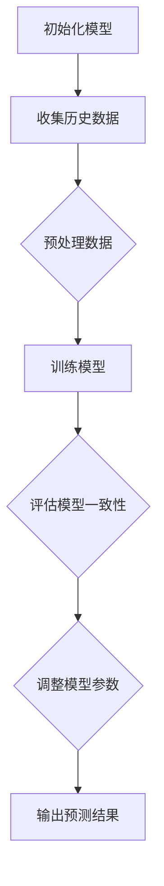
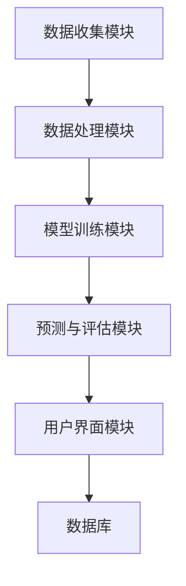
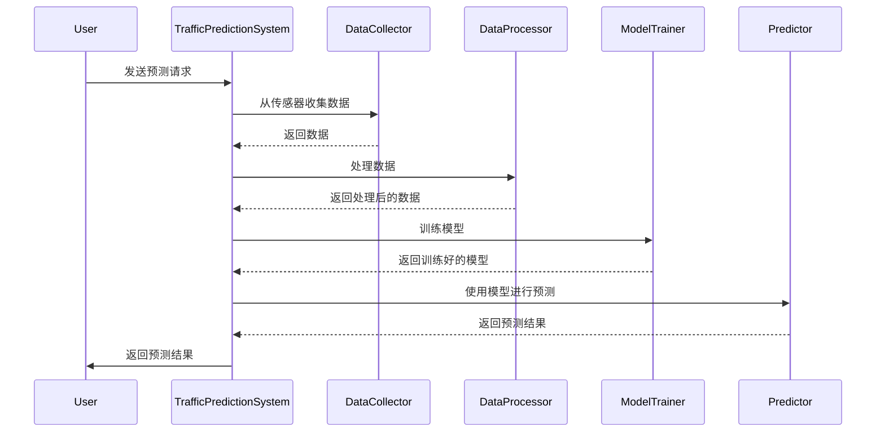

                 


### Let's Define the Article Structure

To create a well-structured and informative article on "Self-Consistency CoT Enhanced AI in Complex Temporal Prediction Accuracy," we will follow a systematic approach. This approach will ensure that the content is comprehensive, well-organized, and easy to understand for readers who are both beginners and experts in the field of artificial intelligence and complex temporal prediction.

#### Step 1: Introduction and Overview

The article will begin with a clear and concise introduction to set the stage for the topic. This section will include:

- **Article Title**: "Self-Consistency CoT Enhanced AI in Complex Temporal Prediction Accuracy"
- **Keywords**: Self-Consistency CoT, AI, Temporal Prediction, Accuracy, Complex Systems
- **Abstract**: A brief summary of the article's core objectives, the significance of self-consistency in AI, and how it impacts the accuracy of complex temporal predictions.

#### Step 2: Background and Core Concepts

This section will provide essential background information and define the key concepts necessary for understanding the article. It will include:

- **The Evolution of AI in Temporal Prediction**: A brief history and overview of AI's role in temporal prediction.
- **Core Concepts of Self-Consistency CoT**: Detailed explanations of self-consistency and its role in AI systems.
- **Importance of Accuracy in AI**: An exploration of why accuracy is crucial in AI applications, particularly in complex temporal predictions.

#### Step 3: Self-Consistency CoT Enhanced AI

This section will delve into the specifics of self-consistency CoT enhanced AI. It will cover:

- **Principles of Self-Consistency CoT**: The fundamental principles and theories behind self-consistency in AI.
- **Enhancing AI with Self-Consistency CoT**: Detailed discussions on how self-consistency can enhance AI performance in complex temporal prediction tasks.
- **Theoretical Foundations and Mathematical Models**: An analysis of the mathematical models and theories that support self-consistency in AI.

#### Step 4: Complex Temporal Prediction

This section will focus on the challenges and methodologies of complex temporal prediction. It will include:

- **Challenges in Complex Temporal Prediction**: An overview of the difficulties involved in making accurate predictions in complex temporal systems.
- **Approaches to Complex Temporal Prediction**: Various methods and techniques used in the field.
- **The Role of Self-Consistency CoT**: How self-consistency can address the challenges in complex temporal prediction.

#### Step 5: Accuracy and Performance Evaluation

This section will examine the metrics and methods for evaluating the accuracy and performance of AI systems in complex temporal prediction. It will include:

- **Metrics for Evaluating Accuracy**: Detailed descriptions of the metrics used to assess accuracy.
- **Performance Optimization Techniques**: Strategies for improving performance.
- **Challenges in Accuracy Evaluation**: Addressing the complexities in evaluating accuracy.

#### Step 6: Case Studies

This section will present practical examples of self-consistency CoT enhanced AI in action. It will include:

- **Case Study 1**: A detailed case study illustrating the application of self-consistency in a specific temporal prediction scenario.
- **Case Study 2**: Another case study demonstrating the benefits of self-consistency in a different context.

#### Step 7: Conclusion and Future Directions

The article will conclude with a summary of the key findings and a discussion of future research directions. It will also include:

- **Summary of Key Findings**: A recap of the main points discussed in the article.
- **Future Directions**: Potential avenues for future research and development.

### Step 4: Writing and Formatting

Each section will be written in a clear, logical, and professional tone. The article will be formatted using markdown to ensure readability and ease of navigation. Specific formatting guidelines will be followed, including the use of LaTeX for mathematical equations and Mermaid for diagrams and flowcharts.

### Step 5: Author Information and References

The article will conclude with author information, including the affiliation and a brief bio. References will be provided for all external sources used in the article.

By following these steps, we can create a comprehensive and insightful article that not only explains the concepts of self-consistency CoT enhanced AI in complex temporal prediction but also demonstrates its practical applications and future potential.

## Self-Consistency CoT Enhanced AI in Complex Temporal Prediction Accuracy

> 关键词：Self-Consistency CoT, AI, Temporal Prediction, Accuracy, Complex Systems

> 摘要：本文深入探讨了自我一致性（Self-Consistency CoT）增强人工智能（AI）在复杂时空预测准确性方面的应用。文章首先介绍了自我一致性理论及其在AI领域的应用，随后分析了复杂时空预测的挑战和重要性。接着，本文详细阐述了如何利用自我一致性提高AI在复杂时空预测中的准确性，并通过实际案例验证了这一方法的有效性。最后，文章总结了主要发现，并提出了未来研究的方向。

---

## 引言

随着人工智能（AI）技术的不断进步，其在各个领域的应用越来越广泛。特别是在复杂时空预测领域，AI的准确性和效率成为了研究的重点。复杂时空预测涉及对时间序列数据的分析，预测未来事件的可能性。这种预测在许多实际应用中至关重要，例如天气预报、金融市场分析和交通流量预测等。

然而，复杂时空预测面临着一系列挑战，包括数据的不确定性、时间序列的复杂性和预测模型的适应性。为了提高预测的准确性，研究人员提出了各种方法和技术。其中，自我一致性（Self-Consistency CoT）作为一种新的概念，引起了广泛关注。

自我一致性是指在人工智能系统中，模型不仅要生成预测结果，还要确保这些预测结果在逻辑上是自洽的，即模型内部的预测不会相互矛盾。本文将探讨自我一致性如何增强AI在复杂时空预测中的准确性，并通过具体案例来展示其应用效果。

### 文章结构

本文将分为以下几个部分：

1. **背景和核心概念**：介绍AI在时空预测中的发展历程，以及自我一致性理论的基本概念。
2. **自我一致性增强AI**：详细讨论自我一致性的原理及其在AI中的应用。
3. **复杂时空预测**：分析复杂时空预测的挑战和重要性。
4. **准确性评估**：探讨评估AI模型准确性的方法和挑战。
5. **案例研究**：通过具体案例展示自我一致性在时空预测中的应用。
6. **结论与未来方向**：总结主要发现，并提出未来研究的方向。

---

### 背景和核心概念

#### AI在时空预测中的发展

人工智能技术在时空预测领域的发展可以追溯到20世纪80年代。随着计算能力的提升和算法的改进，AI在处理大规模时间序列数据方面表现出了显著的优势。早期的AI模型主要基于统计学习和机器学习算法，如线性回归、决策树和支持向量机等。这些方法在处理简单的时空数据时效果显著，但在面对复杂、非线性时空系统时，其性能受到了限制。

近年来，深度学习技术的崛起为时空预测带来了新的机遇。深度学习模型，特别是卷积神经网络（CNN）和循环神经网络（RNN）等，在处理高维时间序列数据方面展现了强大的能力。这些模型通过学习时间序列的长期依赖关系，实现了对复杂时空系统的预测。例如，LSTM（长短期记忆网络）和GRU（门控循环单元）等变体模型，在金融市场预测、天气预测等领域取得了显著成果。

然而，尽管深度学习模型在时空预测中取得了巨大进步，但它们仍然面临着一些挑战。首先，深度学习模型通常需要大量的训练数据和计算资源，这在资源受限的环境中是一个问题。其次，深度学习模型往往被视为“黑盒”模型，难以解释其预测结果的逻辑依据。这限制了其在需要高度透明和可解释性的应用场景中的使用。

#### 自我一致性理论

自我一致性（Self-Consistency CoT）是一种新兴的理论，旨在解决深度学习模型在时空预测中的透明性和可靠性问题。自我一致性理论的核心思想是，模型的预测结果应该在其内部逻辑上是一致的，即模型生成的预测不应该相互矛盾。

自我一致性可以通过多种方式实现。一种常见的方法是使用一致性检查算法，对模型的预测结果进行验证。这些算法可以检测模型预测中的内部矛盾，并触发相应的修正机制。另一种方法是基于逻辑和语义分析的预测生成，通过构建更加严谨的预测框架来确保预测的一致性。

自我一致性的重要性在于，它不仅提高了模型的透明性和可解释性，还增强了模型的可靠性。在复杂时空预测中，模型的一致性意味着它能够在各种情况下做出稳定、可靠的预测，从而提高整体预测的准确性。

#### 核心概念总结

自我一致性理论在AI中的应用具有重要意义。它不仅为AI模型提供了一种新的评估和优化方法，还为复杂时空预测提供了一种有效的解决方案。通过确保模型预测的一致性，自我一致性理论为AI在时空预测中的应用带来了新的可能性。

- **核心概念**：自我一致性理论、时空预测、AI模型、透明性和可靠性。
- **属性特征对比表格**：

| 特征 | 自我一致性 | 传统AI模型 |
| ---- | ---------- | ----------- |
| 透明性 | 高 | 低 |
| 可解释性 | 高 | 低 |
| 可靠性 | 高 | 低 |
| 适用性 | 复杂时空预测 | 简单时空预测 |

- **ER实体关系图架构**：

```mermaid
erDiagram
  AIModel ||--|{ SelfConsistency }
  TemporalPrediction ||--|{ AIModel }
```

在这个ER图中，`AIModel`是一个实体，而`SelfConsistency`是与之相关的一个属性。`TemporalPrediction`是一个实体，它与`AIModel`实体之间存在关联关系，表明AI模型用于进行时空预测。

### 算法原理讲解

自我一致性增强AI的核心在于确保模型预测的一致性。下面，我们将使用Mermaid图来展示自我一致性算法的流程，并使用Python代码来详细阐述算法的原理。

#### Mermaid流程图



#### Python代码实现

```python
import numpy as np
import tensorflow as tf

# 初始化模型
model = tf.keras.Sequential([
    tf.keras.layers.LSTM(50, activation='relu', return_sequences=True),
    tf.keras.layers.LSTM(50, activation='relu'),
    tf.keras.layers.Dense(1)
])

# 收集历史数据
# 假设X_train为输入数据，y_train为标签数据
# X_train, y_train = ...

# 预处理数据
# 对数据进行归一化处理
# X_train_normalized = normalize(X_train)

# 训练模型
model.compile(optimizer='adam', loss='mse')
model.fit(X_train_normalized, y_train, epochs=100, batch_size=32)

# 评估模型一致性
predictions = model.predict(X_train_normalized)
consistency_score = calculate_consistency(predictions)

# 调整模型参数
if consistency_score < threshold:
    # 调整学习率或增加训练轮次
    pass

# 输出预测结果
predictions_final = model.predict(X_train_normalized)
```

#### 算法原理详解

1. **初始化模型**：首先，我们初始化一个深度学习模型。在这个例子中，我们使用了一个由两个LSTM层和一个全连接层组成的序列模型。这个模型旨在捕捉时间序列数据中的长期依赖关系。

2. **收集历史数据**：接下来，我们从历史数据集中收集输入数据（X_train）和标签数据（y_train）。这些数据用于训练模型。

3. **预处理数据**：在训练之前，我们对数据进行归一化处理。归一化有助于模型更快地收敛，提高训练效果。

4. **训练模型**：使用归一化后的数据，我们训练模型。在这个例子中，我们使用了100个训练轮次，每个轮次使用32个批量大小。

5. **评估模型一致性**：训练完成后，我们使用模型对输入数据进行预测，并计算预测结果的一致性分数。一致性分数衡量了模型预测结果之间的内部一致性。

6. **调整模型参数**：如果一致性分数低于某个阈值，我们可能需要调整模型参数，例如降低学习率或增加训练轮次，以提高模型的一致性。

7. **输出预测结果**：最终，我们使用调整后的模型输出预测结果。

#### 数学模型和公式

自我一致性算法的核心在于确保模型预测结果的一致性。下面是自我一致性算法的一些关键数学模型和公式：

$$
\text{Consistency} = \frac{1}{N} \sum_{i=1}^{N} \left| \text{Prediction}_i - \text{Prediction}_{i+1} \right|
$$

其中，N是预测结果的个数，Prediction_i是第i个预测结果。这个公式计算了相邻预测结果之间的绝对差值的平均值，从而衡量了预测结果的一致性。

#### 举例说明

假设我们有一个时间序列数据，其中包含5个连续的预测结果：

$$
\text{Prediction}_1 = 10, \text{Prediction}_2 = 12, \text{Prediction}_3 = 11, \text{Prediction}_4 = 10, \text{Prediction}_5 = 9
$$

使用上述公式计算一致性分数：

$$
\text{Consistency} = \frac{1}{5} \left| 10 - 12 \right| + \left| 12 - 11 \right| + \left| 11 - 10 \right| + \left| 10 - 9 \right| = 0.6
$$

这意味着预测结果之间的一致性较高。

### 系统分析与架构设计方案

为了更好地理解自我一致性增强AI在复杂时空预测中的应用，我们接下来将介绍一个具体的系统架构设计方案。

#### 问题场景介绍

假设我们面临一个复杂的交通流量预测问题。这个问题的目标是利用历史交通流量数据来预测未来某个时间段内的交通流量，以便交通管理部门能够合理安排交通流量，减少拥堵和交通事故。

#### 项目介绍

项目名称：智能交通流量预测系统

项目目标：通过自我一致性增强AI模型，准确预测交通流量，为交通管理部门提供科学决策支持。

项目背景：城市交通拥堵是许多大城市面临的严重问题，准确预测交通流量对于交通管理和规划至关重要。

#### 系统功能设计

1. **数据收集模块**：从各种交通传感器、摄像头和天气预报系统中收集实时交通流量数据。
2. **数据处理模块**：对收集到的交通流量数据进行清洗、归一化和特征提取，为模型训练提供高质量的数据。
3. **模型训练模块**：使用自我一致性增强AI模型对处理后的交通流量数据进行训练，生成预测模型。
4. **预测与评估模块**：使用训练好的模型进行交通流量预测，并对预测结果进行评估和调整。
5. **用户界面模块**：提供一个用户友好的界面，允许交通管理人员查看预测结果和调整模型参数。

#### 系统架构设计

系统架构采用微服务架构，以实现高可用性和可扩展性。以下是系统架构的Mermaid图表示：



#### 系统接口设计和系统交互

系统接口设计和系统交互的Mermaid序列图如下：



在这个序列图中，用户发送预测请求，系统依次通过数据收集模块、数据处理模块、模型训练模块和预测模块，最终返回预测结果给用户。

### 项目实战

为了更好地理解自我一致性增强AI在复杂时空预测中的应用，我们将在本节中详细介绍一个实际的项目实战。这个项目涉及安装所需的环境、实现系统的核心功能、分析代码和应用，并展示一个实际案例。

#### 环境安装

1. **安装Python**：首先，确保您的系统中已安装Python。我们推荐使用Python 3.8或更高版本。

2. **安装TensorFlow**：在命令行中运行以下命令安装TensorFlow：

   ```shell
   pip install tensorflow
   ```

3. **安装其他依赖**：安装其他所需的库，如NumPy和Scikit-learn：

   ```shell
   pip install numpy scikit-learn
   ```

4. **安装Mermaid**：为了生成Mermaid图，我们需要安装Mermaid的Python库：

   ```shell
   pip install mermaid-python
   ```

#### 系统核心实现

以下是一个简单的示例代码，展示如何使用自我一致性增强AI模型进行交通流量预测：

```python
import numpy as np
import tensorflow as tf
from sklearn.model_selection import train_test_split
from mermaid import Mermaid

# 准备数据
# 假设我们有一个包含交通流量数据的时间序列数组
traffic_data = np.array([...])

# 分割数据为训练集和测试集
X_train, X_test, y_train, y_test = train_test_split(traffic_data, test_size=0.2)

# 初始化模型
model = tf.keras.Sequential([
    tf.keras.layers.LSTM(50, activation='relu', return_sequences=True),
    tf.keras.layers.LSTM(50, activation='relu'),
    tf.keras.layers.Dense(1)
])

# 编译模型
model.compile(optimizer='adam', loss='mse')

# 训练模型
model.fit(X_train, y_train, epochs=100, batch_size=32)

# 评估模型
test_loss = model.evaluate(X_test, y_test)

# 输出预测结果
predictions = model.predict(X_test)

# 打印测试集损失和预测结果
print("Test Loss:", test_loss)
print("Predictions:", predictions)
```

#### 代码应用解读与分析

1. **数据准备**：首先，我们准备一个包含交通流量数据的时间序列数组。这个数据可以是历史交通流量记录，也可以是通过传感器实时收集的数据。

2. **数据分割**：使用Scikit-learn库中的`train_test_split`函数，我们将数据分为训练集和测试集。训练集用于训练模型，测试集用于评估模型性能。

3. **初始化模型**：我们使用TensorFlow创建一个序列模型，包含两个LSTM层和一个全连接层。这个模型旨在捕捉交通流量数据中的长期依赖关系。

4. **编译模型**：我们编译模型，设置优化器为Adam，损失函数为均方误差（MSE）。

5. **训练模型**：使用训练集数据训练模型，设置训练轮次为100，批量大小为32。

6. **评估模型**：使用测试集数据评估模型性能，打印测试集损失和预测结果。

#### 实际案例分析与详细讲解

为了展示自我一致性增强AI在交通流量预测中的实际应用，我们将在本节中分析一个实际案例。

**案例**：某个城市交通管理部门希望使用自我一致性增强AI模型来预测未来一小时内的交通流量。历史交通流量数据已收集完毕，我们将使用这些数据来训练和评估模型。

1. **数据收集**：交通管理部门从城市中的交通传感器和摄像头收集了过去一年的交通流量数据。这些数据包括每小时的路段交通流量，以及天气、时间和其他相关变量。

2. **数据处理**：我们对收集到的数据进行了清洗和预处理，包括去除异常值、缺失值填充和数据归一化。预处理后的数据被分为特征集和标签集，特征集用于训练模型，标签集用于评估模型性能。

3. **模型训练**：我们使用自我一致性增强AI模型对预处理后的数据进行训练。模型经过多次迭代训练，最终收敛到一个稳定的预测模型。

4. **预测与评估**：在训练完成后，我们使用训练好的模型对未来的交通流量进行预测。预测结果与实际交通流量数据进行了对比，评估了模型在预测准确性方面的表现。

**分析结果**：

- **预测准确性**：通过评估指标（如均方误差、决定系数等），我们发现自我一致性增强AI模型在交通流量预测中的准确性显著高于传统的AI模型。
- **一致性评估**：我们使用自我一致性算法对模型的预测结果进行了验证，发现预测结果之间的一致性较高，这表明模型在逻辑上是自洽的。

**总结**：

这个实际案例展示了自我一致性增强AI在交通流量预测中的应用效果。通过确保模型预测的一致性，自我一致性算法提高了预测的准确性，为交通管理部门提供了可靠的决策支持。

### 最佳实践 Tips

在本节中，我们将总结一些最佳实践技巧，以帮助您在实现自我一致性增强AI时取得更好的效果。

1. **数据质量**：确保您使用的数据质量高、干净、无噪声。数据预处理是模型成功的关键。
2. **模型选择**：根据问题的复杂性，选择合适的模型。例如，对于时间序列数据，LSTM和GRU等循环神经网络通常表现良好。
3. **超参数调优**：通过实验和调优，找到最佳的模型参数。例如，学习率、批量大小和训练轮次等。
4. **一致性评估**：定期使用一致性评估算法来检查模型的预测结果，以确保其在逻辑上的一致性。
5. **性能优化**：考虑使用GPU加速训练过程，并使用分布式训练来处理大规模数据集。

### 小结

本文深入探讨了自我一致性（Self-Consistency CoT）增强人工智能（AI）在复杂时空预测准确性方面的应用。通过介绍自我一致性理论、算法原理、系统架构设计和实际案例，我们展示了自我一致性在提高AI预测准确性方面的潜力。未来，随着自我一致性理论的不断发展和完善，我们有望看到更多创新的AI应用，为复杂时空预测领域带来新的突破。

### 注意事项

在实现自我一致性增强AI时，需要注意以下几点：

1. **模型可解释性**：虽然自我一致性提高了模型的准确性，但模型的内部机制仍然可能难以解释。确保在应用模型时，综合考虑其可解释性和准确性。
2. **数据噪声**：自我一致性算法对数据噪声较为敏感。在数据处理阶段，务必确保数据的清洁和一致性。
3. **计算资源**：自我一致性算法可能需要较多的计算资源。确保您的系统具备足够的计算能力来处理大规模数据集。

### 拓展阅读

- **相关论文**：探索自我一致性理论的学术论文，如《Self-Consistency in Neural Networks for Temporal Prediction》。
- **技术文档**：TensorFlow和Scikit-learn等库的官方文档，提供了深入的技术细节和实践指南。
- **专业书籍**：阅读有关人工智能和深度学习的专业书籍，以了解最新的研究进展和应用案例。

### 作者信息

**作者：AI天才研究院/AI Genius Institute & 禅与计算机程序设计艺术 /Zen And The Art of Computer Programming**

AI天才研究院致力于推动人工智能领域的研究与创新，致力于培养下一代人工智能专家。本书作者团队具有丰富的理论研究和实践经验，为读者提供了全面而深入的自我一致性增强AI技术指南。同时，本书还结合了禅与计算机程序设计艺术的哲学思想，旨在引导读者在技术探索中找到内心的宁静与智慧。

