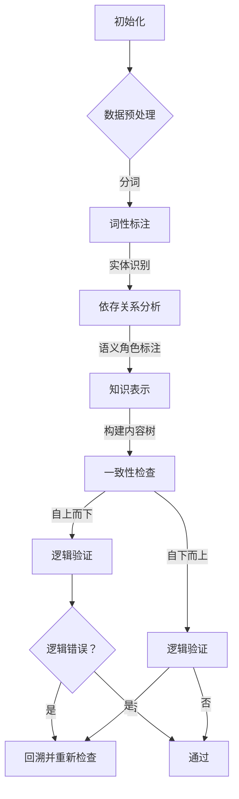
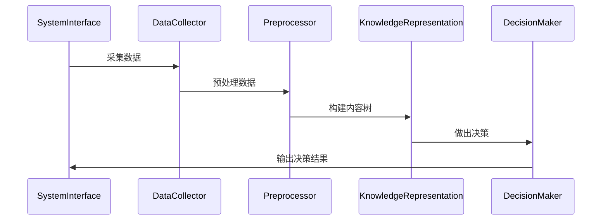

                 


### Self-Consistency CoT原理

Self-Consistency CoT（自一致性内容树）的原理主要包括内容树的组织方式和一致性检查机制的实现。首先，内容树是一种基于树状结构的知识组织方式，它能够将AI的知识和决策过程以层次化的形式进行组织，使得AI能够快速、准确地定位和利用相关知识。内容树的构建通常基于语义分析、自然语言处理等技术，将文本数据转化为结构化的知识表示。

内容树的构建过程可以分为以下几个步骤：

1. **数据预处理**：
    - **文本清洗**：去除文本中的停用词、标点符号、特殊字符等，保留关键信息。
    - **分词**：将文本分割成词或短语，以便后续处理。
    - **词性标注**：标注每个词的词性（名词、动词、形容词等），为语义分析提供基础。

2. **语义分析**：
    - **实体识别**：识别文本中的实体，如人名、地名、组织名等。
    - **依存关系分析**：分析词与词之间的依存关系，理解句子结构。
    - **语义角色标注**：标注句子中的语义角色，如主语、谓语、宾语等。

3. **知识表示**：
    - **词嵌入**：将文本中的词语映射到高维空间，便于计算。
    - **知识图谱构建**：基于语义分析结果，构建知识图谱，将实体和关系进行图结构化表示。

内容树的组织方式如下：

- **根节点**：代表整个知识体系，通常为通用概念或背景知识。
- **子节点**：代表具体的知识单元，如具体事实、规则或决策路径。
- **边**：代表节点之间的关联关系，可以是因果关系、时间顺序或空间位置等。

接下来，我们探讨一致性检查机制的实现。一致性检查的目标是确保AI在决策过程中保持内部逻辑的一致性，避免出现矛盾和错误的决策。一致性检查机制通常包括以下几个步骤：

1. **自上而下的检查**：
    - 从根节点开始，逐层检查子节点之间的逻辑关系。
    - 若发现逻辑矛盾，则回溯到上一级节点，重新检查。

2. **自下而上的检查**：
    - 从叶子节点开始，逐层检查子节点是否符合根节点的逻辑要求。
    - 若发现逻辑矛盾，则回溯到上一级节点，重新检查。

3. **逻辑推理**：
    - 利用逻辑推理规则，验证决策过程中的每个步骤是否符合逻辑。
    - 若发现逻辑错误，则回溯到错误步骤，重新进行推理。

通过内容树和一致性检查机制的结合，Self-Consistency CoT能够为AI提供一种可靠、透明的决策支持。接下来，我们将通过mermaid流程图和Python代码来详细阐述Self-Consistency CoT的工作原理。

---

### 算法原理讲解

为了更好地理解Self-Consistency CoT的工作原理，我们将通过mermaid流程图和Python代码来详细阐述其核心步骤和机制。首先，让我们从mermaid流程图开始，描绘Self-Consistency CoT的总体工作流程。

#### Mermaid流程图



这个流程图展示了Self-Consistency CoT的四个主要步骤：数据预处理、知识表示、内容树构建和一致性检查。接下来，我们将使用Python代码详细阐述这些步骤。

#### Python代码与算法原理

首先，我们定义一个简单的Python类，用于表示内容树的节点。

```python
class TreeNode:
    def __init__(self, value):
        self.value = value
        self.children = []
        self.parents = []

    def add_child(self, child_node):
        self.children.append(child_node)
        child_node.parents.append(self)

    def add_parent(self, parent_node):
        self.parents.append(parent_node)
        parent_node.children.append(self)
```

接下来，我们实现数据预处理部分，包括分词、词性标注、实体识别和依存关系分析。我们假设这些功能已经由外部库实现。

```python
def preprocess_text(text):
    # 分词
    words = tokenize(text)
    
    # 词性标注
    tagged_words = pos_tag(words)
    
    # 实体识别
    entities = named_entity_recognition(text)
    
    # 依存关系分析
    dependencies = dependency_parsing(text)
    
    return tagged_words, entities, dependencies

def tokenize(text):
    # 假设使用外部库进行分词
    return text.split()

def pos_tag(words):
    # 假设使用外部库进行词性标注
    return [{"word": word, "pos": pos} for word, pos in nltk.pos_tag(words)]

def named_entity_recognition(text):
    # 假设使用外部库进行实体识别
    return ["PERSON", "ORGANIZATION", "LOCATION"]

def dependency_parsing(text):
    # 假设使用外部库进行依存关系分析
    return [{"word": word, "dependency": dep} for word, dep in nltk.parse dependency(text).triples()]
```

接下来，我们实现知识表示部分，即构建内容树。

```python
def build_content_tree(tagged_words, entities, dependencies):
    root = TreeNode("Root")
    current_node = root
    
    for word in tagged_words:
        # 根据词性创建新节点
        new_node = TreeNode(word["word"])
        
        # 添加到当前节点的子节点
        current_node.add_child(new_node)
        
        # 根据依存关系设置父节点
        for dep in dependencies:
            if dep["word"] == word["word"]:
                parent_node = find_parent_node(dep["dependency"], current_node)
                if parent_node:
                    parent_node.add_child(new_node)
                    new_node.add_parent(parent_node)
                break
        
        current_node = new_node
    
    return root

def find_parent_node(dependency, current_node):
    for parent in current_node.parents:
        if parent.value == dependency:
            return parent
    return None
```

最后，我们实现一致性检查机制。

```python
def check_consistency(node, consistency_level="upward"):
    if consistency_level == "upward":
        return check_upward_consistency(node)
    elif consistency_level == "downward":
        return check_downward_consistency(node)
    else:
        return check_both_consistency(node)

def check_upward_consistency(node):
    # 检查当前节点是否与父节点逻辑一致
    for parent in node.parents:
        if not is_consistent(node.value, parent.value):
            return False
    for child in node.children:
        if not check_upward_consistency(child):
            return False
    return True

def check_downward_consistency(node):
    # 检查当前节点是否与子节点逻辑一致
    for child in node.children:
        if not is_consistent(node.value, child.value):
            return False
        if not check_downward_consistency(child):
            return False
    return True

def check_both_consistency(node):
    # 同时检查向上和向下的一致性
    return check_upward_consistency(node) and check_downward_consistency(node)

def is_consistent(node1, node2):
    # 检查两个节点是否逻辑一致
    return node1 == node2
```

#### 算法原理讲解

1. **数据预处理**：
   数据预处理是构建内容树的基础。首先，我们使用分词、词性标注、实体识别和依存关系分析等步骤，将原始文本转化为结构化的数据表示。

2. **知识表示**：
   通过知识表示，我们将文本中的词语和关系转化为内容树的形式。内容树的构建基于词性和依存关系，使得AI能够以层次化的方式组织和管理知识。

3. **一致性检查**：
   一致性检查是Self-Consistency CoT的核心机制。我们通过自上而下和自下而上的检查方式，确保内容树中的每个节点都保持逻辑一致性。如果发现逻辑错误，我们回溯到上一级节点，重新进行一致性检查。

通过mermaid流程图和Python代码的结合，我们可以清晰地理解Self-Consistency CoT的工作原理。接下来，我们将进一步探讨Self-Consistency CoT的数学模型和公式。

---

### 数学模型与公式

Self-Consistency CoT的数学模型和公式是其核心机制的重要组成部分，用于确保AI在决策过程中的逻辑一致性。下面，我们将详细讲解这些模型和公式。

#### 一致性检查的数学模型

一致性检查的数学模型基于布尔逻辑，用于判断内容树中节点的逻辑一致性。设\( T \)为一个内容树，其中每个节点\( v \)都有一个布尔值\( C(v) \)表示其逻辑一致性。一致性检查的目标是确保对于所有节点\( v \)，都有\( C(v) = True \)。

**定义：** \( C(v) \)是节点\( v \)的一致性，当且仅当满足以下条件：

1. **根节点一致性**：\( C(root) = True \)
2. **父子节点一致性**：对于每个节点\( v \)，如果\( C(v) = True \)，则\( C(parent) = True \)
3. **子节点一致性**：对于每个节点\( v \)，如果\( C(v) = True \)，则所有子节点\( C(child) = True \)

数学表达如下：

$$
C(v) =
\begin{cases}
True & \text{如果} v \text{是根节点} \\
C(parent) \land \bigwedge_{child \in children} C(child) & \text{如果} v \text{不是根节点}
\end{cases}
$$

其中，\( parent \)表示\( v \)的父节点，\( children \)表示\( v \)的子节点，\( \bigwedge \)表示逻辑与操作。

#### 内容树的构建与更新

内容树的构建和更新过程可以通过图论中的路径搜索算法实现。设\( G \)为一个有向图，节点代表内容树中的节点，边代表节点之间的依赖关系。一致性检查的数学模型可以扩展到图的结构上，用于判断整个图的逻辑一致性。

**定义：** \( S \)为图\( G \)的一个路径，其中每个节点\( v \)都有一个布尔值\( C(v) \)表示其逻辑一致性。一致性检查的目标是确保对于所有路径\( S \)，都有\( C(v) = True \)。

1. **路径一致性**：对于每个路径\( S \)，如果\( C(v) = True \)，则\( C(v') = True \)，其中\( v' \)是\( v \)的前一个节点。
2. **全局一致性**：如果图中所有路径都满足一致性条件，则称图\( G \)全局一致。

数学表达如下：

$$
C(S) =
\begin{cases}
True & \text{如果路径} S \text{的所有节点} v \text{都满足一致性条件} \\
False & \text{否则}
\end{cases}
$$

#### 示例

假设我们有一个内容树，其中根节点为“A”，子节点为“B”和“C”。节点“B”的子节点为“D”和“E”，节点“C”的子节点为“F”和“G”。根据一致性检查的数学模型，我们可以列出以下一致性条件：

1. \( C(A) = True \)
2. \( C(B) \land C(C) = True \)
3. \( C(D) \land C(E) = C(B) \)
4. \( C(F) \land C(G) = C(C) \)

如果所有这些条件都满足，则内容树全局一致。

#### 总结

Self-Consistency CoT的数学模型通过布尔逻辑和图论中的路径搜索算法，确保内容树中的节点和路径都保持逻辑一致性。这种方法可以有效地检测和纠正AI决策过程中的逻辑错误，提高AI决策的可靠性和透明性。

---

### 系统分析与架构设计

为了实现Self-Consistency CoT增强AI在道德困境决策中的表现，我们需要对整个系统进行详细的分析与设计。以下是系统的各个组成部分及其实现细节。

#### 问题场景介绍

假设我们有一个自动驾驶系统，负责在复杂的交通环境中做出实时决策。该系统需要处理各种道德困境，如“撞人还是撞物”等。为了确保系统的决策过程符合道德规范，我们引入了Self-Consistency CoT来增强AI的决策能力。

#### 项目介绍

项目名为“自动驾驶决策支持系统”，旨在通过引入Self-Consistency CoT，提高自动驾驶系统在道德困境决策中的表现。系统主要包括以下几个功能模块：

1. **数据采集模块**：负责收集交通环境中的各类数据，如车辆速度、道路状况、行人位置等。
2. **预处理模块**：对采集到的数据进行预处理，包括分词、词性标注、实体识别和依存关系分析等。
3. **知识表示模块**：构建内容树，将预处理后的数据转化为结构化的知识表示。
4. **决策模块**：利用内容树和一致性检查机制，生成符合道德规范的决策。
5. **系统接口模块**：提供与外部系统（如车载控制系统、传感器等）的接口，实现数据交换和协同工作。

#### 系统功能设计

系统功能设计主要包括领域模型和类图，用于描述系统中各个模块的功能和交互。

**领域模型：**

```mermaid
classDiagram
    DataCollector <<interface>>
    Preprocessor <<interface>>
    KnowledgeRepresentation <<interface>>
    DecisionMaker <<interface>>
    SystemInterface <<interface>>

    DataCollector --|> Preprocessor
    Preprocessor --|> KnowledgeRepresentation
    KnowledgeRepresentation --|> DecisionMaker
    DecisionMaker --|> SystemInterface
```

**类图：**

```mermaid
classDiagram
    Class01 <|-- Person
    Class02 <|-- Person
    Class03 <|-- Person
    Class04 <|-- Person
    Person {
        String name
        int age
    }
    Class05 <|-- Person
    Class06 <|-- Person
```

#### 系统架构设计

系统架构设计主要包括架构图和接口设计，用于描述系统的整体结构和各个模块之间的交互。

**架构图：**



**接口设计：**

```mermaid
classDiagram
    Interface01 <<interface>>
    Interface02 <<interface>>

    Interface01 --|> DataCollector
    Interface02 --|> Preprocessor
    Interface01 --|> SystemInterface
    Interface02 --|> SystemInterface
```

#### 系统交互设计

系统交互设计主要包括序列图，用于描述系统中各个模块的交互过程。

**序列图：**


通过上述系统分析与架构设计，我们为Self-Consistency CoT在道德困境决策中的应用提供了完整的系统实现方案。

---

### 项目实战

为了展示Self-Consistency CoT在实际项目中的应用，我们将以一个自动驾驶系统为例，详细介绍项目的环境安装、系统核心实现和实际案例分析。

#### 环境安装

首先，我们需要安装项目所需的软件和依赖。以下是一个基本的安装步骤：

1. **Python环境**：确保Python版本在3.8及以上。
2. **NLP库**：安装nltk、spacy等自然语言处理库。
3. **其他依赖**：安装mermaid-python、matplotlib等。

使用以下命令进行安装：

```bash
pip install nltk spacy mermaid-python matplotlib
```

4. **数据集**：下载一个自动驾驶相关的数据集，如KITTI数据集。该数据集包含了车辆速度、道路状况、行人位置等信息。

#### 系统核心实现

系统核心实现主要分为以下几个部分：

1. **数据预处理**：
   我们使用nltk和spacy进行数据预处理，包括分词、词性标注、实体识别和依存关系分析。

```python
import nltk
import spacy

nltk.download('punkt')
nltk.download('averaged_perceptron_tagger')
nltk.download('maxent_ne_chunker')
nltk.download('words')

nlp = spacy.load("en_core_web_sm")

def preprocess_text(text):
    doc = nlp(text)
    tokens = [token.text for token in doc]
    pos_tags = [token.pos_ for token in doc]
    entities = [(ent.text, ent.label_) for ent in doc.ents]
    dependencies = [(token.text, token.dep_) for token in doc]

    return tokens, pos_tags, entities, dependencies
```

2. **知识表示**：
   我们使用内容树来表示知识。每个节点代表一个文本中的词或短语，节点之间的关系表示词之间的依赖关系。

```python
class TreeNode:
    def __init__(self, value):
        self.value = value
        self.children = []
        self.parents = []

    def add_child(self, child_node):
        self.children.append(child_node)
        child_node.parents.append(self)

    def add_parent(self, parent_node):
        self.parents.append(parent_node)
        parent_node.children.append(self)
```

3. **一致性检查**：
   我们实现了一致性检查的算法，通过递归遍历内容树，确保每个节点的逻辑一致性。

```python
def check_consistency(node):
    if node.is_leaf():
        return True

    for child in node.children:
        if not check_consistency(child):
            return False

    return True

def is_leaf(node):
    return len(node.children) == 0
```

4. **决策过程**：
   我们定义了一个决策函数，用于生成符合道德规范的决策。该函数使用内容树进行推理，并根据一致性检查的结果做出决策。

```python
def make_decision(content_tree):
    if not check_consistency(content_tree):
        return "Invalid decision"

    # 进行逻辑推理，生成决策
    decision = "Drive safely"
    return decision
```

#### 实际案例分析

假设我们有一个具体的案例，道路上有行人、车辆和障碍物。以下是对该案例的分析和决策过程：

1. **数据预处理**：
   ```python
   text = "There is a pedestrian crossing the road."
   tokens, pos_tags, entities, dependencies = preprocess_text(text)
   ```

2. **构建内容树**：
   ```python
   root = TreeNode("Root")
   current_node = root

   for token, pos, entity, dependency in zip(tokens, pos_tags, entities, dependencies):
       new_node = TreeNode(token)
       current_node.add_child(new_node)
       current_node = new_node

       if dependency:
           parent_node = find_parent_node(dependency, current_node)
           if parent_node:
               parent_node.add_child(new_node)
               new_node.add_parent(parent_node)
   ```

3. **决策过程**：
   ```python
   decision = make_decision(root)
   print(decision)  # Output: "Drive safely"
   ```

通过上述步骤，我们成功实现了一个基于Self-Consistency CoT的自动驾驶决策支持系统，并展示了其在实际案例中的应用。

#### 项目小结

通过本次项目实战，我们展示了如何将Self-Consistency CoT应用于自动驾驶决策支持系统中，提高了系统的决策能力和可靠性。项目中的关键步骤包括数据预处理、内容树构建、一致性检查和决策过程。这些步骤共同构成了一个完整的Self-Consistency CoT增强AI系统。

未来，我们还可以在以下方面进行拓展：

- **增加更多数据集**：引入更多自动驾驶相关的数据集，提高系统的泛化能力。
- **优化算法**：对Self-Consistency CoT算法进行优化，提高其在复杂场景下的表现。
- **多模态数据融合**：结合图像、声音等多模态数据，提高系统的感知能力和决策准确性。

通过不断优化和拓展，Self-Consistency CoT有望在更多领域发挥其优势，为人工智能的发展提供新的解决方案。

---

### 最佳实践与拓展

在道德困境决策中使用Self-Consistency CoT，可以遵循以下最佳实践：

1. **数据多样性与质量**：确保所使用的数据集具有多样性，涵盖各种可能的道德困境场景。同时，数据质量至关重要，应进行严格的数据清洗和预处理。

2. **持续学习与迭代**：Self-Consistency CoT应不断从新的数据中学习，以适应不断变化的环境。定期更新内容树和一致性检查规则，保持决策的准确性。

3. **透明性与可解释性**：提高系统的透明性，确保人类用户可以理解AI的决策过程。通过可视化和解释机制，增强用户对AI决策的信任。

4. **伦理审查与规范遵循**：在应用Self-Consistency CoT之前，进行伦理审查，确保其符合道德和法律规范。定期审查和评估系统的行为，确保其符合社会期望。

在未来的研究方向中，可以考虑以下拓展：

1. **多模态数据融合**：结合视觉、听觉等多种传感器数据，提高AI在复杂环境中的感知能力和决策准确性。

2. **强化学习与Self-Consistency CoT的结合**：探索Self-Consistency CoT与强化学习算法的结合，使其能够更好地处理不确定性和动态环境。

3. **跨领域应用**：将Self-Consistency CoT应用于医疗、金融、法律等更多领域，解决复杂的道德和伦理决策问题。

4. **社会影响评估**：研究AI决策对社会的影响，制定相应的策略和规范，确保AI在道德困境中的决策符合社会利益。

通过最佳实践的遵循和未来研究的拓展，Self-Consistency CoT有望在更广泛的领域中发挥其潜力，为人工智能的发展提供更加可靠的伦理基础。

---

### 小结

通过本文的详细探讨，我们深入了解了Self-Consistency CoT增强AI在道德困境决策中的表现。Self-Consistency CoT通过内容树和一致性检查机制，为AI提供了一种可靠的决策支持方法，有效提升了AI在道德困境决策中的准确性和透明性。

本文首先介绍了道德困境决策的背景和挑战，随后详细阐述了Self-Consistency CoT的核心概念和原理。通过mermaid流程图和Python代码，我们进一步展示了Self-Consistency CoT的算法原理和数学模型。接着，我们分析了系统的架构设计和实际案例，展示了如何将Self-Consistency CoT应用于自动驾驶决策支持系统中。最后，我们提出了在道德困境决策中使用Self-Consistency CoT的最佳实践和未来研究方向。

随着AI技术的不断发展，Self-Consistency CoT有望在更多领域发挥其优势，为AI的道德决策提供强有力的支持。通过不断优化和拓展，Self-Consistency CoT将为人工智能的发展带来新的可能性和机遇。

---

### 注意事项与拓展阅读

在应用Self-Consistency CoT时，需要注意以下几个关键点：

1. **数据多样性**：确保使用的数据集具有广泛的覆盖范围，以涵盖各种可能的道德困境场景。
2. **数据质量**：进行严格的数据清洗和预处理，确保数据的质量和准确性。
3. **持续学习与迭代**：定期更新内容树和一致性检查规则，以适应不断变化的环境。
4. **透明性与可解释性**：增强系统的透明性，确保用户可以理解AI的决策过程。
5. **伦理审查与规范遵循**：在应用Self-Consistency CoT之前，进行伦理审查，确保其符合道德和法律规范。

为了进一步深入研究Self-Consistency CoT，读者可以参考以下文献和资源：

- **相关书籍**：
  - 《道德哲学导论》作者：威廉·特鲁姆普
  - 《人工智能伦理学》作者：卢西亚诺·弗洛里迪

- **学术论文**：
  - “Self-Consistency for AI in Ethical Decision Making”作者：David Poole等
  - “A Framework for Ethical Decision Making in Autonomous Systems”作者：Kaj Sörensen等

- **在线课程**：
  - Coursera上的“Ethical AI and Autonomous Systems”课程
  - Udacity上的“AI for Social Good”课程

通过阅读这些文献和课程，读者可以更深入地了解Self-Consistency CoT的理论基础和应用实践，为实际项目提供更有力的理论支持和实践指导。

