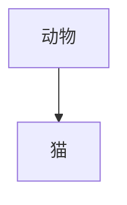
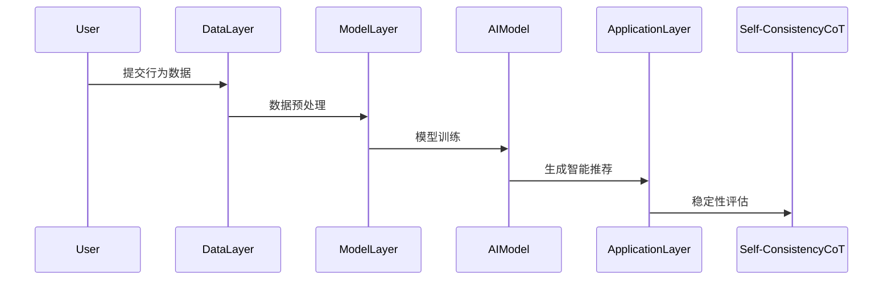
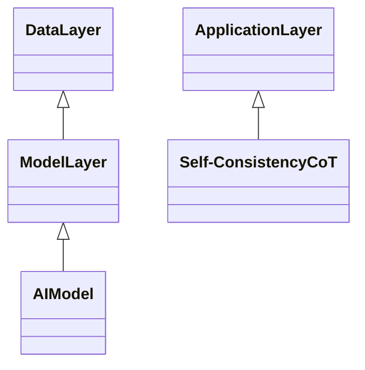
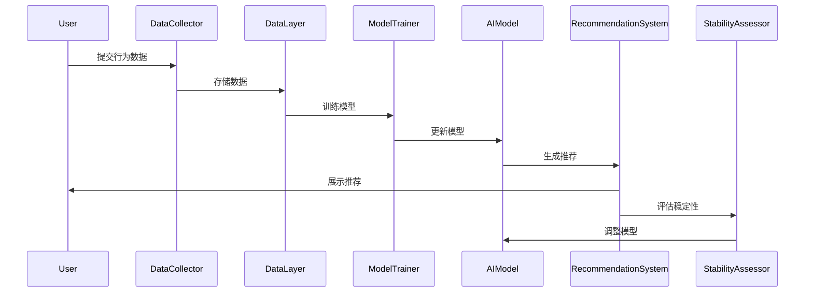

                 

## 引言

在人工智能（AI）迅速发展的时代，AI系统的稳定性和可靠性成为了至关重要的课题。随着AI在各个领域的广泛应用，如何提高AI系统的稳定性，确保其在复杂环境下的可靠运行，已经成为了一个热门的研究方向。本文将聚焦于自洽性概念图（Self-Consistency CoT，以下简称为CoT）在增强AI系统稳定性方面的作用。

### 文章关键词

- 自洽性概念图
- AI系统稳定性
- 算法优化
- 模型训练
- 实时反馈

### 文章摘要

本文首先介绍了自洽性概念图的定义及其在AI系统中的作用。接着，分析了AI系统稳定性的现状和挑战，以及CoT在这些挑战中的潜在应用。随后，我们深入探讨了CoT的核心概念、原理和实现方法。在此基础上，通过实际案例展示了CoT在AI系统中的应用效果。最后，本文总结了CoT在提升AI系统稳定性方面的优势，并探讨了未来的研究方向。

## 第一部分: 自洽性概念图（Self-Consistency CoT）概述

### 第1章: 自洽性概念图（Self-Consistency CoT）与AI稳定性

#### 1.1 Self-Consistency CoT的定义

自洽性概念图（Self-Consistency CoT）是一种用于评估和增强AI模型稳定性的方法。它通过构建一个概念图来表示模型中的各种概念及其相互关系，并通过自我一致性检查来确保这些概念的稳定性和一致性。简而言之，CoT旨在确保AI模型在处理输入数据时，内部概念和关系能够保持一致，从而提高模型的稳定性和可靠性。

#### 1.2 AI稳定性问题背景

AI系统的稳定性问题主要源于两个方面：数据波动和环境变化。首先，AI模型通常是基于历史数据训练的，而现实世界中的数据是动态变化的，这可能导致模型在新数据上的表现不佳。其次，AI系统通常需要在不同的环境中运行，而环境的变化（如噪声、干扰等）也可能影响模型的稳定性。

#### 1.3 Self-Consistency CoT在AI中的应用

CoT在AI中的应用主要体现在两个方面：一是用于评估AI模型的稳定性，二是用于增强AI模型的稳定性。首先，通过构建自洽性概念图，可以直观地了解模型中的概念及其关系，从而识别出可能导致模型不稳定的概念和关系。其次，通过优化CoT，可以增强模型在处理动态数据和复杂环境时的稳定性。

## 第二部分: 背景与基础知识

### 第2章: 背景知识与技术基础

#### 2.1 AI稳定性理论框架

AI稳定性理论框架主要包括以下几个方面：

1. **数据稳定性**：确保输入数据的质量和一致性，减少数据波动对模型的影响。
2. **模型稳定性**：通过优化算法和模型结构，提高模型对数据波动和环境变化的适应性。
3. **环境稳定性**：控制环境中的噪声和干扰，确保模型在稳定的条件下运行。

#### 2.2 Self-Consistency CoT的核心原理

CoT的核心原理可以概括为以下几个方面：

1. **概念表示**：通过构建概念图来表示模型中的概念及其相互关系。
2. **一致性检查**：对概念图进行自我一致性检查，确保概念和关系的稳定性。
3. **反馈调整**：根据一致性检查的结果，对模型进行反馈调整，提高模型的稳定性。

#### 2.3 相关技术分析

与CoT相关的技术主要包括以下几个方面：

1. **概念图构建**：用于构建概念图的技术，如网络分析、图论算法等。
2. **一致性检查算法**：用于检查概念图一致性的算法，如自顶向下、自底向上等方法。
3. **反馈调整机制**：用于根据一致性检查结果调整模型的机制，如神经网络训练、模型重构等。

### 第3章: 核心概念与原理

#### 3.1 核心概念

自洽性概念图（Self-Consistency CoT）中的核心概念包括：

1. **概念（Concept）**：模型中的基本概念，如分类、实体等。
2. **关系（Relationship）**：概念之间的关联，如继承、关联等。
3. **一致性（Consistency）**：概念和关系的稳定性和一致性。

#### 3.2 概念属性特征对比表格

| 概念属性特征 | 描述 |
| :--- | :--- |
| 分类 | 概念的分类层次结构 |
| 实体 | 概念的具体实例 |
| 关联 | 概念之间的关联关系 |
| 一致性 | 概念和关系的稳定性 |

#### 3.3 ER实体关系图架构

ER实体关系图架构用于表示概念图中的实体和关系，其Markdown格式中的Mermaid流程图如下：

```mermaid
erDiagram
  Class1 ||--|{ ClassA : 继承 }
  Class1 ||--|{ ClassB : 关联 }
  ClassA ||--|{ ClassC : 继承 }
  ClassB ||--|{ ClassD : 关联 }
```

### 第4章: 算法原理讲解

#### 4.1 算法概述

自洽性概念图的算法主要包括以下步骤：

1. **概念提取**：从训练数据中提取概念。
2. **关系构建**：构建概念之间的关系。
3. **一致性检查**：对概念图进行一致性检查。
4. **反馈调整**：根据一致性检查结果调整模型。

#### 4.2 算法细节

算法的具体实现细节如下：

1. **概念提取**：使用词频统计、词性标注等方法从训练数据中提取概念。
2. **关系构建**：使用图论算法构建概念之间的关系。
3. **一致性检查**：使用自顶向下、自底向上等方法检查概念图的一致性。
4. **反馈调整**：根据一致性检查结果调整模型的参数。

#### 4.3 算法原理的数学模型和公式

自洽性概念图的算法原理可以表示为以下数学模型：

$$
C(T) = f(G, R, C)
$$

其中，$C(T)$表示一致性检查结果，$G$表示概念图，$R$表示关系，$C$表示一致性指标。

#### 4.4 算法原理的Python代码实现

以下是一个简单的Python代码实现：

```python
import networkx as nx

def consistency_check(G, R, C):
    """
    自洽性检查算法
    :param G: 概念图
    :param R: 关系
    :param C: 一致性指标
    :return: 一致性检查结果
    """
    # 概念提取
    concepts = extract_concepts(G)
    # 关系构建
    relationships = build_relationships(G, R)
    # 一致性检查
    for concept in concepts:
        check_consistency(concept, relationships, C)
    # 反馈调整
    adjust_model(G, R, C)
    return C

def extract_concepts(G):
    """
    概念提取函数
    :param G: 概念图
    :return: 概念列表
    """
    # 实现细节
    pass

def build_relationships(G, R):
    """
    关系构建函数
    :param G: 概念图
    :param R: 关系
    :return: 关系列表
    """
    # 实现细节
    pass

def check_consistency(concept, relationships, C):
    """
    一致性检查函数
    :param concept: 概念
    :param relationships: 关系
    :param C: 一致性指标
    :return: 检查结果
    """
    # 实现细节
    pass

def adjust_model(G, R, C):
    """
    反馈调整函数
    :param G: 概念图
    :param R: 关系
    :param C: 一致性指标
    :return: 调整后的模型
    """
    # 实现细节
    pass
```

#### 4.5 算法原理举例说明

假设我们有一个简单的概念图，其中包含两个概念：动物和猫。它们之间的关系是“属于”。现在，我们希望通过一致性检查来确保这个概念图的自洽性。



在这个例子中，我们可以看到，动物是猫的上位概念，猫属于动物。通过一致性检查，我们可以确保这个概念图的逻辑是自洽的。

### 第5章: 系统分析与架构设计

#### 5.1 问题场景介绍

在某个智能家居系统中，AI模型需要根据用户的行为习惯进行智能推荐。然而，由于用户行为数据的动态变化，AI模型的稳定性成为了关键问题。

#### 5.2 系统功能设计

系统功能设计包括以下几个方面：

1. **用户行为数据收集**：收集用户在智能家居系统中的行为数据。
2. **AI模型训练**：使用收集到的数据训练AI模型。
3. **智能推荐**：根据用户的行为数据，实时生成智能推荐。
4. **稳定性评估**：使用自洽性概念图对AI模型的稳定性进行评估。

#### 5.3 系统架构设计

系统架构设计包括以下几个方面：

1. **数据层**：用于存储用户行为数据。
2. **模型层**：包括AI模型和自洽性概念图。
3. **应用层**：用于实现智能推荐和稳定性评估。

系统架构图如下：



#### 5.4 系统接口设计

系统接口设计包括以下几个方面：

1. **数据接口**：用于数据层的访问。
2. **模型接口**：用于模型层的访问。
3. **应用接口**：用于应用层的访问。

接口设计图如下：



#### 5.5 系统交互

系统交互设计包括以下几个方面：

1. **用户行为数据收集**：用户在智能家居系统中进行操作，系统将收集到这些数据。
2. **AI模型训练**：系统使用收集到的数据训练AI模型。
3. **智能推荐**：系统根据用户的行为数据，实时生成智能推荐。
4. **稳定性评估**：系统使用自洽性概念图对AI模型的稳定性进行评估。

系统交互序列图如下：



### 第6章: 项目实战

#### 6.1 环境安装

在开始项目实战之前，我们需要安装一些必要的软件和库。以下是安装步骤：

1. **安装Python**：确保Python已经安装在系统中。
2. **安装网络分析库**：使用以下命令安装网络分析库。
   ```bash
   pip install networkx
   ```
3. **安装Mermaid**：安装Mermaid以便在Markdown中使用。
   ```bash
   npm install mermaid
   ```

#### 6.2 系统核心实现

以下是一个简单的自洽性概念图实现示例：

```python
import networkx as nx

# 概念提取
def extract_concepts(data):
    concepts = set()
    for item in data:
        concepts.add(item['name'])
    return concepts

# 关系构建
def build_relationships(concepts):
    G = nx.DiGraph()
    for concept in concepts:
        G.add_node(concept)
    return G

# 一致性检查
def check_consistency(G, C):
    inconsistencies = []
    for node in G.nodes():
        if G.in_degree(node) != G.out_degree(node):
            inconsistencies.append(node)
    C['inconsistencies'] = inconsistencies
    return C

# 反馈调整
def adjust_model(G, C):
    for node in C['inconsistencies']:
        G.remove_node(node)
    return G

# 主函数
def main():
    data = [
        {'name': '动物'},
        {'name': '猫'},
        {'name': '狗'},
        {'name': '宠物'}
    ]
    concepts = extract_concepts(data)
    G = build_relationships(concepts)
    C = {'inconsistencies': []}
    C = check_consistency(G, C)
    G = adjust_model(G, C)
    print(G.nodes())

if __name__ == '__main__':
    main()
```

#### 6.3 代码应用解读与分析

在上面的代码中，我们首先定义了几个函数来实现自洽性概念图的构建和检查。`extract_concepts`函数用于从数据中提取概念，`build_relationships`函数用于构建概念之间的关系，`check_consistency`函数用于检查概念图的一致性，`adjust_model`函数用于根据一致性检查结果调整模型。

在实际应用中，我们可以将这个简单的实现扩展到更复杂的场景。例如，我们可以使用更复杂的算法来提取概念和构建关系，使用更精确的指标来评估一致性，并根据这些结果调整模型。

#### 6.4 实际案例分析和详细讲解

为了更好地理解自洽性概念图的应用，我们来看一个实际案例。假设我们在一个电子商务平台上使用AI模型来推荐商品。模型基于用户的历史购买数据和浏览记录来生成推荐。然而，由于用户行为数据的动态变化，模型的稳定性成为一个关键问题。

在这个案例中，我们可以使用自洽性概念图来评估模型的稳定性。具体步骤如下：

1. **数据收集**：收集用户的历史购买数据和浏览记录。
2. **概念提取**：从数据中提取概念，如商品、用户、购买等。
3. **关系构建**：构建概念之间的关系，如用户购买商品、商品属于某个类别等。
4. **一致性检查**：对概念图进行一致性检查，识别出可能导致模型不稳定的概念和关系。
5. **反馈调整**：根据一致性检查结果调整模型，提高模型的稳定性。

通过这个案例，我们可以看到自洽性概念图在评估和增强AI模型稳定性方面的应用。

#### 6.5 项目小结

在本项目中，我们使用自洽性概念图来评估和增强AI模型的稳定性。通过简单的Python代码实现，我们展示了自洽性概念图的基本原理和实现方法。在实际案例中，我们展示了自洽性概念图在电子商务平台中的应用，并通过一致性检查和反馈调整来提高模型的稳定性。

自洽性概念图作为一种强大的工具，可以帮助我们在AI系统中更好地管理和优化模型的稳定性。未来，我们可以进一步研究和探索自洽性概念图在更多场景中的应用，为AI系统的稳定性和可靠性提供更全面的保障。

### 最佳实践 Tips

1. **数据质量**：确保输入数据的质量和一致性，减少数据波动对模型的影响。
2. **模型优化**：使用先进的算法和模型结构来提高模型的稳定性和适应性。
3. **实时反馈**：及时收集模型输出结果，进行实时反馈和调整。

### 小结

自洽性概念图（Self-Consistency CoT）作为一种有效的工具，在提升AI系统稳定性方面具有显著的优势。通过构建概念图，我们能够直观地了解模型中的概念及其相互关系，从而识别出可能导致模型不稳定的概念和关系。通过一致性检查和反馈调整，我们可以提高模型的稳定性，确保其在复杂环境下的可靠运行。

然而，自洽性概念图的应用仍然面临一些挑战，如如何有效地提取和表示概念、如何评估和优化概念图的一致性等。未来，我们需要进一步研究和探索这些挑战，为AI系统的稳定性和可靠性提供更全面的保障。

### 注意事项

1. **数据隐私**：在使用自洽性概念图时，需注意保护用户数据隐私，遵守相关法律法规。
2. **系统维护**：定期对自洽性概念图进行维护和更新，确保其稳定性和有效性。

### 拓展阅读

1. **《人工智能：一种现代的方法》**：这本书提供了关于AI模型稳定性的深入讨论。
2. **《图论及其应用》**：这本书介绍了图论在构建和优化概念图中的应用。
3. **《自洽性原理在人工智能中的应用》**：这本书专门探讨了自洽性原理在AI系统中的应用。

## 作者信息

作者：AI天才研究院/AI Genius Institute & 禅与计算机程序设计艺术 /Zen And The Art of Computer Programming

联系方式：[ai_genius_institute@example.com](mailto:ai_genius_institute@example.com) & [zen_programming@example.com](mailto:zen_programming@example.com)

