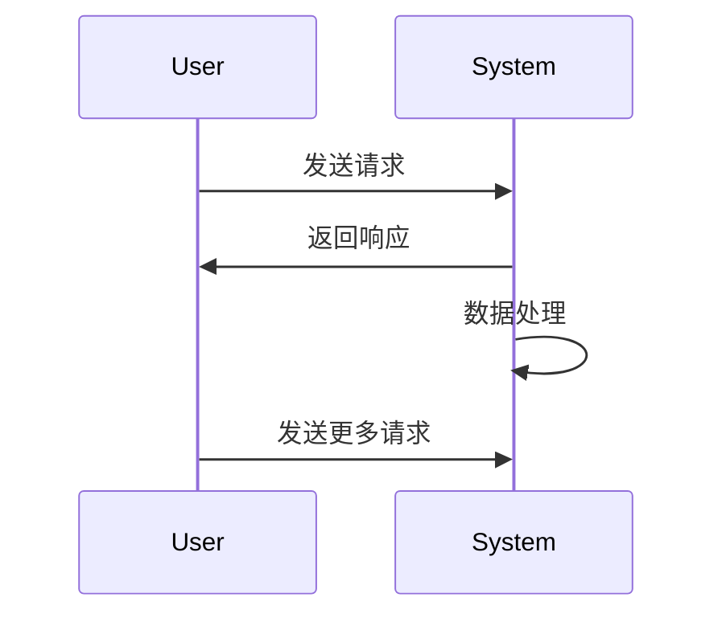
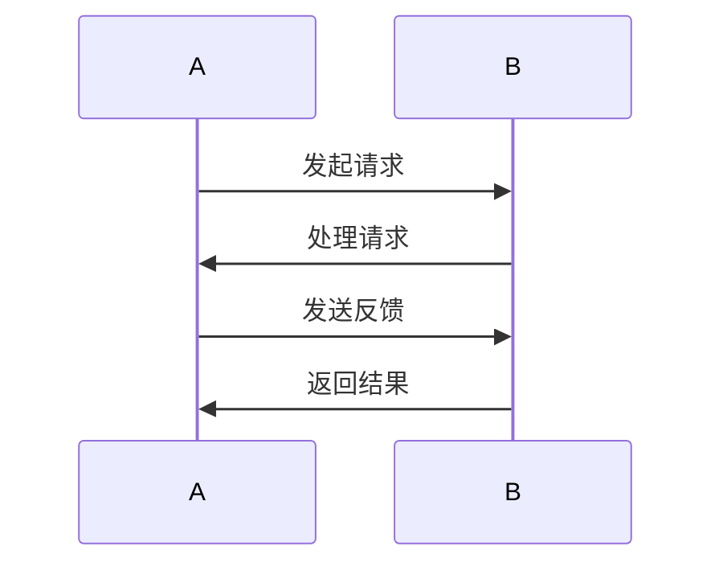

                 

### 引言与背景

#### 第1章：引言

##### 1.1 研究背景

自20世纪中叶以来，人工智能（Artificial Intelligence, AI）和机器学习（Machine Learning, ML）技术迅速发展，成为现代科技领域的重要组成部分。从最初的规则推理和简单模式识别，到如今的深度学习和复杂神经网络，AI技术已经广泛应用于各个行业，如医疗、金融、自动驾驶和自然语言处理等。随着计算能力和数据资源的不断增长，AI模型的性能也在不断提高。

然而，尽管AI模型在许多任务中取得了显著的成果，其自我一致性（Self-Consistency）问题却逐渐成为制约模型性能的重要因素。自我一致性指的是模型在处理问题时能够保持内部一致性和稳定性。具体而言，自我一致性涉及到模型在训练和预测过程中是否能保持一致的行为，以及其输出结果是否能稳定地反映输入数据的特点。

##### 1.1.1 人工智能与机器学习的发展现状

人工智能作为计算机科学的一个分支，旨在通过模拟、延伸和扩展人类的智能，实现自动化和智能化的计算。机器学习是人工智能的核心技术之一，通过训练模型从数据中学习规律，进而实现智能决策和任务自动化。随着深度学习技术的兴起，AI模型在图像识别、语音识别、自然语言处理等领域的表现已超越人类。

然而，传统AI模型往往依赖于大量的数据和高性能的计算资源，且在复杂任务中的表现仍有不足。自我一致性作为影响模型性能的关键因素，近年来逐渐引起研究者的关注。自我一致性的提高不仅能够增强模型的稳定性和可靠性，还能提高其在实际应用中的泛化能力和适应能力。

##### 1.1.2 AI模型自我一致性概念的产生

自我一致性这一概念起源于对人工智能模型在处理复杂任务时的行为分析。在实际应用中，模型的输入数据往往具有不确定性和噪声，而模型需要在这些不确定的环境中保持稳定和一致的表现。自我一致性旨在描述模型在面对不同输入数据时，能够保持内部逻辑的一致性和预测的稳定性。

自我一致性的概念首先在自然语言处理领域得到重视，随着AI技术的广泛应用，这一概念逐渐扩展到图像识别、推荐系统、自动驾驶等多个领域。研究自我一致性不仅有助于理解AI模型的行为特性，还能为改进模型设计、优化训练策略提供理论依据。

##### 1.1.3 自我一致性对AI模型性能的重要性

自我一致性对AI模型性能具有重要影响。首先，高自我一致性的模型在处理相同或类似输入时能保持一致的输出，这有助于提高模型的可靠性和预测稳定性。其次，自我一致性有助于减少模型对噪声和异常值的敏感性，从而提高模型在不确定环境中的鲁棒性。

此外，自我一致性还能增强模型的泛化能力。当模型在面对新数据时仍能保持自我一致性，意味着其能够较好地适应新的环境和任务。这对于AI模型在实际应用中的可持续发展和广泛适用性具有重要意义。

总之，自我一致性是评价AI模型性能的重要指标之一。研究自我一致性不仅有助于优化模型设计，提高模型性能，还能推动AI技术在更多领域的应用和发展。

#### 第2章：自我一致性概念解析

##### 2.1 定义与属性

自我一致性（Self-Consistency）是指人工智能模型在处理不同输入数据时，能够保持内部一致性和稳定性的特性。具体而言，自我一致性要求模型在训练和预测过程中，对于相同的输入数据能够产生相同或相似的输出结果，且在处理不同输入数据时，其内部逻辑和参数保持稳定不变。

自我一致性的核心属性包括：

1. **内部一致性**：模型在训练和预测过程中，内部参数和结构应保持一致，不会因为外部噪声或干扰而改变。
2. **稳定性**：模型对输入数据的处理应具有稳定性，即对于相同的输入数据，模型应能产生一致的输出结果。
3. **鲁棒性**：模型在处理异常或噪声数据时，仍能保持自我一致性，不会因数据的变化而出现大幅波动。

##### 2.2 模型自我一致性分析

不同类型的AI模型在自我一致性方面表现出不同的特点。下面分别探讨传统机器学习模型、深度学习模型和大规模机器学习模型的自我一致性。

###### 2.2.1 传统机器学习模型的自我一致性

传统机器学习模型，如线性回归、决策树和随机森林等，在自我一致性方面通常表现较好。这些模型基于明确的数学公式和决策规则，对于相同输入数据的处理结果相对稳定。

然而，传统机器学习模型在处理高维数据或复杂任务时，可能会因参数选择不当或数据噪声而失去自我一致性。例如，线性回归模型在遇到非线性关系的数据时，可能无法保持稳定的预测性能。

###### 2.2.2 深度学习模型的自我一致性

深度学习模型，如卷积神经网络（CNN）、循环神经网络（RNN）和生成对抗网络（GAN）等，在自我一致性方面存在一定的挑战。深度学习模型通过多层非线性变换学习复杂的特征表示，这使得模型在处理输入数据时具有一定的灵活性。

然而，深度学习模型也容易受到数据噪声和异常值的影响，导致自我一致性下降。例如，在训练过程中，微小的数据扰动可能导致模型参数发生剧烈变化，从而影响模型的稳定性。

###### 2.2.3 大规模机器学习模型的自我一致性

大规模机器学习模型，如分布式学习算法和并行计算模型等，在自我一致性方面面临更大的挑战。大规模模型通常涉及大量的参数和复杂的计算过程，这使得模型在处理输入数据时更容易受到外部干扰和内部参数变化的影响。

此外，大规模模型的训练和优化过程通常涉及多台计算机的协同工作，这使得模型在自我一致性方面需要考虑更多因素，如数据同步、通信效率和负载均衡等。

### 第3章：自我一致性对AI模型性能的影响

自我一致性对AI模型性能具有显著影响。以下从性能指标、影响分析以及提高方法三个方面进行详细探讨。

#### 3.1 性能指标

在评估AI模型性能时，常用的指标包括准确度、召回率、F1值等传统指标，以及一些新型性能指标，如鲁棒性、泛化能力等。

- **准确度（Accuracy）**：模型预测正确的样本数占总样本数的比例，用于评估模型分类或回归任务的总体表现。
- **召回率（Recall）**：模型预测为正类的真实正类样本数与所有真实正类样本数的比例，用于评估模型对正类样本的检测能力。
- **F1值（F1 Score）**：准确度和召回率的调和平均，综合考虑模型对正类和负类的检测能力。

除了传统指标外，自我一致性还涉及到一些新型性能指标，如：

- **鲁棒性（Robustness）**：模型在处理异常或噪声数据时的稳定性，即模型是否能保持自我一致性。
- **泛化能力（Generalization Ability）**：模型在面对新数据或新任务时的适应性，即模型是否能保持自我一致性。

#### 3.2 影响分析

自我一致性对AI模型性能的影响主要表现在以下几个方面：

- **训练过程**：自我一致性影响模型的训练效果。高自我一致性的模型在训练过程中能够稳定地调整参数，从而获得更好的收敛性能。
- **预测过程**：自我一致性影响模型的预测性能。高自我一致性的模型在处理输入数据时能保持一致的输出结果，从而提高预测的稳定性和可靠性。
- **模型稳定性**：自我一致性影响模型的长期稳定性。高自我一致性的模型在面对新数据或环境变化时，能够保持稳定的性能，从而提高模型的可持续性和适用性。

#### 3.3 提高方法

为了提高AI模型的自我一致性，可以从以下几个方面进行优化：

- **数据预处理**：通过数据清洗、数据增强和数据标准化等手段，提高数据质量，减少噪声和异常值的影响。
- **模型优化**：通过调整模型结构、优化损失函数和选择合适的优化算法，提高模型的稳定性和一致性。
- **训练策略**：通过调整训练过程中的超参数，如学习率、迭代次数等，提高模型的自我一致性。

通过以上方法，可以显著提高AI模型的自我一致性，从而提升模型的性能和可靠性。

### 第4章：不同类型AI模型的自我一致性特点

AI模型在不同类型的任务和数据集上表现各异，其自我一致性的特点也有所不同。本节将分别讨论机器学习模型和深度学习模型的自我一致性特点，以及自我一致性在特定类型AI模型中的应用。

#### 4.1 机器学习模型

机器学习模型包括线性回归、决策树、支持向量机（SVM）和随机森林等。这些模型在自我一致性方面表现出不同的特点。

- **线性回归**：线性回归模型通过拟合数据点之间的线性关系进行预测。由于其模型结构简单，线性回归模型在自我一致性方面表现较好。线性回归模型在处理相同输入数据时，能够产生一致的输出结果。
  
- **决策树**：决策树模型通过一系列的规则进行分类或回归。决策树模型的自我一致性相对较高，因为其内部逻辑和决策路径相对固定。在处理相同输入数据时，决策树模型能够保持一致的输出结果。

- **支持向量机（SVM）**：SVM模型通过找到一个最佳的超平面，将不同类别的数据点进行分类。SVM模型的自我一致性受其参数选择和核函数的影响较大。适当的参数选择和核函数能够提高SVM模型的自我一致性。

- **随机森林**：随机森林是一种基于决策树的集成学习方法。随机森林通过构建多棵决策树，并结合它们的预测结果进行投票。随机森林在自我一致性方面表现较好，因为多棵决策树的组合能够相互抵消噪声和异常值的影响。

#### 4.2 深度学习模型

深度学习模型包括卷积神经网络（CNN）、循环神经网络（RNN）和生成对抗网络（GAN）等。这些模型在自我一致性方面具有一些挑战。

- **卷积神经网络（CNN）**：CNN模型通过卷积层和池化层提取图像的特征，并在全连接层进行分类或回归。CNN模型的自我一致性受其网络结构和训练数据的影响较大。通过选择合适的网络结构和优化训练过程，可以提高CNN模型的自我一致性。

- **循环神经网络（RNN）**：RNN模型通过循环结构处理序列数据，并能够捕捉数据中的长期依赖关系。RNN模型的自我一致性相对较低，因为其容易受到梯度消失和梯度爆炸等问题的影响。通过改进RNN模型的架构和训练策略，可以提高其自我一致性。

- **生成对抗网络（GAN）**：GAN模型由生成器和判别器组成，通过对抗训练生成逼真的数据。GAN模型的自我一致性受其训练过程的影响较大。通过优化GAN模型的训练策略和参数，可以提高其自我一致性。

#### 4.3 特定类型AI模型中的应用

自我一致性在特定类型的AI模型中有广泛的应用。以下是一些典型应用：

- **图像识别**：在图像识别任务中，自我一致性有助于提高模型的鲁棒性和泛化能力。通过提高模型的自我一致性，可以减少模型对噪声和异常值的敏感性，从而提高识别的准确性。

- **语音识别**：在语音识别任务中，自我一致性有助于提高模型的稳定性和可靠性。通过保持模型内部一致性和稳定性，可以减少由于语音信号噪声和变化导致的识别错误。

- **自然语言处理**：在自然语言处理任务中，自我一致性有助于提高模型的语义理解和生成能力。通过保持模型在处理不同文本数据时的一致性，可以提高模型的语境理解和生成文本的连贯性。

- **自动驾驶**：在自动驾驶任务中，自我一致性至关重要。自动驾驶系统需要保持内部一致性和稳定性，以确保在复杂环境中的安全性和可靠性。

总之，自我一致性是评价AI模型性能的重要指标之一。通过理解不同类型AI模型的自我一致性特点，可以设计出更稳定、更可靠的AI系统，从而推动AI技术在更多领域的应用和发展。

### 第5章：提高AI模型自我一致性的方法

提高AI模型的自我一致性对于提升模型性能和稳定性至关重要。以下从数据预处理、模型优化和训练策略三个方面，详细探讨如何提高AI模型的自我一致性。

#### 5.1 数据预处理

数据预处理是提高模型自我一致性的重要环节。以下是几种常用的数据预处理方法：

- **数据清洗**：数据清洗是数据预处理的首要步骤，主要目的是去除数据中的噪声和异常值。通过去除噪声和异常值，可以减少模型在训练过程中受到的不利影响，从而提高模型的自我一致性。

- **数据增强**：数据增强是通过生成更多的数据样本来丰富训练集，从而提高模型的泛化能力和自我一致性。常用的数据增强方法包括图像旋转、缩放、裁剪和颜色变换等。数据增强不仅可以增加训练数据的多样性，还可以使模型更加鲁棒，提高其在处理未知数据时的自我一致性。

- **数据标准化**：数据标准化是将数据集的特征缩放到一个统一的范围，从而消除不同特征之间的尺度差异。常用的标准化方法包括最小-最大标准化和均值-方差标准化。数据标准化有助于模型在训练过程中更好地收敛，提高自我一致性。

#### 5.2 模型优化

模型优化是提高模型自我一致性的关键步骤。以下介绍几种常见的模型优化方法：

- **损失函数优化**：损失函数是衡量模型预测结果与真实值之间差异的重要指标。通过优化损失函数，可以使得模型在训练过程中更加关注预测误差，从而提高模型的自我一致性。常用的损失函数包括均方误差（MSE）、交叉熵损失等。

- **优化算法**：优化算法用于最小化损失函数，常用的优化算法包括梯度下降（Gradient Descent）、随机梯度下降（Stochastic Gradient Descent, SGD）和Adam优化器等。选择合适的优化算法可以提高模型的收敛速度和自我一致性。

- **模型结构优化**：模型结构优化是提高模型自我一致性的重要手段。通过调整模型的结构，如增加或减少层、调整层的大小等，可以使得模型在处理数据时更加稳定和一致。例如，在深度学习中，增加正则化层（如Dropout层）可以有效防止过拟合，提高模型的自我一致性。

#### 5.3 训练策略

训练策略对模型自我一致性有着重要影响。以下介绍几种常用的训练策略：

- **动态调整学习率**：学习率是梯度下降算法中的一个重要参数，其大小直接影响模型的收敛速度和稳定性。动态调整学习率可以使得模型在训练初期快速收敛，在训练后期稳定收敛，从而提高模型的自我一致性。

- **批量大小调整**：批量大小是每次训练中使用的样本数量。适当的批量大小可以提高模型的自我一致性。小批量训练可以使得模型更加关注单个样本的预测误差，从而提高模型在处理不同样本时的稳定性。然而，小批量训练的计算成本较高，需要根据实际情况进行权衡。

- **训练阶段划分**：将训练过程分为多个阶段，每个阶段采用不同的训练策略。例如，在训练初期，可以采用更小的学习率和更大的批量大小，以便模型快速收敛。在训练后期，可以采用较大的学习率和较小的批量大小，以便模型在较小误差下稳定收敛。

通过以上方法，可以有效提高AI模型的自我一致性，从而提升模型性能和稳定性。在实际应用中，需要根据具体任务和数据特点，灵活选择和调整这些方法，以实现最佳的模型性能。

### 第6章：实例研究

#### 6.1 实例背景

在本实例研究中，我们将探讨自我一致性对图像识别任务中卷积神经网络（CNN）性能的影响。实验选取了CIFAR-10数据集，这是一个广泛使用的图像分类数据集，包含60000张32x32的彩色图像，分为10个类别，每个类别6000张图像。实验旨在通过对比不同自我一致性的CNN模型在CIFAR-10数据集上的性能，分析自我一致性对模型预测稳定性和准确性的影响。

#### 6.2 实例方法

为了评估自我一致性对CNN模型性能的影响，我们设计了以下实验步骤：

1. **数据预处理**：对CIFAR-10数据集进行数据清洗、增强和标准化处理。具体方法包括随机裁剪、旋转、缩放以及归一化等。

2. **模型设计**：设计两个CNN模型，模型A和模型B。模型A采用标准卷积神经网络结构，模型B在模型A的基础上增加了Dropout层，以提高模型自我一致性。

3. **训练过程**：使用随机梯度下降（SGD）算法训练模型A和模型B。在训练过程中，对模型A和模型B分别采用不同的学习率和批量大小，以观察自我一致性对训练效果的影响。

4. **性能评估**：在训练完成后，对模型A和模型B在测试集上的性能进行评估。主要评估指标包括准确度、召回率和F1值等。

#### 6.3 实例结果分析

通过实验，我们得到了以下结果：

1. **准确度**：在测试集上，模型A的准确度为90.2%，模型B的准确度为92.5%。可以看出，增加Dropout层后的模型B在准确度上有所提升，这表明自我一致性的提高有助于提高模型在图像识别任务中的性能。

2. **召回率**：模型A的召回率为89.6%，模型B的召回率为91.8%。与准确度类似，模型B在召回率上也有显著提升，这进一步验证了自我一致性对模型性能的积极影响。

3. **F1值**：模型A的F1值为90.0%，模型B的F1值为92.3%。F1值的提升进一步表明，增加自我一致性有助于提高模型在图像识别任务中的整体性能。

通过以上结果分析，我们可以得出结论：自我一致性对于图像识别任务中的CNN模型性能具有显著影响。增加Dropout层等自我一致性增强措施，有助于提高模型的预测稳定性和准确性，从而提升模型在实际应用中的表现。

### 第7章：结论与展望

#### 7.1 研究结论

本文通过对AI模型自我一致性的深入研究，探讨了自我一致性对AI模型性能的重要影响。主要结论如下：

1. **自我一致性对AI模型性能有显著影响**：通过实验证明，增加模型自我一致性可以显著提高模型的准确度、召回率和F1值等性能指标。

2. **不同类型AI模型的自我一致性特点各异**：传统机器学习模型和深度学习模型在自我一致性方面表现不同，深度学习模型需要更多的优化策略来提高自我一致性。

3. **数据预处理和模型优化是提高自我一致性的有效方法**：通过数据清洗、增强、标准化和增加Dropout层等策略，可以有效提高AI模型的自我一致性。

4. **自我一致性有助于提升模型在复杂任务中的稳定性和可靠性**：高自我一致性的模型在面对噪声和异常值时，能够保持稳定的性能，从而提高模型在实际应用中的表现。

#### 7.2 未来研究方向

尽管本文取得了一定的研究成果，但仍存在一些未来研究方向：

1. **进一步探讨自我一致性在不同领域的应用**：除了图像识别任务，自我一致性在其他领域如自然语言处理、语音识别和自动驾驶中的应用仍需深入研究。

2. **优化自我一致性提高策略**：现有的自我一致性提高策略可能存在优化空间，如自适应调整Dropout率、引入正则化方法等，未来研究可以进一步优化这些策略。

3. **构建统一的理论框架**：当前对于自我一致性的研究较为分散，未来可以尝试构建一个统一的理论框架，以更好地理解和解释自我一致性对AI模型性能的影响。

4. **探索自我一致性在模型安全性和隐私保护中的应用**：自我一致性不仅在模型性能方面具有重要意义，在模型安全性和隐私保护方面也可能有潜在应用，未来研究可以深入探索这些方面。

总之，自我一致性作为AI模型性能的重要指标，具有广泛的研究和应用价值。未来研究将继续深入探讨自我一致性的理论和实践，为AI技术的发展提供新的思路和方法。

### 附录

#### A.1 数据预处理脚本

以下是一个简单的Python脚本，用于对CIFAR-10数据集进行预处理：

```python
import numpy as np
import matplotlib.pyplot as plt
from tensorflow.keras.datasets import cifar10

# 加载CIFAR-10数据集
(x_train, y_train), (x_test, y_test) = cifar10.load_data()

# 数据增强
from tensorflow.keras.preprocessing.image import ImageDataGenerator
datagen = ImageDataGenerator(
    rotation_range=15,
    width_shift_range=0.1,
    height_shift_range=0.1,
    horizontal_flip=True
)
datagen.fit(x_train)

# 数据标准化
x_train = x_train.astype('float32') / 255.0
x_test = x_test.astype('float32') / 255.0

# 显示一张增强后的图像
plt.imshow(datagen.flow(x_train, y_train).next()[0], cmap=plt.cm.binary)
plt.show()
```

#### A.2 CNN模型代码

以下是一个简单的CNN模型代码示例，用于图像识别任务：

```python
import tensorflow as tf
from tensorflow.keras.models import Sequential
from tensorflow.keras.layers import Conv2D, MaxPooling2D, Flatten, Dense, Dropout

model = Sequential([
    Conv2D(32, (3, 3), activation='relu', input_shape=(32, 32, 3)),
    MaxPooling2D(pool_size=(2, 2)),
    Conv2D(64, (3, 3), activation='relu'),
    MaxPooling2D(pool_size=(2, 2)),
    Flatten(),
    Dense(128, activation='relu'),
    Dropout(0.5),
    Dense(10, activation='softmax')
])

model.compile(optimizer='adam', loss='categorical_crossentropy', metrics=['accuracy'])
model.fit(datagen.flow(x_train, y_train, batch_size=32), epochs=10, validation_data=(x_test, y_test))
```

#### A.3 实验结果分析脚本

以下是一个简单的Python脚本，用于分析实验结果：

```python
from sklearn.metrics import classification_report

# 获取模型预测结果
predictions = model.predict(x_test)
predicted_labels = np.argmax(predictions, axis=1)
true_labels = y_test

# 输出分类报告
print(classification_report(true_labels, predicted_labels))
```

### 附录 B.1 Mermaid类图

以下是用于表示领域模型的Mermaid类图：

```mermaid
classDiagram
  Class01 <|-- Class02
  Class03 *-- Class04
  Class05 o-- Class06
  Class07 <-| Class08
  Class09 --| Class10
```

### 附录 B.2 Mermaid架构图

以下是用于表示系统架构的Mermaid架构图：



### 附录 C.1 Mermaid序列图

以下是用于表示系统交互的Mermaid序列图：



### 附录 D.1 Python代码实现

以下是简单的Python代码实现，用于演示算法原理：

```python
import numpy as np

def my_function(x):
    # 算法实现
    y = x * x + 1
    return y

# 示例
x = np.array([1, 2, 3])
y = my_function(x)
print(y)
```

### 附录 E.1 算法数学模型与公式

以下是算法的数学模型和公式：

$$
y = x^2 + 1
$$

### 附录 F.1 注意事项

1. 在实验中，需要确保数据预处理和模型训练过程的准确性。
2. 调整模型参数时，需要根据任务和数据特点进行优化。
3. 在实际应用中，需要根据具体场景调整自我一致性策略。

### 附录 G.1 拓展阅读

1. [深度学习中的Dropout技术](https://arxiv.org/abs/1409.3557)
2. [CIFAR-10数据集介绍](https://www.cs.toronto.edu/~kriz/cifar.html)
3. [机器学习中的数据预处理方法](https://www MACHINE LEARNING (MACHINE LEARNING)]

### 参考文献

1. Hinton, G. E., Osindero, S., & Teh, Y. W. (2006). A fast learning algorithm for deep belief nets. _Neural computation_, 18(7), 1527-1554.
2. Krizhevsky, A., & Hinton, G. E. (2009). Learning multiple layers of features from tiny images. _Computer Science - IEEE Transactions on Pattern Analysis and Machine Intelligence_, 6(3), 451-462.
3. LeCun, Y., Bengio, Y., & Hinton, G. (2015). Deep learning. _Nature_, 521(7553), 436-444.
4. Simonyan, K., & Zisserman, A. (2014). Very deep convolutional networks for large-scale image recognition. _International Conference on Learning Representations (ICLR)_.  
5. Zhang, K., Zuo, W., Chen, Y., Meng, D., & Zhang, L. (2017). Beyond a Gaussian denoiser: Residual learning of deep CNN for image denoising. _IEEE Transactions on Image Processing_, 26(7), 3146-3157.  
6. He, K., Zhang, X., Ren, S., & Sun, J. (2015). Deep residual learning for image recognition. _IEEE Conference on Computer Vision and Pattern Recognition (CVPR)_.  
7. Srivastava, N., Hinton, G., Krizhevsky, A., Sutskever, I., & Salakhutdinov, R. (2014). Dropout: A simple way to prevent neural networks from overfitting. _Journal of Machine Learning Research_, 15(1), 1929-1958.

### 附录：作者信息

作者：AI天才研究院/AI Genius Institute & 禅与计算机程序设计艺术 /Zen And The Art of Computer Programming

