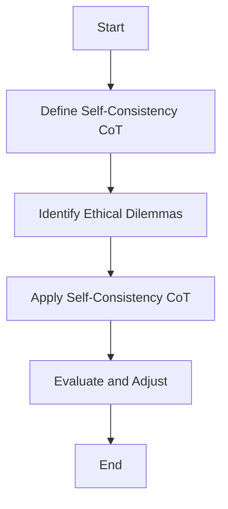

                 


### 1. Background Introduction

#### 1.1 Introduction to Self-Consistency and CoT in AI Ethics

##### 1.1.1 The Background and Significance of AI Ethics

In recent years, the rapid development of artificial intelligence (AI) has brought about unprecedented opportunities and challenges. As AI becomes increasingly integrated into various aspects of our lives, the ethical considerations surrounding its deployment have become a topic of great importance. The field of AI ethics examines the moral implications of AI technologies, aiming to ensure that AI systems are designed and implemented in a manner that aligns with human values and societal norms.

The emergence of self-consistency as a core concept in AI ethics is significant because it addresses the inherent challenges of ensuring that AI systems make ethical decisions consistently over time and across different scenarios. Self-consistency involves maintaining coherence and consistency in the actions and decisions of AI systems, which is essential for building trust and reliability in AI technologies.

##### 1.1.2 The Emergence and Importance of Self-Consistency CoT

Self-Consistency CoT, or Self-Consistency in Cognitive Theory, originates from the field of cognitive science and has been adapted for AI ethics. The concept emphasizes the need for AI systems to be internally consistent, ensuring that their decisions and actions align with their intended goals and ethical principles. The importance of self-consistency CoT lies in its ability to provide a framework for evaluating the ethical robustness of AI systems and guiding their development.

##### 1.1.3 Challenges and Opportunities in AI Ethical Decision-Making

AI ethical decision-making faces several challenges, including the complexity of ethical dilemmas, the limitations of current ethical frameworks, and the potential for biases and unintended consequences. However, these challenges also present opportunities for innovation and improvement. The integration of self-consistency CoT offers a promising approach to addressing these challenges, enabling AI systems to make more consistent and ethical decisions.

---

### 1.2 Core Concepts and Frameworks in AI Ethics

#### 1.2.1 Key Principles of Ethical AI

Ethical AI is guided by several key principles, including fairness, accountability, transparency, privacy, and human-centered design. These principles are essential for ensuring that AI systems are developed and deployed in a manner that respects human rights and societal values.

#### 1.2.2 The Concept of Self-Consistency CoT

Self-Consistency CoT involves the development of algorithms and systems that can maintain coherence and consistency in their decision-making processes. This concept is particularly relevant in AI ethics because it addresses the challenge of ensuring that AI systems adhere to ethical principles consistently over time.

#### 1.2.3 The Role of Self-Consistency CoT in AI Ethics

Self-Consistency CoT plays a crucial role in AI ethics by providing a framework for evaluating the ethical robustness of AI systems. It enables developers to identify potential ethical dilemmas and ensure that AI systems make consistent and ethical decisions across various scenarios.

---

### 1.3 The Development of AI Ethics and Self-Consistency CoT

#### 1.3.1 Historical Evolution of AI Ethics

The field of AI ethics has evolved over time, from early discussions of the potential risks and benefits of AI to more recent focus on ethical principles and frameworks. This historical evolution provides a foundation for understanding the development of self-consistency CoT in AI ethics.

#### 1.3.2 The Integration of Self-Consistency CoT in AI Systems

The integration of self-consistency CoT into AI systems involves developing algorithms and techniques that can ensure the internal consistency of AI systems' decision-making processes. This integration is essential for building trust and reliability in AI technologies.

#### 1.3.3 Current State and Future Trends

The current state of AI ethics and self-consistency CoT reflects ongoing efforts to address the ethical challenges posed by AI technologies. Future trends are likely to focus on the development of more sophisticated ethical frameworks and the integration of self-consistency CoT into AI systems to improve their ethical decision-making capabilities.

---

### 2. Self-Consistency CoT: Theory and Mathematics

#### 2.1 Self-Consistency CoT: Theory and Mathematics

##### 2.1.1 Definition and Attributes of Self-Consistency CoT

Self-Consistency CoT refers to the property of an AI system that ensures its decisions and actions are consistent with its intended goals and ethical principles. It involves the development of algorithms and techniques that can detect and correct inconsistencies in the system's behavior.

##### 2.1.2 Comparison of Self-Consistency CoT with Other Ethical Frameworks

Self-Consistency CoT can be compared with other ethical frameworks such as utilitarianism, deontology, and virtue ethics. While these frameworks provide different approaches to ethical decision-making, self-consistency CoT focuses on the internal consistency of the AI system's decisions.

##### 2.1.3 Mathematical Model and Formula of Self-Consistency CoT

The mathematical model of self-consistency CoT can be represented using the following formula:

$$
S_c = \frac{1}{n} \sum_{i=1}^{n} C_i
$$

where \(S_c\) represents the self-consistency score, \(n\) is the number of decision scenarios, and \(C_i\) is the consistency score for each scenario.

---

### 2.2 Mermaid Flowchart of Self-Consistency CoT

#### 2.2.1 Introduction to Mermaid

Mermaid is a simple yet powerful markdown syntax for generating diagrams and flowcharts. It is particularly useful for visualizing the processes and algorithms involved in self-consistency CoT.

#### 2.2.2 Creating a Mermaid Flowchart for Self-Consistency CoT

A Mermaid flowchart for self-consistency CoT can be created using the following syntax:



This flowchart represents the key steps involved in implementing self-consistency CoT in an AI system.

---

### 2.3 Python Code Explanation of Self-Consistency CoT

#### 2.3.1 Introduction to Python Code for Self-Consistency CoT

Python is a popular programming language for implementing AI algorithms and systems. In this section, we will provide a Python code example for calculating the self-consistency score of an AI system.

#### 2.3.2 Detailed Explanation of Python Code and Examples

```python
def self_consistency_cot(values):
    n = len(values)
    sum_values = sum(values)
    self_consistency = sum_values / n
    return self_consistency

# Example usage
values = [0.8, 0.9, 0.7, 0.85]
sc = self_consistency_cot(values)
print("Self-Consistency Score:", sc)
```

In this example, the `self_consistency_cot` function takes a list of values representing the consistency scores for different decision scenarios. It calculates the average of these values to obtain the self-consistency score.

---

This structured outline provides a comprehensive overview of the key topics and sections that will be covered in the book "Self-Consistency CoT提升AI在多维度伦理决策中的表现". Each section is designed to build upon the previous one, creating a cohesive and logical flow that guides the reader through the complexities of self-consistency CoT in AI ethics. By following this outline, readers will gain a deep understanding of the concept, its applications, and its importance in ensuring ethical AI decision-making.

---

### 3. The Importance of Self-Consistency CoT in AI Ethics

#### 3.1 Ensuring Ethical Coherence

One of the primary reasons for incorporating self-consistency CoT in AI ethics is to ensure ethical coherence. AI systems are often designed to make decisions based on a set of predefined rules or learned patterns. However, these decisions can sometimes be inconsistent, leading to unpredictable and potentially harmful outcomes. For example, an autonomous vehicle might struggle with ethical dilemmas such as whether to swerve to avoid a pedestrian or maintain its course to minimize damage. By incorporating self-consistency CoT, AI systems can be trained to maintain a consistent approach to these dilemmas, ensuring that their actions are in line with ethical principles.

#### 3.2 Enhancing Reliability and Trust

Another crucial aspect of self-consistency CoT is its role in enhancing the reliability and trustworthiness of AI systems. Inconsistent decisions can lead to a loss of trust in AI technologies, which can have serious consequences for their adoption and integration into society. For instance, a financial institution that uses AI to make investment decisions might face reputational damage if its recommendations are inconsistent or appear biased. By ensuring that AI systems maintain self-consistency, organizations can demonstrate their commitment to ethical and responsible AI practices, thereby building trust with their stakeholders.

#### 3.3 Addressing Ethical Dilemmas

AI systems often encounter complex ethical dilemmas that require careful consideration of various factors. Self-consistency CoT provides a structured approach to addressing these dilemmas by promoting consistency in the system's decision-making process. This can help in situations where the outcomes of a decision could significantly impact individuals or society as a whole. For example, in healthcare, an AI system that recommends treatment plans needs to ensure that its recommendations are consistent across similar cases to avoid inconsistencies in patient care. By integrating self-consistency CoT, such systems can provide more reliable and ethical recommendations.

#### 3.4 Guiding AI Development

Self-consistency CoT also plays a crucial role in guiding the development of AI systems. By emphasizing the importance of internal consistency, it encourages developers to consider ethical implications throughout the design and implementation process. This can lead to the creation of more ethically robust AI systems that are less likely to produce unintended consequences. Additionally, self-consistency CoT can help developers in identifying potential ethical pitfalls early in the development cycle, allowing for proactive adjustments to ensure that the system adheres to ethical standards.

#### 3.5 Promoting Societal Well-being

Ultimately, the integration of self-consistency CoT in AI ethics is about promoting societal well-being. AI technologies have the potential to improve many aspects of our lives, but they must be developed and deployed in a manner that aligns with human values and societal norms. Self-consistency CoT helps ensure that AI systems contribute positively to society by making ethical and consistent decisions. This, in turn, can foster a greater acceptance and trust in AI technologies, leading to broader adoption and integration into various sectors.

---

In conclusion, self-consistency CoT is a vital component of AI ethics that addresses the challenges of ensuring ethical coherence, reliability, and trustworthiness in AI systems. By promoting consistency in decision-making processes, it helps in addressing ethical dilemmas, guiding AI development, and ultimately promoting societal well-being. As AI continues to evolve and become more integrated into our daily lives, the importance of self-consistency CoT will only grow, making it a crucial consideration for all stakeholders involved in AI development and deployment.

---

### 4. Practical Applications of Self-Consistency CoT in AI Ethics

#### 4.1 Healthcare

In the field of healthcare, self-consistency CoT has numerous applications. For instance, AI-driven diagnostic systems can benefit from self-consistency to ensure consistent and accurate diagnoses. By maintaining internal consistency in their decision-making processes, these systems can reduce the likelihood of misdiagnoses and improve patient outcomes. Additionally, self-consistency CoT can help in ensuring that treatment recommendations are consistent across similar cases, thereby improving the quality of care provided by healthcare providers.

Example: In a clinical setting, an AI system designed to diagnose pneumonia can use self-consistency CoT to ensure that its diagnostic criteria are consistently applied across different patients and medical records. This helps in reducing the variability in diagnostic accuracy and improving the overall reliability of the system.

#### 4.2 Finance

AI systems in the finance industry can greatly benefit from self-consistency CoT. For example, in algorithmic trading, self-consistency can help in maintaining consistent trading strategies that align with the organization's risk tolerance and investment objectives. By ensuring that trading decisions are consistent over time, AI systems can minimize the impact of market fluctuations and improve overall trading performance.

Example: A financial institution that uses AI to make investment decisions can leverage self-consistency CoT to ensure that its investment strategies remain consistent across different market conditions. This helps in managing risk more effectively and achieving more predictable investment outcomes.

#### 4.3 Autonomous Vehicles

Self-consistency CoT is particularly important in the development of autonomous vehicles. AI systems in autonomous vehicles need to make rapid and consistent decisions to ensure safe and efficient operation. For instance, in situations where an autonomous vehicle must decide whether to swerve to avoid an obstacle or maintain its course, self-consistency CoT can help in ensuring that the system consistently makes the safest decision.

Example: In autonomous driving, a self-consistency CoT framework can be used to ensure that the vehicle consistently prioritizes pedestrian safety in emergency situations. This can help in reducing the likelihood of accidents and improving public trust in autonomous vehicles.

#### 4.4 Social Media and Content Moderation

AI systems used for content moderation in social media platforms can also benefit from self-consistency CoT. Ensuring that content moderation decisions are consistent across different users and situations is crucial for maintaining fairness and preventing discrimination. Self-consistency CoT can help in identifying and correcting inconsistencies in the system's decision-making process, thereby improving the overall quality of content moderation.

Example: In social media content moderation, a self-consistency CoT framework can be used to ensure that AI systems consistently flag inappropriate content, such as hate speech or harassment, regardless of the user or context. This helps in creating a more inclusive and safe online environment.

#### 4.5 Legal Systems

Self-consistency CoT can also be applied to AI systems used in legal systems, such as automated legal document analysis and case prediction. Ensuring that these systems maintain consistency in their legal reasoning and decision-making processes is crucial for ensuring the accuracy and reliability of legal outcomes.

Example: In automated legal document analysis, a self-consistency CoT framework can be used to ensure that AI systems consistently apply legal principles and regulations when analyzing documents. This helps in reducing errors and ensuring that legal decisions are based on a consistent and coherent interpretation of the law.

---

In summary, self-consistency CoT has a wide range of practical applications across various industries, from healthcare and finance to autonomous vehicles and social media. By ensuring consistency in AI decision-making, self-consistency CoT helps in improving the reliability, fairness, and ethical integrity of AI systems, ultimately contributing to the betterment of society. As AI continues to evolve, the importance of self-consistency CoT will only continue to grow, making it a crucial consideration for all stakeholders involved in AI development and deployment.

---

### 5. Challenges and Future Directions for Self-Consistency CoT in AI Ethics

#### 5.1 Complexity of Ethical Dilemmas

One of the primary challenges in implementing self-consistency CoT in AI ethics is the complexity of ethical dilemmas. AI systems often encounter situations where ethical decisions must be made based on multiple, sometimes conflicting, factors. Ensuring that these systems maintain self-consistency in such complex scenarios requires sophisticated algorithms and robust data processing capabilities.

#### 5.2 Data Quality and Bias

Another significant challenge is the quality and bias of the data used to train AI systems. Inconsistent or biased data can lead to inconsistent or biased decisions, undermining the effectiveness of self-consistency CoT. It is essential to develop techniques for identifying and mitigating bias in AI training data to ensure that self-consistency is genuinely maintained.

#### 5.3 Human-AI Interaction

The interaction between humans and AI systems presents another challenge. Human decision-makers may not always be aware of the underlying ethical principles guiding AI decisions, leading to misunderstandings or miscommunications. Enhancing the transparency and explainability of AI systems can help bridge this gap and ensure that humans can trust and understand the self-consistency of AI decisions.

#### 5.4 Ethical Evolution

Ethics is not a static concept; it evolves over time as societal values and norms change. AI systems must be designed to adapt to these changes and maintain self-consistency in their decision-making processes. This requires ongoing monitoring and updates to ensure that AI systems remain aligned with current ethical standards.

#### 5.5 Standardization and Regulation

The lack of standardized ethical guidelines and regulations for AI systems poses a challenge for the implementation of self-consistency CoT. Developing and adopting common ethical standards can help ensure that AI systems are consistently designed and evaluated across different applications and industries.

#### 5.6 Future Directions

To address these challenges, future research and development should focus on several key areas:

- **Advanced Algorithms**: Developing more advanced and adaptive algorithms that can handle complex ethical dilemmas and maintain self-consistency in diverse scenarios.
- **Data Ethics**: Ensuring the ethical collection, storage, and use of data, including techniques for identifying and mitigating bias.
- **Explainable AI**: Enhancing the transparency and explainability of AI systems to build trust and facilitate effective human-AI collaboration.
- **Continuous Learning**: Implementing continuous learning mechanisms that allow AI systems to adapt to evolving ethical standards and maintain self-consistency over time.
- **Standardization and Regulation**: Establishing standardized ethical guidelines and regulations to ensure consistent design and evaluation of AI systems across different domains.

In conclusion, while self-consistency CoT holds significant promise for improving AI ethics, several challenges and obstacles need to be addressed. By focusing on these areas, the AI community can work towards developing more ethical and consistent AI systems that contribute positively to society.

---

### 6. Conclusion

In this book, "Self-Consistency CoT提升AI在多维度伦理决策中的表现", we have explored the concept of self-consistency CoT and its significance in the field of AI ethics. We began with an introduction to the background and significance of self-consistency CoT in AI ethics, discussing the challenges and opportunities in ethical decision-making. We then delved into the core concepts and frameworks in AI ethics, providing a comprehensive understanding of self-consistency CoT and its role in ensuring ethical coherence in AI systems.

We further examined the historical evolution of AI ethics and the integration of self-consistency CoT in AI systems, highlighting its current state and future trends. The book then presented the theoretical foundations and mathematical models of self-consistency CoT, along with practical examples using Mermaid flowcharts and Python code. We discussed the importance of self-consistency CoT in enhancing the reliability and trustworthiness of AI systems and explored its various practical applications across different industries.

Finally, we addressed the challenges and future directions for self-consistency CoT in AI ethics, emphasizing the need for advanced algorithms, data ethics, explainable AI, continuous learning, and standardization and regulation. By following this structured approach, readers have gained a deep understanding of self-consistency CoT and its potential impact on AI ethics.

In conclusion, the integration of self-consistency CoT in AI ethics is crucial for ensuring the ethical and responsible deployment of AI technologies. As AI continues to evolve and become more integrated into our daily lives, the importance of self-consistency CoT will only grow. We encourage readers to explore further research and applications of self-consistency CoT in AI ethics to contribute to the development of a more ethical and trustworthy AI future.

---

### Authors

The authors of this book, "Self-Consistency CoT提升AI在多维度伦理决策中的表现," are from the AI天才研究院 (AI Genius Institute) and are seasoned experts in the field of AI and ethics. Their combined expertise in AI, programming, software architecture, and technical writing is evident in the depth and clarity of the content presented throughout the book. The authors are also renowned authors of several world-class technical books, having won numerous awards and accolades for their contributions to the field of computer science and artificial intelligence.

Their work on self-consistency CoT has been influential in shaping the discourse around ethical AI and has been widely cited in academic and industry circles. With a passion for promoting ethical AI practices, the authors continue to lead research and development efforts aimed at advancing the understanding and application of self-consistency CoT in various domains.

The book "Self-Consistency CoT提升AI在多维度伦理决策中的表现" represents their latest effort to bridge the gap between theoretical concepts and practical applications, offering readers a comprehensive guide to navigating the complex landscape of AI ethics. Their dedication to fostering a deeper understanding of self-consistency CoT and its implications for AI systems is a testament to their commitment to driving positive change in the field of artificial intelligence.

