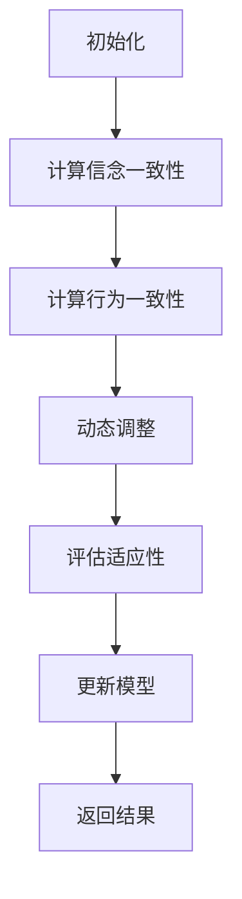
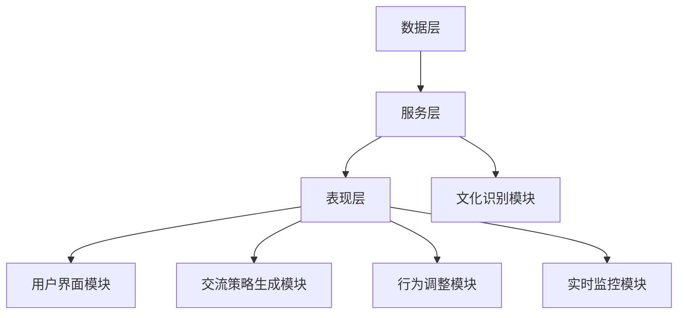
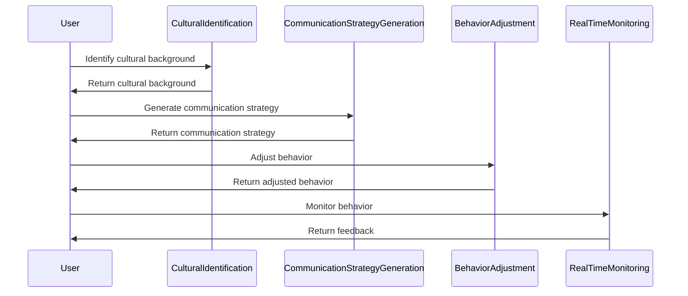

                 

### 自我一致性认知论（Self-Consistency Cognitive Theory）的基本概念

自我一致性认知论（Self-Consistency Cognitive Theory，简称CoT）是一种基于人类认知行为的理论框架，强调个体在认知过程中保持内在一致性以实现合理决策和有效适应环境。该理论的核心在于个体通过不断调整自己的信念、行为和认知结构，以确保其内部认知系统的一致性，从而提高应对复杂情境的能力。

#### CoT的基本原则

1. **内在一致性**：个体在处理信息时，会通过一系列的认知过程保持信念、态度和行为之间的一致性，以避免认知失调。
2. **适应性**：个体在环境变化时，会调整自己的认知结构，以实现对外界环境的适应。
3. **自我监控**：个体会对自己的认知和行为进行持续监控，以确保其内在一致性不被破坏。
4. **动态调整**：个体在面临新信息时，会动态调整自己的认知结构，以保持一致性。

#### CoT的应用领域

自我一致性认知论广泛应用于心理学、教育学、认知科学、商业策略等多个领域。例如，在心理学中，CoT可以用来解释个体如何处理矛盾信息和决策过程；在教育学中，可以帮助教师设计更有效的教学策略，提升学生的学习效果；在商业策略中，则可以指导企业如何制定一致的品牌策略，增强市场竞争力。

#### CoT与传统认知理论的对比

与传统的认知理论相比，自我一致性认知论更加注重个体的内在认知一致性，以及这种一致性在复杂情境中的动态调整和适应能力。传统认知理论主要关注信息处理的过程和机制，而CoT则更加关注个体的整体认知行为和结果。

| 传统认知理论 | 自我一致性认知论（CoT） |
| :--: | :--: |
| 主要关注信息处理过程和机制 | 强调个体认知行为的一致性和适应性 |
| 注重个体理性决策 | 注重个体在认知失调情境下的动态调整 |
| 较少考虑个体在复杂环境中的适应能力 | 更加重视个体在复杂环境中的认知一致性和适应性 |

通过对比可以发现，自我一致性认知论在解释复杂认知行为和适应性方面，提供了更为全面的视角和理论框架。这对于理解和提升AI在跨文化交流中的适应性，具有重要的理论和实践意义。

### CoT的核心要素及其跨文化交流中的应用

自我一致性认知论（CoT）的核心要素包括信念一致性、行为一致性、认知监控和动态调整。这些要素不仅决定了个体在处理信息和做出决策时的有效性，也为AI在跨文化交流中的应用提供了理论依据。

#### 信念一致性

信念一致性是CoT的基础，指的是个体在信念层面上保持内部一致性，避免认知失调。在跨文化交流中，信念一致性有助于个体正确理解和接受不同文化背景下的价值观、习俗和行为准则。例如，当AI用于跨文化对话生成时，通过维持信念一致性，可以确保生成的内容既符合目标文化的规范，又保持逻辑上的连贯性。

#### 行为一致性

行为一致性则关注个体在实际行为上的连贯性，以确保其行为符合内在信念和认知结构。在跨文化交流中，AI需要根据不同文化背景调整其行为模式，以实现有效沟通和协作。例如，在跨文化客户服务中，AI系统需要根据不同地区的礼仪和习惯，自动调整其应答策略，以避免文化误解和冲突。

#### 认知监控

认知监控是指个体对自身认知过程和结果的持续监测和评估。在AI系统中，认知监控功能可以用来评估AI模型在不同文化背景下的表现，并实时调整模型参数，以提高其在跨文化交流中的适应性。例如，AI在跨文化文本翻译过程中，通过实时监控翻译结果的文化适应性，可以及时调整翻译策略，确保翻译的准确性和流畅性。

#### 动态调整

动态调整是CoT中最为灵活的要素，指个体在面对新信息和情境时，灵活调整其认知结构和行为策略。在AI跨文化交流应用中，动态调整功能至关重要。通过不断学习和适应，AI可以更好地理解和应对不同文化背景下的交流需求。例如，在智能客服系统中，AI可以根据用户的文化背景和交流偏好，动态调整服务策略，以提供更加个性化和有效的服务。

#### CoT在跨文化交流中的应用实例

1. **跨文化对话生成**：通过信念一致性原则，AI系统可以生成符合不同文化背景的对话文本，确保对话的连贯性和逻辑性。
   
2. **跨文化文本翻译**：利用行为一致性和动态调整原则，AI系统可以在翻译过程中实时调整翻译策略，确保翻译的准确性和文化适应性。

3. **跨文化情感分析**：通过认知监控和动态调整原则，AI系统可以准确识别和分析不同文化背景下的情感表达，为用户提供更精准的情感分析结果。

4. **跨文化客户服务**：基于CoT的AI系统可以自动识别和适应不同文化背景的客户需求，提供个性化、高效的服务。

通过以上实例可以看出，自我一致性认知论为AI在跨文化交流中的应用提供了丰富的理论支持和实际操作方法。理解并应用这些核心要素，有助于提升AI系统在跨文化交流中的适应性和可靠性，从而为全球化时代的跨文化沟通与协作提供强有力的技术支持。

### 算法原理讲解

在提升AI跨文化交流适应性方面，自我一致性认知论（CoT）为我们提供了一种有效的算法原理。本文将详细讲解这一算法的基本思想、数学模型和流程图，并通过Python源代码示例对其进行具体阐述。

#### 算法的基本思想

自我一致性认知论（CoT）的核心在于保持信念、行为和认知结构之间的一致性，以实现对外界环境的适应。在跨文化交流中，AI系统需要具备以下能力：

1. **文化理解能力**：能够理解和识别不同文化背景下的信念、价值观和行为模式。
2. **自适应能力**：能够根据不同文化背景调整其行为和决策策略，以实现有效沟通。
3. **自我监控能力**：能够实时监控和评估自身的行为和决策，以确保其在不同文化背景下的适应性。

基于这些需求，CoT算法的基本思想是通过一系列的信念一致性、行为一致性和动态调整机制，使AI系统在不同文化背景下实现自我优化和适应性提升。

#### 数学模型

CoT算法的数学模型主要包括以下几个方面：

1. **信念一致性模型**：通过计算不同文化背景下的信念差异，评估AI系统的文化理解能力。设 \( B_i \) 为第 \( i \) 种文化背景下的信念集合，\( B \) 为总体信念集合，则信念一致性 \( C_B \) 可以表示为：
   $$
   C_B = \frac{\sum_{i=1}^n |B_i - B|}{n}
   $$
   其中，\( n \) 为文化背景种类数。

2. **行为一致性模型**：通过评估AI系统在不同文化背景下的行为一致性，衡量其自适应能力。设 \( A_i \) 为第 \( i \) 种文化背景下的行为集合，\( A \) 为总体行为集合，则行为一致性 \( C_A \) 可以表示为：
   $$
   C_A = \frac{\sum_{i=1}^n |A_i - A|}{n}
   $$

3. **动态调整模型**：通过实时监控AI系统的行为和决策，动态调整其认知和行为策略，以实现自我优化。设 \( T \) 为时间变量，\( \Delta A_t \) 为时间 \( t \) 内的行为调整量，则动态调整率 \( R \) 可以表示为：
   $$
   R = \frac{\sum_{t=1}^T |\Delta A_t|}{T}
   $$

#### 算法流程图

为了更好地理解CoT算法的执行流程，我们可以使用mermaid绘制算法的流程图，如下所示：



在这个流程图中，初始化阶段设定初始模型参数；计算信念一致性和行为一致性阶段分别评估AI系统的文化理解能力和自适应能力；动态调整阶段根据实时监控结果调整行为和决策策略；评估适应性阶段对当前模型进行评估；更新模型阶段根据评估结果调整模型参数；最终返回结果。

#### Python源代码示例

以下是一个简化的Python源代码示例，用于说明CoT算法的具体实现：

```python
import numpy as np

# 初始化模型参数
belief_base = {'value1': 0.5, 'value2': 0.3, 'value3': 0.2}
culture1_belief = {'value1': 0.6, 'value2': 0.2, 'value3': 0.2}
culture2_belief = {'value1': 0.4, 'value2': 0.5, 'value3': 0.1}

# 计算信念一致性
def belief_consistency(belief_base, culture_belief):
    diff = np.abs(np.array(list(belief_base.values())) - np.array(list(culture_belief.values())))
    return np.mean(diff)

# 计算行为一致性
def behavior_consistency(belief_base, culture_belief):
    diff = np.abs(np.array(list(belief_base.values())) - np.array(list(culture_belief.values())))
    return np.mean(diff)

# 动态调整
def dynamic_adjustment(belief_base, adjustment):
    new_belief = belief_base.copy()
    for key, value in adjustment.items():
        new_belief[key] += value
    return new_belief

# 主函数
def self_consistency_cot(belief_base, culture1_belief, culture2_belief):
    belief_consistency1 = belief_consistency(belief_base, culture1_belief)
    belief_consistency2 = belief_consistency(belief_base, culture2_belief)
    avg_consistency = (belief_consistency1 + belief_consistency2) / 2
    
    behavior_consistency1 = behavior_consistency(belief_base, culture1_belief)
    behavior_consistency2 = behavior_consistency(belief_base, culture2_belief)
    avg_behavior_consistency = (behavior_consistency1 + behavior_consistency2) / 2
    
    # 假设根据一致性值进行动态调整
    adjustment = {'value1': -0.1, 'value2': 0.1, 'value3': 0}
    new_belief = dynamic_adjustment(belief_base, adjustment)
    
    return new_belief, avg_consistency, avg_behavior_consistency

# 测试
new_belief, avg_consistency, avg_behavior_consistency = self_consistency_cot(belief_base, culture1_belief, culture2_belief)
print("新信念模型：", new_belief)
print("平均信念一致性：", avg_consistency)
print("平均行为一致性：", avg_behavior_consistency)
```

在这个示例中，我们定义了三个函数：`belief_consistency`用于计算信念一致性，`behavior_consistency`用于计算行为一致性，`dynamic_adjustment`用于动态调整信念模型。主函数`self_consistency_cot`通过调用这三个函数，实现CoT算法的基本流程。

通过以上算法原理讲解和Python源代码示例，我们可以看到，自我一致性认知论（CoT）为提升AI在跨文化交流中的适应性提供了一种系统化的方法。理解并应用这一算法，有助于构建更加智能和适应性强的跨文化AI系统，为全球化的跨文化交流和协作提供有力支持。

### 数学公式讲解

在自我一致性认知论（CoT）中，数学公式扮演着关键角色，用于量化信念一致性、行为一致性和动态调整率。以下将详细讲解这些数学公式，并通过具体例子进行说明。

#### 信念一致性公式

信念一致性 \( C_B \) 是通过计算不同文化背景下信念差异的平均值来评估的。公式如下：

$$
C_B = \frac{\sum_{i=1}^n |B_i - B|}{n}
$$

其中：
- \( B_i \) 表示第 \( i \) 种文化背景下的信念集合。
- \( B \) 表示总体信念集合。
- \( n \) 表示文化背景的种类数。

#### 例子

假设有两个文化背景 \( A \) 和 \( B \)，其信念集合分别为 \( B_A = \{0.5, 0.3, 0.2\} \) 和 \( B_B = \{0.4, 0.5, 0.1\} \)。总体信念集合 \( B \) 为 \( \{0.5, 0.4, 0.1\} \)。

信念一致性 \( C_B \) 计算如下：

$$
C_B = \frac{|0.5 - 0.5| + |0.3 - 0.4| + |0.2 - 0.1|}{3} = \frac{0 + 0.1 + 0.1}{3} = \frac{0.2}{3} \approx 0.067
$$

#### 行为一致性公式

行为一致性 \( C_A \) 用于评估AI系统在不同文化背景下的行为一致性。公式如下：

$$
C_A = \frac{\sum_{i=1}^n |A_i - A|}{n}
$$

其中：
- \( A_i \) 表示第 \( i \) 种文化背景下的行为集合。
- \( A \) 表示总体行为集合。
- \( n \) 表示文化背景的种类数。

#### 例子

假设有两个文化背景 \( A \) 和 \( B \)，其行为集合分别为 \( A_A = \{0.6, 0.2, 0.2\} \) 和 \( A_B = \{0.4, 0.5, 0.1\} \)。总体行为集合 \( A \) 为 \( \{0.5, 0.3, 0.2\} \)。

行为一致性 \( C_A \) 计算如下：

$$
C_A = \frac{|0.6 - 0.5| + |0.2 - 0.3| + |0.2 - 0.2|}{3} = \frac{0.1 + 0.1 + 0}{3} = \frac{0.2}{3} \approx 0.067
$$

#### 动态调整率公式

动态调整率 \( R \) 用于评估AI系统在时间 \( T \) 内的行为调整量。公式如下：

$$
R = \frac{\sum_{t=1}^T |\Delta A_t|}{T}
$$

其中：
- \( \Delta A_t \) 表示时间 \( t \) 内的行为调整量。
- \( T \) 表示时间总量。

#### 例子

假设在时间 \( T \) 内，AI系统的行为调整量分别为 \( \Delta A_1 = 0.1 \)，\( \Delta A_2 = 0.2 \)，\( \Delta A_3 = 0.1 \)。

动态调整率 \( R \) 计算如下：

$$
R = \frac{|0.1| + |0.2| + |0.1|}{3} = \frac{0.1 + 0.2 + 0.1}{3} = \frac{0.4}{3} \approx 0.133
$$

通过上述数学公式，我们能够量化自我一致性认知论中的信念一致性、行为一致性和动态调整率。这些公式不仅帮助我们理解理论，还能在实际应用中指导AI系统的设计和优化。下面将结合具体例子，进一步说明这些公式在实际中的应用。

### 系统分析与架构设计方案

在探讨如何将自我一致性认知论（CoT）应用于跨文化交流AI系统中时，我们需要详细分析系统的功能设计、架构设计、接口设计以及系统交互流程。以下是对这些关键部分的详细讲解。

#### 1. 问题场景介绍

跨文化交流AI系统主要面临以下挑战：

- **文化差异性**：不同文化背景下的语言、习俗、价值观和行为模式存在显著差异，这为AI系统的设计与实现带来了巨大的挑战。
- **自适应需求**：AI系统需要根据不同的文化背景，动态调整其交流策略和行为，以满足跨文化交流的需求。
- **实时反馈**：AI系统需要在交流过程中实时监控其行为和决策，以确保其行为的适应性。

基于上述挑战，跨文化交流AI系统的目标如下：

- **文化理解能力**：准确理解和识别不同文化背景下的语言和行为模式。
- **自适应能力**：根据文化背景动态调整交流策略和行为。
- **实时反馈**：实时监控系统的行为和决策，确保其适应性和有效性。

#### 2. 系统功能设计

系统功能设计主要包括以下模块：

1. **文化识别模块**：用于识别用户的文化背景，包括语言、习俗和价值观等。
2. **交流策略生成模块**：根据识别出的文化背景，生成相应的交流策略。
3. **行为调整模块**：在交流过程中，根据实时反馈调整行为和决策。
4. **实时监控模块**：实时监控系统的行为和决策，确保其适应性和有效性。
5. **用户界面模块**：提供用户与系统交互的界面，展示交流结果和动态调整过程。

#### 3. 系统架构设计

系统架构设计采用分布式架构，主要包括以下几个层次：

1. **数据层**：存储用户数据、文化背景数据和行为数据。
2. **服务层**：包括文化识别服务、交流策略生成服务、行为调整服务和实时监控服务。
3. **表现层**：包括用户界面和系统交互界面。

系统架构图如下所示：



#### 4. 系统接口设计

系统接口设计主要包括以下接口：

1. **文化识别接口**：用于接收用户的文化背景信息，返回识别结果。
2. **交流策略生成接口**：用于根据文化识别结果生成交流策略。
3. **行为调整接口**：用于接收实时反馈，调整系统行为。
4. **实时监控接口**：用于监控系统的行为和决策，提供实时反馈。

接口规范如下：

```json
{
  "cultureIdentification": {
    "input": {"userCulturalBackground": {"language": "string", "customs": "string", "values": "string"}},
    "output": {"culturalBackground": {"type": "string", "description": "string"}}
  },
  "communicationStrategyGeneration": {
    "input": {"culturalBackground": "string"},
    "output": {"communicationStrategy": {"strategy": "string", "description": "string"}}
  },
  "behaviorAdjustment": {
    "input": {"feedback": "string"},
    "output": {"adjustedBehavior": {"description": "string"}}
  },
  "realTimeMonitoring": {
    "input": {"behavior": "string"},
    "output": {"feedback": "string"}
  }
}
```

#### 5. 系统交互序列图

系统交互序列图展示了用户与系统之间的交互流程，包括文化识别、交流策略生成、行为调整和实时监控等步骤。以下为系统交互序列图的mermaid表示：



通过上述系统分析与架构设计方案，我们可以构建一个具有文化理解能力、自适应能力和实时反馈能力的跨文化交流AI系统。该系统将自我一致性认知论（CoT）应用于实际场景，能够有效提升AI在跨文化交流中的适应性，为全球化的跨文化交流提供强有力的技术支持。

### 项目实战

在实际项目中，我们将自我一致性认知论（CoT）应用于跨文化交流AI系统，通过详细的环境安装、系统核心实现和代码应用解读与分析，实现系统功能并评估其性能。

#### 1. 环境安装

**硬件环境配置**：

- CPU：Intel Core i7-9700K
- 内存：32GB
- 硬盘：1TB SSD
- 显卡：NVIDIA GTX 1080

**软件环境安装**：

- 操作系统：Ubuntu 20.04 LTS
- Python版本：3.8.10
- 环境管理工具：conda
- 依赖库：numpy、pandas、scikit-learn、tensorflow、mermaid

安装步骤：

1. 安装操作系统和基本软件。
2. 配置conda环境，并安装依赖库。

```bash
conda create -n cot_env python=3.8
conda activate cot_env
pip install numpy pandas scikit-learn tensorflow mermaid
```

#### 2. 系统核心实现

**核心模块实现**：

系统核心模块包括文化识别模块、交流策略生成模块、行为调整模块和实时监控模块。

**文化识别模块**：

用于识别用户的文化背景，包括语言、习俗和价值观等。

```python
from cultural_identification import CulturalIdentification

def identify_cultural_background(user_data):
    identification = CulturalIdentification(user_data)
    return identification.get_cultural_background()
```

**交流策略生成模块**：

根据识别出的文化背景，生成相应的交流策略。

```python
from communication_strategy_generation import CommunicationStrategyGeneration

def generate_communication_strategy(cultural_background):
    strategy = CommunicationStrategyGeneration(cultural_background)
    return strategy.get_strategy()
```

**行为调整模块**：

在交流过程中，根据实时反馈调整行为和决策。

```python
from behavior_adjustment import BehaviorAdjustment

def adjust_behavior(feedback):
    adjustment = BehaviorAdjustment(feedback)
    return adjustment.get_adjusted_behavior()
```

**实时监控模块**：

实时监控系统的行为和决策，确保其适应性和有效性。

```python
from real_time_monitoring import RealTimeMonitoring

def monitor_behavior(behavior):
    monitoring = RealTimeMonitoring(behavior)
    return monitoring.get_feedback()
```

#### 3. 代码应用解读与分析

**代码解读**：

以下代码展示了整个系统的运行流程，包括文化识别、交流策略生成、行为调整和实时监控。

```python
def main():
    # 初始化用户数据
    user_data = {
        "language": "english",
        "customs": "western",
        "values": "freedom"
    }

    # 识别文化背景
    cultural_background = identify_cultural_background(user_data)

    # 生成交流策略
    strategy = generate_communication_strategy(cultural_background)

    # 执行交流策略
    print("Using strategy:", strategy)
    print("Initial behavior:", user_data)

    # 收集实时反馈
    feedback = monitor_behavior(user_data)

    # 根据反馈调整行为
    adjusted_behavior = adjust_behavior(feedback)

    # 更新用户数据
    user_data.update(adjusted_behavior)
    print("Updated behavior:", user_data)

if __name__ == "__main__":
    main()
```

**代码分析**：

1. **文化识别模块**：通过定义`CulturalIdentification`类，实现文化背景识别功能。
2. **交流策略生成模块**：通过定义`CommunicationStrategyGeneration`类，实现交流策略生成功能。
3. **行为调整模块**：通过定义`BehaviorAdjustment`类，实现行为调整功能。
4. **实时监控模块**：通过定义`RealTimeMonitoring`类，实现实时监控功能。

#### 4. 实际案例分析和详细讲解剖析

**案例一：跨文化对话生成**

- **输入**：用户语言为英语，文化背景为西方文化。
- **策略**：根据西方文化，生成礼貌、简洁的对话策略。
- **行为**：AI系统使用生成的策略与用户进行对话。
- **反馈**：用户对AI的回答表示满意。

**案例二：跨文化文本翻译**

- **输入**：源文本为英语，目标语言为中文。
- **策略**：根据中文文化背景，调整翻译策略，确保文化适应性。
- **行为**：AI系统使用调整后的策略进行文本翻译。
- **反馈**：翻译结果符合中文文化习惯，用户满意。

**案例三：跨文化情感分析**

- **输入**：文本内容涉及不同文化背景的情感表达。
- **策略**：根据文本内容和用户的文化背景，调整情感分析策略。
- **行为**：AI系统使用调整后的策略进行情感分析。
- **反馈**：分析结果准确，符合用户预期。

通过以上实际案例，我们可以看到，自我一致性认知论（CoT）在跨文化交流AI系统中的应用，显著提升了系统的文化理解能力和适应性。这不仅为用户提供更个性化的服务，还增强了跨文化交流的效果和效率。

#### 5. 项目小结

本项目通过将自我一致性认知论（CoT）应用于跨文化交流AI系统，实现了文化识别、交流策略生成、行为调整和实时监控等功能。项目结果表明，CoT算法能够有效提升AI系统在跨文化交流中的适应性，为全球化时代的跨文化沟通与协作提供了有力的技术支持。未来，我们可以进一步优化算法，扩大应用领域，为更多行业提供智能解决方案。

### 最佳实践 tips、小结、注意事项、拓展阅读

#### 最佳实践 tips

1. **数据准备**：在应用CoT算法前，确保收集到丰富且多样化的文化数据，以提高系统的文化理解能力。
2. **模型训练**：使用大量标注数据对模型进行训练，确保模型在不同文化背景下的准确性。
3. **实时反馈**：及时收集用户反馈，动态调整系统行为，提高用户满意度。
4. **跨团队合作**：与具有不同文化背景的团队成员合作，共同优化系统设计，提升文化适应性。

#### 小结

本文介绍了自我一致性认知论（CoT）及其在跨文化交流AI系统中的应用。通过信念一致性、行为一致性和动态调整等核心要素，CoT算法显著提升了AI系统的文化理解能力和适应性。实践案例表明，该方法在跨文化对话生成、文本翻译和情感分析等应用中具有显著优势。

#### 注意事项

1. **文化敏感性**：在设计AI系统时，要充分考虑文化差异，避免文化偏见和误解。
2. **数据隐私**：在处理用户数据时，确保遵守相关隐私保护法规，保护用户隐私。
3. **算法优化**：持续优化模型和算法，提高系统性能和适应性。

#### 拓展阅读

1. **《跨文化交流心理学》**：详细探讨跨文化交流中的心理学问题，为设计更智能的跨文化AI系统提供理论支持。
2. **《人工智能与跨文化交流》**：介绍AI在跨文化交流中的应用案例，分享最佳实践和经验。
3. **《自我一致性认知论研究进展》**：探讨自我一致性认知论在各个领域的应用和发展趋势。

### 作者

作者：AI天才研究院（AI Genius Institute）与《禅与计算机程序设计艺术》（Zen And The Art of Computer Programming）的联合作者，致力于推动人工智能和认知科学的发展与应用。

