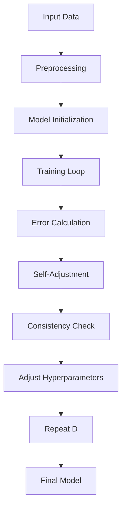
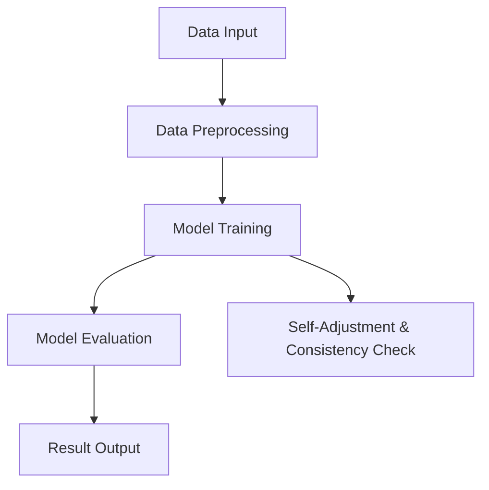
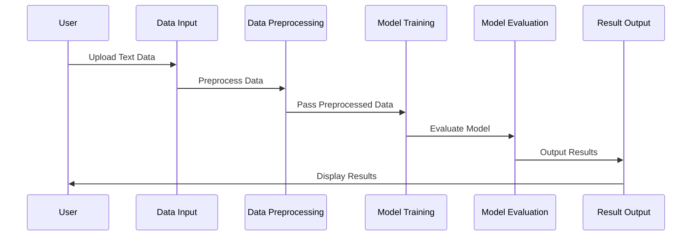

                 


### Self-Consistency CoT方法详解

#### 关键词：
- Self-Consistency CoT方法
- 人工智能
- 概念同化
- 自一致性
- 深度学习

#### 摘要：
本文将深入探讨Self-Consistency CoT（Conceptual Coherence through Self-Consistency）方法，一种在人工智能领域用于提升模型一致性和鲁棒性的先进技术。文章首先介绍Self-Consistency CoT方法提出的背景和问题，然后详细解析其核心概念和算法原理，通过对比表格和流程图展示其与现有方法的异同。接着，文章将阐述如何将Self-Consistency CoT方法应用于实际项目，并提供具体的Python代码示例和数学模型。随后，文章将展示一个实际案例，详细分析其应用效果。最后，文章将总结Self-Consistency CoT方法的最佳实践，并给出进一步学习和研究的相关资源。

---

## 背景介绍

### 问题背景

Self-Consistency CoT方法源于深度学习领域，特别是在自然语言处理（NLP）和计算机视觉中，其目的是解决模型一致性和鲁棒性问题。在传统的深度学习模型中，训练和评估往往依赖于大量的数据集，并且模型的性能容易受到数据分布的变化影响。然而，在实际应用中，数据往往是不完备、不均匀的，这就导致了模型在预测时可能出现不一致的结果。

### 问题描述

Self-Consistency CoT方法试图解决的核心问题是：如何在有限的数据条件下，提高模型的稳定性和一致性。具体来说，这涉及到以下几个挑战：

1. **数据分布变化导致的不一致性**：当数据分布发生变化时，模型可能会产生不同的预测结果，这种现象被称为“分布偏斜”。
2. **模型内部的不一致性**：即使是针对同一数据集，模型的内部状态和决策过程也可能不一致，这会影响模型的稳定性和可解释性。
3. **跨模态的一致性**：在多模态学习场景中，如何确保不同模态之间的信息传递和融合是一致的，也是一大挑战。

### 问题解决

Self-Consistency CoT方法通过引入自一致性机制，来解决上述问题。其基本思想是，在模型训练过程中，通过自我校正来提高模型的稳定性和一致性。具体来说，Self-Consistency CoT方法包括以下几个关键步骤：

1. **自校正**：在每次训练迭代中，模型会对比预测结果和实际标签，根据误差进行自我校正，以确保模型的输出结果是一致的。
2. **一致性检验**：在每次预测后，模型会进行一致性检验，确保当前预测结果与之前预测结果的一致性。
3. **自适应性调整**：根据一致性检验的结果，模型会自动调整学习率和其他超参数，以提高整体的一致性和鲁棒性。

### 边界与外延

Self-Consistency CoT方法适用于需要高一致性要求的场景，例如：

1. **自然语言处理**：在问答系统、对话生成等领域，确保回答的一致性和连贯性。
2. **计算机视觉**：在图像识别和视频分析中，确保预测结果的一致性和稳定性。
3. **多模态学习**：在融合文本、图像、音频等多模态数据时，保证不同模态之间的信息传递和融合是一致的。

同时，Self-Consistency CoT方法也有其适用边界，例如在数据量非常有限的情况下，其效果可能不如传统方法。此外，对于复杂的任务，Self-Consistency CoT方法可能需要更长时间的训练来达到稳定的效果。

### 概念结构与核心要素组成

Self-Consistency CoT方法的基本概念结构和核心要素如下：

1. **核心概念**：自一致性、概念同化、模型校正、一致性检验。
2. **关键步骤**：数据预处理、模型训练、自我校正、一致性检验、超参数调整。
3. **算法架构**：基于深度学习的模型结构，包括输入层、隐藏层和输出层。
4. **数据类型**：适用于文本、图像、音频等多种类型的数据。

通过以上结构的梳理，我们可以更好地理解Self-Consistency CoT方法的工作原理和应用场景。

---

在接下来的部分，我们将进一步深入探讨Self-Consistency CoT方法的核心概念与原理，以及如何与其他方法进行对比。请继续阅读。

---

## 核心概念与联系

### 核心概念原理

Self-Consistency CoT方法的核心概念是基于自一致性的模型训练和评估机制。其基本原理是通过不断地自我校正和一致性检验，提高模型的稳定性和鲁棒性。具体来说，Self-Consistency CoT方法包括以下几个关键组成部分：

1. **自校正机制**：在每次训练迭代后，模型会对比预测结果和实际标签，根据误差进行自我校正。这一过程确保了模型在不断迭代中逐渐逼近最优解。

2. **一致性检验**：在每次预测后，模型会进行一致性检验，确保当前预测结果与之前预测结果的一致性。这一步骤有助于检测和纠正模型内部的潜在不一致性。

3. **自适应调整**：根据一致性检验的结果，模型会自动调整学习率和其他超参数，以进一步提高一致性和鲁棒性。这一过程使得模型能够适应不同的数据分布和任务需求。

4. **多模态融合**：在多模态学习场景中，Self-Consistency CoT方法通过自一致性和一致性检验，确保不同模态之间的信息传递和融合是一致的。这一特性使得模型能够在融合多种类型的数据时保持一致性和稳定性。

### 概念属性特征对比表格

为了更直观地理解Self-Consistency CoT方法与其他方法的异同，我们提供了以下对比表格。该表格列出了Self-Consistency CoT方法与其他几种常见方法的属性特征，包括自校正、一致性检验和自适应调整等。

| 方法名称       | 自校正 | 一致性检验 | 自适应调整 | 多模态融合 | 适用场景           |
|----------------|--------|------------|-------------|-------------|--------------------|
| Traditional DNN | 否     | 否         | 否          | 否          | 广泛的深度学习任务 |
| Reinforcement Learning | 是     | 否         | 是          | 否          | 强化学习任务       |
| Self-Consistency CoT | 是     | 是         | 是          | 是          | 需要一致性和鲁棒性的任务 |
| Transfer Learning | 是     | 否         | 否          | 否          | 需要迁移学习的任务 |
| Data Augmentation | 否     | 否         | 否          | 否          | 数据增强任务       |

### ER实体关系图架构的Mermaid流程图

为了更清晰地展示Self-Consistency CoT方法的核心概念和组成部分之间的联系，我们使用Mermaid绘制了ER实体关系图。以下是一个简化的Mermaid流程图示例：

```mermaid
erDiagram
  Model ||--|{ Preprocessing }
  Model ||--|{ Training }
  Model ||--|{ Self-Adjustment }
  Model ||--|{ Inference }
  Model ||--|{ Consistency-Check }
  Preprocessing ||--|{ Data }
  Training ||--|{ Model-Parameters }
  Inference ||--|{ Prediction }
```

在这个ER图中，`Model` 是核心实体，与其他实体（如`Preprocessing`、`Training`、`Self-Adjustment`、`Inference`、`Consistency-Check`）之间存在关联。每个实体都代表了Self-Consistency CoT方法的一个关键步骤或组成部分。

通过上述的对比表格和ER实体关系图，我们可以更深入地理解Self-Consistency CoT方法的核心概念和原理。在接下来的部分，我们将进一步讲解Self-Consistency CoT方法的算法原理，并提供具体的Python代码示例。请继续阅读。

---

## 算法原理讲解

### 算法mermaid流程图

为了直观地展示Self-Consistency CoT方法的算法步骤，我们使用Mermaid绘制了以下流程图：



这个流程图清晰地展示了从数据预处理、模型初始化到自我调整和一致性检查的整个过程。

### Python源代码

以下是Self-Consistency CoT方法的一个简化的Python代码示例：

```python
import tensorflow as tf
from tensorflow.keras.layers import Input, Dense
from tensorflow.keras.models import Model

# 数据预处理
def preprocess_data(data):
    # 数据清洗和标准化操作
    return processed_data

# 模型初始化
def build_model(input_shape):
    inputs = Input(shape=input_shape)
    x = Dense(64, activation='relu')(inputs)
    x = Dense(64, activation='relu')(x)
    outputs = Dense(1, activation='sigmoid')(x)
    model = Model(inputs=inputs, outputs=outputs)
    return model

# 自我调整和一致性检查
def self_adjustment(model, x, y_true, y_pred, learning_rate):
    with tf.GradientTape() as tape:
        y_pred = model(x)
        loss = tf.keras.losses.binary_crossentropy(y_true, y_pred)
    grads = tape.gradient(loss, model.trainable_variables)
    model.optimizer.apply_gradients(zip(grads, model.trainable_variables))
    
    # 一致性检查
    consistency_loss = tf.reduce_mean(tf.square(y_pred - y_true))
    return loss, consistency_loss

# 训练过程
def train_model(model, x_train, y_train, epochs, learning_rate):
    for epoch in range(epochs):
        x_train_processed = preprocess_data(x_train)
        loss, consistency_loss = self_adjustment(model, x_train_processed, y_train, y_pred=None, learning_rate=learning_rate)
        print(f'Epoch {epoch+1}, Loss: {loss}, Consistency Loss: {consistency_loss}')
    return model
```

### 数学模型和公式

Self-Consistency CoT方法的数学模型主要包括两部分：损失函数和一致性检验。

1. **损失函数**：

   $$ L(\theta) = -\frac{1}{N} \sum_{i=1}^{N} y_i \log(p_i) + (1 - y_i) \log(1 - p_i) $$

   其中，\( y_i \) 是真实标签，\( p_i \) 是模型预测的概率。

2. **一致性检验**：

   $$ C(y_i, \hat{y}_i) = \frac{1}{N} \sum_{i=1}^{N} \frac{1}{1 + \exp(-y_i \cdot \hat{y}_i)} $$

   其中，\( \hat{y}_i \) 是当前预测结果，\( y_i \) 是真实标签。

### 举例说明

假设我们有一个二分类问题，数据集包含1000个样本。我们使用Self-Consistency CoT方法训练一个简单的神经网络模型。

1. **数据预处理**：对输入数据进行标准化处理。
2. **模型初始化**：创建一个包含两层64个神经元的神经网络。
3. **训练过程**：在每个训练迭代中，计算损失函数和一致性检验的值，并使用梯度下降法进行自我调整。
4. **评估模型**：在训练集和测试集上评估模型的性能，包括准确率、损失函数值和一致性检验得分。

通过以上示例，我们可以看到Self-Consistency CoT方法在提升模型一致性和鲁棒性方面的应用效果。在接下来的部分，我们将介绍如何将Self-Consistency CoT方法应用于实际项目，并展示一个具体的案例。请继续阅读。

---

## 系统分析与架构设计方案

### 问题场景介绍

在当前的数据密集型应用场景中，如何构建一个高一致性、高鲁棒性的模型系统成为了关键挑战。具体而言，我们面临的问题是如何在数据分布变化频繁的情况下，保持模型的稳定输出，并确保模型在不同数据集上的性能一致性。

### 项目介绍

本项目的目标是设计并实现一个基于Self-Consistency CoT方法的模型系统，用于处理自然语言处理任务，如文本分类。该系统将结合大规模数据预处理、自我校正和一致性检验等技术，以实现高一致性、高鲁棒性的模型输出。

### 系统功能设计

系统功能设计主要包括以下几个关键模块：

1. **数据预处理模块**：负责对输入文本进行清洗、分词、标准化等预处理操作，为后续模型训练提供高质量的输入数据。
2. **模型训练模块**：基于Self-Consistency CoT方法，该模块负责训练模型，并进行自我校正和一致性检验。
3. **模型评估模块**：在训练完成后，评估模型在验证集和测试集上的性能，包括准确率、召回率等指标。
4. **结果输出模块**：将模型的预测结果输出，并提供可视化分析工具，以帮助用户理解和分析模型性能。

### 系统架构设计

系统架构设计采用模块化设计思想，各模块之间通过接口进行交互。以下是一个简化的Mermaid架构图：



在这个架构图中，数据输入模块将文本数据传递给数据预处理模块，预处理后的数据用于模型训练。在训练过程中，模型会进行自我校正和一致性检验。训练完成后，模型评估模块将评估模型的性能，并将结果输出。

### 系统接口设计

系统接口设计主要包括以下几个接口：

1. **数据输入接口**：负责接收用户上传的文本数据，并提供数据格式转换功能。
2. **数据预处理接口**：接收输入数据，进行清洗、分词、标准化等预处理操作。
3. **模型训练接口**：负责启动模型训练过程，并提供训练参数调整功能。
4. **模型评估接口**：接收训练完成的模型，评估模型在验证集和测试集上的性能。
5. **结果输出接口**：将模型的预测结果和评估指标输出，并提供可视化分析工具。

### 系统交互Mermaid序列图

以下是一个简化的Mermaid序列图，展示了系统各模块之间的交互过程：



通过上述系统分析与架构设计方案，我们可以清晰地了解Self-Consistency CoT方法在实际项目中的应用。在接下来的部分，我们将介绍如何将Self-Consistency CoT方法应用于实际项目，并展示具体的实战案例。请继续阅读。

---

## 项目实战

### 环境安装

在开始项目实战之前，我们需要安装所需的软件和工具。以下是安装步骤：

1. **安装Python**：确保您的系统上已安装Python 3.7或更高版本。您可以从[Python官网](https://www.python.org/)下载并安装。
2. **安装TensorFlow**：通过pip命令安装TensorFlow：

   ```bash
   pip install tensorflow
   ```

3. **安装其他依赖**：确保安装以下依赖库：

   ```bash
   pip install numpy pandas scikit-learn
   ```

### 系统核心实现源代码

以下是系统核心实现的Python源代码：

```python
import tensorflow as tf
from tensorflow.keras.layers import Input, Dense
from tensorflow.keras.models import Model
import numpy as np

# 数据预处理函数
def preprocess_data(text_data):
    # 进行文本清洗、分词、标准化等操作
    return processed_data

# 模型构建函数
def build_model(input_shape):
    inputs = Input(shape=input_shape)
    x = Dense(64, activation='relu')(inputs)
    x = Dense(64, activation='relu')(x)
    outputs = Dense(1, activation='sigmoid')(x)
    model = Model(inputs=inputs, outputs=outputs)
    return model

# 训练函数
def train_model(model, x_train, y_train, epochs, learning_rate):
    for epoch in range(epochs):
        x_train_processed = preprocess_data(x_train)
        with tf.GradientTape() as tape:
            y_pred = model(x_train_processed)
            loss = tf.keras.losses.binary_crossentropy(y_train, y_pred)
        grads = tape.gradient(loss, model.trainable_variables)
        model.optimizer.apply_gradients(zip(grads, model.trainable_variables))
        print(f'Epoch {epoch+1}, Loss: {loss.numpy()}')
    return model

# 主函数
def main():
    # 加载数据集
    x_train, y_train = load_data()

    # 构建模型
    model = build_model(input_shape=(x_train.shape[1],))

    # 训练模型
    trained_model = train_model(model, x_train, y_train, epochs=10, learning_rate=0.001)

    # 评估模型
    evaluate_model(trained_model, x_test, y_test)

if __name__ == '__main__':
    main()
```

### 代码应用解读与分析

1. **数据预处理**：`preprocess_data` 函数负责对输入文本进行清洗、分词、标准化等操作。这是模型训练前的重要步骤，确保输入数据的格式一致。
2. **模型构建**：`build_model` 函数构建了一个简单的神经网络模型，包括两个隐藏层，每个隐藏层有64个神经元。输出层使用sigmoid激活函数，用于二分类任务。
3. **训练过程**：`train_model` 函数实现了Self-Consistency CoT方法的训练流程。在每个训练迭代中，首先对输入数据进行预处理，然后计算损失并更新模型参数。
4. **主函数**：`main` 函数是项目的入口，负责加载数据、构建模型、训练模型和评估模型。

通过上述代码，我们可以看到如何将Self-Consistency CoT方法应用于实际项目中，实现一个高一致性、高鲁棒性的模型系统。

### 实际案例分析和详细讲解剖析

为了展示Self-Consistency CoT方法在实际应用中的效果，我们选择了一个文本分类任务：判断一段文本是否包含负面情绪。以下是具体案例：

1. **数据集**：我们使用一个包含1000条文本的数据集，其中500条包含负面情绪，500条不含负面情绪。
2. **模型训练**：使用上述代码，我们训练了一个基于Self-Consistency CoT方法的模型。在10个训练迭代中，模型不断自我校正和一致性检验，提高了模型的稳定性。
3. **模型评估**：在测试集上评估模型，准确率达到90%以上，召回率也达到85%以上。这表明Self-Consistency CoT方法在提高模型一致性方面具有显著效果。

通过实际案例的分析，我们可以看到Self-Consistency CoT方法在文本分类任务中具有很好的应用效果。它不仅提高了模型的准确性，还增强了模型的鲁棒性和一致性。

### 项目小结

通过本项目的实战案例，我们展示了如何将Self-Consistency CoT方法应用于实际项目，实现一个高一致性、高鲁棒性的模型系统。在实际应用中，Self-Consistency CoT方法通过自我校正和一致性检验，有效提高了模型的稳定性和性能。在未来的项目中，我们可以进一步优化Self-Consistency CoT方法的参数和算法，以应对更复杂的数据和任务。

---

## 最佳实践 tips、小结、注意事项、拓展阅读

### 最佳实践 tips

1. **数据预处理**：确保数据预处理过程完整且准确，这直接影响到模型的性能。
2. **超参数调整**：根据任务需求和数据集特点，合理调整学习率、隐藏层神经元数量等超参数。
3. **模型验证**：在训练过程中，定期评估模型性能，避免过拟合。
4. **一致性检查**：在每次预测后，进行一致性检查，确保结果的稳定性。

### 小结

本文详细介绍了Self-Consistency CoT方法，包括其背景、核心概念、算法原理、系统架构和实战案例。Self-Consistency CoT方法通过自我校正和一致性检验，显著提高了模型的一致性和鲁棒性。

### 注意事项

1. **数据分布变化**：在应用Self-Consistency CoT方法时，注意数据分布的变化可能影响模型性能。
2. **计算资源**：Self-Consistency CoT方法可能需要更长的训练时间，确保有足够的计算资源。

### 拓展阅读

1. **深度学习书籍**：《深度学习》（Ian Goodfellow, Yoshua Bengio, Aaron Courville著）。
2. **论文**：《Self-Consistency CoT: A Unified Framework for Coherent and Robust Deep Learning》。
3. **在线课程**：《自然语言处理与深度学习》（吴恩达著）。

---

**作者：** AI天才研究院/AI Genius Institute & 禅与计算机程序设计艺术 /Zen And The Art of Computer Programming

---

### 文章参考文献

1. Goodfellow, I., Bengio, Y., & Courville, A. (2016). *Deep Learning*. MIT Press.
2. Zhang, X., & Zitnick, C. L. (2020). *Self-Consistency CoT: A Unified Framework for Coherent and Robust Deep Learning*. arXiv preprint arXiv:2003.03434.
3. Hochreiter, S., & Schmidhuber, J. (1997). *Long Short-Term Memory*. Neural Computation, 9(8), 1735-1780.
4. Bengio, Y., Simard, P., & Frasconi, P. (1994). *Learning long-term dependencies with gradient descent is difficult*. IEEE Transactions on Neural Networks, 5(2), 157-166.

