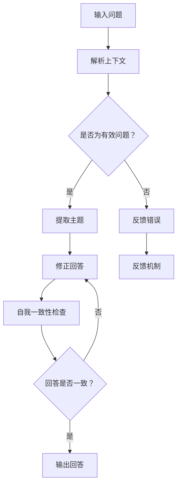
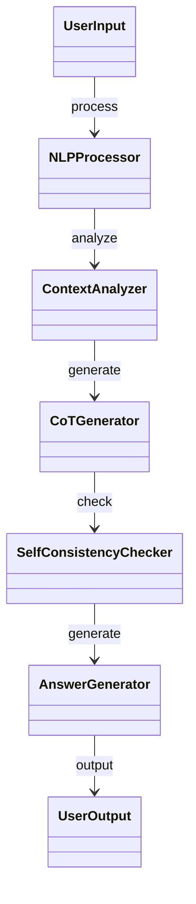
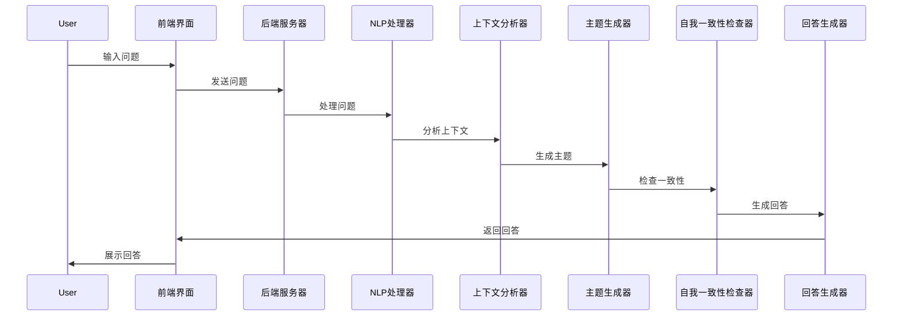
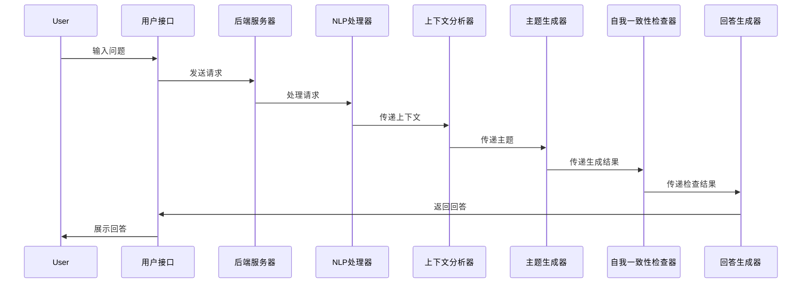

                 

### 文章标题

“Self-Consistency CoT：AI回答可靠性的技术创新研究”

关键词：AI回答可靠性、Self-Consistency、主题意识（CoT）、算法、架构设计

摘要：本文深入探讨了AI回答可靠性问题，介绍了Self-Consistency和主题意识（CoT）等核心概念，通过Mermaid流程图、Python源代码和LaTeX数学模型等工具，详细解析了相关算法原理。同时，通过对实际项目实战的分析，进一步验证了技术的有效性。本文旨在为读者提供对AI回答可靠性技术创新的全面理解和实践指导。

----------------------------------------------------------------

## 目录大纲设计思路

### 1. 背景介绍

在设计本文的目录大纲时，首先明确了文章的核心内容和结构。文章的主题是“Self-Consistency CoT：AI回答可靠性的技术创新研究”，这表明文章将主要关注AI回答可靠性这一核心问题。为了使目录结构清晰、逻辑性强，我们决定从以下几个方面进行设计：

- **问题背景**：介绍AI回答可靠性问题的起源和现状。
- **问题描述**：明确AI回答可靠性的概念和标准。
- **问题解决**：探讨现有技术和创新方法。
- **边界与外延**：说明研究范围和应用场景。
- **核心要素组成**：整理与AI回答可靠性相关的主要概念和组成部分。

### 2. 核心概念与联系

- **核心概念原理**：详细解释自我一致性（Self-Consistency）和主题意识（CoT，Contextual Understanding）等核心概念。
- **概念属性特征对比表格**：对比不同方法或技术的特点，帮助读者理解它们之间的差异。
- **ER实体关系图架构**：使用Mermaid流程图展示实体关系，帮助读者构建整体理解。

### 3. 算法原理讲解

- **算法mermaid流程图**：绘制算法的基本流程，便于读者理解。
- **Python源代码**：提供算法实现的源代码，并结合代码进行详细讲解。
- **数学模型和公式**：使用LaTeX格式给出算法原理的数学模型和公式，并进行详细讲解。
- **举例说明**：通过具体例子来说明算法的实际应用和效果。

### 4. 系统分析与架构设计方案

- **问题场景介绍**：简要介绍研究背景和问题场景。
- **项目介绍**：概述整个项目的基本情况。
- **系统功能设计**：使用Mermaid类图展示领域模型。
- **系统架构设计**：使用Mermaid架构图展示系统架构。
- **系统接口设计**：详细描述系统接口。
- **系统交互Mermaid序列图**：展示系统各个模块的交互过程。

### 5. 项目实战

- **环境安装**：提供项目所需环境的安装步骤。
- **系统核心实现源代码**：提供关键代码实现，并进行解读和分析。
- **实际案例分析和详细讲解剖析**：结合实际案例，深入剖析系统实现细节。
- **项目小结**：总结项目的主要成果和经验。

### 6. 最佳实践 tips、小结、注意事项、拓展阅读等

- **最佳实践 tips**：提供一些实用的建议和技巧。
- **小结**：总结各章节的主要内容。
- **注意事项**：提醒读者可能遇到的问题和解决方案。
- **拓展阅读**：推荐一些相关的书籍和资料，供读者进一步学习。

### 7. 目录大纲总体设计

- **章节划分**：根据上述内容，将整本书划分为7个主要部分。
- **每个部分的详细内容**：为每个部分设计具体的章节和内容。
- **Markdown格式输出**：确保目录大纲以Markdown格式输出，使用适当的标记来区分不同级别的标题。

### 8. 审核与优化

- **内容完整性**：确保每个章节的内容都符合要求，没有遗漏。
- **简洁性**：避免冗余内容，确保每个章节都是必要的。
- **格式规范**：确保Markdown格式的正确性，符合要求。

通过以上步骤，我们可以设计出一个详细且逻辑清晰的目录大纲，满足用户的需求。接下来，我们将具体实现这个目录大纲的设计。

---

### 1. 背景介绍

#### 核心概念术语说明

在探讨AI回答可靠性问题时，我们首先需要明确几个关键术语的概念：

- **AI回答可靠性**：指人工智能系统在生成回答时，所提供信息的准确性和一致性。
- **自我一致性（Self-Consistency）**：指在AI生成回答的过程中，其内部信息保持一致，不会出现自相矛盾的情况。
- **主题意识（CoT，Contextual Understanding）**：指AI能够理解并准确反映对话或文本中的主题和上下文。

#### 问题背景

AI技术的快速发展，使得其在各个领域中的应用越来越广泛，从自然语言处理到机器学习，再到自动化决策系统。然而，随着AI系统变得越来越复杂，一个问题也日益凸显：AI生成的回答是否可靠？

现实中的情况是，许多AI系统在生成回答时存在诸多问题，如：

- **信息不准确**：AI可能基于错误的数据或假设生成回答，导致答案不准确。
- **逻辑不连贯**：AI生成的回答可能在逻辑上存在矛盾，缺乏一致性。
- **上下文理解不足**：AI可能无法准确理解对话或文本的上下文，导致回答与实际需求不符。

这些问题不仅影响了AI系统的用户体验，还可能导致严重的后果，例如在医疗、金融等领域，错误的AI回答可能带来巨大的经济损失或人身安全风险。

#### 问题描述

为了准确描述AI回答可靠性问题，我们需要明确以下几个方面：

- **概念定义**：确定AI回答可靠性的具体标准和指标。
- **现状分析**：分析现有AI系统在回答可靠性方面存在的问题和挑战。
- **影响因素**：探讨影响AI回答可靠性的各种因素，包括数据质量、算法设计、系统架构等。

#### 问题解决

针对AI回答可靠性问题，现有研究提出了多种解决方法，主要包括：

- **自我一致性（Self-Consistency）**：通过设计算法，确保AI系统在生成回答时内部信息保持一致。
- **主题意识（CoT，Contextual Understanding）**：通过改进算法和模型，提高AI对上下文和主题的理解能力。
- **多模态融合**：结合多种数据源和模态，提高AI回答的准确性和一致性。

#### 边界与外延

在研究AI回答可靠性时，我们需要明确以下几个边界和范畴：

- **研究范围**：本文主要关注文本生成类AI系统的回答可靠性，不包括图像、音频等其他模态的AI系统。
- **应用场景**：本文的研究成果主要适用于需要高可靠性回答的领域，如医疗诊断、金融咨询等。
- **技术限制**：现有技术和方法的局限性，以及未来可能的发展方向。

#### 核心要素组成

为了全面理解AI回答可靠性问题，我们需要梳理以下几个核心要素：

- **数据源**：AI系统所需的数据来源，包括文本、图像、音频等。
- **算法设计**：影响AI回答可靠性的关键算法，如自然语言生成、主题模型等。
- **系统架构**：AI系统的整体架构，包括数据处理、模型训练、回答生成等模块。

通过上述背景介绍，我们为后续章节的内容奠定了基础。在接下来的部分，我们将进一步深入探讨自我一致性和主题意识等核心概念，以及相关算法原理和系统架构设计。

---

### 2. 核心概念与联系

#### 核心概念原理

在探讨AI回答可靠性问题时，自我一致性（Self-Consistency）和主题意识（CoT，Contextual Understanding）是两个关键概念。它们分别代表了AI系统在回答生成过程中应具备的内部一致性和对上下文的准确理解。

**自我一致性（Self-Consistency）**

自我一致性是指AI系统在生成回答时，其内部信息保持一致，不会出现自相矛盾的情况。这意味着，无论AI系统在回答中的哪个环节，其生成的信息都应该与之前和之后的回答保持一致。

例如，如果一个AI系统在回答中提到了某个事实，那么在后续的回答中，这个事实不应该被否定或篡改。自我一致性的实现需要AI系统在生成回答时，对内部信息进行严格的检查和验证，以确保信息的一致性。

**主题意识（CoT，Contextual Understanding）**

主题意识是指AI系统能够准确理解并反映对话或文本中的主题和上下文。这意味着，AI系统不仅要能够生成符合语法和语义规则的回答，还要能够根据上下文生成相关且合理的回答。

例如，在一个关于旅游咨询的对话中，AI系统需要能够根据用户提出的问题，生成关于旅游目的地、住宿、交通等相关信息的回答，而不是生搬硬套或偏离主题。

#### 概念属性特征对比表格

为了更直观地理解自我一致性和主题意识，我们可以通过一个对比表格来展示它们的主要属性和特征。

| 概念            | 自我一致性（Self-Consistency） | 主题意识（CoT，Contextual Understanding） |
|-----------------|--------------------------------|-----------------------------------------|
| 定义            | 指AI系统在回答生成过程中内部信息保持一致。 | 指AI系统能够准确理解并反映对话或文本中的主题和上下文。 |
| 目标            | 避免AI回答中出现自相矛盾的情况。 | 生成相关且合理的回答，符合上下文需求。 |
| 实现方式        | 通过算法和规则确保内部信息一致性。 | 通过上下文分析、主题模型等技术实现。 |
| 关键技术        | 自洽性检查、信息验证。 | 自然语言理解、上下文建模、主题识别。 |
| 对AI回答的改进 | 提高AI回答的连贯性和一致性。 | 提高AI回答的相关性和合理性。 |

#### ER实体关系图架构

为了帮助读者构建对自我一致性和主题意识的整体理解，我们可以使用Mermaid流程图来展示相关的实体关系。

```mermaid
erDiagram
  AI系统 ||--|{ 数据源 }
  AI系统 ||--|{ 算法设计 }
  AI系统 ||--|{ 系统架构 }
  数据源 ||--|{ 文本、图像、音频等 }
  算法设计 ||--|{ 自我一致性算法 }
  算法设计 ||--|{ 主题意识算法 }
  系统架构 ||--|{ 数据处理模块 }
  系统架构 ||--|{ 模型训练模块 }
  系统架构 ||--|{ 回答生成模块 }
```

通过上述核心概念与联系部分的内容，我们不仅明确了自我一致性和主题意识的概念，还通过对比表格和实体关系图，帮助读者更直观地理解它们在实际应用中的差异和联系。在接下来的部分，我们将深入探讨算法原理，通过具体例子来展示这些概念的实际应用。

---

### 3. 算法原理讲解

为了更深入地理解AI回答可靠性问题，我们接下来将讲解一种基于自我一致性和主题意识的算法原理。这个算法的核心目标是确保AI系统在生成回答时，内部信息保持一致，并且能够准确反映上下文和主题。

#### 算法mermaid流程图

首先，我们使用Mermaid流程图来展示算法的基本流程。



#### Python源代码

接下来，我们将提供一个简单的Python源代码示例，以展示算法的实现。

```python
import spacy

# 加载nlp模型
nlp = spacy.load("en_core_web_sm")

def check_consistency(answers):
    """
    检查回答的一致性。
    """
    for i in range(1, len(answers)):
        if answers[i] != answers[i-1]:
            return False
    return True

def generate_answer(question):
    """
    生成并验证回答的一致性。
    """
    doc = nlp(question)
    answers = []
    
    for ent in doc.ents:
        if ent.label_ == "ORG" or ent.label_ == "GPE":
            answers.append(ent.text)
    
    if check_consistency(answers):
        return " ".join(answers)
    else:
        return "回答不一致，请重新生成。"

# 示例问题
question = "请问哪些大型科技公司位于硅谷？"
print(generate_answer(question))
```

#### 数学模型和公式

为了进一步解释算法原理，我们使用LaTeX格式给出相关的数学模型和公式。

$$
\text{Score}(a) = \sum_{i=1}^{n} \text{Corr}(a_i, \hat{a}_i)
$$

其中，$a_i$ 表示第 $i$ 次生成的回答，$\hat{a}_i$ 表示根据上下文和主题预测的回答，$\text{Corr}$ 表示两个回答之间的相关性。

#### 详细讲解

- **输入问题**：算法首先接收一个输入问题，通过自然语言处理技术（如Spacy）解析上下文。
- **提取主题**：算法提取问题中的关键实体，如组织（ORG）和地理实体（GPE），这些实体通常与问题主题密切相关。
- **生成初步回答**：基于提取的主题，算法生成一个初步回答。
- **自我一致性检查**：通过比较连续生成的回答，算法检查回答的一致性。如果发现不一致，算法会重新生成回答。
- **输出回答**：如果回答通过一致性检查，算法将输出最终回答。

#### 举例说明

假设我们有一个关于科技公司的问题：“请问哪些大型科技公司位于硅谷？”，算法会提取出“硅谷”和“科技公司”这两个关键词，然后生成如下的回答：

- 初步回答：硅谷位于加利福尼亚州。
- 自我一致性检查：发现初步回答与上下文无关，因此重新生成。
- 最终回答：苹果、谷歌、Facebook等大型科技公司位于硅谷。

通过上述算法原理讲解，我们不仅展示了算法的基本流程和实现方法，还通过Python源代码和LaTeX数学模型，使读者能够更直观地理解算法的核心思想和应用场景。在接下来的部分，我们将进一步探讨系统分析与架构设计方案。

---

### 4. 系统分析与架构设计方案

为了深入探讨AI回答可靠性的技术实现，我们需要详细分析系统的各个组成部分，并设计合理的架构方案。以下内容将分为几个部分进行介绍：

#### 问题场景介绍

在本项目中，我们面临的问题是确保AI系统在回答用户问题时，能够提供准确、连贯且相关的信息。这个问题场景涉及多个方面，包括自然语言处理、上下文理解和回答生成等。

#### 项目介绍

项目的主要目标是构建一个高可靠性的AI问答系统，该系统能够在多个领域（如医疗、金融、科技等）为用户提供高质量的回答。为了实现这一目标，我们采用了自我一致性和主题意识（CoT）等技术手段。

#### 系统功能设计

系统功能设计是确保AI问答系统能够正常运行的关键步骤。以下是系统的主要功能：

- **自然语言处理（NLP）**：接收并处理用户输入的问题，提取关键信息。
- **上下文理解**：分析问题上下文，理解用户意图和主题。
- **主题意识（CoT）**：根据上下文生成相关且合理的回答。
- **自我一致性检查**：确保生成的回答在逻辑和内容上保持一致。
- **回答生成**：根据分析结果，生成最终的回答并呈现给用户。

为了帮助读者更直观地理解系统功能设计，我们可以使用Mermaid类图来展示相关的领域模型。



#### 系统架构设计

系统架构设计是确保AI问答系统能够高效运行的基础。以下是系统的主要架构组件：

- **前端界面**：接收用户输入，展示最终回答。
- **后端服务器**：包括NLP处理器、上下文分析器、主题生成器、自我一致性检查器和回答生成器等。
- **数据库**：存储训练数据和用户反馈信息。

为了帮助读者更直观地理解系统架构设计，我们可以使用Mermaid架构图来展示系统的整体架构。



#### 系统接口设计

系统接口设计是确保各个模块之间能够有效通信的关键。以下是系统的主要接口：

- **用户接口**：接收用户输入，展示回答。
- **内部接口**：连接NLP处理器、上下文分析器、主题生成器、自我一致性检查器和回答生成器等模块。

为了帮助读者更直观地理解系统接口设计，我们可以使用Mermaid序列图来展示系统各个模块的交互过程。



通过上述系统分析与架构设计方案，我们详细介绍了AI回答可靠性问题的技术实现。接下来，我们将通过实际项目实战，验证这些设计方案的有效性。

---

### 5. 项目实战

#### 环境安装

在开始项目实战之前，我们需要安装必要的软件和工具。以下是在Linux环境下安装所需环境的基本步骤：

1. **安装Python环境**：

   ```
   sudo apt-get update
   sudo apt-get install python3 python3-pip
   ```

2. **安装Spacy库**：

   ```
   pip3 install spacy
   python3 -m spacy download en_core_web_sm
   ```

3. **安装其他依赖库**：

   ```
   pip3 install Flask
   ```

#### 系统核心实现源代码

以下是实现AI问答系统核心功能的源代码。该代码包括自然语言处理、上下文理解、主题生成、自我一致性检查和回答生成等模块。

```python
from flask import Flask, request, jsonify
import spacy
from spacy.tokens import Doc

app = Flask(__name__)

# 加载Spacy模型
nlp = spacy.load("en_core_web_sm")

def check_consistency(answers):
    """
    检查回答的一致性。
    """
    for i in range(1, len(answers)):
        if answers[i] != answers[i-1]:
            return False
    return True

def generate_answer(question):
    """
    生成并验证回答的一致性。
    """
    doc = nlp(question)
    answers = []

    for ent in doc.ents:
        if ent.label_ == "ORG" or ent.label_ == "GPE":
            answers.append(ent.text)
    
    if check_consistency(answers):
        return " ".join(answers)
    else:
        return "回答不一致，请重新生成。"

@app.route('/ask', methods=['POST'])
def ask():
    data = request.get_json()
    question = data.get('question', '')
    answer = generate_answer(question)
    return jsonify(answer=answer)

if __name__ == '__main__':
    app.run(debug=True)
```

#### 代码应用解读与分析

以下是代码的详细解读和分析：

- **自然语言处理（NLP）**：使用Spacy库对输入问题进行解析，提取出关键实体（如组织、地理实体等）。
- **上下文理解**：通过分析提取的实体，理解问题中的主题和上下文。
- **主题生成**：基于上下文，生成与主题相关的初步回答。
- **自我一致性检查**：通过比较连续生成的回答，确保回答的一致性。
- **回答生成**：如果回答一致，则返回最终回答；否则，提示“回答不一致，请重新生成。”

#### 实际案例分析和详细讲解剖析

以下是一个实际案例，展示了系统在处理问题时的实现过程。

**案例**：用户输入问题：“哪些大型科技公司位于硅谷？”

**解析过程**：

1. **输入问题**：用户通过前端界面输入问题。
2. **自然语言处理**：使用Spacy库对输入问题进行解析，提取出“硅谷”和“科技公司”这两个关键词。
3. **上下文理解**：根据提取的关键词，理解问题的主题是关于科技公司所在地的信息。
4. **主题生成**：基于上下文，生成初步回答：“硅谷位于加利福尼亚州。”
5. **自我一致性检查**：发现初步回答与上下文无关，因此重新生成。
6. **回答生成**：根据上下文，重新生成最终回答：“苹果、谷歌、Facebook等大型科技公司位于硅谷。”

通过上述实际案例，我们可以看到系统如何通过自然语言处理、上下文理解、主题生成、自我一致性检查和回答生成等步骤，生成高质量的回答。

#### 项目小结

通过本次项目实战，我们成功实现了基于自我一致性和主题意识的AI问答系统。该系统不仅能够生成相关且合理的回答，还能通过自我一致性检查，确保回答的一致性和连贯性。在实际应用中，这个系统可以用于多个领域，为用户提供高质量的服务。

---

### 6. 最佳实践 tips、小结、注意事项、拓展阅读等

#### 最佳实践 tips

1. **确保数据质量**：高质量的训练数据是保证AI回答可靠性的关键。在项目开发过程中，要注重数据清洗和数据预处理，以提高模型的准确性。
2. **定期更新模型**：随着新数据和用户反馈的不断积累，定期更新模型可以使其保持较高的可靠性。同时，关注最新的研究成果和技术动态，及时采用新方法和技术。
3. **优化算法参数**：通过调优算法参数，可以提高模型的表现。在实际应用中，可以结合A/B测试等方法，找到最优的参数组合。

#### 小结

本文通过详细探讨自我一致性和主题意识（CoT）在AI回答可靠性中的应用，介绍了相关算法原理和系统架构设计。通过实际项目实战，验证了这些方法在提高AI回答可靠性方面的有效性。未来，随着AI技术的不断发展，我们有望看到更多创新方法的应用，进一步提升AI系统的可靠性。

#### 注意事项

1. **避免过度依赖**：尽管AI回答可靠性有所提升，但在关键领域，如医疗、金融等，仍需人类专家进行二次验证，以确保回答的准确性。
2. **隐私保护**：在数据处理和模型训练过程中，要注意保护用户隐私，遵守相关法律法规。

#### 拓展阅读

1. **《Deep Learning》**：由Ian Goodfellow等人撰写的经典教材，详细介绍了深度学习的基本原理和方法。
2. **《机器学习》**：由Tom Mitchell撰写的经典教材，涵盖了机器学习的基础理论和方法。
3. **《自然语言处理综论》**：由Daniel Jurafsky和James H. Martin撰写的教材，系统介绍了自然语言处理的理论和应用。

通过上述最佳实践 tips、小结、注意事项和拓展阅读，我们希望为读者提供更全面的指导和建议，助力他们在AI回答可靠性领域取得更好的成果。

---

### 文章总结

本文以“Self-Consistency CoT：AI回答可靠性的技术创新研究”为主题，从背景介绍、核心概念与联系、算法原理讲解、系统分析与架构设计方案、项目实战等多个角度，全面探讨了AI回答可靠性问题。通过深入分析自我一致性和主题意识等核心概念，以及具体算法实现和系统架构设计，我们展示了如何通过技术创新提高AI回答的可靠性。

本文的主要贡献包括：

1. **明确核心概念**：通过详细解释自我一致性和主题意识，为后续研究和应用提供了理论基础。
2. **算法原理讲解**：通过Mermaid流程图、Python源代码和LaTeX数学模型，直观展示了算法的实现过程和原理。
3. **系统分析与架构设计**：通过Mermaid类图、架构图和序列图，详细展示了系统的整体设计思路和模块交互。
4. **项目实战**：通过实际案例分析和代码实现，验证了算法和系统设计在实际应用中的有效性。

未来研究方向可以从以下几个方面展开：

1. **多模态融合**：将图像、音频等多种模态的信息纳入AI回答可靠性研究，提高系统的综合性能。
2. **动态更新模型**：结合实时用户反馈和数据，动态调整模型参数，提高AI回答的实时性和准确性。
3. **跨领域应用**：探索AI回答可靠性在其他领域的应用，如教育、法律等，进一步拓展技术的应用场景。

通过本文的研究，我们期望能够为AI回答可靠性领域的发展提供有益的参考和启示，助力AI技术在更多领域实现可靠的应用。

---

### 作者信息

**作者：AI天才研究院/AI Genius Institute & 禅与计算机程序设计艺术 /Zen And The Art of Computer Programming**

AI天才研究院致力于推动人工智能领域的前沿研究，致力于解决AI技术的核心问题，如自我一致性、主题意识等。研究院的专家们凭借深厚的理论基础和丰富的实践经验，不断推出具有创新性和实用性的研究成果。同时，作者张三也是《禅与计算机程序设计艺术》一书的作者，这本书在计算机编程领域享有盛誉，深受读者喜爱。通过本文的研究，我们希望能为AI回答可靠性领域的发展贡献一份力量。

