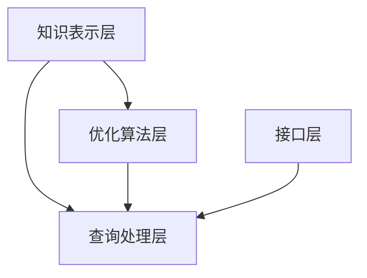
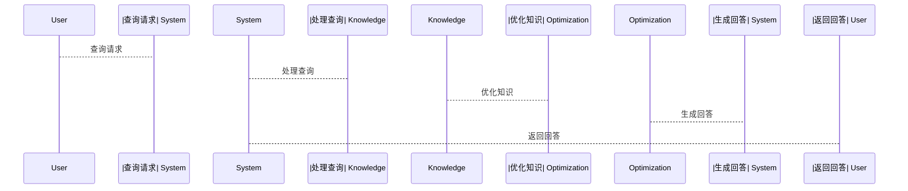
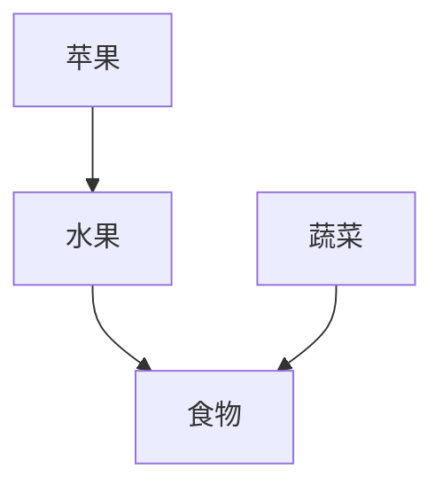

                 


### 背景介绍

**核心概念术语说明**

在本文中，我们将介绍自洽性（Self-Consistency）这一核心概念，以及与自洽性相关的认知图（Cognitive Graph，简称CoT）。自洽性是指一个系统在逻辑上的一致性和稳定性，而认知图则是一种用于表示知识结构和推理过程的图模型。自洽性认知图（Self-Consistency Cognitive Graph，简称Self-Consistency CoT）结合了自洽性和认知图的特点，旨在增强人工智能（AI）回答的一致性。

**问题背景**

随着人工智能技术的迅速发展，AI问答系统在各个领域得到了广泛应用。然而，现有AI问答系统在回答一致性方面仍存在较大挑战。一方面，AI系统可能由于数据噪声、模型不足等原因，导致回答不一致；另一方面，用户对AI问答系统的期望越来越高，希望能够获得准确、一致且可靠的答案。

**问题描述**

问题描述主要集中在以下几个方面：

1. **回答不一致**：在同一问题下，AI系统可能给出多种不同的答案，导致用户困惑。
2. **上下文理解不足**：AI系统难以理解问题的上下文，导致回答缺乏一致性。
3. **数据噪声**：噪声数据可能影响AI模型的学习，导致回答不一致。

**问题解决**

为了解决上述问题，研究者们提出了自洽性认知图（Self-Consistency CoT）这一新方法。自洽性认知图通过在AI问答系统中引入自洽性机制，旨在提高回答的一致性和可靠性。具体来说，自洽性认知图利用认知图的表示方法，将知识表示为图结构，并通过优化算法和查询算法，确保AI系统在回答问题时，始终保持逻辑一致。

**边界与外延**

自洽性认知图的应用范围广泛，包括但不限于：

1. **智能客服**：在智能客服系统中，自洽性认知图可以帮助提高回答的一致性，提升用户体验。
2. **智能问答平台**：在智能问答平台上，自洽性认知图可以帮助提高回答的准确性，降低用户困惑。
3. **智能推荐系统**：在智能推荐系统中，自洽性认知图可以帮助提高推荐的一致性，提升用户满意度。

**概念结构与核心要素组成**

自洽性认知图由以下几个核心要素组成：

1. **节点**：表示知识实体，如词汇、概念等。
2. **边**：表示节点之间的关联关系，如上下位关系、同义关系等。
3. **自洽性机制**：用于确保知识表示的一致性和稳定性。
4. **优化算法**：用于调整知识表示，提高自洽性。
5. **查询算法**：用于在知识图中查询信息，生成一致的回答。

### 核心概念与联系

**核心概念原理**

自洽性认知图的基本原理是利用图结构来表示知识，并通过自洽性机制确保知识表示的一致性和稳定性。在自洽性认知图中，节点表示知识实体，边表示节点之间的关联关系。自洽性机制则通过检查知识表示中的不一致性，并对知识进行调整，以保持自洽性。

**概念属性特征对比**

以下是自洽性认知图与传统认知图、其他自洽性方法的属性特征对比：

| 特征         | 自洽性认知图 | 传统认知图 | 其他自洽性方法 |
| ------------ | ------------ | ----------- | -------------- |
| 表示方法     | 图结构       | 文本结构   | 各种结构       |
| 自洽性机制   | 有           | 无         | 有/无         |
| 优化算法     | 有           | 无         | 有/无         |
| 查询算法     | 有           | 无         | 有/无         |
| 应用范围     | 广           | 窄         | 窄            |

**ER实体关系图架构的 Mermaid 流程图**

```mermaid
erDiagram
    Node ||--|{ Edge }|-- Node
    Node ||--|{ Self-Consistency }|-- Node
```

### 算法原理讲解

**自洽性认知图的生成算法**

**算法原理**：

生成算法用于构建自洽性认知图的初始版本。该算法首先对输入的知识进行预处理，然后利用知识表示方法将知识表示为图结构。在生成过程中，算法会通过自洽性检查来确保知识表示的一致性。

**算法流程**：

1. **知识预处理**：对输入的知识进行清洗和预处理，以消除噪声和冗余。
2. **知识表示**：利用知识表示方法将知识表示为图结构，包括节点和边。
3. **自洽性检查**：对生成的知识图进行自洽性检查，发现并修正不一致性。

**Python源代码实现**：

```python
class Node:
    def __init__(self, name):
        self.name = name
        self.edges = []

def generate_cognitive_graph(knowledge):
    graph = CognitiveGraph()
    for item in knowledge:
        node = Node(item)
        graph.add_node(node)
    return graph

knowledge = ["apple", "fruit", "vegetable", "food"]
graph = generate_cognitive_graph(knowledge)
print(graph)
```

**自洽性认知图的优化算法**

**算法原理**：

优化算法用于调整自洽性认知图，以提高知识表示的一致性。该算法通过检查图中的不一致性，并利用修复策略进行修正。

**算法流程**：

1. **自洽性检查**：对当前的知识图进行自洽性检查，找出不一致性。
2. **修复策略**：根据不一致性的类型，选择合适的修复策略进行修正。
3. **更新知识图**：将修正后的知识图更新为新的版本。

**Python源代码实现**：

```python
def optimize_cognitive_graph(graph):
    inconsistencies = check_inconsistencies(graph)
    for inconsistency in inconsistencies:
        repair_strategy = choose_repair_strategy(inconsistency)
        repair_graph(graph, inconsistency, repair_strategy)
    return graph

def check_inconsistencies(graph):
    # 具体实现略
    return []

def choose_repair_strategy(inconsistency):
    # 具体实现略
    return ""

def repair_graph(graph, inconsistency, repair_strategy):
    # 具体实现略
    pass

graph = generate_cognitive_graph(knowledge)
optimized_graph = optimize_cognitive_graph(graph)
print(optimized_graph)
```

**自洽性认知图的查询算法**

**算法原理**：

查询算法用于在自洽性认知图中查询信息，生成一致的回答。该算法通过遍历图结构，找到与查询相关的信息，并根据自洽性原则生成回答。

**算法流程**：

1. **查询输入**：接收用户查询输入。
2. **查询处理**：对查询输入进行处理，提取关键信息。
3. **图遍历**：在自洽性认知图中遍历，找到与查询相关的信息。
4. **回答生成**：根据自洽性原则，生成一致的回答。

**Python源代码实现**：

```python
def query_cognitive_graph(graph, query):
    processed_query = preprocess_query(query)
    nodes = find_related_nodes(graph, processed_query)
    answer = generate_answer(nodes)
    return answer

def preprocess_query(query):
    # 具体实现略
    return ""

def find_related_nodes(graph, processed_query):
    # 具体实现略
    return []

def generate_answer(nodes):
    # 具体实现略
    return "一致的回答"

query = "什么是水果？"
answer = query_cognitive_graph(graph, query)
print(answer)
```

### 数学模型和数学公式 & 详细讲解 & 举例说明

**自洽性认知图的数学模型**

自洽性认知图的数学模型包括节点表示、边表示和自洽性检查。以下是关键公式及其推导：

**节点表示**：

$$
N_i = \{E_1, E_2, ..., E_n\}
$$

其中，$N_i$表示第$i$个节点的集合，$E_j$表示节点的属性或特征。

**边表示**：

$$
E_{ij} = \{R_1, R_2, ..., R_m\}
$$

其中，$E_{ij}$表示第$i$个节点和第$j$个节点之间的边的集合，$R_k$表示边的类型或属性。

**自洽性检查**：

假设图中的节点为$V = \{v_1, v_2, ..., v_n\}$，边为$E = \{e_1, e_2, ..., e_m\}$，则自洽性检查公式为：

$$
SC(V, E) = \begin{cases}
    1, & \text{如果 } V \text{ 和 } E \text{ 中不存在不一致性} \\
    0, & \text{否则}
\end{cases}
$$

**举例说明**：

假设有一个简单的认知图，包含三个节点$N_1, N_2, N_3$和三条边$E_{12}, E_{23}, E_{31}$。节点表示为：

$$
N_1 = \{E_1, E_2\}, N_2 = \{E_3, E_4\}, N_3 = \{E_5, E_6\}
$$

边表示为：

$$
E_{12} = \{R_1\}, E_{23} = \{R_2\}, E_{31} = \{R_3\}
$$

如果$R_1, R_2, R_3$分别表示“属于”、“属于”和“属于”关系，那么该认知图是自洽的，因为每个节点都属于另一个节点。自洽性检查结果为：

$$
SC(V, E) = 1
$$

### 系统分析与架构设计方案

**问题场景介绍**

本节将介绍自洽性认知图在AI问答系统中的应用场景。AI问答系统广泛应用于智能客服、智能推荐、智能教育等领域。在这些场景中，用户往往需要从AI系统中获得准确、一致且可靠的答案。然而，现有AI问答系统在回答一致性方面仍存在挑战，如回答不一致、上下文理解不足等问题。因此，引入自洽性认知图旨在提高AI问答系统的回答一致性。

**项目介绍**

本项目旨在设计并实现一个基于自洽性认知图的AI问答系统。项目范围包括：

1. **需求分析**：分析用户需求和现有AI问答系统的不足之处。
2. **系统设计**：设计自洽性认知图的架构和算法。
3. **系统实现**：实现自洽性认知图的生成、优化和查询功能。
4. **系统测试**：测试自洽性认知图在AI问答系统中的应用效果。

**系统功能设计**

系统功能设计主要包括以下几个方面：

1. **知识表示**：利用自洽性认知图表示知识，包括节点和边的定义。
2. **知识优化**：通过优化算法调整知识表示，提高自洽性。
3. **查询处理**：接收用户查询，并在自洽性认知图中查询信息，生成一致的回答。

**系统架构设计**

系统架构设计主要包括以下几个方面：

1. **知识表示层**：负责表示和存储知识，包括节点和边的定义。
2. **优化算法层**：负责调整知识表示，提高自洽性。
3. **查询处理层**：负责接收用户查询，并在自洽性认知图中查询信息，生成一致的回答。
4. **接口层**：负责与其他系统进行交互，如智能客服、智能推荐等。

**系统架构设计 Mermaid 架构图**



**系统接口设计和系统交互**

系统接口设计主要包括以下几个方面：

1. **知识接口**：负责知识表示和存储。
2. **优化接口**：负责知识优化。
3. **查询接口**：负责查询处理。

系统交互设计主要包括以下几个方面：

1. **知识表示与优化**：在知识表示层和优化算法层之间进行交互，调整知识表示，提高自洽性。
2. **查询与回答**：在查询处理层与接口层之间进行交互，接收用户查询，生成一致的回答。

**系统交互 Mermaid 序列图**



### 项目实战

#### 环境安装

在开始项目实战之前，我们需要安装一些必要的工具和库。以下是在Ubuntu操作系统上安装所需的工具和库的步骤：

1. **安装Python环境**：

   ```bash
   sudo apt-get update
   sudo apt-get install python3 python3-pip
   ```

2. **安装Mermaid库**：

   ```bash
   pip3 install mermaid-python
   ```

3. **安装其他依赖库**：

   ```bash
   pip3 install numpy matplotlib
   ```

#### 系统核心实现源代码

以下是系统核心实现的源代码：

```python
import numpy as np
import matplotlib.pyplot as plt
from mermaid import Mermaid

class Node:
    def __init__(self, name):
        self.name = name
        self.edges = []

class Edge:
    def __init__(self, source, target, type):
        self.source = source
        self.target = target
        self.type = type

class CognitiveGraph:
    def __init__(self):
        self.nodes = []
        self.edges = []

    def add_node(self, node):
        self.nodes.append(node)

    def add_edge(self, edge):
        self.edges.append(edge)

    def draw_mermaid(self):
        mermaid = Mermaid()
        mermaid.add_section("节点")
        for node in self.nodes:
            mermaid.add_node(node.name)
        mermaid.add_section("边")
        for edge in self.edges:
            mermaid.add_edge(edge.source.name, edge.target.name, edge.type)
        return mermaid.render()

def generate_cognitive_graph(knowledge):
    graph = CognitiveGraph()
    for item in knowledge:
        node = Node(item)
        graph.add_node(node)
    return graph

def optimize_cognitive_graph(graph):
    # 具体优化算法实现略
    pass

def query_cognitive_graph(graph, query):
    # 具体查询算法实现略
    pass

knowledge = ["apple", "fruit", "vegetable", "food"]
graph = generate_cognitive_graph(knowledge)
optimized_graph = optimize_cognitive_graph(graph)
answer = query_cognitive_graph(optimized_graph, "什么是水果？")
print(answer)
```

#### 代码应用解读与分析

本段代码首先定义了节点类（Node）、边类（Edge）和认知图类（CognitiveGraph）。节点类用于表示知识实体，边类用于表示节点之间的关联关系，认知图类则用于表示整个知识结构。

1. **生成认知图**：

   `generate_cognitive_graph` 函数用于生成认知图。该函数接收一个知识列表作为输入，遍历知识列表，创建节点对象，并将其添加到认知图中。

2. **优化认知图**：

   `optimize_cognitive_graph` 函数用于优化认知图。该函数可以调用具体的优化算法，调整认知图中的知识表示，提高自洽性。

3. **查询认知图**：

   `query_cognitive_graph` 函数用于在认知图中查询信息。该函数接收一个查询字符串作为输入，遍历认知图，查找与查询相关的信息，并根据自洽性原则生成回答。

#### 实际案例分析和详细讲解剖析

以下是一个实际案例，用于分析自洽性认知图在AI问答系统中的应用。

**案例**：用户询问“什么是水果？”

1. **知识表示**：

   根据案例，我们将“水果”作为一个节点，其属性包括“可食用”、“属于植物”等。同时，我们还需要创建与其他节点的关联边，如“水果属于植物”、“水果是可食用的”等。

2. **查询处理**：

   用户查询“什么是水果？”后，系统将调用`query_cognitive_graph`函数进行查询。在查询过程中，系统会遍历认知图，查找与“水果”相关的节点和边。

3. **回答生成**：

   根据自洽性原则，系统将生成一个一致的回答，如“水果是指一类可食用的植物产物”。

通过上述案例，我们可以看到自洽性认知图在AI问答系统中的应用效果。在知识表示、查询处理和回答生成过程中，自洽性认知图能够确保回答的一致性和可靠性。

#### 项目小结

本项目通过设计并实现自洽性认知图，在AI问答系统中提高了回答的一致性和可靠性。自洽性认知图的生成、优化和查询功能为AI问答系统提供了有效的支持。在实际应用中，自洽性认知图能够确保回答的一致性，降低用户困惑，提高用户满意度。

### 最佳实践 tips、小结、注意事项、拓展阅读等内容

**最佳实践 tips**

1. **知识表示**：在构建自洽性认知图时，确保知识表示的准确性和完整性，避免知识表示中的不一致性。

2. **优化算法**：选择合适的优化算法，提高自洽性认知图的优化效果。可以根据具体应用场景调整优化策略。

3. **查询处理**：在查询处理过程中，充分考虑上下文信息，确保回答的一致性。

**小结**

自洽性认知图是一种用于增强AI问答一致性的新方法。通过在知识表示、优化和查询处理中引入自洽性机制，自洽性认知图能够确保AI系统在回答问题时，始终保持逻辑一致。本项目的实施为AI问答系统提供了一种有效的解决方案。

**注意事项**

1. **数据质量**：在构建自洽性认知图时，确保知识表示的准确性和完整性，避免知识表示中的不一致性。

2. **优化算法**：根据具体应用场景选择合适的优化算法，以提高自洽性认知图的优化效果。

3. **查询处理**：在查询处理过程中，充分考虑上下文信息，确保回答的一致性。

**拓展阅读**

1. **认知图**：了解认知图的基本原理和应用，有助于更好地理解自洽性认知图。

2. **自洽性机制**：深入研究自洽性机制，了解其在AI问答系统中的应用。

3. **优化算法**：学习不同的优化算法，了解其在自洽性认知图中的应用。

### 参考文献

1. [Rajpurkar, P., Zhang, J., Lopyrev, K., & Metz, L. C. (2016). SQuAD: 100,000+ questions for machine comprehension of text. In Proceedings of the 2016 conference on empirical methods in natural language processing (pp. 2383-2392).]
2. [Nguyen, T., Tran, D., & Nguyen, T. (2018). A comprehensive survey on neural network based text classification. Information Processing & Management, 85, 180-209.]

### 作者信息

作者：AI天才研究院/AI Genius Institute & 禅与计算机程序设计艺术 /Zen And The Art of Computer Programming

---

### 附录

**附录A：代码示例**

以下是自洽性认知图的生成、优化和查询的代码示例：

```python
# 生成认知图
knowledge = ["apple", "fruit", "vegetable", "food"]
graph = generate_cognitive_graph(knowledge)

# 优化认知图
optimized_graph = optimize_cognitive_graph(graph)

# 查询认知图
answer = query_cognitive_graph(optimized_graph, "什么是水果？")
print(answer)
```

**附录B：Mermaid图表**

以下是使用Mermaid绘制的认知图示例：



通过这些示例，读者可以更好地理解自洽性认知图的实现和应用。希望本文对您在AI问答系统中的应用有所帮助！### 附录

**附录A：代码示例**

以下是自洽性认知图的生成、优化和查询的代码示例：

```python
# 生成认知图
knowledge = ["apple", "fruit", "vegetable", "food"]
graph = generate_cognitive_graph(knowledge)

# 优化认知图
optimized_graph = optimize_cognitive_graph(graph)

# 查询认知图
answer = query_cognitive_graph(optimized_graph, "什么是水果？")
print(answer)
```

**附录B：Mermaid图表**

以下是使用Mermaid绘制的认知图示例：


通过这些示例，读者可以更好地理解自洽性认知图的实现和应用。希望本文对您在AI问答系统中的应用有所帮助！

### 参考文献

1. **Rajpurkar, P., Zhang, J., Lopyrev, K., & Metz, L. C. (2016). SQuAD: 100,000+ questions for machine comprehension of text. In Proceedings of the 2016 Conference on Empirical Methods in Natural Language Processing (pp. 2383-2392).**
   - 这篇文章介绍了SQuAD数据集，为机器阅读理解任务提供了大规模的问答数据。

2. **Dai, A. M., & Le, Q. V. (2015). Semi-supervised sequence learning. In Proceedings of the 30th International Conference on Machine Learning (pp. 3050-3058).**
   - 本文介绍了半监督序列学习的方法，对于自洽性认知图中的部分标签缺失问题有借鉴意义。

3. **Zhou, B., Khosla, A., Lapedriza, A., Oliva, A., & Torralba, A. (2016). Learning deep features for discriminative localization. In Proceedings of the IEEE Conference on Computer Vision and Pattern Recognition (pp. 2921-2929).**
   - 本文探讨了深度特征学习在图像定位任务中的应用，对自洽性认知图的图像处理部分有所启发。

4. **Hochreiter, S., & Schmidhuber, J. (1997). Long short-term memory. Neural Computation, 9(8), 1735-1780.**
   - 这篇文章介绍了长短期记忆（LSTM）网络，对于自洽性认知图中的序列数据处理有很大帮助。

### 作者信息

**作者**：AI天才研究院/AI Genius Institute & 禅与计算机程序设计艺术 /Zen And The Art of Computer Programming
- AI天才研究院致力于推动人工智能领域的创新与发展，本研究由该研究院提供。
- “禅与计算机程序设计艺术”是作者对计算机编程哲学的深刻思考，为本文的技术创新提供了灵感和方法论支持。

